# "Carnot batteries for heat and power coupling : energy, exergy, economic and environmental (4E) analysis"

Laterre, Antoine

# ABSTRACT

With the transition to intermittent renewable energies, the need for energy storage is expected to grow significantly. Moreover, the technologies required for this transition will lead to a substantial rise in demand for strategic materials, making their rational and optimal use essential. It is therefore crucial to develop various storage technologies, each tailored to meet specific needs. In this context, Carnot batteries, which store energy in the form of heat and convert it to electricity using heat pumps and heat engines, emerge as true Swiss Army knives for multi-energy systems, particularly benefiting from the heat-to-power coupling. However, for Carnot batteries to effectively contribute to the energy transition, optimal thermodynamic and economic configurations must still be identified, both in terms of use case and technology. Specifically, medium-temperature systems (< 150°C) have been scarcely investigated within literature. To broadly explore this challenge, this thesis proposes a three-pronged approach: • Thermodynamic optimisation, aimed at identifying the configurations that deliver maximum storage efficiency while aligning with diverse technological preferences; • Techno-economic optimisation, based on two case studies, to characterise and understand how to improve their financial performance and their contribution to energy systems; • Environmental optimisation, to identify the distinctive environmental benefits of Carnot batteries compared to more popular electro-chemical batteries. Importantly, the work proposes several methodological innovation...

# CITE THIS VERSION

Laterre, Antoine. *Carnot batteries for heat and power coupling : energy, exergy, economic and environmental (4E) analysis.* Prom. : Contino, Francesco ; Lemort, Vincent http://hdl.handle.net/2078.1/302587

Le dépôt institutionnel DIAL est destiné au dépôt et à la diffusion de documents scientifiques émanant des membres de l'UCLouvain. Toute utilisation de ce document à des fins lucratives ou commerciales est strictement interdite. L'utilisateur s'engage à respecter les droits d'auteur liés à ce document, principalement le droit à l'intégrité de l'œuvre et le droit à la paternité. La politique complète de copyright est disponible sur la page [Copyright policy](https://hdl.handle.net/2078/copyright_policy)

DIAL is an institutional repository for the deposit and dissemination of scientific documents from UCLouvain members. Usage of this document for profit or commercial purposes is stricly prohibited. User agrees to respect copyright about this document, mainly text integrity and source mention. Full content of copyright policy is available at [Copyright policy](https://hdl.handle.net/2078/copyright_policy)

# Carnot batteries for heat and power coupling

Energy, Exergy, Economic and Environmental (4E) analysis

# Antoine LATERRE

Thesis submitted in partial fulfillment of the requirements for the degree of *Docteur en sciences de l'ingénieur et technologie*

# Dissertation committee:

| Prof. Francesco CONTINO    | Supervisor | UCLouvain, Belgium |  |  |  |
|----------------------------|------------|--------------------|--|--|--|
| Prof. Vincent LEMORT       | Supervisor | ULiège, Belgium    |  |  |  |
| Prof. Nicolas MOËS         | President  | UCLouvain, Belgium |  |  |  |
| Dr. Diederik COPPITTERS | Secretary  | UCLouvain, Belgium |  |  |  |
| Prof. Sylvain QUOILIN      |            | ULiège, Belgium    |  |  |  |
| Prof. Ward DE PAEPE     |            | UMONS, Belgium     |  |  |  |
| Prof. Burak ATAKAN         |            | Uni-DUE, Germany   |  |  |  |

June 2025

# **Abstract**

WITH the transition to intermittent renewable energy sources, the need for energy storage is expected to increase significantly. Moreover, the technologies required for this transition will lead to a substantial rise in demand for strategic materials, making their rational and optimal use essential. It is therefore crucial to develop various storage technologies, each tailored to meet specific needs. In this context, Carnot batteries, which store energy in the form of heat and convert it using heat pumps and heat engines, emerge as true Swiss Army knives for multi-energy systems, particularly benefiting from the heat-to-power coupling. However, for Carnot batteries to effectively contribute to the energy transition, optimal thermodynamic and economic configurations must still be identified, both in terms of use case and technology. More specifically, low-temperature systems (< 150°C) have been scarcely investigated within literature. To broadly explore this challenge, this thesis proposes a three-pronged approach:

- (i) Thermodynamic optimisation, aimed at identifying the configurations that deliver maximum performance while aligning with diverse technological preferences;
- (ii) **Techno-economic optimisation**, based on two case studies, to characterise and understand how to improve their financial performance and their contribution to energy systems;
- **(iii) Environmental optimisation**, to identify the distinctive environmental benefits of Carnot batteries compared to more popular electro-chemical batteries.

Importantly, our work proposes several methodological innovations. Regarding thermodynamic design, the 'Modeling to Generate Alternatives' approach was applied for the first time to the optimisation of thermodynamic cycles, in order to investigate a wide range of Carnot battery configurations and identify the necessary trade-offs. Regarding techno-economic optimisation, Linear Programming was used, with the goal of optimising both the design and operations of the system. Lastly, we report one of the first Life Cycle Assessment of a Carnot battery, using a prospective approach to challenge the widely-held belief of reduced impact compared to electro-chemical batteries. Due to its superior performance for

# ⋆ | Abstract

low-temperature systems, the Carnot battery technology examined in this work is based on vapour compression heat pumps, sensible heat storage in pressurised water tanks, and organic Rankine cycles.

The results show that identifying optimal designs is not straightforward, as powerto-power efficiency (affecting operational costs) and electrical energy density (affecting capital expenditure) are generally conflicting objectives. Additionally, depending on design parameters such as storage temperature, cycle regime, or fluid selection, not all technological preferences can be simultaneously satisfied. Tradeoffs in performance must therefore be discussed to identify the design best suited to the intended integration. For example, opting for volumetric compression and expansion machines, and tolerating moderate pressurisation of the storage (2.5 bar), efficiencies between 26% and 33% could be achieved, with corresponding energy densities ranging from 3.7 kWhel/m3 to 2.1 kWhel/m3 . The economic analysis reveals that, under conservative costs assumptions, Carnot batteries are financially viable–though not competitive with electro-chemical batteries. Two cases are specifically examined: (i) Electricity storage to improve energy self-sufficiency in a data centre fed by a photovoltaic system, and where waste heat helps increase the Carnot battery efficiency; (ii) Combined heat and power storage in residential applications. For both applications, opportunities for improving the Carnot battery design are thoroughly discussed, pointing towards enhanced performance potential. Finally, the environmental analysis shows that Carnot batteries do not provide a substantial benefit in terms of greenhouse gas emissions compared to lithium-ion batteries, mainly due to their much lower efficiency, which requires increased deployment of renewable energy sources. However, they offer a distinct advantage in terms of mineral resource consumption, which could be further reduced by replacing steel with other materials, such as plastic, for the construction of the thermal storage.

In conclusion, although Carnot batteries suffer from lower technical and economic performance compared to technologies such as electro-chemical batteries, they remain a flexibility option worth considering for heat and power coupling, and for reducing reliance on strategic materials. The recommendations at the end of this thesis also provide avenues for improving their performance.

# **Acknowledgments**

A thesis is certainly not just a 200-page brick. Beyond being an achievement, it is also a wonderful opportunity to develop oneself in complete freedom and to better understand the world around us. I would therefore like to thank all the individuals and organisations who, in one way or another, supported me throughout the completion of this journey. First and foremost, I express my sincere gratitude to all the citizens of the Kingdom of Belgium, who, through the taxes they pay, fund scientific research. I also thank the Fonds National de la Recherche Scientifique for the trust placed in young researchers through the doctoral grants it finances. I also would like to thank each member of my jury for taking the time to engage with my work, in order to assess it, to challenge my curiosity and to contribute to the discussion on Carnot batteries.

Next, I would like to thank my two supervisors, Prof. Francesco Contino and Prof. Vincent Lemort. Thank you, Francesco, for placing your trust in me by agreeing to supervise my work on a new research topic. This allowed me to apply my passion for thermodynamics to the service of the energy transition. I sincerely appreciated the quality and frankness of our discussions. I am also grateful for the energy, passion, and care you dedicate to training young researchers. Thank you for offering us such a stimulating, enriching, and fulfilling research environment. Thank you, Vincent, for opening the doors of your formidable thermodynamics laboratory to us and for generously sharing your expertise on this project. Thank you for being so passionate about this old science; I believe you really contribute to keeping it alive by confronting it with the challenges of our time. Your enthusiasm for ideas and projects, sometimes even outlandish ones, is a real source of stimulation for the creativity of the researchers you mentor.

I would now like to thank all the other people who supported me throughout this work, offering advice, stimulating my thoughts, and who have also enabled me to open up to many topics beyond Carnot batteries. First of all, thanks to Gauthier Limpens for welcoming me and putting me in touch with Vincent's team. Thanks to Olivier Dumont, who helped me get off to a strong start and introduced me to the Carnot battery community. Thank you to Robin Tassenoy and his team at UGent for their hospitality.

# ⋆ | Acknowledgments

Thank you to my colleagues and friends from the Sustainable Energy Group– Xavier Rixhon, Martin Colla, Véronique Dias, Arnaud Rouanet, Paolo Thiran, Hervé Jeanmart, Zakarie Bruyr, Diederik Coppitters, Yanan Huo, Sara Spano, Aggelos Gaitanis, Nicolas Ghuys, Arthur Lefebvre, Pierre Jacques, Mattéo Hauglustaine, Zoé Dassesse, Sébastien Meyer, Baptiste Buxant, Nicolas Parmentier, Charles Lhuillier, and all the others–for the great atmosphere and the dynamism of our research team. I would also like to thank my colleagues at the TFL and all the presidents of the CFD for all the good times we have shared. Thank you to Frank Hesbois, Victor Lhoest, and the CREDEM laboratory for bringing all our calculations to life.

Thanks to my colleagues from the Thermodynamics Laboratory–Alanis Zeoli, Mazarine Roquet, Javier Vega, Camila Davila, Nicolas Leclercq, Sylvain Quoilin, Samuel Gendebien, Elise Neven, Natalia Kozlowska, Olivier Thome, Frédéric Ransy, Umair Tareen, Aitor Cendoya, Bentao Guo, Basile Chaudoir, Simon Marichal, Julien Jacquemin, Richard Labenda, Bernard Loli, Jose Concha, and all the others–for the warm welcome in Liège, for the conferences and especially for the barbecues.

Thanks to the students I had the pleasure to mentor for their Master's theses– Vincent Laguna, Thibault Servais, Thomas Gallez, Louis Gayina, Emma Jertila, Mathis Collot, Mattéo Hauglustaine, Paulin Eliat-Eliat, and Martin Rampanelli. In you, I found allies with whom I could speak the same language.

Thank you to Sébastien Colla, Thibault Pirson, Anne Rubbens, Ramy Moumneh, Justine Lebrun, Louis Golard, Marie-Charlotte Sparenberg, Margo Hauwaert, Rémy Rouxhet, Thibaut Heremans, Oriane de Leuze, Simon de Wergifosse, Alex Pip, Aurélia Hernandez, Nicolas Roisin, Robin Dethienne, Jeanne Evrard and all the members of the Ingés en Transition collective. Thank you for challenging and expanding the boundaries of what engineering can be.

I would also like to thank my parents, brother and sister, who helped me understand just how much education is a source of emancipation, freedom and personal growth. Thanks also to all my friends outside the university for their advice. You gave me a glimpse of what the outside world looks like and helped me better grasp how I could contribute to it from within the university. Finally, thank you to Noémie who, in spite of herself and at the cost of many hours of sleep, has become an expert in Carnot batteries. Having you as my sherpa throughout this journey was a real privilege. Thank you for encouraging me during times of doubt, for taking the time to help me improve my communication skills, and for making the effort to understand the content of my research. It is a true reflection of your generosity. Keep doing beautiful things, this is what fuels my ambition.

Sincerely, thank you to everyone (even those I have forgotten)!

# **Contents**

|   | Abstract     |                                                      | i   |
|---|--------------|------------------------------------------------------|-----|
|   |              | Acknowledgments                                      | iii |
|   |              | List of publications                                 | ix  |
|   | Nomenclature |                                                      | xi  |
| 1 | Introduction |                                                      | 1   |
|   | 1.1          | Context                                              | 1   |
|   | 1.1.1        | Energy storage                                       | 1   |
|   | 1.1.2        | Carnot batteries                                     | 3   |
|   | 1.2          | Thesis objectives and outline                        | 8   |
|   | 1.2.1        | Research questions                                   | 8   |
|   | 1.2.2        | Thesis outline                                       | 10  |
|   | 1.3          | The landscape of Carnot batteries                    | 12  |
|   | 1.3.1        | Concepts and technologies                            | 13  |
|   | 1.3.2        | Applications and economics                           | 23  |
|   | 1.3.3        | Key messages                                         | 28  |
| I |              | Thermodynamic analysis                            |     |
| 2 |              | From elementary theory to practical cycles modelling | 31  |
|   | 2.1          | Simplified thermodynamic analysis                    | 31  |
|   | 2.1.1        | Sources of irreversibilities                         | 31  |
|   | 2.1.2        | Combining external and internal irreversibilities    | 35  |
|   | 2.2          | Thermodynamic model for Rankine Carnot batteries     | 36  |
|   | 2.2.1        | Physical model                                       | 37  |

# ⋆ | Contents

|    | 2.2.2 | 42 Numerical model                                             |
|----|-------|-------------------------------------------------------------------|
|    | 2.2.3 | 44 Energy and exergy analyses                                  |
| 3  |       | Performance mapping across an extended domain 47               |
|    | 3.1   | Mapping the Carnot battery trilemma 48                         |
|    | 3.2   | Model and methods 50                                           |
|    | 3.2.1 | 50 System model                                                |
|    | 3.2.2 | 52 Optimisation problem                                        |
|    | 3.3   | Results of performance optimisation 55                         |
|    | 3.3.1 | 56 Performance mapping                                         |
|    | 3.3.2 | 66 Further design analyses                                     |
|    | 3.3.3 | 72 Multi-criteria analyses                                     |
|    | 3.4   | Summary and discussions 74                                     |
|    | 3.4.1 | 74 Main results                                                |
|    | 3.4.2 | 75 Perspectives                                                |
|    | 3.5   | Key messages 76                                                |
| 4  |       | Near-optimal design to generate alternatives 77                |
|    | 4.1   | Motivation 78                                                  |
|    | 4.2   | Model and methods 80                                           |
|    | 4.2.1 | 80 Carnot batteries model                                      |
|    | 4.2.2 | 83 Near-optimal design with evolutionary algorithms            |
|    | 4.2.3 | 86 Key performance indicators and technological parameters     |
|    | 4.3   | Results 87                                                     |
|    | 4.3.1 | 87 Identifying the Pareto fronts                               |
|    | 4.3.2 | 90 From the Pareto to understanding the main drivers           |
|    | 4.3.3 | 95 Choosing the Carnot battery that suits your own preferences |
|    | 4.4   | Summary and discussions 99                                     |
|    | 4.4.1 | 99 Main results                                                |
|    | 4.4.2 | 100 Perspectives                                               |
|    | 4.5   | Key messages 101                                               |
|    |       |                                                                   |
| II |       | Techno-economic analysis                                       |
| 5  |       | Waste heat recovery in data centres with photovoltaics 105     |
|    | 5.1   | Need for realistic techno-economic analyses 106                |
|    | 5.2   | Case study and scenarios description 107                       |
|    | 5.2.1 | 108 Scenario A: air-cooled data centres (indirect cooling)     |
|    | 5.2.2 | 111 Scenario B: water-cooled data centres (direct cooling)     |

|     | 5.2.3          | 111 Scenario C: standalone air-sourced Carnot battery       |
|-----|----------------|----------------------------------------------------------------|
|     | 5.3            | Model and methods 112                                       |
|     | 5.3.1          | 112 Technical model                                         |
|     | 5.3.2          | 115 Power management strategy                               |
|     | 5.3.3          | 116 Economic model                                          |
|     | 5.3.4          | 120 Optimisation problem                                    |
|     | 5.3.5          | 122 Uncertainty quantification                              |
|     | 5.4 Results | 123                                                            |
|     | 5.4.1          | 123 Multi-criteria analysis                                 |
|     | 5.4.2          | 131 Detailed designs analysis                               |
|     | 5.5            | Summary and discussions 134                                 |
|     | 5.5.1          | 135 Main results                                            |
|     | 5.5.2          | 136 Perspectives                                            |
|     | 5.6            | Key messages 138                                            |
| 6   |                | Integrated residential heat and power management 139        |
|     | 6.1            | Need for optimised operations to increase profitability 140 |
|     | 6.2            | Case study and scenarios description 141                    |
|     | 6.3            | Model and methods 144                                       |
|     | 6.3.1          | 144 Economic model                                          |
|     | 6.3.2          | 146 Optimisation model                                      |
|     | 6.3.3          | 152 Uncertainty quantification                              |
|     | 6.4 Results | 153                                                            |
|     | 6.4.1          | 153 Optimum system design based on investment costs         |
|     | 6.4.2          | 157 Analysis of daily and seasonal operations               |
|     | 6.4.3          | 160 Impact of electricity pricing model                     |
|     | 6.4.4          | 163 Sensitivity to uncertainties                            |
|     | 6.4.5          | 165 Extending the results to other locations                |
|     | 6.5            | Summary and discussions 166                                 |
|     | 6.5.1          | 167 Main results                                            |
|     | 6.5.2          | 167 Discussions                                             |
|     | 6.5.3          | 169 Perspectives                                            |
|     | 6.6            | Key messages 170                                            |
|     |                |                                                                |
| III |                | Environmental analysis                                      |
| 7   |                | Comparative life cycle assessment 173                       |
|     | 7.1            | Overview of the LCA methodology 174                         |
|     |                |                                                                |

# ⋆ | Contents

| 7.2          | Model and methods                                         | 176   |
|--------------|-----------------------------------------------------------|-------|
| 7.2.1        | Goal and scope definition                                 | 176   |
| 7.2.2        | Inventory analysis                                        | 179   |
| 7.3          | Results and interpretation                                | 183   |
| 7.3.1        | Reference designs for Pisa                                | 183   |
| 7.3.2        | Impact assessment                                         | 188   |
| 7.3.3        | Comparison with Brussels                                  | 194   |
| 7.4          | Summary and discussions                                   | 195   |
| 7.4.1        | Main results                                              | 195   |
| 7.4.2        | Perspectives                                              | 196   |
| 7.5          | Key messages                                              | 198   |
|              | Conclusions and Perspectives                              | 199   |
|              | Main outcomes                                             | 200   |
|              | Recommendations and guidance                              | 202   |
|              | Limitations and perspectives                              | 204   |
|              | Final thoughts                                            | 206   |
| Appendices   |                                                           | I     |
| A            | Fundamentals of thermodynamics                            | I     |
| A.1          | Lorenz cycle for non-isothermal heat transfers            | I     |
| A.2          | Curzon-Ahlborn model for endoreversible cycles            | IV    |
| A.3          | Optimum storage temperature for TI-PTES                   | V     |
| B            | Advanced thermodynamic analyses                           | VII   |
| B.1          | Technological constraints and optimum TI-PTES cycles      | VII   |
| B.2          | Extended list of fluids for near-optimal analyses         | IX    |
| B.3          | Effect of isentropic efficiency and storage temperature   | IX    |
| B.4          | Grassman diagrams for exergy losses in the Carnot battery | XII   |
| C            | Details on the optimisation methods                       | XIV   |
| C.1          | Convergence of thermodynamic design optimisation          | XIV   |
| C.2          | Convergence of near-optimal alternatives generation       | XIV   |
| D            | Complementary results for residential case (Chapter 6) | XVI   |
| D.1          | Results for Brussels case study                           | XVI   |
| D.2          | Analysis of representative days                           | XX    |
| E            | Complementary results for residential case (Chapter 7) | .XXIV |
| E.1          | Grid and storage operations                               | .XXIV |
| E.2          | Results for Brussels case study                           | .XXVI |
| Bibliography |                                                           | XXVII |

# **List of publications**

# **Related journal papers**

- JP1. A. Laterre, O. Dumont, V. Lemort and F. Contino, "Is waste heat recovery a promising avenue for the Carnot battery? Techno-economic optimisation of an electric booster-assisted Carnot battery integrated into different data centres", *Energy Conversion and Management*, vol. 301, p. 118030, Feb. 2024. [DOI: 10.1016/j.enconman.2023.118030](https://doi.org/10.1016/j.enconman.2023.118030)
- JP2. A. Laterre, O. Dumont, V. Lemort and F. Contino, "Extended mapping and systematic optimisation of the Carnot battery trilemma for sub-critical cycles with thermal integration", *Energy*, vol. 304, p. 132006, Sep. 2024. [DOI: 10.1016/j.energy.2024.132006](https://doi.org/10.1016/j.energy.2024.132006)
- JP3. R. Tassenoy, A. Laterre, V. Lemort, F. Contino, M. De Paepe, and S. Lecompte, "Assessing the influence of compressor inertia on the dynamic performance of large-scale vapor compression heat pumps for Carnot batteries", *Journal of Energy Storage*, vol. 101, p. 113948, Nov. 2024. [DOI: 10.1016/j.est.2024.113948](https://doi.org/10.1016/j.est.2024.113948)
- JP4. A. Laterre, G.F. Frate, V. Lemort and F. Contino, "Carnot batteries for integrated heat and power management in residential applications: A technoeconomic analysis", *Energy Conversion and Management*, vol. 325, p. 119207, Feb. 2025.
  - [DOI: 10.1016/j.enconman.2024.119207](https://doi.org/10.1016/j.enconman.2024.119207)
- JP5. A. Laterre, D. Coppitters, V. Lemort and F. Contino, "Designing custom Carnot batteries that suit your preferences: A near-optimal approach", *Journal of Energy Storage* (submitted, under revision).

# **Related conference papers**

- CP1. A. Laterre, O. Dumont, V. Lemort and F. Contino, "Design Optimisation and Global Sensitivity Analysis of a Carnot Battery Towards Integration in a Data Centre under Techno-Economic Uncertainties", in *Proceedings of the 5th South East Europe Conference on Sustainable Development of Energy, Water and Environment Systems (5th SEE SDEWES)*, May 2022.
- CP2. A. Laterre, O. Dumont, V. Lemort and F. Contino, "Systematic and multicriteria optimisation of subcritical thermally integrated Carnot batteries (TI-PTES) in an extended domain", in *Proceedings of the 7th International Seminar on ORC Power Systems (ORC2023)*, pp. 119–129, Sep. 2023. [DOI: 10.12795/9788447227457\\_19](https://dx.doi.org/10.12795/9788447227457_19)

# **Unrelated journal papers**

- UJP1. A. Gaitanis, A. Laterre, F. Contino and W. De Paepe, "Towards real time transient mGT performance assessment: effective prediction using accurate component modelling techniques", *Journal of the Global Power and Propulsion Society*, vol. 6, pp. 96–105, Jul. 2022.
  - [DOI: 10.33737/jgpps/150359](https://doi.org/10.33737/jgpps/150359)
- UJP2. M.U. Tareen, S. Meyer, P. Thiran, A. Hernandez, A. Laterre and S. Quoilin, "A low demand energy transition pathway for Europe with high temporal resolution", *Joule* (to be submitted).

# **Unrelated conference papers**

UCP1. M.U. Tareen, S. Quoilin, A. Laterre, S. Meyer, P. Thiran and A. Hernandez, "Modeling the impact of energy sufficiency on European integrated energy systems", in *37th International Conference on Efficiency, Cost, Optimization, Simulation and Environmental Impact of Energy Systems (ECOS 2024)*, Jun. 2024, pp. 1351–1362.

[DOI: 10.52202/077185](https://doi.org/10.52202/077185)

# **Nomenclature**

# *Acronyms*

AEC Annualised Energy Cost

BAT BATtery

CAES Compressed Air Energy Storage

CB Carnot Battery

CCHP Combined Cool, Heat and Power CHEST Compressed Heat Energy STorage

CF Capacity Factor

CHP Combined Heat and Power DHN District Heating Network

GHG GreenHouse Gas

GR GRid

GWP Global Warming Potential IRR Internal Rate of Return

HE Heat Engine HP Heat Pump

LCA Life Cycle Assessment LCI Life Cycle Inventory

LCIA Life Cycle Impact Assessment LCOS Levelised Cost Of Storage

LT LifeTime

MGA Modelling to Generate Alternatives

NPV Net Present Value

NSGA Non-dominated Sorting Genetic Algorithm

ODP Ozone Depletion Potential ORC Organic Rankine Cycle PCM Phase Change Material

PHES Pumped Hydro Energy Storage PTES Pumped Thermal Energy Storage

PV PhotoVoltaic RH Resistive Heater SSR Self-Sufficiency Ratio TES Thermal Energy Storage

#### \* | Nomenclature

#### Acronyms (continued)

TI-PTES Thermally Integrated Pumped Thermal Energy Storage

VC Volume Coefficient

VHC Volumetric Heating Capacity

WHR Waste Heat Recovery

#### Greek and Latin symbols

 $\begin{array}{lll} \Delta T & \text{temperature difference,} & K \\ \Delta p & \text{pressure drop,} & \text{bar} \\ \varepsilon & \text{effectiveness,} & \% \\ \eta & \text{efficiency,} & \% \end{array}$ 

 $\dot{\xi}_{
m M}^*$  inverse slope of saturated vapour curve,  $\,-\,$ 

 $\begin{array}{lll} \rho & \text{volumetric energy density,} & \bar{k}J/m^3 & \text{or} & kWh/m^3 \\ \Psi & \text{fraction of efficiency (all irreversibilities),} & \% \end{array}$ 

COP coefficient of performance, e specific exergy, kJ/kg

E energy, kWh

Ex thermal exergy,  $kJ_{th}$  or  $kWh_{th}$ 

 $\,\mathrm{g}\,$  fraction of efficiency (internal irreversibilities only),  $\,\,\%\,$ 

 $\begin{array}{ll} h & \text{specific enthalpy,} \quad kJ/kg \\ L & \text{self-discharge losses,} \quad \%/24h \end{array}$ 

P power, kWel p pressure, bar

 $\begin{array}{ccccc} Q & & \text{heat, } kJ_{th} & \text{or } kWh_{th} \\ \dot{Q} & & \text{heat flow rate, } kW_{th} \\ r & & \text{discount rate, } \% \\ r_v & & \text{volume ratio, } - \end{array}$ 

 $\begin{array}{cccccccccccccccccccccccccccccccccccc$ 

T logarithmic mean temperature, K

v specific volume, m3/kg

V volume, m3

 $W \hspace{1cm} work, \hspace{0.2cm} kJ_{el} \hspace{0.2cm} or \hspace{0.2cm} kWh_{el}$ 

#### Sub- and superscripts

0 reference

II exergy, second law

cd condenser
comp compressor
cs cold sink
el electrical
eq equivalent
ev evaporator

 $\begin{array}{ll} \mathrm{ex} & \mathrm{exit} \\ \mathrm{exp} & \mathrm{expander} \end{array}$ 

# *Sub- and superscripts (continued)*

gl glide hs heat source ht high temperature is isentropic lt low temperature nom nominal

P2P power-to-power p peak pmp pump pp pinch point rec recuperator sc subcooling sh superheating sp spread su supply th thermal

tot total

**1**

# **Introduction**

E NERGY storage has existed since mankind has mastered energy. The ongoing energy transition, however, has revitalised its importance, driving the demand for clean and efficient solutions. Carnot batteries present several advantages, including heat and power coupling, making them valuable complements to existing and other emerging technologies. Yet, they face challenges, notably lower efficiency and unproven financial feasibility. In order to guide their development, this thesis contributes to defining the optimal role of Carnot batteries in renewable energy systems, and to optimising their nominal performance.

# **1.1 Context**

# 1.1.1 Energy storage

#### An historical perspective

Energy storage is neither a new necessity nor a recent innovation. Historically, when energy systems relied on intermittent renewable sources–complemented by controllable ones like coal or biomass–storage was crucial to capture energy when available and release it when needed. It also enabled concentrating energy, allowing for higher instantaneous power outputs than the original source could provide. Early examples include water wheels, where upstream basins could store the kinetic energy of rivers as gravitational potential energy, later converted into mechanical work [\[1\]](#page-249-1). More recent developments, emerging at the turn of the 20th century and operating on seasonal cycles, are mountain hydroelectric dams, which

# **1** | Introduction

store spring and summer snowmelt for electricity generation during autumn and winter [\[2–](#page-249-2)[4\]](#page-249-3). Solar-powered organic Rankine cycles (ORC), often paired with thermal energy storage (TES), represent another application [\[5,](#page-249-4) [6\]](#page-249-5).

With the advent of large-scale electrification and well before any defossilisation, energy storage became pivotal for lowering costs and enhancing power system operations [\[7,](#page-249-6) [8\]](#page-249-7). It acts as a buffer to mitigate the inflexibility of certain generation sources and to reduce the need for extensive controllable (often fossil-based) generation capacity to meet peak demands. A notable large-scale solution is pumpedhydro energy storage (PHES), which began developing in the second half of the 20th century to enhance power systems flexibility. By 2020, PHES accounted for over 150 GWel and 8 TWhel of the global capacity, making it the most prevalent form of grid electricity storage worldwide (> 95%) [\[9\]](#page-249-8). Other industrial applications, like steam accumulators, further highlight the widespread use of energy storage technologies. Even at the residential level, to address the daily operational rigidity of large scale coal and nuclear power plants, electric storage heaters (i.e., heat accumulators with refractories) have been used to accumulate energy overnight–through the off-peak tariff mechanism–and release it during daytime [\[10\]](#page-249-9). Similarly, electric boilers accumulate energy over long periods (typically at night) to provide high thermal power over short durations (around 10 to 20 kWth for activities like showering), thereby reducing grid connection needs and associated generation capacity [\[10\]](#page-249-9). Cold storage in ice banks, widely used for air conditioning in large buildings, offers another example [\[11\]](#page-250-0). These cases also illustrate how coupling different energy vectors–such as using electricity to supply thermal needs– can enhance energy systems design and operation.

#### A need renewed by the energy transition

In response to climate change, primarily driven by the combustion of fossil fuels, transitioning to climate-neutral energy systems with greater reliance on renewable energy sources is essential [\[12\]](#page-250-1). Currently, nearly three quarters of greenhouse gas (GHG) emissions are associated with the use of fossil fuels [\[12\]](#page-250-1). Nevertheless, climate change is only one facet of a broader challenge: the energy transition must also align with respecting the nine identified planetary boundaries [\[13,](#page-250-2) [14\]](#page-250-3).

Various energy transition scenarios propose optimal pathways from a technoeconomic perspective, predominantly relying on intermittent renewable energies such as solar and wind [\[15](#page-250-4)[–19\]](#page-250-5). While these scenarios are not unique and reflect socio-political choices and compromises, such as the degree of energy sufficiency [\[20–](#page-250-6)[23\]](#page-251-0), studies consistently indicate that energy systems will heavily depend on these intermittent sources, and thus necessitate flexibility options [\[18,](#page-250-7) [19\]](#page-250-5). For instance, in Belgium, wind and photovoltaic electricity could account for approximately 30% of the primary energy supply [\[16,](#page-250-8) [17\]](#page-250-9), while this figure rises to 70% and even more for whole Europe [\[18,](#page-250-7) [19\]](#page-250-5).

At present, flexibility is primarily provided by fossil-fueled peaker plants, which must evolve in alignment with the energy transition [\[16–](#page-250-8)[18\]](#page-250-7). Achieving this flexibility will require measures such as demand-side management, expanded grid interconnections, and increased sector coupling [\[24\]](#page-251-1). However, temporal mismatches between production and demand, such as day/night and summer/winter cycles, will significantly drive the demand for energy storage [\[25\]](#page-251-2).

Each storage option has its own optimal economic model, tailored to specific time frames and services within the energy system [\[26\]](#page-251-3). For example, grid-scale batteries are well-suited for short-term storage, spanning a few hours to a day, and for providing grid balancing services [\[25,](#page-251-2) [26\]](#page-251-3). Batteries will also play a pivotal role in mobility [\[16](#page-250-8)[–18\]](#page-250-7). Seasonal heat storage, such as pit thermal systems, can store heat in summer for release in winter [\[16,](#page-250-8) [18\]](#page-250-7). Hydrogen and its derivatives (the so called *electrofuels*) will likely serve as energy carriers, transporting energy from regions with high renewable potential to areas with low potential and high demand [\[16–](#page-250-8)[19\]](#page-250-5). These carriers will also replace fossil fuels in applications where direct electrification is challenging, such as long-distance transport, hightemperature industrial processes, and non-energy uses [\[18\]](#page-250-7). Pumped-hydro energy storage will continue to balance the grid and shift solar energy production to align with demand [\[16\]](#page-250-8).

The various energy storage technologies are not competitors but complementary solutions, each with its optimal role within the energy system. Given the substantial energy storage capacity that must be deployed to enable the energy transition [\[16–](#page-250-8)[19\]](#page-250-5), and considering the limited potential for expansion of certain technologies like pumped-hydro due to geographical constraints [\[9\]](#page-249-8), the addition of any viable storage capacity is highly valuable. For the sake of resilience and robustness, it is also crucial to diversify the portfolio of technologies. As a result, the development of new storage technologies has become an active research area. Efforts are being directed towards innovations such as compressed air energy storage, redox-flow batteries, liquid air energy storage, metal fuels and more. Within this dynamic research landscape, the concept of Carnot battery has emerged, offering a novel approach to addressing future energy storage needs.

# 1.1.2 Carnot batteries

#### Concept and genesis

Carnot batteries store energy in the form of thermal exergy. During charge, a receiving machine (i.e., a heat pump) converts work into an exergy difference between low- and high-temperature reservoirs (this is analogous to potential energy). This exergy is accumulated in a thermal energy storage. During discharge, a prime mover (i.e., heat engine, or power cycle) converts the stored exergy back into work. This cyclic process is illustrated in Fig. [1.1.](#page-20-0)

#### 1 | Introduction

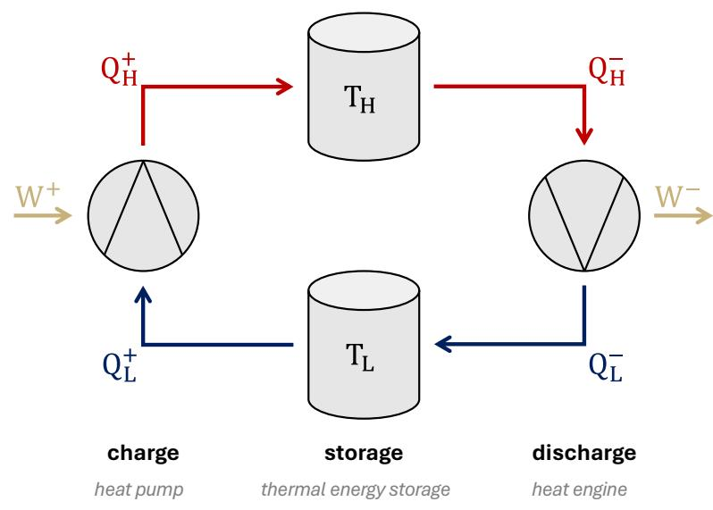

Fig. 1.1 Representation of the Carnot battery concept.  $W^+$  and  $W^-$  are the incoming and outgoing work (or electricity), respectively.  $Q_L^+$  and  $Q_H^+$  denote the heat exchanged during charge with the low and high temperatures reservoirs.  $Q_L^-$  and  $Q_H^-$  are for discharge.

In energy terms, for charge, the heat pump transfers heat from a low-temperature reservoir (extracting heat from it) to a high-temperature reservoir (delivering heat to it), thus creating heat and cold. For discharge, the stored heat drives the heat engine, transferring heat back from the high-temperature reservoir (extracting heat from it) to the low-temperature reservoir (delivering heat to it).

By analogy with pumped-hydro energy storage (PHES), Carnot batteries have historically been referred to as pumped heat energy storage (PHES) [27, 28] or pumped thermal energy storage (PTES) [29, 30]. To a lesser extent, other terms such as electro-thermal energy storage (ETES) [31], thermo-electrical energy storage (TEES) [32, 33] and compressed heat energy storage (CHEST) [34] have also been used. However, the term Carnot battery, which encompasses all these concepts, tends to become the standard since 2020–at least for Rankine cycle derived systems [35–41].

The name Carnot battery is a direct reference to Carnot's reversible cycle [42]. Assuming reversible cycles for charge and discharge, the power-to-power efficiency  $\eta_{\rm P2P}^{-1}$ , which is defined as the electrical energy (or work) recovery ratio, is always

&lt;sup>1The term *power-to-power efficiency* is preferred over *roundtrip efficiency*. Here, power refers to the electricity entering and leaving the system (i.e., electrical energy, not the rate of energy transfer), whereas *roundtrip efficiency* encompasses all forms of energy entering and exiting the system (i.e., electricity, heat, and cold). Since this work focuses on coupling with the thermal vector, power-to-power and roundtrip efficiency will not always yield the same value. Additionally, while the term *power-to-power* may be considered an imprecise substitution for *work-to-work*, its use is justified due to its widespread adoption within the community.

100%. Neglecting exergy losses in the storage, this is demonstrated as

$$\begin{split} \eta_{\mathrm{P2P}}^{\mathrm{Carnot}} &= \frac{\mathrm{W}^{-}}{\mathrm{W}^{+}} \\ &= \frac{\eta_{\mathrm{HE}}^{\mathrm{Carnot}} \cdot \mathrm{Q}_{\mathrm{H}}^{-}}{\mathrm{Q}_{\mathrm{HP}}^{+}/\mathrm{COP}_{\mathrm{HP}}^{\mathrm{Carnot}}} \\ &= \mathrm{COP}_{\mathrm{HP}}^{\mathrm{Carnot}} \cdot \eta_{\mathrm{HE}}^{\mathrm{Carnot}} \\ &= \frac{\mathrm{T}_{\mathrm{H}}}{\mathrm{T}_{\mathrm{H}} - \mathrm{T}_{\mathrm{L}}} \cdot \frac{\mathrm{T}_{\mathrm{H}} - \mathrm{T}_{\mathrm{L}}}{\mathrm{T}_{\mathrm{H}}} \\ &= 1 \quad . \end{split} \tag{1.1}$$

where  $\mathrm{COP}_{\mathrm{HP}}$  is the heat pump coefficient of performance and  $\eta_{\mathrm{HE}}$  the heat engine efficiency. The concept of Carnot battery, while gaining attraction in recent years, is not new–some authors trace its origins back to the 1920s [43,44]. However, significant scientific interest in converting this theoretical concept into practical machines only emerged in the early 2010s. Notable contributions include:

- Howes [27] and Desrues et al. [45], who independently explored systems based on closed (reversed) Brayton cycles;
- Mercangöz et al. [31] and Morandin et al. [32], who collaboratively worked on designs employing transcritical CO2 cycles;
- Peterson [46], who proposed using vapour compression cycles for charging and (organic) Rankine cycles for discharging.

Their aim was to adapt proven thermodynamic cycles with thermal storage, striving to minimise irreversibilities, and thereby maximise power-to-power efficiency. According to the second law of thermodynamics, any heat exchange between the cycles and storage conducted in finite time inevitably involves irreversibilities (i.e., the so called external irreversibilities). Furthermore, technological limitations inherent to the design and operation of practical machines lead to internal irreversibilities (e.g., friction, pressure drops, and non-idealities in compression and expansion processes). As a result, the efficiency of a real Carnot battery will always fall short of the ideal 100%.

To characterise this practical performance, a simplified model that accounts for both external and internal irreversibilities can be employed. Key parameters in this model include  $\Psi_{\rm HE}^{\rm Carnot}$ , the fraction of the Carnot COP, and  $\Psi_{\rm HE}^{\rm Carnot}$ , the fraction of the Carnot efficiency. These are defined as

$$\begin{split} \Psi_{\mathrm{HP}}^{\mathrm{Carnot}} &= \frac{\mathrm{COP_{\mathrm{HP}}^{\mathrm{real}}}}{\mathrm{COP_{\mathrm{HP}}^{\mathrm{Carnot}}}} \\ \Psi_{\mathrm{HE}}^{\mathrm{Carnot}} &= \frac{\eta_{\mathrm{HE}}^{\mathrm{real}}}{\eta_{\mathrm{HE}}^{\mathrm{Carnot}}} \ , \end{split}$$

I

#### 1 | Introduction

with  ${\rm COP^{real}_{HP}}$  the coefficient of performance of the real heat pump and  $\eta^{\rm real}_{\rm HE}$  the efficiency of the real heat engine. The real efficiency of a Carnot battery  $\eta^{\rm real}_{\rm P2P}$  can then be written as

$$\begin{split} \eta_{\text{P2P}}^{\text{real}} &= \frac{W^{-}}{W^{+}} \\ &= \text{COP}_{\text{HP}}^{\text{real}} \cdot \eta_{\text{HE}}^{\text{real}} \\ &= \Psi_{\text{HP}}^{\text{Carnot}} \cdot \frac{T_{\text{H}}}{T_{\text{H}} - T_{\text{L}}} \cdot \Psi_{\text{HE}}^{\text{Carnot}} \cdot \frac{T_{\text{H}} - T_{\text{L}}}{T_{\text{H}}} \\ &= \Psi_{\text{HP}}^{\text{Carnot}} \cdot \Psi_{\text{HE}}^{\text{Carnot}} \cdot \Psi_{\text{HE}}^{\text{Carnot}} \ . \end{split} \tag{1.2}$$

Achieving efficiencies of 50% requires  $\Psi_{HP}^{Carnot}$  and  $\Psi_{HE}^{Carnot}$  of approximately 70%, which is close to the upper limits of current technological capabilities. As a result, since the early 2010s, designing systems maximising  $\Psi^{Carnot}$  has been an active field of research, with new concepts introduced since then.

#### Distinctive advantages of Carnot batteries

From more pragmatic and technological perspectives, Carnot batteries present several advantages, which highlight the reasons behind the growing interest in them. First, the investment and maintenance costs could be relatively low. If thermal storage relies on abundant materials such as water or rocks, its cost can remain low (i.e., low cost per kWhth). Furthermore, as the cycles are *closed* (i.e., no direct exchange with the environment) and do not involve reactive transformations, fouling is limited. Additionally, Carnot batteries could have exceptionally long lifespans. Thermal storage can endure a very high number of cycles with minimal ageing [47], and the charge and discharge machines typically exhibit long operational lifetimes. Another key advantage is the limited reliance on rare and strategic materials. This not only enhances strategic independence of supply but also provides resilience against price fluctuations. Moreover, the reduced use of scarce materials is expected to limit the environmental footprint of the system [48]. Carnot batteries also offer limited safety risks, such as flammability or toxicity, although this depends on the working fluids and storage temperatures.

Other notable benefits include scalability, with applications that can range from the kilowatt (e.g., domestic heat pumps) to the hundreds of megawatts (e.g., power plants) [36,38]. They are also modular, allowing storage capacity to be expanded easily by adding more thermal storage units. Unlike other storage technologies, Carnot batteries benefit from a degree of geographical independence, as they do not require elevation differences (as with pumped-hydro) or pressure-tight caverns (as with compressed-air energy storage). They also have potential for retrofitting steam power plant, thereby reducing investments [49,50]. Finally, for large scale systems, the rotating machinery used in the charge and discharge cycles can provide mechanical inertia to the power grid, which presents an additional revenue opportunity [51].

But the key advantage of Carnot batteries probably lies in sector coupling. By their very nature, they can combine heat and power vectors, as illustrated in Fig. [1.2.](#page-23-0) For example, the heat pump can be supplied, in addition to the compression work, by thermal exergy from a heat source at higher temperature than the heat sink of the heat engine. This *thermal integration*, besides increasing the powerto-power efficiency of the Carnot battery (potentially above 100%), could also provide flexibility to multi-energy systems. This configuration is commonly known as *thermally integrated pumped thermal energy storage* (TI-PTES). Various applications have been explored, including utilising diurnal temperature cycles, such as charging during sunny and warmer periods (day), and discharging during colder times (night). Other applications consider harnessing low-temperature geothermal or solar thermal energy. Waste heat recovery is another interesting route. Some proposals also suggest coupling them with district heating systems and seasonal thermal storage. The stored heat can also be utilised to meet thermal demand, provided the temperature ranges are compatible. Furthermore, Carnot batteries can implement combined cooling, heating, and power (CCHP) systems. Other types of couplings are also possible, including combined heat and power (CHP) generation with the heat engine, as illustrated in Fig. [1.2.](#page-23-0)

#### Challenges for Carnot batteries to penetrate the market

Nearly 15 years after the pioneering concepts were introduced, Carnot batteries have yet to find their market. Two main reasons explain this: the currently lim-

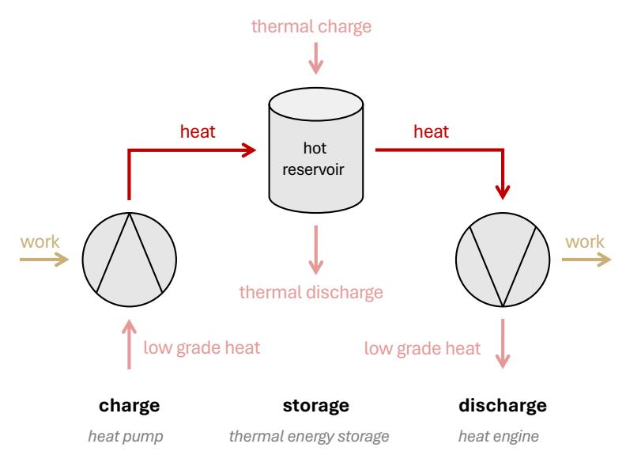

**Fig. 1.2** Conceptual representation of the different heat and power coupling options for the Carnot battery. The cold reservoir is here removed and replaced by the ambient.

| **7**

## **1** | Introduction

ited penetration of renewable energy means that the demand for storage has not fully emerged yet [\[16,](#page-250-8) [17\]](#page-250-9), and the techno-economic performance of Carnot batteries remains uncompetitive compared with more established technologies, such as pumped-hydro or electro-chemical batteries. First, under realistic design assumptions, the power-to-power efficiency of Carnot batteries rarely exceeds 50% [\[38,](#page-252-9)[39\]](#page-252-10). Second, techno-economic studies conducted over the past five years reveal a fundamental trade-off between cost and efficiency [\[52,](#page-253-5) [53\]](#page-253-6). This trade-off arises because increasing efficiency inherently adds technological complexity, such as higher temperature ranges and enhanced component performance, which, in turn, drives up costs. More specifically, while the energy-specific cost can remain relatively low thanks to thermal storage, the power-specific cost tends to be significantly higher, primarily due to the dual cost of the charging and discharging systems.

Carnot batteries still face several challenges if they are ever to reach the market. In terms of design, one major question is how to balance system complexity with investment and maintenance costs. Determining the optimal technological implementation remains a challenge, as it is highly application-specific (i.e., which cycles, components?). Identifying more profitable business models and alternative revenue sources is equally crucial. Questions remain over the optimal scale and applications: should Carnot batteries target residential use for integrated heat and power management? Industrial applications for waste heat recovery and to provide combined cooling, heating, and power (CCHP)? Or grid-scale applications to deliver ancillary services and energy arbitrage? The business model is equally unclear. Is pure load shifting sufficient, or should additional services like arbitrage or polygeneration be included? Should Carnot batteries focus on ancillary services, participate in capacity markets, or rely on subsidies?

Operations also present unresolved questions, such as optimising charging and discharging duration. In sector coupled applications, should thermal or electrical discharge take priority? The underlying issue remains: what are the optimal applications for Carnot batteries? Answering this requires detailed case studies to identify scenarios where Carnot batteries are more relevant than other energy storage technologies. By addressing these questions, Carnot batteries could eventually unlock their potential as a viable solution within the energy storage landscape.

# **1.2 Thesis objectives and outline**

# 1.2.1 Research questions

As further detailed in the literature review in Section [1.3,](#page-28-0) research on Carnot batteries has historically drawn on the analogy with pumped-hydro energy storage, focusing primarily on their role as a pure grid-scale electricity storage systems (i.e., > 1 MWel). This approach appeared promising due to the economies of scale and efficiency gains achievable at larger powers. Furthermore, systems derived from the Joule-Brayton cycle appeared suitable (i.e., *η*P2P ≥ 50%), provided they could achieve temperature differences exceeding 500 K between the cold and hot reservoirs, along with isentropic efficiencies above 90% for compression and expansion machines [\[27,](#page-251-4) [45\]](#page-252-6).

In contrast, the potential for sector coupling, particularly at small to medium scales (i.e., < 1 MWel), has received significantly less attention. This thesis therefore seeks to contribute to addressing the following question:

> *For small-scale Carnot batteries (i.e.,* < *1 MWel) to have a significant contribution to flexibility options for heat and power, what are the successful thermodynamic and economic configurations?*

To address this question, the thesis explores three distinct angles: the first examines the thermodynamic and technological aspects, the second focuses on the technoeconomic considerations through case studies, and the third evaluates the environmental implications. The overall research question will be addressed through five specific sub-questions.

**Question #1** Thermal integration is an interesting application for Carnot batteries, increasing their power-to-power efficiency and bringing flexibility to energy systems. For such application, other indicators like exergy efficiency, which also considers thermal exergy consumption, and electrical energy density must also be used. However, the performance that Carnot batteries could have with regard to these three indicators and the wide range of temperatures encountered in real applications is not yet well mapped. In addition, generic design recommendations to guide manufacturers are still lacking. We thus ask ourselves:

*What is the catalogue of efficient Carnot battery configurations for small-scale thermal integration, and how can they be optimally designed?*

**Question #2** Developing a design that maximises these indicators is valuable for identifying the theoretical optimal performance. However, such a design may be complex to implement or even impractical from a techno-economic perspective, as it could require non-standard or costly components. Consequently, it is beneficial to propose near-optimal alternatives, enabling manufacturers to select a solution that aligns with their specific preferences and constraints. We thus ask ourselves:

> *What are the design alternatives and trade-offs to reduce investment costs and align with different technological preferences?*

**Question #3** The thermal integration of Carnot batteries offers a wide range of potential applications, each of which warrants a detailed techno-economic analysis to assess its profitability. Given the significant energy losses associated with waste

# **1** | Introduction

heat in energy systems (more than 50% of the primary energy worldwide [\[54\]](#page-253-7)), this work concentrates specifically on the case of waste heat recovery. We thus ask ourselves:

> *Under what real-world conditions could waste heat recovery be economically viable for thermally integrated Carnot batteries?*

**Question #4** Another form of coupling is the combined storage of heat and power, which could be applied in industrial processes or tertiary sector. However, determining which type of discharge–thermal or electrical–should be prioritised to maximise system profitability remains unclear, as this choice depends on the time of day and the season. We thus ask ourselves:

> *How should Carnot batteries be optimally sized and operated for integrated heat and power management in residential applications?*

**Question #5** Finally, Carnot batteries are often praised for their supposedly lower environmental impact than other storage technologies. However, there is a lack of evidence in the literature on this subject. We thus ask ourselves:

> *Could Carnot batteries have a lower environmental impact than electro-chemical batteries across the main impact categories?*

# 1.2.2 Thesis outline

To tackle the five research questions, the thesis is structured as follows. **Part [I](#page-45-0)** focuses first on the thermodynamic aspects, introducing the model (Chapter [2\)](#page-47-0) and optimising the thermodynamic design for different applications (Chapters [3](#page-63-0) & [4\)](#page-93-0). **Part [II](#page-118-0)** then investigates the techno-economic aspects through two case studies (Chapters [5](#page-121-0) & [6\)](#page-155-0). **Part [III](#page-187-0)** finally looks at the environmental performance of Carnot batteries (Chapter [7\)](#page-189-0). Fig. [1.3](#page-26-1) illustrates this structure.

**Chapter [1](#page-17-0)** introduces the research question and provides a corresponding state-ofthe-art. It first describes the different Carnot battery concepts, classified according

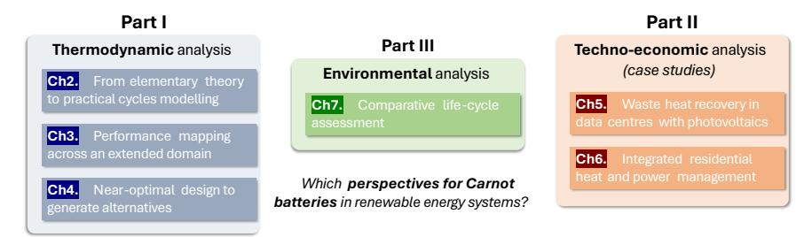

**Fig. 1.3** Illustration of the thesis outline.

to the cycles and types of storage. It then reviews the different applications considered and discusses their techno-economic performance. Finally, it outlines the main challenges that need to be addressed to further develop Carnot batteries.

# **Part [I](#page-45-0) – Thermodynamic analysis**

**Chapter [2](#page-47-0)** first focuses on the fundamental thermodynamics of Carnot batteries. Using a simplified model, it provides an intuitive understanding of the phenomena involved. It then introduces the thermodynamic model used to characterise and optimise Rankine cycle-based Carnot batteries.

**Chapter [3](#page-63-0)** tackles *Question #1*. It maps the maximum achievable performance of TI-PTES based on vapour compression heat pumps and organic Rankine cycles across an extended thermal integration domain. Based on the optimised cycles obtained, it provides generalised design guidelines. At various points within the domain, it also characterises the *Carnot battery trilemma*, i.e., the fundamental trade-off between power-to-power efficiency, exergy efficiency, and electrical energy density.

**Chapter [4](#page-93-0)** addresses *Question #2*, observing that thermodynamically optimal designs may be less favourable from technological and techno-economic perspectives. To generate alternatives with similar performance, it applies the near-optimal design method to Carnot batteries. A total of sixteen configurations (with or without internal recuperators) and different regimes (subcritical or transcritical) are considered. To this end, a new method for generating alternative designs is derived from a genetic algorithm. The results illustrate the necessary trade-offs between performance and technological aspects to meet specific design preferences.

## **Part [II](#page-118-0) – Techno-economic analysis**

**Chapter [5](#page-121-0)** explores *Question #3* by focusing on the specific case of waste heat recovery in data centres coupled with photovoltaic systems. The study aims to maximise both the energy self-sufficiency ratio (SSR) and the internal rate of return (IRR) on investment. Although these objectives are conflicting, the results demonstrate the financial feasibility of Carnot batteries under certain conditions. To effectively increase the self-sufficiency ratio, the study also provides perspectives on new Carnot battery architectures to be evaluated for this type of application.

**Chapter [6](#page-155-0)** focuses on *Question #4* by investigating Carnot batteries as integrated solutions for heat and power management in residential applications with photovoltaics. Considering a wide range of possible investment costs, the objective is to optimise the design and operations of the system to minimise the annualised energy cost. A linear programming model, based on the performances obtained in Part [I,](#page-45-0) is used to simulate a housing development of twenty dwellings. The results demonstrate the potential of the concept under different assumptions (e.g., fixed or dynamic electricity pricing) and show that thermal discharges mainly occur during the cold season, while electrical discharges are more profitable during the warm season.

# **1** | Introduction

# **Part [III](#page-187-0) – Environmental analysis**

**Chapter [7](#page-189-0)** finally addresses *Question #5* by performing a life cycle assessment (LCA) of the residential case studied in Chapter [6.](#page-155-0) It compares different energy system architectures, including those with batteries. Although the environmental impact is mainly driven by the photovoltaic installation and grid electricity consumption, the results show that the Carnot battery helps reduce the impact on mineral resource use. However, in terms of global warming potential, the Carnot battery does not outperform the Li-ion battery.

The **Conclusion** draws together the main lessons from the different chapters. It provides perspectives for future research and further development of Carnot batteries, addressing both thermodynamic and technological improvements, as well as potential application cases.

# **1.3 The landscape of Carnot batteries**

This section reviews the literature on Carnot batteries. The main concepts and technologies (see Fig. [1.4\)](#page-28-2) are first introduced and discussed in Section [1.3.1.](#page-28-1) Various applications are then presented in Section [1.3.2.](#page-39-0) The focus is on sector coupling and the techno-economic aspects. The key messages are summarised in Section [1.3.3.](#page-43-0) As a complement to this section, further insights into the commercial development of Carnot batteries can be found in the review by Novotny et al. [\[38\]](#page-252-9).

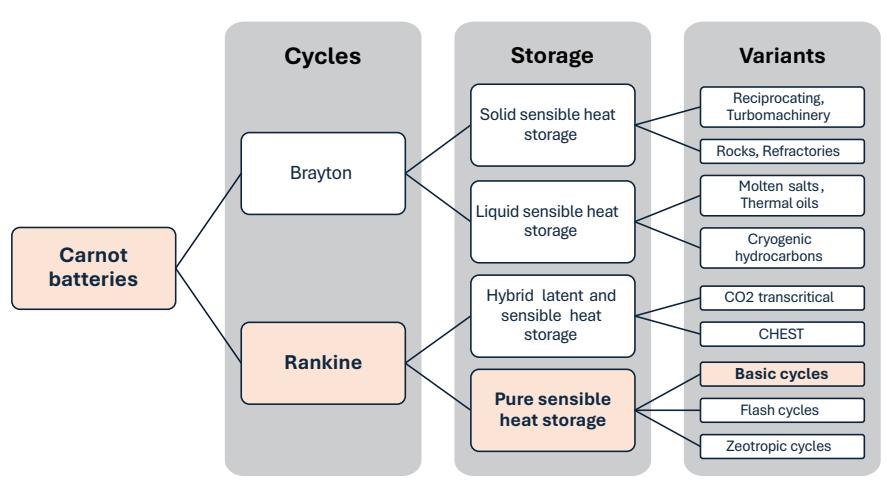

**Fig. 1.4** Suggested Carnot batteries classification. Not all existing concepts are included, just the most common ones. Other derived concepts will be mentioned in the applications. This work investigates Rankine Carnot batteries with sensible heat storage and basic cycles.

# 1.3.1 Concepts and technologies

When designing Carnot batteries, the aim is to minimise the internal and external irreversibilities of the charging and discharging cycles. The first step in minimising external irreversibilities (or heat transfer irreversibilities) is an efficient match between the thermodynamic cycles and the thermal reservoirs, so as to minimise the mean temperature difference (see Fig. [1.5\)](#page-29-0). If the reservoir exploits sensible heat (e.g., water, rocks), then a cycle with non-isothermal heat exchange will be more appropriate. Conversely, if the reservoir exploits latent heat (e.g., phase-change materials) or sensible heat with very low temperature glide (e.g., atmosphere), isothermal heat exchanges will provide better performance. The challenges for Carnot battery designers are therefore (i) to identify the optimal coupling between proven cycles and existing thermal storage systems and (ii) to modify the cycles to improve this coupling.

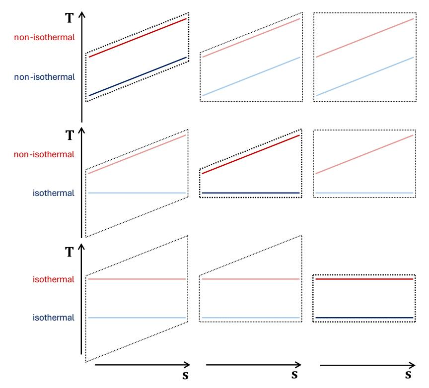

**Fig. 1.5** Illustration of the cycles-reservoirs matching problem on temperature-entropy diagrams. The black dotted lines illustrate charging cycles, the red straight lines hot reservoirs and the blue straight lines cold reservoirs. Pale colours indicate ineffective matches, while darker colours indicate couplings that minimise external irreversibilities.

| **13**

# **1** | Introduction

Based on well-established Carnot battery concepts, we propose the following classification (see Fig. [1.4\)](#page-28-2). At a minimum, Carnot batteries are defined as systems for storing electricity in the form of thermal exergy. The classification first differentiates concepts based on the charging and discharging cycles. On one hand are the cycles in which the working fluid remains in a gaseous state, and heat transfers occur non-isothermally (i.e., Brayton Carnot batteries). On the other hand are the cycles where the fluid undergoes phase change in at least one of the heat exchange processes (i.e., Rankine Carnot batteries). The second level of classification relates to the different storage technologies used. A third level introduces the well established concepts.

#### Brayton based Carnot batteries

The first pumped thermal energy storage (PTES) concepts appeared in the early 2010s, with two similar systems introduced separately by Howes [\[27\]](#page-251-4) and Desrues et al. [\[45\]](#page-252-6). Drawing on the statement that the potential of pumped hydro energy storage (PHES) and compressed air energy storage (CAES) was limited due to geographical constraints and their high cost, they proposed developing a large-scale electricity storage system that would store energy at low-cost as thermal exergy in simple and abundant materials.

## **Systems with solid sensible heat storage**

The system introduced by Howes [\[27\]](#page-251-4) and Desrues et al. [\[45\]](#page-252-6) uses two sensible heat stores, hot and cold, based on solid materials (see Fig. [1.6\)](#page-31-0). During the charge phase, an ideal gas (e.g., argon, air, nitrogen, helium) is compressed (1–2) to generate high-temperature heat (reaching from 500◦C [\[27\]](#page-251-4) up to 1000◦C [\[45\]](#page-252-6) according to the concept). This heat is then transferred to the hot store (2–3, direct heat exchange between gas and storage material). After it has cooled down, the gas is expanded (3–4) to produce work and cold (reaching from –70◦C [\[45\]](#page-252-6) down to –150◦C [\[27\]](#page-251-4)). Heat is thereafter absorbed from the cold store and transferred to the gas (4–1, cold is 'transferred' to the storage material). This lower temperature reduces the subsequent compression work (1–2). In discharge mode, the process is basically reversed to convert the hot and cold thermal exergy into work. The main differences between the machines of Desrues et al. and Howes are that the former use refractory materials for storage and two sets of turbomachines (i.e., compressor and turbine) for charge and discharge (not represented in Fig. [1.6\)](#page-31-0), whereas the latter uses packed-beds of rock particles and two reciprocating machines capable of acting both as compressors and expanders (i.e., 'invertible' machines).

The strength of the system is the direct heat exchange between the working fluid and the sensible heat storage material, which minimises the temperature difference and therefore external irreversibilities. Such effective match between the storage and the cycle is well represented by the top left diagram of Fig. [1.5.](#page-29-0) Despite the large sensitivity to the performance of compression and expansion machines [\[35,](#page-252-1) [55\]](#page-253-8), power-to-power efficiencies of around 60% – 70% are generally

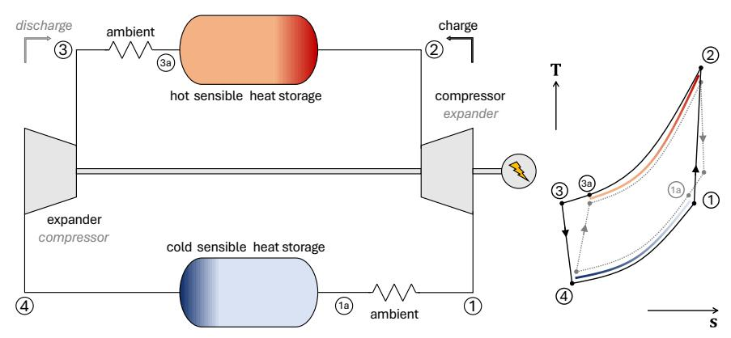

**Fig. 1.6** Schematic representation of Brayton Carnot batteries with solid sensible heat storage (packed-beds). The cycles are also reported on a temperature-entropy diagram. Typical storage materials involve rocks and refractories. Storage temperatures can go up to 500◦C/1000◦C and down to –70◦C/ – 150◦C. Heaters and coolers (i.e., ambient heat exchangers) are necessary to compensate for irreversibilities. Both reciprocating and turbomachines are considered for compression and expansion. Note that a single set of compression and expansion machines is depicted but two can be employed. Working fluids are subject to optimisation, but air, nitrogen and argon are commonly used.

claimed for isentropic efficiencies of 90% [\[36,](#page-252-8) [44\]](#page-252-5). Energy density is usually above 50 kWhel/m3 , depending on the materials and storage temperature [\[30,](#page-251-7) [56,](#page-253-9) [57\]](#page-253-10).

This Carnot battery configuration, however, also represents major challenges. From a technological point of view, the storage containment vessels must be pressurised, which increases their cost. In addition, thermal cycling generates stresses in the vessels. From an operational point of view, the shape and position of the thermoclines in the hot and cold stores vary with the state of charge, influencing the outlet temperatures and, consequently, the cycles. Heaters and coolers are therefore added to maintain constant temperatures and control the cycles (see Fig. [1.6\)](#page-31-0). During the storage phase, neglecting heat losses to the environment, irreversibilities are also caused by the spreading of the thermocline (i.e., mixing losses). To limit this, White et al. [\[29,](#page-251-6) [56,](#page-253-9) [58\]](#page-253-11) optimised the size of the packed-beds particles to improve stratification and minimise pressure losses. McTigue et al. [\[30,](#page-251-7)[59,](#page-253-12)[60\]](#page-254-0) have pursued these efforts by optimising designs (geometries, arrangement of packed-beds) and proposed segmenting the packed-bed into several layers. Using an evolutionarybased algorithm, they characterised the conflict between power-to-power efficiency and electrical energy density by studying the Pareto front between these objectives. The variation in thermodynamic conditions in the stores also affects the mass of air contained in them, which requires the addition of a buffer vessel to control pressure levels in the system (not represented in Fig. [1.6\)](#page-31-0) [\[30,](#page-251-7) [57\]](#page-253-10). To improve efficiency by reaching higher temperatures but without increasing the compression ratio, Benato [\[57\]](#page-253-10) also suggested using an electric heater at the compressor outlet in heat pump mode. To address the issue of vessels pressurisation, Davenne and

#### 1 | Introduction

Peters [61] introduced a concept with intermediate heat exchangers between the cycle and the storage. They assessed limited additional irreversibilities (efficiency down from 65% to 59%).

#### Systems with liquid sensible heat storage

To avoid the challenges associated with packed-beds (e.g., thermocline, thermal cycling), liquid storage media contained in two-tank present an interesting alternative (see Fig. 1.7). Morandin and Henchoz [62] were the first to suggest this concept in 2011, although first characterisations only started in 2017 with the work of Laughlin [63]. In this case, a heat exchanger is placed between the cycle and the reservoirs. For the hot part, molten salts (nitrate salts, chloride salts, etc.) or thermal oils (synthetic oils, mineral oils) may be used, depending on the temperature range. For the cold section, cryogenic hydrocarbons (methanol, hexane, etc.) are generally used. As the maximum temperature of liquids is much lower than in rocks (<  $600^{\circ}$ C), a recuperator is generally considered to increase the cycles efficiency. While Salomone-Gonzalez et al. [64] and Gonzalez-Ayala et al. [65] reported power-to-power efficiencies below 50%, Farres-Antunez et al. [66] reported a value of 62%. As far as energy density is concerned, this is generally well below  $50 \text{ kWh}_{\rm el}/\text{m}^3$  due to the dead volume occupied in two-tank [52, 66]. Yet, recent works also considered the use of single stratified tank to increase density [50].

Although Brayton Carnot batteries based on liquid storage are much more recent, they appear to be more mature from a technological point of view and could be the first to reach the market [35].

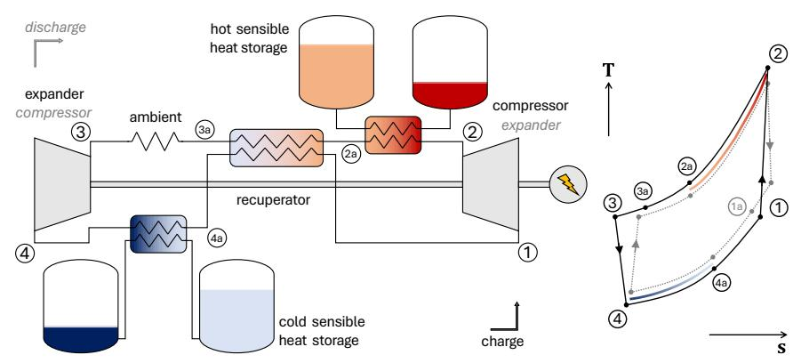

**Fig. 1.7** Schematic representation of Brayton Carnot batteries with liquid sensible heat storage. The cycles are also reported on a temperature-entropy diagram. Typical storage media involve molten salts and cryogenic hydrocarbons, like methanol. Storage temperatures do usually not exceed  $600^{\circ}$ C and  $-50^{\circ}$ C. Ambient heat exchangers are necessary to compensate for irreversibilities (the exchanger for discharge, 1a–4a, is not shown for clarity). Turbomachines are preferred for compression and expansion. Note that a single set of compression and expansion machines is depicted but two can be employed. Nitrogen and argon are commonly considered as working fluids.

#### Rankine based Carnot batteries

In parallel with the development of high-temperature Brayton Carnot batteries, some authors have rather focused on systems with smaller temperature differences and more mature technologies. In the modern history of Carnot batteries, Peterson [\[46\]](#page-252-7) was the first in 2011 to look at systems with phase change cycles (i.e., 'Rankine' Carnot batteries). His concept uses a refrigeration cycle to charge the storage (see Fig. [1.8\)](#page-33-0). Liquid propane is evaporated (4–1) by extracting heat from cold latent heat storage (–15◦C, ethylene glycol). The temperature of the fluid is then raised by compressing it (1–2), allowing it to reject heat to the environment (2–3, 35◦C). The liquid is finally expanded through a 'liquid motor' (3–4) and the cycle can begin again. For the discharge phase, the propane circulates in the opposite direction. Due to similarity, the discharging cycle can reuse certain components of the charging cycle. The liquid motor is replaced by a pump and the compressor by an expander, giving a proper Rankine cycle (see Fig. [1.8\)](#page-33-0). This concept is therefore well represented by the diagram at the bottom right of Fig. [1.2.](#page-23-0)

To improve the efficiency of the system, Peterson introduced a sensible heat storage (granite) to reduce the temperature difference between the fluid and the storage, and reduce heat transfer irreversibilities (packed-bed with thermocline, see Fig. [1.8\)](#page-33-0). This recovers heat from sub-cooling after condensation during charge phase. In discharge phase, this heat is used to preheat the liquid propane leaving the pump. Peterson characterised the system and showed that power-to-power efficiency was highly sensitive to the isentropic efficiency of the compression and expansion machines (internal irreversibilities) and to the mean temperature difference at heat exchanges (external irreversibilities). For plausible technological parameters, he claimed that an efficiency of 50% could be achieved.

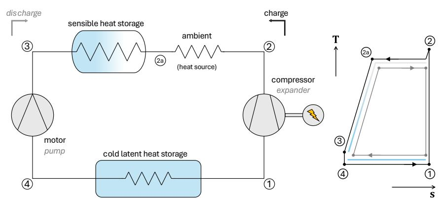

**Fig. 1.8** Schematic representation of the concept introduced by Peterson [\[46\]](#page-252-7). The cycles are also reported on a temperature-entropy diagram (100% isentropic efficiencies are assumed). During discharge, the 'liquid motor' is replaced by a pump. The system is based on an invertible compressor/expander. Propane is used as working fluid while ethylene glycol is used for latent heat storage. Granite is considered for sensible heat storage.

| **17**

# **1** | Introduction

To further increase the power-to-power efficiency, Peterson finally proposed using a heat source (e.g., diurnal temperature variation, solar thermal, waste heat, geothermal) warmer than the ambient to feed the power cycle during discharge. This alternative is known today as *cold thermally integrated pumped thermal energy storage* (cold TI-PTES, see later). Note that Henchoz et al. [\[67\]](#page-254-7) proposed a similar version of the cold TI-PTES based on subcritical ammonia cycles. The main difference is the position of the sensible heat storage, which collects the sensible heat from vapour de-superheating after the compressor instead of liquid subcooling after condenser.

Since Peterson's work, other concepts based on hybrid latent and sensible heat storage have been studied. In a bid to reduce costs and complexity, systems based exclusively on liquid sensible heat storage were subsequently investigated. The main focus was the study of the charge and discharge cycles. For low-temperature systems, solid storage of sensible heat is practically not considered.

## **Systems with hybrid latent and liquid sensible heat storage**

Starting from 2012, Mercangoz et al. [\[31\]](#page-251-8) proposed using transcritical CO2 cycles for charge and discharge. As illustrated by the diagram in the centre of Fig. [1.5,](#page-29-0) this type of cycle is perfectly suited for coupling with latent heat storage on the cold side and sensible heat storage on the hot side. For the cold part, they simply considered ice (0 ◦C melting point). For the hot part, they assumed a pressurised two-tank storage filled with water at 10◦C and 120◦C respectively. The motivation of Mercangoz et al. for this CO2 system was to use cycles that were as invertible as possible for charging and discharging (cost reduction) and to use materials that were benign for the environment. They estimated that at a commercial scale (> 10 MWel), the system could achieve 65% efficiency. Instead of cold storage, they also suggested using a higher temperature source for the heat pump mode, while the atmosphere would serve as a cold sink for the heat engine (i.e., TI-PTES). Morandin et al. [\[32,](#page-251-9) [68\]](#page-254-8) then turned their attention to the concrete implementation and optimisation of the system. In particular, due to large variations in specific heat capacity for supercritical CO2, they evaluated the use of separate storage units to achieve effective coupling between the CO2 and water in the reservoirs (storage-split). They concluded on a maximum efficiency of about 60%. They also considered alternative configurations with recuperators, as well as coupling with ammonia cycles.

Other studies on transcritical cycles have also been carried out. To obtain more realistic results, Baik et al. [\[69\]](#page-254-9) used a more accurate heat exchanger model. They demonstrated that to maximise efficiency, there was an optimum temperature spread between the two water tanks. The maximum efficiency obtained was no more than 30%. This lower efficiency was due to the lower temperature difference between hot and cold reservoirs (they used ambient water instead of ice), the absence of two-phase expander, and the fact that only one storage unit was used, so the match

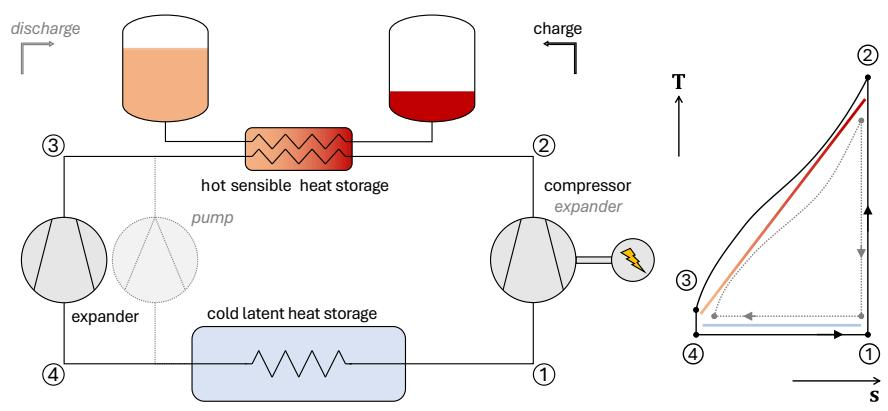

**Fig. 1.9** Schematic representation of CO2 transcritical Carnot batteries with hybrid latent and sensible heat storage. The cycles are also reported on a temperature-entropy diagram (100% isentropic efficiencies are assumed). Typical storage materials involve liquid water and ice. Storage temperatures are typically bounded to 120◦C to limit pressurisation needs. Ambient heat exchangers, necessary to compensate for irreversibilities, are not represented for the sake of clarity. Note that an invertible compressor/expander is here depicted but separate charging and discharging cycles are more frequently encountered. The two-phase expander is sometimes substituted by an expansion valve to reduce costs, despite this reduces the efficiency. For better fit with the supercritical fluid, separate storage units at different temperatures can also be placed in series (storage-split).

between supercritical CO2 and water was less effective (see Fig. [1.9\)](#page-35-0). In contrast, Ayachi et al. [\[70\]](#page-254-10) kept the cold latent heat reservoir, but proposed using the ground as a cheap reservoir of hot sensible heat (serial-parallel borholes). Kim et al. [\[71\]](#page-254-11) looked at a modified version using isothermal compression and expansion.

This system based on CO2 transcritical cycles provides effective coupling with sensible and latent heat storage, and therefore efficiencies that are fully competitive with Brayton Carnot batteries, despite the significantly lower storage temperatures. On the other hand, these cycles pose a series of challenges in terms of pressures (around 30 bar on the cold side, 150 bar on the hot side), which generates additional costs. They also require more complex control due to the strong sensitivity of efficiency to pressure variations in the gas cooler/heater, and to the necessary state-of-charge synchronisation when different storage units are used in series.

An alternative to transcritical CO2 is the CHEST concept (compressed heat energy storage). Introduced in 2014 by Steinmann [\[34\]](#page-252-0), it is based on more conventional subcritical cycles. To achieve an efficient coupling with vapour compression heat pumps (charging) and Rankine cycles (discharging), it is based on three distinct storage units: a first 'hot' sensible heat storage (exchange with superheated vapour), a latent heat storage (exchange during phase change) and a second 'cold' sensible heat storage (exchange with subcooled liquid). Ambient is used as cold reservoir. In its original form, this concept was based on multi-stage cascade heat pumps using ammonia and water for charging, and a steam cycle with resuper-

| **19**

# **1** | Introduction

heating for discharging. For latent storage at 305◦C (sodium nitrate) and isentropic efficiencies of 90%, a power-to-power efficiency of over 70% was claimed.

In its current form, the CHEST concept is simplified to reduce costs and operational complexity (see Fig. [1.10\)](#page-36-0). Due to its limited contribution, hot sensible heat storage has been removed. As a result, the charge and discharge cycles must limit the degree of superheating on the high-pressure side, using, for example, dry or isentropic fluids. Also, the charge cycle is limited to a simple subcritical vapour compression heat pump, while the discharge cycle is a subcritical organic Rankine cycle. In contrast to transcritical cycles, this allows the use of off-the-shelf components. Compared with the original CHEST, the storage temperature has also been lowered to just over 150◦C. Jockenhöfer et al. [\[72\]](#page-255-0) provided the first characterisation of a thermally integrated CHEST. After assessing that butene was a suitable fluid, they calculated the achievable efficiencies for heat sources ranging from 40◦C to 100◦C and assuming a water-cooled ORC. For storage with a melting temperature of 133◦C, they estimated that the power-to-power efficiency could range from 45% to almost 125%. However, they showed that these values were very sensitive to the average temperature difference between the phase change materials (PCM) and the saturation temperatures.

Hassan et al. [\[73,](#page-255-1)[74\]](#page-255-2) optimised a CHEST design (choice of fluids, phase-change materials and different temperatures), focusing in particular on the heat pump. They concluded that *R1233zd(E)* was the most suitable fluid. Their work contributed to the development of the first 10 kW-scale CHEST prototype, the per-

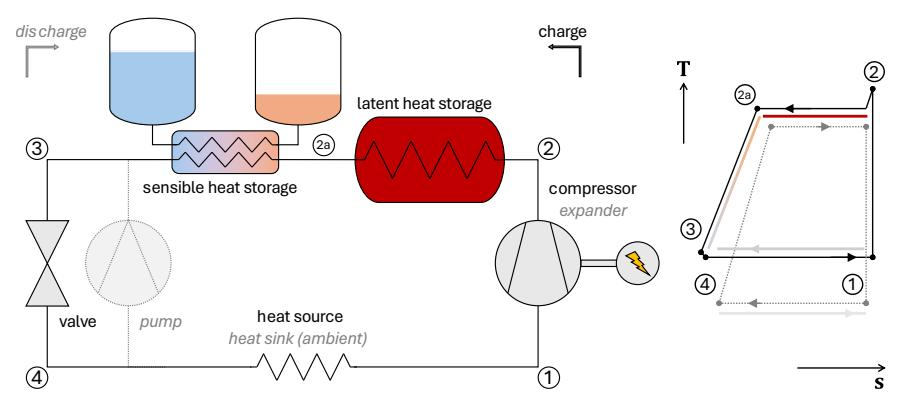

**Fig. 1.10** Schematic representation of CHEST Carnot batteries with hybrid latent and sensible heat storage. The cycles are also reported on a temperature-entropy diagram (100% isentropic efficiencies are assumed). Storage is typically composed of phase change materials (PCM) and liquid water. Storage temperatures are usually bounded to 150◦C to limit pressurisation needs. Alternative configurations with single stratified tank instead of two-tank are also possible. Note that an invertible compressor/expander is here depicted but separate charging and discharging cycles are actually most common. Working fluid selection is usually optimised among organic fluids, according to temperature ranges, etc. (active research field). Thermal integration is now almost systematically considered to increase efficiency.

formance of which was reported by Theologou et al. [\[75\]](#page-255-3) in 2024. At best, a 37% power-to-power efficiency could be demonstrated, using a 95◦C heat source and a 25◦C cold sink. Further work on the CHEST was conducted by Tafone et al. [\[76\]](#page-255-4). They simulated an alternative configuration where the hybrid latent and sensible heat storage was replaced by a cascade of three latent heat storages (133◦C, 120◦C and 108◦C). For similar source and sink temperatures, they claimed 48% efficiency and about 7 kWhel/m3 energy density.

## **Systems with liquid sensible heat storage**

To reduce the operational complexity (i.e., synchronism of the different storage units) and cost of Carnot batteries, systems based on a single sensible storage unit have also been considered (see Fig. [1.11\)](#page-37-0). The downside is that the match between the cycle and the storage will, at first glance, be less efficient. As a result, the efficiency of these systems is likely to be lower. However, different workarounds have been imagined. A first approach is to consider thermal integration almost systematically (i.e., use of a low-grade heat source). Dumont and Lemort [\[77\]](#page-255-5), for example, have mapped performance (i.e., efficiency, density) for heat sources ranging from 50◦C to 90◦C and heat sinks ranging from 0 ◦C to 40◦C. They also compared several fluids in order to identify those that perform best depending on their position in the thermal domain. For a 80◦C heat source, Frate et al. [\[78\]](#page-255-6) optimised configurations with and without internal heat exchanger (i.e., 'recuperator') and maximised the power-to-power efficiency, the exergy efficiency and the energy density. They concluded that the recuperator was always beneficial, and that it had the poten-

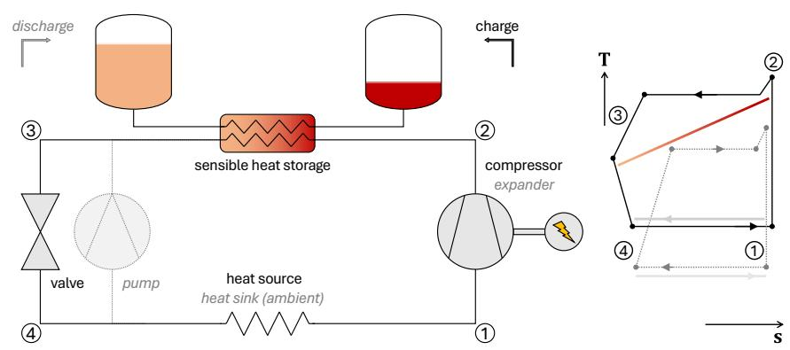

**Fig. 1.11** Schematic representation of Rankine Carnot batteries with sensible heat storage. The cycles are also reported on a temperature-entropy diagram (100% isentropic efficiencies are assumed). Storage is typically based on liquid water, and temperatures are usually bounded to 150◦C to limit pressurisation needs. Alternative configurations with single stratified tank instead of two-tank are also possible. Note that an invertible compressor/expander is here depicted but separate charging and discharging cycles are actually most common. Working fluid selection is usually optimised among organic fluids, according to temperature ranges, etc. (active research field). Thermal integration is almost systematically considered.

| **21**

# **1** | Introduction

tial to become the reference configuration for TI-PTES. However, they also showed that these objectives were strictly conflicting. Finally, while the majority of TI-PTES concepts only exploit the heat source when charging, Zhang et al. [\[79\]](#page-255-7) introduced a TI-PTES design where a preheater is inserted into the ORC. This is used to start economising the fluid with the heat source, before evaporation thanks to the heat from the storage. Their analysis showed that for low storage temperature spreads, *η*P2P could increase by more than 15% when the source is at 70◦C.

To achieve better coupling with sensible heat storage during discharge, Weitzer et al. [\[80\]](#page-255-8) suggested the use of organic flash cycles. Unlike organic Rankine cycles, the heat input is limited to the liquid phase (sensible heat). The vapour is obtained after separation from the liquid in a flash evaporator. Although the irreversibility of heat transfer can be minimised, the power-to-power efficiency of the Carnot battery is lower than that of the simple recuperated ORC. To achieve higher efficiency, the cycle needs to be modified to incorporate a two-phase expander in place of the throttle valve, a recuperator and use multiple pressure levels. Weitzer et al. [\[81\]](#page-255-9) have also looked at the conflict between power-to-power efficiency, exergy efficiency and energy density. They were the first to refer to this conflict as the *'Carnot battery trilemma'*. Due to low technological maturity, flash cycles have been studied very little for TI-PTES applications. Yet, Weitzer et al. also emphasized that despite their increased complexity, these cycles required further consideration for TI-PTES because of their interesting potential to soften the *Carnot battery trilemma*.

Another approach to achieve better coupling between sensible heat storage and the cycle is to use zeotropic mixtures as working fluids. Their distinctive feature are the non-isothermal isobars at saturation: the temperature difference between the dew point and the bubble point is called the 'temperature glide'. By optimising the composition of the mixture, the curvature of the isobar and the glide can be adapted to better match the storage temperature profile. The principle is well represented by the diagram at the top left of Fig. [1.5.](#page-29-0) A well known application of zeotropic fluids is the Kalina cycle [\[82\]](#page-256-0).

Koen et al. [\[83\]](#page-256-1) appear to be the first who applied this concept to Carnot batteries in 2021. They estimated that an efficiency of 61% could be achieved with unpressurised water reservoirs and isentropic efficiencies of 90% for the compression and expansion machines. One drawback of the system, however, is that it also requires the use of low-temperature storage because of the non-zero glide on the low pressure side (using the ambient would generate too much irreversibility). This results in a density limited to 2.4 kWhel/m3 .

At the same time, Bernehed [\[84\]](#page-256-2) was also interested in Carnot batteries with zeotropic fluids. However, this was limited to water-ammonia mixtures. To achieve perfect coupling, he considered three sensible heat storage units on the hot side: one for the superheated vapour part, one for the saturated part and one for the subcooled liquid part. Superheating is necessary to avoid two-phase expansion during the discharge phase (water and ammonia are wet fluids). As the storage temperature rose to 500◦C, molten salts were considered in addition to water. For isentropic efficiencies of 90%, he estimated that the power-to-power efficiency would be around 50%, at best.

Since then, other authors have looked at zeotropic mixtures. Lu et al. [\[85\]](#page-256-3), for example, compared TI-PTES cycles with azeotropic and zeotropic fluids and announced that a relative efficiency gain of more than 20% could be expected. Other studies have also recently been carried out to compare zeotropic TI-PTES with other configurations [\[86–](#page-256-4)[88\]](#page-256-5). Note that although these cycles with zeotropic mixtures are very attractive in theory, they present certain challenges in real machines. These include composition shift over time, system regulation, and the lack of thermodynamic models and data needed to optimise the design of these machines.

Finally, because of the similarity of the charging and discharging cycles, 'invertible' machines (i.e., the term 'reversible' is also generally employed) can be used to reduce costs, as shown in Figs. [1.9,](#page-35-0) [1.10](#page-36-0) & [1.11.](#page-37-0) Only the pumps and valves need to be paralleled, while the heat exchangers and compression/expansion machine can be used bi-directionally. However, this is at the cost of slightly reduced performance, as these components are neither optimal for HP nor ORC. Dumont et al. [\[89\]](#page-256-6) and Staub et al. [\[90\]](#page-256-7) first highlighted the potential of such concept for TI-PTES. Optimum designs were further investigated by Eppinger et al. [\[91,](#page-256-8) [92\]](#page-256-9) To date, the performance of two invertible TI-PTES prototypes have been reported by Dumont et al. [\[93,](#page-257-0) [94\]](#page-257-1) (scroll machine) and Weitzer et al. [\[95\]](#page-257-2) (screw machine). These highlighted that optimum refrigerant charge management was key to avoid e.g., excessive subcooling in ORC mode.

# 1.3.2 Applications and economics

This section reviews the main applications envisaged for Carnot batteries. It also presents the techno-economic studies associated with the various cases and highlights the main challenges. Pure electricity storage, thermal integration and combined cooling, heating and power (CCHP) are the cases in point.

#### Grid-scale electricity storage

The motivation behind the development of Carnot batteries was to serve as bulk electricity storage technologies, such as pumped-hydro. Two main concepts now seem to be best fit for this function. The first is based on Brayton cycles (packed-beds or molten salts), while the second aims to retrofit coal-fired power plants into Carnot batteries.

Studies have shown that Brayton Carnot batteries are very sensitive to the efficiency of compression and expansion machines [\[35,](#page-252-1) [55\]](#page-253-8). As a result, they are best suited to large-scale applications (> 1 MWel), to benefit from highly efficient machinery and ensure high power-to-power efficiency [\[38\]](#page-252-9). Moreover, because of the required temperature ranges, they are not well adapted for thermal integration [\[72\]](#page-255-0).

# **1** | Introduction

For systems with packed-bed storage and reciprocating machines, Smallbone et al. [\[96\]](#page-257-3) compared the levelised cost of storage (LCOS) in different scenarios, including low capital costs and high efficiency (350 e/kWel, 13 e/kWhel and 72%), and conservative costs and efficiency (797 e/kWel, 21 e/kWhel and 52%). Assuming a constant electricity price of 0.03 e/kWhel and 730 charge-discharge cycles a year, they obtained that the LCOS would be between 0.07 e/kWhel and 0.11 e/kWhel. For turbomachines instead of reciprocating machines, Zhang et al. [\[97\]](#page-257-4) considered electricity prices ranging from 0.025 \$/kWhel to 0.060 \$/kWhel and 365 chargedischarge cycles a year. As they considered higher capital costs, they obtained a much higher mean LCOS of 0.247 \$/kWhel. For Brayton Carnot batteries with liquid sensible heat storage, McTigue et al. [\[52\]](#page-253-5) compared the use of two different salts, corresponding to different storage temperatures. They also considered mineral and synthetic oils for hot storage. They showed that the two salts, although corresponding to different storage temperatures (560◦C and 750◦C), could give equivalent LCOS. Finally, for electricity prices from 0.025 to 0.060 \$/kWhel, they explored the cost-efficiency trade-off. Assuming 365 charge-discharge cycles a year, they showed that nitrate salts (560◦C) could provide an efficiency of 59% and average LCOS of 0.13 \$/kWhel (capital costs of 2600 \$/kWel and 260 \$/kWhel), while chloride salts (750◦C), despite reaching an efficiency of 72%, led to 0.38 \$/kWhel, because of the higher capital costs due to the higher temperature. These results demonstrate that there is an optimal trade-off between efficiency and investment costs, and that identifying it can be challenging due to uncertainties (investment costs, electricity price, charging and discharging durations, etc.).

An alternative–potentially cheaper–option for grid scale electricity storage is to repurpose coal power plants [\[38\]](#page-252-9). The steam cycle discharges the Carnot battery, while resistive heaters are generally considered for charging–some studies are also investigating Brayton heat pumps [\[49\]](#page-253-2). Within these systems, the cold reservoir is the ambient. For storage, packed-beds with volcanic rocks have been considered, although the more recent trend is molten salts [\[38\]](#page-252-9). Blanquieth et al. [\[49\]](#page-253-2) for instance considered recuperated Brayton heat pumps, molten salts and supercritical steam power cycles. For storage temperatures of 540◦C, power-to-power efficiencies of about 64% and electrical energy densities of approximately 50 kWhel/m3 could be reached. Klasing et al. [\[50\]](#page-253-3) looked at systems using electrical heaters for charging molten salt storage. They compared subcritical and supercritical cycles. They showed that thanks to its superior efficiency (47.4% against 40.4%), the supercritical configuration led to lower LCOS. For specific capital costs of 1528 – 2652 e/kWel and of 153 – 265 e/kWhel, an electricity price of 0.05 e/kWhel and assuming 365 cycles a year, they estimated a LCOS of 0.141 – 0.183 e/kWhel. They also showed that the retrofitted Carnot battery was more profitable than grid scale Li-ion batteries for lower number of charge-discharge cycles. This illustrates well that when compared to Li-ion batteries, Carnot batteries have lower energy-specific costs, but higher power-specific costs.

Studies have also been carried out from the energy systems perspective. Using EnergyPLAN [\[98\]](#page-257-5) as energy system optimisation model, Sorknæs et al. [\[99\]](#page-257-6) investigated the potential of large-scale Carnot batteries for a 100% renewable energy system in Denmark. They showed that currently existing stand-alone Carnot battery concepts (i.e., without thermal integration) are not able to achieve economic feasibility today, and that solutions for cost reductions are therefore required. They also showed that, when optimally operated, Carnot batteries should perform less than 30 charge-discharge cycles per year, reflecting their low energy-specific but high power-specific costs. In such configuration, Carnot batteries would contribute to reduce the consumption of renewable fuels used in peaker plants.

Gayina [\[100\]](#page-257-7) used the EnergyScope TD model [\[101\]](#page-257-8) to assess the potential of different concepts in Belgium. For retrofitted coal plants, assuming a 40% powerto-power efficiency, they showed that Carnot batteries would start to develop for power-specific and energy-specific costs below 600 e/kWel and 60 e/kWhel, respectively. This result clearly shows that the number of annual charge-discharge cycles must be low so as to reduce the energy-specific cost of the machine, and confirms the result of Sorknæs et al.

Finally, Nitsch et al. [\[102\]](#page-257-9) extended the analysis to Central Europe using the REMix (energy system optimisation) and AMIRIS (market model) models. Their results showed that for an efficiency of 55%, the power and energy-specific costs had to be less than 450 e/kWel and 60 e/kWhel for the technology to develop. If the efficiency is 75%, the acceptable cost rises to 90 e/kWhel. These results are fairly consistent with those of Gayina et al. Nitsch et al. also highlighted the good synergy between Carnot batteries and wind energy, which makes it possible to extend the storage duration (hence reduce the number of charge-discharge cycles).

These three macro studies show that, for Carnot batteries to be used as a gridscale electricity storage option, with an efficiency of 50%, their cost must be around 500 e/kWel and 50 e/kWhel. Although specific to the conditions of each market (cost of other storage and production technologies, imports), these values are orders of magnitude to keep in mind.

#### Thermal integration

Thermally integrated Carnot batteries (or thermally integrated pumped thermal energy storage, TI-PTES) exploit low-grade heat sources (< 100◦C) to increase their efficiency. Due to the intrinsic lower efficiency of small-scale Rankine Carnot batteries (< 100 kWel) operating at low temperatures (100◦C), thermal integration is almost always considered for them. There are two main approaches:

- Either use the heat as a source for the heat pump, which increases its COP, and store the energy in a hot reservoir (i.e., hot TI-PTES);
- Or use a chiller to cool a cold reservoir, and use the heat source to power the heat engine, which uses the cold storage as a heat sink (i.e., cold TI-PTES).

# **1** | Introduction

The heat sources typically include low grade solar thermal and geothermal heat, waste heat, seasonal thermal storage, diurnal temperature variation, etc. [\[34,](#page-252-0) [72,](#page-255-0) [103\]](#page-257-10). As the cold TI-PTES is intrinsically less efficient than the hot (COPcooling < COPheating), it is relatively less common [\[77\]](#page-255-5).

Liquid sensible heat storage with subcritical cycles is the most common form of TI-PTES. From a technical point of view, this can be explained by the ease of implementation, and by the lower observed pinches than in latent TES, which is key because Carnot batteries with low-temperature storage (< 150◦C) are very sensitive to this parameter [\[77\]](#page-255-5). However, this usually comes at the cost of lower energy densities, and less efficient matches between the cycles and the TES. Still, most techno-economic studies consider sensible TES, generally in two-tank in order to maintain constant thermal profile and avoid the diffusion problems found in single stratified tanks [\[78,](#page-255-6) [104](#page-258-0)[–107\]](#page-258-1).

Since 2020, a number of studies have focused on the optimal design of these systems. Questions have focused in particular on the choice of charge and discharge cycles (e.g., need for recuperators?) and the type of thermal storage (e.g., two-tank configuration? what temperature?). Typical design criteria are the power-to-power efficiency and the LCOS, and the energy density to a lesser extent [\[108\]](#page-258-2). For example, Hu et al. [\[104\]](#page-258-0) optimised the LCOS and the efficiency of the basic hot TI-PTES for different heat source temperatures. They obtained a LCOS of 0.30 \$/kWhel and *η*P2P of 70% when the heat source temperature was 85◦C. They also proved that the LCOS and *η*P2P were strictly conflicting in all cases, showing that the HP evaporation temperature and storage temperature levels were key variables to arbitrate the trade-off. For similar parameters, other studies later came to the same conclusions [\[105,](#page-258-3) [106,](#page-258-4) [109\]](#page-258-5).

Yu et al. [\[107\]](#page-258-1) looked at TI-PTES with basic subcritical cycles and two-tank storage. They compared the separate HP/ORC and invertible HP/ORC configurations. They showed that the best efficiency was for the separate configuration, but that the best LCOS for the invertible system. Alnaqi et al. [\[110\]](#page-258-6) finally compared TI-PTES with basic cycles and two-tank storage with a system based on cascaded heat pumps. Although heat transfer irreversibilities are increased, this is usually more appropriate for higher lifts as it limits the compression ratios. They concluded that the cascaded system performs better in terms of LCOS (–4.0%) and efficiency (+11.6%).

Studies have also looked at specific cases for thermal integration. The most common are listed below:

• **Waste heat recovery** Waste heat is perceived as an abundant and cheap source of energy: it has been estimated that 52% of the primary energy consumed worldwide was actually lost as technically recoverable waste heat [\[54\]](#page-253-7). Given its reduced exergy content (63% of this waste energy has a temperature below 100◦C), Carnot batteries are good candidates to recover it.

Applications under consideration include heat recovery from data centres [\[111,](#page-258-7) [112\]](#page-258-8), waste heat from the paper industry [\[113\]](#page-258-9), waste heat from coal-fired power plants during off-peak periods [\[114\]](#page-258-10), and even engine waste heat from ocean-going vessels during harbour stays [\[115\]](#page-259-0). However, it remains to be seen whether this will be profitable in real-life–and non-ideal–conditions.

- **Solar thermal** Low-temperature solar thermal energy can be produced at limited cost, making it an attractive option for the TI-PTES. Henchoz et al. [\[67\]](#page-254-7) for instance looked at a cold TI-PTES using flat plate collectors with buffer storage to preheat the liquid before evaporation in the heat engine. They performed design optimisation and showed that efficiency and investments costs were conflicting. Frate et al. [\[116\]](#page-259-1) performed an operational analysis of a Carnot battery drawing the 120◦C heat from parabolic collectors to charge a two-tank sensible heat storage (150◦C, thermal oil). Niu et al. [\[117\]](#page-259-2) looked at a hybrid Carnot battery charged both by solar collectors and the heat pump in parallel. They also showed that the efficiency and the LCOS were conflicting.
- **Geothermal** Carnot batteries present a new opportunity to exploit lowtemperature geothermal heat [\[118\]](#page-259-3). Scharrer et al. [\[119\]](#page-259-4) looked at invertible Carnot batteries with geothermal supply (85◦C) in single stratified tank (120◦C). They performed a comparative life-cycle assessment for different regions in Germany and showed that Carnot batteries had a lower global warming potential than electro-chemical batteries.
- **Seasonal thermal storage** Carnot batteries can serve as smart sector coupling options for energy systems based on district heating networks combined with seasonal thermal storage and other renewable energy sources (such as wind power and solar thermal). In particular, they provide daily electricity storage capacity, while relying on the seasonal storage to increase their efficiency [\[72,](#page-255-0) [120\]](#page-259-5).

#### Combined cooling, heating and power

By their very nature, in addition to storing thermal exergy, Carnot batteries can generate electricity and provide heating and cooling at different temperature levels. This makes them relevant options for combined cooling, heating, and power (CCHP, see Fig. [1.2\)](#page-23-0). Such integration is being considered both at the industrial level [\[121\]](#page-259-6) and for residential applications [\[122,](#page-259-7) [123\]](#page-259-8). Other studies have focused on heat and electricity storage for residential [\[124,](#page-259-9) [125\]](#page-259-10) and office building applications [\[126\]](#page-259-11). Electricity storage and cold production in farming applications have also been explored [\[127,](#page-260-0) [128\]](#page-260-1).

# **1** | Introduction

# 1.3.3 Key messages

- While the first Carnot battery concepts appeared in the 1920s, the recent surge of interest in them began around the early 2010s. Various systems have been proposed, differing in the types of thermodynamic cycles used for charge and discharge, the nature of storage, the temperature ranges, and potential coupling with thermal flows.
- Their power-to-power efficiency varies significantly with the technological choices. While it could reach the 60-70% range, the inherent technological and operational complexities (advanced cycles, resistance to high temperatures and pressures, etc.) make such systems costly. Instead, the efficiency of simpler systems falls down to around 30%. It is therefore necessary to balance this cost-efficiency trade-off by selecting designs with maximised economic performance (e.g., LCOS), despite lower efficiencies (likely ≤ 60%).
- Due to the high costs, the exact market segment for each of these concepts (power range, energy services, business model) has yet to be clearly identified. However, given their high power-specific cost (charging + discharging machines) but lower energy-specific cost (thanks to thermal storage), Carnot batteries seem best suited for long-duration energy storage (i.e., ≥ 10h).
- Hence, the first challenge to tackle is reducing the cost and complexity of Carnot batteries, while limiting the impact on efficiency. This can be achieved through the use of low-cost, off-the-shelf technologies and by limiting the number of components. Beyond optimising common thermodynamic cycles, the use of invertible charging and discharging machines is a key factor.
- The second challenge is to identify, through case studies, the relevant contributions of each Carnot battery concept. Do Brayton Carnot batteries, given their low efficiency at a small-scale, make sense anywhere other than at the grid scale? Is thermal integration essential for the profitability of small-scale Rankine Carnot batteries? Can they play a significant role as a waste heat recovery technology or in combined cooling, heating, and power (CCHP) systems? Is load-shifting sufficient, or must they also provide grid services?

# **PART I Thermodynamic analysis**

# **2**

# **From elementary theory to practical cycles modelling**

T HIS chapter first looks at the fundamental thermodynamics of Carnot batteries. By deriving a simple model that incorporates external and internal irreversibilities into the Carnot cycle, the maximum theoretical efficiency is effectively bounded. Some intuitive understanding of the main design guidelines is also provided. Next, the thermodynamic model used to characterise the performance of practical Carnot batteries is introduced, including first and second law indicators.

# **2.1 Simplified thermodynamic analysis**

# 2.1.1 Sources of irreversibilities

Studying Carnot batteries using theoretical concepts enables to establish the main design principles, identify the maximum efficiency as function of the technological parameters, and provide designers with a certain intuition. Yet, neglecting irreversibilities like in the Introduction (see Eq. [1.1\)](#page-21-0) does not allow for this, as it systematically yields an efficiency of 100%. Introducing irreversibilities in Eq. [1.2](#page-22-0) showed the maximum efficiency achievable according to the fraction of Carnot efficiency. From a phenomenological perspective, however, separately characterising the impact of external and internal irreversibilities is relevant, for example, in understanding their specific impact on the optimal storage temperature.

#### External irreversibilities

External irreversibilities are due to the temperature gradient at the heat exchanges between the working fluid and the thermal reservoirs. These are pure heat transfer irreversibilities and stem from the second law of thermodynamics, which states that any heat transfer in finite time produces entropy. To illustrate these losses, Fig. [2.1](#page-48-0) depicts the temperature gradient ∆T across all heat exchanges for different Carnot battery concepts. Assuming no internal irreversibilities, Fig. [2.1](#page-48-0) hence represents endoreversible cycles for the basic, hot and cold thermally integrated pumped thermal energy storage (TI-PTES). Taking the hot TI-PTES, neglecting storage losses, its power-to-power efficiency is then written as

$$\eta_{\text{P2P}}^{\text{external}} = \frac{W_{\text{HE}}^{\text{net}}}{W_{\text{HP}}^{\text{in}}} = \frac{Q_{\text{H}}}{W_{\text{HP}}^{\text{in}}} \cdot \frac{W_{\text{HE}}^{\text{net}}}{Q_{\text{H}}} = \text{COP}_{\text{HP}}^{\text{external}} \cdot \eta_{\text{HE}}^{\text{external}}$$

$$= \frac{(T_{\text{H}} + \Delta T)}{(T_{\text{H}} + \Delta T) - (T_{\text{hs}} - \Delta T)} \cdot \frac{(T_{\text{H}} - \Delta T) - (T_{0} + \Delta T)}{(T_{\text{H}} - \Delta T)}$$

$$= \frac{T_{\text{H}} + \Delta T}{T_{\text{H}} - T_{\text{hs}} + 2\Delta T} \cdot \frac{T_{\text{H}} - T_{0} - 2\Delta T}{T_{\text{H}} - \Delta T} .$$
(2.1)

Note that this definition is also valid for the basic PTES (i.e., Ths = T0 = TL) but not for the cold TI-PTES, which should use the cooling coefficient of performance COPcooling for charging. This simplified modelling approach for external irreversibilities is commonly employed for Carnot batteries [\[31,](#page-251-8) [72\]](#page-255-0).

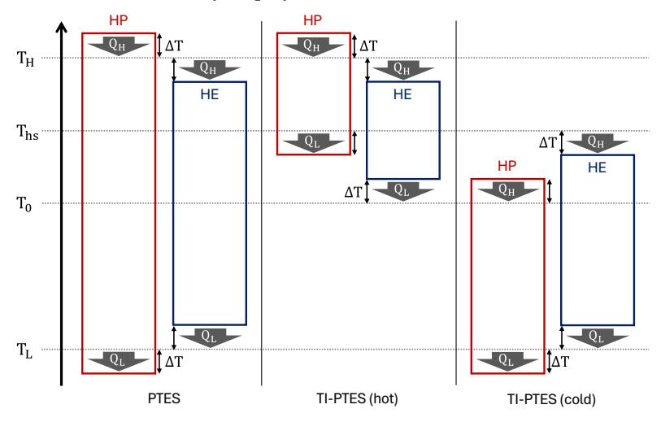

**Fig. 2.1** Illustration of external irreversibilities with the temperature gradient ∆T for different Carnot battery concepts. The red frames represent endoreversible Carnot heat pumps while the blue represent endoreversible Carnot heat engines. From left to right: basic PTES, hot TI-PTES and cold TI-PTES. TH is for high temperature reservoir, TL for low temperature reservoir, T0 for ambient and Ths for low grade heat source. QH and QL are for heat.

Eq. [2.1](#page-48-1) shows that external irreversibilities, represented by ∆T, must be minimised to maximise efficiency (see Fig. [2.2\)](#page-49-0). Designers must therefore minimise the mean temperature difference at heat transfers between the reservoirs and the cycles. This gives rise to the fundamental matching problem, as illustrated in Fig. [1.5.](#page-29-0)

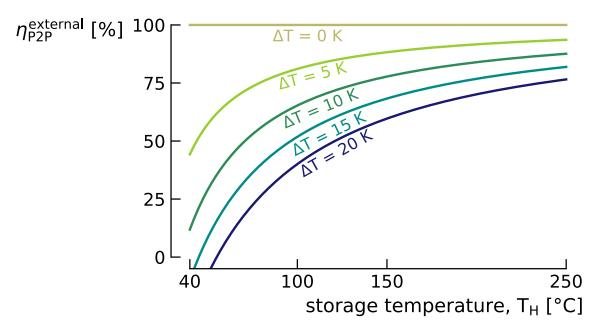

**Fig. 2.2** Effect of external irreversibilities ∆T on the power-to-power efficiency *η* external P2P of PTES for TL = T0 = 15◦C, and for different hot reservoir temperatures (TH).

Fig. [2.2](#page-49-0) also expresses that the hot storage temperature should be maximised to maximise the power-to-power efficiency: the relative impact of external irreversibilities decreases, until the limit case TH = ∞ where *η*P2P = 100%. However, the trend is asymptotic, meaning that beyond a certain point, any further increase in storage temperature has only a marginal impact on the efficiency. This suggests a necessary trade-off between efficiency and system cost, assuming cost increases proportionally with temperature. Also, fewer external irreversibilities result in lower sensitivity of efficiency to storage temperature.

The model developed in Eq. [2.1](#page-48-1) is based on endoreversible cycles with isothermal heat exchanges, which are well suited for isothermal reservoirs (e.g., latent heat storage). However, if sensible heat storage is used, other endoreversible cycles such as the Lorenz cycle can be used without affecting the conclusions of the analysis. The Lorenz cycle assumes isentropic compression and expansion, but non-isothermal heat exchanges. This is further discussed in Appendix [A.1.](#page-223-1)

While the model using a constant ∆T to represent external irreversibilities provides a reasonable intuition of the trends, it lacks realism. In actual machines, ∆T is variable and typically increases with the temperature difference between the hot and cold reservoirs. A more accurate representation of these irreversibilities for heat engines is offered by the Curzon-Ahlborn model [\[129\]](#page-260-2) (see Appendix [A.2\)](#page-225-0). However, since this model has no equivalent for heat pumps, it cannot be applied to Carnot batteries. Hence, the model presented here relies on a constant ∆T.

| **33**

#### 2 | From elementary theory to practical cycles modelling

#### Internal irreversibilities

In contrast to external irreversibilities, internal irreversibilities arise from the production of entropy within the cycle: friction losses inducing pressure drops without producing work, singular pressure losses (e.g., expansion valve), abrupt compression and expansion processes (leading to pressure gradients in control volumes bounded by work-exchanging interfaces), thermal imbalances between the liquid and vapour phases, etc. These are, for example, the irreversibilities in compression and expansion machines. Heat transfer irreversibilities in internal heat exchangers (e.g., recuperators) can also be considered as internal irreversibilities.

By representing the internal irreversibilities as a cycle with a fraction  $g^{\rm Carnot}$  of the efficiency of the reversible Carnot cycle, and referring to the nomenclature in Fig. 2.1, the power-to-power efficiency of the hot TI-PTES is written as

$$\begin{split} \eta_{\rm P2P}^{\rm internal} &= {\rm COP}_{\rm HP}^{\rm internal} \cdot \eta_{\rm HE}^{\rm internal} \\ &= g_{\rm HP}^{\rm Carnot} \cdot \frac{T_{\rm H}}{T_{\rm H} - T_{\rm hs}} \cdot g_{\rm HE}^{\rm Carnot} \cdot \frac{T_{\rm H} - T_{\rm 0}}{T_{\rm H}} \quad . \end{split} \tag{2.2}$$

Assuming, the same Carnot fraction for the heat pump and the heat engine, the equation can be simplified as

$$\eta_{\rm P2P}^{\rm internal} = \left(g^{\rm Carnot}\right)^2 \cdot \frac{T_{\rm H} - T_0}{T_{\rm H} - T_{\rm hs}} \ . \tag{2.3}$$

This simplified modelling approach was already introduced by Peterson [46]. In this case, the graph in Fig. 2.3 shows that the storage temperature has no effect on efficiency of PTES. Again, the Lorenz cycle could also be used for non-isothermal reservoirs, without changing the conclusions of the analysis.

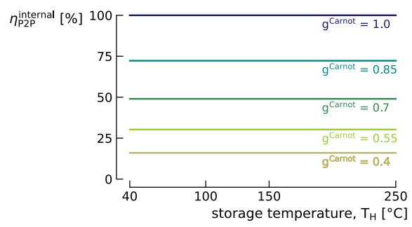

Fig. 2.3 Effect of internal irreversibilities  $g^{Carnot}$  on the power-to-power efficiency  $\eta_{P2P}^{internal}$  of PTES for  $T_L = T_0 = 15^{\circ} C$ , and for different hot reservoir temperatures  $(T_H)$ . External irreversibilities are not considered (i.e.,  $\Delta T = 0$  K).

# 2.1.2 Combining external and internal irreversibilities

Combining external and internal irreversibilities, the power-to-power efficiency of the hot TI-PTES can be written as

$$\eta_{\rm P2P} = g_{\rm HP}^{\rm Carnot} \frac{T_{\rm H} + \Delta T}{T_{\rm H} - T_{\rm hs} + 2\Delta T} \cdot g_{\rm HE}^{\rm Carnot} \frac{T_{\rm H} - T_0 - 2\Delta T}{T_{\rm H} - \Delta T} \quad . \tag{2.4}$$

For different source and storage temperatures, and for g Carnot HP = g Carnot HE = g Carnot , Fig. [2.4](#page-51-0) draws the impact of external and internal irreversibilities on the power-topower efficiency. The values of ∆T = 7.5 K and g Carnot = 0.6 were set so as to represent realistic cycles for Rankine based TI-PTES (refer to Chapter [3\)](#page-63-0). There is a threshold around which it is preferable to either minimise or maximise the storage temperature. For Ths – T0 < 30 K, maximising the storage temperature maximises the efficiency. Conversely, for Ths – T0 > 30 K, it is preferable to minimise it. The value of this threshold depends solely on external irreversibilities (30 K corresponds here to ∆T = 7.5 K, more information on this in Appendix [A.3\)](#page-226-0).

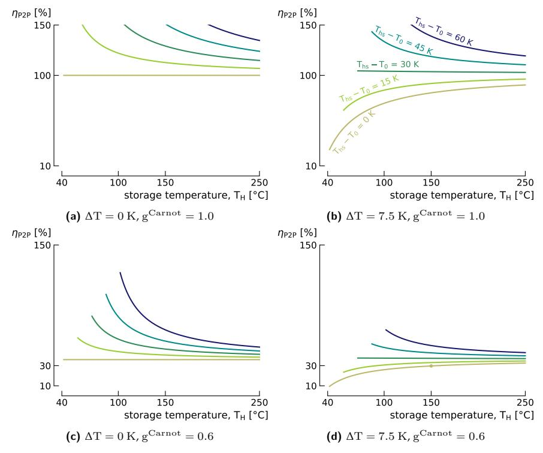

**Fig. 2.4** Impact of external and internal irreversibilities on the power-to-power efficiency *η*P2P of the hot TI-PTES for T0 = 15◦C and for varying heat source and storage temperatures. Ths – T0 represents the difference between the source and sink temperatures.

| **35**

# **2** | From elementary theory to practical cycles modelling

Note that this result conceals the fact that the ratio between the thermal energy absorbed by the heat pump and the work generated by the heat engine is normally constrained by the application (e.g., amount of waste heat available). The storage temperature should therefore not be chosen independently from the application. This will thoroughly be discussed in Chapter [3](#page-63-0) on the performance mapping and in Chapter [5](#page-121-0) on the data centre case study.

This analysis with a simplified model gives a foretaste of the thermodynamics of Carnot batteries. Specifically, to design systems with low storage temperatures, particular attention must be paid to reducing the mean temperature difference at the heat exchanges (i.e., external irreversibilities). Furthermore, for fractions of Carnot efficiency g Carnot = 0.6 and mean temperature differences ∆T = 7.5K at the heat exchangers, the efficiency should remain below 26% for PTES with thermal storage at 100◦C (e.g., non-pressurised water). For a 120◦C storage, this value could rise to 28%, and to 30% for a 150◦C storage. Nevertheless, confirming and comparing these results with models of real cycles is necessary. Performing exergy analyses would also enable to characterise irreversibilities in each component of the system, in order to identify priority points for action to increase the power-topower efficiency (e.g., isentropic efficiencies, etc.).

# **2.2 Thermodynamic model for Rankine Carnot batteries**

In this work, Rankine Carnot batteries with single pressurised water storage are considered (see Fig. [2.5\)](#page-53-1). As the aim is to study small-scale systems with lowtemperature storage, Rankine Carnot batteries are the most suitable. Steinmann [\[35\]](#page-252-1) showed that Brayton Carnot batteries were much more sensitive to the isentropic efficiency of the machinery, which is a severe penalty at small scale. Storage temperatures above 300◦C are also usually required for Brayton Carnot batteries [\[52\]](#page-253-5). Furthermore, these are not really suitable for integrating low-grade heat sources (< 100◦C) as they would marginally benefit from it [\[37\]](#page-252-11).

The single hot reservoir option is adopted to limit the cost of the system and make it easier to control (e.g., no worries about synchronising the state of charge of different storage units, etc.). Using liquid sensible heat storage instead of latent heat storage in phase-change materials (PCM) is motivated by the lower pinches to which it gives rise (i.e., reduction in mean temperature difference, hence external irreversibilities). In addition, this allows effective match with the superheating and subcooling parts of the high-pressure heat exchanges. It can also be effectively coupled to transcritical cycles. Storage in two-tank instead of one stratified tank, despite the additional cost, makes it possible to limit exergy losses (i.e., no diffusion). This also limits the model complexity as it eliminates its time dependency

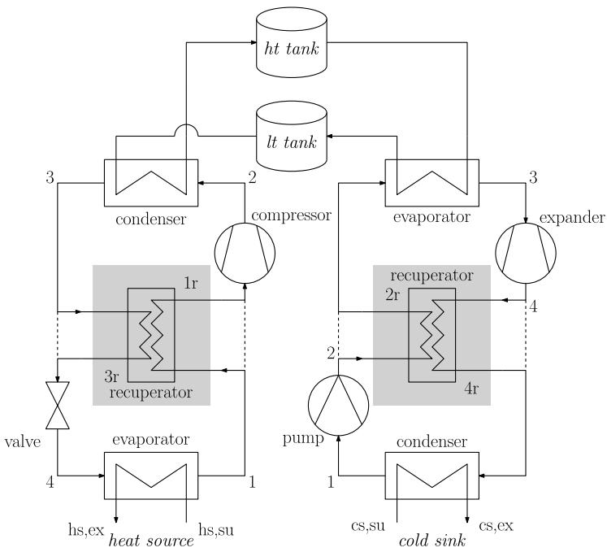

**Fig. 2.5** Different architectures for the Carnot battery. Left: basic and recuperated vapour compression heat pump. Top: sensible heat thermal energy storage with high and low temperature tanks (pressurised water). Right: basic and recuperated organic Rankine cycle. 'ht' is for high temperature, 'lt' for low temperature, 'hs' for heat source, 'cs' for cold sink, 'su' for supply and 'ex' for exit. The shaded areas show the position of the recuperator when it is considered, while the dotted lines show the case without the recuperator.

(i.e., no thermocline needs to be modelled), provided that heat losses can be neglected. Pressurised water is considered as storage medium due of its superior heat capacity. Yet, to avoid storage pressurisation, thermal oils could also be used.

The model developed in this chapter will be used for the optimisation of the thermodynamic cycles of Carnot batteries, as well as for exergy analyses. No operational considerations (e.g., off-design efficiency degradation, part-load efficiency degradation) or dynamics are taken into account. Only thermodynamic parameters are considered. Below, the physical model for each component is described in detail. Then, the algorithm for the numerical resolution of the physical model is presented. The indicators for energy and exergy analyses are finally introduced.

# 2.2.1 Physical model

The model represents vapour compression heat pumps (HP) and organic Rankine cycles (ORC), as shown in Fig. 2.5. Under the steady-state assumption, it obeys the conservation of energy for each component. Also note that each component is

# **2** | From elementary theory to practical cycles modelling

assumed adiabatic (i.e., no heat losses). The use of recuperators is optional and will be further discussed in Chapter [4.](#page-93-0) In the following, the case without a recuperator will be referred to as 'basic' and the case with a recuperator will be referred to as 'recuperated'. Also, the cycles are modelled so as to be able to operate either in subcritical or in transcritical regime.

#### Compression and expansion machinery

Compression and expansion machinery is modelled with the isentropic efficiency. Mechanical losses (e.g., bearings) and electro-mechanical losses (e.g., power converters) are ignored.

**Compressor** Following the nomenclature of Fig. [2.5,](#page-53-1) the isentropic efficiency of the compressor, assuming it is adiabatic, is defined as

$$\eta_{\rm is,comp} = \frac{h_{2,is} - h_1}{h_2 - h_1} ,$$
(2.5)

for the basic HP, with h the working fluid specific enthalpy and h2,is the enthalpy at the compressor discharge for an isentropic compression. For the recuperated HP, it is defined as

$$\eta_{\rm is,comp} = \frac{h_{2,\rm is} - h_{1\rm r}}{h_2 - h_{1\rm r}}$$
 (2.6)

**Feed pump** The isentropic efficiency of the feed pump of the ORC, assuming it is adiabatic, is defined as

$$\eta_{\rm is,pmp} = \frac{h_{2,\rm is} - h_1}{h_2 - h_1} ,$$
(2.7)

with h2,is the enthalpy at the pump outlet for an isentropic compression.

**Expansion valve** The expansion valve is modelled as an adiabatic component that does not produce any work. For the basic HP, the relationship for enthalpy is therefore

$$h_4 = h_3$$
 . (2.8)

For the recuperated HP, the relationship is

$$h_4 = h_{3r}$$
 . (2.9)

**Expander** The isentropic efficiency of the expander of the ORC, assuming it is adiabatic, is defined as

$$\eta_{\rm is,exp} = \frac{h_3 - h_4}{h_3 - h_{4,is}} ,$$
(2.10)

with h4,is the enthalpy at the expander outlet for an isentropic expansion.

#### External heat exchangers

External heat exchangers include the evaporators and the condensers. In transcritical cycles, due to the absence of proper 'phase change', the supercritical heat exchangers are referred to 'gas heaters' and 'gas coolers'. In both cases, these are modelled as adiabatic using the pinch point method: the model identifies the pressure level that sets the desired pinch ∆T pp in each heat exchanger (see numerical model, Section [2.2.2\)](#page-58-0). As this work focuses on low-power systems, heat exchangers are assimilated to counter-flow plate heat exchangers. Auxiliaries (e.g., circulating pumps, etc.) are neglected here. This is a common simplification during thermodynamic design [\[77,](#page-255-5) [81,](#page-255-9) [91,](#page-256-8) [103\]](#page-257-10). Yet, it is important to note that auxiliaries consumption–such as the evaporator fan in an air-source HP or the condenser fan in an air-cooled ORC–can be significant, particularly at small scales [\[130,](#page-260-3) [131\]](#page-260-4).

**Subcritical heat exchangers** For subcritical heat exchangers with phase change, the three-zone model with moving boundaries is commonly adopted [\[78\]](#page-255-6). For low pressure heat exchangers, the three segments of the working fluid (i.e., subcooled liquid, saturated and superheated vapour) can be linearised on the temperatureenthalpy diagram (see the isobars in Fig. [2.6\)](#page-55-0). The pinch is typically located at saturated liquid in evaporators and saturated vapour in condensers. This is illustrated in Fig. [2.7a.](#page-56-0) However, there may be exceptions in the event of strong superheating in the evaporator or strong subcooling in the condenser: the pinch would then be located at the edge of the heat exchanger.

For higher pressures, and specifically getting closer to the critical point, the isobars are less and less linear (see Fig. [2.6\)](#page-55-0). The linearisation of the heat exchange thus progressively becomes less and less valid. To illustrate, Fig. [2.7b](#page-56-0) depicts a condenser diagram for a fluid near its critical pressure: the model ends up not positioning the pinch at the right location–or even violates the Clausius principle if the curves of the working fluid and the secondary fluid intersect. Hence, for high pressure heat exchangers, a consistency check is performed with a multi-zone model (1 K discretisation, see Fig. [2.7c\)](#page-56-0) after evaluation with the three-zone model. If the re-

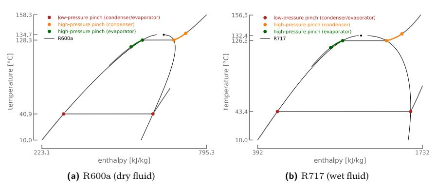

**Fig. 2.6** Isobars of dry and wet fluids on temperature-enthalpy diagrams. The closer to the critical point, the less linear the isobars. Red dots indicate the typical pinch point locations for low pressure heat exchangers. Orange lines highlight the zone where the pinch is typically located in near-critical condensers. Green lines does the same for near-critical evaporators.

| **39**

# 2 | From elementary theory to practical cycles modelling

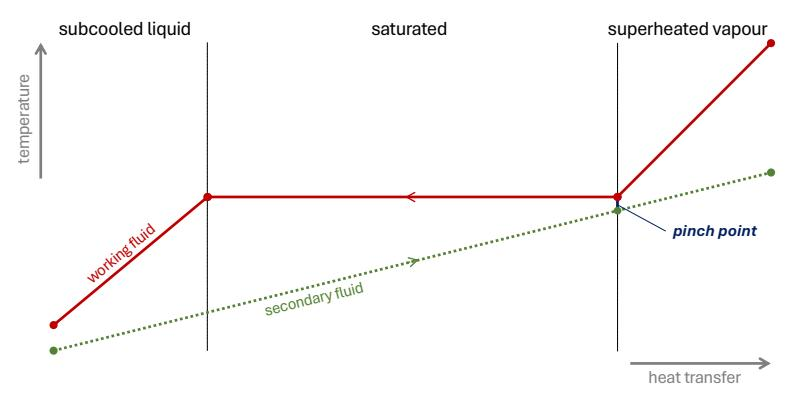

(a) Linearised (three-zone) low-pressure condenser model.

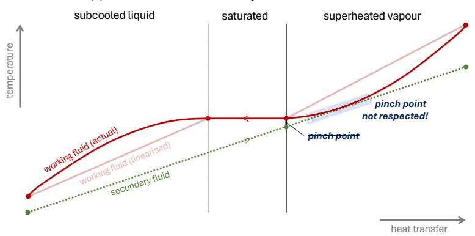

(b) Linearised (three-zone) high-pressure condenser model (near-critical fluid).

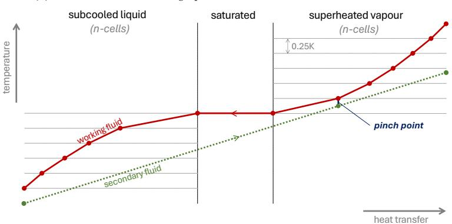

(c) Discretised (multi-zone) high-pressure condenser model (near-critical fluid).

**Fig. 2.7** Schematic representation of the subcritical condenser model on the temperature-heat diagram. In the near-critical regime, the isobar becomes highly non-linear, making linearisation unsuitable for correctly applying the pinch model. To accurately capture the pinch, the non-linear zones must be discretised with high precision.

quired pinch is not respected, the heat exchange is re-evaluated using a 0.25 K discretisation in the multi-zone model (see Fig. [2.7c\)](#page-56-0). This 0.25 K value is a trade-off between model accuracy and computational cost, and is conservative with respect to the current practice [\[132\]](#page-260-5).

Pressure losses can also be considered in the heat exchangers. These are simply defined as a pressure drop ∆p between the saturated liquid and saturated vapour states. A model distributing these losses more precisely along the exchanger in the three zones would require a precise definition of its geometry. This is outside the scope of the thermodynamic model.

**Supercritical heat exchangers** In supercritical heat exchangers, the isobar of the working fluid is always non-linear. A discretised model, such as shown in Fig. [2.7c,](#page-56-0) is therefore systematically used for gas heaters and gas coolers. In supercritical heat exchangers, as opposed to subcritical heat exchangers, the pinch can be located at different positions along the heat exchange, depending on the pressure. Yet, this pressure affects the cycle efficiency: there exists an optimum (see Fig. [2.8](#page-57-0) for basic HP and basic ORC). The optimisation of this pressure will be discussed in the numerical part in Section [2.2.2.](#page-58-0) For supercritical heat exchangers, pressure losses can also be considered by imposing a pressure drop ∆p.

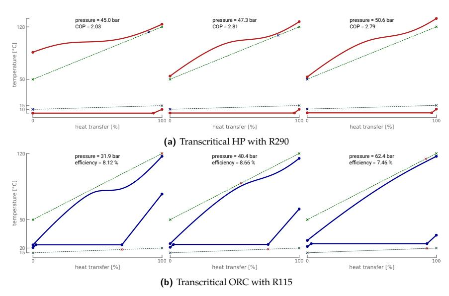

**Fig. 2.8** Temperature-heat diagrams for the low and high pressure heat exchangers of transcritical HP (red) and ORC (blue). Pinches are marked by the blue (HP) and red (ORC) crosses. These diagrams illustrate the necessity of optimising the high pressure in transcritical cycles.

| **41**

#### 2 | From elementary theory to practical cycles modelling

#### Internal heat exchangers

Internal heat exchangers, also known as 'recuperators' or 'regenerators', preheat the working fluid before (HP) or after (ORC) compression by recovering the heat from subcooling (HP) or de-superheating (ORC). These are modelled assuming a constant effectiveness, which represents the ratio of heat actually recovered over the maximum heat theoretically recoverable. This is defined as

$$\varepsilon_{\rm HP}^{\rm rec} = \frac{{\rm T_{1r}} - {\rm T_1}}{{\rm T_3} - {\rm T_1}} ,$$
(2.11)

$$\varepsilon_{\rm ORC}^{\rm rec} = \frac{T_4 - T_{4\rm r}}{T_4 - T_2}$$
 (2.12)

In each recuperator leg, pressure losses are also modelled as pressure drops  $\Delta p$ .

#### Thermal energy storage

Thermal storage is assumed adiabatic, so the storage duration has no effect on the tanks temperature ( $T_{TES}^{ht}$  and  $T_{TES}^{lt}$ ). This is a fair assumption for daily storage, a typical losses are lower than 5%/day [133]. The temperature difference between the two tanks is called the temperature spread ( $\Delta T_{TES}^{sp}$ ). Tanks pressurisation depends on the desired storage temperature for the liquid water. Auxiliaries such as circulation pumps are not taken into account in the model.

#### 2.2.2 Numerical model

The thermodynamic model is implemented in Python1. It uses the low level interface of the CoolProp library [134] for thermodynamic properties, so that other libraries such as REFPROP can also be employed, according to the user preference. By default, equations of state are formulated in the Helmholtz free energy [134]. However, tabular interpolation can also be used to accelerate computations.

The aim of the resolution procedure is to identify the pressure levels in the cycles in order to meet the desired pinch temperature differences in the external heat exchangers. It is as follows (see Fig. 2.9):

- 1. Setting the model parameters:
  - To obtain the enthalpies of the secondary fluid at the inlet and outlet of the heat source, the following properties must be user-defined: supply temperature ( $T_{\rm hs,su}$ ), supply pressure ( $p_{\rm hs,su}$ ), temperature glide across the heat exchanger ( $\Delta T_{\rm hs}^{\rm gl}$ ), secondary fluid (e.g., dry air, water).
  - To represent the heat pump cycle, the following parameters must be defined: vapour superheating ( $\Delta T_{HP}^{sh}$ ), liquid subcooling ( $\Delta T_{HP}^{sc}$ ), compressor

&lt;sup>1The model is available at: https://github.com/laterrea/CBSim

isentropic efficiency  $(\eta_{\rm is,comp})$ , pinch in condenser  $(\Delta T_{\rm HP}^{\rm cd,pp})$  and evaporator  $(\Delta T_{\rm HP}^{\rm ev,pp})$ , pressure losses in condenser  $(\Delta p_{\rm HP}^{\rm cd})$  and evaporator  $(\Delta p_{\rm HP}^{\rm ev})$ , recuperator effectiveness  $(\varepsilon_{\rm HP}^{\rm rec})$  and working fluid.

- For the thermal storage, the following parameters must be defined: hot tank temperature ( $T_{TES}^{ht}$ ), storage temperature spread ( $\Delta T_{TES}^{sp}$ ), storage pressure ( $p_{TES}$ ), storage medium (e.g., water).
- To represent the organic Rankine cycle, the following parameters must be defined: vapour superheating ( $\Delta T_{ORC}^{sh}$ ), liquid subcooling ( $\Delta T_{ORC}^{sc}$ ), pump isentropic efficiency ( $\eta_{is,pmp}$ ), expander isentropic efficiency ( $\eta_{is,exp}$ ), pinch in condenser ( $\Delta T_{ORC}^{cd,pp}$ ) and evaporator ( $\Delta T_{ORC}^{ev,pp}$ ), pressure losses in condenser ( $\Delta p_{ORC}^{cd}$ ) and evaporator ( $\Delta p_{ORC}^{ev}$ ), recuperator effectiveness ( $\varepsilon_{ORC}^{rec}$ ) and working fluid.
- To obtain the enthalpies at the inlet and outlet of the cold sink, the following properties must be defined: supply temperature  $(T_{cs,su})$ , supply pressure  $(p_{cs,su})$ , temperature glide across the heat exchanger  $(\Delta T_{cs}^{gl})$ , secondary fluid (e.g., dry air, water).
- 2. Based on the source, sink, and storage temperatures, the model estimates educated guesses for the low and high pressures in the HP and ORC. These pressures are determined as the average between the theoretical minimum and maximum values required to maintain the desired pinch temperature differences, as well as the specified degrees of subcooling and superheating during heat exchange.
- 3. The model iterates to find the pressures such that the measured pinches correspond to the target ones. This is done using the fsolve function from the SciPy library [135].

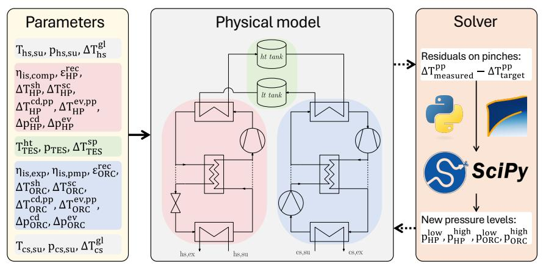

Fig. 2.9 Illustration of the numerical model used for simulating Carnot batteries.

43

#### 2 From elementary theory to practical cycles modelling

Note that the HP and ORC are solved independently. Also, for transcritical cycles, an extra step optimises the upper pressures to maximise the HP and ORC efficiencies. This is achieved using the minimize function from the SciPy library.

# 2.2.3 Energy and exergy analyses

Heat pump

Referring to the nomenclature of Fig. 2.5, the coefficient of performance of the basic HP is defined as

$$COP_{HP} = \frac{Q_{HP}^{out}}{W_{HP}^{in}} = \frac{h_2 - h_3}{h_2 - h_1}$$
, (2.13)

with  $Q_{HP}^{out}$  the thermal energy output and  $W_{HP}^{in}$  the work input. Note that for the recuperated case, the specific compression work is defined as  $h_2 - h_{1r}$  instead of  $h_2 - h_1$ . To properly account for the consumption and production of thermal exergy, the exergy efficiency of the HP can also be used. This is defined as the ratio between the thermal exergy output and the total exergy input (work and thermal exergy):

$$\begin{split} \eta_{\rm HP}^{\rm II} &= \frac{\rm Ex_{\rm HP}^{\rm out}}{\rm Ex_{\rm HP}^{\rm in} + W_{\rm HP}^{\rm in}} \\ &= \frac{(h_2 - h_3)/(h_{\rm TES}^{\rm ht} - h_{\rm TES}^{\rm lt}) \cdot (e_{\rm TES}^{\rm ht} - e_{\rm TES}^{\rm lt})}{(h_1 - h_4)/(h_{\rm hs,su} - h_{\rm hs,ex}) \cdot (e_{\rm hs,su} - e_{\rm hs,ex}) + (h_2 - h_1)} \end{split} \ , \end{split} \tag{2.14}$$

with  $\rm Ex^{out}_{HP}$  the thermal exergy output,  $\rm Ex^{in}_{HP}$  the thermal exergy input and  $\rm e$  the fluids specific exergy. This is defined as

$${\rm e} = ({\rm h} - {\rm h}_0) - {\rm T}_0 \cdot ({\rm s} - {\rm s}_0) \ , \eqno(2.15)$$

with  $h_0$  and  $s_0$  the specific enthalpy and entropy at the reference temperature  $T_0$ . This reference temperature corresponds to the lowest natural temperature in the system, either the same ambient source and sink temperature  $(T_{\rm hs,su} = T_{\rm cs,su})$  in case of PTES, or the sink temperature  $(T_{\rm cs,su})$  in case of hot TI-PTES  $(T_{\rm hs,su} > T_{\rm cs,su})$ . Including the exergy absorbed at the evaporator in the exergy efficiency definition is essential for heat pumps using heat sources at temperatures higher than ambient. As this exergy is non-zero, it must be taken into account [78]. In Eq. 2.14, the ratios of enthalpy differences multiply the exergy differences due to energy conservation at both heat exchangers:

$$\dot{m}_{\mathrm{wf}} \cdot (h_2 - h_3) = \dot{m}_{\mathrm{TES}} \cdot (h_{\mathrm{TES}}^{\mathrm{ht}} - h_{\mathrm{TES}}^{\mathrm{lt}}) \tag{2.16}$$

$$\dot{m}_{\rm wf} \cdot (h_1 - h_4) = \dot{m}_{\rm hs} \cdot (h_{\rm hs,su} - h_{\rm hs,ex})$$
 , (2.17)

with m, the fluids mass flow rates. Hence, the terms of Eq. 2.14 can be defined as:

$$\Rightarrow \dot{\mathrm{Ex}}_{\mathrm{HP}}^{\mathrm{out}} = \dot{\mathrm{m}}_{\mathrm{TES}} \cdot (\mathrm{e}_{\mathrm{TES}}^{\mathrm{ht}} - \mathrm{e}_{\mathrm{TES}}^{\mathrm{lt}}) = \dot{\mathrm{m}}_{\mathrm{wf}} \cdot \frac{(\mathrm{h}_{2} - \mathrm{h}_{3})}{(\mathrm{h}_{\mathrm{TES}}^{\mathrm{ht}} - \mathrm{h}_{\mathrm{TES}}^{\mathrm{lt}})} \cdot (\mathrm{e}_{\mathrm{TES}}^{\mathrm{ht}} - \mathrm{e}_{\mathrm{TES}}^{\mathrm{lt}}) \quad (2.18)$$

$$\Rightarrow \dot{Ex}_{HP}^{in} = \dot{m}_{hs} \cdot \left( e_{hs,su} - e_{hs,ex} \right) = \dot{m}_{wf} \cdot \frac{\left( h_1 - h_4 \right)}{\left( h_{hs,su} - h_{hs,ex} \right)} \cdot \left( e_{hs,su} - e_{hs,ex} \right) \ \ (2.19)$$

$$\Rightarrow \dot{W}_{HP}^{in} = \dot{m}_{wf} \cdot (h_2 - h_{1(r)}) \quad . \tag{2.20}$$

In addition to the exact exergy efficiency  $\eta_{\mathrm{HP}}^{\mathrm{II}}$ , other forms of second law efficiencies are commonly used. The Lorenz cycle is a fairly good representation of cycles with large source and sink temperature glides. The fraction of Lorenz efficiency is therefore a good proxy of the cycle performance. It is defined as

$$\Psi_{\rm HP}^{\rm Lorenz} = \frac{\rm COP_{\rm HP}^{\rm real}}{\rm COP_{\rm HP}^{\rm Lorenz}} = \frac{(h_2-h_3)/(h_2-h_{1(r)})}{\overline{\rm T}_{\rm H}/(\overline{\rm T}_{\rm H}-\overline{\rm T}_{\rm L})} \ , \tag{2.21} \label{eq:2.21}$$

with  $\overline{T}_H$  and  $\overline{T}_L$  the mean sink and source temperatures defined as

$$\begin{split} \overline{T}_{H} &= \frac{T_{TES}^{ht} - T_{TES}^{lt}}{\ln(T_{TES}^{ht}/T_{TES}^{lt})} , \\ \overline{T}_{L} &= \frac{T_{hs,su} - T_{hs,ex}}{\ln(T_{hs,su}/T_{hs,ex})} . \end{split} \tag{2.22}$$

The Lorenz model is here employed as it is more suitable than the Carnot model for Carnot batteries with sensible heat storage (further discussed in Appendix A.1).

Organic Rankine cycle

The efficiency of the basic ORC is defined as

$$\eta_{\rm ORC} = \frac{W_{\rm ORC}^{\rm net}}{Q_{\rm ORC}^{\rm in}} = \frac{W_{\rm ORC}^{\rm out} - W_{\rm ORC}^{\rm in}}{Q_{\rm ORC}^{\rm in}} = \frac{(h_3 - h_4) - (h_2 - h_1)}{h_3 - h_2} , \qquad (2.23)$$

with  $Q_{\mathrm{ORC}}^{\mathrm{in}}$  the thermal energy input,  $W_{\mathrm{ORC}}^{\mathrm{in}}$  the work input and  $W_{\mathrm{ORC}}^{\mathrm{out}}$  the work output. For the recuperated case, the specific input thermal energy is defined as  $h_3-h_{2r}$  instead of  $h_3-h_2$ . The exergy efficiency of the basic ORC is defined as

$$\begin{split} \eta_{\rm ORC}^{\rm II} &= \frac{W_{\rm ORC}^{\rm net}}{Ex_{\rm ORC}^{\rm in}} = \frac{W_{\rm ORC}^{\rm out} - W_{\rm ORC}^{\rm in}}{Ex_{\rm ORC}^{\rm in}} \\ &= \frac{(h_3 - h_4) - (h_2 - h_1)}{(h_3 - h_2)/(h_{\rm TES}^{\rm ht} - h_{\rm TES}^{\rm lt}) \cdot (e_{\rm TES}^{\rm ht} - e_{\rm TES}^{\rm lt})} \ , \end{split} \tag{2.24}$$

with  $\rm Ex^{in}_{ORC}$  the thermal exergy input. In Eq. 2.24, the ratios of enthalpy differences multiply the exergy difference due to energy conservation at both heat exchangers

#### 2 | From elementary theory to practical cycles modelling

(same as in Eq. 2.14). The fraction of Lorenz efficiency is

$$\Psi_{\rm ORC}^{\rm Lorenz} = \frac{\eta_{\rm ORC}^{\rm real}}{\eta_{\rm ORC}^{\rm Lorenz}} = \frac{[(h_3 - h_4) - (h_2 - h_1)]/(h_3 - h_{2(r)})}{(\overline{T}_{\rm H} - \overline{T}_{\rm L})/\overline{T}_{\rm H}} \ , \eqno(2.25)$$

with  $\overline{T}_H$  and  $\overline{T}_L$  the average source and sink temperatures defined as

$$\begin{split} \overline{T}_{H} &= \frac{T_{TES}^{ht} - T_{TES}^{lt}}{\ln(T_{TES}^{ht}/T_{TES}^{lt})} , \\ \overline{T}_{L} &= \frac{T_{cs,su} - T_{cs,ex}}{\ln(T_{cs,su}/T_{cs,ex})} . \end{split} \tag{2.26}$$

Carnot battery

Assuming an adiabatic thermal energy storage (i.e.,  $\mathrm{Q_{HP}^{out}}=\mathrm{Q_{TES}}=\mathrm{Q_{ORC}^{in}}$ ), the power-to-power efficiency of the Carnot battery is defined as

$$\begin{split} \eta_{\rm P2P} &= \frac{W_{\rm ORC}^{\rm net}}{W_{\rm HP}^{\rm in}} = \frac{Q_{\rm TES}}{W_{\rm HP}^{\rm in}} \cdot \frac{W_{\rm ORC}^{\rm net}}{Q_{\rm TES}} \\ &= {\rm COP_{HP}} \cdot \eta_{\rm ORC} \ . \end{split} \tag{2.27}$$

The electrical energy density is another important metric when assessing the performance of energy storage technologies. Considering only the volume of the tanks and neglecting the size of the HP and ORC, it is defined as

$$\rho_{\rm el} = \frac{W_{\rm ORC}^{\rm net}}{V_{\rm TES}^{\rm tot}} = \frac{Q_{\rm TES}}{V_{\rm TES}^{\rm tot}} \cdot \frac{W_{\rm ORC}^{\rm net}}{Q_{\rm TES}} = \frac{h_{\rm TES}^{\rm ht} - h_{\rm TES}^{\rm lt}}{v_{\rm TES}^{\rm ht} + v_{\rm TES}^{\rm lt}} \cdot \eta_{\rm ORC}$$

$$= \rho_{\rm th} \cdot \eta_{\rm ORC} \quad , \tag{2.28}$$

with  $\rho_{\rm th}$  the storage thermal energy density and  $\rm v_{TES}^{ht}$  and  $\rm v_{TES}^{lt}$  the specific volume of the liquid in the high and low temperature tanks.

Knowing that for adiabatic storage  $\mathrm{Ex_{HP}^{out}} = \mathrm{Ex_{TES}} = \mathrm{Ex_{ORC}^{in}}$ , the exergy efficiency of the thermally integrated Carnot batteries is defined as

$$\eta_{\rm II} = \frac{\rm W_{ORC}^{\rm net}}{\rm Ex_{\rm HP}^{\rm in} + W_{\rm HP}^{\rm in}} = \frac{\rm Ex_{\rm TES}}{\rm Ex_{\rm HP}^{\rm in} + W_{\rm HP}^{\rm in}} \cdot \frac{\rm W_{ORC}^{\rm net}}{\rm Ex_{\rm TES}}$$

$$= \eta_{\rm HP}^{\rm II} \cdot \eta_{\rm ORC}^{\rm II} .$$
(2.29)

# **Performance mapping across an extended domain**

T HERMAL integration presents an interesting application for Carnot batteries, as it enables the use of various energy carriers to charge the system (e.g., renewable electricity, (very) low-grade waste heat, renewable heat, etc.). This can provide an additional source of flexibility to energy systems. Although several implementations have been studied over the past decade, they all face the same design challenge: it is not possible to simultaneously maximise power-to-power efficiency (i.e., effectiveness of electricity recovery), total exergy efficiency (i.e., effectiveness of combined heat and electricity recovery), and electrical energy density (i.e., storage size). Moreover, the thermal integration domain (i.e., the combination of heat source and cold sink temperatures) remains largely unexplored, making it difficult to map the theoretical maximum performance of thermally integrated Carnot batteries. Specifically, identifying the optimal designs and nominal performance for heat sources below 60◦C is a challenge. To provide general design guidelines with respect to these three criteria and across the entire thermal integration domain, this chapter contributes to the following research question:

*What is the catalogue of efficient Carnot battery configurations for small-scale thermal integration, and how can they be optimally designed?*

To achieve this, Section [3.1](#page-64-0) first examines the coverage of the thermal integration domain in recent studies. Section [3.2](#page-66-0) then describes the optimisation model used in this chapter. The results are presented in Section [3.3,](#page-71-0) starting with the performance

#### 3 | Performance mapping across an extended domain

maps derived from a multi-criteria analysis (Section 3.3.1), followed by the formulation of design guidelines across the entire domain (Section 3.3.2), and concluding with a detailed analysis of the trade-off between the three optimisation criteria (Section 3.3.3). Section 3.4 summarises the key findings and offers perspectives for future works. This chapter is adapted from a publication in *Energy* [JP2].

# Mapping the Carnot battery trilemma

During the past decade, the concept of thermally integrated pumped thermal energy storage (TI-PTES) has attracted growing interest and several implementations have been proposed. The most common is the basic hot TI-PTES (depicted in Fig. 3.1), consisting in a subcritical vapour compression heat pump (HP), a two-tank sensible heat thermal energy storage (TES), and a subcritical organic Rankine cycle (ORC) [78]. When designing TI-PTES, typical criteria include maximising the power-to-power efficiency  $\eta_{\rm P2P}$  (i.e., effectiveness of electricity recovery, disregarding the opportunity cost of the heat source), the total exergy efficiency  $\eta_{\rm HI}$  (i.e., effectiveness of combined heat and electricity recovery) and the electrical energy density  $\rho_{\rm el}$  (i.e., storage size). However, these are usually conflicting [37,78,80]. It is therefore not possible to design a TI-PTES that maximises these three criteria simultaneously, and that trade-offs must therefore be discussed. It was recently suggested to formalise this conflict by referring to it as the *Carnot battery trilemma* [81].

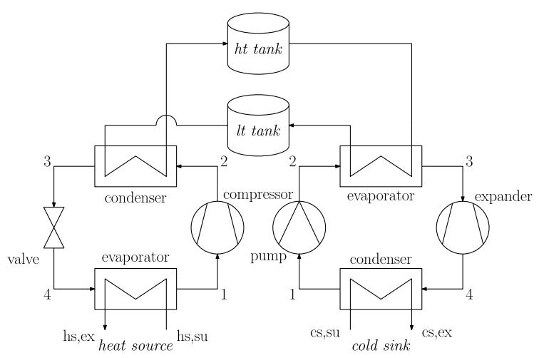

**Fig. 3.1** Layout of the basic hot TI-PTES: vapour compression heat pump (left), two-tank sensible heat thermal energy storage (top) and organic Rankine cycle (right). 'ht' is for high temperature, 'lt' for low temperature, 'hs' for heat source, 'cs' for cold sink, 'su' for supply and 'ex' for exit. Note that the circulating pumps and other auxiliaries are not considered.

3.1

Several studies have optimised the thermodynamic design of TI-PTES, and proposed cycle modifications to enhance the performance. Internal recuperators could for example be inserted the HP and in the ORC to increase the efficiency [\[78\]](#page-255-6). To better match the TES with the cycles–thus reduce external irreversibilities–and to reach higher energy densities, hybrid TES using both sensible and latent heat can also be considered [\[72\]](#page-255-0). An alternative to hybrid TES is to adapt the cycles to TES: organic flash cycles, for instance, offer effective match with sensible heat storage. However, only complex layouts with two-phase expansions and multiple pressure levels can provide efficiency gains [\[80,](#page-255-8) [81\]](#page-255-9). Yet, despite their increased complexity, these cycles could be further considered for TI-PTES because they soften the *Carnot battery trilemma*. Zeotropic mixtures also represent an alternative to reduce external irreversibilities and increase efficiency [\[85\]](#page-256-3). To exploit the low grade heat source during discharge, preheaters can also be inserted into the ORC [\[79\]](#page-255-7). These start preheating the liquid fluid before evaporation with the heat from the TES.

In the aforementioned works, waste heat recovery (WHR) emerges as the most commonly pursued application, with sensible heat storage generally favoured over latent heat. From a technical point of view, this can be explained by the ease of implementation. However, this usually comes at the cost of lower energy densities, and less efficient matches between the cycles and the TES. Still, most technoeconomic studies also consider sensible TES, generally in two tanks, in order to maintain a constant thermal profile and avoid the diffusion problems found in single tanks with thermoclines [\[78,](#page-255-6) [104](#page-258-0)[–107\]](#page-258-1).

Although TI-PTES is an active research topic, most studies published to date do not cover the *Carnot battery trilemma* in its entirety. This is reflected in the fact that the technology is often studied in isolation, and not integrated into energy systems where all three criteria matter. In particular, the use of waste heat is often perceived as a way of 'artificially' boosting *η*P2P, without looking at the overall gain for the energy system. Density is also frequently overlooked. In addition, many studies are limited to parametric analyses, without any optimisation. Also, although different fluids are sometimes considered, the analysis methods are usually not systematic and therefore do not consider all potential synergies between the fluids and the thermodynamic cycles.

Currently, no study has focused on optimising and mapping the performance of TI-PTES with respect to the *Carnot battery trilemma* and in the entire thermal integration domain (i.e., combination of possible source and sink temperatures). As an illustration, the current domain exploration for TI-PTES with sensible TES is represented in Fig. [3.2.](#page-66-2) The region with source temperatures below 60◦C has been particularly little explored. This can be attributed to the fact that *η*P2P is lower in that region (i.e., usually below 50%, refer to Chapter [2\)](#page-47-0), whereas as TI-PTES has often been considered primarily as an electrical storage option, this performance may have seemed rather poor. However, when looking at TI-PTES as a flexible waste heat recovery option, there is no indication that *η*P2P should override *η*II.

# **3** | Performance mapping across an extended domain

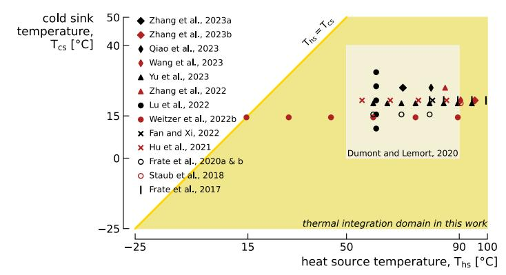

**Fig. 3.2** Exploration of the thermal domain for TI-PTES with sensible TES. Most works have not studied the *trilemma* in its entirety and only few of them have conducted proper optimisation. List of references: Zhang et al., 2023a [\[136\]](#page-260-9); Zhang et al., 2023b [\[79\]](#page-255-7); Qiao et al., 2023 [\[137\]](#page-261-0); Wang et al., 2023 [\[115\]](#page-259-0); Yu et al., 2023 [\[107\]](#page-258-1); Zhang et al., 2022 [\[106\]](#page-258-4); Lu et al., 2022 [\[85\]](#page-256-3); Weitzer et al., 2022b [\[80\]](#page-255-8); Fan and Xi, 2022 [\[105\]](#page-258-3); Hu et al., 2021 [\[104\]](#page-258-0); Dumont and Lemort, 2020 [\[77\]](#page-255-5); Frate et al., 2020a [\[78\]](#page-255-6) & 2020b [\[53\]](#page-253-6); Staub et al., 2018 [\[90\]](#page-256-7); Frate et al., 2017 [\[103\]](#page-257-10).

Moreover, a significant share (45%) of the global low temperature waste heat to be recovered is precisely below 60◦C [\[138\]](#page-261-1). A direct consequence of this poor investigation of the integration domain is that it is currently not possible to provide theoretical maximum performance and design guidelines for TI-PTES across the entire domain, and with regard to the three criteria of the *Carnot battery trilemma*.

This chapter therefore investigates and characterises the *Carnot battery trilemma* over the entire integration domain. Source temperatures go up to 100◦C, a value above which it does not seem appropriate to employ TI-PTES–waste heat could be recovered more efficiently. The sink temperatures range from –25 to 50◦C to cover the majority of climates (i.e., from polar to hot) that can be encountered, and to represent a certain range of poly-generation applications where the latent heat of condensation in the ORC is recovered (see Fig. [1.2\)](#page-23-0).

# **3.2 Model and methods**

# 3.2.1 System model

The basic hot TI-PTES configuration is here considered (see Fig. [3.1\)](#page-64-1). Although enhanced cycles can provide better performance (e.g., recuperated [\[78\]](#page-255-6), zeotropic mixtures [\[83\]](#page-256-1)), the basic configuration is adopted as the aim is to provide generic design guidelines for this reference case. Based on the irreversibilities observed in the optimised cycles, improvements are suggested in the Section [3.3.](#page-71-0) Thermodynamic performance is assessed using the model introduced in Section [2.2.](#page-52-0)

The model parameters and corresponding design constraints are reported in Table 3.1. These are employed to give technical plausibility to the cycles, without being too restrictive from a technological point of view (the aim of the analysis is above all to understand the fundamental thermodynamics of Carnot batteries). Minimum pressures of 0.5 bar are set in the HP and ORC to limit the necessary degree of vacuum [78,139]. Of course, above-atmospheric pressures are ideally desired, but this would be quite restrictive for the choice of working fluids in some parts of the domain (i.e., the higher the critical point, the lower the saturation pressure, which is a penalty for the 'cold region' of the domain, see Appendix B.1). Note that the pressure and volume ratios are not constrained, as multi-stage compression and expansion can be used (although this increases cost and complexity) [141,142]. There is therefore no limit on the maximum pressures. Although the

**Table 3.1** Model parameters and constraints for the TI-PTES optimisation.

| Parameter                      | Symbol                                     | Value                                 | Units                | Ref.    |
|--------------------------------|--------------------------------------------|---------------------------------------|----------------------|---------|
| Heat source temperature        | $T_{hs}$                                   | −25 to 100°C                          | $^{\circ}\mathrm{C}$ | n/a     |
| Heat source temperature glide  | $\Delta { m T}_{ m hs}^{ m gl}$            | design var.                           | K                    | n/a     |
| Cold sink temperature          | $T_{cs}$                                   | $-25$ to $50^{\circ}\mathrm{C}$       | $^{\circ}\mathrm{C}$ | n/a     |
| Cold sink temperature glide    | $\Delta { m T}_{ m cs}^{ m gl}$            | 10                                    | K                    | [78]    |
| Hot tank storage temperature   | ${ m T_{TES}^{ht}}$                        | design var.                           | $^{\circ}\mathrm{C}$ | n/a     |
| Storage temperature spread     | $\Delta { m T}^{ m sp}_{ m TES}$           | design var.                           | K                    | n/a     |
| Max. storage temperature       | Tht TES,max                                | 150                                   | $^{\circ}\mathrm{C}$ | [81]    |
| Min. storage temperature       | $T_{\mathrm{TES,min}}^{\mathrm{lt}}$       | $ m T_{hs}$ – $ m \Delta T_{hs}^{gl}$ | $^{\circ}\mathrm{C}$ | n/a     |
| Storage pressure               | PTES                                       | 7.5                                   | bar                  | n/a     |
| HP working fluid               | $\mathrm{fluid}_{\mathrm{HP}}$             | design var.                           | n/a                  | n/a     |
| ORC working fluid              | $\mathrm{fluid}_{\mathrm{ORC}}$            | design var.                           | n/a                  | n/a     |
| HP vapour superheating         | $\Delta { m T_{HP}^{sh}}$                  | design var.                           | K                    | n/a     |
| HP liquid subcooling           | $\Delta { m T}_{ m HP}^{ m sc}$            | design var.                           | K                    | n/a     |
| ORC vapour superheating        | $\Delta { m T}_{ m ORC}^{ m sh}$           | design var.                           | K                    | n/a     |
| ORC liquid subcooling          | $\Delta { m T}_{ m ORC}^{ m sc}$           | 3                                     | K                    | [81]    |
| Compressor isentropic eff.     | $\eta_{ m is,comp}$                        | 0.75                                  | _                    | [77]    |
| Expander isentropic efficiency | $\eta_{ m is,exp}$                         | 0.75                                  | _                    | [77]    |
| Feed pump isentropic eff.      | $\eta_{ m is,pmp}$                         | 0.50                                  | _                    | [77]    |
| Pressure losses in heat exch.  | $\Delta p_{HP/ORC}$                        | 0                                     | $_{\rm bar}$         | [78,81] |
| Pinch point in heat exchang.   | $\Delta T_{\mathrm{HP/ORC}}^{\mathrm{pp}}$ | 3                                     | K                    | [77,78] |
| Min. HP temperature lift       | $\Delta { m T}_{ m HP,min}$                | 5                                     | K                    | [77]    |
| Min. ORC temp. drop            | $\Delta T_{ORC,min}$                       | 5                                     | K                    | [77]    |
| Max. compress. disch. temp.    | T HP,max                        | 180                                   | $^{\circ}\mathrm{C}$ | [78]    |
| Min. HP superheating           | $\Delta { m T}_{ m HP,min}^{ m sh}$        | 3                                     | K                    | [81]    |
| Min. HP subcooling             | $\Delta T_{\mathrm{HP,min}}^{\mathrm{sc}}$ | 3                                     | K                    | [81]    |
| Min. ORC superheating          | $\Delta { m T}_{ m ORC,min}^{ m sh}$       | 3                                     | K                    | [81]    |
| Min. HP pressure               | $\mathrm{p_{HP}^{min}}$                    | 0.5                                   | bar                  | [78]    |
| Min. ORC pressure              | $p_{ m ORC}^{ m min}$                      | 0.5                                   | bar                  | [78]    |

#### 3 | Performance mapping across an extended domain

maximum pressures obtained remain compatible with standard equipment (across all results, they stay below 55 bar in the HP and 49 bar in the ORC), compression ratios can reach up to 60 in the HP and expansion ratios up to 28 in the ORC (across all results). This clearly confirms the need to employ multi-stage compression and expansion chains. Also, minimum temperature lifts and drops (i.e., temperature difference between storage and source/sink) of 5 K are set in the HP and in the ORC. This is to prevent the cycles from degenerating into configurations where their action on the heat sources would be zero (see designs maximising the powerto-power efficiency in Section 3.3.1). The hot tank temperature is restricted to 150°C to limit the need for water pressurisation (thus the cost). The maximum compressor discharge temperature is 180°C to represent the current HP practice [139,140]. Some work even recommend not exceeding 150°C [141]. Main reasons for that are to prevent lubricant degradation and fluid decomposition [139–141]. All pressure drops, which are technology dependent, are neglected to get more generic conclusions. Nevertheless, the sensitivity of TI-PTES performance to these losses deserves further analyses. Specifically, certain parameters-such as the vapour density of the fluid-significantly influence pressure drops. Benzene is a good example: although it often appears to be a promising candidate from a thermodynamic perspective, its low vapour density necessitates very high volumetric flow rates, which in turn increases pressure drops [130]. There is also no constraint on the volumetric work. However, this is addressed through the volumetric heating capacity (HP) and volume coefficient (ORC) in Chapter 4. Finally note that the heat source and sink are treated as pure dry atmospheric air (i.e., only sensible heat is considered).

# 3.2.2 Optimisation problem

The Carnot battery trilemma consists of the conflict between the power-to-power efficiency  $\eta_{\rm P2P}$ , the exergy efficiency  $\eta_{\rm II}$ , and the energy density  $\rho_{\rm el}$ . These performance indicators are therefore adopted for the multi-criteria analysis. To optimise the system, a set of eight design variables are used (see Table 3.1). The hot tank temperature  $T_{TES}^{ht}$  , heat source glide  $\Delta T_{hs}^{gl}$  (i.e., difference between supply and exit temperatures at the HP evaporator) and storage temperature spread  $\Delta T_{
m TES}^{
m sp}$  (i.e., difference between the hot and cold tanks temperature) have already been identified as key parameters influencing  $\eta_{P2P}$ ,  $\eta_{II}$  and  $\rho_{el}$ , respectively [77,78,80]. Note that the heat source is here treated as 'free' or 'open source' waste heat (i.e., the heat source glide is not constrained by the application). This typically involves exhaust gas, etc. Therefore, in the definition of exergy efficiency in Eq. 2.29,  $Ex_{HP}^{in} = e_{hs.su}$ instead of  $\mathrm{Ex_{HP}^{in}} = \mathrm{e_{hs.su}} - \mathrm{e_{hs.ex}}$  to account for ambient losses. As design variables, we also include the liquid subcooling  $\Delta T_{\rm HP}^{\rm sc}$  in the HP as well as the vapour superheating  $\Delta T_{\rm HP/ORC}^{\rm sh}$  in the HP and in the ORC. These parameters can take on different optimal values depending on the thermal profiles and working fluids [78,132]. The constraints associated with these variables are reported in Table 3.1.

The thermodynamic cycles and the selection of working fluids in the HP and ORC are simultaneously optimised to fully embrace the existing synergies between them (instead of running optimisation for all possible pairs and keeping only the best performing sets [\[53\]](#page-253-6)). A set of 34 pure working fluids is considered. These were selected from CoolProp because they have zero ozone depletion potential (ODP, compliance with Montreal protocol), low to moderate global warming potential (GWP, compliance with Kigali Amendment and EU F-gas regulation) and because their critical point is compatible with subcritical cycles. The full list of fluids is available in Table [3.2.](#page-70-0)

To map the performance of TI-PTES, the integration domain is discretised with a 5 K resolution into 296 cells. In each cell, optimisation is carried out using NSGA-II [\[144\]](#page-261-6) (see Fig. [3.3\)](#page-69-0) through the RHEIA framework [\[145\]](#page-261-7). NSGA-II is a wellestablished evolutionary algorithm for solving multi-criteria optimisation problems. It is inspired by natural selection, using genetic operations such as mutation and crossover to evolve solutions across generations. At each generation, individuals are ranked into different fronts based on the non-dominance criterion, ultimately producing a diverse and representative Pareto front of optimal trade-offs. Note that multi-objective particle swarm optimisation (MOPSO) was also tested through pymoo [\[146\]](#page-261-8). However, it did not show a lower computational budget for equivalent convergence levels. Note also that brute-force optimisation is not feasible due to computational cost constraints (i.e., too many combinations to evaluate).

In Table [3.1,](#page-67-0) all design variables are continuous, except the working fluids. To integrate them to the problem, these were sorted by critical temperature and got assigned tags ranging from 1 to 34. The continuous design space for each fluid then ranges from 0.51 to 34.49, and each tag is obtained by rounding the value to the closest integer. Note that sorting the fluid by critical temperature is intended to facilitate the natural selection of well performing fluids from generation to generation. Yet, more intelligent strategies could integrate other parameters, including the slope of the saturated vapour curve (i.e., wet, dry or isentropic fluids).

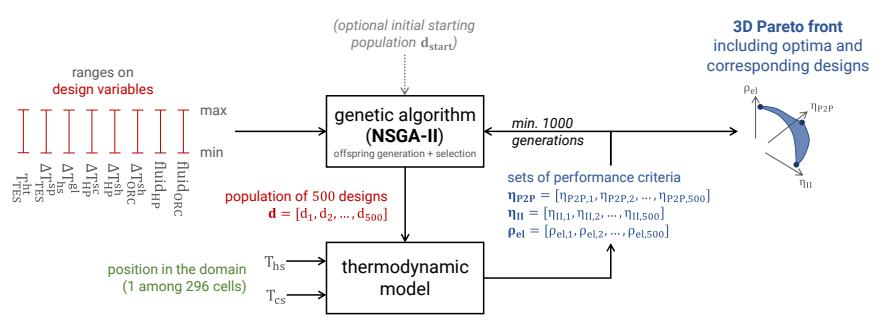

**Fig. 3.3** Illustration of the optimisation process for each cell. Initially, no starting population is provided, so the optimiser selects the 500 designs from the ranges of design variables through Latin Hypercube Sampling.

| **53**

#### 3 | Performance mapping across an extended domain

**Table 3.2** Technical and physical properties of the investigated working fluids (data from CoolProp 6.4.1 [134]).

| Fluid                  | Туре     | $T_{\rm crit}$ | Pcrit | Psat,15°C | $GWP_{100}$       | ASHRAE          | Shape      | No. |
|------------------------|----------|----------------|-------|-----------|-------------------|-----------------|------------|-----|
|                        |          | [°C]           | [bar] | [bar]     |                   | 34 b |            |     |
| R1150 (Ethylene)       | НО       | 9.2            | 50.4  | n.a.      | 6.8               | A3              | wet        | 1   |
| R170 (Ethane)          | HC       | 32.2           | 48.7  | 33.7      | $0.437^{a}$       | A3              | wet        | 2   |
| R41                    | HFC      | 44.1           | 59.0  | 30.1      | 135 a  | N/A             | wet        | 3   |
| R1270 (Propylene)      | НО       | 91.1           | 45.6  | 8.9       | 3.1               | A3              | wet        | 4   |
| R1234yf                | HFO      | 94.7           | 33.8  | 5.1       | $0.501^{a}$       | A2L             | dry        | 5   |
| R290 (Propane)         | HC       | 96.7           | 42.5  | 7.3       | $0.02^{a}$        | A3              | wet        | 6   |
| R161                   | HFC      | 102.1          | 50.1  | 7.0       | 4.84 a | N/A             | wet        | 7   |
| R1243zf                | HFO      | 103.8          | 35.2  | 4.4       | $0.261^{a}$       | N/A             | isentropic | 8   |
| R1234ze(E)             | HFO      | 109.4          | 36.3  | 3.6       | 1.37 a | A2L             | isentropic | 9   |
| R152a                  | HFC      | 113.3          | 45.2  | 4.4       | 164 a  | A2              | wet        | 10  |
| R13I1                  | H        | 123.3          | 39.5  | 3.7       | 0.4               | A1              | wet        | 11  |
| RC270 (cyclo-Propane)  | HC       | 125.2          | 55.8  | 5.5       | N/A               | A3              | wet        | 12  |
| RE170 (dimethyl-Ether) | HC       | 127.2          | 53.4  | 4.4       | 1.0               | A3              | wet        | 13  |
| R717 (Ammonia)         |          | 132.2          | 113.3 | 7.3       | N/A               | B2L             | wet        | 14  |
| R600a (iso-Butane)     | HC       | 134.7          | 36.3  | 2.6       | N/A               | A3              | dry        | 15  |
| 1-Butene               | HC       | 146.1          | 40.1  | 2.2       | N/A               | N/A             | dry        | 16  |
| R1234ze(Z)             | HFO      | 150.1          | 35.3  | 1.2       | $0.315^{a}$       | A2L             | isentropic | 17  |
| R600 (n-Butane)        | HC       | 152.0          | 38.0  | 1.8       | $0.006^{a}$       | A3              | dry        | 18  |
| trans-2-Butene         | HC       | 155.5          | 40.3  | 1.7       | N/A               | N/A             | dry        | 19  |
| Neopentane             | HC       | 160.6          | 32.0  | 1.2       | N/A               | N/A             | dry        | 20  |
| R1233zd(E)             | HCFO     | 166.5          | 36.2  | 0.9       | 3.88a             | A1              | dry        | 21  |
| Novec649               |          | 168.7          | 18.7  | 0.3       | N/A               | N/A             | dry        | 22  |
| R601a (iso-Pentane)    | HC       | 187.2          | 33.8  | 0.6       | N/A               | A3              | dry        | 23  |
| R601 (n-Pentane)       | HC       | 196.5          | 33.7  | 0.5       | N/A               | A3              | dry        | 24  |
| R602 (n-Hexane)        | HC       | 234.7          | 30.4  | 0.1       | 3.1               | N/A             | dry        | 25  |
| Acetone                |          | 235.0          | 47.0  | 0.2       | 0.5               | N/A             | isentropic | 26  |
| cyclo-Pentane          | HC       | 238.6          | 45.7  | 0.3       | N/A               | N/A             | dry        | 27  |
| Methanol               |          | 239.4          | 82.2  | 0.1       | 2.8               | N/A             | wet        | 28  |
| R603 (n-Heptane)       | HC       | 267.0          | 27.4  | < 0.1     | N/A               | N/A             | dry        | 29  |
| cyclo-Hexane           | HC       | 280.5          | 40.8  | < 0.1     | N/A               | N/A             | dry        | 30  |
| Benzene                | HC       | 288.9          | 48.9  | < 0.1     | N/A               | N/A             | dry        | 31  |
| MDM                    | Siloxane | 290.9          | 14.1  | < 0.1     | N/A               | N/A             | dry        | 32  |
| Toluene                | HC       | 318.6          | 41.3  | < 0.1     | 3.3               | N/A             | dry        | 33  |
| ethyl-Benzene          | HC       | 344.0          | 36.2  | < 0.1     | N/A               | N/A             | dry        | 34  |
|                        |          |                |       |           |                   |                 |            |     |

&lt;sup>a Value from Table 7.SM.7 of IPCC AR6 [143]

Note that the simultaneous optimisation of the working fluid and the thermodynamic cycle is an active area of research. An alternative approach to the one presented here, sometimes referred to as 'reverse engineering', consists of first defining an ideal hypothetical fluid and then identifying real fluids with similar properties that maximise actual performance [147–151]. Specifically, in this approach, fluids are represented using continuous and/or discrete variables to build an equation of state used to determine their thermodynamic properties. These variables may correspond to the thermophysical properties of the fluid (i.e., critical pressure and temperature, acentric factor, heat capacity parameters) [147] or to its molecular structure (i.e., segment number, segment diameter, segment energy parameter, and dipole moment) [148–150]. Different types of equations of state, such as Peng-Robinson or Perturbed-Chain Statistical Associating Fluid Theory (PC-SAFT), can be used. This enables, through an optimisation algorithm, the identification of the

&lt;sup>b ASHRAE Standard 34-2022, 'Designation and Safety Classification of Refrigerants'

ideal fluid properties and optimum process parameters (e.g., temperature levels) that maximise the cycle performance. The optimisation is generally carried out using (Mixed-Integer) Non-Linear Programming algorithms. Methods based on molecular structure even allow for the design of new fluids. Given the original approach proposed by these methods, it would be interesting to compare them with the method presented in this work in terms of convergence speed and quality of the results obtained.

In this work, the optimisation process is carried out in two main stages, in order to achieve global convergence and avoid the curse of local optima. Indeed, the optimisation domain to cover is relatively complex–the term porous could be employed–as many combinations of variables lead to physically infeasible solutions, or which do not respect the design constraints (e.g., high storage temperatures make subcritical operations impossible if the critical temperature of the fluid is too low). To cover this optimisation domain properly, the population size and mutation probability are first set to 500 and 50%, respectively. In this sense, the idea is to build a preliminary map in a way that is almost like a random search. Experience has shown that 1000 generations are generally sufficient to obtain 'global' optima for each objective. The results are then post-processed: when a cell of the thermal domain shows much worse performance than its neighbours, or causes a discontinuity in the map trends, some individuals from the surrounding cells are inserted in its population. Then, optimisation is relaunched for that cell, using this updated initial population. These two steps are reproduced until hypervolume convergence seems to be reached (i.e., the 'volume' of the Pareto front is not increasing anymore, see Appendix [C.1\)](#page-236-1). In a second stage, the mutation probability is reduced to 10% and optimisation is relaunched in the entire domain to refine the results and smoothen the Pareto fronts.

# **3.3 Results of performance optimisation**

The first part of this section focuses on mapping the performance of the basic hot TI-PTES over the entire thermal integration domain, and on analysing the optimal thermodynamic designs. The various trends are then discussed and design guidelines are step-by-step constructed according to the objectives sought. Conflicts between the different objectives are also qualitatively assessed. In the second part, the design guidelines are summarised and illustrated over the domain. Further discussions on some design parameters are also carried out. In the third part, the *Carnot battery trilemma* is studied quantitatively by analysing the Pareto fronts resulting from the multi-criteria analysis.

# 3.3.1 Performance mapping

In each of the 296 cells of the domain, the three designs providing the best  $\eta_{P2P}$ ,  $\eta_{\rm II}$ , and  $\rho_{\rm el}$  were selected to construct the maps depicted in Fig. 3.4. They are represented as a pay-off table to illustrate the conflict between the different objectives of the trilemma: for each optimised objective, the value of the two others is also mapped. The corresponding heat source temperature glide  $\Delta T_{hs'}^{gl}$  hot storage temperature  $T_{\rm TES}^{\rm ht}$  and storage temperature spread  $\Delta T_{\rm TES}^{\rm sp}$  are depicted in Fig. 3.5, as they are key variables in TI-PTES [77,78]. The other design variables, including the working fluids, vapour superheating and liquid subcooling are discussed later in Section 3.3.2. To give a more pictorial reading of the results, representative T-sdiagrams corresponding to four locations in the domain are represented in Fig. 3.6.

#### Results for optimised power-to-power efficiency

As expected from the simplified model in Chapter 2 (see Fig. 2.4b), the powerto-power efficiency increases with the difference between the source and sink temperatures ( $\Delta T_{hs-cs} = T_{hs} - T_{cs}$ ). It ranges from about 30% when  $\Delta T_{hs-cs} = 0$  K to more than 400% when  $\Delta T_{\rm hs-cs} = 125~{\rm K}$  (see Fig. 3.4). However, because of a design shift, the growth is not continuous. For  $\Delta T_{\rm hs-cs} \geq 30$  K, the storage temperature  $T_{TES}^{ht}$  is minimised so that the heat pump lift is always minimised (i.e.,  $\Delta T_{HP} = 5$  K). In this sense, COPHP is maximised to the detriment of  $\eta_{ORC}$ , which is negatively affected by the lower  ${
m T}_{
m TES}^{
m ht}$ .

Below the tipping point (i.e.,  $\Delta T_{\rm hs-cs}\,<\,30$  K), on the other hand, the lift is almost always maximised, so that  $T_{TES}^{ht} = T_{TES.max}^{ht} = 150^{\circ} C$ . The only exception is for the part of the domain where  $T_{\rm hs} > 35^{\circ}{\rm C}$  and  $\Delta T_{\rm hs-cs} < 30$  K, where  $T_{\rm TES}^{\rm ht}$  gradually increases with decreasing  $\Delta T_{\rm hs-cs}.$  The reason for this discontinuity in  $T_{\rm TES}^{\rm ht}$  is the technical constraint on the maximum storage temperature (i.e.,  $T_{\rm TES,max}^{\rm ht} = 150^{\circ}{\rm C})^{1}$ . In fact, as  $T_{\rm cs}$  is also higher in that region,  $\eta_{\rm ORC}$  is penalised since the temperature drop  $\Delta T_{\rm ORC} = T_{\rm TES}^{\rm ht} - T_{\rm cs}$  decreases. To compensate,  $ext{COP}_{ ext{HP}}$  is increased by reducing  $ext{T}_{ ext{TES}}^{ ext{ht}}$  (which, by the way, affects  $\eta_{ ext{ORC}}$ even more). An new optimal trade-off must therefore be found between  $\eta_{\rm ORC}$  and  $COP_{HP}$ . Nonetheless, the effect of this  $T_{TES,max}^{ht} = 150^{\circ}C$  constraint on  $\eta_{P2P}$ is very small. The iso- $\eta_{P2P}$  lines shown in Fig. 3.4 are actually homogeneous in that region of the domain, and they show no discontinuity. On the other hand, on that upper left region, the storage spread is minimised, resulting in a significant reduction in  $\rho_{\rm el}$ . The message that emerges from this analysis is that the optimal thermodynamic configuration can be a function of the design constraints. Overall, this also illustrates that approaches such as near-optimal design could lead to dif-

 $^1\mathrm{By}$  increasing the constraint  $\mathrm{T^{ht}_{TES,max'}}$   $\eta_{\mathrm{ORC}}$  would increase and it would no longer be necessary to decrease  $T_{TES}^{ht}$  to maximise  $\eta_{P2P}$ . This is illustrated in Appendix B.1 by raising  $T_{TES,max}^{ht}$  to  $250^{\circ}C$ -although this is probably beyond the technological limits for HP.

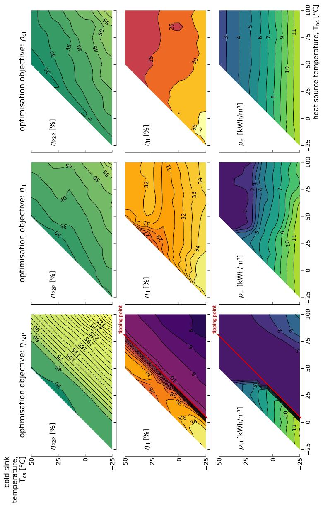

**Fig. 3.4** Performance maps of power-to-power efficiency  $\eta_{P2P}$  (1st row), exergy efficiency  $\eta_{II}$  (2nd row) and electrical energy density  $\rho_{el}$  (3rd row) for the configurations maximising  $\eta_{P2P}$  (1st column),  $\eta_{II}$  (2nd column) and  $\rho_{el}$  (3rd column). Some maps have been smoothed using Gaussian filtering to eliminate local convergence issues (model artifacts). The spacing between the contour lines is refined on some maps to increase legibility.

| 57

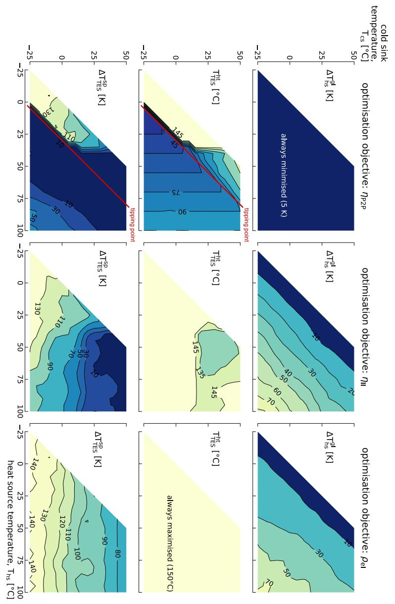

Fig. 3.5 Set of design variables with the most significant influence on the Carnot battery trilemma: heat source temperature glide  $\Delta T_{\rm hs}^{\rm gl}$  (1st row), hot storage temperature  $T_{\rm TES}^{\rm ht}$  (2nd row) and storage temperature spread  $\Delta T_{\rm TES}^{\rm sp}$  (3rd row) for the configurations maximising  $\eta_{\rm P2P}$  (1st column),  $\eta_{\rm II}$  (2nd column) and  $\rho_{\rm el}$  (3rd column). Some contour lines have been smoothed to eliminate local convergence issues (model artifacts).

#### Results of performance optimisation | 3.3

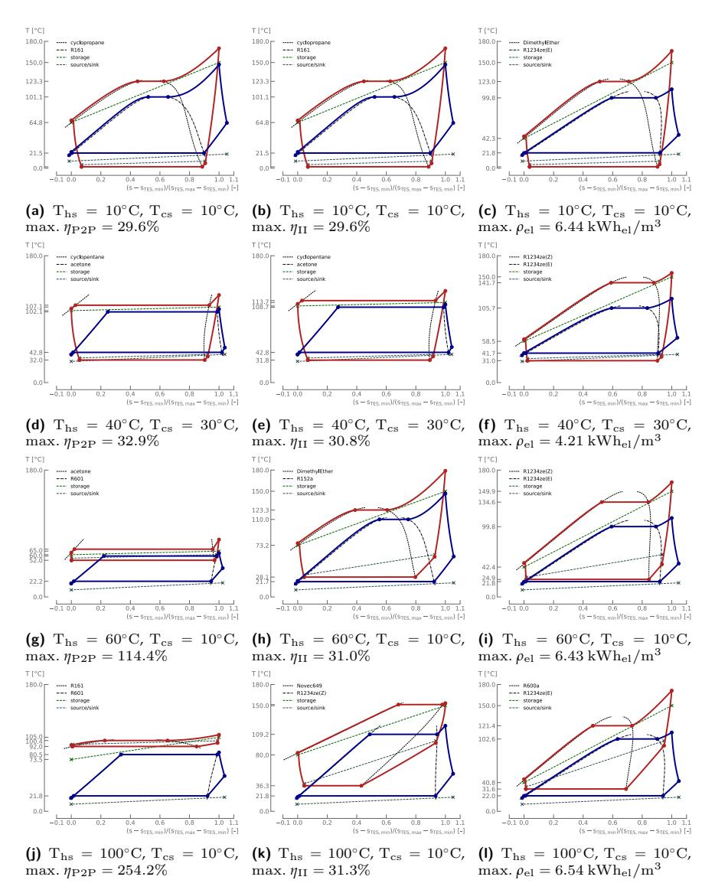

Fig. 3.6 T-s diagrams of the configurations maximising  $\eta_{\rm P2P}$  (1st column),  $\eta_{\rm II}$  (2nd column) and  $\rho_{\rm el}$  (3rd column) for four different locations in the domain. Red solid lines are for the HP and the blue are for the ORC. Green dashed lines correspond to the TES and are positioned to illustrate the heat transfer with the cycles. Grey dashed lines indicate the heat source and cold sink. Note that these dashed lines do not formally represent heat transfers, but they provide useful intuition regarding their quality. They also help to better grasp the Carnot batteries designs.

59

ferent cycles for similar performance, and that such methods should be considered, for instance, to identify whether tolerating a small loss in  $\eta_{\rm P2P}$  makes it possible to maintain  $\rho_{\rm el}$  at a high level. This issue is further discussed in the multi-criteria analysis in Section 3.3.3 and addressed in Chapter 4.

The existence of the 30 K tipping point, which Weitzer et al. [80] also detected, can be attributed to external irreversibilities, as discussed in Chapter 2. Below it, the relative impact of external irreversibilities is minimised when the storage temperature is maximised (see Eq. 2.4 and Fig. 2.4). To maximise the exergy efficiency of the charging and discharging cycles—and a fortiori the power-to-power efficiency of the TI-PTES, the storage temperature must be maximised. It can also be shown that the value of the tipping point increases with the heat transfer irreversibilities (refer to Appendix A.3). In practice, this 30 K value is specific to the pinch-points selected in this work. Yet, the external irreversibilities ( $\Delta T$  in Eq. 2.4) are also largely influenced by the storage temperature spread, and by the degrees of subcooling and superheating. Nevertheless, 30 K is an order of magnitude to bear in mind for TI-PTES (Weitzer et al. [80] obtained a similar value).

Note that this analysis with the simplified thermodynamic model confirms the assumption that  $T_{TES}^{ht}$  should always be maximised below the tipping point (even for  $T_{hs}>35^{\circ}\mathrm{C}$ ), and that the results observed in Fig. 3.5 are effectively due to the constraint on  $T_{TES,max}^{ht}$  (further refer to Appendix B.1).

Another key message from these results is that when  $\Delta T_{hs-cs}$  is above the tipping point, optimising for maximum  $\eta_{P2P}$  results in a TI-PTES system that effectively degenerates into a simple TES + ORC configuration—i.e., the heat pump lift is minimised. In this case, the system becomes suitable for pilotable electricity production but ceases to function as a true power-to-power storage solution. Thus, designing a TI-PTES solely based on maximising  $\eta_{P2P}$  is fundamentally flawed. It leads to the use of a heat pump that performs no real work: the exergy content of the heat source remains unchanged (i.e., the thermal storage operates at the same temperature as the source), and the electricity consumed by the heat pump merely offsets the cycle irreversibilities and the losses in transferring heat from the source to the thermal storage. This degeneration is well illustrated in the T-s diagrams in Figs. 3.6g & 3.6g.

Regarding the heat source glide  $\Delta T_{hs}^{gl}$  and storage spread  $\Delta T_{TES}^{sp}$ , these are minimised on the largest part of the domain (see Figs. 3.6d & 3.6g). Consequently,  $\eta_{II}$  and  $\rho_{el}$  are rather poor (see Fig. 3.4), since a lot of exergy is lost at the source ( $\Delta T_{hs}^{gl}$  is minimised) and because the low  $\Delta T_{TES}^{sp}$  limits the thermal density. Nevertheless,  $\eta_{II}$  gradually deteriorates as  $\Delta T_{hs-cs}$  increases, because the exergy content of the source also increases, while most of it is lost to the environment. In the south-eastern part of the domain,  $\Delta T_{TES}^{sp}$  increases slightly (this is also highlighted in Fig. 3.7) in order to reduce the condensation temperature in the HP (see Fig. 3.6j) and to increase its COP, which results in a partial improvement in the density.

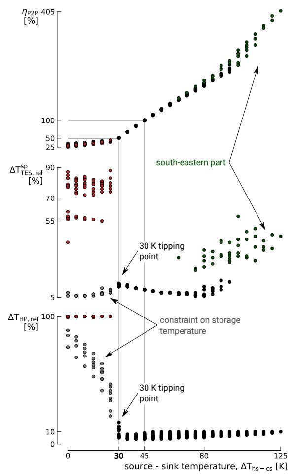

Fig. 3.7 Optimised power-to-power efficiency  $\eta_{\rm P2P}$  (top), and corresponding relative storage spread  $\Delta T_{\rm TES,rel}^{\rm sp}$  (center) and relative heat pump lift  $\Delta T_{\rm HP,rel}$  (bottom) according to the source-sink temperature difference  $\Delta T_{\rm hs-cs}$ . The deviation from theory due to  $T_{\rm TES,max}^{\rm ht} = 150^{\circ}{\rm C}$  is marked with gray dots (red and black mark the results which are in line with theory). The spread increase in the south-eastern part of the domain is marked with green dots.

The above analysis does, however, not apply to the region of the domain where the storage temperature is maximised (i.e., below the 30 K tipping point). There, the storage spread takes much higher values: the relative storage spread, which is defined as

$$\Delta T_{\rm TES,rel}^{\rm sp} = \frac{\Delta T_{\rm TES}^{\rm sp}}{T_{\rm TES}^{\rm ht} - T_{\rm cs}} = \frac{\Delta T_{\rm TES}^{\rm sp}}{\Delta T_{\rm ORC}} \ , \tag{3.1}$$

lies between 70% and 90%, as illustrated in Fig. 3.7. Weitzer et al. [80] also showed that when the storage temperature was maximised, increasing the storage temperature

ature spread was necessary to maximise  $\eta_{\rm P2P}$ . The main reason for this is that large spreads make it possible to lower the condensation temperature in the HP, which reduces the compression work, while at the same time allowing significant subcooling, thus improving  ${\rm COP_{HP}}$  (this is well illustrated in Fig. 3.6a). However, as this also penalises  $\eta_{\rm ORC}$ , there is an optimal spread to be found. Interestingly, this leads to increased  $\rho_{\rm el}$  and relaxes the *Carnot battery trilemma*, as this will be further discussed in the multi-criteria analysis.

To ease the formulation of design guidelines, Fig. 3.7 also introduces the relative heat pump lift,

$$\Delta T_{\rm HP,rel} = \frac{T_{\rm TES}^{\rm ht} - T_{\rm hs}}{T_{\rm TES,max}^{\rm ht} - T_{\rm hs}} = \frac{\Delta T_{\rm HP}}{\Delta T_{\rm HP,max}} \ . \tag{3.2}$$

The latter effectively indicates where the lift is minimised (black dots) and maximised (red dots), and prescribes it an optimal value in the region where  $\Delta T_{hs-cs} < 30~\rm K$  and  $T_{hs} > 35^{\circ} \rm C$  (grey dots).

#### Results for optimised $\eta_{\rm II}$

The exergy efficiency globally drops as the sink temperature  $T_{cs}$  increases, from about 35% when  $T_{cs}=-25^{\circ}\mathrm{C}$  to about 30% when  $T_{cs}=15^{\circ}\mathrm{C}$  (see Figs. 3.4 & 3.8). The main driver is the decrease in ORC efficiency  $\eta_{ORC}$  (see Fig. 3.8), because, by Carnot efficiency, an increase in  $T_{cs}$  leads to a reduction in  $\eta_{ORC}$  (the storage temperature  $T_{TES}^{ht}$  is always maximised in that region of the domain). The storage temperature spread  $\Delta T_{TES}^{sp}$  also decreases as  $T_{cs}$  increases, so as to limit the effect on  $\eta_{ORC}$  (i.e., the lower the spread, the higher the evaporation point, and therefore the higher  $\eta_{ORC}$ ). This result contrasts with that of Frate et al. [78] who, for equivalent design variables, also recommended maximising  $T_{TES}^{ht}$  but minimising  $\Delta T_{TES}^{sp}$ . The explanation we find is that, when  $T_{TES}^{ht}$  is maximised, increasing the spread is necessary because the gain in  $COP_{HP}$  thanks to subcooling compensates for the loss in  $\eta_{ORC}$  (i.e., there is an optimal trade-off between  $COP_{HP}$  and  $\eta_{ORC}$ ).

When  $T_{cs}>15^{\circ}\mathrm{C}$ ,  $\eta_{II}$  slightly re-increases and stabilises around 32.5% because of a design shift (see Fig. 3.8):  $T_{TES}^{ht}$  is reduced to values between  $130^{\circ}\mathrm{C}$  and  $150^{\circ}\mathrm{C}$  (especially for lower  $\Delta T_{hs-cs})$  and  $\Delta T_{TES}^{sp}$  to values below  $30~\mathrm{K}$ . The reason for this shift is the same as the one introduced for  $\eta_{P2P}$ : while  $\eta_{ORC}$  deteriorates and cannot be increased by a higher  $T_{TES}^{ht}$  because of the  $T_{TES,max}^{ht}$  constraint, it can no longer compensate for the lower  $COP_{HP}$ . Reducing  $T_{TES}^{ht}$  slightly therefore helps to find another optimal trade-off between  $\eta_{ORC}$  and  $COP_{HP}$ . Finally, the drop in  $\Delta T_{TES}^{sp}$  increases  $\eta_{ORC}$  as this increases the evaporation temperature (this is clearly visible in Fig. 3.8).

The other key parameter influencing  $\eta_{II}$  is the heat source glide  $\Delta T_{hs}^{gl}$ . A high  $\Delta T_{hs}^{gl}$  leads to an effective waste heat recovery (it reduces the exergy losses at the source), but this reduces  $COP_{HP}$ , as the evaporation temperature decreases (see

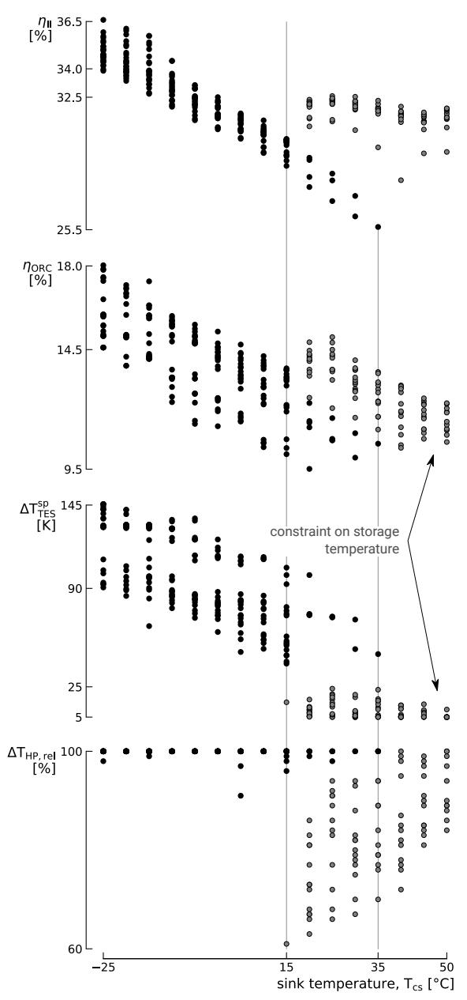

**Fig. 3.8** Optimised exergy efficiency  $\eta_{\rm II}$  (top), ORC efficiency  $\eta_{\rm ORC}$  (second), storage temperature spread  $\Delta T_{\rm TES}^{\rm sp}$  (third) and corresponding relative heat pump lift  $\Delta T_{\rm HP,rel}$  (bottom) depicted according to the sink temperature  $T_{cs}$ . Grey dots correspond to the region affected by the constraint on maximum storage temperature.

I 63

#### 3 | Performance mapping across an extended domain

Figs. 3.6h & 3.6k). A trade-off must therefore be found. The relative heat source glide, defined as

$$\Delta T_{\rm hs,rel}^{\rm gl} = \frac{\Delta T_{\rm hs}^{\rm gl}}{\Delta T_{\rm hs-cs}} \quad , \tag{3.3}$$

remains between 50 and 65% when  $\eta_{\rm II}$  is maximised (see Fig. 3.9).

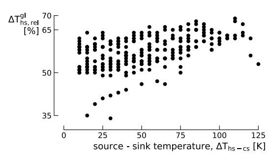

Fig. 3.9 Relative heat source glide  $\Delta T_{\rm hs,rel}^{\rm gl}$  for the design maximising the exergy efficiency.

Finally, because  $\Delta T_{TES}^{sp}$  is relatively high when maximising  $\eta_{II}$ , the density  $\rho_{el}$  obtained throughout the zone where  $T_{TES}^{ht}=150^{\circ}\mathrm{C}$  is close to that obtained when  $\rho_{el}$  is maximised (see third column in Fig. 3.4). This will be further discussed in the multi-criteria analysis (Section 3.3.3).

#### Results for optimised $\rho_{\rm el}$

The optimal electrical energy density is a trade-off between the thermal density (i.e., the higher  $\Delta T_{TES}^{sp}$ , the higher the thermal density) and  $\eta_{ORC}$  (i.e., the higher  $\Delta T_{TES}^{sp}$ , the lower  $\eta_{ORC}$ ). As it can be observed in Figs. 3.4 & 3.10, because  $\eta_{ORC}$  is a function of  $T_{cs}$ ,  $\rho_{el}$  linearly decreases with increasing  $T_{cs}$ . It ranges from about  $12~kWh_{el}/m^3$  when  $T_{cs}=-25^{\circ}C$  to  $2.5~kWh_{el}/m^3$  when  $T_{cs}=50^{\circ}C$ . Note that a TES in a single tank with an ideal thermocline could double these values, as one of the two tanks would be removed.

The optimal storage spread linearly varies from about 150~K when  $T_{cs}=-25^{\circ}C$  to about 70~K when  $T_{cs}=50^{\circ}C.$  To reach such spreads and to maximise  $\eta_{ORC}$ ,  $T_{TES}^{ht}$  is always maximised. Moreover, as a rule of thumb, it is shown in Fig. 3.10 that for the designs maximising the density, the relative storage spread  $\Delta T_{TES,rel}^{sp}$  lies between 70 and 90%.

Note that the heat source glide  $\Delta T_{hs}^{gl}$  has a clear increasing trend with increasing  $\Delta T_{hs-cs}$  (see Fig. 3.5). This is due to the fact that this parameter must have a sufficient value to ensure that the evaporation temperature in the HP is lower than the condenser exit temperature, so as to allow significant storage temperature spreads and large large subcooling (see Figs. 3.6i). A beneficial consequence of this is that the exergy losses at the source are reduced, thereby favouring  $\eta_{\rm II}$ .

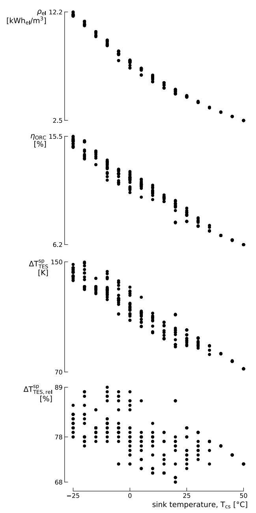

Fig. 3.10 Optimised electrical energy density  $\rho_{\rm el}$ , ORC efficiency  $\eta_{\rm ORC}$ , storage spread  $\Delta T_{\rm TES}^{\rm sp}$  and relative storage spread  $\Delta T_{\rm TES,rel}^{\rm sp}$  according to the sink temperature  $T_{\rm cs}$ .

| 65

# 3.3.2 Further design analyses

In Section 3.3.1, only the variables mainly affecting the *Carnot battery trilemma* have been discussed. However, parameters such as the choice of optimal fluids and the levels of superheating and subcooling also play an important role. This section therefore focuses on these. In addition, it provides a graphical summary of the design guidelines for the basic hot TI-PTES.

#### Optimal fluids

To represent the diversity of fluids encountered over the entire domain, Fig. 3.11 shows a mosaic where the colour of each tile represents one of the fluids from Table 3.2. 26 of these are actually used to provide optimal performance. Depending on the objective, the optimal fluids vary, in particular because of the shape of the cycles and due to changes in temperature levels. Although there are local fluctuations, certain areas seem to be emerging. For example, in regions where the storage temperature spread  $\Delta T_{\rm TES}^{\rm sp}$  is large, R1234ze(E) is very often used in the ORC. When  $\eta_{\rm P2P}$  and  $\eta_{\rm II}$  are maximised, Acetone predominates in the HP and in the ORC, throughout the zone where  $T_{\rm cs}>15^{\circ}{\rm C}$ . The few disparities within the uniform zones are also a sign suggesting that opting for near-optimal methods would be relevant (different fluids give similar performance). At some locations, the same fluid is used in the ORC and in the HP (e.g., Acetone): this is an encouraging sign for the development of invertible HP/ORC systems [89,90]. Also, when  $\eta_{\rm P2P}$  is maximised, the choice of fluid in the HP is contingent on  $T_{\rm hs}$ , whereas it is contingent on  $T_{\rm cs}$  in the ORC.

Although Fig. 3.11 is interesting for assessing the diversity of fluids encountered, it says very few about the way they are used. When looking at the T-s diagrams in Fig. 3.6, it appears that when large  $\Delta T_{TES}^{\rm sp}$  are used, the HP and the ORC usually operate in 'near-critical' regime. To map this, Fig. 3.12 shows the temperature difference between the critical point of the fluid and the high saturation temperature in the HP and in the ORC. In regions with large  $\Delta T_{TES}^{\rm sp}$ , this temperature difference is very small ( $\leq 7.5~\rm K$ ). For the ORC, this can be explained by the fact that increasing the evaporation temperature (and a fortiori the evaporation pressure) reduces the calorific action required to evaporate the working fluid, and therefore maximises its efficiency. For the HP, by minimising the amount of latent heat in the heat transfer with the TES, the heat exchange profile makes it possible to reduce both the heat transfer irreversibilities and the condensation pressure, which is favourable to  $\rm COP_{HP}$ .

Based on these observations, in the concerned regions, transcritical cycles could be good candidates for TI-PTES. Maraver et al. [132] have for instance shown that, for ORC with large heat source glides (i.e., corresponding to large storage spreads here), the transcritical regime can sometimes provide efficiency gains over the subcritical regime. However, these observations were contingent on the fluids selected

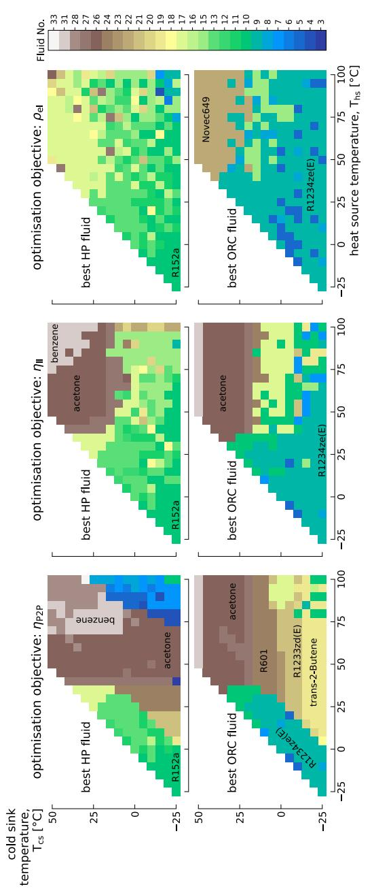

**Fig. 3.11** Optimal fluids in the HP (1st row) and in the ORC (2nd row) for the configurations maximising  $\eta_{\rm P2P}$  (1st column),  $\eta_{\rm H}$  (2nd column) and  $\rho_{\rm el}$  (3rd column) respectively.

I 67

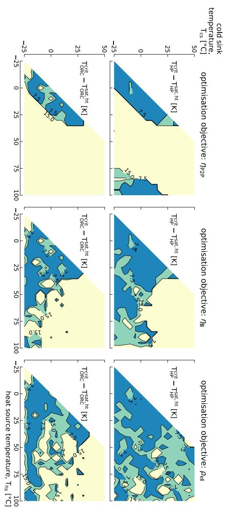

**Fig. 3.12** Difference between critical temperature of the fluid and the high saturation temperature in the HP ( $1^{\rm st}$  row) and in the ORC ( $2^{\rm nd}$  row). The blue zones indicates the regions where the difference is below 7.5 K (i.e., near-critical operations). In the cyan zones, this difference is below 15 K for both. It is above 15 K in the rest of the domain.

and on the temperature of the heat source. Dedicated analyses would therefore be required to extend these results to TI-PTES. Also, as a large number of constraints apply to the choice of the working fluid when designing a HP or an ORC (e.g., maximum permitted charge, price, density, compliance with local regulation, etc.), applying near-optimal analyses for this phase of the design seems relevant to broaden the range of possibilities. Both these aspects will be addressed in Chapter 4.

#### Optimal superheating and subcooling

In the HP, liquid subcooling  $\Delta T_{HP}^{sc}$  is always maximised, so the condenser outlet temperature is equal to the cold reservoir temperature (i.e.,  $T_{TES}^{lt}$ ) plus the pinch  $\Delta T^{pp}$ . This is well illustrated in the various T-s diagrams in Fig. 3.6 (although these are not strictly heat transfer diagrams). Because of its importance, this subcooling must be implemented and regulated using dedicated techniques. Active charge control in the cycle to regulate the liquid level in the condenser or the use of a separate heat exchanger (i.e., a subcooler) are two possible options [152,153].

At the evaporator outlet, vapour superheating  $\Delta T_{HP}^{sh}$  is usually maximised to minimise heat transfer irreversibilities, so the compressor supply temperature is equal to the source temperature  $T_{hs}$  minus the pinch  $\Delta T^{pp}.$  Consequently, for large heat source glides and large storage spreads, this makes it possible to bring the compressor discharge temperature high enough to allow significant heat transfer with the TES through vapour de-superheating, while the lower condensing temperature increase  $COP_{HP}.$  This is clearly visible in Figs. 3.6h, 3.6i, & 3.6l for wet and isentropic fluids. For very dry fluids,  $\Delta T_{HP}^{sh}$  is still maximised, although this does not allow to reduce the condensation pressure much (see Fig. 3.6k).

Because of the large superheating and de-superheating, these heat pump cycles are closer to the ideal Lorenz cycle (non-isothermal heat transfer, i.e., sensible heat) than to the Carnot cycle (isothermal heat transfer, i.e., latent heat). From a technological point of view, the design of the evaporator and condenser will have to be adapted to enable these cycles to be implemented, where a significant proportion of the heat exchange will be sensible, compared with the more common case where the exchange is mainly latent. This also opens up prospects for the development of new cycles, particularly those using zeotropic mixtures.

There is no strict rule for the vapour superheating  $\Delta T_{ORC}^{sh}$  in the ORC. Based on Fig. 3.6, the drier the fluid, the more  $\Delta T_{ORC}^{sh}$  will be minimised in order to limit condenser losses. In the case of isentropic fluids,  $\Delta T_{ORC}^{sh}$  can take different optimal values. Finally, in the case of wet fluids (see Fig. 3.6h),  $\Delta T_{ORC}^{sh}$  will have a much higher value to prevent from saturation at the expander outlet.

At this point, it is worth discussing the use of recuperators in TI-PTES. For the ORC, depending on the vapour superheating and the type of fluid, there may be some sensible heat left at the end of expansion. This energy could be recovered through a recuperator to start preheating the liquid fluid after the pump, instead

of being lost at the condenser (see Fig. 3.6). However, if a very large spread is applied to the storage (= high thermal density), the temperature at the pump outlet may be very close to that of the cold tank ( $T_{\rm TES}^{\rm lt}$ ). Since this cannot be higher than  $T_{TES}^{lt} - \Delta T^{pp}$ , the use of a recuperator may be problematic. Consequently, the maximum value of the spread would be constrained by the amount of heat available at the expander outlet: the higher this is, the higher the temperature of the pressurised fluid at the recuperator outlet, and therefore the lower the permitted spread. Two antagonistic mechanisms are then at work. On the one hand, the maximum thermal density is reduced, which necessarily reduces the electrical density  $\rho_{\rm el}$ . But on the other hand,  $\eta_{\rm ORC}$  is increased, which increases  $\rho_{\rm el}$ . So there is a trade-off to be found. Hence, the use of recuperated ORC for TI-PTES deserves further investigation, including the effect of the fluid type (i.e., dry or wet).

For the HP, depending on the liquid subcooling, a lot of exergy can remain at the expansion valve inlet. A simple way to recover this exergy and reduce internal irreversibilities-without using two-phase expanders, which typically produce limited work due to low efficiencies [154, 155]-is to use recuperators to superheat the vapour at the compressor inlet. Here too, there are antagonist effects. On the one hand, as the vapour is hotter, the compression work is increased, which reduces COPHP. But on the other hand, this ensures that the vapour at the compressor outlet is sufficiently hot. In systems with large storage temperature spreads, this enables a reduction in condensing temperature-and thus pressure-as a significant portion of the heat exchange in the condenser occurs through vapour desuperheating. This, in turn, reduces the compression ratio and limits the condenser irreversibilities, thereby increasing COPHP.

It is therefore evident that recuperators could bring efficiency gains, but that this could affect  $\rho_{\rm el}$ . Studies have shown that the gains vary according to the design objectives and to the source temperatures (the cycles maximising  $\eta_{\rm P2P}$  and  $\eta_{\rm II}$  do for instance not give rise to the same quantities of sensible heat and exergy to be recovered) [78]. For example, the T-s diagram in Fig. 3.6d illustrates a HP cycle in which a recuperator would likely increase the compression work without any reduction in condensing pressure-due to the very low storage temperature spread, which prevents a lower condensing temperature. This would result in a reduction in  $COP_{HP}$ . This diagram also illustrates an ORC cycle in which there is no sensible heat to be recovered. We can therefore conclude that recuperators are interesting candidates for TI-PTES, but that case-by-case evaluation is preferable to systematic use. This will be addressed in Chapter 4.

#### Guidelines summary

To graphically summarise the guidelines deduced from the maps, Fig. 3.13 represents how to handle the main design variables according to the desired objectives in the different regions of the domain.

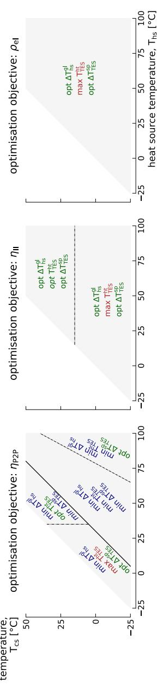

**Fig. 3.13** Summary of the design guidelines in the different regions of the domain depending on the objectives sought. Note that only the variables which have the most significant impact are reported here. 'max' is for maximise and 'min' for minimise. 'opt' is for optimal and the corresponding optimal value is given in Section [3.3.1.](#page-71-1)

| **71**

#### 3.3.3 Multi-criteria analyses

Four locations in the domain are selected for the multi-criteria analyses. These cover the main four regions described in Section 3.3.1, which are depicted in the first map of Fig. 3.13. The corresponding Pareto fronts are shown in Fig. 3.14. To ease their reading, these 3D fronts are 2-dimensionalised: the three fronts resulting from the conflict between each objectives pair are represented for each location. The discontinuities observed in the various fronts are, for most, due to design shifts, typically caused by changes in fluids. To quantify and map the Carnot battery trilemma, the non-dimensional Euclidean distance between the best and worst performance for each indicator of the 3D Pareto fronts is used. This is defined as:

$$d_{\rm Euclidean} = \sqrt{\left(\frac{\eta_{\rm P2P}^{\rm max} - \eta_{\rm P2P}^{\rm min}}{\eta_{\rm P2P}^{\rm max}}\right)^2 + \left(\frac{\eta_{\rm II}^{\rm max} - \eta_{\rm II}^{\rm min}}{\eta_{\rm II}^{\rm max}}\right)^2 + \left(\frac{\rho_{\rm el}^{\rm max} - \rho_{\rm el}^{\rm min}}{\rho_{\rm el}^{\rm max}}\right)^2} \ . \ (3.4)$$

In the region where  $d_{\rm Euclidean} < 25\%$ , the point  $[T_{\rm hs} = 10^{\circ} {\rm C}, T_{\rm cs} = 10^{\circ} {\rm C}]$  is almost not subject to the trilemma. Generally speaking, in that part of the domain, the best performing cycles are very similar to each other and finding an acceptable trade-off is quite straightforward. The point  $[T_{hs}=40^{\circ}C, T_{cs}=30^{\circ}C]$  is located in the region where  $T_{TES}^{ht}$  is not maximised when optimising  $\eta_{P2P}$  and  $\eta_{II}$ , and where  $\Delta T_{hs}^{gl}$  and  $\Delta T_{TES}^{sp}$  are minimised (the difference due to their slightly different  $T_{TES}^{ht}$  is not be perceptible in Fig. 3.14). Consequently,  $\eta_{P2P}$  and  $\eta_{II}$  do almost not conflict, but there is a slight one with  $\rho_{\rm el}$ . This conflict is, however, of moderate intensity since maximising  $\rho_{\rm el}$  at the expense of  $\eta_{\rm P2P}$  and  $\eta_{\rm II}$  only causes them to drop by  $-15.8\%_{\rm rel}$  and  $-15.5\%_{\rm rel}$ , respectively. Hence, as maximising  $\rho_{\rm el}$  is not 'too damaging' to  $\eta_{P2P}$  and  $\eta_{II}$ , the *trilemma* is 'weak' at this point. This illustrates once again that different designs can give very similar performance and that conducting near-optimal analyses would be relevant for the study of TI-PTES.

In contrast, Fig. 3.14 shows that the *trilemma* is much more intense for the point  $[T_{\rm hs}=60^{\circ}{\rm C},\,T_{\rm cs}=10^{\circ}{\rm C}].$  The front between  $\eta_{\rm P2P}$  and  $\eta_{\rm II}$  is linear, and it results mainly of a simultaneous trade-off between  $\Delta T_{hs'}^{gl}$   $T_{TES}^{ht}$  and  $\Delta T_{TES}^{sp}$ , which is in line with the observations drawn in Section 3.3.1. The steep front between  $\rho_{\rm el}$  and  $\eta_{\rm P2P}$  illustrates well the very binary nature of the problem: it is not really possible to obtain a satisfactory trade-off between the two criteria, as one tends to clearly degrade the other. Indeed, maximising of  $\eta_{P2P}$  requires minimising  $\Delta T_{hs'}^{gl}$   $T_{TES}^{ht}$  and  $\Delta T_{TES}^{sp}$  whereas opposite trends are observed for  $\rho_{el}$ . Such front shape between  $\rho_{\rm el}$  and  $\eta_{\rm P2P}$  is well know in the literature [37, 86]. However, we note that for the point  $[T_{\rm hs}=100^{\circ}{\rm C},\,T_{\rm cs}=10^{\circ}{\rm C}]$ , which lies in the area where  $\Delta T_{\rm TES}^{\rm sp}$  is slightly increased to maximise  $\eta_{P2P}$ , the minimum density is thereby increased, which has the effect of slightly reducing the *trilemma*.

When designing a Carnot battery in this part of the domain, one approach to arbitrating the trilemma and identifying optimal storage temperatures is to introduce

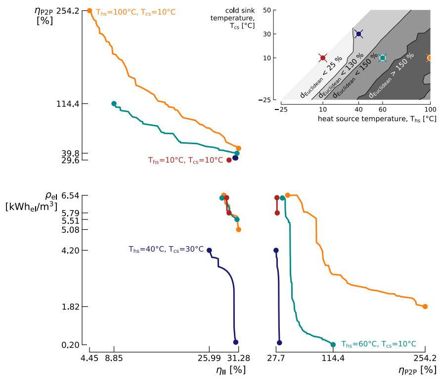

**Fig. 3.14** Pareto fronts of the *Carnot battery trilemma* for four locations in the domain. The map of the domain shows the non-dimensional Euclidean distance between the best and worst performance of the three criteria.

the economic dimension. For known cost functions of each of the Carnot battery's components, the aim of optimising the thermodynamic design will be to optimise an economic criterion, such as the Levelised Cost Of Storage (which is actually a function of *η*P2P, *η*II and *ρ*el). It should be stressed, however, that identifying such cost functions is not trivial, as they are non-constant and generally non-linear (e.g., the higher the storage temperature, the more expensive it will be). Environmental indicators could also be used instead of economic.

Finally, in the region where dEuclidean > 150%, *ρ*el and *η*II are much less conflicting with each other than with *η*P2P. This is largely due to the fact that they both maximise the storage temperature and that they need a large storage spread. They also both require large heat source glides, in one case to ensure an effective waste heat recovery (i.e., maximisation of *η*II) and in a second case to allow large spreads (i.e., maximisation of *ρ*el and *η*II). All in all, this result proves that the trilemma is essentially caused by the maximisation of *η*P2P–which moreover leads to a TI-PTES degenerated into a TES + ORC, which no longer makes it a genuine electricity storage system but rather a pure waste heat recovery system (see Section [3.3.1\)](#page-75-0).

# 3.4 Summary and discussions

This chapter looked at the *Carnot battery trilemma* for subcritical cycles over an extended thermal integration domain. Multi-criteria optimisation was used to map the maximum theoretical performance that could be provided by TI-PTES in terms of power-to-power efficiency  $\eta_{\rm P2P}$  (i.e., quality of electricity recovery), exergy efficiency  $\eta_{\rm II}$  (i.e., quality of combined heat and electricity recovery) and electrical energy density  $\rho_{\rm el}$  (i.e., storage size). Eight optimisation variables were used, including both the parameters of the thermodynamic cycles and the choice of working fluids. The multi-criteria analysis also made it possible to characterise the nature of the conflict between these objectives, in particular by analysing the shape of the Pareto fronts obtained. The main conclusions of this chapter and prospects for future work are discussed below.

#### 3.4.1 Main results

Results have shown that  $\eta_{P2P}$  grows with the difference between the source and sink temperatures,  $\Delta T_{hs-cs}.$  This growth is however not continuous because of a design shift. For  $\Delta T_{hs-cs} < 30$  K, the storage temperature  $T_{TES}^{ht}$  is maximised, whereas it is minimised for  $\Delta T_{hs-cs} \geq 30$  K. For its part,  $\eta_{II}$  decreases as the sink temperature  $T_{cs}$  increases, because the ORC efficiency  $\eta_{ORC}$  falls. However, for  $T_{cs} > 15^{\circ} C$ ,  $\eta_{ORC}$  (and therefore  $\eta_{II}$ ) stabilises thanks to a design shift ( $T_{TES}^{ht}$  and the storage spread  $\Delta T_{TES}^{sp}$  are reduced). Finally,  $\rho_{el}$  decreases as  $T_{cs}$  increases, both because the thermal density and  $\eta_{ORC}$  decrease.

Design guidelines for maximising each of the *trilemma* objectives have been formulated. However, these are not uniform across the thermal domain and are adapted in the different sub-regions. Some of these sub-regions are linked to the intrinsic thermodynamics of TI-PTES (e.g., choice of the optimal  $T_{\rm TES}^{\rm ht}$  as a function of heat transfer irreversibilities) while others are linked to the technological constraints imposed (e.g., choice of the optimal  $T_{\rm TES}^{\rm ht}$  as a function of the maximum  $T_{\rm TES,max}^{\rm ht}$  permitted). This result highlights the importance of considering these constraints when formulating design guidelines, since optimal cycles obtained can deviate from theory.

Analyses have also revealed the strong synergy between  $T_{TES}^{ht}$  and  $\Delta T_{TES}^{sp}$ , which are two main design variables in TI-PTES with sensible heat storage. When  $T_{TES}^{ht}$  is high, which is in favour of  $\eta_{ORC}$  but penalises  $COP_{HP}$ ,  $\Delta T_{TES}^{sp}$  is also large so as to maintain a sufficiently high  $COP_{HP}$ , which in fact also reduces  $\eta_{ORC}$ . The conflict between  $COP_{HP}$  and  $\eta_{ORC}$  is therefore resolved by simultaneously adjusting  $T_{TES}^{ht}$  and  $\Delta T_{TES}^{sp}$ . Maximising  $COP_{HP}$  using larger spreads is achieved by lowering the condensation pressure in the HP and by maximising the subcool-

ing. Conversely, when  $T_{TES}^{ht}$  is minimised (i.e., the heat pump lift is minimised),  $\Delta T_{TES}^{sp}$  is also generally minimised, so as to approach ideal Carnot cycles.

With respect to the *Carnot battery trilemma*, its intensity increases as  $\Delta T_{hs-cs}$  increases. This suggests that the *trilemma* is driven by  $\eta_{P2P}$ , while the conflict between  $\eta_{II}$  and  $\rho_{el}$  is much weaker. The hinge variable is  $T_{TES}^{ht}$ , which is minimised for  $\eta_{P2P}$  when  $\Delta T_{hs-cs} \geq 30$  K, and is maximised in the other cases. Below this tipping point (i.e.,  $\Delta T_{hs-cs} < 30$  K), the intensity of the *trilemma* is therefore lower.

Overall, the concept of thermal integration for Carnot batteries should probably be reconsidered. While it was introduced to artificially increase  $\eta_{\rm P2P}$ , this work showed that, for  $\Delta T_{\rm hs-cs} \geq 30$  K, maximising  $\eta_{\rm P2P}$  leads to very low  $\eta_{\rm II}$  and  $\rho_{\rm el}.$  Moreover, the TI-PTES degenerates into a TES + ORC (i.e., zero–or marginal-contribution from the heat pump), which makes it an option for pilotable electricity production but no longer a true power-to-power storage system. However, the majority of studies to date have focused on  $\Delta T_{\rm hs-cs} > 45$  K, because  $\eta_{\rm P2P}$  is much better there. These results therefore challenge the relevance of using  $\eta_{\rm P2P}$  as a key indicator for TI-PTES. In addition to the fact that maximising it leads to nonsense designs, it is biased by the assumption of a zero opportunity cost for the heat source–limiting its validity range. An indicator such as the ratio between the work output and the thermal exergy input could for instance be used more systematically to provide a more comprehensive characterisation of TI-PTES.

In cases where the heat source glide is constrained (e.g., frequently at  $10~\rm K$  in cooling applications), the exergy losses from the source to the environment disappear, which relatively increases  $\eta_{\rm II}$ . Still, maximising  $\eta_{\rm P2P}$  always leads to minimising  $T_{\rm TES}^{\rm ht}$ , which penalises  $\rho_{\rm el}$  and leads to a degenerated TI-PTES.

# 3.4.2 Perspectives

In view of the large spreads involved, and the fact that the critical points of the selected fluids are generally well below  $T_{\rm TES}^{\rm ht}$ , the study of transcritical cycles in TI-PTES applications seems of interest. This is addressed in Chapter 4. A second avenue worth investigating is zeotropic mixtures. Future work could characterise and optimise these systems to see if they can alleviate the *Carnot battery trilemma* and increase the performance. The key question that these comparative cycle studies should address is whether the gain provided by mixtures is sufficient to outweigh the additional complexity. Systematic consideration of the use of a recuperator in the HP and in the ORC also seems essential. However, as discussed, this will not systematically result in better performance and must therefore be assessed on a case-by-case basis.

Finally, the application of near-optimal analyses to the study of TI-PTES could potentially make new designs emerge. In particular, tolerating (very) slight performance degradation could make it possible to find configurations that are, for

# **3** | Performance mapping across an extended domain

instance, less prone to the *trilemma*, or cheaper to implement (e.g., lower storage temperature). This would also make it possible to identify designs that are less sensitive to slight deviations of parameters from nominal conditions, which is very useful in operational analyses (e.g., degree of superheating, of subcooling, pinches, etc.). Eventually, this would enable to characterise which parameters should not deviate from nominal conditions (i.e., the so-called 'must-haves'), which would enable effective control strategies.

# **3.5 Key messages**

- To maximise each indicator of the *Carnot battery trilemma* (i.e., power-topower efficiency, exergy efficiency, and electrical energy density), a specific trade-off must be identified between the coefficient of performance of the heat pump, the efficiency of the organic Rankine cycle, and the storage thermal density. This trade-off is primarily driven by the storage temperature and the storage temperature spread.
- While the maximum power-to-power efficiency for the basic hot TI-PTES increases from about 30% for source and sink temperatures of 10◦C to more than 250% for source temperature of 100◦C, the maximum exergy efficiency and maximum electrical energy density remain confined to about 30% and 6.5 kWhel/m3 , respectively.
- To arbitrate the *Carnot battery trilemma*, additional considerations, such as economic or environmental, are necessary. Constraints linked to the application must also be taken into account (e.g. the ratio between the amount of heat available at source and the amount of electricity required). The *trilemma* could also be softened by considering other cycles, such as transcritical or based on zeotropic mixtures.
- Thermal integration, motivated by the need to increase the power-to-power efficiency of Carnot batteries, should be considered with caution. For heat source and heat sink temperature differences greater than 30 K, maximising this efficiency degenerates the TI-PTES into a TES + ORC (zero contribution from the HP). For these temperature ranges, the power-to-power efficiency indicator should be set aside.
- The optimisation results, both because of design constraints and possible lack of convergence, showed that different designs gave similar performance. This encourages the use of near-optimal methods to provide designers with alternatives to better satisfy their preferences.

**4**

# **Near-optimal design to generate alternatives**

O PTIMISING the thermodynamic design of a Carnot battery enables characterising its theoretical maximum performances. However, this approach results in a unique design for each performance criterion, and leads to inflexible design guidelines. These unique designs may, in practice, be unsuitable for several reasons: incompatibility with existing regulations (e.g., on maximum pressures or fluid charge limits), overly complex or non-standard architectures that are too expensive or difficult to operate, etc. As discussed in Chapter [3,](#page-63-0) though, alternative designs can achieve similar performance, that are only marginally lower. This highlights the value of exploring alternatives, based on a tolerable performance slack, through techniques such as near-optimal design (also known as Modelling to Generate Alternatives, MGA). This approach brings the designer experience into the optimisation process to help identify the trade-offs required to obtain highperforming configurations which better align with his design preferences. This chapter therefore addresses the following question:

> *What are the design alternatives and trade-offs to reduce investment costs and align with different technological preferences?*

To this end, Section [4.1](#page-94-0) first provides context on the need for alternative designs, and explains how MGA can complement traditional design methods based on levelised cost of storage minimisation. Section [4.2](#page-96-0) then introduces the method specifically developed in this work to generate alternative Carnot battery configurations.

# **4** | Near-optimal design to generate alternatives

In Section [4.3,](#page-103-0) the method is applied to (i) challenge existing design guidelines by evaluating the flexibility and design margins available (i.e., must-have vs real choices), and (ii) explore the trade-offs required on certain design parameters in order to better align with the designer technological preferences. Section [4.4](#page-115-0) then discusses the main findings and offers perspectives for future research in this field, while Section [4.5](#page-117-0) summarises five key takeaways. This work has been submitted to the *Journal of Energy Storage* [JP5].

# **4.1 Motivation**

For Carnot batteries to achieve financial competitiveness, designers must leverage two key factors: increasing efficiency and reducing investment costs. Improving efficiency involves limiting exergy destruction by employing high-performance machinery (addressing internal irreversibilities), as well as reducing mean temperature differences during heat exchanges (tackling external irreversibilities) [\[31,](#page-251-8) [72\]](#page-255-0). This implies efficient, customised components and complex cycles. On the other hand, cost reduction relies on using standard, off-the-shelf components, and adopting simple, standardised designs. These objectives are therefore conflicting, requiring designers to find the right balance [\[53\]](#page-253-6). A common strategy for resolving this trade-off is to minimise the LCOS of the system. Literature for instance shows that efficiency and LCOS are conflicting objectives, confirming that a trade-off must be found between efficiency and investment costs [\[104,](#page-258-0) [105\]](#page-258-3).

The main limitation with this LCOS minimisation approach is its high susceptibility to techno-economic uncertainties: any small deviation in an uncertain parameter can make the system financially non-competitive [\[156\]](#page-262-8). For example, if the cost of certain components were to rise and the efficiency was lower than expected, the system would lose profitability. To address this, robust design optimisation could be employed [\[157\]](#page-262-9). This consists in including the stochastic dimension during the design phase, so that the optimisation objectives are to minimise the mean and the variance of the LCOS. However, this approach suffers from two limitations: (i) mean and variance are generally conflicting, leaving designers with a choice to arbitrate between various designs [\[158\]](#page-263-0), and (ii) the exact and universal characterisation of uncertainties is challenging, if not impossible, due to limited data and dynamic conditions [\[159\]](#page-263-1).

Another way to frame the inherent uncertainties in the LCOS minimisation approach is that it overlooks several real-world factors that cannot be captured by mathematical models [\[160\]](#page-263-2). These factors include practical considerations such as manufacturers expertise in assembling and operating systems (e.g., manufacturing challenges, maintenance complexity, regional climatic variations), strategic decisions and business models (e.g., regional regulations, expected returns on investment), market perception (e.g., user needs, system standardisation for specific applications), and supply chain dynamics (e.g., component availability, discounts, delivery timelines). Providing designers with a single, supposedly optimal, solution is therefore inadequate. They are more interested in a range of alternatives with equivalent performance, allowing them to choose the option that best aligns with their experience and preferences, and enabling them to understand the compromises that need to be made to satisfy specific preferences [\[160](#page-263-2)[–162\]](#page-263-3). This approach also provides a deeper understanding of the true physical nature of the design problem, rather than reducing it to a single techno-economic indicator.

The aim of this chapter is therefore to generate alternative thermodynamic designs for Carnot batteries (see Fig. [4.1\)](#page-95-0). These alternatives will help designers (i) better grasp the thermodynamics of Carnot batteries (i.e., flexibility in design variables) and (ii) identify the necessary trade-offs to select the one that best matches their specific preferences. The main performance indicators are the powerto-power efficiency (affecting operational profitability) and the energy density (affecting storage-related capital costs). While the financial optimum results from a trade-off between these two, it remains contingent on the chosen cost correlations– making it uncertain and case-specific. Jiang et al. [\[164\]](#page-263-4) for instance suggested that this trade-off lies approximately halfway between maximum efficiency and maximum density, whereas Hu et al. [\[104\]](#page-258-0) reported that minimum LCOS is achieved at maximum density. Hence, both efficiency and density are retained to allow designers the flexibility to navigate this trade-off according to their own preferences.

Drawing on work carried out in the construction of energy transition scenarios [\[19,](#page-250-5) [161,](#page-263-5) [162,](#page-263-3) [165–](#page-263-6)[167\]](#page-263-7), near-optimal exploration methods are suitable for our problem. The idea of such methods is to identify alternative designs that are 'near' the previously identified global optimum (or Pareto front in case of multi-criteria

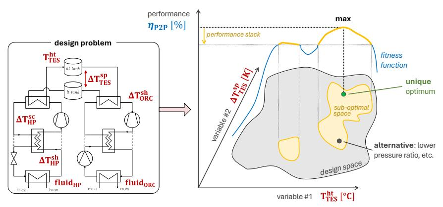

**Fig. 4.1** Application of the near-optimal method for the thermodynamic design of Carnot batteries. For clarity, only two design variables and one performance criterion are represented (several can however be considered). Illustration inspired from Dubois and Ernst [\[163\]](#page-263-8).

# **4** | Near-optimal design to generate alternatives

optimisation). The objective is generally to maximise the diversity of solutions, and then to identify the parameters these solutions have in common (i.e., musthaves) and the degrees of freedom (i.e., real choices) [\[161\]](#page-263-5). Designers can then make a choice based on their own preferences. Unlike constraints, which are rigid, preferences can be compromised if the trade-off yields compensatory benefits. Beyond clarifying the nature of the problem (i.e., distinguishing must-haves from real choices), the near-optimal method explicitly highlights the trade-offs required to align with specific preferences.

While near-optimal analyses are typically performed for single objective and linear programming models, the thermodynamic design of Carnot batteries is highly non-linear and discontinuous (i.e., non-physical solutions). Meta-heuristic algorithms, such as evolutionary [\[85,](#page-256-3) [104,](#page-258-0) [105,](#page-258-3) [114,](#page-258-10) [118\]](#page-259-3) or swarm intelligence [\[106\]](#page-258-4), are therefore usually employed for design optimisation. This is also a multi-criteria problem, since the aim is to maximise both efficiency and density. Unfortunately, the literature on near-optimal methods for meta-heuristic and multi-criteria problems is rather scarce. Two attempts have been identified, both based on evolutionary algorithms. The MOTRAN (Multi-objective Trade-off Analyzer) method [\[168\]](#page-263-9) is based on the Non-dominated Sorting Genetic Algorithm NSGA-III [\[169\]](#page-263-10), while the MDO-MOPSO (Multiple Design Options Multiple-Objective Particle Swarm Optimisation) method [\[165\]](#page-263-6) is based on particle swarm optimisation. Hence, in this work, we introduce a new method for generating near-optimal alternative Carnot battery designs, considering a comprehensive set of configurations, fluids, temperature and pressure settings.

# **4.2 Model and methods**

# 4.2.1 Carnot batteries model

The Carnot batteries considered in this chapter are based on vapour compression heat pumps (HP), sensible heat thermal energy storage (TES) in two water tanks, and organic Rankine cycles (ORC). For the HP and the ORC, configurations with and without internal exchangers ('recuperators') are considered (see Fig. [2.5\)](#page-53-1). As discussed in literature [\[78,](#page-255-6) [80\]](#page-255-8) and in Chapter [3,](#page-63-0) although they increase the efficiency of the Carnot battery, these recuperators require additional investment costs. Moreover, when the storage temperature spread is large (i.e., large temperature difference between the two tanks, necessary for greater thermal densities), recuperators generate more heat transfer irreversibilities in the ORC evaporator, reducing efficiency [\[90\]](#page-256-7). Cycles without recuperator therefore remain a relevant option. For clear distinction, they will be referred to as 'basic' or 'recuperated' HP and ORC.

For the HP and the ORC, subcritical and transcritical operating regimes are also compared, based on the relevance indicated in literature [\[91\]](#page-256-8) and as discussed in Chapter [3.](#page-63-0) Conceptually, transcritical cycles can offer a better match between the temperature profiles of the working fluid and the sensible heat storage, reducing heat transfer irreversibilities. Although they were popular at the genesis of Carnot batteries in the early 2010s [\[31–](#page-251-8)[33\]](#page-251-10), particularly with CO2 as working fluid, transcritical cycles have been less studied than subcritical cycles for this application, perhaps due to the inherent technological difficulties (higher pressures, which necessitate stronger components and reduce compatibility with standard equipment, as well as complex control requirements due to the strong sensitivity of efficiency to pressure variations in the gas cooler/heater, etc.) [\[80\]](#page-255-8).

Considering all architectures and regimes, a total of 16 Carnot battery configurations are investigated (see Table [4.1](#page-97-0) for corresponding acronyms). While zeotropic mixtures are promising for reducing heat transfer irreversibilities [\[83,](#page-256-1) [85,](#page-256-3) [87\]](#page-256-10), this work limits to pure working fluids, focusing on the relevance of nearoptimal analyses in this field.

The performances of the different configurations are assessed using the thermodynamic model introduced in Section [2.2.](#page-52-0) The assigned parameters and design constraints are reported in Table [4.2.](#page-98-0) Some are fixed (e.g., pinch-point in heat exchangers) while some others are employed as optimisation variables (e.g., storage temperature). These parameters are in line with other works on the thermodynamics of Rankine Carnot batteries [\[77,](#page-255-5) [78,](#page-255-6) [80,](#page-255-8) [91\]](#page-256-8).

The heat source of the HP and the cold sink of the ORC is assumed to be dry ambient air at 15◦C. The temperature glide for ambient air (difference between supply and exit temperatures) is set to 5 K. This value represents a common tradeoff between limiting exergy destruction in the heat exchangers (as illustrated by the results in Chapter [3\)](#page-63-0) and reducing the heat exchangers cost by limiting the required heat transfer area. The liquid subcooling in the ORC is set to 3 K to prevent pump cavitation. The isentropic efficiencies of the HP compressor and ORC ex-

|                            |          |                   | Heat Pump (HP) |             |           |               |  |
|----------------------------|----------|-------------------|----------------|-------------|-----------|---------------|--|
|                            |          |                   |                | Subcritical |           | Transcritical |  |
|                            |          |                   | (S)            |             | (T)       |               |  |
|                            |          |                   | Basic          | Recuperated | Basic     | Recuperated   |  |
|                            |          | (B) (R) (B) |                | (R)         |           |               |  |
|                            |          | Basic             | #1: SBHP       | #3: SRHP    | #6: TBHP  | #11: TRHP     |  |
| Organic                    | Subcrit. | (B)               | + SBORC        | + SBORC     | + SBORC   | + SBORC       |  |
| Rankine                    | (S)      | Recup.            | #2: SBHP       | #4: SRHP    | #8: TBHP  | #13: TRHP     |  |
| Cycle                      |          | (R)               | + SRORC        | + SRORC     | + SRORC   | + SRORC       |  |
| (ORC) Transcrit. (T) |          | Basic             | #5: SBHP       | #7: SRHP    | #9: TBHP  | #15: TRHP     |  |
|                            |          | (B)               | + TBORC        | + TBORC     | + TBORC   | + TBORC       |  |
|                            |          | Recup.            | #10: SBHP      | #12: SRHP   | #14: TBHP | #16: TRHP     |  |
|                            |          | (R)               | + TRORC        | + TRORC     | + TRORC   | + TRORC       |  |

**Table 4.1** Description of the 16 Carnot battery configurations investigated in this work and the corresponding acronyms.

#### 4 | Near-optimal design to generate alternatives

 Table 4.2
 Set of model parameters and constraints for Carnot batteries optimisation.

| Parameter                      | Symbol                                                                                                                                                    | Value                                 | Units                |
|--------------------------------|-----------------------------------------------------------------------------------------------------------------------------------------------------------|---------------------------------------|----------------------|
| Heat source temperature        | $T_{\rm hs}$                                                                                                                                              | 15                                    | °C                   |
| Heat source temperature glide  | $\Delta { m T}_{ m hs}^{ m gl}$                                                                                                                           | 5                                     | K                    |
| Cold sink temperature          | $T_{cs}$                                                                                                                                                  | 15                                    | $^{\circ}\mathrm{C}$ |
| Cold sink temperature glide    | $\Delta { m T}_{ m cs}^{ m gl}$                                                                                                                           | 5                                     | K                    |
| Hot tank storage temperature   | ${ m T_{TES}^{ht}}$                                                                                                                                       | design var.                           | $^{\circ}\mathrm{C}$ |
| Storage temperature spread     | $\Delta T_{\mathrm{TES}}^{\mathrm{sp}}$                                                                                                                   | design var.                           | K                    |
| Max. storage temperature       | ${ m T^{ht}_{TES,max}}$                                                                                                                                   | 120                                   | $^{\circ}\mathrm{C}$ |
| Cold tank storage temperature  | ${ m T_{TES}^{lt}}$                                                                                                                                       | $ m T_{hs}$ – $ m \Delta T_{hs}^{gl}$ | $^{\circ}\mathrm{C}$ |
| Storage pressure               | PTES                                                                                                                                                      | 2.5                                   | $_{\mathrm{bar}}$    |
| HP working fluid               | $\mathrm{fluid}_{\mathrm{HP}}$                                                                                                                            | design var.                           | n/a                  |
| ORC working fluid              | $fluid_{ORC}$                                                                                                                                             | design var.                           | n/a                  |
| HP vapour superheating         | $\Delta { m T_{HP}^{sh}}$                                                                                                                                 | design var.                           | K                    |
| HP liquid subcooling           | $\Delta { m T}^{ m sc}_{ m HP}$                                                                                                                           | design var.                           | K                    |
| ORC vapour superheating        | $\Delta T_{\mathrm{ORC}}^{\mathrm{sh}}$                                                                                                                   | design var.                           | K                    |
| ORC liquid subcooling          | $\Delta { m T}_{ m ORC}^{ m sc}$                                                                                                                          | 3                                     | K                    |
| Compressor isentropic eff.     | $\eta_{ m is,comp}$                                                                                                                                       | 0.75                                  | _                    |
| Expander isentropic efficiency | $\eta_{ m is,exp}$                                                                                                                                        | 0.75                                  | _                    |
| Feed pump isentropic eff.      | $\eta_{ m is,pmp}$                                                                                                                                        | 0.60                                  | _                    |
| Recuperator effectiveness      | $arepsilon^{ m rec}_{ m HP/ORC}$                                                                                                                          | 0.80                                  | _                    |
| Pressure losses in heat exch.  | $\Delta \mathrm{p_{HP/ORC}}$                                                                                                                              | 0                                     | bar                  |
| Pinch temp. diff. in HP cond.  | $\Delta \mathrm{T}^{\mathrm{cd,pp}}_{\mathrm{HP}} \ \Delta \mathrm{T}^{\mathrm{ev,pp}}_{\mathrm{HP}} \ \Delta \mathrm{T}^{\mathrm{ev,pp}}_{\mathrm{ORC}}$ | 3                                     | K                    |
| Pinch temp. diff. in HP evap.  | $\Delta { m T}_{ m HP}^{ m ev,pp}$                                                                                                                        | 5                                     | K                    |
| Pinch temp. diff. in ORC evap. | $\Delta { m T}_{ m ORC}^{ m eV,pp}$                                                                                                                       | 3                                     | K                    |
| Pinch temp. diff. in ORC cond. | $\Delta T_{ORC}^{cd,pp}$ $T_{UD}^{comp,ex}$                                                                                                               | 5                                     | K                    |
| Max. compress. disch. temp.    | $T_{\mathrm{HP,max}}^{\mathrm{comp,ex}}$                                                                                                                  | 200                                   | $^{\circ}\mathrm{C}$ |
| Min. HP superheating           | $\Delta { m T}^{ m sh}_{ m HP,min}$                                                                                                                       | 2                                     | K                    |
| Min. HP subcooling             | $\Delta { m T}^{ m sc}_{ m HP,min}$                                                                                                                       | 3                                     | K                    |
| Min. ORC superheating          | $\Delta { m T}_{ m ORC,min}^{ m sh}$                                                                                                                      | 2                                     | K                    |
| Min. HP pressure               | p HP min                                                                                                                            | 0.5                                   | bar                  |
| Min. ORC pressure              | $p_{ m ORC}^{ m min}$                                                                                                                                     | 0.5                                   | bar                  |

pander are set to 0.75, so as to represent volumetric machines (scroll or screw). The pump isentropic efficiency is set to 0.60 so as to represent centrifugal machines-slightly higher than in Chapter 3, in accordance with recommendations found in the literature [170, 171]. The pinch point temperature difference for low pressure heat exchangers is assumed to be 5 K. Instead, the pinch point for high pressure heat exchangers is assumed to be 3 K (secondary fluid is water instead of air). The last parameter is the recuperator effectiveness, which is set to 0.80. Also note that pressure losses in heat exchangers and piping are neglected. Heat losses are also neglected for both cycles.

The optimisation variables are the same as in Chapter 3 (refer to Fig. 3.3), except the heat source glide, which is fixed here. Yet, the maximum storage temperature is

here further constrained to 120◦C so as to bound the heat pump lift to more plausible values (< 105 K) and limit the tanks pressurisation needs to 2.5 bar (limited capital cost). Further details on the impact of the maximum storage temperature are provided in Appendix [B.3.](#page-231-0) Note that for transcritical HP, liquid subcooling is inexistent and is removed from the set of variables. Same for vapour superheating in transcritical ORC.

The working fluids can be selected among an extended version of the list introduced in Table [3.2.](#page-70-0) This extended list also contains some fluids with non-zero ODP and/or very high GWP (i.e., *R13*, *R125*, *R143a*, *R115*, *R22*, *R134a*, *R227ea* and *R12*, refer to Table [B.1\)](#page-232-0). Although banned (or being phased out) by the Montreal Protocol, the Kigali Amendment and/or the F-gas regulation (EU), these are considered for illustrative purposes. In fact, the list of fluids compatible with these regulations and available in CoolProp suffers from a severe gap in the range of critical temperatures between 44.1◦C and 91.1◦C. Yet, it is specifically this range that is needed to enable transcritical cycles in the Carnot battery application under consideration.

As a conservative choice, two-phase compressions and expansions are not permitted (including two-phase conditions in limited stages of the compression and expansion processes). Although preliminary results have shown interesting performance, this choice guarantees the components lifetime (limitation of mechanical stress due to potential pressure peaks) and preserves the plausibility of the model (the isentropic efficiency tends to fall for two-phase mixtures) [\[172\]](#page-264-2).

# 4.2.2 Near-optimal design with evolutionary algorithms

The objective during the thermodynamic design of the Carnot battery configurations is to maximise the power-to-power efficiency *η*P2P and the electrical energy density *ρ*el [\[77,](#page-255-5) [78,](#page-255-6) [80\]](#page-255-8). The former is linked to the operational profitability of the system, while the latter affects the capital cost associated to storage (i.e., the lower the density, the larger the tanks, hence the more expensive). In the first stage, we will optimise each of the 16 Carnot battery configurations (see Table [4.1\)](#page-97-0) for these two criteria using multi-objective optimisation (MOO). The 16 resulting Pareto fronts will then be assembled to form one 'global' Pareto front. In the second stage, we will generate the sub-optimal space to explore diverse design alternatives with a reasonable performance trade-off, addressing uncertainties related to the key drivers and the designers preferences.

#### Multi-criteria optimisation of the Carnot battery designs

As *η*P2P and *ρ*el are conflicting objectives, a single optimum design cannot be achieved [\[80\]](#page-255-8). Instead, the optimal designs will be distributed along Pareto fronts. In view of our problem, a meta-heuristic and multi-criteria algorithm is necessary to generate these Pareto fronts by optimising the seven design variables introduced in Section [4.2.1.](#page-96-1) As it has performed well in similar problems [\[104,](#page-258-0) [173\]](#page-264-3), the

#### 4 | Near-optimal design to generate alternatives

Non-dominated Sorting Genetic Algorithm NSGA-II [144] is here adopted through RHEIA, a Python package [145]. This methodology was further illustrated in Fig. 3.3, and corresponds to *Step #1* in Fig. 4.2. Further details on the convergence can be found in Appendix C.1. Once the Pareto fronts corresponding to each of the 16 configurations are generated, all the non-dominated solutions among these are then assembled to form the global Pareto front (*Step #2* in Fig. 4.2).

#### Generating alternative Carnot battery designs

After the optimised solutions are retrieved, the second stage is to find the near-optimal alternatives. To do so, we must define what is near-optimal, and thus the slack we allow on the performance indicators (i.e., the tolerated performance degradation, also referred to as the 'sub-optimality coefficient'). For instance, in Section 4.3.2, we will allow for a 7.5% slack on  $\eta_{P2P}$  and  $\rho_{el}$ , resulting in a sub-optimal space (Step #3 in Fig. 4.2). It is within this sub-optimal space that near-optimal alternatives will be sought.

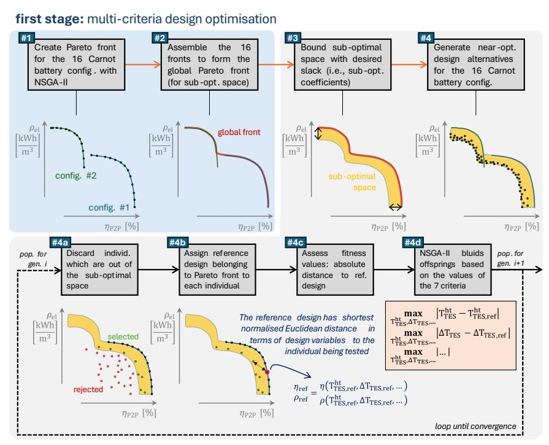

second stage: generating near-optimal alternatives

**Fig. 4.2** Schematic representation of the generation of the sets of alternatives. Step #1 is further detailed in Fig. 3.3. Only 2 fronts are represented for sake of clarity, but 16 are effectively considered. During the creation of the near-optimal designs (Step #4), 1500 generations are typically performed and the mutation probability is 50% to capture the global optima.

Once the sub-optimal space is defined (*Step #3* in Fig. [4.2\)](#page-100-0), the proper search for alternative designs can begin (*Step #4* in Fig. [4.2\)](#page-100-0). To achieve this, the optimisation problem is reconfigured. The initial populations for each Carnot battery configuration are derived from the Pareto fronts obtained at the end of the first stage, eliminating the need for Latin Hypercube Sampling. The optimisation criteria are no longer *η*P2P and *ρ*el. Instead, the objective is to maximise the Euclidean distance between the solutions and reference designs belonging to the global Pareto front obtained at *Step #2*. This approach aims to maximise solutions diversity and enhance the exploration of the sub-optimal space. The process unfolds as follows:

- 1. The initial populations (i.e., *gen. 0*) for generating the alternatives correspond to the optimised Pareto fronts for the 16 Carnot battery configurations.
- 2. The offspring populations (i.e., *gen. 1*) are generated through mutations and crossovers using NSGA-II. Individuals that fall outside the sub-optimal space are discarded (*Step #4a* in Fig. [4.2\)](#page-100-0). This is achieved assigning them random negative fitness values between 0 and 1.
- 3. Each individual within the sub-optimal space is assigned a 'reference' individual from the Pareto front of the same Carnot battery configuration (*Step #4b* in Fig. [4.2\)](#page-100-0). The reference individual is selected based on design similarity rather than proximity in *η*P2P and *ρ*el. Specifically, similarity is determined by comparing the storage temperature levels, superheating and subcooling degrees, and working fluids. This is quantified using the normalised Euclidean distance in the 7-dimensional design space. Normalisation ensures consistency across variables with different units. The reference individual is the one with the shortest normalised Euclidean distance to the considered individual.
- 4. Compared to the first stage in *Multi-criteria optimisation of the Carnot battery designs*, new optimisation criteria are introduced. To enhance the exploration of the sub-optimal space, the objective is to maximise the deviation from the reference designs in the Pareto front (i.e., the Euclidean distance). The optimisation criteria are thus the absolute differences between the 7 design variables of the individual under consideration and of its corresponding reference design (*Step #4c* in Fig. [4.2\)](#page-100-0). The initial population (*gen. 0*) is a special case, as it consists of the reference points themselves, resulting in zero difference between individuals and their references.
- 5. Using the fitness values of the 7 criteria for the N individuals of *gen. 0* and *gen. 1* (a total of 2N individuals), NSGA-II retains N individuals based on dominance. After applying the necessary mutations and crossovers, NSGA-II generates a new offspring population (*Step #4d* in Fig. [4.2\)](#page-100-0), and the process loops back to *Step #4a*. This iterative cycle continues until convergence is achieved (further insights in Appendix [C.2\)](#page-236-2).

Once the generation of alternatives is complete, these are assembled along with the reference designs to form a comprehensive set of near-optimal alternatives.

#### Near-optimal design to generate alternatives

#### Key performance indicators and technological parameters

Near-optimal analyses provide designs with similar performance indicators  $(\eta_{\rm P2P})$  and  $\rho_{\rm el}$  in this case), but with different design parameters and varying technological indicators, opening a close-to-reality design with trade-offs. Four types of indicators are used in this study: distance to the critical point, slope of the saturated vapour curve, volume ratio, and the volumetric capacity.

In subcritical cycles, when the upper saturation pressure is close to the critical point, the cycle is in 'near-critical' regime. This type of regime poses a series of challenges, particularly in terms of control (high sensitivity to pressure and temperature) [174,175]. This regime also requires particular attention for the design of heat exchangers (sudden variation in fluid properties, including heat capacity). The proximity to the critical point can be defined as the difference between the critical temperature Tcrit and the saturation temperature Tsat,ht, as

$$\Delta T_{HP}^{crit} = T_{HP}^{crit} - T_{HP}^{sat,ht} , \qquad (4.1)$$
  
$$\Delta T_{ORC}^{crit} = T_{ORC}^{crit} - T_{ORC}^{sat,ht} . \qquad (4.2)$$

$$\Delta T_{\rm ORC}^{\rm crit} = T_{\rm ORC}^{\rm crit} - T_{\rm ORC}^{\rm sat,ht} \quad . \tag{4.2}$$

For drawing up guidelines on the working fluids, it is convenient to classify them into different categories. A common parameter is the inverse of the slope of the saturated vapour curve  $\xi_{\rm M}^*$  on the  $T_r$  –  $s^*$  diagram [176], with  $T_r = T/T^{\rm crit}$  the reduced temperature and  $s^* = s/R$  the dimensionless entropy. This is defined as

$$\xi_{\rm M}^* = \left. \frac{\mathrm{d}s^{*v}}{\mathrm{d}T_{\rm r}} \right|_{T_{\rm r,M}} \tag{4.3}$$

with s\*V the reduced saturated vapour entropy and M the inflexion point where

$$\frac{d^2 s^{*v}}{dT_r^2}\Big|_{T_{r,M}} = 0$$
 (4.4)

When negative, the fluid is 'wet' (an isentropic expansion from saturated vapour leads to a two-phase state). When positive, the fluid is 'dry' (an isentropic expansion from saturated vapour leads to superheated vapour). Finally, close to zero, the fluid is sometimes said 'isentropic'.

In addition to the above thermodynamic quantities, technological indicators can also guide designers in their choice. The volume ratio rv is particularly interesting for adapting the compression and expansion machines (scroll, screw) to the cycles. Using the nomenclature of Fig. 2.5, this ratio is defined as

$$r_{v,HP} = \frac{v_{1(r)}}{v_2}$$
 , (4.5)

$$r_{v,ORC} = \frac{v_4}{v_3}$$
 (4.6)

Their efficiency varies with this ratio, and nominal efficiency is reached when the cycle volume ratio matches their built-in volume ratio. Designers might therefore prefer a thermodynamic design according to its volume ratio.

Another useful indicator for HP based on volumetric machines is the volumetric heating capacity, VHCHP [\[177\]](#page-264-7). This characterises the ratio between the specific quantity of heat produced and the specific volume of fluid entering the compressor. The lower this capacity, the larger and/or faster the compressor will have to run. Using the nomenclature of Fig. [2.5,](#page-53-1) this is defined as

$$VHC_{HP} = \frac{h_2 - h_3}{v_{1(r)}} \quad . \tag{4.7}$$

A similar–though somewhat inverse–indicator for assessing the compactness of the ORC is the volume coefficient, VCORC [\[130\]](#page-260-3). This is defined as the ratio between the specific volume of fluid entering the expander and the specific work produced. Using the nomenclature of Fig. [2.5,](#page-53-1) this is written as

$$VC_{ORC} = \frac{v_3}{h_3 - h_4}$$
 (4.8)

The larger VCORC, the larger and/or the faster the expander will have to run. Note that an alternative could be to define a volumetric power coefficient as the ratio between the specific work produced and the specific volume of the fluid entering or leaving the expander. Yet, such indicator is not popular in the literature; therefore, the volume coefficient VCORC is preferred [\[132,](#page-260-5) [178\]](#page-264-8).

# **4.3 Results**

This section first looks at the construction of the Pareto fronts (first stage in Fig. [4.2\)](#page-100-0) and illustrates the designs of Carnot batteries maximising *η*P2P and *ρ*el (Section [4.3.1\)](#page-103-1). A first set of near-optimal alternatives is then generated to discuss the main performance drivers. It identifies the required parameters (i.e., the musthaves) and the room for maneuver (i.e., the real choices) to optimise Carnot battery design (Section [4.3.2\)](#page-106-0). Subsequently, a second set of alternatives with larger slack illustrates how the near-optimal approach can be used to identify designs that satisfy some specific preferences and discuss the necessary trade-offs (Section [4.3.3\)](#page-111-0).

# 4.3.1 Identifying the Pareto fronts

Even if the Pareto fronts were obtained with an exhaustive search of the 16 Carnot battery configurations, subcritical recuperated cycles (both for HP and ORC)

# **4** | Near-optimal design to generate alternatives

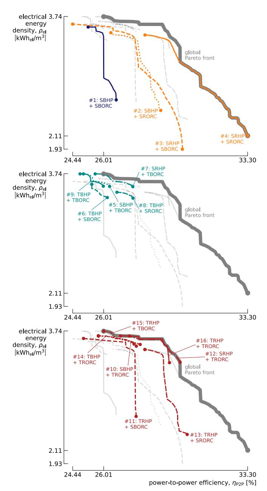

**Fig. 4.3** Pareto fronts corresponding to the 16 Carnot battery configurations. While subcritical recuperated cycles (both for HP and ORC) dominates the other designs in terms of efficiency, the four systems with transcritical basic ORC provide the best energy density.

dominate the other designs in terms of efficiency (see Fig. [4.3\)](#page-104-0). Conversely, for energy density, several configurations provide the same performance. The four systems with transcritical basic ORC actually emerge as the best performers, while the HP configuration has no impact on density (*ρ*el is not a function of COPHP). This is because large *ρ*el is obtained with large thermal densities (i.e., large storage temperature spreads) and good ORC efficiencies, such as defined by Eq. [2.28.](#page-62-1) While transcritical cycles typically offer better efficiency than subcritical cycles for (very) large heat source glides [\[132\]](#page-260-5), transcritical recuperated cycles do not maximise *ρ*el here. The recuperator raises the evaporator inlet temperature, preventing the cold tank from reaching sufficiently low temperatures. As a result, the storage temperature spread is reduced, lowering the thermal density. Finally, in the intermediate zone of the global Pareto front, TRHP + TRORC and SRHP + TRORC offer the best trade-off between *η*P2P and *ρ*el.

To illustrate the corresponding Carnot battery designs, Fig. [4.4](#page-105-0) depicts the HP and ORC cycles maximising *η*P2P and *ρ*el (i.e., the extrema of the global Pareto front). In both cases, the storage temperature is maximised (120◦C), as expected

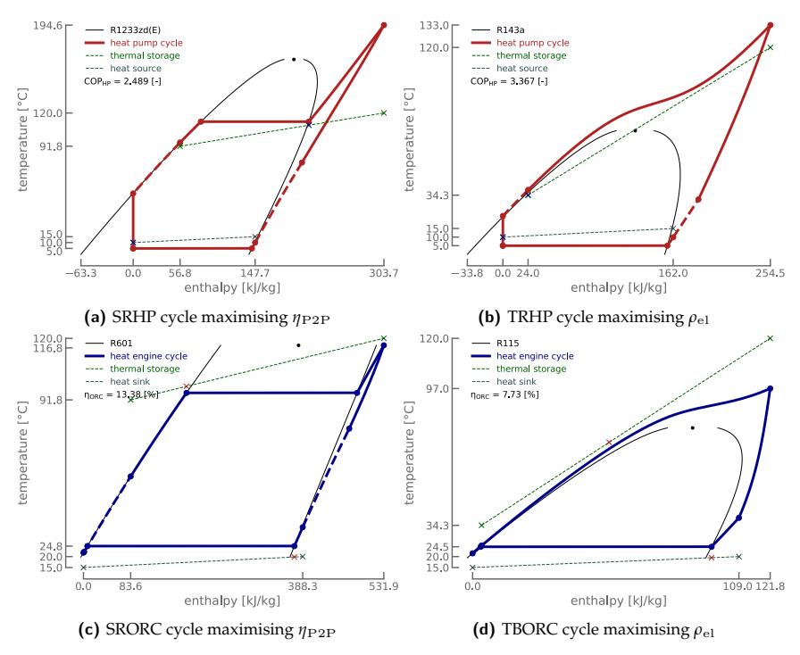

**Fig. 4.4** Temperature-enthalpy diagrams of the for the HP (red) and ORC (blue) cycles maximising the power-to-power efficiency *η*P2P and the electrical energy density *ρ*el. In both cases, the storage temperature is maximised (120◦C) while the storage temperature spread is about 30 K when maximising *η*P2P, compared with about 85 K when maximising *ρ*el.

# **4** | Near-optimal design to generate alternatives

from Chapter [2.](#page-47-0) On the other hand, the storage temperature spread is about 30 K when maximising *η*P2P, compared with about 85 K when maximising *ρ*el. This illustrates the pivotal role of this variable. It should also be mentioned that for subcritical cycles (i.e., those maximising *η*P2P), subcooling in the HP and superheating in the ORC are maximised. Also note that the HP cycle in Fig. [4.4a](#page-105-0) is peculiar: almost 40% of the heat transferred to the storage comes from vapour de-superheating at the compressor outlet.

The conclusions regarding the configurations maximising *η*P2P and *ρ*el are contingent upon the maximum storage temperature and the availability of working fluids. For instance, when the storage temperature is increased to 150◦C, recuperated transcritical cycles can outperform recuperated subcritical cycles, both in terms of *η*P2P and *ρ*el (see Appendix [B.3\)](#page-231-0). Also, for interested readers, Grassmann diagrams associated with the cycles in Fig. [4.4](#page-105-0) are provided in Appendix [B.4.](#page-234-0) These illustrate the distribution of exergy losses across each component of the Carnot batteries. Finally, the transcritical cycles in Figs. [4.4b](#page-105-0) & [4.4d](#page-105-0) use fluids with very high global warming potential and/or non-zero ozone depletion potential. This result therefore highlights the potential interest in identifying new molecules in this range of critical temperatures. However, one of the interests of the near-optimal method can also be to find alternative designs and fluids providing similar performance.

# 4.3.2 From the Pareto to understanding the main drivers

Unlike the only two extreme cycles described in the previous section, this section aims to determine the flexibility available among the seven optimisation variables and the different Carnot battery configurations to achieve designs with high efficiency and high density. To do this, the slack was set to *ε* = 7.5%rel for both criteria. This value allows a sufficiently wide range of design alternatives to be explored. Values ranging from 3%rel to 10%rel are common for modelling to generate alternatives in energy systems [\[19,](#page-250-5) [162,](#page-263-3) [165\]](#page-263-6). Fig. [4.5](#page-107-0) shows the corresponding suboptimal space and the associated near-optimal designs. The greater concentration of points at higher densities and lower efficiencies directly reflects the findings from Fig. [4.3:](#page-104-0) the Pareto fronts for most configurations are positioned in this region of the sub-optimal space, thereby constraining most configurations to this area. Furthermore, the objective function when generating the alternatives aims at maximising the difference with optimal designs, which positions them away from the Pareto fronts (see Section [4.2.2\)](#page-99-0). Yet, maximising this objective does neither translate into being on this border, hence the added-value of such analysis.

Figs. [4.6](#page-108-0) & [4.7](#page-109-0) show the performance indicators associated with these nearoptimal designs. Fig. [4.6](#page-108-0) focuses on the designs being maximum 7.5%rel away from the best efficiency, while Fig. [4.7](#page-109-0) highlights designs being maximum 7.5%rel away from the best density. The rest of this section should now be read as 'By tolerating

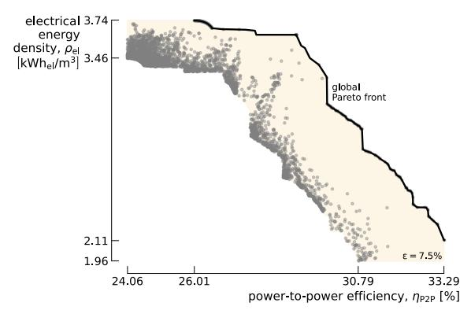

**Fig. 4.5** Sub-optimal space (pale surface) and associated near-optimal designs (grey points) for sub-optimality coefficients of  $7.5\%_{\rm rel}$  for both  $\eta_{\rm P2P}$  and  $\rho_{\rm el}$ .

a maximum performance degradation of  $7.5\%_{\rm rel}$  with respect to the global Pareto front, then (...)'. The first observation is that, as far as the efficiency-density conflict is concerned, it is possible to expect densities of  $2.96~\rm kWh_{el}/m^3$  with efficiencies of over 30.8% (see red dots in Fig. 4.6). Conversely, efficiencies of up to 29.0% can be reached with densities greater than  $3.46~\rm kWh_{el}/m^3$  (see blue dots in Fig. 4.7). Also, except SRHP + SRORC and TRHP + SRORC, nearly all configurations succeed in reaching high densities (real choice, see Fig. 4.7). Instead, only subcritical recuperated cycles can provide high efficiencies (see Fig. 4.6). This therefore represents a must-have whenever prioritising the efficiency.

Regarding storage temperature, this must theoretically be maximised to maximise efficiency and density (see Chapters 2 & 3). Density is however more sensitive to this parameter. The minimum storage temperature required to maintain near-optimal density is  $116.5^{\circ}$ C (see Fig. 4.7), while it can fall to  $109.1^{\circ}$ C for efficiency (see Fig. 4.6).

The storage temperature spread is large for high density (63.7 K to 85.7 K, blue dots in Fig. 4.7), while moderate for high efficiency (28.2 K to 46.7 K, red dots in Fig. 4.6). A large spread increases the thermal energy density ( $\rho_{\rm th}=35.3\,{\rm kWh_{th}/m^3}$  to 48.4kWhth/m³ compared with  $\rho_{\rm th}=15.8\,{\rm kWh_{th}/m^3}$  to 26.2 kWhth/m³ for efficiency). But in the meantime, it reduces the ORC efficiency, due to the reduction in evaporation temperature and the increased heat transfer irreversibilities ( $\eta_{\rm ORC}=7.4\%$  to 9.8% for density compared with  $\eta_{\rm ORC}=11.2\%$  to 13.4% for efficiency). Larger spreads are also beneficial to the HP coefficient of performance (COPHP=2.51 to 3.38 for density compared with COPHP=2.44 to 2.75 for efficiency) as they reduce the condensing temperature (hence, the discharge pressure) and increase the permitted subcooling degree. The optimum spread for efficiency is therefore a trade-off between COPHP and  $\eta_{\rm ORC}$ , while for electrical energy density, it is a trade-off between  $\rho_{\rm th}$  and  $\eta_{\rm ORC}$ . This optimum spread is therefore not the same for efficiency and density. Moreover, its values are not unique, but can be

I

# **4** | Near-optimal design to generate alternatives

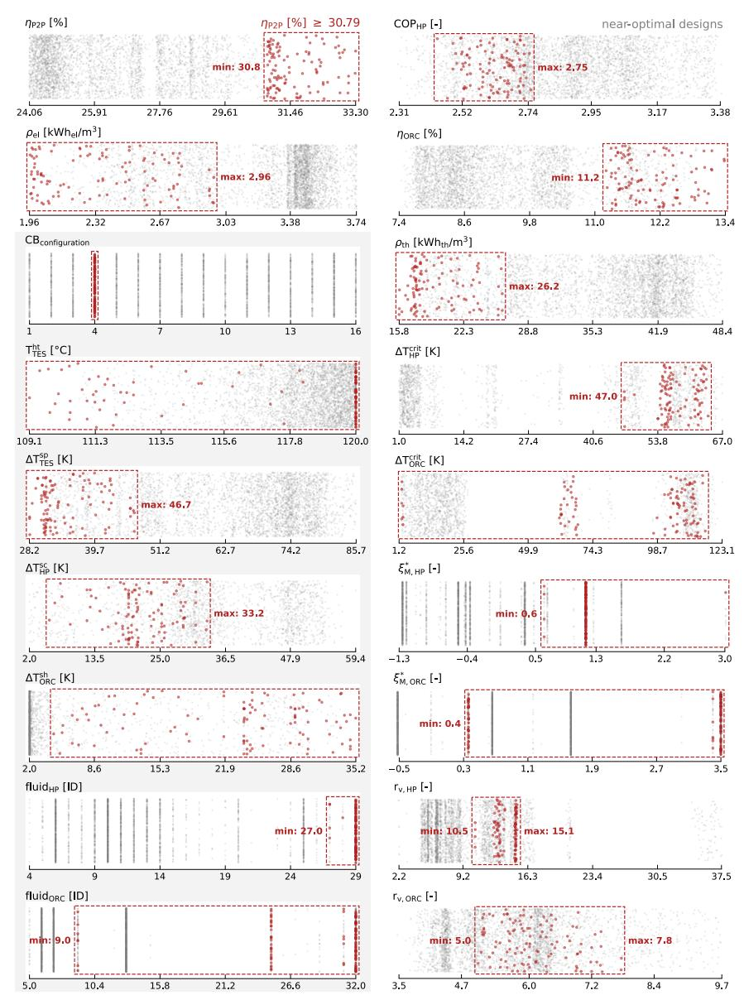

**Fig. 4.6** Performance indicators corresponding to the near-optimal designs reported in Fig. [4.5.](#page-107-0) The Carnot battery configurations and optimisation variables are at the bottom left (shaded area). Red dots mark the designs being maximum 7.5%rel away from the best efficiency (i.e., minimum 30.79%), while grey dots correspond to remaining near-optimal designs from Fig. [4.5.](#page-107-0) The red frames delimit the upper and lower bounds.

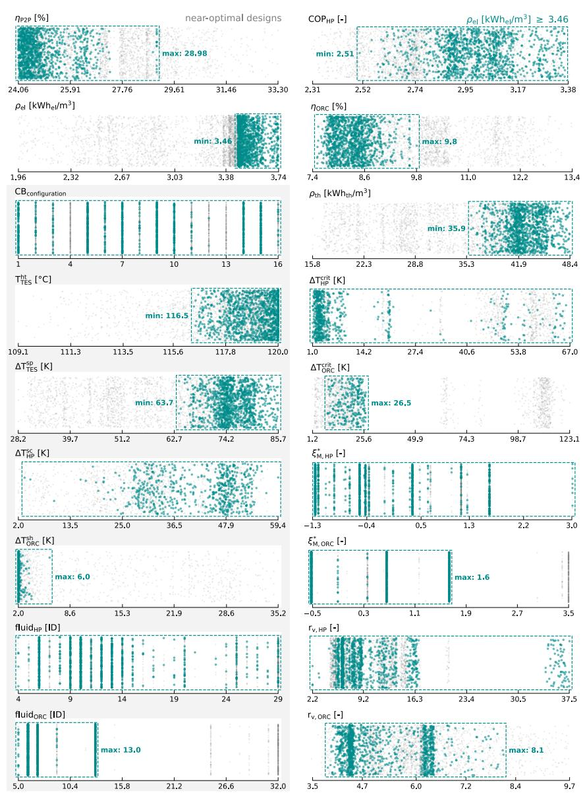

**Fig. 4.7** Performance indicators corresponding to the near-optimal designs reported in Fig. [4.5.](#page-107-0) The Carnot battery configurations and optimisation variables are at the bottom left (shaded area). Blue dots mark the designs being maximum 7.5%rel away from the best density (i.e., minimum 3.46 kWh/m3 ), while grey dots correspond to remaining near-optimal designs from Fig. [4.5.](#page-107-0) The blue frames delimit the upper and lower bounds.

# **4** | Near-optimal design to generate alternatives

span over a range of around 20 K for both criteria. Note that when the storage can reach higher temperatures, the optimum spread can be the same for both (e.g., for 150◦C storage, as illustrated in Chapter [3\)](#page-63-0).

Subcooling in the HP must theoretically be maximised to maximise COPHP [\[152\]](#page-262-4). However, near-optimal results reveal that it can reach low values down to 5.5 K for systems maximising efficiency. This low subcooling is made possible by the presence of the recuperator, which recovers part of the exergy available at the valve inlet and which would otherwise be lost. This shows that there is some flexibility in the choice of this parameter (i.e., real choice), provided that a recuperator is installed in the HP. Vapour superheating in the ORC can take on a wide range of values in systems maximising efficiency (from 4.5 K to 35.2 K). On the other hand, in systems maximising density, it is generally minimal and in all cases less than 6.0 K. This can be explained by the fact that subcritical cycles with large storage spreads use dry fluids (*ξ* ∗ M,ORC > 0.0). Therefore, any superheating would raise the temperature of the vapour leaving the expander, which would increase the condenser losses. The use of recuperators to overcome this is limited by the large storage spreads, since the temperature at the evaporator inlet must remain lower than that of the cold tank. Therefore, for subcritical ORC maximising density, vapour superheating must be kept as low as possible (i.e., must-have).

In terms of fluids, the choice is much more limited for cycles maximising efficiency (3 for HP and 4 for ORC) than density (25 for HP and 5 for ORC). This can be explained by the fact that only one Carnot battery configuration works for efficiency, while nearly all configurations work for density, and also by the fact that COPHP does not affect density. So, a HP fluid giving poor COPHP will still be acceptable. This is illustrated by the fact that the range of COPHP maximising density is much wider than that maximising efficiency (2.51 to 3.38 for density against 2.44 to 2.75 for efficiency). As the ORC efficiency is important for both density and efficiency, only the fluids providing the best *η*ORC are selected, which explains why the range of possibilities is smaller for the ORC than for the HP.

For cycles maximising efficiency, only dry fluids (i.e., *ξ* ∗ M > 0.0) are used in the HP and the ORC. For the HP, this can be explained by the fact that a dry fluid limits the superheating at the compressor discharge compared with a wet fluid, and therefore reduces irreversibility at the condenser. For the ORC, the exergy remaining in the superheated vapour leaving the expander is reused by the recuperator to preheat the liquid before the evaporator (although this produces some heat transfer irreversibility). Additionally, the fluids used in the HP have high critical temperatures, resulting in large temperature differences between the critical point and saturation (between 47.0 K and 64.1 K). For systems maximising density, wet fluids (i.e., *ξ* ∗ M < 0.0) are also an option for the ORC and the HP. However, ORC with wet fluids only operate in transcritical regime.

A final technological parameter worth observing is the volume ratio of the dif-

ferent cycles. As the built-in volume ratios of scroll and screw machines are usually limited to a maximum of 5.0, the best is to find cycles with a volume ratio equal to or less than this. This is possible for HP and ORC maximising density (upper pressure limited thanks to the large storage spread, which reduces the saturation temperature). However, this is not possible in the HP maximising efficiency (the lower spread increases the saturation temperature, and therefore the compressor discharge pressure). Using two compressors in series would be a way to increase the performance of the compression stage under large pressure ratios, but this configuration increases the cost of the system and makes it more complex to design and to control.

# 4.3.3 Choosing the Carnot battery that suits your own preferences

Various thermodynamic designs of Carnot batteries can achieve comparable performance, while presenting distinct trade-offs. The near-optimal method enables designers to access a range of alternatives that align, either partially or fully, with their technological preferences. These preferences are shaped by both technoeconomic factors and non-technical considerations, which cannot be entirely captured by mathematical models. They often arise from practical experience in constructing and operating machines (e.g., fabrication challenges, maintenance complexity, climatic conditions), strategic and business model choices (e.g., regional regulations, expected returns on investment), market perceptions (e.g., user needs), supply chain dynamics (e.g., component availability, discounts, or delivery timelines), etc. Unlike constraints, which are rigid and non-negotiable, preferences represent desirable criteria that may be compromised if outweighed by other benefits. This inherently requires subjective evaluation and prioritisation by the designers. The objective, therefore, is to present a curated list of viable alternatives, empowering designers to select solutions that best align with their own set of preferences. To illustrate this methodology, we selected four preferences relevant for Carnot batteries:

- T ht TES < 100◦C: To reduce investment costs, pressurisation should be avoided so as to reduce material strength requirements. The storage temperature must thus remain below the atmospheric boiling point of water. This enables the use of cost-effective materials, such as plastic tanks.
- T comp,ex HP &lt; 160◦C: To facilitate the use of standard lubricants in the HP compressor and prevent damage, the discharge temperature is limited to 160◦C [\[141\]](#page-261-3). This also minimises risks of thermal instability in the refrigerantlubricant mixture and simplifies component selection by reducing demands for high-temperature resistance.
- rv,HP < 8: To reduce design and manufacturing costs of the HP compressor, and to limit the system regulation complexity if several compressors were

# 4 | Near-optimal design to generate alternatives

used in series, the volume ratio of the HP cycle should be capped at 8. This allows the use of a maximum of two compressors in series while maintaining design flexibility.

TscHP < 5 K: Large subcooling degrees in the HP can be achieved with an additional heat exchanger (subcooler), but this increases investment costs and limits operational flexibility (no possible regulation of subcooling degree) [153]. Alternatively, subcooling can be performed in the condenser by controlling the liquid refrigerant level, which may require a second expansion valve for charge control during part-load operation [179]. To avoid these complexities, subcooling should be kept minimal (e.g., below 5 K). Additionally, limiting the subcooling reduces the refrigerant charge, which could further decrease costs and ease compliance with regulations.</li>

To explore a wider range of designs so as to meet each preference, a new set of alternative designs was generated. Slacks were here set at  $15\%_{\rm rel}$  for efficiency and  $30\%_{\rm rel}$  for density. The latter is particularly important to reach storage temperatures below  $100^{\circ}{\rm C}.$  Design alternatives were then explored within a part of the sub-optimal space, limited to  $20\%_{\rm rel}$  below the maximum efficiency (i.e., efficiency above 26.6%, corresponding to the south-eastern part of the sub-optimal space). Efficiencies below this threshold are considered too low to remain competitive.

Following the preferences they satisfied, eight distinct subsets could be identified among the alternatives. These are reported in Table 4.3. Fig. 4.8 illustrates the range of values for various indicators covered by these subsets (coloured bars), along with the other near-optimal designs that do not belong to any subset (represented by grey dots). These indicators are firstly those for the four preferences, i.e., storage temperature  $T_{TES}^{\rm ht}$ , compressor discharge temperature  $T_{HP}^{\rm comp,ex}$ , HP volume ratio  $r_{v,HP}$  and HP subcooling  $\Delta T_{HP}^{\rm sc}$ . Next to these are the two performance criteria, the efficiency  $\eta_{P2P}$  and the density  $\rho_{\rm el}$ . The other indicators are the Carnot battery configuration  $CB_{\rm configuration}$ , the ORC volume ratio  $r_{v,ORC}$ , the ORC upper pressure  $p_{\rm ORC}^{\rm max}$ , the proximity to the near-critical regime  $\Delta T_{\rm HP}^{\rm crit}$  in the HP, the HP volumetric heating capacity VHC\_{HP} and the ORC volume coefficient VC\_{ORC}.

| Table 4.3                                                            | Table representing the eight subsets identified among the near-optimal designs,     |  |  |  |
|----------------------------------------------------------------------|-------------------------------------------------------------------------------------|--|--|--|
| according                                                            | to the preferences they satisfy. One subset satisfies three preferences (#1), three |  |  |  |
| satisfy two (#2, #4, #5) and four satisfy just one (#3, #6, #7, #8). |                                                                                     |  |  |  |

|           | T TES [°C] < 100 | T HP comp, ex [°C] < 160 | r v, HP [-] < 8 | $\Delta T_{HP}^{sc}[K] < 5$ |
|-----------|-----------------------------|------------------------------------------------|----------------------------|-----------------------------|
| Subset #1 | 1                           | 1                                              | 1                          | Х                           |
| Subset #2 | 1                           | 1                                              | Х                          | Х                           |
| Subset #3 | 1                           | Х                                              | Х                          | Х                           |
| Subset #4 | х                           | ✓                                              | 1                          | Х                           |
| Subset #5 | Х                           | ✓                                              | Х                          | ✓                           |
| Subset #6 | Х                           | 1                                              | Х                          | Х                           |
| Subset #7 | Х                           | Х                                              | 1                          | Х                           |
| Subset #8 | Х                           | Х                                              | Х                          | 1                           |

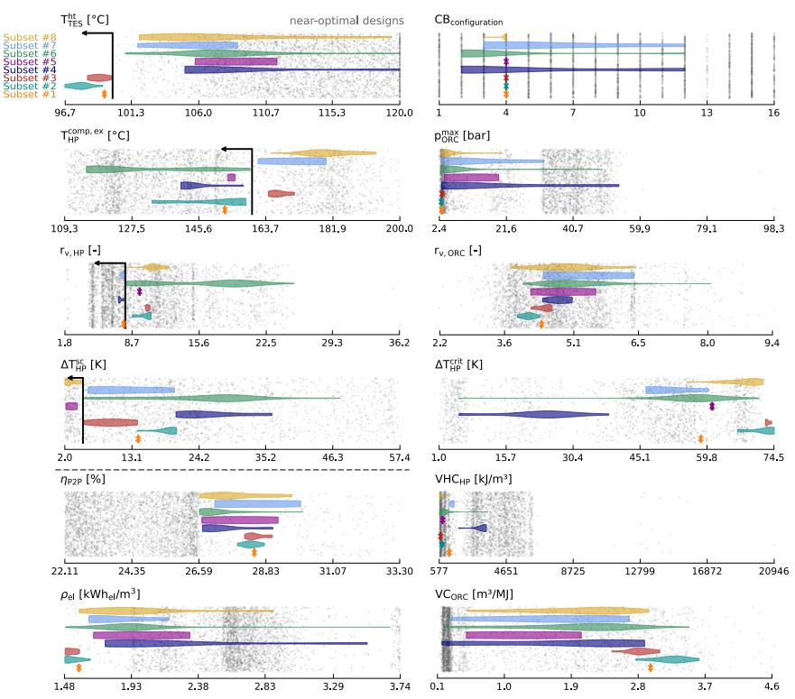

**Fig. 4.8** Range of values for the indicators covered by the 8 subsets (coloured bars), along with other alternative designs that do not belong to any subset (grey dots). The violins indicate the distributions. Subset #1 has just one design, while the others have several.

None of the subsets satisfies all four preferences, so choices need to be made. One subset satisfies three preferences (#1), three satisfy two (#2, #4, #5) and four satisfy only one (#3, #6, #7, #8). Although Subset #1 satisfies the greatest number of preferences, this contains only one feasible design, leaving no room for choices across the various indicators. For that subcritical recuperated configuration, the required HP subcooling ∆T sc HP is approximately 14 K, necessitating careful condenser design and precise system regulation. Efficiency is moderate (28.4%), while density reaches its minimum (1.58 kWhel/m3 ). This outcome aligns with the decision to minimise storage costs by opting for non-pressurised tanks. As an indication, the fraction of Lorenz efficiency for the HP and ORC are ΨLorenz HP = 59% and ΨLorenz ORC = 52%, respectively (these values will be used in Chapters [6](#page-155-0) and [7\)](#page-189-0). The ORC volume ratio rv,ORC is sufficiently low (< 4.5) to require a single expander, and the maximum ORC pressure remains relatively low (3.04 bar), making it compatible with most plate heat exchangers (typically limited to 30 bar). The HP avoids the near-critical regime, simplifying control and reducing pressure and temperature sensitivity. Its volumetric heating capacity (VHCHP = 1195 kJ/m3 )

#### 4 | Near-optimal design to generate alternatives

is comparable to the lower range of values typically observed in high-temperature heat pumps with similar temperature lifts (from 1000 to 3500 kJ/m³ [141]). However, it remains lower than alternative design options. Conversely, the ORC volume coefficient  $VC_{ORC}$  is relatively high (close to 3 m³/MJ), likely necessitating a customised expander design and large heat exchangers (as the norm typically ranges between 0.3 and 0.65 m³/MJ [130,178]), which increases costs.

Conversely, Subset #4 offers real choices with respect to other performance indicators, despite not allowing for non-pressurised storage. At least three alternatives can be identified, as outlined in Table 4.4. However, these alternatives involve distinct trade-offs, as no single option can satisfy all preferences simultaneously.

For instance, aiming for a lower storage temperature ( $T_{\rm TES}^{\rm ht}=105^{\circ}{\rm C}$ ) to reduce the pressurisation needs, Alternatives A and B can be considered. This initial decision impacts the achievable efficiency and density, presenting the first compromise. From there, it is possible to choose between the SRHP + TRORC configuration (Alternative A) or the SBHP + SRORC configuration (Alternative B). In Alternative A, opting for a transcritical ORC (despite its operational complexity and higher cost due to elevated pressures) allows for an acceptable VHC $_{\rm HP}$  and a VC $_{\rm ORC}$  compatible with off-the-shelf expanders. In contrast, Alternative B avoids a transcritical ORC and its associated challenges, but the VC $_{\rm ORC}$  then falls outside standard ranges. Also, while VHC $_{\rm HP}$  improves, the density is reduced.

By accepting a higher storage temperature ( $T_{TES}^{ht}=120^{\circ}C$ ) and a transcritical ORC, Alternative C achieves the best efficiency and density, along with a high VHCHP and an acceptable VCORC ( $0.16~{\rm m}^3/{\rm MJ}$ ), thereby enhancing the HP and the ORC compactness. The trade-off involves a very high 'evaporation' pressure ( $53.8~{\rm bar}$ ) in the ORC and a HP operating in the near-critical regime, which poses control challenges.

Overall, Alternative A seems to offer a good compromise between the various performance indicators. It should also be noted that its configuration (SRHP  $\pm$  TRORC) already appeared on the Pareto fronts in Fig. 4.3 as a good compromise between efficiency and density.

**Table 4.4** Payoff table comparing some performance indicators for three design alternatives from Subset #4. Bold font highlights **desired values** while italic font highlights *values to be avoided*. In view of the considered criteria, Alternative A appears to be a feasible compromise.

| Indicator                                    | Alternative A | Alternative B | Alternative C |
|----------------------------------------------|---------------|---------------|---------------|
| Tht [°C]                                     | 105.2         | 105.0         | 120.0         |
| $CB_{configuration}$                         | SRHP + TRORC  | SBHP + SRORC  | SRHP + TRORC  |
| $\eta_{\mathrm{P2P}}\left[\% ight]$          | 27.1          | 27.5          | 28.8          |
| $ ho_{\rm el}  [{ m kWh/m^3}]$               | 2.21          | 1.75          | 3.52          |
| $VHC_{HP} [kJ/m^3]$                          | 1749          | 3346          | 3338          |
| $VC_{ORC}$ [m 3 /MJ]              | 0.29          | 1.91          | 0.16          |
| $p_{ORC}^{max}$ [bar]                        | 31.9          | 4.4           | 53.8          |
| $\Delta T_{\mathrm{HP}}^{\mathrm{crit}}$ [K] | 38.2          | 24.9          | 5.4           |

# **4.4 Summary and discussions**

# 4.4.1 Main results

Drawing on the current trend in analysing alternative transition scenarios for energy systems, this work looked at the use of the near-optimal method for the thermodynamic design of small-scale Carnot batteries based on vapour compression heat pumps, sensible heat storage in water tanks and organic Rankine cycles. A method based on the NSGA-II evolutionary algorithm was introduced to generate the near-optimal alternative designs. Out of these alternatives, the first objective was to understand, as opposed to the single optimum, what values the design variables could take if a slight performance slack is tolerated. This highlights the variables for which only one value–or a very narrow range of values–is possible (i.e., must-have) and those that can take on different values, within a defined range, offering designers greater flexibility (i.e., real choices).

The results showed that, when the storage temperature is limited to 120◦C, and for the considered list of fluids, only Carnot batteries based on subcritical recuperated cycles can maximise efficiency (must-have). Conversely, most configurations based on sub- and transcritical cycles, with or without recuperators, can maximise energy density (real choice). While maximising efficiency and density requires high storage temperatures, density is more sensitive to this parameter than efficiency. Maximising density also requires larger storage temperature spreads than maximising efficiency. However, for both criteria, the spread does not take on a single optimum value but can lie within a 20 K-wide range (real choice).

In the HP, subcooling, which must theoretically be at a maximum to maximise the coefficient of performance, can in fact be as low as 5.5 K. In the ORC, to maximise efficiency, the vapour superheating degree has to lie between 5 and 35 K (real choice). Conversely, to maximise density, this superheating must be minimised (must-have). As far as the choice of working fluids is concerned, only 'dry' fluids can be used to maximise efficiency (must-have). Instead, 'wet' fluids can also be used to maximise density (real choice). Yet, in the ORC, this involves operating only in transcritical regime (must-have).

The second objective of this work was to apply the near-optimal method to explore trade-offs between different technological parameters, which are necessary for identifying Carnot battery designs that best align with specific designer preferences. These preferences result from various factors but, unlike constraints, they are not rigid. For the desired technological preferences, it was not possible to identify a design that satisfied all of them simultaneously. Choices therefore had to be made, and only one design satisfied three preferences: it did not require storage pressurisation (< 100◦C), had a compressor discharge temperature below 160◦C

# **4** | Near-optimal design to generate alternatives

and the number of compressors to be used in series was limited to two (volume ratio < 8). The corresponding efficiency and density were 28.4% and 1.58 kWhel/m3 , respectively. On the other hand, a compromise had to be made on the subcooling in the HP (14 K) and on the volume coefficient of the ORC (equal to 3.00 m3/MJ).

If a compromise can be made on storage pressurisation, it is then possible to identify alternatives. A design with 105◦C storage, for instance, gives an efficiency of 27.2% and a density of 2.21 kWhel/m3 . Its other advantages are an increased HP volumetric heating capacity, from 1195 to 1749 kJ/m3 , and an ORC volume coefficient that drops to 0.29 m3/MJ. The downside, however, is the use of a transcritical ORC instead of subcritical, and a resulting pressure that is rather high (31.9 bar).

# 4.4.2 Perspectives

The problem of optimising the thermodynamic design of Carnot batteries is highly non-linear and discontinuous (e.g., non-physical solutions). It also includes continuous and discrete variables. The method used here with NSGA-II works, but it would be interesting to benchmark it with other algorithms (Particle Swarm Optimisation, etc.) to compare the quality of solutions and convergence speeds. The same applies to the method for generating near-optimal designs. Future work could seek to improve and validate it by ensuring that it does effectively maximise the diversity of the solutions and the differences from the reference designs. Other algorithms, such as NSGA-III, could also be tested. It would also be interesting to benchmark its performance and compare it with other methods in terms of speed of convergence, diversity of solutions, and differences from reference designs. As the literature on meta-heuristic and multi-criteria near-optimal methods is rather scarce, there is considerable scope for innovation in this area.

With regard to the cycles considered, it would be interesting to extend the analysis to zeotropic mixtures. Although they increase performance by reducing heat transfer irreversibility, they bring additional complexity. The use of two-phase expanders could also be considered, specifically in heat pumps with high pressure ratio. In light of the large volume ratios required in the heat pumps, looking at cascade cycles and two-stage compression appears necessary. However, in the same way as the recuperator in the ORC, these configurations could impose a lower limit on the temperature of the cold reservoir. For high-efficiency designs, this should not be a problem. On the other hand, it could restrict the storage spread in higher density designs. Finally, only a few technological indicators have been used here for illustrative purposes. Nevertheless, designers are free to adapt these to the specific nature of their problem, and to their own preferences. The specific heat transfer area of heat exchangers could for instance be considered.

# **4.5 Key messages**

- For storage temperatures limited to 120◦C and for the considered fluids, only subcritical recuperated cycles can maximise efficiency (must-have). Instead, most configurations based on sub- and transcritical cycles, with or without recuperators, can maximise energy density (real choice).
- Maximising density requires larger storage spreads than maximising efficiency. However, for both criteria, the spread does not take on a single optimum value but can lie within a 20 K-wide range (real choice).
- The near-optimal method makes it possible to discuss the trade-offs required for certain technological parameters in order to identify designs that best align with the designer preferences.
- Extending the analysis to other cycles would enrich the discussion on the necessary trade-offs. Zeotropic mixtures offer potential performance gains that must be weighed against the added complexity. Similarly, the benefits of two-phase expanders in heat pumps should be compared to the extra cost.
- The method for generating near-optimal alternatives deserves to be improved and validated in order to ensure both the maximisation of the Euclidean distance from the Pareto front and the diversity of the solutions.

# **PART II Techno-economic analysis**

# **Waste heat recovery in data centres with photovoltaics**

T HE integration of Carnot batteries in data centres coupled with photovoltaic systems is an increasingly discussed application, as they can recover the waste heat, which improves their efficiency, while simultaneously reducing the cooling duty [\[111,](#page-258-7) [112,](#page-258-8) [180,](#page-264-10) [181\]](#page-264-11). The case of data centres is of particular interest because few other technologies are able to recover the waste heat: due to low temperatures, organic Rankine cycles have too poor efficiency [\[112,](#page-258-8)[182\]](#page-265-0) and direct heat reuse cannot always be envisaged. However, the economic viability of such application remains to be proven, particularly under real-world conditions. Specifically, studies conducted to date are generally limited to ideal cases, with fixed numbers of cycles throughout the year. In response, this chapter explores the following question:

> *Under what real-world conditions could waste heat recovery be economically viable for thermally integrated Carnot batteries?*

To this end, Section [5.1](#page-121-1) first provides context on the need for more realistic technoeconomic studies for Carnot batteries. Section [5.2](#page-123-0) then describes the three integration scenarios considered, while the techno-economic model is introduced in Section [5.3.](#page-127-2) The results of the design optimisation, aimed at maximising both the energy self-sufficiency and the internal rate of return on investment, are subsequently discussed in Section [5.4.](#page-139-0) A sensitivity analysis is also conducted to assess the impact of techno-economic uncertainties. Finally, Section [5.5](#page-150-0) summarises the main results and future perspectives, while Section [5.6](#page-154-0) highlights the key takeaways of this chapter. This chapter is adapted from a publication in *Energy Conversion and Management* [JP1].

# **5.1 Need for realistic techno-economic analyses**

Studies have shown that diverse designs and integration scenarios can be envisaged for thermally integrated Carnot batteries. Yet, they do not indicate exactly where and how Carnot batteries (CB) could become relevant and cost-effective for energy systems [\[37–](#page-252-11)[39\]](#page-252-10). For example, it is not yet clear what services they should provide in the various scenarios: Pure load shifting? Energy arbitrage? Grid services? Electrical and/or thermal discharge? Storage duration? etc. [\[37,](#page-252-11)[39,](#page-252-10)[125\]](#page-259-10). Nor is it clear at what cost and efficiency they might begin to penetrate the market. In other words, it has not yet been determined precisely which designs would enable CB to be technically and financially sound in the different scenarios.

To answer these questions, some studies have sought to compare and optimise the techno-economic performance of different machines, assuming cyclic and ideal boundary conditions (e.g., constant efficiencies and power profiles over time, fixed number of charge and discharge cycles over lifetime, etc.) [\[104–](#page-258-0)[106,](#page-258-4) [183\]](#page-265-1). Typical criteria are to minimise the levelised cost of storage (LCOS) and maximise the efficiency (*η*P2P). Generally speaking, these studies concluded that thermally integrated Carnot batteries could be competitive with chemical batteries. However, the ideal conditions in which they were studied probably made the results too optimistic. In practice, the conditions under which they would operate would be less ideal. Due to intermittent operations, charge and discharge times could vary. Similarly, power profiles could fluctuate in frequency and amplitude over time. Also, the temperatures at the boundaries of the thermal machines will probably not be constant (e.g., ambient), which affects their efficiency. Finally, the link between power levels and heat source availability could be a real operating constraint, limiting the charging capacity.

To address that, new studies have produced scenario-based analyses. In these, time series representing the integration scenarios are used to simulate the system behaviour on an hour-by-hour basis. Tassenoy et al. [\[111\]](#page-258-7) looked at CB for photovoltaic (PV) load shifting in an office building. With a constant efficiency model, they used synthetic production and consumption profiles to size a CB that recovers the 50◦C waste heat from a data centre so as to maximise the net present value (NPV). They showed that without subsidy or tax mechanisms, it was not possible to obtain positive NPV. They also showed that CB could become competitive with Li-ion batteries for 'long duration' energy storage (i.e., charging and discharging times exceeded 7 hours).

Poletto et al. [\[112\]](#page-258-8) were also interested in the integration of CB in PV fed data centres. They showed that for high spot electricity prices (i.e., those of the 2022 energy crisis) and moderate investment costs, the economic gain could be positive with associated discounted payback periods of less than 5 years. They also showed that, depending on the electricity prices, there was an optimum storage capacity for maximising this gain. Zero feed-in tariffs were also very favourable to storage deployment.

The difference between the conclusions of Tassenoy et al. and Poletto et al. is essentially due to the fact that Tassenoy et al. considered higher investment costs while using lower electricity prices. Poletto et al. also carried out a study using the 2018 electricity prices and came to the same conclusion as Tassenoy et al.: it is not possible to have a positive NPV with low electricity prices. It is worth noting that another recent study also focused on this case [\[181\]](#page-264-11). To achieve positive NPV, the authors considered dynamic pricing schemes, with electricity costs being 3 to 5 times higher during peaks compared to valley periods. However, they demonstrated that electricity prices had the most significant impact on the NPV.

In the above referred studies, when techno-economic optimisation was carried out, the models generally assumed fixed efficiencies over the operations and did not take into account the constraint on the availability of the heat source (i.e., they assumed infinite source). When more advanced models taking into account variations in efficiency were considered, no optimisation of the installed capacity and power was carried out. It should also be noted that hardly any study has taken into account the impact of techno-economic uncertainties on the results obtained. Finally, none of the above studies exploited the synergies between renewable generation and storage capacity: fixed PV capacity was always assumed.

In order to properly consider operational constraints (e.g., variation in efficiencies, availability of the heat source) while seeking to achieve better financial performance, this work proposes to simultaneously optimise the design of a CB (i.e., capacity and thermodynamic cycle) and of a PV system for a 100 kWel data centre.

# **5.2 Case study and scenarios description**

To illustrate how the PV and CB are integrated into the data centre, the layout of the energy system is depicted in Fig. [5.1.](#page-124-1) Three scenarios are investigated to compare the performance of alternative integration schemes for the CB, depending on the type of data centre cooling system. In short, these are distinguished by the temperature and availability of the heat source. In practice, the two main categories of data centres are here considered (i.e., indirect and direct cooling). According to the power of the data centre, different configurations and technologies can be used, as each offers its own advantages (i.e., cost, efficiency, complexity, etc.). Nevertheless, to limit the number of cases to consider, only those offering the best energy performance and being the most widespread are covered in this study.

Aside from the type of data centre, two locations are used to take into account different climatic conditions, which affect the system performance (e.g., PV pro-

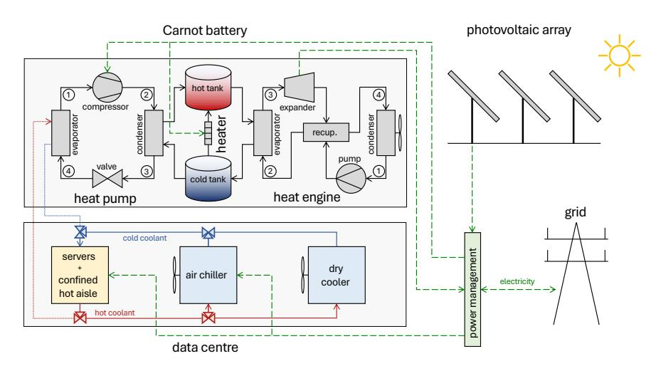

**Fig. 5.1** Layout of the CB and PV system integrated into the data center. In scenarios A and B, a new connection is made between the cooling circuit and the heat pump evaporator (red dotted lines). In scenario B, the coolant directly flows through the servers (i.e., direct cooling), so the confined aisle is unused. In scenario C, the heat pump uses an aero-evaporator (i.e., no connection with the cooling circuit, fan not represented here). Note that components necessary for the CB control are not depicted here (e.g., liquid receiver, ...).

duction, CB efficiency, etc.): Louvain-la-Neuve (Belgium), with a temperate climate and moderate solar irradiance, and Seville (Spain), with a hot climate and higher irradiance (see Fig. [5.2](#page-125-0) for ambient temperatures and solar irradiances). These different case studies are summarised in Table [5.1.](#page-126-0)

In all scenarios, the data centre, which consumes electricity to power the servers and the cooling system, can be powered either by the PV system, the CB or the distribution grid. When the PV system is overproducing compared with demand, electricity can either be used to charge the CB or be returned to the grid at a zero feed-in tariff (i.e., which is equivalent to curtailment from an economic perspective). In this sense, shifting the PV production is the only service that the CB can provide to the system. The reasons for these choices and the detailed power management strategy are introduced below.

# 5.2.1 Scenario A: air-cooled data centres (indirect cooling)

Today, most low-power data centres (i.e., < 1MWel) are cooled indirectly with air. Several configurations exist, but one of the most efficient uses hot aisles, so it is chosen for this scenario. Fresh ambient room air (generally below 25◦C) is supplied to the servers racks to cool them down. Once it has warmed up, this air is collected at the racks outlet and pulsed with small fans in a hot aisle. In this aisle, the hot air is confined beneath a plastic cover so as not to heat up the rest of the room by

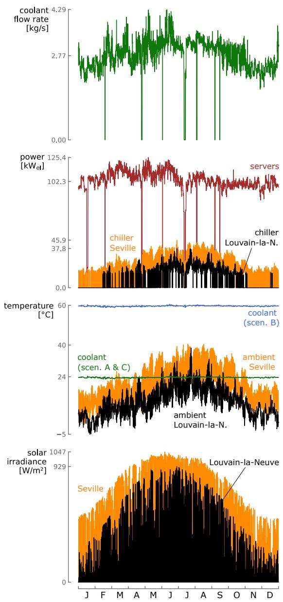

**Fig. 5.2** Annual hourly profiles for solar irradiance, ambient and coolant temperatures, electrical load (servers and chiller) and coolant flow rates for Louvain-la-Neuve and Seville. These show that the chiller consumption increases during spring and summer and decreases during fall and winter.

| **109**

| Scenarios                   |            | A       | B       | C       |
|-----------------------------|------------|---------|---------|---------|
| Heat source of heat pump    | [–]        | coolant | coolant | ambient |
| Heat sink of heat engine    | [–]        | ambient | ambient | ambient |
| Nominal coolant temperature | ◦C] [   | 24      | 60      | 24      |
| Servers annual consumption  | [MWhel]    | 895.9   | 895.9   | 895.9   |
| Louvain-la-Neuve            |            |         |         |         |
| Average ambient temperature | ◦C] [   | 10.8    | 10.8    | 10.8    |
| Chiller annual consumption  | [MWhel]    | 69.1    | 0.0     | 69.1    |
| Average solar irradiance    | [W/m2 ] | 150.6   | 150.6   | 150.6   |
| Seville                     |            |         |         |         |
| Average ambient temperature | ◦C] [   | 18.5    | 18.5    | 18.5    |
| Chiller annual consumption  | [MWhel]    | 147.2   | 0.0     | 147.2   |
| Average solar irradiance    | [W/m2 ] | 228.5   | 228.5   | 228.5   |

**Table 5.1** Summary of the considered integration scenarios. The energy consumption are assessed on an annual basis using the time series from the UCLouvain data centre. The solar irradiance and ambient temperature correspond to average values for 2019.

mixing with the surrounding air. It is then drawn through liquid cooling packages where it transfers its heat to chilled water (generally < 15◦C) before being discharged into the room. Chilled water is typically produced in two different ways, depending on the external temperature. When this temperature is below a given threshold (usually around 10◦C), the hot water from the liquid cooling packages is cooled directly by the external air in a dry cooler. When the external temperature is above this threshold, a chiller takes over, resulting in an additional electricity consumption. This combination of cooling systems is illustrated in Fig. [5.1.](#page-124-1)

In this integration scenario, the heat pump (HP) of the CB uses the cooling water as a heat source. This increases its COP and reduces the chiller electricity consumption by reducing the amount of water to be chilled. However, as the amount of thermal energy available at the HP evaporator is limited by the servers operations, a resistive heater (RH) can be used in parallel to boost the charging capacity. In other respects, although its equivalent COP is only 1, this RH is much cheaper than a HP (i.e., almost three times less, as shown in the economic model in Section [5.3.3\)](#page-132-0). This could make it more attractive from a techno-economic point of view. More complex combinations, for example with dual evaporator heat pumps that would use external air as a second heat source, are not considered here. Yet, a HP using external air only is covered by scenario C.

To evaluate its performance, the system is simulated with an hourly resolution using the thermodynamic model introduced in Chapter [2](#page-47-0) and time series from a real data centre, following a rule-based power management strategy. Those are introduced in Section [5.3.](#page-127-2) The time series have been provided by the *Center for High Performance Computing and Mass Storage* from UCLouvain and are illustrated in Fig. [5.2.](#page-125-0) The data centre was commissioned in 2016 and has an installed capacity of about 100 kWel. Its hot cooling water temperature is 24◦C and the chilled water is produced at 14◦C, resulting in a constrained glide of 10 K. The ambient temperature threshold for switching between the dry cooler and the chiller is 12◦C. The ambient temperature and solar irradiance in Fig. [5.2](#page-125-0) have been obtained with Renewables.ninja [\[184,](#page-265-2) [185\]](#page-265-3). Note that the consumption data for the chiller was not available, so it has been artificially synthesised assuming a fixed second law efficiency, such as described in Section [5.3.1.](#page-129-0)

# 5.2.2 Scenario B: water-cooled data centres (direct cooling)

A new generation of servers is currently being developed to provide higher power densities, limit the energy consumption of cooling units, and reject a higher grade heat, so that it could be better recycled. In this new generation, the servers are cooled directly with the liquid coolant that circulates in them. This enables much higher coolant temperatures to be reached, ranging from 50◦C up to 75◦C (most servers have an operating temperature limited to 80◦C) [\[182\]](#page-265-0). As these temperatures are systematically higher than the ambient temperature, the cooling unit can operate using dry cooling only. In this work, a conservative value of 60◦C was selected to model the cooling water, as shown in Fig. [5.2.](#page-125-0)

From the CB point of view, the benefit of this scenario is that the heat source is at a higher temperature, which significantly increases the COP of the HP, and a fortiori *η*P2P. However, as the amount of waste heat remains constrained by the servers operations, the resistive heater can still complement the HP.

# 5.2.3 Scenario C: standalone air-sourced Carnot battery

In scenarios A and B, a resistive heater can be used to overcome the constraint on the availability of the heat source. Also, its much lower cost puts it in competition with the more expensive HP. However, its utilisation results in a lower equivalent charging COP for the CB, and a techno-economic trade-off therefore needs to be found.

To overcome the constraint on the availability of the heat source, scenario C uses a non-integrated CB, where the source of the HP is the external air. The resulting heat pump COP is lower than in scenarios A and B (especially in Louvainla-Neuve, where the ambient temperature is lower). However, as there is not any constraint on the heat source availability, the resistive heater is no longer essential to increase charging capacity, enabling higher equivalent charging COP. Nevertheless, the RH and the HP remain in competition from an economic point of view, thus the use of a RH remains an option in this scenario.

Table [5.1](#page-126-0) summarises and compares the technical performance of the different scenarios when no PV and no CB are installed (i.e., the current case), based on data from the UCLouvain data centre and for the cases of Louvain-la-Neuve and Seville.

# **5.3 Model and methods**

# 5.3.1 Technical model

#### Carnot battery

As depicted in Fig. [5.1,](#page-124-1) the CB under investigation is composed of a singlestage high-temperature heat pump (HP), a resistive heater (RH) which is used as a booster (i.e., additional charging capacity when the HP runs at nominal load), a two-tank sensible heat thermal energy storage (TES) and an air-cooled recuperated organic Rankine cycle (ORC). The working fluid used in the HP and in the ORC is *R1233zd(E)*, as it has shown interesting performance and behaviour in other Carnot batteries with similar working conditions [\[77,](#page-255-5) [78,](#page-255-6) [112\]](#page-258-8).

The performance and operating conditions (i.e., mass and energy flows) of the thermal machines are assessed by evaluating their thermodynamic cycle and applying energy balances at each hour the year. This is done with the model introduced in Chapter [2](#page-47-0) and based on the quasi-steady state assumption (i.e., steadysate operation at each hour, no transient considered). The values of the parameters used in this model are given in Table [5.2.](#page-129-0) The temperature levels within the thermal machines are obtained for the prescribed boundary conditions (i.e., temperatures of the heat source, thermal storage and ambient air). The resistive heater is modelled assuming 100% efficiency and full load flexibility, without efficiency degradation.

In practical applications, more advanced cycles than those shown in Fig. [5.1,](#page-124-1) such as two-stage or cascaded heat pumps, should certainly be investigated for performance and technical reasons (e.g., high pressure ratios). Nevertheless, the main purpose of the present model is only to obtain physical and energy flows during charging and discharging operations, necessary to carry out the techno-economic analysis. To this end, and at this stage of the investigation of the case study, modelling the charging and discharging systems using basic cycles is sufficient.

In this model, performance degradation associated with part-load and off-design operations (i.e., variation in pressure losses, efficiency of compression and expansion machines, heat losses, etc.) is not taken into account. Nor are there any constraints on minimum loads. Only maximum loads are restricted by the nominal designs, which result from the optimisation problem presented in Section [5.3.4.](#page-136-0) These assumptions are made in order to make the CB sufficiently flexible in the light of the fluctuations in power demand and supply (see Fig. [5.2\)](#page-125-0) and have also been applied in several other techno-economic case studies [\[111\]](#page-258-7). An analysis of the impact of a constrained minimum power, which is normally encountered in reality, is out of the scope of this study, though it deserves further investigation. In this model, ageing (i.e., performance degradation over the lifetime) is also neglected, assuming a sufficient yearly maintenance.

As explored in Part I, the storage temperature  $T_{\mathrm{TES}}^{\mathrm{ht}}$  and storage temperature spread  $\Delta T_{TES}^{sp}$  are key factors influencing the power-to-power efficiency  $\eta_{P2P}$  and energy density  $\rho_{\rm el}$ . Given their significant techno-economic impact, they are selected as thermodynamic design variables. The storage temperature can here go up to 150°C, to allow higher efficiencies and densities. Water tanks are thus pressurised to 7.5 bar. The 150°C limit ensures lubricant and working fluid stability in the heat pump [78,81]. Storage heat losses are neglected, assuming a sufficient thermal insulation and because the target application is for overnight storage (i.e., coupling with PV). This simplification is also introduced to reduce the model complexity and has been used in other studies [105,111]. Indeed, heat losses in sensible heat storage would involve temperature drops, which would require dynamic considerations in the model and affect the control strategy.

As far as compression and expansion machines are concerned, the considered power range (i.e.,  $\sim 100 \text{ kW}_{el}$ ) and the need for flexibility encourages the use of volumetric machines. Specifically, for the ORC, scroll or screw type expanders can be used. The nominal isentropic efficiency of these machines is around 0.75 [77]. For the HP, given the high lifts permitted (i.e., hot storage can reach 150°C while minimum heat source temperature can be -5°C in Louvain-la-Neuve), very high compression ratios may be necessary (e.g., more than 60 with R1233zd(E)). Con-

Table 5.2 Parameters of the quasi-steady state thermodynamic model used for the Carnot battery. Some parameters are used as design variables and will be further discussed in Section 5.3.4. The values of  $\Delta T_{NRC,sh}^{sc}$  and  $\Delta T_{ORC,sh}$  depend on the boundary conditions but are maximised in any case.

| Parameter                     | Symbol                              | Value       | Units                | Reference     |
|-------------------------------|-------------------------------------|-------------|----------------------|---------------|
| Hot tank storage temperature  | $\mathrm{T^{ht}_{TES}}$             | design var. | $^{\circ}\mathrm{C}$ | n/a           |
| Storage temperature spread    | $\Delta { m T}_{ m TES}^{ m sp}$    | design var. | K                    | n/a           |
| Heat source temp. glide       | $\Delta T_{ m hs}^{ m gl}$          | 10          | K                    | Section 5.2   |
| Heat sink temperature glide   | $\Delta { m T}_{ m cs}^{ m gl}$     | 10          | K                    | [53]          |
| HP working fluid              | $fluid_{HP}$                        | R1233zd(E)  | n/a                  | [77,78]       |
| ORC working fluid             | $fluid_{ORC}$                       | R1233zd(E)  | n/a                  | [77,78]       |
| HP vapour superheating        | $\Delta { m T_{HP}^{sh}}$           | 3           | K                    | [81]          |
| HP liquid subcooling          | $\Delta { m T}_{ m HP}^{ m sc}$     | max.        | K                    | [179]         |
| ORC vapour superheating       | $\Delta { m T}_{ m ORC}^{ m sh}$    | max.        | K                    | [132]         |
| ORC liquid subcooling         | $\Delta { m T}_{ m ORC}^{ m sc}$    | 3           | K                    | [81]          |
| Compressor isentropic eff.    | $\eta_{ m is,comp}$                 | 0.65        | _                    | Section 5.3.1 |
| Expander isentropic eff.      | $\eta_{\mathrm{is,exp}}$            | 0.75        | _                    | [77]          |
| Feed pump isentropic eff.     | $\eta_{ m is,pmp}$                  | 0.60        | _                    | [170,171]     |
| Pressure losses in heat exch. | $\Delta \mathrm{p}$                 | 0           | bar                  | [78,81]       |
| Pinch point in heat exchang.  | $\Delta \mathrm{T}^{\mathrm{pp}}$   | 3           | K                    | [77,78]       |
| Recuperator effectiveness     | $\varepsilon_{ m ORC}$              | 0.75        | _                    | [177]         |
| Resistive heater efficiency   | $\eta_{ m RH}^{ m th}$              | 1.0         | _                    | [186]         |
| Storage thermal efficiency    | $\eta_{\mathrm{TES}}^{\mathrm{th}}$ | 1.0         | _                    | [105]         |
| Tanks pressure                | PTES                                | 7.5         | bar                  | Section 5.3.1 |

servatively, reciprocating compressors that allow such compression ratios seem appropriate, despite their lower efficiency. It should be mentioned again that, in practice, this type of compression would be carried out in several machines, but for a techno-economic study, it can be modelled as a single transformation. Therefore, an isentropic efficiency of 0.65 has been selected to model the compressor [74]. Note, however, that the sensitivity of the results to this value is tested in the uncertainty analysis (see Section 5.4.2) and indicates that it is not significant in relation to other uncertainties.

#### Photovoltaic array

The PV array is modelled with PVlib, an experimentally validated open-source Python package for simulating the performance of PV systems [187]. With this package, the PV current and voltage are evaluated with the single-diode model. The parameters are determined with the method developed by De Soto et al. [188], based on manufacturer data adopted from a typical monocrystalline silicon PV panel (Sun-power SPR X-19-240-BLK [189]). The efficiency of the DC-AC inverter is assumed to be 1.0. This is a fair assumption considering the efficiencies above 0.95 reported by [190].

#### Cooling system and auxiliaries

As the time series for the air chiller and dry cooler could not be transmitted by the operators of the UCLouvain data centre, a reconstruction technique had to be applied. The curves shown in Fig. 5.2 have been produced as follows. For a given cooling demand, the chiller consumption can be assessed by estimating its COP. The latter is obtained based on the boundary temperatures (i.e., hot cooling water and ambient) and using the Carnot efficiency. In this work, the actual chiller is assumed to be 40% Carnot efficient (i.e.,  $\Psi_{\rm chiller}^{\rm Carnot} = 40\%$ ) [191]. The dry cooler is a passive component, so its energy consumption for cold production is zero.

Other auxiliaries, like circulating pumps, fans, liquid cooling packages, etc., are not considered in this model. It is assumed that their impact on the technoeconomic performance can be neglected at this stage of the investigation of the case study [104, 105].

#### Key performance indicators

The performance indicators used to analyse the system are an annualised version of those introduced in Chapter 2. The COP of the HP is defined as

$$COP_{HP} = \sum_{t=1}^{8760} \frac{Q_{HP}^{out}[t]}{W_{HP}^{in}[t]} , \qquad (5.1)$$

where  $Q_{HP}^{out}[t]$  is the thermal energy produced and  $W_{HP}^{in}[t]$  the electrical energy consumed by the HP at hour t. The charging COP of the CB includes the RH, and

is defined as

$$COP_{CB} = \sum_{t=1}^{8760} \frac{Q_{HP}^{out}[t] + Q_{RH}^{out}[t]}{W_{HP}^{in}[t] + W_{RH}^{in}[t]} , \qquad (5.2)$$

with  $Q_{\mathrm{RH}}^{\mathrm{out}}[t]$  and  $W_{\mathrm{RH}}^{\mathrm{in}}[t]$  the thermal and electrical energy produced and consumed by the RH, which are equal here since  $\eta_{\rm RH}^{\rm th}=1$ . The ORC efficiency is defined as

$$\eta_{\rm ORC} = \sum_{\rm t=1}^{8760} \frac{W_{\rm ORC}^{\rm net}[{\rm t}]}{Q_{\rm ORC}^{\rm in}[{\rm t}]} ,$$
(5.3)

with  $W_{\rm ORC}^{\rm net}[t]$  and  $Q_{\rm ORC}^{\rm in}[t]$  the electrical and thermal energy produced and consumed by the ORC. Finally, the power-to-power efficiency of the CB is defined as

$$\eta_{\text{P2P}} = \text{COP}_{\text{CB}} \cdot \eta_{\text{TES}}^{\text{th}} \cdot \eta_{\text{ORC}} ,$$
(5.4)

with  $\eta_{\rm TES}^{\rm th}$  the efficiency of the TES.

The capacity factors are also useful to quantify the utilisation of the charging and discharging systems. These express the total amount of energy actually generated over the 8760 hours of a year with respect to the total amount of energy that would have been generated if the system had operated at its nominal capacity for the entire year. For each technology, these are defined as

$$CF_i = \frac{E_i}{8760 \cdot P_i^{nom}} \quad , \tag{5.5} \label{eq:5.5}$$

where  $\mathrm{E}_{i}$  is the energy annually produced by the technology i and  $\mathrm{P}_{i}^{\mathrm{nom}}$  its nominal capacity (either thermal or electrical power).

Last figures are the nominal charge and discharge times of the CB. These indicate the time required to fully charge and discharge the storage system at nominal capacity (i.e., nominal thermal and electrical power). They are therefore defined as

$$\tau_{\rm ch} = \frac{\rm Q_{TES}^{nom}}{\rm \dot{Q}_{HP}^{nom} + \dot{Q}_{RH}^{nom}} \quad , \tag{5.6}$$

$$\tau_{\rm ch} = \frac{Q_{\rm TES}^{\rm nom}}{\dot{Q}_{\rm HP}^{\rm nom} + \dot{Q}_{\rm RH}^{\rm nom}} ,$$

$$\tau_{\rm disch} = \frac{Q_{\rm TES}^{\rm nom} \cdot \eta_{\rm ORC}}{P_{\rm ORC}^{\rm nom}} ,$$
(5.6)

where  $Q_{TES}^{nom}$  is the thermal capacity of the TES. Note that the nominal power of the ORC is expressed in  $[\mathrm{kW_{el}}]$  ; therefore, the thermal energy  $\mathrm{Q_{TES}^{nom}}$  is converted into electrical energy using the ORC efficiency,  $\eta_{ORC}$ .

# Power management strategy

To balance the system, a rule-based power management strategy is used at each hour along the year. The latter is depicted in Fig. 5.3. It should be mentioned

that not all the operational details of the system are shown in the diagram (e.g., constraints for maintaining the state of charge ≥ 0 and ≤ 100%, ...).

The basic idea behind this strategy is as follows. If the PV over-produces, the CB is charged via the HP. If the HP runs at nominal load, the RH absorbs the remaining power. If any excess power remains, it is sent to the grid. Conversely, when the PV under-produces compared to the power demand, the ORC starts up and attempts to meet the power demand. If it runs at nominal load but does not satisfy the power demand, the remainder is purchased from the grid.

# 5.3.3 Economic model

From a technical point of view, the aim of installing a PV + CB system is to minimise the grid electricity consumption of the data centre, which is equivalent to maximising its self-sufficiency ratio. However, from an economic perspective, the investment required to deploy such system should be motivated by a financial gain–or at least, no losses.

Net present value and internal rate of return

A common way of comparing the profitability of different investments for a given project is to use the net present value

$$NPV = -C_0 + \sum_{n=1}^{LT} \frac{B_n - C_n}{(1+r)^n} , \qquad (5.8)$$

where C0 is the capital cost, Bn and Cn are the annual benefits and costs of the project, and r is the discount rate. It represents the sum of the present values (i.e., difference between incoming and outgoing cashflows) over the lifetime LT of the project. When it is positive (resp. negative), the project yields a higher (resp. lower) rate of return on investment than the prescribed discount rate, so the investment is economically sound (resp. should be avoided). As the value that the NPV can take on is sometimes difficult to interpret, it can be supplemented by the discounted payback period (DPP). This is defined, for a given discount rate, as the time required to obtain a zero NPV.

The value of the discount rate is typically set to the minimum desired rate of return on investment. In this sense, it must account simultaneously for inflation, for the cost of non-availability of the capital and for the risk of investment [\[192\]](#page-265-10). As a result, the value of r is not fixed, but it is specific to each investment strategy. To analyse the economic performance of an investment more generically and independently from the possible investment strategies, the internal rate of return (IRR) can also be used. The latter is precisely defined as the discount rate that results in a zero NPV. It quantifies the rate of growth that the project is anticipated to generate [\[192\]](#page-265-10).

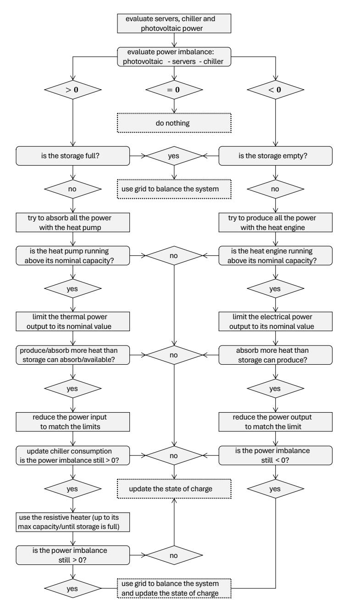

**Fig. 5.3** Power management strategy used to balance the power flows in the system at each hour of the year.

| **117**

#### Cost correlations

To assess the NPV and IRR of each design that will be evaluated, the annual costs Cn and benefits Bn, as well as the capital costs C0, must be defined. Before going into further detail about the correlations used, it is essential to point out that the values reported in the following are extremely subject to uncertainty. The price of components and energy carriers can vary depending on the manufacturers and the market, especially for a technology that is not yet commercially available. Furthermore, the evolution of these prices over time is also uncertain. As a result, average values are adopted for the economic parameters, so as to reflect the reality of the market objectively and to give a more or less realistic order of magnitude for the financial performance of Carnot batteries. But as these prices are subject to change, a parametric analysis will also be proposed to show the impact of a 50% drop in C0 (C 50% 0 ) compared to the case with a full C0 (C 100% 0 ).

In this model, the annual benefit Bn is defined as the difference between the annual cost of electricity when no PV or CB is installed (i.e., the data centre only consumes electricity from the grid) and the annual cost of electricity for the design under test, where some of the electricity is supplied by the PV + CB system (i.e., this cost is lower because less electricity is absorbed from the grid). No subsidies are taken into account. Note that in the present definition of Bn, excess PV generation that is returned to the grid is sold at a zero price. This is a conservative choice, yet it favours the storage of electricity. The average annual electricity prices are modelled considering a linear growth with time as

$$c_{el}(n) = a_{el} \cdot n + b_{el} \quad , \tag{5.9}$$

where ael is the average annual rate of growth of the electricity price, bel is the average annual electricity price when commissioning the PV + CB system and n an integer representing the year under consideration (see Eq. [5.8\)](#page-132-1). The coefficients in Eq. [5.9](#page-134-0) are fitted as a linear extrapolation of the Banb IB electricity prices for nonhouseholds consumers (i.e., 20 MWhel < consumption < 500 MWhel) in Belgium and Spain from 2007 to 2021 from the Eurostat database [\[193\]](#page-265-11). Their respective values can be found in Table [5.3.](#page-135-0)

By fitting the coefficients of Eq. [5.9](#page-134-0) to historical values, the average historical inflation in the price of electricity is extrapolated to the entire lifetime of the system. This model therefore assumes that the price of electricity will continue to rise in the future and uses deterministic values to represent it, as the impact of uncertainty on it is outside the scope of this study. Nevertheless, the results presented in [CP1] showed that this uncertainty has a non-negligible impact on the financial performance of the system, and it therefore deserves further investigation using appropriate methods.

In this model, Cn is represented as a fraction of the total capital costs %C0 and only accounts for maintenance (i.e., no reinvestment costs, no taxes). This simpli-

| Parameter               | Value    | Units                              | Min  | Max  | References                |
|-------------------------|----------|------------------------------------|------|------|---------------------------|
| a el,Belgium | 2.841    | € 2021 /MWh/y           | n/a  | n/a  | [193]                     |
| b el,Belgium | 195.9    | € 2021 /MWh             | n/a  | n/a  | [193]                     |
| a el ,Spain  | 2.078    | € 2021 /MWh/y           | n/a  | n/a  | [193]                     |
| b el,Spain   | 183.8    | € 2021 /MWh             | n/a  | n/a  | [193]                     |
| $C_n$                   | 2.0      | $\%_{\mathrm{C}_0}$                | 1.5  | 3.0  | [104, 105, 111, 125, 183] |
| $CAPEX_{PV}$            | 870      | € 2021 /kW p | 400  | 870  | [194,195]                 |
| $CAPEX_{HP}$            | 430      | $\in_{2021}/kW_{th}$               | 250  | 720  | [125,141,196]             |
| $CAPEX_{RH}$            | 150      | $\in_{2021}/kW_{th}$               | 100  | 150  | [186,195]                 |
| $CAPEX_{TES}$           | Eq. 5.11 | $\in_{2021}/\text{m}^3$            | n/a  | n/a  | [197]                     |
| $CAPEX_{ORC}$           | 2950     | $\in_{2021}/kW_{el}$               | 2125 | 4000 | [111,125,170]             |
| r                       | 7.0      | %                                  | 5.0  | 8.0  | [104, 105, 111, 125, 183] |
| LT                      | 20       | year                               | 20   | 25   | [104, 105, 111, 125, 183] |

**Table 5.3** Correlations for the economic model. Note that in this model, the ratio between the HP and RH costs favours the investment in the HP. The dependency variable for the cost of thermal storage is VTES, the volume of each tank.

fied approach is frequently adopted in the literature as it is difficult to give precise specific maintenance costs for technologies with low readiness levels. In the literature on Carnot batteries,  $\%_{C_0}$  ranges from 1.5% [104,105,111,183] to 3.0% [125]. In this case, it is set to 2% (see Table 5.3).

Different approaches exist to evaluate  $C_0$ . In some works, the costs of all physical components of the CB (e.g., heat exchangers, compressors, ...) are added together [78, 104, 105, 183]. With this approach, engineering and assembly costs are usually ignored. Still, an asset of this method is that it enables to assess the impact of each component on the overall cost of the CB, so that detailed cost breakdowns can be evaluated, for example.

A second approach is to consider only the prices of the CB sub-systems (i.e., HP, RH, TES and ORC), and add them together. This method is certainly more conservative because it considers assembly and engineering costs for each sub-system, whereas these could be reduced if the CB was designed as a whole.

By using the first or second method, the specific costs of Rankine Carnot batteries can vary by more than one order of magnitude, as they range from  $500 \, \text{kW}_{el}$ and 250 \$/kWhel to 8000 \$/kWel and 1000 \$/kWhel [39, 44]. Since the second method is more conservative-although probably simplistic-for analysing the integration of CB into existing energy systems, it seems appropriate at this stage of the technology's development. It is commonly adopted for case study analyses [111,112,125,126,198]. The capital cost of the PV + CB system is defined as

$$C_{0} = P_{PV}^{nom} \cdot CAPEX_{PV} + \dot{Q}_{HP}^{nom} \cdot CAPEX_{HP} + \dot{Q}_{RH}^{nom} \cdot CAPEX_{RH}$$

$$+ 2 \cdot CAPEX_{TES}(V_{TES}) + P_{ORC}^{nom} \cdot CAPEX_{ORC} .$$
(5.10)

The adopted cost correlations are given in Table 5.3, with the associated references.

The storage cost is given by

$${\rm CAPEX_{TES}(V_{TES}) = log(V_{TES}) - 0.002407 \cdot V_{TES}^2 + 791.4 \cdot V_{TES} + 6191} \quad . \tag{5.11}$$

Note that although these investment costs are quite uncertain, they must be assigned fixed values in order to carry out the techno-economic analysis. This is not problematic as such, since parametric analyses on these values make it easy to characterise the sensitivity of the economic performance. On the other hand, the uncertainties on the ratios between the different CAPEX (i.e., relative costs between the sub-systems) are more impacting. Indeed, as these cost correlations will be used in an optimisation model, the obtained designs will be biased by these uncertainties. For example, if the RH is relatively too cheap compared with the HP, it could be preferred despite its lower efficiency. To handle this, methodological innovations based in particular on the principles of robust design optimisation [\[145\]](#page-261-7) are necessary. It should be mentioned, however, that this consideration applies with a variable intensity along the Pareto fronts that will result from the compromise between the technical and economic performance. Indeed, for designs providing the best energy self-sufficiency, the costs uncertainties no longer have any real impact because those designs will be optimised, above all, to provide the best technical performance, to the detriment of the economic performance.

In Table [5.3,](#page-135-0) the cost correlation for HP was obtained by taking the average of the specific prices for commercially available high-temperature heat pumps listed in the [IEA Task 58 fact-sheets.](https://heatpumpingtechnologies.org/annex58/task1/) The cost correlation for the ORC was obtained by taking the average of the specific costs reported by Lemmens et al. [\[199\]](#page-266-4) for lowpower ORC modules. The discount rate of 7% conservatively reflects the values recently selected in other techno-economic analyses on CB [\[104,](#page-258-0) [105,](#page-258-3) [111,](#page-258-7) [125,](#page-259-10) [183\]](#page-265-1).

# 5.3.4 Optimisation problem

As mentioned earlier, the goal in this work is to optimise the design of a PV + CB system to maximise the data centre self-sufficiency ratio

$$SSR = 1 - \frac{E_{grid}^{el}}{E_{servers}^{el} + E_{chiller}^{el}} , \qquad (5.12)$$

where E el grid is the electricity annually supplied by the grid and E el servers and E el chiller are the annual energy consumption of the servers and chiller. Nevertheless, the investment must remain economically attractive, so it is also necessary to optimise the financial performance of the system. Although the NPV relates the expected gains, it says nothing about the rate of return on investment, whereas this is one of the parameters that investors generally look to first and foremost. Moreover, the NPV requires a discount rate to be set, which is specific to the investment strategy, so it is not possible to characterise the project financial performance independently of it. Consequently, the financial criterion maximised in this work will be the IRR, as introduced in the economic model in Section 5.3.3.

To maximise the SSR and IRR, the capacity of the PV + CB system must be adjusted. This includes the nominal power of the PV system, of the HP and RH, the volume of the storage tanks and the nominal power of the ORC. The thermodynamic cycle of the CB can also be adjusted to maximise the SSR or the IRR. Indeed, the *Carnot battery trilemma* indicates that it is not possible to design a CB that maximises both the storage efficiency (the SSR for a given PV capacity) and the energy density (the storage volume), which affects  $C_0$  and thus the IRR. Therefore, in this model, it is also possible to optimise the hot temperature of the thermal storage as well as its spread (i.e., the temperature difference between the two tanks). The optimisation variables and corresponding bounds are shown in Table 5.4. The maximum bound on  $P_{\rm PV}^{\rm nom}$  makes it possible to show the interesting case where, when all the PV capacity is installed, the only option for increasing the SSR is to further increase the storage capacity, as illustrated below.

A novelty of this model compared with other techno-economic studies on CB, is that it simultaneously optimises the cycle and the capacity of the CB. This makes the problem highly non-linear and complex, since some variables have much less impact than others on SSR and IRR. For example,  $\Delta T_{TES}^{sp}$ , which influences the storage efficiency and density, will have to interact with  $V_{TES}$ , but it will have an indirect impact on SSR and IRR. On the other hand,  $P_{ORC}^{nom}$  will have a much more direct impact on these two criteria. Another example of complementary variables is  $\dot{Q}_{HP}^{nom}$  and  $\dot{Q}_{RH}^{nom}$ : the algorithm will have to optimise these simultaneously.

The non-dominated sorting genetic algorithm NSGA-II [144] has been used to handle the multi-criteria optimisation problem. This meta-heuristic algorithm was selected because it performs well in optimising energy systems [158,200,201], and because it comes with the RHEIA framework [145], which is used for the uncertainty analysis (see Section 5.3.5). It should be noted that multi-objective particle swarm optimisation (MOPSO) could also have been used, as its performance is similar to

**Table 5.4** Optimisation variables and associated design space. If the optimiser test a physically inconsistent set of TES temperatures, the design is rejected.

| Optimisation variable      | Symbol                                          | Min | Max  | Units                |
|----------------------------|-------------------------------------------------|-----|------|----------------------|
| PV system peak capacity    | Prom                                            | 0   | 1000 | kWp                  |
| HP nominal capacity        | $\dot{\mathrm{Q}}_{\mathrm{HP}}^{\mathrm{nom}}$ | 0   | n/a  | $kW_{th}$            |
| RH nominal capacity        | $\dot{\mathrm{Q}}_{\mathrm{RH}}^{\mathrm{nom}}$ | 0   | n/a  | $kW_{th}$            |
| ORC nominal capacity       | $P_{ORC}^{nom}$                                 | 0   | n/a  | kW el     |
| Pressurized tanks volume   | $V_{\mathrm{TES}}$                              | 0   | n/a  | $m^3$                |
| Hot storage temperature    | ${ m T_{TES}^{ht}}$                             | 75  | 150  | $^{\circ}\mathrm{C}$ |
| Storage temperature spread | $\Delta { m T}_{ m TES}^{ m sp}$                | 10  | 100  | K                    |

that of NSGA-II in this type of problem [201]. Although the improved strength Pareto evolutionary algorithm (SPEA-2) could also represent an interesting alternative, it was unfortunately not tested here.

For each case study, the population size is set to 60. The crossover probability is 0.9, the mutation probability is 0.1 and the crowding degree is 0.2. There is no limit on the number of generation: the optimisation process is stopped when satisfactory results are obtained.

# 5.3.5 Uncertainty quantification

The integration scenarios tested in this work face techno-economic uncertainties. The economic uncertainties affect the IRR and some of them will be addressed thanks to the parametric study on  $C_0$ . To validate that technical and operational uncertainties do not affect the conclusions drawn about the designs maximising the SSR, they will also be taken into account. These relate to compression and expansion machine efficiencies, heat exchanger pinch-points and time series. The list of uncertainties considered in this model is shown in Table 5.5, together with their associated values.

To assess the impact of these uncertainties on the SSR, they are propagated through the model using Polynomial Chaos Expansion via RHEIA framework [145]. This method constructs a surrogate model based on orthogonal polynomials, requiring only a limited number of actual model evaluations-the number depends on the degree of the polynomials used. It is particularly well-suited to models that are computationally expensive or time-consuming to evaluate. Compared to conventional Monte Carlo simulations—which rely on repeated random sampling to estimate statistical properties-Polynomial Chaos Expansion provides accurate statistical estimates with significantly lower computational cost. Furthermore, it en-

**Table 5.5** List of uncertainties affecting the SSR. Note that the uncertainty on the servers power affects the cooling system accordingly. The ranges for  $\eta_{\rm is,comp}$ ,  $\eta_{\rm is,exp}$ ,  $\eta_{\rm is,pmp}$  and  $\Delta T^{\rm pp}$ cover values that can be encountered in real machines and are used to assess the sensitivity of the SSR to them. The value of  $\Psi^{\rm Carnot}_{\rm chiller}$  is from [141]. Values for  $P^{\rm el}_{\rm servers}$  and  $T_{\rm coolant}$  are from the historical data of the data centre. Values for G and  $T_{\rm ambient}$  are from [158].

| Parameter                        | Symbol                            | Dev. | Units                | Distribution |
|----------------------------------|-----------------------------------|------|----------------------|--------------|
| Compressor isentropic efficiency | $\eta_{\rm is,comp}$              | 0.05 | _                    | Uniform      |
| Expander isentropic efficiency   | $\eta_{\rm is,exp}$               | 0.05 | _                    | Uniform      |
| Feed pump isentropic efficiency  | $\eta_{\rm is,pmp}$               | 0.05 | _                    | Uniform      |
| Pinch point in heat exchangers   | $\Delta \mathrm{T}^{\mathrm{pp}}$ | 1.5  | K                    | Uniform      |
| Carnot efficiency of chiller     | $\Psi_{ m chiller}^{ m Carnot}$   | 0.05 | _                    | Uniform      |
| Servers power                    | Pel servers                    | 5.0  | %                    | Gaussian     |
| Cooling water temperature        | $T_{coolant}$                     | 0.2  | $^{\circ}\mathrm{C}$ | Gaussian     |
| Solar irradiance                 | G                                 | 7.0  | %                    | Gaussian     |
| Ambient temperature              | $T_{ambient}$                     | 1.0  | $^{\circ}\mathrm{C}$ | Gaussian     |

ables direct computation of statistical moments (such as the mean and standard deviation) and Sobol' indices, which are variance-based sensitivity measures. These indices quantify how much each input parameter contributes to the output variance, thus offering insight into the relative importance of uncertain parameters.

# **5.4 Results**

# 5.4.1 Multi-criteria analysis

#### Pareto fronts

The Pareto fronts resulting from the multi-criteria optimisation between the IRR and the SSR are depicted in Fig. [5.4.](#page-139-2) For each of the three scenarios in Louvainla-Neuve and Seville, two lines are plotted: the solid lines represent the case C 100% 0 , and the dashed lines represent the case C 50% 0 (CAPEXPV is unchanged). This parametric analysis illustrates the potential financial gains if the investment costs in the Carnot battery were to fall. It will be further explored below. Regarding the minimum IRR, when this is negative, it means that it is not possible to find a discount rate giving a zero NPV for the allotted lifetime. The discount rate must therefore become negative to obtain a zero NPV.

For the designs achieving higher IRR, the cases C 50% 0 and C 100% 0 offer the same SSR in scenarios A and C (i.e., the curves overlap). It is slightly lower in scenario B, because the zero consumption of the chiller affects the ratio defined in Eq. [5.12.](#page-136-2) In fact, these designs do contain only PV, which has the same CAPEX in both cases. To increase the SSR above 40% in Brussels and above 45% in Seville, storage then gets deployed. Note that the case C 50% 0 deploys storage for slightly lower SSR (approximately 5% less) due to lower investment costs.

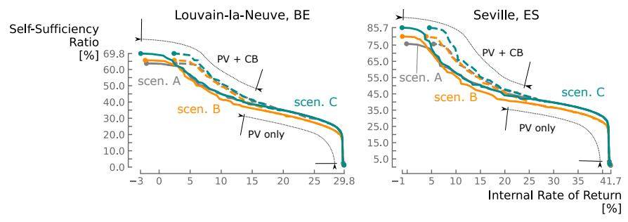

**Fig. 5.4** Pareto fronts resulting from the optimisation between the Internal Rate of Return and the Self-Sufficiency Ratio. In each scenario, the solid curves result from the case C 100% 0 . The dashed curves correspond to the case C 50% 0 .

Seville also offers larger IRR and SSR than Louvain-la-Neuve. This is due to the difference in PV capacity factor, which is almost 50% higher in Seville than in Louvain-la-Neuve (i.e., 22.9% against 15.4%), thanks to the higher solar irradiance.

To better discriminate the performance of the different scenarios and ease their analysis, Fig. [5.5](#page-140-0) shows a zoom on the designs that include storage. These enlarged fronts show that the SSR has an asymptotic relation with decreasing IRR, and that scenario C always outperforms B and A, despite it has no thermal integration– hence, lower storage efficiency. They also show that, for a given SSR, C 50% 0 provide greaterIRR than C 100% 0 , as expected. These findings are discussed in the following.

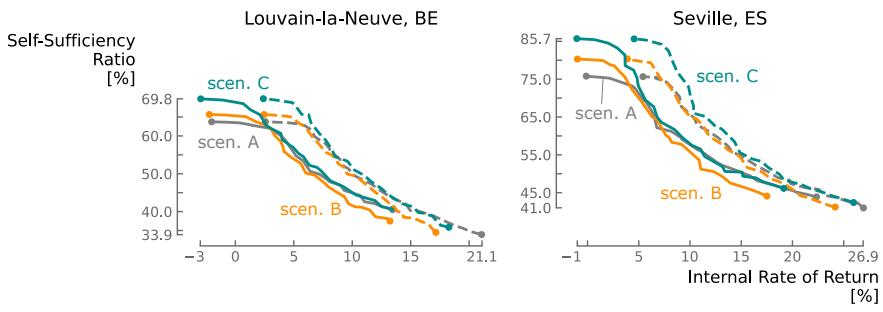

**Fig. 5.5** Zoom on Pareto fronts where the designs include storage. The higher the SSR, the more the reduction in the Carnot battery CAPEX enables the IRR to be increased (i.e., the horizontal distance between the solid and dashed curves increases with the SSR).

#### Asymptotic fronts: a matter of installed capacity

When reaching higher SSR, the fronts take an asymptotic profile with decreasing IRR (see Fig. [5.5\)](#page-140-0). As illustrated in Fig. [5.6,](#page-141-0) this is because after the maximum PV capacity is installed with the associated optimum storage capacity (i.e., about 1000 kWhel in Louvain-la-Neuve and 1500 kWhel in Seville), the last percentages in SSR are gained at the cost of an oversized storage (in terms of financial gains), which ultimately leads to exponentially increasing costs. This exponential growth in storage capacity also indicates that the system shifts from overnight storage to longer-term storage. Note that, as with the PV capacity factor, the optimum storage capacity is 50% higher in Seville than in Louvain-la-Neuve. This perfectly illustrates the direct relationship between these two design variables.

As mentioned earlier, the designs leading to highest IRR do not include storage but only PV. However, both in Louvain-la-Neuve and Seville, once the optimum standalone PV capacity is installed (i.e., about 500 kWp in Louvain-la-Neuve and 400 kWp in Seville), the increase in SSR goes along with a simultaneous increase in CB and PV capacities. This means that, for the considered CB and PV capital costs, the most cost effective solution to increase the SSR is to include storage. Of course,

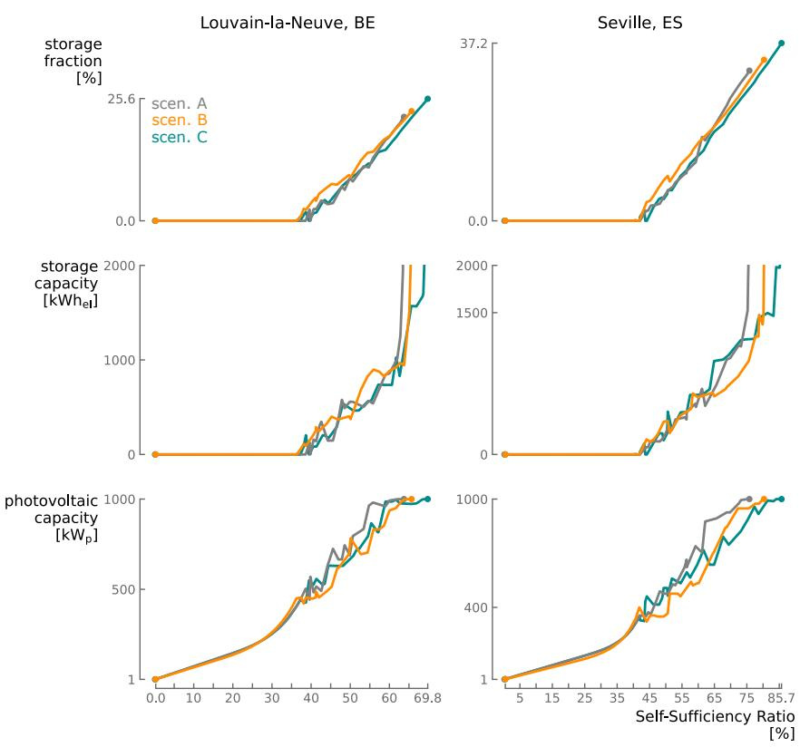

**Fig. 5.6** Relationship of PV and storage capacities with the SSR. The storage fraction shows the share of electricity annually supplied to the data centre directly from the CB. Note that the storage capacity is truncated at  $2000~\rm kWh_{el}$  for the sake of clarity, but may be higher locally. The results for the case  $C_0^{50\%}$  are not represented for the sake of clarity, but they are very similar since only the technical aspects influence the SSR. The only difference is that storage gets deployed starting from lower SSR since the costs are lower.

these results are specific to the economic model utilised here: if PV was cheaper, the most economically profitable solution would include less storage to increase the SSR (up to the maximum PV capacity). Conversely, in the case  $C_0^{50\%}$ , storage is installed starting from lower SSR (not represented in Fig. 5.6 for the sake of clarity, but well visible in Fig. 5.5).

Fig. 5.6 also depicts the 'storage fraction', the fraction of energy annually supplied to the data centre that was actually released by the Carnot battery. Its maximum value is 25.6% in Louvain-la-Neuve and 37.2% in Seville (which is also 50% higher). As the PV capacity increases, the storage fraction always has a linear relationship with the SSR, and also with the storage capacity. When the maximum PV capacity is installed, the storage capacity has an exponential relationship with the storage fraction (i.e., marginal gain).

Finally note that the curves are much smoother when only PV is installed, but they get noisier as storage is deployed. This illustrates well the complexity of this optimisation problem: different designs can lead to very similar performance in terms of IRR and SSR, and convergence is therefore difficult, as explained in the optimisation problem (see Section 5.3.4).

#### Maximum self-sufficiency ratio: a matter of resistive heater

As seen in Fig. 5.5, when the SSR is maximised, scenario C provides the best performance, ahead of scenario B, which itself dominates scenario A. The difference in maximum SSR between scenarios C and A is about 6% in Louvain-la-Neuve and 10% in Seville. This result, which may seem counter-intuitive since scenario B theoretically achieves the best storage efficiency (i.e., the average heat source temperature is highest in scenario B and lowest in C), can be explained by the design of the charging and discharging systems.

For a given PV capacity, one way of increasing the SSR is to increase the storage efficiency and the capacity of the charging system, as illustrated in Fig. 5.7. In this context, using a HP gives a higher COPCB than using a RH. However, in scenarios A and B, the amount of thermal power available at the source is limited by the operations of the servers. Since the HP thermal output is the sum of the power from the heat source and the electricity driving the compressor, when COPHP increases while keeping a constant thermal power from the source, the thermal output decreases. Consequently, the amount of thermal power that can be produced by the HP is also constrained, and this is all the more true when the COPCB is high (i.e., scenario B is even more constrained than scenario A). Therefore, to charge more energy into the storage, a 'booster', which is not constrained by the waste heat availability, must be added. In this case, the RH can be used at the cost of a reduced COPCB. It is clear that there is a trade-off to find between the charging capacity and COPCB.

Scenario C, however, does not fall into this dilemma. As its heat source is ambient air, it is not constrained and can afford to use only a HP as charging system. Consequently, the best COPCB is obtained in scenario C. Next comes scenario B, which benefits from 60°C source, and finally scenario A, whose source is at 24°C. This reasoning is illustrated in Fig. 5.7, which shows the thermal capacity of the charging system, the ratio between the thermal capacities of the HP and the RH, and the COP of the charging system.

Both in Seville and Louvain-la-Neuve, when the SSR is high, COPCB for scenarios A and B are very close to each other. The reason why  $SSR_{B}^{max} > SSR_{A}^{max}$  is actually that in scenario B the chiller consumption is always zero, leaving more energy for storage and therefore increasing the SSR. Also note that scenario B, which initially benefits from a large  ${
m COP}_{
m CB}$ , is the only one that is constrained to reduce it in order to increase the thermal power of the charging system. However, that this result must only be analysed qualitatively, as it is specific to the cost correlations

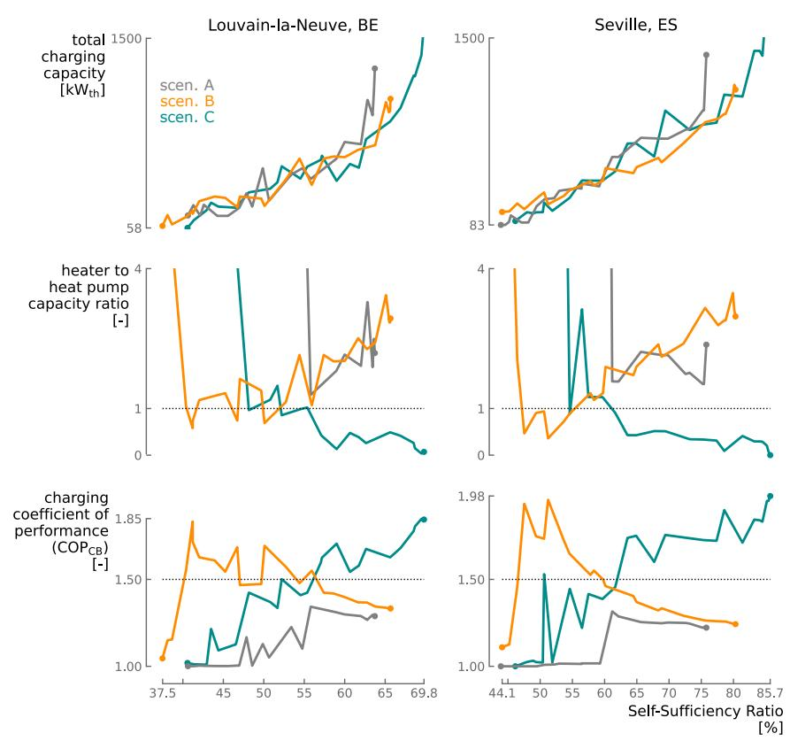

**Fig. 5.7** Performance of the charging system in the different scenarios. Note that the heater to heat pump capacity ratio is only shown up to 4 for the sake of clarity, but locally reaches higher values. In scenario C, COPCB is higher in Seville than Louvain-la-Neuve thanks to the higher ambient temperature. For low SSR, the heater is still used in scenarios A and C, and is therefore the best techno-economic trade-off.

used in this model, which are in favour of the HP (i.e., CAPEXRH is relatively high compared to CAPEXHP that is rather low).

This analysis of the charging system of the thermally integrated Carnot battery shows that its capacity needs to be increased to store more energy and make the system more relevant (i.e., a sufficient fraction of the energy consumed should come from storage to justify the investment). To illustrate that, this school case uses an resistive heater, which greatly affects COPCB. Therefore, new hybrid charging systems, such as dual heat source HP, should be investigated for Carnot batteries.

Synergies between booster, storage efficiency and storage density

To increase the SSR when the maximum PV capacity is installed, the CB efficiency and capacity must increase. However, as just illustrated, when increasing the storage and charging capacities, the use of a booster causes COPCB to fall in scenario B, and prevents it from sufficiently rising in scenario A. Therefore, to increase the CB efficiency, the efficiency of the discharge cycle must increase.

Since the storage temperature is always maximised (i.e., 150◦C), the last lever to increase the efficiency of the ORC is to reduce the storage temperature spread (refer to Part [I\)](#page-45-0). This consequently reduces the storage density. However, as explained earlier, to increase the SSR, larger storage capacities are needed. This consideration leads inexorably to an exponential growth in the necessary storage volume, which greatly affects the system cost. This is illustrated in Fig. [5.8.](#page-144-0) Note that scenario C is not subject to this: as its COPCB only increases with rising SSR, it is not forced to simultaneously increase the ORC efficiency, which means that the storage spread– hence density–can remain constant. It should also be pointed out that the ORC efficiency is lower in Seville because the ambient temperature is higher there.

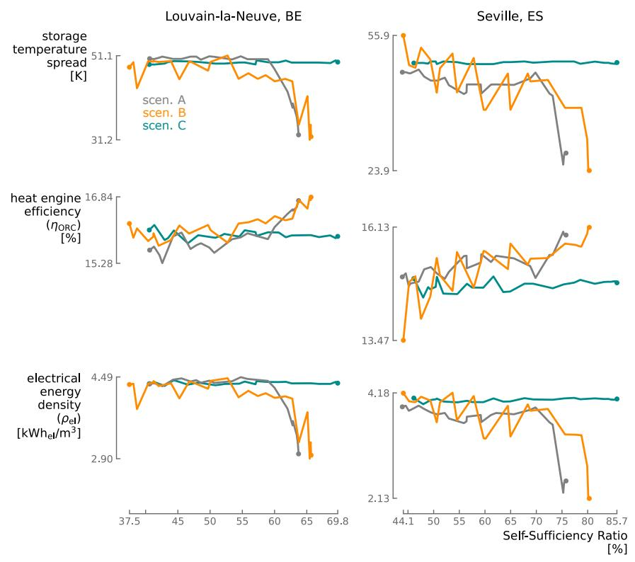

**Fig. 5.8** Performance of the storage and discharging system. In scenarios B and C, the impact of varying storage temperature spreads is readily apparent in both the *η*ORC and *ρ*el. Stronger fluctuations for scenario B in Seville are attributed to a lower level of convergence.

Waste heat recovery and reduction of chiller consumption

When integrating CB in data centres, the aim is to simultaneously recover the waste heat and to reduce the electricity consumption linked to the cold production, necessary to evacuate it. Fig. [5.9](#page-145-0) illustrates the CB performance with regard to these issues. The chiller consumption can be reduced by more than 50% in scenario A, what is equivalent to reductions of –3.9% (Louvain-la-Neuve) and –7.4% (Seville) in the total electricity consumption of the data centre.

At best, the fraction of recovered waste heat, which is defined as the ratio between the annual heat pump waste heat consumption and the annual total waste heat generation, does not exceed 40%. This is obviously constrained by the charging duration and availability of PV power, which is already relatively abundant compared with the consumption of the data centre (i.e., there is a ratio of about 2.2 between the PV energy annually produced and that consumed by the servers in Seville). To improve this recovery fraction, the charging period could be extended. This could be done by positioning the PV panels in different orientations in order to spread out the production peak. However, a fraction of 100% is not conceivable, as it would mean that the CB is constantly charging. If charging and discharging times of 12 hours were considered, a maximum waste heat recovery fraction of 50% could be expected. At the same time, waste heat could also be recovered during discharge. Some studies have shown that it could be used to preheat the

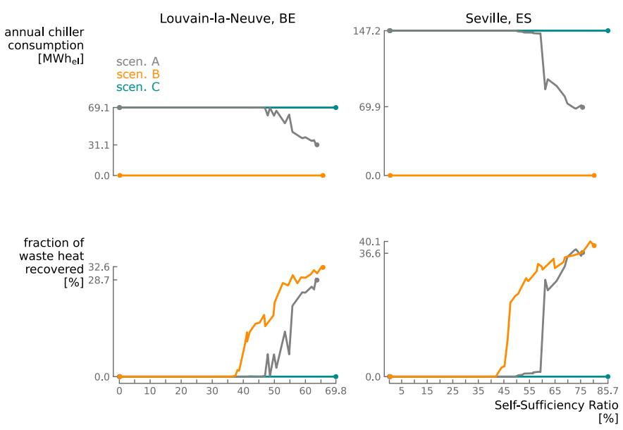

**Fig. 5.9** Chiller consumption and waste heat recovery in the different scenarios. In best cases, reducing the chiller consumption thanks to CB can reduce the data centre electricity consumption by 3.9% in Louvain-la-Neuve and 7.4% in Seville.

liquid fluid leaving the feed pump in the ORC [136, 202]. Yet, due to temperature compatibility, this seems only feasible in scenario B.

#### Discounted payback period and net present value

The net present value (NPV) and discounted payback period (DPP) are depicted for  $C_0^{100\%}$  and  $C_0^{50\%}$  in Fig. 5.10. First, for designs including only PV, the DPP remains almost constant as the SSR increases. This trend corresponds to the vertical part of the front in Fig. 5.4. At the same time, the NPV increases. Then, while storage gets deployed and as the SSR increases, the DPP starts to increase exponentially. For the last percentages of SSR, it even goes beyond the lifetime of the system. In other words, when all the PV capacity is installed, the last few percents in SSR cause an exponential fall in NPV.

Second, the NPV makes a bell shape with the SSR. This illustrates that designs with and without storage can give rise to the same financial gains, while those with storage achieve much higher SSR. The profitability threshold (i.e., NPV > 0) corresponds to SSR <50% in Louvain-la-Neuve and SSR <60% in Seville, as well as to power specific costs  $C_{CB}^{power}>6500$   $\in$ /kW $_{el}$ . The downside is that designs that include storage require longer payback periods. Assuming that grid electricity has a non-zero carbon-intensity, a parallel can be drawn between self-sufficiency ratio and decarbonation. The message that then emerges from Fig. 5.10 is that an

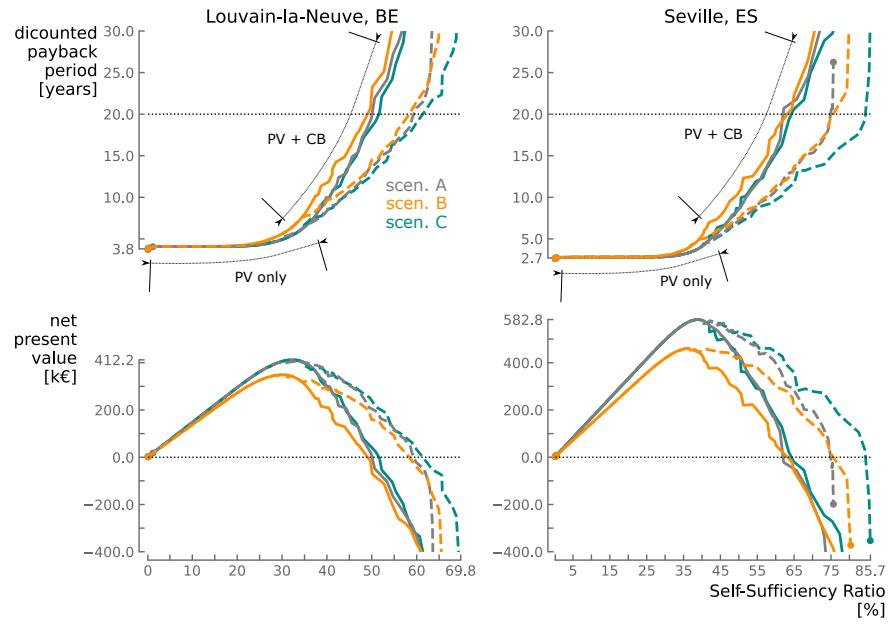

**Fig. 5.10** Net present value and payback period of the different designs for  $C_0^{100\%}$  and  $C_0^{50\%}$ . The profitability threshold (i.e., NPV > 0) corresponds to SSR < 50% in Louvain-la-Neuve and SSR < 60% in Seville, as well as to power specific costs  $C_{CB}^{power}$  > 6500 €/kWel.

investment strategy aimed at maximising the rate of return on investment does not achieve effective decarbonation, whereas a strategy that tolerates a lower rate of return offers greater decarbonation while offering the exact same financial gains.

A final observation shows that, for an equivalent SSR, case  $C_0^{50\%}$  gives rise to DPP up to twice as short as case  $C_0^{100\%}$ , and that this difference increases as the SSR increases. This is perfectly logical since, as illustrated in Fig. 5.6, the fraction of the electricity supplied by the CB to the data centre gets higher as the SSR increases, so the effect of a cost reduction is higher.

# 5.4.2 Detailed designs analysis

For each scenario of case  $C_0^{100\%}$ , one design from the Pareto front is analysed in greater depth to characterise its key performance indicators (KPI) and clarify its role in the energy system. The six designs selected are those for which the maximum PV capacity is installed with the associated financially optimal CB capacity (see Section 5.4.1 for more details). Technical indicators are reported in Table 5.6 while economic indicators are reported in Table 5.7.

**Table 5.6** Technical KPIs for the designs with maximum PV capacity and financially optimum CB capacity. fracHP, fracCB and fracwhr are respectively the fractions of thermal energy charged by the HP into the TES (i.e., 1 – fracHP = fracRH), of electricity supplied to the data centre by the CB and of waste heat that is recovered.

| Location                                        |                      | Louvain-la-Neuve |      | Seville |      |      |      |
|-------------------------------------------------|----------------------|------------------|------|---------|------|------|------|
| Scenario                                        |                      | A                | В    | C       | A    | В    | C    |
| Prom                                            | $kW_p$               | 999              | 1000 | 999     | 994  | 974  | 1000 |
| $\dot{\mathrm{Q}}_{\mathrm{HP}}^{\mathrm{hom}}$ | $\mathrm{kW_{th}}$   | 238              | 229  | 964     | 294  | 238  | 1084 |
| $\dot{\mathrm{Q}}_{\mathrm{RH}}^{\mathrm{nom}}$ | $\mathrm{kW_{th}}$   | 456              | 786  | 252     | 519  | 689  | 319  |
| $P_{ORC}^{nom}$                                 | $\mathrm{kW_{el}}$   | 105              | 115  | 130     | 110  | 114  | 125  |
| $V_{\mathrm{TFS}}$                              | $\rm m^3/tank$       | 131              | 200  | 192     | 160  | 220  | 244  |
| $T_{mpg}^{ht}$                                  | $^{\circ}\mathrm{C}$ | 150              | 150  | 150     | 150  | 150  | 150  |
| $\Delta T_{TES}^{sp}$                           | K                    | 42.6             | 41.5 | 49.4    | 41.6 | 38.8 | 49.4 |
| SSR                                             | %                    | 62.0             | 65.1 | 68.5    | 73.2 | 78.8 | 84.1 |
| $COP_{HP}$                                      | _                    | 1.76             | 2.55 | 1.84    | 1.75 | 2.49 | 1.97 |
| $COP_{CB}$                                      | _                    | 1.29             | 1.34 | 1.78    | 1.25 | 1.26 | 1.84 |
| $\eta_{ m ORC}$                                 | %                    | 16.4             | 16.6 | 15.9    | 15.5 | 15.7 | 14.8 |
| $\eta_{\mathrm{P2P}}$                           | %                    | 21.2             | 22.1 | 28.3    | 19.3 | 19.7 | 27.3 |
| $	au_{ m ch}$                                   | h                    | 8.9              | 9.0  | 8.6     | 9.1  | 10.2 | 9.5  |
| $	au_{ m disch}$                                | h                    | 9.7              | 13.2 | 12.9    | 10.4 | 13.0 | 15.8 |
| $CF_{HP}$                                       | %                    | 27.8             | 25.0 | 16.7    | 32.3 | 30.0 | 24.4 |
| $CF_{RH}$                                       | %                    | 13.5             | 10.3 | 2.6     | 21.4 | 20.2 | 6.4  |
| $CF_{ORC}$                                      | %                    | 20.1             | 19.9 | 20.6    | 29.1 | 29.0 | 33.8 |
| $frac_{HP}$                                     | %                    | 51.8             | 41.4 | 96.0    | 46.0 | 34.3 | 92.8 |
| ${\rm frac_{CB}}$                               | %                    | 19.8             | 22.4 | 24.3    | 29.0 | 32.3 | 35.6 |
| $\mathrm{frac_{whr}}$                           | %                    | 26.7             | 32.4 | 0.0     | 37.8 | 40.1 | 0.0  |

#### Technical analysis

Although COPHP is maximum in scenario B, COPCB is maximum in scenario C. Consequently,  $\eta_{P2P}$  is always better in scenario C, even though  $\eta_{ORC}$  is worse because of the higher storage temperature spread. This explains why scenario C has the best SSR for the same PV capacity. It should also be noted that  $\eta_{P2P}$  is very similar in scenarios A and B. Scenario B has a better SSR thanks to the lower data centre electricity consumption (i.e., the chiller is not used). Finally,  $\eta_{ORC}$  and  $\eta_{P2P}$  are higher in Louvain-la-Neuve than in Seville because the ambient temperature is lower there (i.e., greater temperature difference between the hot and cold reservoirs of the CB, see Part I).

The nominal charge time is always shorter than the discharge time. Moreover, this charging time is longer in Seville than in Louvain-la-Neuve. This is essentially due to the sunshine duration, which is longer in the south. As far as discharge time is concerned, this is higher than ten hours so as to maximise the ORC capacity factor, as this component has a high specific cost. This is in agreement with the results of Tassenoy et al. [111]. Given the high specific costs of the HP and ORC and the relatively low TES cost, maximising charge and discharge times (and thus capacity factors) helps minimise the CB power and energy specific costs. Finally, capacity factors are higher in Seville than in Louvain-la-Neuve, thanks to the greater availability of photovoltaic energy.

Finally, frac $_{HP}$ , the fraction of stored heat coming from the HP, is slightly higher in Louvain-la-Neuve than in Seville. This is again explained by the availability of photovoltaic energy: the resistive heater is less used in Louvain-la-Neuve because less electricity is available. The proof is that  $CF_{RH}$  is always lower in Louvain-la-Neuve than in Seville. Also,  $frac_{HP}$  is lower in scenario B than in scenario A. This is because  $COP_{HP}$  is better in B than in A, and that, consequently, for the same quantity of electricity, less heat can be produced by the HP in scenario B.

**Table 5.7** Economic KPIs for the designs with maximum PV capacity and financially optimum CB capacity.  $C_{power}^{CB}$  and  $C_{energy}^{CB}$  are the power and energy specific costs of the Carnot battery. The different frac represent the cost breakdown of the total investment cost  $C_0^{PV+CB}$  between the different sub-systems.

| Location                        |                                | Louvain-la-Neuve Seville |       |       |       |       |       |
|---------------------------------|--------------------------------|--------------------------|-------|-------|-------|-------|-------|
| Scenario                        |                                | Α                        | В     | С     | A     | В     | С     |
| IRR                             | %                              | 2.95                     | 0.88  | 0.68  | 4.35  | 2.21  | 2.34  |
| $C_0^{PV+CB}$                   | M€ 2021             | 1.568                    | 1.755 | 2.022 | 1.659 | 1.748 | 2.152 |
| $\mathrm{frac}_{\mathrm{PV}}$   | %                              | 55.4                     | 49.6  | 43.0  | 52.2  | 48.5  | 40.4  |
| ${ m frac_{HP}}$                | %                              | 6.5                      | 5.6   | 20.5  | 7.6   | 5.8   | 21.7  |
| ${ m frac_{RH}}$                | %                              | 4.4                      | 6.7   | 1.9   | 4.7   | 5.9   | 2.2   |
| ${\rm frac_{TES}}$              | %                              | 14.0                     | 18.7  | 15.7  | 16.0  | 20.6  | 18.5  |
| $\mathrm{frac}_{\mathrm{ORC}}$  | %                              | 19.7                     | 19.4  | 19.0  | 19.5  | 19.2  | 17.2  |
| $C_{CB}^{power}$                | €2021/kWel                     | 6675                     | 7679  | 8863  | 7243  | 7925  | 10235 |
| $C_{\mathrm{CB}}^{\mathrm{CB}}$ | $\in_{2021}/\mathrm{kWh_{el}}$ | 690                      | 582   | 688   | 694   | 610   | 646   |

#### Financial analysis

The economic analysis reveals that, for same scenarios, the costs distribution between the different sub-systems is very similar in Louvain-la-Neuve and Seville. This shows that, when the aim is to maximise the SSR and the IRR, the optimal breakdown of investment costs is, a priori, independent from the regional conditions (i.e., climate, electricity price).

As for the resulting power and energy specific costs, these seem closer to the upper bounds anticipated in the literature. As a reminder, these range from 500 to 8000 \$/kWel and from 250 to 1000 \$/kWhel [\[39,](#page-252-10) [44\]](#page-252-5). Consequently, the economic model used here makes it possible to give sufficiently conservative values. These specific costs are relatively high compared to other storage technologies (e.g., Liion is currently < 150 e2021/kWh [\[203\]](#page-266-8)). However, it is difficult to attribute the cause to a single component of CB. Indeed, when the designs include a large HP (i.e., scenario C), the costs seem to be distributed more or less equally between the HP, the TES and the ORC. Note, however, that the contribution of the TES seems to be slightly lower. Therefore, considering these specific costs and those of the literature, the case C 50% 0 seems quite reasonable. Also, due to its greater use of HP instead of RH, scenario C always gives rise to higher power specific costs and higher investment costs.

#### Uncertainty analysis

An uncertainty analysis is also conducted on the SSR. The idea is to verify that the technical and operational uncertainties do not affect the conclusions drawn here above. The uncertainties listed in Table [5.5](#page-138-1) have been propagated through the designs discussed in Section [5.4.2.](#page-147-0) As introduced in Section [5.3.5,](#page-138-0) this was carried out using Polynomial Chaos Expansion. First-order polynomials were used to construct the surrogate model. For all six cases considered, the Leave-One-Out error–a measure of the average error of the surrogate model compared to the actual model– was consistently below 1.5%, which is sufficiently low [\[145\]](#page-261-7). The impact of these uncertainties on the SSR is illustrated in Fig. [5.11](#page-150-1) as a 95% confidence interval. Although the standard deviations have slightly different amplitudes, these uncertainties affect the SSR in a similar way: scenario C continues to perform better than B, and the latter better than A.

The observation that emerges from Fig. [5.11](#page-150-1) is that, on average, the higher the SSR, the greater the uncertainty about it. This is because the higher the SSR, the more the energy system is subject to externalities (e.g., photovoltaic production). To verify this and to understand precisely what parameters affect the SSR, the dominant Sobol indices are reported in Table [5.8.](#page-150-2) These represent the contribution of the considered parameter to the variance of the SSR. The SSR is most sensitive to the solar irradiance, closely followed by the servers consumption. The technical parameters of the CB only come in third place and have much lower magnitudes. This illustrates that the precision of the thermodynamic model used here is proba-

#### **5** Waste heat recovery in data centres with photovoltaics

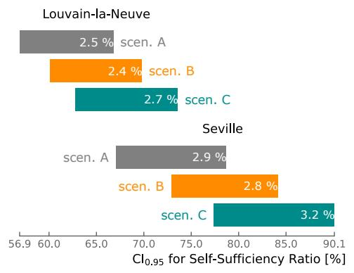

**Fig. 5.11** 95% confidence interval for the SSR when propagating the uncertainties reported in Table 5.5. The values within the bars correspond to the standard deviations.

bly sufficient with regard to the objectives of this techno-economic study. Another observation is that Louvain-la-Neuve is more sensitive to the solar irradiance than Seville. This is most likely due to its lower abundance there.

**Table 5.8** Sobol indices of the uncertain parameters having the most significant influence on the variance of SSR. The uncertainty over SSR is clearly driven by the uncertainty over photovoltaic production and second to the servers consumption.

| Location      | Louvain-la-Neuve    |                                  | Seville                          |                            |                                   |                                   |
|---------------|---------------------|----------------------------------|----------------------------------|----------------------------|-----------------------------------|-----------------------------------|
| Scenario      | A                   | В                                | C                                | A                          | В                                 | C                                 |
| 1st parameter | G                   | G                                | G                                | G                          | G                                 | G                                 |
| Sobol index   | 46.7%               | 58.5%                            | 54.3%                            | 40.7%                      | 52.9%                             | 42.6%                             |
| 2nd parameter | Pel servers      | $P_{\text{servers}}^{\text{el}}$ | $P_{\text{servers}}^{\text{el}}$ | P el servers | $P_{\text{servers}}^{\text{el}}$  | $P_{\text{servers}}^{\text{el}}$  |
| Sobol index   | 39.0%               | 31.7%                            | 35.2%                            | 34.1%                      | 32.9%                             | 40.6%                             |
| 3rd parameter | $\eta_{\rm is,exp}$ | $\eta_{\rm is,exp}$              | $\eta_{\rm is,exp}$              | $\eta_{\rm is,exp}$        | $\Delta \mathrm{T}_{\mathtt{pp}}$ | $\Delta \mathrm{T}_{\mathtt{pp}}$ |
| Sobol index   | 6.0%                | 6.1%                             | 4.5%                             | 10.5%                      | 8.8%                              | 6.2%                              |

# **Summary and discussions**

This chapter looked at the techno-economic potential of Carnot batteries integrated into data centres and coupled to photovoltaic systems. The motivation was to recover the waste heat and to reduce the cooling consumption. For different types of data centres and of thermal integration, and considering two sets of climatic conditions, multi-criteria optimisation was carried out to maximise the energy self-sufficiency and the internal rate of return on investment. Time series from a real data centre were used for the annual simulations. The optimisation variables concerned both the capacity of the PV + CB system, and the thermodynamic cycle

5.5

of the CB. A parametric analysis also assessed the effect of halving the CB capital cost. Designs leading to high SSR were finally analysed in greater details.

# 5.5.1 Main results

Results showed that despite its low efficiency (i.e., < 30%) and high investment costs (i.e., > 6500 e/kWel, > 580 e/kWhel), Carnot batteries are necessary for increasing the SSR above 40% in Brussels and above 45% in Seville. Below this level, PV alone is preferable. This threshold is close to the maximum SSR obtainable with PV alone, but remains specific to the considered cost correlations. Hence, it may vary according to the chosen costs: halving the CB cost (i.e., C 50% 0 ) for instance reduces it by approximately 5%. Also note that, although the storage efficiency is lower in Seville than in Louvain-la-Neuve, the CB + PV system is more profitable there, thanks to the higher solar irradiance (i.e., 50% more). Once the maximum PV capacity is installed (i.e., 1000 kWp), the SSR can only be marginally increased. This is done by increasing the storage capacity above its economically optimal value. The nominal discharge time is then increased from a daily value (i.e., approximately 12h) to a higher value, which exponentially increases the costs.

Regarding the heat source of the Carnot battery, when at low temperature (i.e., scenarios A and C), it is financially more attractive to use resistive heating to charge the system. On the other hand, when the aim is to maximise the SSR, the use of a heat pump becomes necessary to increase the efficiency of the Carnot battery. However, when the amount of thermal energy available at the source is limited (e.g., scenario A), the use of a booster is essential to increase the charging capacity. Yet, using this booster reduces the charging COP. There is therefore a dilemma between efficiency and charging capacity. When the heat source is at a higher temperature (i.e., scenario B), the heat pump is the most financially attractive option. But when aim is to increase the SSR, the capacity-efficiency dilemma remains.

It is also worth noting that the ratio between the amount of electricity required and the amount of waste heat available is not the most favourable in the case of data centres. Industrial applications that include waste heat from other sources (e.g., fuel combustion) should be more favourable, as more heat would be available.

From a strictly techno-economic point of view, chemical batteries would perform better than CB, thanks to their much higher efficiency (usually > 90%) and lower cost. However, a more relevant comparison between these two technologies would be the environmental impact, given that the Carnot battery is, in principle, more sparing of rare materials. This point deserves more in-depth LCA studies and will be addressed in Part [III.](#page-187-0)

# 5.5.2 Perspectives

Considering the observations made in this chapter, future works should further investigate the capacity-efficiency dilemma, which is defined as the conflict between the thermal capacity and the COP in thermally integrated heat pumps. This dilemma was introduced here with the case of Carnot batteries, but could also be encountered in other applications, such as high temperature heat pumps for process integration. Resistive heating was considered here as a thermal booster. However, more efficient configurations must be studied to alleviate the intensity of this dilemma. Dual heat source heat pumps (e.g., dual evaporators) are an option that should be explored [\[204](#page-266-9)[–206\]](#page-266-10).

Also, the fraction of waste heat recovered by the HP does not exceed 40% at best. To increase this, the charging period must be increased. At the same time, waste heat could also be recovered during discharge to preheat the liquid in the ORC. Yet, due to temperature compatibility, this seems only feasible in scenario B.

Conservative technological parameters were used in this work. However, there is still room for improvement. In addition to dual heat source HP and pre-heated ORC, there are margins for efficiency gains, and these should be considered in future works. For instance, using internal recuperation in HP could improve its COP. The isentropic efficiency of the compression and expansion machines could be increased, using turbomachines. The constraints on the flexibility and part load operations should then be considered. Also, to reduce compression ratios, multi-stage or cascaded cycles could be considered. Fig. [5.12](#page-153-0) proposes an improved Carnot battery architecture, with different options for low grade heat recovery.

It has also been shown that halving the investment costs in the CB can halve the payback period for an equivalent SSR. Reducing the capital costs should therefore be a priority for future works in this field, so as to enable the technology to be deployed. A way of achieving that could be the integrated conception of the HP, TES and ORC as a CB (i.e., as opposed to simply juxtaposing them), for example by designing invertible HP/ORC systems. The use of thermal storage in a single stratified tank is also an option to reduce these costs, although it may cause efficiency degradation. Non-pressurised storage is another option.

In this model, only shifting the PV production is considered as a business case for the CB. However, considering its relatively poor financial performance, it seems essential to find additional revenue streams. The potential for energy arbitrage could, for instance, be assessed with optimal power flow models (adopted in Chapter [6\)](#page-155-0). The added value of grid services could also be considered, after a characterisation of the dynamic performance. Note that the impact of non-zero feed-in tariffs should also be assessed (Tassenoy et al. [\[111\]](#page-258-7) and Poletto et al. [\[112\]](#page-258-8) showed that it could kill the financial viability). A capacity remuneration mechanism could also be considered.

As a final remark, it would be appropriate to confirm the results obtained in this

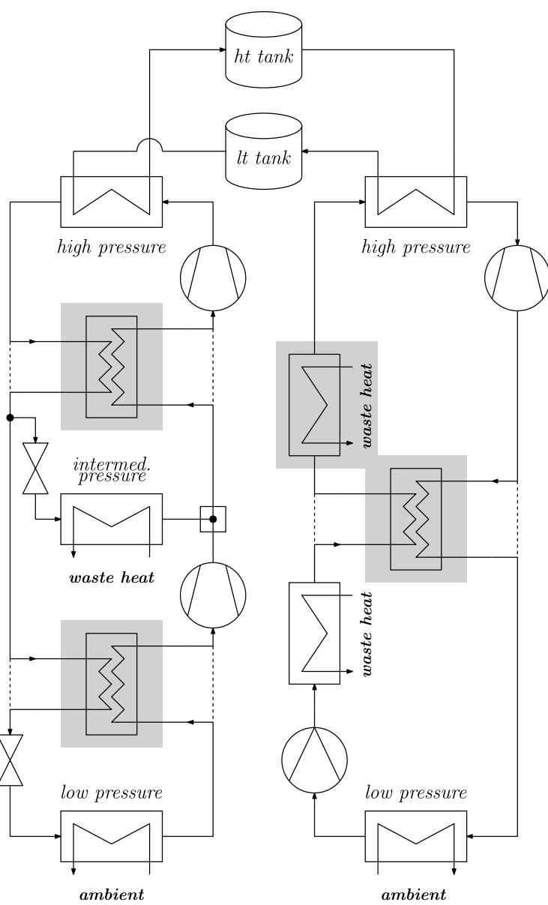

**Fig. 5.12** Improved Carnot battery architecture for low grade heat recovery. The use of internal recuperators is optional and deserves investigation (compatibility with temperature levels, performance gain, etc.). Also note that the preheater position (i.e., before and/or after recuperator) in ORC must be selected according to the temperature levels.

| **137**

# **5** | Waste heat recovery in data centres with photovoltaics

work by using more precise operational models to evaluate the performance of the Carnot battery. Considering off-design and part-load operations seems essential to capture efficiency degradations, as well as taking into account the impact of transients (e.g., activation energy for cold starts).

# **5.6 Key messages**

- Assuming conservative investment costs and zero feed-in tariffs, thermally integrated Carnot batteries present a financially viable solution to enhance the energy self-sufficiency of photovoltaic-powered data centres.
- The charging system faces a capacity-efficiency dilemma: the amount of energy stored cannot be increased without degrading efficiency. It has even been demonstrated that thermal integration was not always beneficial due to limited waste heat availability.
- To increase techno-economic performance, storage efficiency must increase, investment costs must decrease and new sources of revenue must be identified (e.g. energy arbitrage, grid services, capacity remuneration, etc.).
- Options to increase the storage efficiency include double heat source heat pumps, the use of internal recuperators, and the recovery of waste heat during discharge to preheat the liquid in the organic Rankine cycle.
- Ways of reducing investment costs include the use of invertible machines for charging and discharging, and the use of non-pressurised storage requiring less resistant materials.

# **Integrated residential heat and power management**

C ARNOT batteries enable various forms of coupling with heat. The use of lowgrade heat sources to improve the coefficient of performance (COP) of the heat pump is for instance well documented. Chapter [5](#page-121-0) has, in fact, explored the recovery of waste heat from a data centre. An alternative coupling is the combined production and storage of heat and power (CHP), which can find applications in industry and in the tertiary sector. The residential case is particularly interesting due to the mismatch between photovoltaic production–peaking around midday and being higher in summer–and heat and power demands–concentrated during morning and evening peaks and higher during the cold season. The study of this case is, however, more complex due to the operational choices that need be made. For example, when is it preferable to discharge heat or power? This makes rulebased power management strategies unsuitable. In response, this chapter explores the following research question:

> *How should Carnot batteries be optimally sized and operated for integrated heat and power management in residential applications?*

To this end, Section [6.1](#page-156-0) first introduces the need to optimise energy flows for integrated heat and power management. Section [6.2](#page-157-0) then describes the case study of this chapter, which consists in a housing development fed by a district heating network and photovoltaic panels. Section [6.3](#page-160-0) then describes the economic model considered, as well as the linear model used to optimise the design and operations of the system. The results are presented in Section [6.4:](#page-169-0) optimal designs for

# **6** | Integrated residential heat and power management

different investment costs, seasonal and daily operations, the impact of electricity pricing models, and sensitivity to uncertainties. Two locations, Pisa and Brussels, are also compared to evaluate the impact of climatic conditions. Section [6.5](#page-182-0) synthesises and discusses the main results, and provides perspectives for future work. The key messages are listed in Section [6.6.](#page-186-0) The present chapter is adapted from a publication in *Energy Conversion and Management* [JP4].

# **6.1 Need for optimised operations to increase profitability**

For residential energy systems, studies have shown that installing photovoltaic (PV) systems coupled with heat pumps (HP) and thermal energy storage (TES) is an effective way of reducing greenhouse gas emissions, while reducing energy bills and increasing resilience against market prices fluctuations [\[200,](#page-266-5) [207](#page-267-0)[–209\]](#page-267-1). Moreover, as the demand for heat decreases during the warm season, electricity storage can also be installed to increase self-consumption and limit curtailment [\[200,](#page-266-5) [207–](#page-267-0) [209\]](#page-267-1). From this perspective, connecting a heat engine (HE) to the thermal storage could prove very useful [\[36,](#page-252-8) [120,](#page-259-5) [125\]](#page-259-10). The question is under what conditions (investment costs, electricity pricing system, etc.) would this make economic sense?

To date, most studies employed rule-based energy management strategies, such as *'if excess PV production: charge'* and *'if under-production: discharge'*, to simulate the system (see Chapter [5\)](#page-121-0). Scharrer et al. [\[198\]](#page-266-3) studied the integration of a thermally integrated Carnot battery based on an invertible HP/ORC in a residential area. The nature of the 70◦C heat source was unspecified, but different costs were assumed for it. Only electrical discharge was considered (no thermal discharge to cover the dwellings heat demand). For a power-to-power efficiency above 50%, assuming high electricity prices and non-zero feed-in tariffs, they concluded that only the case where the heat source was available for free was economically feasible. Moreover, the Carnot battery generated limited annual savings (maximum 180 e per year per dwelling) and gave rise to payback periods of 13 years.

Datas et al. [\[124\]](#page-259-9) also considered implementing a high temperature (>> 500◦C) resistive heating based Carnot battery in a dwelling with PV. The low-temperature heat generated by the HE during discharge could be stored in a buffer reservoir to meet the heating needs. They showed that electricity savings of 70% and fuel savings of 20% could be reached, but only under (unrealistically) favourable conditions (HE cost of 1000 e/kWel and HE efficiency of 40%). For more conservative assumptions (2000 e/kWel and 20% efficiency), no more storage was deployed.

Poletto et al. [\[126\]](#page-259-11) studied Carnot batteries recovering waste heat and connected to district heating for integration into office buildings. The system helped downsizing the district heating substation by buffering morning peaks in thermal demand, and by shifting the PV production. As the machine was based on an invertible HP/ORC, electrical discharge was also permitted. Results showed that most of the profit came from the thermal discharge, and to a very lesser extent from the electrical discharge. It was also shown that the case where the heat pump absorbed heat from the district heating was not financially feasible (too costly).

Frate et al. [\[125\]](#page-259-10) looked at the integration of Carnot batteries in multi-energy districts based on photovoltaics and solar thermal, and with cooling, low temperature and high temperature thermal networks. As opposed to the above studies, they assumed fixed designs and optimised the system operations using mixed integer linear programming (i.e., no rule based strategy) in order to minimise the total annualised cost (i.e., combined investment and operating cost). They have shown that, although currently financially unfeasible, Carnot batteries could offer greater reduction in greenhouse gas emissions than lithium-ion batteries.

This chapter therefore aims at identifying the economic conditions that could enable Carnot batteries to be used as flexibility options for heat and electricity management in residential applications. The case study will focus on a housing development of 20 dwellings, so that an hourly resolution is sufficient to capture the overall fluctuation in demand (which may be more dynamic at the level of individual dwellings). While studies with rule-based energy management strategies or involving fixed designs rarely achieve financial feasibility, this work will simultaneously optimise the system design and operations to minimise the annualised energy cost and guarantee optimum performance. This enables the identification of optimal conditions to maximise the Carnot battery profitability and offers insight into the optimal operating strategies.

The aim is to understand at what investment costs the Carnot battery, combined with the photovoltaic system, would minimise the annualised energy cost. In other words, when does it become more cost-effective than a system based solely on photovoltaics and/or thermal storage? The effect of the electricity pricing model will also be evaluated by considering fixed and dynamic retail tariffs, and by considering zero and non-zero feed-in tariffs. A sensitivity analysis to technical and operational parameters will also be conducted to identify the uncertainty to which the annualised energy cost is most sensitive. A detailed operational analysis will also be carried out to identify and understand how the Carnot battery should be operated in order to deliver optimum performance. To illustrate the impact of climatic conditions on the system performance (energy demand, photovoltaic production), two locations will finally be compared (i.e., Brussels vs Pisa).

# **6.2 Case study and scenarios description**

The considered Carnot battery is part of a housing development of 20 dwellings, as shown in Fig. [6.1.](#page-158-0) This consists of a high temperature heat pump, a sensible heat

#### 6 | Integrated residential heat and power management

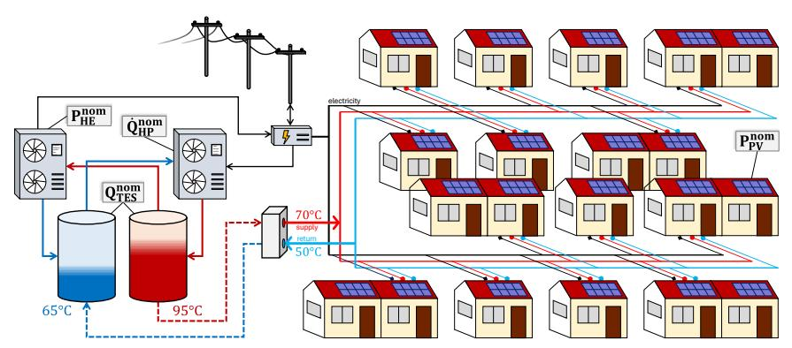

**Fig. 6.1** Schematic representation of the energy system of the housing development.  $P_{PV}^{nom} \left[ kW_p \right]$  is the nominal capacity of the PV system,  $Q_{HP}^{nom} \left[ kW_{th} \right]$  the nominal heat pump capacity,  $Q_{TES}^{nom} \left[ kW_{ht} \right]$  the nominal storage capacity and  $P_{HE}^{nom} \left[ kW_{el} \right]$  the nominal heat engine capacity. Illustration inspired from [198].

thermal energy storage (hot water) and a heat engine. The heat pump uses outside air as heat source (air-source heat pump). The heat engine, which is implemented as an organic Rankine cycle, also uses outside air as heat sink.

In this energy system, the heat pump can be powered by the photovoltaic system and by the distribution grid. It produces heat at  $95^{\circ}\mathrm{C}$  (return at  $65^{\circ}\mathrm{C}$ ), which can be consumed directly by the dwellings via a 4th-generation district heating network ( $70^{\circ}\mathrm{C}$  supply,  $50^{\circ}\mathrm{C}$  return) or charged into the thermal energy storage. The energy consumption associated with the start-up procedure of the system is discussed in the heat pump model in Section 6.3.2. As sensible heat needs a temperature gradient to be accumulated, the choice of  $95^{\circ}\mathrm{C}$  and  $65^{\circ}\mathrm{C}$  results from a compromise between storage density (and therefore volume and cost), the constraint of using non-pressurised reservoirs (cost reduction), and operating the heat engine with sufficient efficiency so that the power-to-power efficiency of the Carnot battery is not too low. This directly stems from the results of the near-optimal analysis (Chapter 4). This choice is further elaborated in the discussion (Section 6.5.2). For the considered two-tanks storage, the total storage volume (combined cold and hot tanks) is defined as

$$V_{\rm TES}^{\rm nom} = \frac{Q_{\rm TES}^{\rm nom}}{\rho_{\rm th}} \ \left[ {\rm m}^3 \right] \ , \tag{6.1} \label{eq:VTES}$$

with  $Q_{TES}^{nom}$  [kWhth] the storage capacity and  $\rho_{th}$  [kWhth/m3] the thermal energy density defined by Eq. 2.28 in Chapter 2. The performance parameters representing the components of the energy system are reported in Table 6.2. They will be further discussed in the description of the optimisation model (Section 6.3.2).

Time series with hourly resolution are used to represent the climate and demand data, as depicted in Fig. 6.2. These were generated using the nPro 2.0 software [210] to represent a development of 20 dwellings. Pisa was selected as refer-

ence location for this study. However, in order to extend the results and assess the impact of climatic conditions on the design of the energy system, Section 6.4.5 also compares these to the case of Brussels (the corresponding time series are provided in Fig. D.1 in Appendix D).

Each dwelling has a floor area of  $150~\mathrm{m}^2$ . The specific heating requirements are  $69~\mathrm{kWh/m}^2/\mathrm{year}$  and the domestic hot water demand is  $21~\mathrm{kWh/m}^2/\mathrm{year}$ . The electricity demand is  $20~\mathrm{kWh/m}^2/\mathrm{year}$ . Finally, the specific cooling requirements are  $36~\mathrm{kWh/m}^2/\mathrm{year}$ . Cooling is provided by decentralised air-cooled chillers. Assuming that the units have a 45% Carnot efficiency (i.e.,  $\Psi_{\mathrm{chillers}}^{\mathrm{Carnot}} = 45\%$ ), the corresponding specific electricity consumption is  $4.1~\mathrm{kWh/m}^2/\mathrm{year}$ . This additional electricity consumption must be added to the specific electricity demand of  $20~\mathrm{kWh/m}^2/\mathrm{year}$ . These values are the default values for post-2000 buildings in nPro  $2.0~\mathrm{[210]}$ . It should be noted that the thermal demand dominates the global energy consumption. The impact of reducing this demand (thanks to sufficiency measures and building insulation) will be discussed in Section 6.5.2.

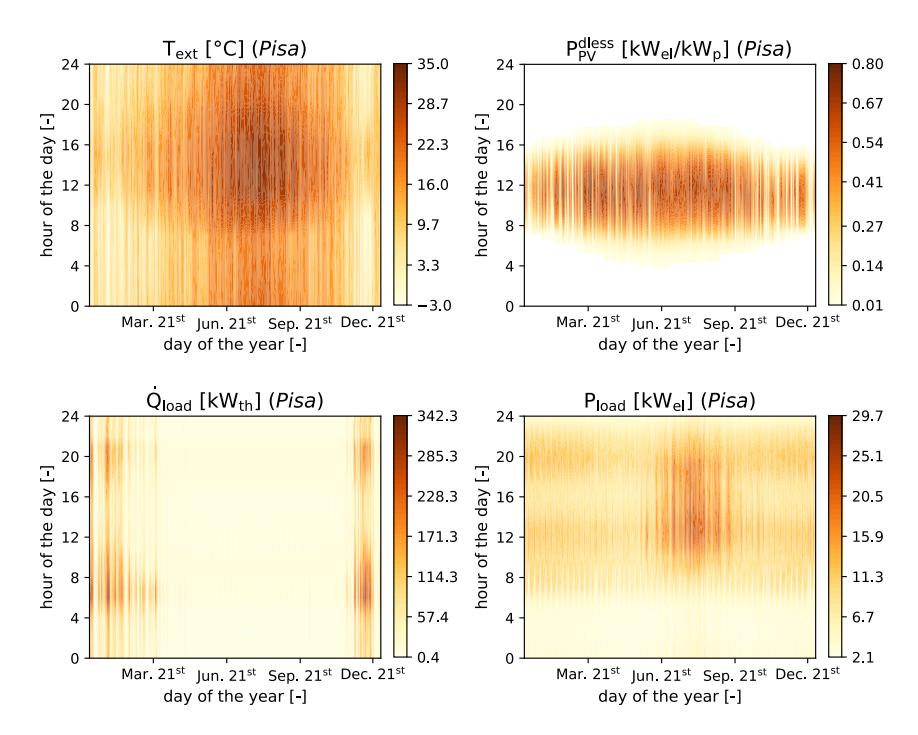

**Fig. 6.2** Temporal heatmaps representing the climate and demand profiles for Pisa. The days of the year are plotted along the x-axis, and hours of the day are plotted along the y-axis.  $P_{load}$  and  $\dot{Q}_{load}$  are the total electrical and thermal loads.  $T_{ext}$  is the external temperature and  $P_{PV}^{dless}$  is the dimensionless photovoltaic production per installed capacity.

# **6** | Integrated residential heat and power management

In Fig. [6.2,](#page-159-0) Q˙ load represents the total thermal load (space heating and domestic hot water) and Pload the electrical load (plug loads and cooling). Text is the external temperature, and Pdless PV is the dimensionless photovoltaic production per installed capacity (accounting simultaneously for irradiance and inverter losses, as explained in the model description in Section [6.3.2\)](#page-167-0). Fig. [6.2](#page-159-0) shows that the demand for heat is lowest in spring and summer when the photovoltaic system produces the most. As suggested by previous analyses [\[125,](#page-259-10) [126\]](#page-259-11), we can therefore expect more electricity to be stored at this time of year than in autumn and winter. In addition, energy demand peaks are in the morning and evening, whereas the photovoltaic system mainly produces in the middle of the day. This clearly illustrates the need for daily buffer storage, which could be provided by the Carnot battery.

# **6.3 Model and methods**

# 6.3.1 Economic model

Annualised energy cost

This chapter aims at understanding the role that Carnot batteries can play in residential energy systems according to the underlying investment costs. In other words, at what cost does it become more attractive to store photovoltaic energy rather than buy electricity from the grid? To answer this, different sets of investment costs are considered (see Table [6.1\)](#page-161-0) and the annualised energy cost (AEC) is chosen as the objective function to minimise. Such parameter is defined as

$$AEC = \tau I + M + E \quad , \tag{6.2}$$

where I is the investment cost, M the maintenance cost, E the electricity cost, and *τ* the annualisation factor (or capital recovery factor) [\[101\]](#page-257-8). The latter is defined as

$$\tau = \frac{r(1+r)^{LT}}{(1+r)^{LT}-1} \quad , \tag{6.3}$$

with LT the project lifetime and r the discount rate. The corresponding values are reported in Table [6.1.](#page-161-0) The investment cost is the product of the nominal capacities and specific costs, defined as

$$\begin{split} & I = P_{PV}^{nom} \cdot CAPEX_{PV} + \dot{Q}_{HP}^{nom} \cdot CAPEX_{HP} \\ & + Q_{TES}^{nom} \cdot CAPEX_{TES} + P_{HE}^{nom} \cdot CAPEX_{HE} \end{split} \ . \tag{6.4}$$

Note that the discount rate of 7% is relatively conservative given the maturity of the technologies under consideration (i.e., PV system, heat pump, thermal storage). As

| Parameter         | Symbol              | Value             | Units                    | Reference            |
|-------------------|---------------------|-------------------|--------------------------|----------------------|
| Investment cost   | I                   | Eq. 6.4           | €                        | n.a.                 |
| Specific PV cost  | $CAPEX_{PV}$        | 1000              | €/kW p        | [195]                |
| Specific HP cost  | $CAPEX_{HP}$        | [200, 1200]       | €/kW th       | [125,200,211]        |
| Specific TES cost | $CAPEX_{TES}$       | [20, 40]          | $\in$ /kWh th | [111,125,198]        |
| Specific HE cost  | $CAPEX_{HE}$        | [400,6000]        | €/kW el       | [111,125,199,212]    |
| Lifetime          | $\operatorname{LT}$ | 20                | years                    | [104, 105, 111, 125] |
| Discount rate     | $\mathbf{r}$        | 7.0               | %                        | [104, 105, 111, 125] |
| Annual. factor    | au                  | 9.4               | %                        | Eq. 6.3              |
| Maintenance cost  | M                   | $0.02 \cdot I$    | €                        | [104, 105, 111, 125] |
| Electricity cost  | E                   | Eq. 6.8           | €                        | n.a.                 |
| Retail tariff     | pabs elec inj | $0.\overline{30}$ | $\in$ /kWh el | [198,213]            |
| Feed-in tariff    | $ m p_{elec}^{inj}$ | 0.00              | €/kWh el      | n.a.                 |

**Table 6.1** Economic parameters of the model.

a result, this will limit the share of investments in the annualised energy cost and favour variable costs (i.e., grid electricity consumption). As there is little information on the maintenance costs for residential Carnot batteries, these are defined as a fraction of the total investment cost, for the same reasons as in Chapter 5.

#### Electricity pricing model

The electricity cost E is represented as the difference between the purchasing cost (product of retail tariff and absorbed electricity) and the injection gain (product of feed-in tariff and injected electricity). By default, a constant electricity price pelec of 0.30 €/kWhel is considered. However, a parametric analysis is also carried out to study the impact of dynamic (or 'variable') retail tariffs in Section 6.4.3. More specifically, the aim is to identify the level of fluctuation at which the Carnot battery can reduce the annualised energy cost through energy arbitrage. The electricity price model that was used in this work is depicted in Fig. 6.3 for three different levels of fluctuation. This model was constructed as

$$p_{elec}[t] = \alpha \cdot p_{dav-ahead}[t] + \beta$$
 , (6.5)

with  $\alpha$  and  $\beta$  subject to

$$\mu(p_{\rm elec}) = \mu(\alpha \cdot p_{\rm day-ahead}[t] + \beta) = 0.30 \, \text{\ensuremath{\in}} / \text{kWh}_{\rm el} \quad , \eqno(6.6)$$

$$CV(p_{elec}) = \frac{\mu(\alpha \cdot p_{day-ahead}[t] + \beta)}{\sigma(\alpha \cdot p_{day-ahead}[t] + \beta)} , \qquad (6.7)$$

with  $\mu$  the mean,  $\sigma$  the standard deviation and CV the coefficient of variation. In Eq. 6.5,  $p_{dav-ahead}[t]$  is the day-ahead spot market price for delivery at hour t. The constraint on the mean electricity price in Eq. 6.6 is employed so as to make a sound comparison with the fixed retail tariff scenarios. The value of pday-ahead was taken as the average of historical values between 2015 and 2020 for the Belgian

#### 6 Integrated residential heat and power management

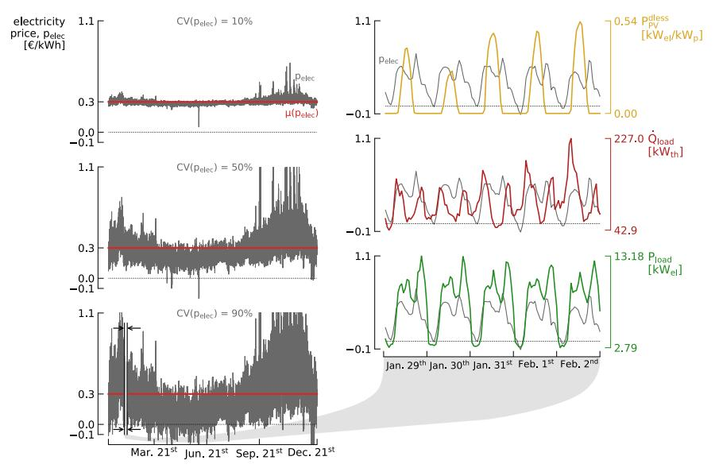

**Fig. 6.3** Model for electricity price  $p_{\rm elec}[t]$  with  ${\rm CV}(p_{\rm elec}) = \sigma(p_{\rm elec})/\mu(p_{\rm elec}) = 10,50$  and 90%. Values are cropped to [-0.1,1.1] for clarity but can go below and above.  $P_{\rm V}^{\rm dless}$ ,  $Q_{\rm load}$  and  $P_{\rm load}$  are reported for five representative days in Pisa to illustrate the correlation between energy demand and electricity price on a daily basis. Seasonal trends are also visible.

day-ahead prices (before COVID-19 pandemic and global 2021-2023 energy crisis). Data was retrieved using the ENTSO-E Transparency Platform [214]. The default feed-in tariff is zero, but a parametric analysis is carried out in Section 6.4.3. With this electricity pricing model, the electricity cost is defined as

$$E = \sum_{t=1}^{8760} p_{elec}^{abs}[t] \cdot E_{GR}^{abs}[t] - p_{elec}^{inj}[t] \cdot E_{GR}^{inj}[t] . \qquad (6.8)$$

# 6.3.2 Optimisation model

The energy system model optimises the design (nominal capacities) and power flows for each of the 8760 hours of the year so as to minimise the AEC. The problem has been formulated as a quadratically constrained linear program (QCLP) with pyomo [215], a well established Python package for high-level formulation of optimisation problems. This translates the physical equations provided by the user into a matrix system, which is subsequently solved by a numerical solver. The Gurobi [216] solver was here selected for its high convergence speed. This optimisation model is described below. All associated parameters are listed in Table 6.2.

Note that mixed integer linear programming (MILP) was initially tested to account for certain non-linearities. The integers were used to formulate constraints

| Parameter                        | Symbol                          | Value              | Units                |
|----------------------------------|---------------------------------|--------------------|----------------------|
| HP source temperature            | $T_{\rm hs,su}$                 | $T_{\rm ext}$      | $^{\circ}\mathrm{C}$ |
| HP source temperature glide      | $\Delta { m T}_{ m hs}^{ m gl}$ | 5                  | K                    |
| HP fraction of Lorenz efficiency | $\Psi_{ m HP}^{ m Lorenz}$      | 0.50               | _                    |
| HE sink temperature              | $T_{cs,su}$                     | $T_{\mathrm{ext}}$ | $^{\circ}\mathrm{C}$ |
| HE sink temperature glide        | $\Delta { m T}_{ m cs}^{ m gl}$ | 5                  | K                    |
| HE fraction of Lorenz efficiency | $\Psi_{ m HE}^{ m Lorenz}$      | 0.45               | _                    |
| TES high temperature             | ${ m T_{TES}^{ht}}$             | 95                 | $^{\circ}\mathrm{C}$ |
| TES low temperature              | ${ m T_{TES}^{lt}}$             | 65                 | $^{\circ}\mathrm{C}$ |
| TES self-discharge               | $L_{TES}$                       | 5                  | $\%/24\mathrm{h}$    |
| TES energy density               | $ ho_{ m th}$                   | 17                 | $kWh_{th}/m^3$       |

**Table 6.2** Technical parameters of the model.

representing performance degradation at part loads [125]. They were also employed to prevent bi-directional energy flows (e.g., simultaneous import from and export to the grid). To that aim, the MILP model introduced in [125] for the optimal scheduling of a Carnot battery in a multi-energy district was adapted to add the design parameters to the set of optimisation variables (i.e.,  $P_{PV}^{nom}$ ,  $\dot{Q}_{HP}^{nom}$ ,  $Q_{TES}^{nom}$ and  $P_{\mathrm{HE}}^{\mathrm{nom}}$ ). However, after a few attempts, this adapted model turned out to be computationally intractable. Simulations on an i7-12800H processor (14 cores, 20 parallel threads) with 16GB of RAM did not converge after three days of calculation. The reason for this is the increased problem complexity linked to the addition of the four design variables compared with pure optimal scheduling.

#### Global model structure

The model contains the four design variables (i.e.,  $P_{\rm PV}^{\rm nom}$  ,  $\dot{Q}_{\rm HP}^{\rm nom}$  ,  $Q_{\rm TES}^{\rm nom}$  and PHEnom) and the power flow variables (one for each of the 8760 hours of the year). These flow variables are:

- $P_{GR}^{abs}[t]$ , the electrical power absorbed from the grid;
- $P_{GB}^{inj}[t]$ , the electrical power fed into the grid;
- $\dot{Q}_{HP}[t]$ , the thermal power produced by the heat pump;
- PHP[t], the electrical power absorbed by the heat pump;
- $\dot{Q}_{\rm TES}^{\rm ch}[t]$ , the charging thermal power for the thermal energy storage;
- $\dot{Q}_{\rm TES}^{\rm disch}[t]$ , the discharging thermal power for the thermal energy storage;
- SOCTES[t], the state of charge of the thermal energy storage;
- QHE[t], the thermal power absorbed by the heat engine;
- PHE[t], the electrical power produced by the heat engine;
- PPV[t], the curtailed photovoltaic power.

#### 6 Integrated residential heat and power management

The system is assumed to operate at steady-state at each hour of the year. Consequently, power conservation (derived from energy conservation) is applied to each component and each node-both electrical and thermal-of the energy system through equality constraints. Power flows are contained between zero and the nominal capacity of each component using inequality constraints. These constraints are detailed below for each component. The only quadratic constraint is used to avoid bidirectional exchanges with the grid, as detailed below.

The optimisation is based on the assumption of perfect foresight. This means that climatic conditions and demand data are perfectly known in advance. The impact and plausibility of this assumption will be further challenged in Section 6.5.2.

#### Heat pump and heat engine

Due to the linear formulation of the problem, no thermodynamic model can be used to simulate the heat pump and the heat engine. These are therefore represented by a black-box model, which is based on the theoretical Lorenz cycle (more appropriate than the Carnot cycle for representing applications with large temperature glides [141,152,217], see Appendix A.1). Assuming a constant fraction  $\Psi^{\rm Lorenz}$  of the Lorenz efficiency, which is analogous to a second law efficiency, this model evaluates the variations in  ${\rm COP}_{\rm HP}$  and  $\eta_{\rm HE}$  due to fluctuations in source and sink temperatures. Although it is less accurate than more advanced methods, its light linear formulation makes it popular for energy planning problems [217–219].

For the heat pump, the Lorenz model connects  $\dot{Q}_{HP}[t]$  and  $P_{HP}[t]$  under steady state assumption with the following power balance:

$$\dot{Q}_{HP}[t] = P_{HP}[t] \cdot COP_{HP}[t]$$
(6.9)

$$= P_{HP}[t] \cdot \Psi_{HP}^{Lorenz} \cdot COP_{HP}^{Lorenz}[t]$$
 (6.10)

$$= P_{HP}[t] \cdot \Psi_{HP}^{Lorenz} \cdot \frac{\overline{T}_{H}}{\overline{T}_{H} - \overline{T}_{C}[t]} \quad . \tag{6.11}$$

 $\dot{Q}_{HP}[t]$  and  $P_{HP}[t]$  are the thermal and electrical power at instant t, respectively.  $\overline{T}_C[t]$  and  $\overline{T}_H$  are the mean source and sink temperatures, defined as

$$\overline{T}_{C}[t] = \frac{T_{hs,su}[t] - (T_{hs,su}[t] - \Delta T_{hs}^{gl})}{\ln\left(\frac{T_{hs,su}[t] - \Delta T_{hs}^{gl}}{T_{hs,su}^{gl}[t] - \Delta T_{hs}^{gl}}\right)} \quad , \quad \overline{T}_{H} = \frac{T_{TES}^{ht} - T_{TES}^{lt}}{\ln\left(\frac{T_{TES}^{ht}}{T_{TES}^{lt}}\right)} \quad . \tag{6.12}$$

Note that all temperatures are in Kelvin in Eq. 6.12.  $T_{\rm hs,su}[t]$  is equal to  $T_{\rm ext}[t]$ , while  $\Psi^{\rm Lorenz}_{\rm HP}$  is here set to 0.50. This value is in line with the values greater than 0.50 and equal to 0.61 reported respectively by [219] and [220] for air-source heat pumps supplying district heating networks at equivalent temperature levels. It is also lower than the values reported in Chapter 4.  $\Delta T^{\rm gl}_{\rm hs}$  corresponds to the heat source temperature glide. For the sake of clarity, these parameters are illustrated alongside the heat pump cycle in Fig. 6.4. Similarly, the power balance for the heat

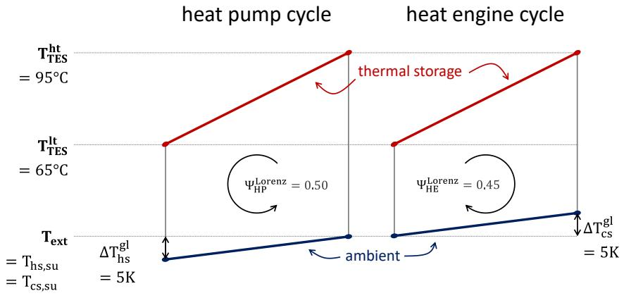

Fig. 6.4 Schematic representation of the heat pump and heat engine models.

engine can be written as

$$P_{\rm HE}[t] = \dot{Q}_{\rm HE}[t] \cdot \eta_{\rm HE} \tag{6.13}$$

$$= \dot{\mathbf{Q}}_{\mathrm{HE}}[\mathbf{t}] \cdot \mathbf{\Psi}_{\mathrm{HE}}^{\mathrm{Lorenz}} \cdot \boldsymbol{\eta}_{\mathrm{HE}}^{\mathrm{Lorenz}}[\mathbf{t}]$$
 (6.14)

$$=\dot{Q}_{HE}[t]\cdot\Psi_{HE}^{Lorenz}\cdot\frac{\overline{T}_{H}-\overline{T}_{C}[t]}{\overline{T}_{H}}\ , \tag{6.15}$$

 $\overline{T}_H$  and  $\overline{T}_C[t]$  are the mean source and sink temperatures, defined this time as

$$\overline{T}_{H} = \frac{T_{TES}^{ht} - T_{TES}^{lt}}{\ln\left(\frac{T_{TES}^{ht}}{T_{TES}^{lt}}\right)} , \quad \overline{T}_{C} = \frac{\left(T_{cs,su}[t] + \Delta T_{cs}^{gl}\right) - T_{cs,su}[t]}{\ln\left(\frac{T_{cs,su}[t] + \Delta T_{cs}^{gl}}{T_{cs,su}[t]}\right)} . \tag{6.16}$$

 $T_{cs,su}[t]$  is equal to  $T_{ext}[t]$ , while  $\Psi_{HE}^{Lorenz}$  is here set to 0.45 [111,125,221]. It is also below the values reported in Chapter 4.  $\Delta T_{cs}^{gl}$  corresponds to the cold sink temperature glide.

Note that linear programming models cannot directly represent the additional energy consumption linked to dynamic effects, such as cold starts, transients or defrost cycles. These are therefore quantified indirectly through the coefficients  $\Psi_{\rm HP}^{\rm Lorenz}$  and  $\Psi_{\rm HE}^{\rm Lorenz}$ , whose values are slightly lower than the nominal values reported in the literature. This approach is similar to assigning a seasonal coefficient of performance to a heat pump, instead of its nominal value.

Finally, the inequality constraints for maximum power flows in the heat pump and heat engine are formulated as:

$$P_{HP}[t] \le P_{HP}^{nom} = \frac{\dot{Q}_{HP}^{nom}}{COP_{HP}^{nom}}$$
(6.17)

$$P_{\rm HE}[t] \le P_{\rm HE}^{\rm nom} \tag{6.18}$$

# **6** | Integrated residential heat and power management

The electrical power of the heat pump is chosen as the upper limit instead of the thermal power because the limiting factor in a real machine is the nominal power of the compressor drive. The value of COPnom HP is set for a source at 15◦C.

#### Thermal energy storage

The thermal energy storage system consists of two water tanks—one for hot water and one for cold. While this design is more costly, it eliminates the constraints related to thermocline degradation found in single stratified tanks (mixing due to fluid circulation, convection and diffusion).

In the model, the thermal storage is the only component whose dynamics is taken into account (via the state-of-charge). The charging Q˙ ch TES and discharging Q˙ disch TES heat flow rates are related to the self-discharge losses with the following ordinary differential equation

$$\frac{d}{dt}SOC_{TES}(t) = -k_{self-discharge} \cdot SOC_{TES}(t) + 100 \cdot \frac{\left(\dot{Q}_{TES}^{ch}(t) - \dot{Q}_{TES}^{disch}(t)\right)}{Q_{TES}^{nom}} \text{,} \tag{6.19}$$

where the coefficient kself–discharge represents the self-discharge losses. Formulated in discrete time with an hourly resolution, this equation is written as

$$SOC_{TES}[t] = \sqrt[24]{1 - L_{TES}} \cdot SOC_{TES}[t-1] + 100 \cdot \frac{\left(\dot{Q}_{TES}^{ch}[t] - \dot{Q}_{TES}^{disch}[t]\right)}{Q_{TES}^{nom}} , (6.20)$$

where LTES stands for the self-discharge losses and is expressed in %/24h (which explains the twenty-fourth root). The annual cyclic constraint is imposed as

$$SOC_{TES}[1] = \sqrt[24]{1 - L_{TES}} \cdot SOC_{TES}[8760] + 100 \cdot \frac{\left(\dot{Q}_{TES}^{ch}[1] - \dot{Q}_{TES}^{disch}[1]\right)}{Q_{TES}^{nom}}$$
 (6.21)

Due to the lack of information, a value of 5%/24h is chosen for LTES (conservative value which could prevent from long term storage) [\[133\]](#page-260-6). The sensitivity analysis in Section [6.4.4](#page-179-0) will show that this parameter has in any case very little influence on overall performance.

Note that the hypothesis of constant storage temperature raises questions when modelling the storage losses. In reality, any thermal loss in sensible heat storage causes a temperature drop (to which these losses are actually proportional). In this model, the self-discharge losses are instead proportional to the amount of energy stored and they only affect that quantity (not the temperature). For example, in the absence of charge/discharge cycles, if the storage is 100% charged on day one, it is only 95% charged the next day, 60% charged after ten days and 20% charged after a month. However, the storage temperature would remain unchanged. Modelling the impact of temperature fluctuation would introduce non-linearities into the model, and this degree of precision is probably not necessary in view of the scope of the study. Yet, in order to assess the impact of this hypothesis, future work on this case study would necessitate a more accurate model considering the dynamics of the storage temperature.

As constraints preventing simultaneous charging and discharging cause nonlinearities, these are not used here. However, such phenomenon does not affect the state of charge since only the net heat flow rate counts in Eq. 6.20. Moreover, it can be eliminated when post-processing the results (only the net value is retained). Finally, there are no constraints on the maximum charge and discharge heat flow rates (these are actually constrained by the operations of the heat pump and heat engine). Still, the following constraint does apply to the state of charge:

$$0\% \le SOC_{TES}[t] \le 100\%$$
 (6.22)

#### Photovoltaic system

The only flow variable for optimisation concerning the photovoltaic system is the power curtailment PPVcrt. This is defined as the deliberate reduction of photovoltaic power generation when the system is capable of producing more electricity. This is constrained by the following inequality:

$$0 \le P_{PV}^{crt}[t] \le P_{PV}[t] \tag{6.23}$$

In Eq. 6.23,  $P_{PV}[t]$  is obtained as

$$P_{PV}[t] = P_{PV}^{dless}[t] \cdot P_{PV}^{nom} \ , \tag{6.24} \label{eq:6.24}$$

with  $P_{PV}^{dless}[t]$  the dimensionless photovoltaic power generated by nPro 2.0 [210] for  $30^{\circ}$  tilt angle and  $0^{\circ}$  azimuth (see Fig. 6.2). The model assumes mono-crystalline modules with an efficiency of 21% at  $25^{\circ}$ C and a temperature coefficient of  $0.36\%/^{\circ}$ C. The inverter efficiency is 96%.

Energy balances at the electrical and thermal nodes

The energy balance at the electrical node is written as:

$$P_{\rm GR}^{\rm abs}[t] + P_{\rm PV}[t] + P_{\rm HE}[t] = P_{\rm load}[t] + P_{\rm HP}[t] + P_{\rm GR}^{\rm inj}[t] + P_{\rm PV}^{\rm crt}[t] \tag{6.25}$$

In contrast to the thermal energy storage, bi-directional flows with the grid (simultaneous absorption and injection) must be prevented. In fact, due to the difference between retail and feed-in tariffs, if the retail price is below feed-in tariff, it would be virtually possible to generate profit by directly re-injecting the absorbed electricity back into the grid. Such phenomenon would of course not happen with the economic model described in Section 6.3.1 but could occur with dynamic retail tariffs, as it will be tested in Section 6.4.3 (e.g., negative retail tariff combined with

#### 6 Integrated residential heat and power management

zero feed-in tariff). In order to prevent that, a quadratic constraint is added:

$$P_{GR}^{abs}[t] \cdot P_{GR}^{inj}[t] = 0 \tag{6.26}$$

Although it slows down the model, Eq. 6.26 is necessary for consistency. For its part, the energy balance at the thermal node is as follows:

$$\dot{Q}_{\rm HP}[t] + \dot{Q}_{\rm TES}^{\rm disch}[t] = \dot{Q}_{\rm load}[t] + \dot{Q}_{\rm HE}[t] + \dot{Q}_{\rm TES}^{\rm ch}[t]$$
 (6.27)

# 6.3.3 Uncertainty quantification

Section 6.4.4 will look at the sensitivity of the AEC to technical and operational uncertainties. The optimisation model presented in Section 6.3.2 was therefore first modified to allow a given design to be tested and only an optimal scheduling of the energy system to be carried out. Like in Chapter 5, the uncertainties are then propagated into the energy system using the RHEIA package [145]. In this work, a third-order polynomial was employed to guarantee sufficient accuracy.

As described in Section 6.4.4, eight uncertainties relating to climatic conditions, demand data, and to the performance of the different components have been considered. These are reported in Table 6.3. The aim is to identify which parameters drive uncertainty in the energy cost and to understand how the design of the energy system could be improved. To identify these parameters, their total-order Sobol indices will be quantified with the RHEIA package [145]. Each index represents the contribution of the uncertain parameter to the global variance on the annualised energy cost.

**Table 6.3** Technical and operational uncertainties considered in the sensitivity analysis. The nominal electric load include plug loads and cooling.

| Parameter                            | Symbol                                                 | Uncert.   | Units               | Ref.  |
|--------------------------------------|--------------------------------------------------------|-----------|---------------------|-------|
| Nominal electric load                | P load                                      | $\pm 15$  | $\%_{\mathrm{rel}}$ | [200] |
| Nominal thermal load (space heating) | Qload,sh                                               | $\pm 15$  | $\%_{\mathrm{rel}}$ | [200] |
| Nominal thermal load (hot water)     | $\dot{\mathrm{Q}}_{\mathrm{load,dhw}}^{\mathrm{nom'}}$ | $\pm 15$  | $\%_{\mathrm{rel}}$ | [200] |
| HP fraction of Lorenz efficiency     | $\Psi_{ m HP}^{ m Lorenz}$                             | $\pm 15$  | $\%_{\mathrm{rel}}$ | [141] |
| HE fraction of Lorenz efficiency     | $\Psi_{ m HE}^{ m Lorenz}$                             | $\pm 15$  | $\%_{\mathrm{rel}}$ | [221] |
| External temperature                 | $T_{\rm ext}$                                          | $\pm 0.5$ | K                   | [200] |
| Photovoltaic production (irradiance) | $P_{PV}$                                               | $\pm 7.8$ | $\%_{\mathrm{rel}}$ | [200] |
| TES self-discharge                   | $\mathcal{L}_{\mathrm{TES}}$                           | $\pm 50$  | $\%_{\mathrm{rel}}$ | n.a.  |

# **6.4 Results**

This section first introduces the optimum system designs over the range of considered CAPEXHP, CAPEXHE and CAPEXTES. Then, to illustrate the seasonal trends, the system operations are analysed over the typical year for one specific design. After that, parametric analyses are conducted to assess the impact of nonzero feed-in tariffs and dynamic retail tariffs on the system design and cost. The sensitivity analysis is then carried out to assess which parameters drive the uncertainty on the annualised energy cost. Eventually, results for Brussels are compared to the reference results for Pisa to characterise the impact of climatic conditions on the design and operations of the system.

# 6.4.1 Optimum system design based on investment costs

Fig. [6.5](#page-170-0) depicts the capacities of the heat pump, storage, heat engine and photovoltaic system that minimise the annual energy cost, over the range of considered investment costs. Since the design trends are monotonic between CAPEXTES = 20 e/kWhth and 40 e/kWhth, results for CAPEXTES = 30 e/kWhth are not reported for the sake of clarity.

First observation is that the more expensive the heat pump, the smaller its capacity (Fig. [6.5a\)](#page-170-0). This downsizing, aimed at maximising its capacity factor and at reducing the associated investment cost, is made possible by an increase in storage capacity (Fig. [6.5b\)](#page-170-0). The model anticipates peak thermal loads in the morning and evening (Fig. [6.2\)](#page-159-0) by distributing heat production over the day, so that it can then rapidly discharge the storage at peak times (further illustrated in Section [6.4.2](#page-173-0) and Fig. [D.9](#page-245-0) in Appendix [D\)](#page-238-0). Conversely, the more expensive the storage, the larger the heat pump (Fig. [6.5a\)](#page-170-0). Overall, this clearly illustrates that, as well as shifting photovoltaic production, the thermal energy storage acts as a buffer to downsize the heat pump and increase its capacity factor. Another advantage that comes with storage, but which is not taken into account in the economic model, is that it limits the number of starts-ups for the heat pump, which extends the lifetime of its compressor.

On the other hand, the storage capacity is much less affected by CAPEXHE (the more expensive, the lower the capacity). This highlights that the storage capacity is driven first and foremost by heat production and demand, rather than electricity demand. In other words, thermal storage is primarily sized to meet heat requirements.

Another key result is that, for most costs, a heat engine is also installed (Fig. [6.5c\)](#page-170-0). Its capacity is mainly driven by CAPEXHE, but gets affected by CAPEXHP as the storage capacity decreases (lower storage capacity, hence smaller engine). Also,

# **6** | Integrated residential heat and power management

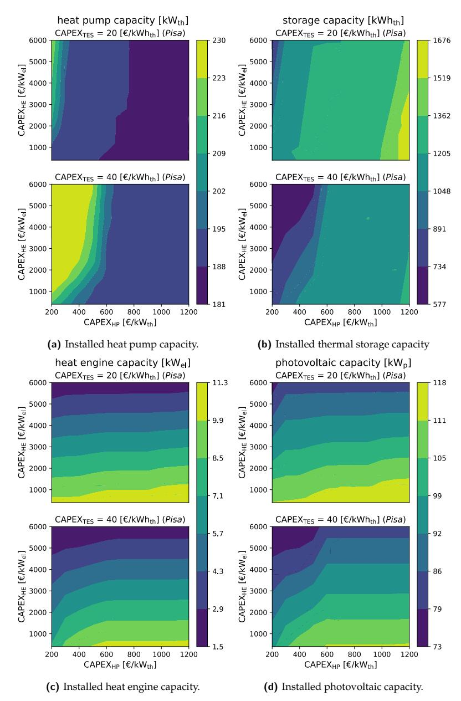

**Fig. 6.5** Optimum system design based on the investment costs considered. The colourmaps depict the installed capacities. The x-axis represents the costs considered for the heat pump, the y-axis the costs of the heat engine and the top and bottom maps illustrate two different storage costs.

the lower the storage capacity, the more the increase in CAPEXHE tends to increase the heat pump capacity. In fact, as the capacity of the heat engine decreases, the amount of storage required decreases, which, as mentioned above, requires an increase in the heat pump capacity. However, this impact of CAPEXHE on the heat pump capacity is much less pronounced than that of CAPEXHP.

To illustrate the role of the heat engine, Figs. [6.6a](#page-172-0) and [6.6b](#page-172-0) depict respectively the fraction of total electricity demand which is covered by the heat engine and the fraction of photovoltaic production which is curtailed. The correlation between the latter and the heat engine capacity is evident: as the capacity increases, the curtailed fraction drops from about 17% down to less than 6%. This clearly demonstrates the benefits of the heat engine in limiting the waste of renewable energy. Nonetheless, this observation must be put into perspective with the electricity demand, which is only between 5.6% and 21.3% covered by the heat engine. These relatively low values are constrained by the heat engine, which runs only during the warm season (higher photovoltaic production, lower thermal demand, see Section [6.4.2\)](#page-173-0).

Let us thus conclude that the design of the Carnot battery is influenced by the cost of each component, but it is primarily optimised to minimise the cost of the heat delivered through the district heating network. Also, although it has a role to play, the heat engine produces a limited amount of electricity, covering in any case less than 21% of the total electricity demand.

As far as the photovoltaic system is concerned, the installed capacity is between 73 and 118 kWp in all cases–i.e., less than 5.9 kWp/dwelling, which is totally plausible. In Fig. [6.5d,](#page-170-0) the synergy between the photovoltaic capacity and CAPEXHE is also well visible: the more expensive, the smaller the photovoltaic system. It perfectly illustrates the fact that a minimum photovoltaic capacity is required to meet heating needs (about 80 kWp), and that any additional capacity will be used to meet electricity needs, since it will be directly proportional to the heat engine capacity. To sum up, the minimum capacity of the photovoltaic system is dictated by heat demand, and any additional capacity is accompanied by an increase in heat engine capacity to meet electricity demand.

One can also observe that when the storage cost is low, the higher CAPEXHP, the larger the photovoltaic capacity. As the cost of the heat pump weighs more in the annualised energy cost, it is preferable to gain in self-production in order to reduce grid electricity consumption and reduce the associated costs (the electricity term E in Eq. [6.2\)](#page-160-4). In addition, the capacity of the heat pump can be reduced by self-consuming more photovoltaic electricity thanks to the thermal storage.

Fig. [6.6c](#page-172-0) depicts the number discharge cycles per year. This number is between 147 and 348, and seems to be a function of CAPEXHE. As illustrated by the operational analysis in Section [6.4.2,](#page-173-0) full charge/discharge cycles are performed daily during the electricity storage period (spring/summer), due to the coupling with the photovoltaic system. On the other hand, during the cold season (autumn/winter),

# **6** | Integrated residential heat and power management

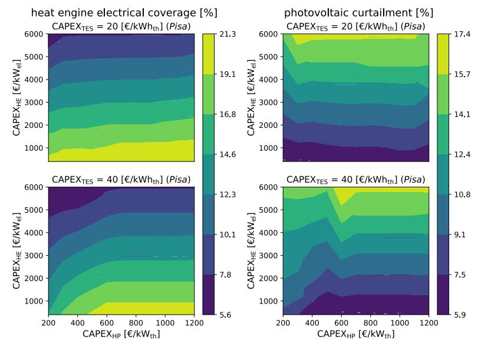

**(a)** Fraction of electricity consumption covered by the heat engine. **(b)** Fraction of curtailed photovoltaic production.

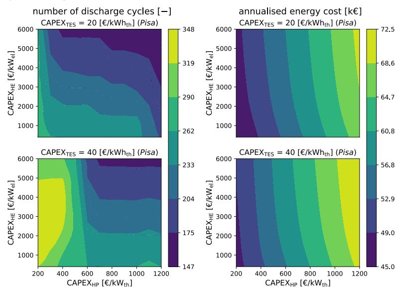

**(c)** Number of discharge cycles for the storage. **(d)** Annualised energy cost.

**Fig. 6.6** Performance indicators for the system operations based on the investment costs considered. The x-axis represents the costs considered for the heat pump, the y-axis the costs of the heat engine and the top and bottom maps illustrate two different storage costs.

storage essentially acts as a buffer between the heat pump and thermal demand (few electrical discharges). Therefore, as CAPEXHE decreases, the capacities of the heat engine and of the photovoltaic system increase (see Figs. [6.5c](#page-170-0) and [6.5d\)](#page-170-0), which extends the period of electrical discharges, and therefore increases the number of cycles associated with this. For its part, the number of cycles linked to the buffer role for heat management remains more or less unchanged. Fig. [6.6c](#page-172-0) also shows that, as the cost of storage increases, its capacity decreases, which increases the number of discharge cycles (expected).

Fig. [6.6d](#page-172-0) finally depicts the annualised energy cost. It clearly demonstrates that the system cost is driven by CAPEXHP, and is much less sensitive to CAPEXTES and CAPEXHE.

As a conclusion to this section, installing a heat engine–thus a proper Carnot battery–can be financially profitable in residential applications where the thermal demand is covered by a heat pump coupled to thermal storage and a photovoltaic system. Nevertheless, the main driver for installing the photovoltaic system and thermal storage is the thermal demand, as confirmed by the extreme case where no heat engine is installed due to the large CAPEXHE. Therefore, if a photovoltaic system and thermal storage are to be installed, adding a heat engine to cover part of the electricity demand can be a profitable option, that also limits curtailment.

Results have also shown that CAPEXHP drives both the heat pump and storage capacities: the more expensive the heat pump, the smaller its capacity and the larger the storage, as would be expected. Conversely, CAPEXHE drives the capacities of the heat engine and the photovoltaic system: the cheaper, the greater the installed capacities of both components. Finally, CAPEXTES does not alter these general trends, but it does impact the nominal capacities: the more expensive the storage, the smaller its size–leading, in turn, to a larger heat pump and smaller heat engine and photovoltaic system.

As an indication, note that the cost of the heat pump is the dominant contributor to the overall cost of the Carnot battery (ranging from 55% to 85%, with an average of 73% across all scenarios). Storage accounts for a more moderate share (ranging from 10% to 40%, with an average of 20%). Finally, the contribution of the heat engine does not exceed 17%, with an average of 7%.

# 6.4.2 Analysis of daily and seasonal operations

To understand how the different components are operated according to the boundary conditions, the system operations are analysed over the full year. To do so, a representative design must be selected. The design corresponding to the case CAPEXHP = 600 e/kWth, CAPEXHE = 2400 e/kWel and CAPEXTES = 30 e/kWhth was selected because these values are conservative with respect to costs currently considered in the literature [\[111,](#page-258-7) [125,](#page-259-10) [126\]](#page-259-11). Although the magnitude

# **6** | Integrated residential heat and power management

of the power flows in the other designs is different (due to different nominal capacities), the trends are the same. Fig. [6.7](#page-174-0) shows the daily and seasonal operations of the system across the entire year. In addition, Table [6.4](#page-175-0) provides various performance indicators for each season. Eventually, the system design is reported in Table [6.5.](#page-175-1) As complements to Fig. [6.7,](#page-174-0) Figs. [D.8](#page-244-0) and [D.9](#page-245-0) in Appendix [D](#page-238-0) depict the full system operations over the 24h of representative summer and winter days.

Fig. [6.7](#page-174-0) first clearly confirms that the heat engine is mostly used during spring and summer to complement the photovoltaic production. Almost no electrical discharge occurs during winter while summer is the season with the largest heat engine production (see Table [6.4\)](#page-175-0). Another observation is that the heat engine runs at part load during the morning, mainly because of the lower loads at that moment (see Figs. [6.2](#page-159-0) and [D.8\)](#page-244-0). The correlation between the heat pump operations and photovoltaic production is also well visible in Figs. [6.7](#page-174-0) and [D.8.](#page-244-0) In spring and summer, the heat pump is mostly driven by the photovoltaic system. Since the thermal de-

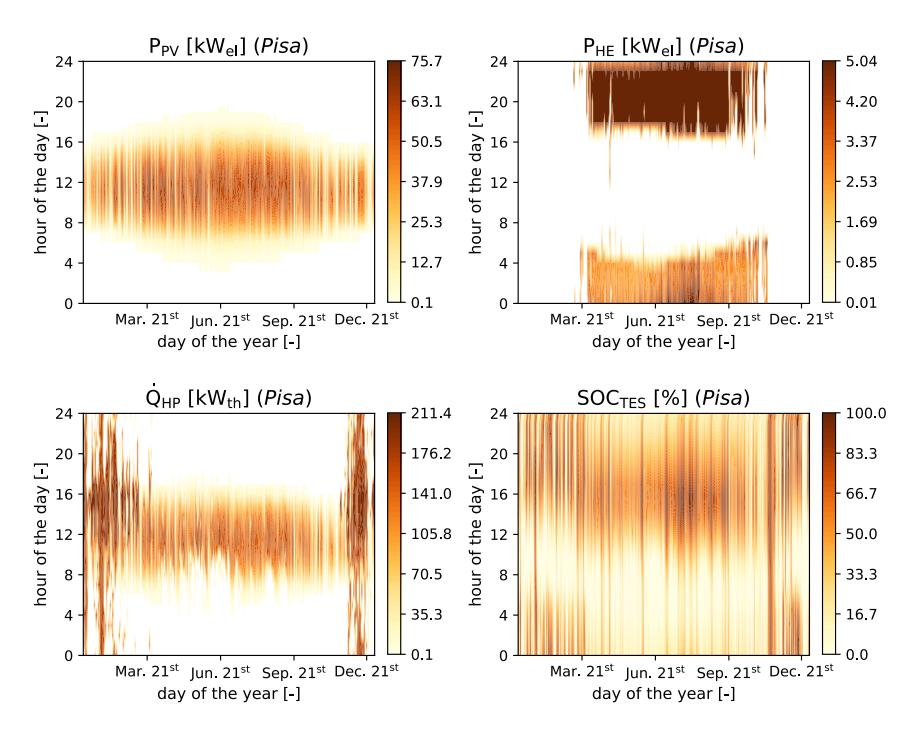

**Fig. 6.7** Temporal heatmaps representing the system operations for Pisa (photovoltaic production PPV, heat engine production PHE, heat pump production Q˙ HP and storage state-ofcharge SOCTES). The days of the year are plotted along the x-axis, and hours of the day are plotted along the y-axis. Results show that, during the cold season, the Carnot battery only buffers heat production (i.e., no electrical discharge). Instead, electrical discharges only occur during the warm season (i.e., lower heating demand).

**Table 6.4** Seasonal operations and performance indicators for Pisa. During winter, the slight difference between heat production and demand is due to the thermal losses in the storage.  $N_{\rm cycles}$  is the number of charging/discharging cycles of the thermal storage and  $E_{\rm GR}^{\rm abs}$  is the grid electricity consumption.

| Parameter                                  | Units               | Winter | Spring | Summer | Autumn | Annual |
|--------------------------------------------|---------------------|--------|--------|--------|--------|--------|
| $E_{load}^{th}$                            | $\mathrm{MWh_{th}}$ | 146.2  | 26.5   | 14.7   | 82.6   | 270.0  |
| $\mathrm{E_{HP}}$                          | $\mathrm{MWh_{th}}$ | 148.6  | 75.5   | 86.5   | 104.2  | 414.8  |
| $COP_{HP}$                                 | _                   | 2.56   | 3.00   | 3.50   | 2.66   | 2.82   |
| $\mathrm{E}^{\mathrm{el}}_{\mathrm{load}}$ | $MWh_{el}$          | 17.2   | 15.4   | 22.8   | 17.0   | 72.4   |
| $\mathrm{E_{HE}}$                          | $MWh_{el}$          | 0.05   | 3.72   | 4.81   | 1.57   | 10.15  |
| $\eta_{ m HE}$                             | %                   | 8.82   | 7.83   | 6.95   | 7.86   | 7.40   |
| $COP_{HP} \cdot \eta_{HE}$                 | %                   | 22.6   | 23.5   | 24.3   | 20.9   | 20.9   |
| $N_{cycles}$                               | _                   | 56.4   | 52.4   | 63.8   | 44.7   | 217.3  |
| $\mathrm{E}_{\mathrm{PV}}$                 | $MWh_{el}$          | 22.1   | 39.5   | 41.7   | 23.1   | 126.4  |
| $\mathrm{E}_{\mathrm{GR}}^{\mathrm{abs}}$  | $MWh_{el}$          | 53.0   | 3.4    | 3.9    | 31.6   | 91.9   |

mand is low at that moment, the produced heat is directly charged into the storage, to be later discharged as electricity with the heat engine. Also, when the heat pump matches the photovoltaic production, it operates mostly at part load (see Figs. 6.7 and D.8). It would thus be relevant for future work to assess the impact of part-load efficiency degradation on the results obtained with this linear model.

Instead, during cold autumn and winter days, the heat production is spread all over the day so that the heat pump runs at constant load (Figs. 6.7 and D.9). Due to the limited photovoltaic potential at that period, most of the electricity needed to run the heat pump is absorbed from the grid.

In Fig. 6.7, the sate-of-charge also gives an overview of the storage operations. It is used to shift photovoltaic production during the summer, whereas it acts more as a buffer between heat production and demand in winter (still used as a complement to photovoltaics, but to a lesser extent). This can be further observed in Figs. D.8 and D.9. We also note that storage is primarily used for daily buffering, not for longer-term storage. This means that the perfect annual foresight assumption does not bias the results (an accurate forecast of energy demand and photovoltaic production on a daily basis is realistic). If, on the other hand, it were used for longer-term (weekly or seasonal), this assumption would be more questionable.

**Table 6.5** Nominal system design for Pisa. The considered design is for CAPEXHP =  $600 €/kW_{th}$ , CAPEXHE =  $2400 €/kW_{el}$  and CAPEXTES =  $30 €/kWh_{th}$ .

| Parameter              | Symbol                                              | Value | Units              |
|------------------------|-----------------------------------------------------|-------|--------------------|
| Storage capacity       | $Q_{TES}^{nom}$                                     | 1203  | $kWh_{th}$         |
| Total storage volume   | $V_{\mathrm{TES}}^{\mathrm{nom}}$                   | 70.8  | $\mathrm{m}^3$     |
| Heat pump capacity     | $\dot{\mathrm{Q}}_{\mathrm{HP}}^{ar{\mathrm{nom}}}$ | 189.5 | $\mathrm{kW_{th}}$ |
| Heat engine capacity   | ${ m P_{HE}^{nom}}$                                 | 5.04  | $\mathrm{kW_{el}}$ |
| Photovoltaic capacity  | $P_{PV}^{\overline{nom}}$                           | 94.4  | $kW_p$             |
| Annualised energy cost | AEC                                                 | 56.9  | k€                 |

# **6** | Integrated residential heat and power management

The key message from this seasonal analysis is that the heat engine is only used when photovoltaic energy is abundant and demand for heat is low (essentially summer and spring). On the other hand, when photovoltaic production is lower and demand for heat is higher (autumn and winter), priority is given to heat storage, as this is more efficient (and therefore more economically profitable) than electricity storage. One way of increasing the overall efficiency of the energy system would be to reduce the temperature of the heat produced in winter in order to increase the COP of the heat pump (the motivation for 95◦C was discussed in Section [6.2\)](#page-157-0). Yet, as sensible heat storage is considered, a reduction in temperature would lower the storage density (Eq. [2.28\)](#page-62-1), and thus the storage capacity for a fixed volume (Eq. [6.1\)](#page-158-1). To maintain capacity, the storage volume would be increased, raising the investments costs, whereas the increase in COP due to the decrease in temperature was precisely intended to reduce the annualised energy cost. A dedicated techno-economic study is therefore needed to find the optimum temperature. A second approach to improving the overall system efficiency would be to use a dual-source heat pump–ground source in winter and air source in summer. The second modification would involve using the ground as a cold sink for the heat engine (i.e., ground-cooled instead of air-cooled). In this way, the heat rejected at the condenser of the heat engine could be partially stored in the ground during the warm season, thereby increasing the COP of the heat pump during the cold season. However, this would require additional investment costs and could reduce the efficiency of the heat engine (i.e., as the ground may be warmer than the ambient air at night). This would therefore also deserve a dedicated techno-economic study.

# 6.4.3 Impact of electricity pricing model

In order to assess the impact of the electricity pricing system, two parametric analyses are carried out. The first looks at the impact of a non-zero feed-in tariff, in contrast to the results above. The second looks at a dynamic (rather than constant) retail tariff, and more specifically at the level of fluctuation required to observe financial gains from the energy arbitrage mechanism.

#### Non-zero feed-in tariff

For a 0.05 e/kWhel feed-in tariff, Figs. [6.8a](#page-177-0) and [6.8b](#page-177-0) illustrate the relative deviation in nominal capacity for the photovoltaic system and heat engine, with respect to the reference designs with zero feed-in tariff introduced in Section [6.4.1.](#page-169-1) The deviation in heat pump capacity is not depicted because it stays within a narrow range (–7.4% to +6.8%). Results show that the PV capacity is largely increased. This shows that a non-zero feed-in tariff, although significantly lower than the retail tariff (i.e., 0.05 e/kWhel against 0.30 e/kWhel), is clearly beneficial to the installation of PV systems. On the other hand, the heat engine capacity is quite reduced compared with the reference case. It is even removed for too high CAPEXHE.

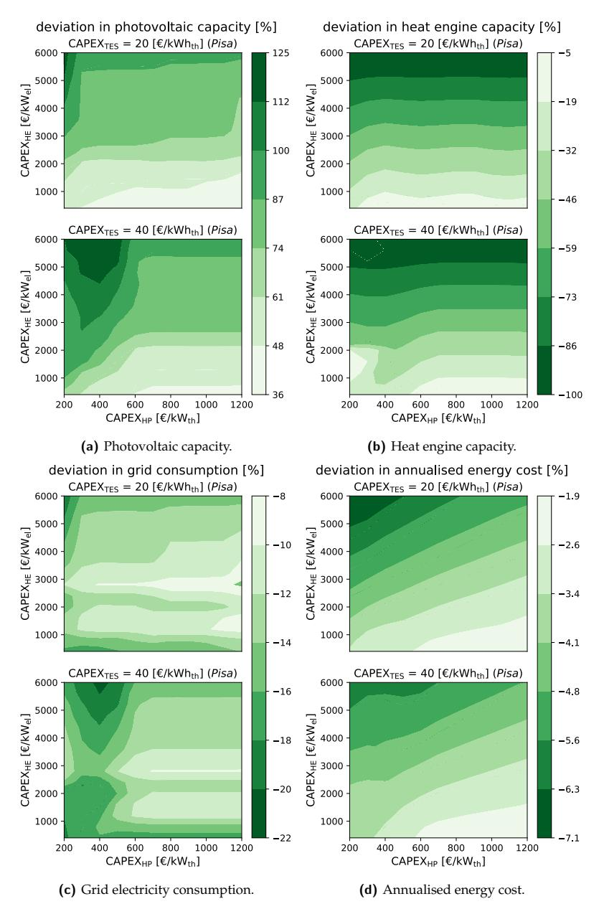

**Fig. 6.8** Relative deviations in installed capacities and performance indicators due to nonzero feed-in tariff. The x-axis represents the costs considered for the heat pump, the y-axis the costs of the heat engine and the top and bottom maps illustrate two different storage costs.

# **6** | Integrated residential heat and power management

As the increase in PV capacity is counterbalanced by the reduction in heat engine capacity, it is not possible to conclude directly whether the non-zero feedin tariff reduces dependence on the grid. Fig. [6.8c](#page-177-0) therefore depicts the relative deviation in grid electricity consumption. Clearly, despite the reduction in heat engine capacity, electricity consumption is decreasing, meaning that energy selfsufficiency is increasing.

Fig. [6.8d](#page-177-0) finally depicts the relative deviation in annualised energy cost. The reduction is not gigantic but can reach up to –7.1%. This analysis shows that, although a non-zero feed-in tariff significantly reduces electricity storage capacity, it nonetheless increases energy self-sufficiency–thanks to larger PV capacity–and lowers the annual energy cost. Scharrer et al. [\[198\]](#page-266-3), who considered a retail price of 0.36 e/kWhel and a feed-in tariff of 0.06 e/kWhel, drew similar conclusion.

#### Dynamic retail tariff

Benefiting from dynamic (or 'variable') energy prices is an argument frequently put forward to increase the profitability of domestic energy storage projects [\[222,](#page-268-3) [223\]](#page-268-4). Conceptually, storage allows for purchasing energy from the grid when costs are low (due to low market demand and/or high renewable production) and then discharging it to meet demand when prices are high. This is similar to the energy arbitrage mechanism. To assess whether such pricing model would be profitable to residential Carnot batteries, a parametric analysis was carried out to study how the level of fluctuation affects the optimum design. For this work, this level has been defined as

$$CV(p_{elec}) = \frac{\sigma(p_{elec})}{\mu(p_{elec})}$$
 , (6.28)

which is the coefficient of of the electricity price pelec over the typical year (ratio between standard deviation *σ* and mean *µ*).

For this analysis, the case CAPEXHP = 600 e/kWth, CAPEXHE = 2400 e/kWel and CAPEXTES = 30 e/kWhth was also selected. Fig. [6.9](#page-179-1) depicts the relative deviation in annualised energy cost, photovoltaic, thermal storage and heat engine capacities for coefficients of variation from 0% to 100%. First observation is that below 70%, there is no financial gain. This is mainly due to high retail tariffs in autumn and winter, when electricity consumption from the grid is highest (important heat consumption and low photovoltaic production). As illustrated in Fig. [6.3,](#page-162-2) a daily effect is also at work: prices are higher when demand for energy is higher (morning and evening peaks). To compensate for the increase of the electricity cost in the annualised energy cost, the capacity of the heat engine is increased in order to provide greater electrical self-sufficiency and limit grid consumption in summer. Note also that the storage capacity tends to decrease. For their part, the capacity of the PV system and the annualised energy cost remain relatively constant.

Instead, when the coefficient of variation of the electricity price is greater than 70%, financial gain starts to occur (around –15% in annualised energy cost for a

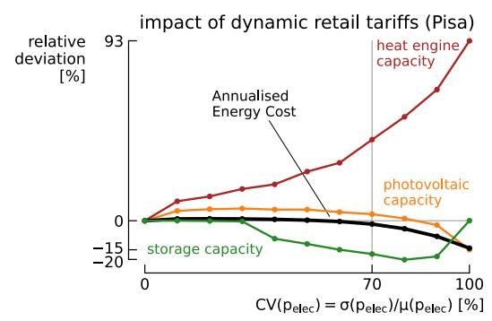

**Fig. 6.9** Relative deviation in annualised energy cost, photovoltaic, storage and heat engine capacities for different coefficients of variation of retail tariffs. The design corresponding to case CAPEXHP = 600 e/kWth, CAPEXHE = 2400 e/kWel and CAPEXTES = 30 e/kWhth was selected for the analysis.

level of 100%). While photovoltaic capacity is falling (–15%), the heat engine capacity is rising sharply: it produces considerably more electricity. This suggests that low-cost (and even negative price) electricity is charged into the storage, and then discharged to meet energy demand when retail tariffs are high (morning and evening peaks). In fact, as the level of fluctuation in electricity price increases, the origin of the profitability of the Carnot battery shifts progressively from photovoltaic load shifting to 'energy arbitrage'. This result therefore shows that if the electricity price fluctuates greatly, arbitrage via the Carnot battery is the most financially attractive option, despite its limited efficiency.

However, the above results must be seen in the context of historical fluctuation levels. Indeed, the level of fluctuation on the day-ahead market as defined in Eq. [6.28](#page-178-0) has not exceeded 70% in most European countries, with the exception of the 2022 energy crisis. It is also important to point out that these levels of fluctuation are accompanied by a fall in installed photovoltaic capacity, and therefore in the production of decentralised renewable energy. In the context of the energy transition, this seems counterproductive. What is more, reducing the distributed generation of photovoltaic electricity should have a retroactive effect on fluctuations in electricity prices. Finally, such high levels of fluctuation in retail tariffs for residential customers raise questions. Households without energy storage could be severely penalised. The plausibility of such scenario is thus questionable.

# 6.4.4 Sensitivity to uncertainties

The effect of technical and operational uncertainties on the annualised energy cost was assessed through a global sensitivity analysis. The design corresponding to case CAPEXHP = 600 e/kWth, CAPEXHE = 2400 e/kWel and CAPEXTES = 30 e/kWhth was selected for the analysis (see Table [6.5](#page-175-1) for capacities). The uncer-

#### 6 | Integrated residential heat and power management

tainties affecting the different parameters are reported in Table 6.3. These were propagated through the model using Polynomial Chaos Expansion, as explained in Section 6.3.3. The third-order surrogate model had a Leave-One-Out error of 1.7%, which is acceptable [145]. Please note that during the creation of the surrogate model, some evaluations of the actual model failed to converge (mainly due to the system being undersized to meet cases of high space heating demand). These evaluations were therefore replaced with others that did converge. Indeed, it seems difficult to include these cases in the assessment of statistical moments. Nevertheless, they deserve to be mentioned. Since the design is fixed in this analysis, only the electricity consumption-related expenditures affect the annualised energy cost.

Fig. 6.10 depicts the Sobol indices for each uncertain parameter. Each index represents the contribution of this parameter to the global variance on the annualised energy cost. Clearly, the annualised energy cost is most sensitive to space heating related parameters, and to a lesser extent to the electrical load. With a Sobol index of 63%, the heat pump efficiency  $\Psi_{HP}^{\rm Lorenz}$  is the primary source of sensitivity. Next comes the heat load for space heating  $\dot{Q}_{\rm load,sh}$ . This result is entirely logical given the volume of energy involved. This illustrates the importance of maximising the COP of the heat pump in order to reduce operating costs. In third place comes the electrical load  $P_{\rm load}$ , with an index of around 14%.

The other five parameters have indices below 5%, and can be considered negligible. The fact that the Sobol index of  $\Psi_{\rm HE}^{\rm Lorenz}$  is negligible illustrates that in the event of a major overproduction of photovoltaic electricity, it is still profitable to store this, despite the low efficiency (provided the cost of the storage system allows). Indeed, in spring and summer, the average power-to-power efficiency of the Carnot battery, which is equivalent to the product of  ${\rm COP_{HP}}$  and  $\eta_{\rm HE}$ , does not exceed 25% (see Table 6.4). If it were not stored, this energy would simply be lost. This observation therefore suggests a reduction in the storage temperature, which

#### sensitivity to uncertainties (Pisa)

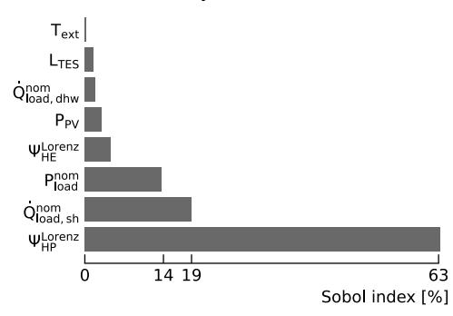

**Fig. 6.10** Sobol indices corresponding to the uncertain parameters considered in the sensitivity analysis (Table 6.3). The design corresponding to case CAPEXHP =  $600 €/kW_{th}$ , CAPEXHE =  $2400 €/kW_{el}$  and CAPEXTES =  $30 €/kWh_{th}$  was selected for the analysis.

would reduce the efficiency of the Carnot battery but increase the COP of the heat pump, thereby reducing operating costs.

Also note that the cost of the system is relatively insensitive to the self-discharge losses LTES, despite the wide range of variation considered (±50%rel). Intuitively, one might think that during the system sizing phase (Section [6.4.1\)](#page-169-1), these losses (5%/24h) prevented long-term storage, which therefore made the system rather insensitive to them (storage is only used on a daily basis). However, this hypothesis can quickly be discarded: a parametric analysis showed that by neglecting self-discharge losses (LTES = 0%/24h), the designs obtained were relatively unchanged compared with the case LTES = 5%/24h. The relative deviation in capacity ranged from 0% for thermal storage to 2.5% for the heat engine. It can therefore be said that the limited storage capacity, which makes the system rather insensitive to self-discharge losses, is due to its high cost and not to the losses themselves.

From this sensitivity analysis, it can be concluded that in residential energy systems equipped with a photovoltaic system, a heat pump and thermal energy storage, adding a heat engine does not present any real financial risk and can reduce energy bills. Regardless of its efficiency, it will be used in any case to limit curtailment during spring and summer.

# 6.4.5 Extending the results to other locations

The aim of this section is to extend and generalise the results obtained for the reference case of Pisa to other climatic conditions. To that aim, the same study was carried out for the case of Brussels, which has a colder climate (i.e., higher heating demand, lower cooling demand and lower solar irradiance). It is also more prone to seasonality (i.e., greater difference between winter and summer solstices). The corresponding boundary conditions are depicted in Fig. [D.1](#page-238-2) in Appendix [D.](#page-238-0) To simplify the analysis, only the significant differences between Pisa and Brussels are discussed. All the corresponding results are provided in Appendix [D.](#page-238-0)

In terms of system design, storage capacity is always lower in Brussels than in Pisa (up to about 70% less). This reduced need for storage is explained in particular by the greater capacity of the heat pump (up to 10% more). In addition to reduced storage capacity, the capacity of the heat engine is also lowered by between 20% and 100%. Specifically, no heat engine is installed (i.e., 100% reduction) when the heat engine price exceeds approximately 5000 e/kWel. For prices below about 3500 e/kWel, the reduction in heat engine capacity is limited to a maximum of 65%. As a result, in Brussels, the heat engine covers only 0% to 13% of the total electricity demand–on average, 40% to 100% less than in Pisa. Curtailment is also logically higher in Brussels, since electricity storage capacity is more limited there. This difference in electricity storage capacity is due mainly to the longer period of

# **6** | Integrated residential heat and power management

heat demand for space heating, while the photovoltaic potential is more concentrated around the summer solstice. Consequently, this reduces the potential period for electrical discharge.

Given the lower photovoltaic potential, which is more concentrated around the warm season, and the higher demand for heat in winter, the annualised energy cost is logically higher in Brussels than in Pisa. This is further amplified by the fact that the COP of the heat pump is lower in Brussels, due to the lower average temperature.

The parametric analysis on electricity tariffs also reveals differences between Brussels and Pisa. In the case of a non-zero feed-in tariff, the capacity of the heat engine decreases much more (it is even removed in many cases), while the capacity of the photovoltaic system increases much less. The reduction in grid electricity consumption is therefore lower in Brussels than in Pisa (maximum –11% compared with –22%). The gain in annualised energy cost is also logically much lower (maximum –2.6% compared with –7.1%). Non-zero feed-in tariff is therefore less advantageous in Brussels than in Pisa, essentially because of the lower solar irradiance.

In terms of dynamic retail tariff, the analysis shows that photovoltaic capacity is much more reduced in Brussels than in Pisa. This can be explained by the lower irradiance during periods of high energy demand (autumn and winter), but also by the fact that the price of electricity is lower when the system produces the most, which reduces its profitability. It should also be noted that storage capacity increases significantly with the level of fluctuation, so as to gain resilience and face price rises during morning and evening peaks.

Generally speaking, this analysis on the case of Brussels illustrates that the higher the heating demand during the cold season, and the lower the solar irradiance and the less evenly distributed it is over the year, the less interesting the Carnot battery. Conversely, when heating demand is lower and irradiance better distributed, having a heat engine to carry out electrical discharges during the warm season is a real asset.

# **6.5 Summary and discussions**

This chapter looked at the techno-economic potential of Carnot batteries used as flexibility options for integrated heat and power management in residential applications. The system consists of a high temperature air-source heat pump connected to thermal storage. It is integrated into a housing development of 20 dwellings, and two locations with different climates are considered (Pisa and Brussels). Thermal discharge occurs via the district heating network, while electrical discharge is achieved through an air-cooled organic Rankine cycle. The entire system (i.e., design and operations) is optimised to minimise the annualised energy cost using linear programming. This section lists the main learnings from the results, discusses their limitations and proposes prospects for future work.

# 6.5.1 Main results

For most investment costs, Carnot batteries contribute to minimise the annualised energy cost and are preferable to curtailment. However, the amount of energy stored, and therefore the energy self-sufficiency, depends on the cost of each component (i.e., HP, TES and HE). Pisa also performs better than Brussels, mainly because of the higher solar irradiance and lower heat demand.

The role of the Carnot battery varies with the seasons. During autumn and winter, when photovoltaic production is lowest and demand for heat is highest, only thermal discharge occurs. Storage acts as a buffer between peaks in heat demand and heat pump production. Conversely, in spring and summer, when photovoltaic production is at its peak and demand for heat is at its lowest, the heat accumulated in the storage during the day is used mainly to power the heat engine and produce electricity in the morning and evening. This shows that despite the low electrical efficiency of the Carnot battery (i.e., less than 25%), investing in a heat engine to be coupled to the thermal storage is financially preferable to curtailment.

With regard to the electricity pricing model, for fluctuation levels comparable to those encountered on the day-ahead markets today, benefiting from a dynamic retail tariff is not financially advantageous. Dynamic tariffs indeed lead to an average increase in electricity prices when demand is at its highest (autumn/winter and morning/evening peaks). For higher fluctuation (i.e., CV(pelec) > 70%), the Carnot battery is a good option, as it allows energy arbitrage. It should be noted, however, that variable tariffs can cause reduction in the installed photovoltaic capacity, and therefore reduce the energy self-sufficiency.

On the other hand, non-zero feed-in tariffs are not really favourable to the Carnot battery, although they do allow a slight reduction in the annualised energy cost (generally less than 5%). Indeed, the capacity of the heat engine is significantly reduced in Pisa, and generally zero in Brussels.

From this chapter, we can conclude that if a heat pump and thermal storage are to be installed in a residential application, then installing a heat engine is generally profitable and preferable to curtailment, no matter how efficient it is, as long as its capital cost allows.

# 6.5.2 Discussions

This work assumed an electricity price of 0.30 e/kWhel. However, since electricity prices vary by region and over time, it is essential to generalise these find-

# **6** | Integrated residential heat and power management

ings. A potential approach could be to express each investment cost as function of the electricity price. This would allow the CAPEX/pelec ratio to be used to generalise the optimal design of the energy system. While the results in Section [6.4](#page-169-0) are expressed in terms of CAPEX for the sake of readability and ease of interpretation, further investigation is necessary to ensure the CAPEX/pelec ratio can faithfully depict the correct results trends.

With regard to heat production, the sensitivity analysis in Section [6.4.4](#page-179-0) clearly demonstrated that the COP of the heat pump was a key parameter to reduce the annualised energy cost. In order to maximise the COP, technological improvements can obviously be expected. In addition, reducing the delivery temperature during the cold season, when there is no electrical discharge, should be considered. Decreasing this temperature closer to that of the district heating network (i.e., 70◦C) would increase the COP, and therefore reduce electricity consumption (essentially absorbed from the grid). Yet, for a fixed volume of the storage tanks, this would also reduce storage capacity. For instance, going from 95◦C/65◦C to 80◦C/65◦C would roughly halve the storage thermal capacity (further affect of the electrical capacity due to reduced heat engine efficiency). As a result, more electricity imports would be required, which would partially offset the gain from the increased COP. Another option would be to maintain this storage capacity by increasing the tanks volume, and to consider the financial impact on the investment cost. A final option would be to distinguish between production modes: lower temperature when coupled directly to the heating network, and higher temperature when charging the thermal storage.

The sensitivity analysis also suggests that, given the impact of the COP, neglecting performance degradation at part load and the energy consumption associated with cold start-ups and transients is a very optimistic assumption. If these efficiency degradations were taken into account in our model, the impact would be, on the one hand, an increase in electricity consumption. On the other hand, a probable downsizing of the heat pump, so as to increase the average capacity factor and reduce part load operations, and to limit the number of start-ups, while the capacity of the thermal energy storage would be increased. This would result in a better COP. To deal with part load efficiency degradation in practice, several smaller capacity heat pumps could be set up in parallel. After optimal dispatch, taking into account the part load performance degradation, the heat pumps would be switched on progressively to maximise the overall COP of the facility.

Another hypothesis that may be questioned is the perfect annual foresight. Since the model perfectly knows the boundary conditions at each hour of the year, it can optimally anticipate the system operations. For example, if the model sees a week coming with high demand and low energy production, it can anticipate this the week before by increasing the storage charge level. Another example would be to take advantage of low electricity prices to anticipate a high-prices week. Although this allows the system to be optimised as much as possible, it is not entirely realistic. Weather forecasts, which influence photovoltaic production and heat demand, are generally uncertain more than 24 hours ahead. The same applies to the electricity price, which is set 24 hours before delivery on the day-ahead market. However, the impact of this hypothesis should be moderated. As illustrated in the analysis of the system operations in Section [6.4.2,](#page-173-0) the thermal storage is designed for daily use. As the charge-discharge cycles do not take place over more than two days, the storage does not allow for weekly or seasonal optimisation. The perfect foresight assumption is therefore reasonable in this case. However, it would be less acceptable if the storage cycles took place over a longer period.

As far as storage is concerned, the considered costs (i.e., 20 to 40 e/kWhth) and self-discharge losses (i.e., 5%/24h) did not make it possible to obtain a design allowing very long-term storage (weekly, or seasonal). However, given the very low costs reported for pit-storage projects (down to 0.5 e/kWhth [\[224\]](#page-268-5)), it would seem appropriate to consider this technology. Although it is compatible in terms of temperature ranges, a better characterisation of self-discharge losses would be necessary, as they directly affect the temperature levels. Up to 30% of self-discharge losses are for instance reported for annual cycles [\[224\]](#page-268-5). In order to model them correctly, a dynamic consideration of the storage temperature would be a minimum requirement. It would then be interesting to study whether, at the housing development level, long-term storage takes place primarily for heat, or also for electricity.

# 6.5.3 Perspectives

The results obtained in this work pave the way for the use of invertible heat pumps/organic Rankine cycles. As recently studied by Scharrer et al. [\[198\]](#page-266-3) for residential Carnot batteries, these machines would make it possible to significantly reduce investment costs. The counterpart to this cost reduction would be a slight loss of performance. As illustrated above, such performance degradation would not be detrimental to the electricity production with the heat engine, but severely to the thermal production with the heat pump. This precisely indicates that when designing an invertible machine for such application, priority should be given to optimising the heat pump and not the organic Rankine cycle. This deserves further investigation.

Given the share of heat in the cost of energy, reducing the thermal demand seems to be a key lever. This can be achieved by insulating the building (efficiency measure), and by reducing the set-point temperature (sufficiency measure). Consequently, studying a scenario with a reduced heat demand is a real stake. If the need for thermal storage during the cold season is reduced, it is likely that the storage capacity will also be reduced. As a result, the role of the heat engine would become uncertain. Would it still be used?

Future work should also focus on a comparison with chemical batteries (Liion). At domestic scale, this technology is the first direct competitor of the Carnot

# **6** | Integrated residential heat and power management

battery. With its constantly falling costs (–90% in last 15 years [\[225\]](#page-268-6)) and very high efficiency (i.e., > 90%), it appears to have a clear techno-economic lead. However, these two technologies do not provide the same services to energy systems (storage duration, heat/electricity coupling, etc.). What is more, the environmental footprint of Carnot batteries could be smaller [\[125\]](#page-259-10). There is therefore a need to study the complementarity between these technologies in order to identify possible synergies leading to an economic and environmental optimum. This will be addressed in Chapter [7.](#page-189-0)

The feasibility of this type of system should also be confirmed with more accurate models, including operational models that take into account part load efficiency degradation, fluctuation of storage temperature, as well as a characterisation of dynamic performance.

Finally, it is worth noting that applications with higher-temperature heat demand are likely to be more favourable for Carnot batteries. As illustrated in Part [I,](#page-45-0) the higher the storage temperature, the better the efficiency. Applications requiring low-pressure steam (i.e., 100◦C to 150◦C) could therefore serve as promising case studies. However, it appears necessary for this heat demand to be intermittent– either on a daily or seasonal basis–so that electrical discharges can also occur.

# **6.6 Key messages**

- Carnot batteries for integrated heat and power management in residential applications can reduce energy costs and limit photovoltaic curtailment. Yet, thermal storage is driven first by the heat demand, while the heat engine is installed only when costs allow.
- On a seasonal basis, electrical discharges occur only during the warm season when photovoltaic energy is abundant and when there is no demand for space heating. During the cold season, only heat is discharged.
- On a daily basis, thermal storage buffers the production and heat demand peaks to maximise the capacity factor of the heat pump. When sufficiently abundant, it serves to shift the photovoltaic production.
- The operating cost is most sensitive to the COP of the heat pump while rather insensitive to the heat engine efficiency. In case of invertible heat pump/organic Rankine cycle, the system should therefore be designed to maximise the heat pump performance. Strategies aiming at reducing the delivery temperature during the cold season should also be considered.
- The comparison of Brussels and Pisa demonstrated that the system shows greater potential in regions which are less prone to seasonality (i.e., shorter heating season and more evenly distributed solar irradiance across the year).

# **PART III Environmental analysis**

# **7**

# **Comparative life cycle assessment**

C ARNOT batteries are often promoted for their lower environmental footprint compared with electro-chemical batteries (e.g., Li-ion). Although literature on this is really scarce [\[119,](#page-259-4) [125,](#page-259-10) [226\]](#page-268-7), it can be expected that the use of mineral resources will be lower, due to the significantly reduced reliance on rare earths and strategic metals (e.g., lithium, copper). However, their considerably lower efficiency must also be taken into account. As this is nearly three times lower (see Part [I\)](#page-45-0), the capacity of the renewable energy source needs to be tripled to store equivalent amounts of electricity. Hence, it is rather challenging to predict whether their impact on indicators such as climate change or mineral resource depletion could be lower than that of electro-chemical batteries. To contribute to this issue, this chapter addresses the following research question:

> *Could Carnot batteries have a lower environmental impact than electro-chemical batteries across the main impact categories?*

Beyond the sole impact on climate change, 18 environmental indicators are considered though a cradle-to-grave life cycle assessment (LCA). To that aim, we return to the case study from Chapter [6](#page-155-0) (i.e., integration in housing development). The comparison of entire energy systems provides perspective on the impact of storage assets relative to electricity production assets. Section [7.1](#page-190-0) first presents the fundamentals of LCA. Then, Section [7.2](#page-192-0) introduces the different energy system topologies considered (e.g., standalone Carnot battery, combined Li-ion battery and ther-

# **7** | Comparative life cycle assessment

mal storage, etc.) and the models used to conduct the LCA. Section [7.3](#page-199-0) then describes the different optimal designs that minimise greenhouse gas emissions. Subsequently, the impact of the various topologies on the 18 indicators is compared. The contributions of each component of the energy system are also detailed. The results confirm that, for this case study, the primary benefit of the Carnot battery lies in the reduced mineral resource consumption, while it does not particularly stand out in terms of greenhouse gas emissions.

# **7.1 Overview of the LCA methodology**

Life cycle assessment (LCA) is a methodology allowing to assess the environmental footprint associated with the different stages of the life cycle of a system (product, process or service), including raw materials extraction, manufacturing, use phase, and end-of-life. It is a systematic method which is defined and protected by the ISO14040 and ISO14044 standards [\[227,](#page-268-8) [228\]](#page-268-9). LCA typically follows four phases, as illustrated in Fig. [7.1.](#page-190-1) First, *Goal and Scope Definition*, next *Inventory Analysis*, then proper *Impact Assessment*, and finally *Interpretation*, which goes along with the three first stages. Bi-directional arrows in Fig. [7.1](#page-190-1) illustrate the iterative nature of the process (e.g., heat pump and photovoltaic system inventories, see Section [7.2.2\)](#page-195-0).

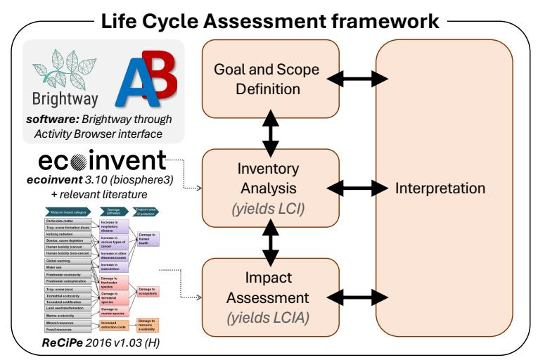

**Fig. 7.1** Structure of the life cycle assessment (LCA) framework of this work. The Brightway [\[229\]](#page-268-10) LCA software is used through the Activity Browser [\[230\]](#page-268-11) interface. The life cycle inventory is performed using the ecoinvent database [\[231\]](#page-268-12) and complemented with relevant literature. The impact assessment is performed using the ReCiPe method [\[232\]](#page-269-0).

**Goal and scope definition.** Various objectives can guide a LCA study. Is the *goal* to refine a system or product design to minimise its environmental footprint (i.e., eco-design)? To compare alternatives and select the one with the lowest impact (i.e., comparative LCA)? To evaluate future scenarios considering technological and policy changes (i.e., prospective LCA [\[233\]](#page-269-1))? Or to assess the system footprint in relation to planetary boundaries (i.e., PB-LCA)? Based on this, different *scopes* can be defined. The *system boundaries* may cover all life cycle stages, from raw material extraction to end-of-life (i.e., cradle-to-grave LCA). Alternatively, if downstream phases are less relevant, the study may focus only on the stages from raw material extraction to manufacturing, omitting use and end-of-life (i.e., cradle-to-gate LCA). Proper scope definition also requires selecting an appropriate *functional unit* (e.g., the fabrication of a 10 kWel/100 kWhel Carnot battery), which serves as a reference point to relate the inputs and outputs. To complete this phase, the *impact categories* and the *impact assessment method* must also be defined, as outlined below.

**Life cycle inventory.** This phase aims to establish an inventory of all *elementary physical flows* (raw materials, energy requirements, atmospheric, land and water emissions, etc.) exchanged between the functional unit and the *biosphere* (or *ecosphere*). For the manufacturing of a Carnot battery, this includes the mass of raw minerals, the energy, and the products required for refining the metals used, etc. The result of this analysis is called the *Life Cycle Inventory* (LCI). As the system or product complexity increases, conducting this analysis becomes more challenging. Consequently, databases like ecoinvent [\[231\]](#page-268-12) or GaBi, and LCA softwares such as Brightway [\[229\]](#page-268-10), SimaPro or OpenLCA [\[234\]](#page-269-2) are generally required. These databases, also referred to as the *technosphere*, contain intermediate functional units. In our example, steel production–from ore extraction–is an intermediate functional unit for the production of the storage tanks.

**Life cycle impact assessment.** The contributions of all elementary flows from the LCI are then mapped into various *impact categories* and associated indicators. These indicators, associated to *characterisation factors*, are typically classified at the *midpoint* or *endpoint* levels. While midpoints quantify environmental effects for intermediate impact categories, endpoints represent effects at the level of the three main impact categories: *human health*, *ecosystem quality*, and *resource depletion*. Midpoints are specific and science-based, making them measurable, whereas endpoints aggregate multiple midpoints, requiring assumptions about how to proceed. As a result, endpoints are sometimes more controversial. For example, climate change (midpoint) results from an increase in infrared radiative forcing. The associated characterisation factor is the global warming potential (GWP), expressed in kgCO2-eq emitted into the atmosphere. Through different damage pathways, climate change ultimately impacts human health and ecosystems (endpoints). Ultimately, this impact assessment phase results in the Life Cycle Impact Assessment (LCIA). In this work, the different mid-points will be evaluated through the ReCiPe method [\[232\]](#page-269-0).

#### 7 | Comparative life cycle assessment

**Interpretation.** Through the LCIA, this phase aims to address the goal of the LCA. For example, it evaluates whether Carnot batteries have a lower impact than Li-ion batteries based on a specific indicator. It provides a set of conclusions and recommendations for the study, while discussing its limitations. This phase also offers an opportunity to verify the consistency of results and assess their sensitivity, helping to determine the level of confidence in the results. Uncertainty is intrinsic to LCA, both at the LCI level (as it is difficult to quantify all elementary flows with absolute certainty) and at the LCIA level (since the impact of each flow is uncertain and evolves as scientific knowledge progresses).

## Model and methods

# 7.2.1 Goal and scope definition

7.2

The objective of this chapter is to discuss whether Carnot batteries could have a lower environmental impact compared with Li-ion batteries. As this thesis studies Carnot batteries as effective coupling options between heat and power, the study is not limited to sole electrical discharges, but it considers the integrated management of heat and power. The case study from Chapter 6 is therefore re-used, namely the integration into a housing development of 20 dwellings (see Fig. 7.2). As Li-ion batteries cannot provide the same services as Carnot batteries (i.e., no discharge of both heat and electricity), the scope of this study cannot be limited to the electrical storage capacities alone, but must encompass the entire energy system for a fair

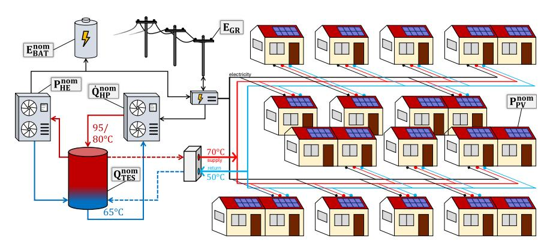

**Fig. 7.2** Schematic representation of the energy system of the housing development.  $P_{PV}^{nom} \ [kW_p]$  is the nominal capacity of the PV system,  $\dot{Q}_{HP}^{nom} \ [kW_{th}]$  the nominal heat pump capacity,  $Q_{TES}^{nom} \ [kW_{th}]$  the nominal thermal storage capacity,  $P_{HE}^{nom} \ [kW_{el}]$  the nominal heat engine capacity and  $E_{BAT}^{nom} \ [kW_{hel}]$  the nominal Li-ion battery capacity. Below the grid is the control box, which optimises the power flows.

comparison. In addition to considering the multi-vector capabilities of the Carnot battery, this also allows for a broader examination of whether the Carnot battery benefits the energy system and to characterise its impact. Thus, this LCA aims to compare the environmental impact of different topologies of domestic energy systems: photovoltaic and Li-ion battery combined with thermal storage, Carnot battery, etc. (see Table [7.1](#page-194-0) below). To compare the different topologies on a level playing field, these must provide the same energy services to the housing development. This is here reflected by the same grid electricity consumption (further detailed below). Due to the risk posed by climate change and the weight of energy systems in global greenhouse gas emissions [\[12\]](#page-250-1), the different energy systems will be sized to minimise the global warming potential (GWP) indicator. The results of this sizing are discussed in detail in Section [7.3.1.](#page-199-1) The functional is thus:

*The annual supply of 270 MWhth of heat and 60 MWhel of power, corresponding to demand profiles depicted in Fig. [6.2,](#page-159-0) to a housing development of 20 dwellings.*

To provide a balanced discussion, the impact categories include the three damage areas: human health, ecosystem quality, and resource depletion. Impact assessment is performed using the 18 midpoints of the ReCiPe method [\[232\]](#page-269-0). The LCA is achieved using the Brightway [\[229\]](#page-268-10) software through the Activity Browser interface [\[230\]](#page-268-11). The system boundaries extend from raw materials to end-of-life (cradle-to-grave LCA). Additionally, to broaden the perspectives, the locations of Pisa and Brussels are again compared.

#### Six topologies for the energy system

The six different energy system topologies for supplying heat and electricity to the housing development are summarised in Table [7.1.](#page-194-0) In all six cases, heat is supplied via a central heat pump (HP) through a 4th-generation district heating network (DHN) operating at a supply temperature of 70◦C and a return at 50◦C. In practice, multiple smaller capacity units can be used in parallel to maximise the coefficient of performance (COPHP) and minimise efficiency losses due to part-load operation. Electricity can be generated locally via distributed rooftop photovoltaic (PV) systems, as well as imported from or exported to the grid (GR). An energy management system controls the power flows. The key distinction between the six cases lies in the type of storage technology employed.

In the first case, only a Li-ion battery (BAT) can be used. As no thermal storage is present (i.e., the HP is directly coupled to the DHN), heat is produced at 70◦C. In the second case, a thermal energy storage (TES) unit is introduced alongside the battery. Since sensible heat storage is used, the HP supply temperature is raised to 80◦C (with a return at 65◦C). In the third and fourth cases, the battery is removed, and a heat engine (HE) is connected to the TES, allowing for electrical discharges. This configuration forms a proper Carnot battery. The difference between these two cases lies in the storage temperature–80◦C and 95◦C–reflecting the trade-off

| Case                             | GR | PV | HP | Temperature               | BAT      | TES | HE |
|----------------------------------|----|----|----|---------------------------|----------|-----|----|
| BAT (70°C)                       | ✓  | ✓  | ✓  | $70/50^{\circ}{\rm C}$    | <b>✓</b> | Х   | Х  |
| BAT + TES ( $80^{\circ}$ C)      | 1  | ✓  | 1  | $80/65^{\circ}\mathrm{C}$ | ✓        | ✓   | X  |
| TES + HE ( $80^{\circ}$ C)       | 1  | ✓  | 1  | $80/65^{\circ}\mathrm{C}$ | X        | ✓   | 1  |
| TES + HE ( $95^{\circ}$ C)       | 1  | ✓  | 1  | $95/65^{\circ}\mathrm{C}$ | X        | ✓   | 1  |
| BAT + TES + HE ( $80^{\circ}$ C) | 1  | ✓  | ✓  | $80/65^{\circ}\mathrm{C}$ | ✓        | ✓   | 1  |
| BAT + TES + HE ( $95^{\circ}$ C) | ✓  | ✓  | ✓  | $95/65^{\circ}\mathrm{C}$ | ✓        | ✓   | ✓  |

 Table 7.1
 Considered topologies for the energy system of the housing development.

between efficiency and energy density (see Section 6.5.2). The fifth and sixth cases are hybrid configurations, incorporating both a Carnot battery and a Li-ion battery, but considering storage at  $80^{\circ}$ C and  $95^{\circ}$ C, respectively.

To size the different systems, a comprehensive optimisation model and a clear design objective are required. Unlike Chapter 6, where the focus was on technoeconomic optimisation, the primary goal here is to minimise the greenhouse gas (GHG) emissions of the energy system. The methodology is detailed below.

#### System model

The same model as in Chapter 6 is used to simulate the system, with identical boundary conditions (detailed time series in Fig. 6.2), except the cooling load, which is here neglected. To minimise the footprint, a single stratified storage tank is assumed. The thermal storage has minimum and maximum states of charge of 0% and 100%, whereas for the battery, these limits are conservatively set to 15% and 85% to extend its lifespan [235], despite current trends go even below [236]. Self-discharge losses are set at  $L_{\rm BAT}=0.1\%/24 h$  for the battery and  $L_{\rm TES}=1\%/24 h$  for the thermal storage. The battery is modelled with a 95% conversion efficiency for both charge and discharge, resulting in a 90% roundtrip efficiency [235, 237]. The charge and discharge capacity rates are set at 50% (i.e., C-rate of C/2) [237].

The design objective is to minimise the greenhouse gas emissions ( $\rm GHG_{tot}$ ). Both the construction ( $\rm GHG_{construction}$ ) and operations ( $\rm GHG_{operations}$ ) of the energy systems are considered over their entire lifetime ( $\rm LT_{system}=30~years$ ). The total GHG emissions are defined as

$$\begin{split} GHG_{tot} &= GHG_{construction} + GHG_{operations} \\ &= P_{PV}^{nom} \cdot GWP_{PV} \cdot \frac{LT_{system}}{LT_{PV}} + \dot{Q}_{HP}^{nom} \cdot GWP_{HP} \cdot \frac{LT_{system}}{LT_{HP}} \\ &+ E_{BAT}^{nom} \cdot GWP_{BAT} \cdot \frac{LT_{system}}{LT_{BAT}} + Q_{TES}^{nom} \cdot GWP_{TES} \cdot \frac{LT_{system}}{LT_{TES}} \\ &+ P_{HE}^{nom} \cdot GWP_{HE} \cdot \frac{LT_{system}}{LT_{HE}} + \sum_{i=1}^{8760} E_{GR}^{abs}[i] \cdot GWP_{GR}[i] \cdot LT_{system} \quad , \end{split}$$

with GWPi the characterisation factors for each component (see Table 7.2). These

| Component                     | Symbol | GWP                   | Lifetime | Ref.  |
|-------------------------------|--------|-----------------------|----------|-------|
|                               |        | $[kgCO_2eq/kW(h)] \\$ | [years]  |       |
| Grid elec. (Pisa, design)     | GR     | 0.357                 | n.a.     | [238] |
| Grid elec. (Pisa, LCIA)       | GR     | 0.364                 | n.a.     | [231] |
| Grid elec. (Brussels, design) | GR     | 0.198                 | n.a.     | [239] |
| Grid elec. (Brussels, LCIA)   | GR     | 0.208                 | n.a.     | [231] |
| Photovoltaic system           | PV     | 1052                  | 30       | [240] |
| Heat pump                     | HP     | 86                    | 20       | [241] |
| Li-ion battery                | BAT    | 113                   | 10       | [231] |
| Thermal storage (80°C)        | TES    | 33.7                  | 30       | [231] |
| Thermal storage (95°C)        | TES    | 17.0                  | 30       | [231] |
| Heat engine                   | HE     | 860                   | 20       | [241] |

Table 7.2 References for life cycle inventory (LCI) and GWP considered for design optimisation. Linear scaling is assumed.

are further discussed in Section 7.2.2. Note that since the functional unit is expressed for one year, GHGtot must be divided by LTsystem for LCIA. In Eq. 7.1, linear scaling is assumed (see below) and no discount is considered with time.

# 7.2.2 Inventory analysis

To conduct the inventory analysis, existing models were sourced primarily from ecoinvent 3.10 [231]. However, as some datasets were outdated, more recent models from the literature were used instead, as detailed below. For each component, linear scaling is adopted. This approach is commonly used for PV and BAT, as smaller-scale modules are typically arranged in parallel. Although specific scaling rules exist for other components, such as HP [242,243], linear scaling is maintained to preserve the linearity of the model. The full LCI is not reported here for the sake of brevity but can be extracted from Activity Browser and shared upon request. Note that since we perform a comparative LCA, the DHN does not need to be taken intro account (same in all cases).

#### Grid electricity

For system sizing, global warming potentials with hourly resolution are required. Since ecoinvent does not have this granularity, data were instead obtained from Electricity Maps (see Fig. 7.3) [238,239]. The year 2021 was chosen for Pisa, as the average  $\mathrm{GWP}_{\mathrm{GR}}$  (357  $\mathrm{gCO}_{2}\mathrm{eq}/\mathrm{kWh}_{\mathrm{el}}$ ) was the closest to the ecoinvent value (364 gCO2eq/kWhel). Similarly, for Brussels, the year 2022 was selected  $(198 \text{ gCO}_2\text{eq/kWh}_{el})$  as it was the closest to ecoinvent  $(208 \text{ gCO}_2\text{eq/kWh}_{el})$ . For LCIA, additional characterisation factors are required. The selected activity in ecoinvent is 'market for electricity, low voltage' for both Belgium (BE) and Italy (IT).

The evolution of the grid electricity mix could be incorporated to the model through prospective LCA. While future GWPGR is expected to decrease on aver-

# **7** | Comparative life cycle assessment

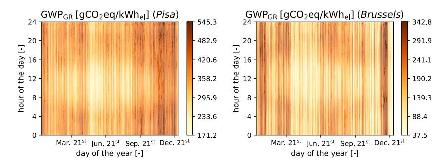

**Fig. 7.3** Temporal heatmaps representing the historical carbon intensity of grid electricity GWPGR for Pisa (2021) and Brussels (2022). Data from Electricity Maps [\[238,](#page-269-6) [239\]](#page-269-7).

age, it may still remain high during peak periods due to the use of fossil peakers. Given its impact (as shown in Section [7.3.1\)](#page-199-1), this aspect certainly deserves further investigation in future studies. However, this introduces a series of methodological challenges, as the hourly prediction of GWPGR over a 30-year period is highly uncertain. Let us therefore acknowledge that, in the context of the ongoing energy transition, using the year 2021 as a reference for the GWP of grid electricity over the entire system lifetime biases the optimal design—the system is likely to be somewhat over self-sufficient. Nevertheless, it offers preliminary results that could serve as a foundation for more prospective analyses.

#### Photovoltaic system

The model for rooftop PV systems is based on the *'market for photovoltaic slantedroof installation, 3kWp, single-Si, panel, mounted, on roof'* activity from ecoinvent. The activity considers the panels, the mounting system, the inverter and the electrical installation, as well as the electricity consumed when mounting the system on site.

The model for PV panels was updated as it was largely outdated (dating back to 2005) and significantly overestimated certain indicators (e.g., GWP) compared to current technology. The high-quality work from Müller et al. [\[240\]](#page-269-8) was used for that. Their study provides comprehensive inventories for glass-backsheet modules, reflecting modern production processes. It includes all details from raw silicon extraction to final assembly, with the exception of the metallisation paste composition for the front side, which remained confidential. To address this, the metallisation paste composition from ecoinvent was used as a reference: we assumed it consists of 70% silver and 30% chemical organic (back side has 50%/50% in [\[240\]](#page-269-8)).

With this updated model, GWPPV is evaluated at 1052 kgCO2/kWp while it was 2744 kgCO2/kWp with the original ecoinvent model. For comparison, ADEME recently reported an average value of 1050 kgCO2/kWp [\[244\]](#page-270-0).

#### Heat pump

The heat pump catalogue in ecoinvent is limited to brine-water systems, all extrapolated from a 10 kWth model, *'heat pump production, brine-water, 10kW'*. This heat pump uses *R134a* as a refrigerant, which has GWP = 1430 kgCO2eq/kg and is now banned under the EU F-gas Regulation. Additionally, the model accounts for non-negligible refrigerant leakages: 3% during production and 20% at endof-life, which together contribute to more than 60% of the total GWPHP. During operations, the ecoinvent model assumes an annual leakage rate of 6%–amounting to 120% over a 20-year lifetime.

To better reflect the air-source heat pump technology, the HP model was updated. Literature on the LCA for heat pumps reports a wide range of GWP values, largely depending on the choice of refrigerant and assumptions regarding leakage rates. While some studies neglect operational leakages [\[245,](#page-270-1) [246\]](#page-270-2), more conservative estimates typically range from 2%/y to 6%/y [\[247,](#page-270-3) [248\]](#page-270-4).

A comprehensive LCA for a 10 kWth domestic air-source heat pump is provided by Greening and Azapagic [\[241\]](#page-269-9), and their inventory is used for the present model. The main assumptions include refrigerant leakages of 3% during manufacture, 6%/y during operation, and 20% at decommissioning. Compared to the original refrigerant, we replaced *R134a* with *R600a* due to its low GWP and the need for high temperature heat (i.e., up to 95◦C). Although *R600a* is not a common replacement fluid for *R134a*, Part [I](#page-45-0) of this thesis has demonstrated its thermodynamic feasibility. The same charge is assumed, a reasonable approximation given the very low environmental impact of *R600a*.

#### Battery

ecoinvent does not have a model for domestic batteries. However, it includes several models of battery packs for automotive applications, including Nickel-Manganese-Cobalt (NMC), a technology that is also popular in domestic applications (e.g., Tesla Powerwall 2, LG Chem RESU) [\[237\]](#page-269-5). In this study, we have therefore chosen to represent the battery pack using the activity *'market for battery, Li-ion, NMC811, rechargeable, prismatic'*. The model includes battery modules, the battery management system, and packaging (casing, external enclosure, internal spacers, terminals). Based on the product description, the energy density is 148.9 Whel/kg. As a result, 6.716 kg are required per kWhel, leading to a GWPBAT = 113 kgCO2/kWhel. Note that Lithium-Ferro-Phosphate (LFP) is becoming a popular alternative for domestic storage (e.g., Tesla Powerwall 3), with similar footprints (i.e., GWPLi–LFP = 104 kgCO2/kWhel) [\[237\]](#page-269-5).

The lifespan of a battery is linked to the number of cycles if performs, the depths of charges and discharges, and C-rates. Evaluating the battery lifespan based on its operations would hence introduce non-linearities into the model, which is not feasible here. Nevertheless, for domestic applications with regular operating patterns, as described in Section [7.2.1,](#page-192-1) a 10-year lifespan is generally guaranteed. This

# **7** | Comparative life cycle assessment

model therefore assumes that the battery is replaced every 10 years. The consequences of this rough assumption is further discussed in the operational analysis in Section [7.3.1.](#page-199-1)

#### Thermal storage

Glass wool insulated steel tanks are assumed for stratified thermal storage. Since the temperature levels influence the energy density, different volumes (and thus impacts) must be considered for equivalent storage capacities. For the 95◦C case (30 K spread), the thermal energy density is *ρ*th = 33.64 kWhth/m3 , while for the 80◦C case (15 K spread), the density is *ρ*th = 16.97 kWhth/m3 . The model is based on the *'market for heat storage, 2000l'* activity in ecoinvent, which corresponds to a stainless steel tank including a heat exchanger and boiler for use in domestic solar heating systems. The corresponding impacts are GWPTES (95◦C) = 17.0 kgCO2eq/kWhth and GWPTES (80◦C) = 33.7 kgCO2eq/kWhth. If storage were implemented in two separate tanks instead of a single stratified tank, these impacts would roughly double.

It should be noted that GWPTES is not significantly lower than GWPBAT. When expressed in terms of exergy rather than energy, its value is even equivalent. The exergy densities for storage at 95◦C and 80◦C are 6.18 kWhex/m3 and 2.82 kWhex/m3 , respectively. The corresponding impacts are GWPTES (95◦C) = 92.5 kgCO2eq/kWhex and GWPTES (80◦C) = 202.6 kgCO2eq/kWhex. This high footprint is largely due to the high energy consumption required for steel production (i.e., 5 kgsteel/kWhth and 10 kgsteel/kWhth are required for TES production). As discussed in Section [7.4,](#page-210-1) one alternative would be to use plastic reservoirs.

#### Heat engine

The heat engine selected for this residential application is a micro-ORC (i.e., kWel scale). Unfortunately, precise and comprehensive life cycle inventories for such commercial systems are still scarce [\[249\]](#page-270-5). Cioccolanti et al. [\[250\]](#page-270-6) provide a LCI for a 3.5 kWel ORC used in a micro-trigeneration system. However, it is limited to material flows and does not provide data on the energy required for manufacturing. While some ORC models are available in ecoinvent, they are restricted to the MWel scale. Due to the significant technological differences between micro-scale and large-scale ORCs–such as the use of plate heat exchangers instead of tube-inshell exchangers, and scroll or screw expanders rather than turbines–these models are not suitable for the present analysis.

The components used in the HP and ORC are very similar (finned tube for lowpressure heat exchangers, brazed-plate for high pressure heat exchangers, volumetric compressor/expander, and copper piping), with the exception of the expansion valve and the feed pump. We therefore propose a scaling approach. Assuming that the environmental impact is driven by the size of the high-pressure heat exchanger rather than the compressor/expander assembly, and considering a 10% efficiency for the ORC, we obtain a factor of 10 between the LCI of the ORC (per kWel) and that of the HP (per kWth). Although highly approximate, this assumption must be considered in light of the small size–thus low impact–of the ORC (see Section [7.3\)](#page-199-0).

# **7.3 Results and interpretation**

This section first introduces the nominal systems designs obtained after minimising greenhouse gas emissions (GHGtot). These serve as the basis for establishing the Life Cycle Inventory (LCI). Then, the impact of each component on the different midpoints is discussed.

# 7.3.1 Reference designs for Pisa

Fig. [7.4a](#page-200-0) depicts the greenhouse gas emissions (GHGtot) of the different configurations for various levels of grid electricity consumption (equivalent to energy self-sufficiency). The results clearly indicate that achieving energy self-sufficiency (i.e., zero grid consumption) is not an effective strategy, as it requires 'oversized' PV and storage assets, making GHGtot in Eq. [7.1](#page-194-1) driven by GHGconstruction. Given that grid electricity also has a significant carbon footprint, an optimal trade-off exists for minimising GHGtot. To ensure a fair comparison between different system topologies, these must deliver the same energy services to the housing development. In this study, this is reflected by maintaining the same annual grid electricity consumption (EGR). For Pisa, the optimal trade-off is found at approximately EGR = 25 MWhel/y (see Fig. [7.4a\)](#page-200-0).

The hourly GWPGR values used for system sizing (see Fig. [7.3\)](#page-196-0) cannot be used for the LCI and LCIA, as Electricity Maps does not provide other characterisation factors. Instead, for the LCA, the *'low-voltage electricity'* model from ecoinvent is used, with GWPGR = 364 gCO2eq/kWhel. To ensure a consistent transition from Electricity Maps data to the ecoinvent dataset for LCA, Fig. [7.4b](#page-200-0) depicts the average carbon intensity of the grid electricity consumed for the different system topologies. The maximum deviations for the scenario EGR = 25 MWhel/y are –0.7% and +2.2%, which is considered acceptable given the other inherent uncertainties in the analysis.

#### Nominal capacities for minimised greenhouse gas emissions

The breakdown of greenhouse gas emissions for the different systems corresponding to EGR = 25 MWhel/y is presented in Fig. [7.5.](#page-201-0) The nominal systems designs are reported in Table [7.3.](#page-200-1) The GHG breakdown reveals that approximately 80% of emissions stem from electricity production assets (GR + PV), except in the case of a battery alone, where this share is reduced to around 65%. On average,

# 7 | Comparative life cycle assessment

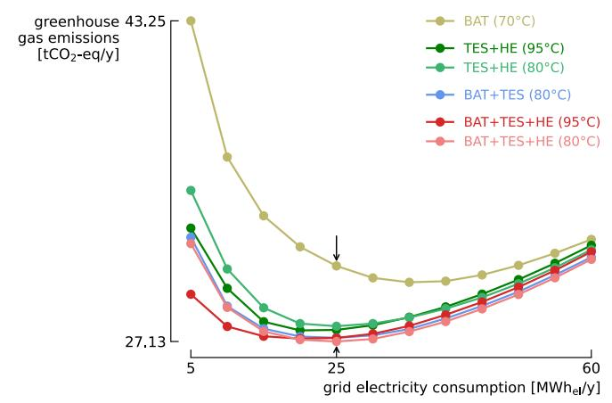

(a) Greenhouse gas emissions  $\mathrm{GHG_{tot}}$  of the six energy system topologies.

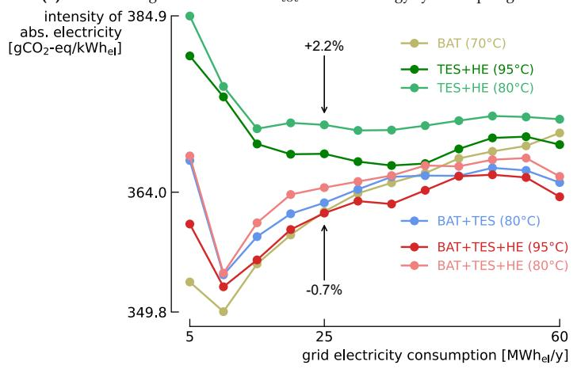

(b) Average footprint of absorbed grid electricity. Maximum deviations from ecoinvent for the case  $E_{\rm GR}=25~{\rm MWh_{el}/y}$  are -0.7% and +2.2%.

**Fig. 7.4** Greenhouse gas emissions and carbon footprint of grid electricity for the different energy systems in Pisa.

| <b>Topology</b> Units         | ${f P_{PV}^{nom}} \ { m kW_p}$ | $\dot{\mathbf{Q}}_{\mathbf{HP}}^{\mathbf{nom}}$ k $\mathrm{W}_{\mathrm{th}}$ | ${f E_{BAT}^{nom}}$ kWh $_{ m el}$ | $\begin{array}{c} \mathbf{Q_{TES}^{nom}} \\ \mathrm{kWh_{th}} \end{array}$ | ${f P_{HE}^{nom}} \ { m kW_{el}}$ | $ m GHG_{tot}$ $ m tCO_2 eq/y$ |
|----------------------------------|--------------------------------|------------------------------------------------------------------------------|------------------------------------|----------------------------------------------------------------------------|-----------------------------------|--------------------------------|
| $BAT + TES + HE (80^{\circ}C)$   | 363                            | 462                                                                          | 84                                 | 1976                                                                       | 2.8                               | 27.1                           |
| BAT + TES + HE ( $95^{\circ}$ C) | 392                            | 474                                                                          | 69                                 | 2771                                                                       | 3.5                               | 27.3                           |
| BAT + TES ( $80^{\circ}$ C)      | 359                            | 436                                                                          | 139                                | 1941                                                                       | _                                 | 27.3                           |
| TES + HE ( $80^{\circ}$ C)       | 377                            | 531                                                                          | _                                  | 2332                                                                       | 10.9                              | 27.9                           |
| TES + HE ( $95^{\circ}$ C)       | 398                            | 529                                                                          | _                                  | 3125                                                                       | 11.2                              | 27.7                           |

760

465

30.9

322

Table 7.3 Nominal system designs for Pisa (25  $\mathrm{MWh_{el}}$  of grid electricity per year).

BAT (70°C)

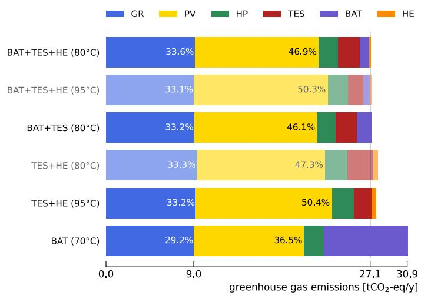

**Fig. 7.5** Breakdown of greenhouse gas emissions for the reference designs in Pisa. Approximately 80% stem from electricity production assets (GR + PV).

about half of the total emissions originate from the photovoltaic system, while one-third comes from the grid. This already puts the role of Carnot batteries into perspective: conversion and storage technologies contribute to less than 20% of the total footprint. Additionally, the footprint associated with grid electricity consumption is around 9 tCO2eq/y in all cases. This indicates that sizing the systems to achieve the same annual consumption results in similar electricity flows (as evidenced by the identical footprint). This is further illustrated in the supplementary results presented in Appendix [E.](#page-246-0)

The lowest footprint (27.1 tCO2eq/y) is achieved with the BAT + TES + HE (80◦C) system. The 95◦C case has a slightly higher footprint (27.3 tCO2eq/y), due to the lower COPHP, which is not fully compensated by the increase in thermal density (less steel for the tank). The BAT + TES (80◦C) and TES + HE (95◦C) cases follow closely (+0.7% and +2.1% respectively). Since the differences are minimal and fall within the uncertainties of the characterisation factors, these systems can be considered to have an equivalent footprint. Notably, TES + HE (95◦C) outperforms TES + HE (80◦C), as the gains in density and heat engine efficiency offset the loss in COPHP. Moreover, when comparing BAT + TES + HE with BAT + TES, one can see that the inclusion of the heat engine enables a substantial downsizing of the battery capacity (–40%), while maintaining equivalent photovoltaic and thermal storage capacities, and slightly increased heat pump capacity (see Table [7.3\)](#page-200-1).

A strong takeaway from these results is that, from a carbon footprint perspective, the single Carnot battery (without Li-ion battery) is a viable option. For a similar case study, Frate et al. [\[125\]](#page-259-10) even reported that Carnot batteries reduced the carbon footprint more importantly than Li-ion batteries. However, it is cru-

#### 7 | Comparative life cycle assessment

cial to note that this conclusion is specific to our assumptions, including the fixed lifetime of the different components (particularly for the battery, whose model is rather conservative). Further studies would be valuable to confirm these findings.

For all cases, the nominal thermal power of the heat pump  $\dot{Q}_{HP}^{nom}$  exceeds the maximum thermal load (342.3 kWth, see Fig. 6.2). This results from the fact that  $\dot{Q}_{HP}^{nom}$  is defined for a source temperature of 15°C, while the limiting factor for the heat pump power is the compressor capacity. When the ambient air temperature is lower (e.g., 5°C, see Fig. 6.2), the effective  $\dot{Q}_{HP}^{nom}$  decreases accordingly. Consequently, the model increases  $\dot{Q}_{HP}^{nom}$  above the maximum thermal load, so as to increase the compressor nominal power.

Finally, it should be noted that, compared to Chapter 6, despite a lower electricity demand (as cooling is not accounted for in this chapter), significantly more photovoltaic capacity is installed. For the considered costs, it ranged from  $73~\rm kW_p$  to  $118~\rm kW_p$  in Chapter 6, while here, it spans from  $322~\rm kW_p$  to  $398~\rm kW_p$ . This clearly demonstrates that the environmental optimum is far from the financial optimum: cleaner systems cost more, indicating the important role of properly designed incentives.

#### Optimal systems operations

This section discusses the operations of several components to understand what drives the optimal system designs (see Fig. 7.6 and Appendix E for complementary results). It is also interesting to compare how environmentally optimal systems are operated compared to financially optimal systems.

Regarding the battery, it charges primarily using photovoltaic electricity, mainly at the end of the day during the warm season. Discharging occurs the rest of the time, but at a significantly lower power level (see Figs. 7.6a, 7.6c, & 7.6e). In the case of a single battery, due to the absence of thermal storage, the battery is also used to power the heat pump during the cold season (see Fig. 7.6e). Its capacity is primarily sized for this purpose. As a result, this 'oversizing' leads to a significantly lower number of discharge cycles ( $N_{\rm BAT}^{\rm cylces}$ ), as the full capacity is not exploited during the warm season (see Table 7.4). As the battery lifetime is directly proportional to the

**Table 7.4** Optimal system operations for Pisa.  $N^{\rm cycles}$  is the number of discharge cycles,  ${\rm CF_{HP}}$  the heat pump capacity factor and  ${\rm frac_{HE}}$  the fraction of the dwelling electricity consumption covered by the heat engine.

| Topology                         | $COP_{HP}$ | $\eta_{ m HE}$ | $N_{ m BAT}^{ m cycles}$ | $N_{TES}^{cycles}$ | $CF_{HP}$ | $frac_{HE}$ |
|----------------------------------|------------|----------------|--------------------------|--------------------|-----------|-------------|
| Units                            | _          | %              | _                        | _                  | %         | %           |
| $BAT + TES + HE (80^{\circ}C)$   | 2.7        | 7.5            | 347                      | 103                | 7.9       | 5.9         |
| BAT + TES + HE ( $95^{\circ}$ C) | 2.5        | 8.1            | 364                      | 84                 | 8.2       | 9.2         |
| BAT + TES ( $80^{\circ}$ C)      | 2.7        | _              | 257                      | 139                | 7.1       | _           |
| TES + HE ( $80^{\circ}$ C)       | 2.9        | 7.0            | _                        | 188                | 11.8      | 32.1        |
| TES + HE ( $95^{\circ}$ C)       | 2.6        | 7.8            | _                        | 135                | 11.4      | 32.9        |
| BAT (70°C)                       | 3.0        | -              | 110                      | _                  | 6.6       | _           |

number of cycles, this clearly shows that assuming equivalent lifespans across the different cases is not appropriate. This will require more accurate representations in future works, introducing non-linearities or considering different lifetimes.

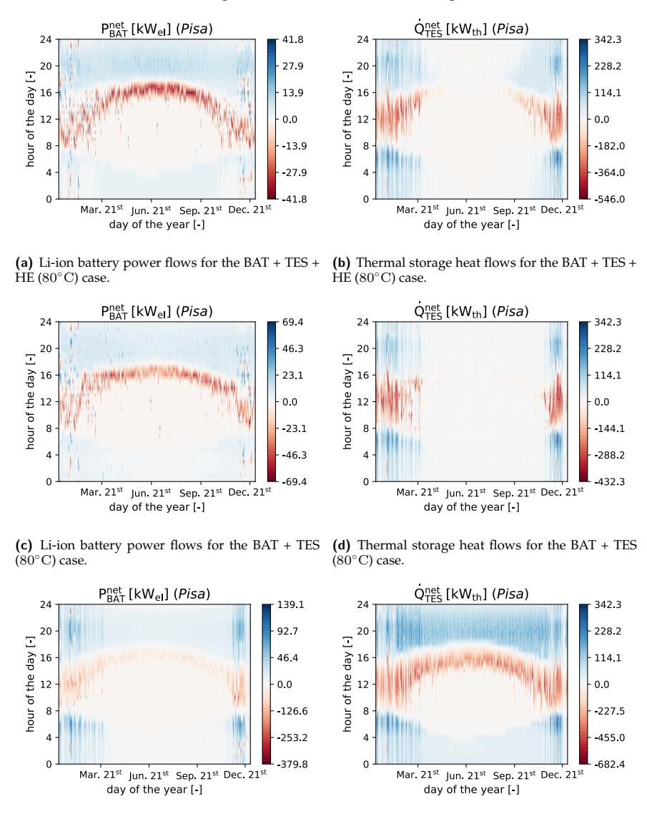

**(e)** Li-ion battery power flows for the BAT (70◦C) case. **(f)** Thermal storage heat flows for the TES + HE (95◦C) case.

**Fig. 7.6** Optimal battery and thermal storage operations (Pisa). Red color corresponds to net absorption (i.e., charge), while blue corresponds to net production (i.e., discharge).

# **7** | Comparative life cycle assessment

Thermal storage is always sized to handle peak heating demands in the morning and evening during the cold season (see Figs. [7.6b,](#page-203-0) [7.6d,](#page-203-0) & [7.6f\)](#page-203-0). The heat pump charges it using photovoltaic electricity whenever possible, or using grid electricity when its carbon intensity is low. In the TES + HE (95◦C) case, there is no battery to store electricity during the warm season. As a result, thermal storage remains in use throughout this period, unlike in cases with a battery (see Fig. [7.6f\)](#page-203-0). This logically leads to a higher number of cycles (see Table [7.4\)](#page-202-0).

In the BAT + TES + HE (80◦C) case, the heat engine plays a marginal but essential role. While it only covers 5.9% of the electricity demand (see Table [7.4\)](#page-202-0), it provides additional generation and storage capacity during peak demands in the morning and evening at the end of autumn and winter (see Fig. [7.7a\)](#page-204-1). Despite its small capacity (2.8 kWel), it enables a significant downsizing of the battery by nearly 40%, reducing its nominal power from 69.4 kWel down to 41.8 kWel (see Figs. [7.6a](#page-203-0) & [7.6c\)](#page-203-0). In the TES + HE (95◦C) case, the heat engine serves the same purpose as in Chapter [6:](#page-155-0) it generates electricity to meet peak demand in the mornings and evenings during the warm season. However, its contribution is significantly higher, covering about one-third of the total electricity demand thanks to its nominal power of nearly 12 kWel. Also, the operating period is much longer.

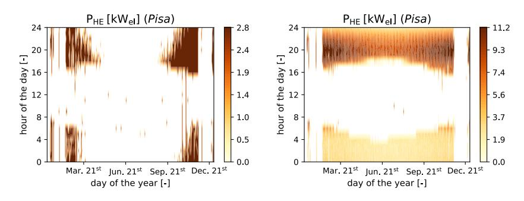

**(a)** Heat engine operations for the BAT + TES + HE (80◦C) case. **(b)** Heat engine operations for the TES + HE (95◦C) case.

**Fig. 7.7** Optimal heat engine operations (Pisa). When used in parallel with a battery, it provides additional generation and storage capacity during peak demand periods in the mornings and evenings at the end of autumn and winter.

# 7.3.2 Impact assessment

Relative midpoints comparison

The different midpoints indicators are compared with the radar chart in Fig. [7.8.](#page-205-0) Clearly, the case with battery alone is worst for all midpoints, except for carcino-

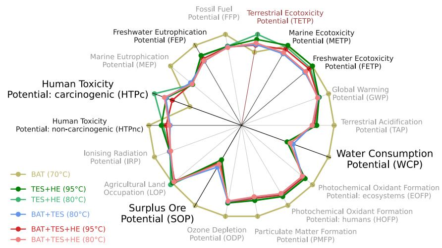

Fig. 7.8 Relative comparison of the six topologies with respect to the 18 midpoints of the ReCiPe method (Pisa). Overall, BAT (70°C) is worst. Black labels represent midpoints for which the relative deviation between best and worst is above 5%, excluding BAT (70°C). Grey labels indicate the others. The red label marks TETP, which is strongly affected by the excessive and erroneous Cobalt(II) emissions.

genic human toxicity potential and terrestrial ecotoxicity potential. In both cases, this difference is mainly due to the steel used for thermal storage production. Regarding terrestrial ecotoxicity, this is caused by coke production, necessary to produce pig iron (thereafter transformed into proper steel). During the coke production process, Cobalt(II) is rejected to the atmosphere. After investigation, we found that the Cobalt(II) emissions were overestimated in ecoinvent 3.10 due to incorrect emission values in the coke production process. As this was only corrected in November 2024 with ecoinvent 3.10.1, the terrestrial ecotoxicity potential reported in Fig. 7.8 should be disregarded. The developers announced that these erroneous emission values would affect the following impact categories: ecosystem quality, ecotoxicity, human health, and human toxicity. For human toxicity, the important difference between the case with battery alone and the topologies containing thermal storage is mostly due to Chromium(VI) emissions (water contamination), as represented by the potentials breakdown in Fig. 7.9 (see below).

Excluding the battery alone case, the others have midpoint indicators within a narrow range. Drawing firm conclusions may be risky due to uncertainties in both the LCI and LCIA. However, analysing the contribution of each component can help identify key drivers.

For 9 out of the 18 midpoints (refer to Fig. 7.8: FFP, IRP, LOP, ODP, PMFP, HOHP, EOFP, TAP, and GWP), the configuration with the lowest environmental footprint is Li-ion battery combined with Carnot battery. The configuration without a heat engine (BAT + TES (80°C)) performs best on 4 indicators, mainly related

# **7** | Comparative life cycle assessment

to ecotoxicity (see Fig. [7.8:](#page-205-0) FEP, HTPnc, FETP, and METP). The configuration with only a Carnot battery (TES + HE (95◦C)), leads on three indicators: SOP, WCP, and MEP. It even has a marked advantage for SOP and WCP, as discussed below.

From this comparative analysis, it is clear that the battery alone is the least favourable configuration. This is mainly due to its inability to fully leverage sector coupling, which results in an oversized battery, but also to the (over-)conservative assumption regarding its lifetime (limited to 1100 cycles, see Table [7.4\)](#page-202-0). The other configurations exhibit more similar impacts. However, configurations including at least a Carnot battery perform better on 12 out of 18 indicators. Therefore, while not a game changer, the Carnot battery can nonetheless contribute to reducing the environmental footprint of domestic energy systems. Moreover, this case study confirms its potential to limit mineral resource depletion.

## Indicators breakdowns

For each energy system topology, this section analyses the contribution of different components to the midpoint indicators. This helps identify the key drivers.

**Human carcinogenic toxicity** is assessed with the risk increase of cancer disease, and measured with the human carcinogenic toxicity potential (HTPc), expressed in kg 1,4-dichlorobenzene-equivalents (kg 1,4-DCB-eq). Thermal storage is a major contributor due to the use of steel, which is associated to Chromium(VI) releases into the environment during the production phase (see Fig. [7.9\)](#page-207-0). These emissions occur during the treatment of slags (landfill) from the electric arc furnaces in the steel production process. The PV system and the HP are also significant contributors. With limited expertise, assessing the plausibility of this result is challenging. However, some experimental studies suggest that ecoinvent may overestimate the Chromium(VI) emission factors by approximately two orders of magnitude [\[251\]](#page-270-7). This result clearly highlights the importance of conducting a deeper analysis when unexpected outcomes arise. It also demonstrates that iterations can occur between the interpretation phase and the LCI phase.

When thermal storage is non-pressurised and does not require high strength, it could be built using plastic reservoirs (e.g., IBC containers) to reduce steel usage. Besides the beneficial impact on human health, this would also lower costs and reduce the footprint on other indicators, such as mineral resource scarcity.

**Mineral resource scarcity** is assessed with the increase of ore extracted, and measured with the surplus ore potential (SOP), expressed in kg copper-equivalents (kg Cu-eq). For the case with only a battery, the latter is by far the main contributor due to the important ore extraction necessary for its production (i.e., spodumene, bastnaesite, monazite, nickel sulfate and cobalt hydroxide), as depicted by Fig. [7.10.](#page-208-0) These minerals are necessary for the production of lithium, cerium and other rare earths, which compose the Li-NMC battery packs.

In system topologies that include a Carnot battery, PV, HP, and TES are the main contributors to SOP due to the use of alloyed steels and other metals, particularly

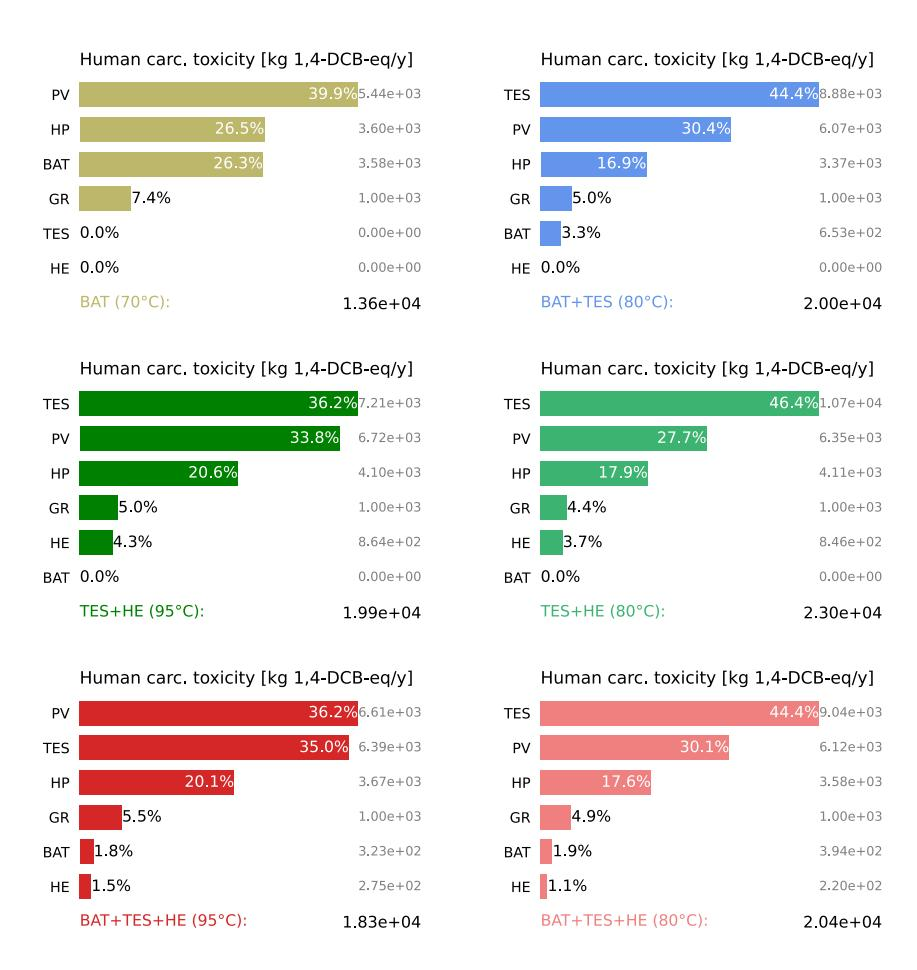

**Fig. 7.9** Breakdown of the human carcinogenic toxicity potential (HTPc) for the different energy system topologies. The main driver is the TES in most cases. This is due to the use of steel, whose production contributes to Chromium(VI) emissions.

cerium, copper, molybdenum, iron, and nickel. The contribution of the battery is significantly lower. Moreover, thanks to the downsizing of the battery enabled by the Carnot battery, the SOP of the BAT + TES + HE (80◦C) case is –7.3% lower than that of the BAT + TES (80◦C) case. The TES + HE (95◦C) case achieves an even greater reduction of –17.8%.

If there is one indicator where the Carnot battery stands out compared to the Liion battery, it is mineral resource scarcity. Despite its significantly lower power-topower efficiency (nearly a factor of 5), it substantially reduces the system SOP footprint (by about –20% in this case) without significantly increasing its GWP (+2%, refer to Section [7.3.1\)](#page-199-1). For configurations with higher efficiencies (e.g., higher stor-

# **7** | Comparative life cycle assessment

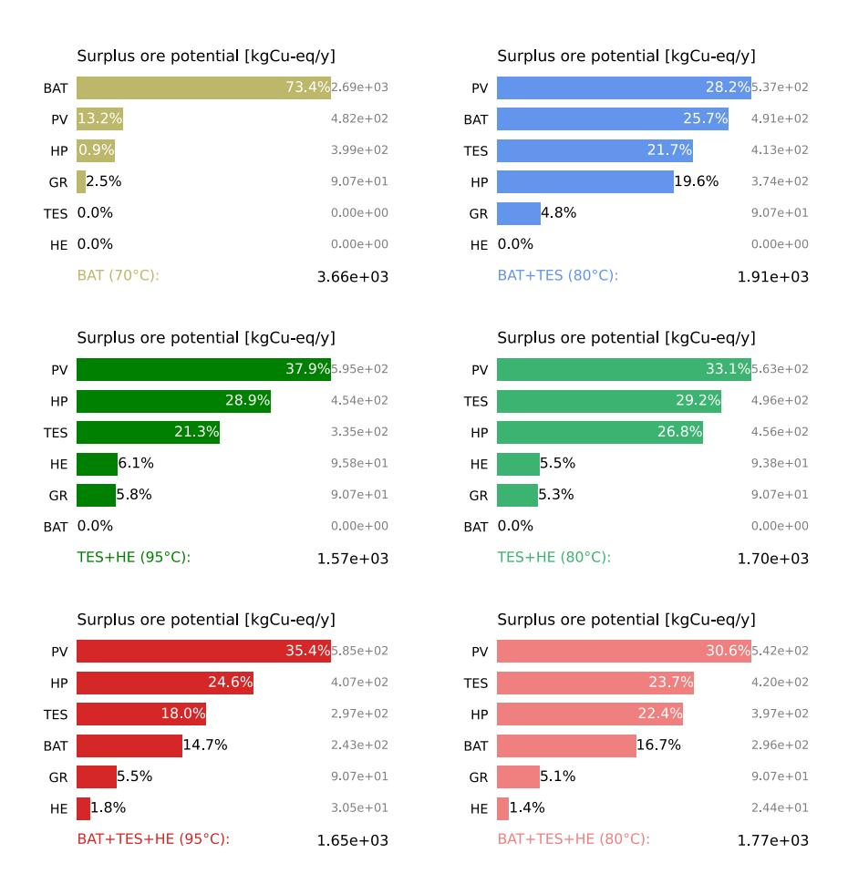

**Fig. 7.10** Breakdown of the surplus ore potential (SOP) for the different energy system topologies. The main driver is the PV in most cases. This is due to the use of rare earths and alloyed steel, whose production consumes important mineral resources.

age temperatures), the reduction in SOP compared to the Li-ion battery should be even more pronounced. This deserves further quantification in future studies.

**Water use** is assessed with the increase of water consumed, and measured with the water consumption potential (WCP), expressed in m³ water-equivalents consumed (m³ water-eq). The PV system is the primary contributor to WCP (see Fig. [7.11\)](#page-209-0) due to water consumption for electronic processes (e.g., silicon processing) and, to a lesser extent, the electricity required for these processes. Grid electricity consumption is the second-largest contributor, mainly due to hydropower plants, where part of the water evaporates, affecting the natural water cycle. For the case with battery alone, the latter is the main contributor. The impact stems

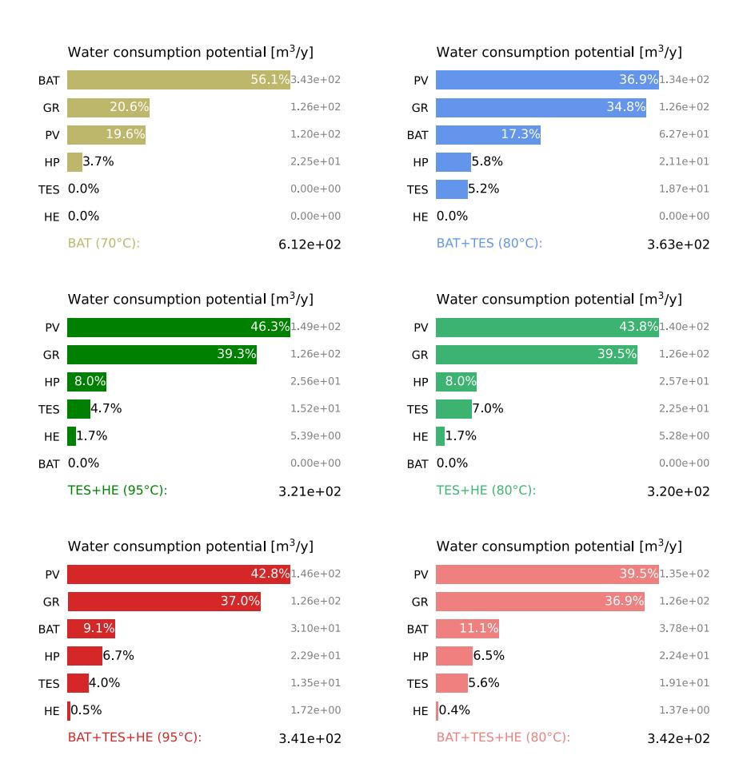

**Fig. 7.11** Breakdown of the water consumption potential (WCP) for the different energy system topologies. The main driver is the PV in most cases, due to electronic processes. The impact of GR and BAT is essentially caused by evaporation in Alpine hydropower reservoirs.

from the electricity used in cobalt production, which also relies on hydropower in the ecoinvent model (assumption due to lack of more precise information).

The significant impact of hydropower reservoirs is primarily due to the way water consumption is accounted for. Evaporative losses mean that water is no longer available for downstream ecosystems and human use, even though it remains within the broader water cycle.

# 7.3.3 Comparison with Brussels

To asses the effect of climatic and regional variations, the case Brussels is compared to the reference case of Pisa, like in Chapter [6.](#page-155-0) On average, Brussels has a larger heating demand, a lower ambient temperature (thus lower COPHP), a lower photovoltaic potential, but a cleaner electricity mix (average footprint is about 200 gCO2eq/kWhel).

Compared with Pisa, Brussels consumes four times more grid electricity to reach minimum GHG emissions of 27.2 tCO2eq/y (see Fig. [7.12\)](#page-210-2). This is both attributed to the 35% larger space heating demand and to the 45% cleaner grid electricity mix. The corresponding GHG breakdown is depicted in Fig. [7.13.](#page-211-1) Due to the lower energy self-sufficiency, the grid contribution is larger while the photovoltaic contribution is smaller.

The key difference from Pisa is the much smaller battery capacity for the case BAT (70◦C), which reduces the GHG emissions and offers comparable performance with the BAT + TES + HE (80◦C) case. This result is mainly due to the higher heat demand, where the gain in COPHP from the lower delivery temperature (i.e., 70◦C) has a highly favorable effect. However, this result is somewhat of a modeling artifact since it does not take advantage of the low GWPTES and is directly linked to the fact that the HP can only produce heat at a single temperature, whether supplying the district heating network (70◦C) or thermal storage (80/95◦C). It therefore prompts us, as discussed in Chapter [6,](#page-155-0) to model heat pumps capable of producing heat at different temperature levels depending on whether they supply the thermal storage or the district heating directly. Another alternative would be to use different heat pumps for these two functions. This deserves further consideration for future studies.

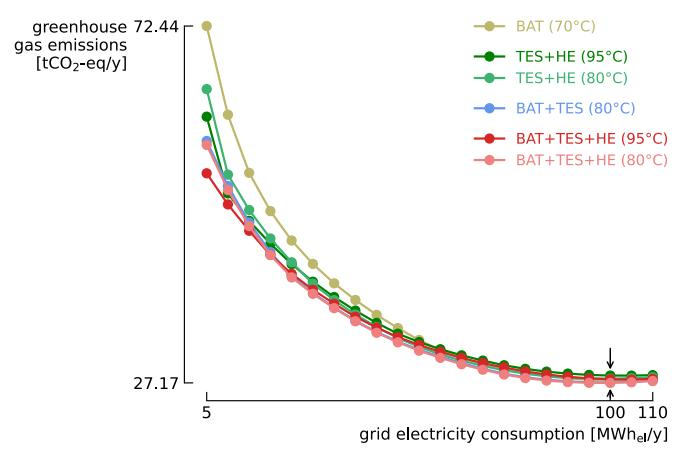

**Fig. 7.12** Greenhouse gas emissions GHGtot of the six energy system topologies in Brussels.

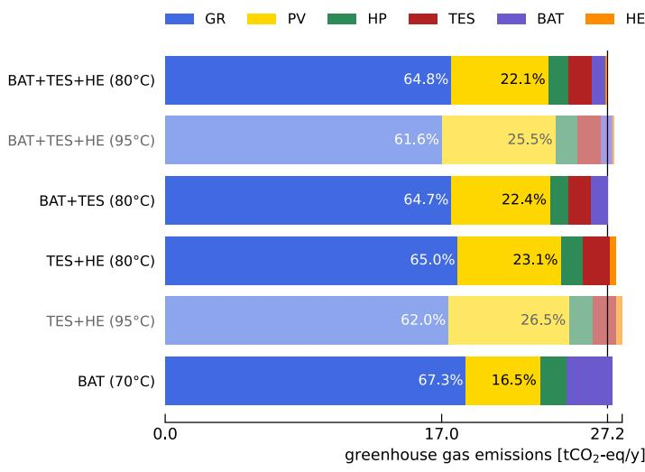

**Fig. 7.13** Breakdown of greenhouse gas emissions for the reference designs in Brussels. Approximately 85% stem from electricity production assets (GR + PV).

# **7.4 Summary and discussions**

This chapter conducted a comparative LCA of Li-ion batteries and Carnot batteries for managing heat and power in a housing development. Six different energy system topologies were evaluated, differing by their storage technologies–Li-ion battery, thermal storage, heat engine, and hybrid configurations. All the systems were grid-connected and integrated rooftop PV alongside a central heat pump supplying heat to a district heating network. Their nominal designs were optimised using linear programming to minimise greenhouse gas emissions. Trade-offs between the different environmental indicators for optimal design were not explored in this study. Following this design optimisation, a comparative impact assessment was conducted to evaluate the environmental footprint of the reference designs. Given this prospective approach–where the LCA does not compare existing designs but rather optimises them to reduce their footprint–conclusions should be interpreted cautiously due to uncertainties in life cycle inventory and impact assessment. This section discusses the key findings and offers perspectives for future works.

# 7.4.1 Main results

To minimise greenhouse gas emissions, there exists an optimal level of energy self-sufficiency. Given the rigid demand, achieving full self-sufficiency is not effective, as it leads to an oversized system. Moreover, this optimal level depends on

# **7** | Comparative life cycle assessment

boundary conditions such as climate and the carbon footprint of the grid electricity. For the different considered energy system topologies, electricity generation assets are responsible for 80 – 85% of the total GHG emissions. This highlights the marginal benefits that the Carnot battery can provide.

Although the GWP of the different topologies is in a narrow range, the optimal design is a hybrid configuration combining the Carnot battery and the Li-ion battery. The Carnot battery takes advantage of the thermal storage, which is sized to meet heat demand, to provide additional electricity generation capacity during critical hours of the year. The heat engine is used to manage peak demand in the mornings and evenings at the beginning and end of winter. Although it covers only less than 10% of the total electricity demand, it enables a reduction in Li-ion battery capacity of up to –40%.

For the case of a Carnot battery without Li-ion battery, the heat engine operates almost year-round and covers nearly a third of the final electricity demand. While the GWP of this topology is only +2.1% higher than the identified optimum, this result demonstrates that the Carnot battery alone could be a sound alternative to the Li-ion battery. However, this outcome is specific to the model assumptions, particularly the fixed battery lifetime and the constant heat pump delivery temperature. Conversely, a standalone Li-ion battery can also be a viable solution in terms of GWP, as illustrated by the Brussels case.

One final interesting result regarding GWP is that the environmental optimum is significantly more self-sufficient than the financial optimum (refer to Chapter [6\)](#page-155-0). This clearly highlights the conflicting nature of these two objectives.

Regarding the other environmental indicators, the relative comparison showed that the Carnot battery is not a game changer. All these indicators fall within a relatively narrow range, mainly because the photovoltaic system and grid electricity remain the primary contributors. Nevertheless, using a Carnot battery–most often along with a Li-ion battery–helps minimise 12 out of the 18 indicators.

The indicator where the Carnot battery specifically stands out is mineral resource scarcity. For the case with a Carnot battery alone (i.e., no Li-ion battery), the system has a Surplus Ore Potential nearly –20% lower than the case with a Li-ion battery and thermal storage, while maintaining a similar GWP (+2%).

# 7.4.2 Perspectives

A lever to reduce the footprint of the Carnot battery would be to use plastic tanks instead of steel for thermal storage. For non-pressurised storage, the material strength requirements are indeed much lower. For comparison, we implemented a storage derived from a 1 m3 polypropylene IBC container. For the 18 midpoints, the impact is reduced by –45% down to –90% (e.g., Surplus Ore Potential).

As discussed in Chapter [6,](#page-155-0) the model would also benefit from certain improvements. The first relates to the constant heat delivery temperature for the heat pump, which leads to a significant loss of exergy. This could be addressed either by using a variable temperature (i.e., producing at 70◦C when supplying the district heating network, and 80/95◦C when charging the storage), or by using two separate units. This would effectively improve the seasonal coefficient of performance. Studying this option is essential, as it could impact the conclusions about the potential of the Carnot battery. Indeed, it is possible that a heat engine is installed solely due to the (too) high temperature of the heat produced by the heat pump.

Another point, also discussed in Chapter [6,](#page-155-0) is that the Carnot battery is likely to be more competitive with the Li-ion battery in applications with higher temperature heat demand (e.g., industry). This would indeed help to increase the powerto-power efficiency and energy density (refer to Part [I\)](#page-45-0).

Another aspect of the model that requires improvement is the fixed lifetime assumption for the different components. As illustrated in Table [7.4,](#page-202-0) the annual number of cycles for the Li-ion battery can vary by a factor of more than three between different scenarios, while the capacity factor of the heat pump can vary by nearly two. This inevitably impacts the component lifespans and the number of replacements required. However, incorporating these operational aspects into the model, as implemented in Eq. [7.1,](#page-194-1) would introduce non-linearities. An alternative would be to consider different lifespans based on the number of cycles, by using an iterative approach.

The operational model of the battery also appears to be too restrictive. Recent performance enabled by LFP technology includes C-rates of 90%, depths of discharge close to 100%, and nearly 6000 cycles (e.g., Tesla powerwall 3). These higher C-rates could potentially allow for a reduction in battery capacity–particularly in cases where the sizing is dictated by peak absorption and injection requirements. Similarly, higher depths of discharge would contribute to reducing the required battery capacity. Additionally, the higher number of guaranteed cycles would reduce the need for replacements over the system lifetime, thereby lowering the overall impact on the project life-cycle. All of this clearly warrants more precise quantification in future analyses.

Given the assumptions made for the design (e.g., heat pump scaling for the heat engine), as well as the uncertainties surrounding the emission factors, conducting sensitivity analyses–particularly on the GWP of the various components– appears essential. Moreover, considering the 30-year project lifespan, performing a prospective LCA seems indispensable. With the ongoing energy transition, the GWP of the grid–which significantly influences the design–is expected to decrease. Similarly, the footprint of PV panels and Li-ion batteries is likely to drop. This will have a significant impact at the time of technology replacements.

# **7** | Comparative life cycle assessment

# **7.5 Key messages**

- In terms of GWP, all considered energy system topologies fall within a narrow range, except the standalone Li-ion battery (no thermal storage), which performs worse. For GWP, the Carnot battery is hence not a game changer.
- For hybrid designs with both a Carnot battery and a Li-ion battery, the key contribution of the heat engine is to reduce the battery capacity. It primarily serves for the morning and evening peaks at the beginning and end of winter.
- Standalone Carnot batteries (without Li-ion battery) also prove viable, with GHG emissions only about 2% higher than the optimal case. In this setup, the Carnot battery can cover up to one-third of the final electricity demand.
- The indicator where the Carnot battery stands out is mineral resource scarcity, with a reduction of about 20%. This impact could be further reduced by using plastic reservoirs, which would also positively affect other indicators.
- These results should be refined using more advanced and accurate models. In particular, optimising the heat pump delivery temperature and considering variable component lifetimes are key factors.

# **Conclusions and Perspectives**

T HIS thesis investigates Carnot batteries as flexibility options for heat and power. The considered applications focus on waste heat recovery and the combined storage of heat and electricity. The analyses concentrate on small- to medium-scale systems (< 1 MWel), storing heat at low temperatures (< 150◦C). The examined Carnot battery technology is based on vapour-compression heat pumps, sensible heat storage in pressurised water tanks, and organic Rankine cycles. For the thermodynamic cycles, only pure working fluids are considered.

This work contributes to characterising the techno-economic potential of Carnot batteries in order to identify which configurations and designs could be effectively integrated into renewable energy systems. To this end, the question is approached from three complementary perspectives:

- **Thermodynamic optimisation**, aimed at mapping the theoretical maximum performance of different configurations and identifying alternative designs with similar performance;
- **Techno-economic optimisation**, based on scenario analyses, to understand how to improve the profitability of the designs and enhance their contribution to the energy systems, depending on the application;
- **Environmental optimisation**, to compare the performance of Carnot batteries with lithium-ion batteries across various environmental indicators.

From the results obtained in this work, we first present the key findings and main takeaways. Next, we offer recommendations for guiding the development of the technology in promising and relevant directions. Finally, we highlight the methodological limitations of the thesis and provide perspectives for future research in the field.

# **Main outcomes and key messages**

This section summarises five main outcomes of this work. Detailed conclusions can be found at the end of each chapter (see *Summary and discussions* sections).

# (**M-1**) **Diverse implementations can provide equivalent performance.**

For standalone Carnot batteries, basic thermodynamics reveals that storage temperature must be maximised to optimise both power-to-power efficiency and electrical energy density. In real machines, additional parameters must be considered, including the architecture (with or without recuperator), the regime (sub- or transcritical), the degrees of superheating and subcooling, the working fluids, and the temperature spread between the hot and cold tanks. For systems limited to 120◦C and based on volumetric machinery (75% efficiency), optimised designs yield efficiencies and densities close to 34% and 3.8 kWhel/m3 , respectively. However, these maximum performances only correspond to two thermodynamic designs–one optimised for efficiency, the other for density–which may not be viable from a technoeconomic perspective (non-standard, too costly, etc.). Therefore, exploring near-optimal alternatives broadens the range of possible designs–albeit with certain trade-offs. These may better align with some technological preferences, such as lower pressure and temperature levels, or suitable fluids. For instance, if the goal is to reduce the system cost by opting for non-pressurised storage (accepting a trade-off on density), efficiency is then limited to below 30%. Investigations also reveal that achieving high efficiencies is only possible with subcritical recuperated cycles operated using dry fluids. In contrast, high energy densities are not confined to a single configuration: subcritical or transcritical cycles, with or without recuperators, can be employed, and both dry and wet fluids are viable options. This allows for greater design flexibility. Efficiency and density can also be adjusted according to the designer preferences. For high efficiencies, the storage spread must be between 30 and 50 K, whereas a range of 60 to 90 K is necessary for high densities.

#### (**M-2**) **The Carnot battery trilemma must include application-specific constraints.**

Performance criteria when designing thermally integrated Carnot batteries include power-to-power efficiency and electrical energy density, but also exergy efficiency (combined heat and power recovery). However, these are conflicting, and this design issue is referred to as the *Carnot battery trilemma*. To optimise each indicator, specific trade-offs must be identified between the coefficient of performance of the heat pump, the efficiency of the organic Rankine cycle, and the thermal energy density for storage. These trade-offs are primarily driven by the storage temperature, the storage spread and the heat source glide. For distinct zones within the thermal domain (combination of source and sink temperatures) and according the objective sought, specific guidelines have been be formulated for these design parameters. Moreover, results showed that in the region where the difference between the source and the sink temperatures exceeds 30 K, maximising the powerto-power efficiency causes the Carnot battery to degenerate into a simple thermal storage coupled with an organic Rankine cycle (the heat pump lift becomes null). Hence, the system no longer works as proper electricity storage, but solely as a heat recovery option. In light of this, it is evident that the design of thermally integrated Carnot batteries cannot rely only on thermodynamic criteria. It should also be steered by application-specific constraints, such as the ratio between the required electricity output and the amount of heat available at the source. This was clearly illustrated in the data centres case study, where the power-to-power efficiency was never maximised.

## For Carnot batteries in waste heat recovery applications, the maximum storage capacity is directly proportional to the thermal power of the waste heat stream. However, depending on the application (e.g., data centres), the ratio between the available waste heat and the required storage capacity may be too restrictive. To overcome this and increase the storage capacity, the charging capacity can be boosted using dual-source heat pumps (e.g., heat pump combined with resistive heater). However, this introduces a capacityefficiency dilemma: for a given waste heat stream, increasing the thermal capacity of the dual-source heat pump reduces its coefficient of performance (e.g., due to the poor coefficient of performance of the heater). In the data centres case, for instance, a heater was required to enhance the energy self-

sufficiency. While this impacted the system profitability, the net present value nonetheless remained positive. More broadly, when no higher efficiency alternative is feasible, low-grade heat recovery (< 50◦C) is a relevant application for Carnot batteries. To improve their efficiency, more advanced configurations should be explored–such as dual-evaporator heat pumps and preheated organic Rankine cycles (to recover waste heat during discharge).

(**M-3**) **Dual-source heat pumps are necessary in waste heat recovery applications.**

# (**M-4**) **Combined heat and power storage is viable but requires optimal control.**

Carnot batteries can combine the production and storage of heat and power. We applied this concept to a residential case, where heat demand is concentrated in the colder season, especially during morning and evening peaks. In contrast, photovoltaic production peaks around midday and is higher during the warmer months. Assuming conservative investment costs, deploying a Carnot battery appeared financially preferable to having no storage capacity at all, provided that the heat and power flows can be optimally controlled. During the colder season, thermal storage acts as a daily buffer, helping to smooth the heat pump production and maximise its capacity factor. Due to the low photovoltaic output at that period, no electrical discharge takes place. Instead, in the warmer season, heat production is directly aligned with

| **201**

# ⋆ | Recommendations and guidance

photovoltaic generation, and is then used to power the heat engine in the morning and evening, covering 10% to 20% of the final electricity demand. Observing this, the minimum sizing of the energy system is primarily driven by heat demand. Yet, when costs allow, additional photovoltaic and heat engine capacities can be deployed to increase electricity self-sufficiency. Regarding the electricity pricing system, as with any storage project, non-zero feed-in tariffs significantly affect the profitability. Instead, dynamic retail tariffs encourage greater electrical storage capacity, so as to increase resilience against price variations. Yet, this also requires optimal control of the system.

# (**M-5**) **Carnot batteries need far fewer mineral resources than Li-ion batteries.**

The comparative environmental analysis revealed that, in residential applications, Carnot batteries are not game changers. When integrated into energy systems, the main contributors to environmental impacts remain the electricity drawn from the grid and the photovoltaic system. However, regarding mineral resource scarcity, the systems based solely on Carnot batteries have a footprint over 20% lower than that of systems using Li-ion batteries coupled with thermal storage. In terms of greenhouse gas, optimal designs combine both Li-ion and Carnot batteries. While this outcome depends on our specific model assumptions (e.g., battery C-rate, inflexible demand), it highlights the complementarity of the two technologies, with Carnot batteries contributing to reducing the Li-ion batteries capacity. Also, energy systems relying exclusively on Carnot batteries can achieve comparable performance across different impact categories. This demonstrates the environmental viability of such configurations, where Carnot batteries could cover up to 30% of the final electricity demand.

# **Recommendations and guidance**

Four recommendations for pursuing the development of Carnot batteries.

## (**R-1**) **Designers must find the subtle balance between cost and efficiency.**

Due to thermodynamic limits, small-scale Rankine Carnot batteries will not reach competitive efficiencies with other well-developed technologies, such as electro-chemical batteries. Moreover, any improvement in efficiency leads to greater complexity, which in turn increases their cost. Yet, Carnot batteries precisely need to reduce their cost, as they are currently non-competitive. By accepting trade-offs on efficiency, their design could be simplified and standardised, leading to cost reductions. For example, low-temperature, nonpressurised storage (e.g., plastic tanks ≤ 95◦C) could considerably lower the energy-specific cost (e/kWhel), which is a significant advantage for longduration storage (> 8h). This would also reduce the power-specific cost (e/kWel) by lowering the temperature levels and pressure ratios in the cycles. To avoid paying twice for the electricity-to-heat conversions, it is also essential to develop invertible heat pump/organic Rankine cycles. This introduces a series of interesting trade-offs between charging and discharging performance. Finally, this cost-over-efficiency trade-off was well illustrated in the data centre case study: resistive heating was preferable to heat pump.

## (**R-2**) **Heat and power coupling seems necessary for economic viability.**

At small-scale, pure electricity storage using Carnot batteries does not appear economically sound, due to their high cost and low efficiency. However, thermal coupling can both increase the power-to-power efficiency and diversify the portfolio of revenue streams, by enabling more flexible operations of the system. Therefore, characterising and optimising Carnot batteries in this direction appears to be the way forward. These conclusions are also echoed in the Technology Collaboration Programme on Energy Storage of the International Energy Agency (Tasks 36 and 44).

# (**R-3**) **Higher temperatures should be targeted for combined heat and power.**

The higher the storage temperature, the greater the efficiency and density of a Carnot battery. To maximise profitability in combined heat and power applications, it is therefore crucial to target use cases where the required heat temperature closely matches the maximum storage temperature. The 100–150◦C range, for example, corresponds to a broad range of industrial sectors, such as pulp and paper, food processing, pharmaceuticals, and chemicals. Moreover, for a sound application, the heat demand should ideally be intermittent (seasonally, weekly, or daily) to enable periods of electrical discharges. Profitability would also be further enhanced if renewable generation and/or low electricity prices occurred during off-peak periods–when both heat and electricity demand are minimal. The key challenge therefore lies in identifying niche applications that meet these conditions.

#### (**R-4**) **Comprehensive comparative techno-economic assessments are lacking.**

Over the past five years, numerous Carnot battery concepts and applications have emerged. However, the literature still lacks thorough comparative techno-economic assessments of these different cases, and a clear identification of all viable business models remains absent. For each application, it would be highly valuable to categorise which Carnot battery configurations deliver the best techno-economic performance and which ones should be deprioritised. Such a clarification of the state of the art would allow the technology to move forward towards the next stages of its development.

| **203**

# **Limitations and perspectives**

Four perspectives to address the methodological limitations of this work.

## (**P-1**) **Improve the numerical model for thermodynamic cycles.**

The numerical routines developed to simulate the thermodynamic cycles are stable and robust. However, they are far from optimal and can be slow, which is a major drawback for optimisation. One possible improvement would be to identify numerical solvers that are better suited to our specific problem. The discretisation within the heat exchangers could also be adapted to achieve a better trade-off between computational time and model accuracy. For transcritical cycles, the problem could be reformulated to more efficiently identify the optimal pressures. Additionally, to extend the model to zeotropic mixtures, the low-pressure heat exchanger model should also be discretised. The code itself could be streamlined by reducing redundancies in its formulation. Finally, regarding the dissemination of the model, it would be useful to improve its documentation and readability. This would enable the community to benefit from it more effectively and support its ongoing development.

# (**P-2**) **Consider operational constraints and performance degradations.**

This work focused on the thermodynamic design of Carnot batteries, while neglecting most technological and operational aspects. To support further development, it would be useful to employ more detailed models, particularly for performance prediction, component design optimisation, and technoeconomic assessments. These models should account for performance drops due to pressure losses, off-design and part-load operations, transients and cold starts, auxiliaries and electro-mechanical losses, as well as thermal losses in the storage system. They should also better incorporate operational constraints, such as minimum load requirements. Taking all these aspects into account will introduce significant non-linearities. For the simultaneous optimisation of designs and operations, this will likely require the use of Mixed-Integer Linear Programming instead of Linear Programming. Nevertheless, the required level of accuracy for the Carnot battery models must be set in perspective with the economic and operational uncertainties (components costs, demand levels, etc.).

#### (**P-3**) **Improve the optimisation methods and the generation of alternatives.**

The optimisation of thermodynamic cycles is a highly non-linear and discontinuous problem, notably due to the non-physical configurations that may be tested. This work was limited to the NSGA-II evolutionary algorithm, as it provided satisfactory performance. However, it would be relevant to benchmark various meta-heuristic algorithms for this problem, as the conclusions could be useful beyond the field of Carnot batteries (e.g., design of heat pumps, organic Rankine cycles). Additionally, the management of fluids as a discrete optimisation variable could be reconsidered: perhaps they should be classified based on hybrid criteria, including critical temperature, acentric factor (which affects the slope of the saturated vapour curve), etc. Surrogate modelling with machine learning is an alternative, but this does not seem indispensable (the computation time for optimisation remains acceptable). It would also be of interest to benchmark this fluid selection method against so-called 'reverse engineering' approaches, which begin by defining an ideal fluid and then seek to identify a real fluid with comparable properties. As for generating near-optimal alternatives, the proposed method, which is based on maximising the Euclidean distance from the Pareto front, works but is neither efficient nor guarantees global convergence. Given the limited number of methods proposed in the literature, there is opportunity for innovation.

## (**P-4**) **Integrate prospective analyses and better account for uncertainties.**

The cost of technologies, the price of energy carriers, and their environmental footprint will evolve over time, in an uncertain manner. For example, the environmental footprint of grid electricity is expected to decrease, while its price is likely to fluctuate more and more on the spot markets. This would therefore affect the techno-economic performance of designs that have been optimised for fixed and deterministic parameters. To produce more robust analyses, it seems essential to integrate more systematically prospective– albeit uncertain–elements into techno-economic and environmental analyses. Robust optimisation (also known as stochastic optimisation) of the designs would also be an opportunity to integrate technological uncertainties in the design loop (e.g., pressure drops, heat transfer coefficients, machines efficiency, etc.). This would require operational models (instead of pure thermodynamic models). Methodological improvements are however required to handle such non-linear and discontinuous problems (e.g., relaxed model formulation using penalty functions to guarantee convergence, etc.).

| **205**

# **Final thoughts**

In a world with virtually infinite resources, it seems unlikely that the Carnot battery will carve out a prominent place in the energy storage market. Due to its low efficiency and high power-specific cost, its techno-economic performance will likely remain inferior to that of other technologies, such as electro-chemical batteries. At best, the Carnot battery might contribute on the margins, in a few niche applications where the heat-power coupling is a real asset.

Nevertheless, in a world with finite and hard-to-access resources, the Carnot battery offers a complementary storage option–simple, robust, easily repairable, and well-proven; after all, mankind has mastered steam for over 200 years! Its limited reliance on strategic materials will be a major asset when their scarcity will necessitate more optimal and judicious use. Depending on the applications and context, the Carnot battery is thus unlikely to remain relegated to the bottom of the merit order curve. I believe it is therefore relevant to develop a body of knowledge around it, even if its time has yet to come.

# **Appendices**

# **A Fundamentals of thermodynamics**

# A.1 Lorenz cycle for non-isothermal heat transfers

The Lorenz cycle is based on isentropic compression and expansion, but unlike the Carnot cycle, the heat transfers between the working fluid and the cold and hot sources are non-isothermal (see Fig. [A.1\)](#page-224-0). Referring to the nomenclature of Fig. [A.1,](#page-224-0) the coefficient of performance of heat pumps following reversed Carnot and Lorenz cycles is given by

$$COP_{Carnot} = \frac{T_{H}}{T_{H} - T_{L}} , \qquad (A.1)$$

$$COP_{Lorenz} = \frac{\overline{T}_{H}}{\overline{T}_{H} - \overline{T}_{L}}$$
, (A.2)

with TH and TL the mean sink and source temperatures, defined as

$$\overline{T}_{H} = \frac{T_{H} - (T_{H} - \Delta T_{H})}{\ln(T_{H}/(T_{H} - \Delta T_{H}))}$$
, (A.3)

$$\overline{T}_{L} = \frac{T_{L} - (T_{L} - \Delta T_{L})}{\ln(T_{L}/(T_{L} - \Delta T_{L}))} \quad . \tag{A.4}$$

Conversely, the efficiency of heat engines following Carnot and Lorenz cycles is given by

$$\eta_{\rm Carnot} = \frac{T_{\rm H} - T_{\rm L}}{T_{\rm H}} \quad , \tag{A.5}$$

$$\eta_{\rm Lorenz} = \frac{\overline{\rm T}_{\rm H} - \overline{\rm T}_{\rm L}}{\overline{\rm T}_{\rm H}} ,$$
(A.6)

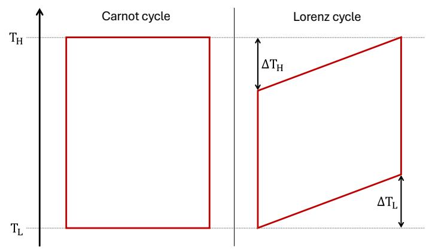

Fig. A.1 Illustration of the Carnot and Lorenz cycles for heat engines on the temperatureentropy diagram.

with  $\overline{T}_H$  and  $\overline{T}_L$  the mean source and sink temperatures defined as

$$\overline{T}_{H} = \frac{T_{H} - (T_{H} - \Delta T_{H})}{\ln(T_{H}/(T_{H} - \Delta T_{H}))} \quad , \tag{A.7}$$

$$\overline{T}_{L} = \frac{T_{L} - (T_{L} + \Delta T_{L})}{\ln(T_{L}/(T_{L} + \Delta T_{L}))} \quad . \tag{A.8}$$

Second law efficiencies are effective indicators for comparing the performance of heat pumps and heat engines with different heat sources and heat sinks. These can be defined as the fractions of the Carnot or Lorenz efficiencies:

$$\Psi_{\rm HP}^{\rm Carnot} = \frac{\rm COP_{\rm HP}^{\rm real}}{\rm COP_{\rm HP}^{\rm Carnot}} \ , \tag{A.9}$$

$$\Psi_{\text{ORC}}^{\text{Carnot}} = \frac{\eta_{\text{ORC}}^{\text{real}}}{\eta_{\text{ORC}}^{\text{Carnot}}} , \qquad (A.10)$$

$$\Psi_{\rm HP}^{\rm Lorenz} = \frac{{\rm COP}_{\rm HP}^{\rm real}}{{\rm COP}_{\rm HP}^{\rm Lorenz}} \quad , \tag{A.11}$$

$$\Psi_{\rm ORC}^{\rm Lorenz} = \frac{\eta_{\rm ORC}^{\rm real}}{\eta_{\rm ORC}^{\rm Lorenz}} \ . \tag{A.12}$$

For vapour compression heat pumps and organic Rankine cycles, values of 0.5 are typically reported. Assuming constant fractions of the Carnot or Lorenz efficiencies, the performance of real machines can also be approximated for different heat sources and heat sinks,

$$COP_{HP}^{real} = \Psi_{HP}^{Carnot/Lorenz} \cdot COP_{HP}^{Carnot/Lorenz} , \qquad (A.13)$$

$$\begin{aligned} \text{COP}_{\text{HP}}^{\text{real}} &= \Psi_{\text{HP}}^{\text{Carnot/Lorenz}} \cdot \text{COP}_{\text{HP}}^{\text{Carnot/Lorenz}} \ , & \text{(A.13)} \\ \eta_{\text{ORC}}^{\text{real}} &= \Psi_{\text{ORC}}^{\text{Carnot/Lorenz}} \cdot \eta_{\text{ORC}}^{\text{Carnot/Lorenz}} \ . & \text{(A.14)} \end{aligned}$$

To illustrate, let us take a typical Carnot battery application with sensible heat storage (see Fig. [A.2\)](#page-225-1). Assuming constant Lorenz fractions of 0.5, Fig. [A.3](#page-225-2) compares the Carnot and Lorenz models for heat pumps and heat engines. Clearly, assuming isothermal heat transfers means underestimating the coefficient of performance of the heat pump (i.e., excessive irreversibility, for example, because the benefit of subcooling cannot be captured), and overestimating the efficiency of the heat engine (i.e., not enough external irreversibility, for example, because evaporation temperature is not affected by the storage temperature spread).

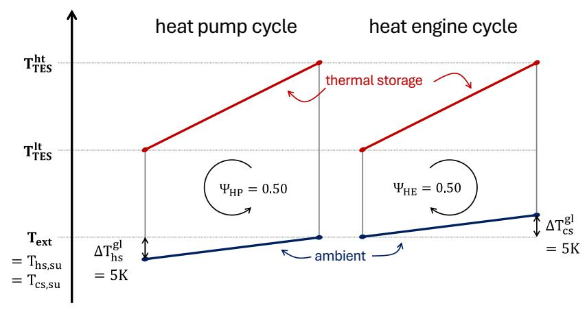

**Fig. A.2** Illustration of the Carnot battery cycles on the temperature-entropy diagram. The ambient temperature is set to 15◦C. Source and sink temperature glides are set to 5 K.

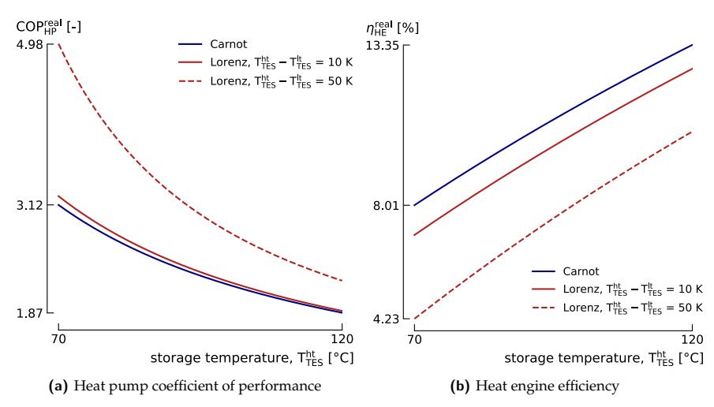

**Fig. A.3** Comparison of heat pump and heat engine performance with Carnot and Lorenz models for fixed second law efficiencies of 0.5.

| **III**

# A.2 Curzon-Ahlborn model for endoreversible cycles

The Carnot cycle represents the theoretical upper limit that the efficiency of a heat engine can reach:

$$\eta_{\rm HE}^{\rm Carnot} = \frac{{\rm T_H} - {\rm T_L}}{{\rm T_H}} = 1 - \frac{{\rm T_L}}{{\rm T_H}} ,$$
(A.15)

with TH and TL the source and sink temperatures. However, this efficiency is quite far from the performance of real machines, in particular because it ignores external irreversibilities. A more appropriate model for characterising this upper limit for a real heat engine is the Curzon-Ahlborn model [\[129\]](#page-260-2), which assesses the efficiency at maximum power output in finite-time thermodynamics:

$$\eta_{\rm HE}^{\rm Curzon-Ahlborn} = 1 - \sqrt{\frac{T_{\rm L}}{T_{\rm H}}} = 1 - \sqrt{1 - \eta_{\rm Carnot}}$$
 (A.16)

This model assumes an endoreversible cycle (i.e., no internal irreversibilities) while accounting for external irreversibilities. However, compared with the model based on a fixed temperature difference ∆T introduced in Chapter [2,](#page-47-0)

$$\eta_{\rm HE}^{\rm endoreversible} = \frac{T_{\rm H} - T_{\rm L} - 2\Delta T}{T_{\rm H} - \Delta T} ,$$
(A.17)

the Curzon-Ahlborn model involves a 'variable' ∆T. Combining Eqs. [A.16](#page-226-1) & [A.17,](#page-226-2) the external irreversibilities ∆T can in fact be expressed as functions of the source and sink temperatures as

$$\Delta T_{\text{Curzon-Ahlborn}} = \frac{T_{\text{H}} \sqrt{\frac{T_{\text{L}}}{T_{\text{H}}}} - T_{\text{L}}}{\sqrt{\frac{T_{\text{L}}}{T_{\text{H}}}} + 1} \quad . \tag{A.18}$$

Looking at Fig. [A.4,](#page-227-0) the constant ∆T model is erroneous: for lower source temperatures, it predicts efficiencies of 0% due to constant external irreversibilities. Conversely, the Curzon-Ahlborn model states that external irreversibilities decrease relatively as the difference between the hot and cold source temperatures decreases (and vice-versa). Nevertheless, the model with constant ∆T provides correct trends.

Ideally, the Curzon-Ahlborn model should be used to characterise the external irreversibilities in the Carnot battery. However, it does not have an equivalent for the heat pump. Therefore, the model with constant ∆T is adopted in Chapter [2](#page-47-0) since it still provides correct trends.

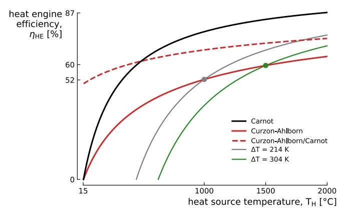

Fig. A.4 Comparison of Carnot, Curzon-Ahlborn and constant  $\Delta T$  models for the heat engine efficiency. The sink temperature is set to  $T_L=15^{\circ}C$ . The dashed curve represents the ratio between the Curzon-Ahlborn and Carnot efficiencies (i.e., fraction of Carnot).

# A.3 Optimum storage temperature for TI-PTES

For thermally integrated Carnot batteries (TI-PTES), both the simplified model (Chapter 2) and the thermodynamic model (Chapter 3) have shown that, depending on the hot source temperature ( $T_{\rm hs}$ ), the storage temperature should either be minimised or maximised to optimise the power-to-power efficiency ( $\eta_{\rm P2P}$ ). For the technological parameters considered in this work, this hot source temperature threshold is about 30 K above the cold sink temperature ( $\Delta T_{\rm hs-cs}^{\rm threshold} \simeq 30 {\rm K}$ ). This means that for a system with a cold sink at  $15^{\circ}{\rm C}$ , the threshold hot source temperature is approximately  $45^{\circ}{\rm C}$ . Fig. A.5 illustrates the value of the threshold obtained

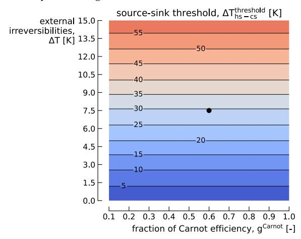

Fig. A.5 Source-sink temperature threshold  $\Delta T_{\rm hs-cs}^{\rm threshold}$  for storage temperature optimisation in TI-PTES depending on external ( $\Delta T)$  and internal ( $g^{\rm Carnot}$ ) irreversibilities.

l V

# | Appendices

using the simplified model of Eq. [2.4](#page-51-1) in Chapter [2](#page-47-0) for different levels of internal and external irreversibilities, assuming a cold sink temperature of 15◦C. It appears that this threshold depends solely on external irreversibilities–the greater these irreversibilities, the higher the threshold temperature. Therefore, when there are no irreversibilities, the storage temperature has no impact on efficiency.

#### В

# Advanced thermodynamic analyses

# B.1 Technological constraints and optimum TI-PTES cycles

For thermally integrated Carnot batteries, the simplified theoretical analyses carried out in Section 2.1 showed that there is a threshold in terms of difference between source and sink temperatures below (resp. above) which the storage temperature must be maximised (resp. minimised) in order to maximise the power-to-power efficiency  $\eta_{\rm P2P}$ . It was also demonstrated that this threshold is a function of the irreversibilities at the heat transfers (see Appendix A.3). This result is reflected in the fact that below the threshold, the ORC efficiency is favoured, whereas above the threshold, the COP of the HP is favoured.

The optimisation results in Section 3.3.1 are consistent with this theoretical prediction. However, it can be observed that, below the threshold ( $\Delta T_{\rm hs-cs} \leq 30~{\rm K}$ ) and for superior sink temperatures ( $T_{\rm cs} > 15\,^{\circ}{\rm C}$ ), the storage temperature is no longer maximised but takes on an optimum value, meaning that, in that part of the domain, there is an optimum trade-off to find between the COP of the HP and the ORC efficiency. This observation can also be extrapolated to the case of maximising the exergy efficiency where, for any source temperature and for sink temperatures above  $15\,^{\circ}{\rm C}$ , the storage temperature takes on an optimum value rather than being maximised.

Two hypotheses can be put forward to explain this observation. The first is linked to the constraint on the maximum cycle and storage temperatures. The second is linked to the constraint on the available fluids and the minimum pressure in the heat exchangers. As shown below, the second can easily be ruled out, which leads to the conclusion that it is precisely the constraint on the maximum temperatures that causes this deviation of the optimum storage temperature from theory.

#### Minimum pressure constraint

An explanation for why the storage temperature is not maximised when the sink is above  $15^{\circ}\mathrm{C}$  could be the unavailability of fluids in that temperature range, due to the constraint  $p_{\min}=0.5$  bar. Indeed, the higher the critical temperature, the lower the saturation pressure at a given temperature (see Fig. B.1). It could therefore be envisaged that no fluid can meet the constraint  $p_{\min}=0.5$  bar when the storage temperature is  $150^{\circ}\mathrm{C}$ , because higher critical temperatures are needed to operate the cycle in subcritical regime. However, this hypothesis can be dismissed out of hand. First, because there are fluids that allow  $T_{\mathrm{TES}}^{\mathrm{ht}}=150^{\circ}\mathrm{C}$  in the  $T_{\mathrm{cs}}\leq15^{\circ}\mathrm{C}$  zone, which is actually even more constrained than the zone where  $T_{\mathrm{cs}}>15^{\circ}\mathrm{C}$  (see Fig. 3.5). Second, because Fig. B.1 shows that there are fluids with a critical point above  $150^{\circ}\mathrm{C}$  which meet the constraint.

VII

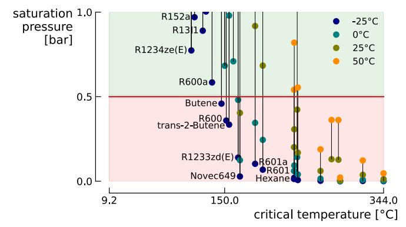

Fig. B.1 Saturation pressure at four different temperatures for the 34 fluids considered in Chapter 3. Fluids with higher critical temperatures tend to have lower saturation pressures, which can be detrimental to compliance with the constraint  $p_{\rm HP/PRC}^{\rm min} \geq 0.5$  bar.

#### Maximum temperature constraint

When  $\eta_{P2P}$  is maximised, because of the constraint  $T_{TES,max}^{ht}=150^{\circ}\mathrm{C}$ , the ORC efficiency decreases as the sink temperature increases (the difference between its source and sink temperatures decreases). Above a certain threshold (around  $15^{\circ}\mathrm{C}$  here), this efficiency becomes so low that  $\mathrm{COP}_{HP}$  must be increased in order to maintain  $\eta_{P2P}$  at maximum values. As a result, the storage temperature has to be lowered, which further affects the ORC efficiency. There is therefore an optimum trade-off to find between  $\eta_{ORC}$  and  $\mathrm{COP}_{HP}$ .

To verify this hypothesis, the  $T_{TES,max}^{ht}=150^{\circ}\mathrm{C}$  constraint was increased to  $T_{TES,max}^{ht}=250^{\circ}\mathrm{C}$  in a cell of domain located in the region concerned ( $T_{hs}=50^{\circ}\mathrm{C}$ ,  $T_{cs}=30^{\circ}\mathrm{C}$ ). The maximum compressor discharge temperature in the HP was also raised to  $T_{HP,max}^{comp,ex}=300^{\circ}\mathrm{C}$  instead of  $T_{HP,max}^{comp,ex}=180^{\circ}\mathrm{C}$  to enable  $T_{TES,max}^{ht}$  to be reached during the optimisation (although this is probably beyond the current technological limits for HP). The storage pressure was increased accordingly. Fig. B.2 depicts the T-s diagrams of the TI-PTES cycles maximising  $\eta_{P2P}$  with the original (Fig. B.2a) and relaxed (Fig. B.2b) constraints. It can be seen that, as expected, the  $T_{TES,max}^{ht}=250^{\circ}\mathrm{C}$  constraint gives rise to a design that maximises the storage temperature (i.e.,  $T_{TES}^{ht}=250^{\circ}\mathrm{C}$ ) in order to maximise  $\eta_{P2P}$ . As a result, the latter also gains more than two points by going from 39.6% to 41.8%.

To the best of my knowledge, this observation on the optimum storage temperature is hardly (never?) discussed in the literature. It would therefore be appropriate for this observation to be confirmed by further studies. In addition, it would be interesting to carry out sensitivity analyses in order to assess the extent to which  $\eta_{\rm P2P}$  (and  $\eta_{\rm II}$  and  $\rho_{\rm el})$  would be affected by maximising the storage temperature when the constraint  $T_{\rm TES,max}^{\rm ht}=150^{\circ}{\rm C}$  is maintained.

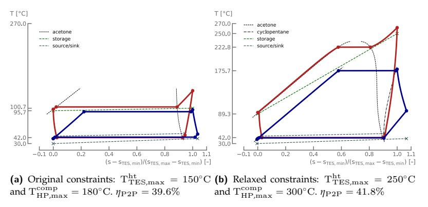

Fig. B.2 T-s diagrams of the configurations maximising  $\eta_{P2P}$  for  $T_{hs}=50^{\circ}C$  and  $T_{cs}=30^{\circ}C$  with the original (left) and relaxed (right) constraints. Red solid lines are for the HP and the blue ones are for the ORC. Green dashed lines correspond to the TES and are placed to illustrate the heat transfer with the cycles, though these are not proper representations for pinch analyses. Grey dashed lines represent the source and the sink.

# B.2 Extended list of fluids for near-optimal analyses

The extended list of fluids used for the near-optimal analyses is given in Table B.1. Note that some fluids (*in italic*) have a non-zero ODP and/or a very high GWP. Although banned (or being phased out) by the Montreal Protocol, the Kigali Amendment and/or the F-gas regulation (EU), these fluids have been considered for illustrative purposes. In fact, the list of fluids compatible with these regulations and available in CoolProp suffers from a severe gap in the range of critical temperatures between 44.1°C and 91.1°C. Yet, it is specifically this range of critical temperatures that is needed to enable transcritical cycles in the Carnot battery application under consideration.

# B.3 Effect of isentropic efficiency and storage temperature

The near-optimal analysis in Chapter 4 was limited to volumetric machinery (75% isentropic efficiency) and assumed modest storage pressurisation (2.5 bar for 120°C). However, for the interested reader and in order to draw more generic conclusions, this Appendix proposes a comparison with results obtained using highpower turbomachinery (90% isentropic efficiency), and an extended range of storage pressurisation levels (1 bar for 90°C and 7.5 bar for 150°C). In particular, due to the limited availability of fluids with low critical temperatures (< 90°C), storage at 150°C could favour transcritical cycles thanks the broader availability of fluids with medium critical temperatures (between 90°C and 120°C). To limit the number of configurations, we focus on those that performed best in Chapter 4: subcritical recuperated (#4: SRHP + SRORC) and transcritical recuperated (#16: TRHP + TRORC). The Pareto fronts obtained after optimisation are shown in Fig. B.3.

# **Appendices**

Table B.1 Technical and physical properties of the investigated working fluids (data from CoolProp 6.4.1 [134]).

| Fluid                  | Type     | T crit [°C] | P crit [bar] | P sat,15° C [bar] | GWP 100 | ASHRAE 34 b | Shape      | ID |
|------------------------|----------|---------------------------|----------------------------|---------------------------------|--------------------|---------------------------|------------|----|
| R1150 (Ethylene)       | НО       | 9.2                       | 50.4                       | n.a.                            | 6.8                | A3                        | wet        | 1  |
| R13 c       | CFC      | 28.7                      | 38.8                       | 28.4                            | 14400              | A1                        | wet        | 2  |
| R744 (Carbon dioxide)  |          | 31.0                      | 73.8                       | 50.9                            | 1.0                | A1                        | wet        | 3  |
| R170 (Ethane)          | HC       | 32.2                      | 48.7                       | 33.7                            | 0.437 a | A3                        | wet        | 4  |
| R41                    | HFC      | 44.1                      | 59.0                       | 30.1                            | 135a               | N/A                       | wet        | 5  |
| R125 d      | HFC      | 66.0                      | 36.2                       | 10.5                            | 3500               | A1                        | isentropic | 6  |
| R143a d     | HFC      | 72.7                      | 37.6                       | 9.6                             | 4470               | A2L                       | wet        | 7  |
| R115 c      | CFC      | 80.0                      | 31.3                       | 6.9                             | 7370               | A1                        | dry        | 8  |
| R1270 (Propylene)      | НО       | 91.1                      | 45.6                       | 8.9                             | 3.1                | A3                        | wet        | 9  |
| R1234yf                | HFO      | 94.7                      | 33.8                       | 5.1                             | 0.501 a | A2L                       | dry        | 10 |
| R22 c       | HCFC     | 96.1                      | 49.9                       | 7.9                             | 1810               | A1                        | wet        | 11 |
| R290 (Propane)         | HC       | 96.7                      | 42.5                       | 7.3                             | 0.02 a  | A3                        | wet        | 12 |
| R134a d     | HFC      | 101.1                     | 40.6                       | 4.9                             | 1430               | A1                        | wet        | 13 |
| R227ea d    | HFC      | 101.8                     | 29.3                       | 3.3                             | 3220               | A1                        | dry        | 14 |
| R161                   | HFC      | 102.1                     | 50.1                       | 7.0                             |                    | N/A                       | wet        | 15 |
| R1243zf                | HFO      | 103.8                     | 35.2                       | 4.4                             | 0.261 a | N/A                       | isentropic | 16 |
| R1234ze(E)             | HFO      | 109.4                     | 36.3                       | 3.6                             | 1.37 a  | A2L                       | isentropic | 17 |
| R12 c       | CFC      | 112.0                     | 41.4                       | 4.9                             | 10900              | A1                        | wet        | 18 |
| R152a                  | HFC      | 113.3                     | 45.2                       | 4.4                             | 164 a   | A2                        | wet        | 19 |
| R13I1                  | Н        | 123.3                     | 39.5                       | 3.7                             | 0.4                | A1                        | wet        | 20 |
| RC270 (cyclo-Propane)  | HC       | 125.2                     | 55.8                       | 5.5                             | N/A                | A3                        | wet        | 21 |
| RE170 (dimethyl-Ether) | HC       | 127.2                     | 53.4                       | 4.4                             | 1.0                | A3                        | wet        | 22 |
| R717 (Ammonia)         |          | 132.2                     | 113.3                      | 7.3                             | N/A                | B2L                       | wet        | 23 |
| R600a (iso-Butane)     | HC       | 134.7                     | 36.3                       | 2.6                             | N/A                | A3                        | dry        | 24 |
| 1-Butene               | HC       | 146.1                     | 40.1                       | 2.2                             | N/A                | N/A                       | dry        | 25 |
| R1234ze(Z)             | HFO      | 150.1                     | 35.3                       | 1.2                             | 0.315 a | A2L                       | isentropic | 26 |
| R600 (n-Butane)        | HC       | 152.0                     | 38.0                       | 1.8                             | 0.006a             |                           | dry        | 27 |
| trans-2-Butene         | HC       | 155.5                     | 40.3                       | 1.7                             | N/A                | N/A                       | dry        | 28 |
| Neopentane             | HC       | 160.6                     | 32.0                       | 1.2                             | N/A                | N/A                       | dry        | 29 |
| R1233zd(E)             | HCFO     | 166.5                     | 36.2                       | 0.9                             | 3.88a              | A1                        | dry        | 30 |
| Novec649               |          | 168.7                     | 18.7                       | 0.3                             | N/A                | N/A                       | dry        | 31 |
| R601a (iso-Pentane)    | HC       | 187.2                     | 33.8                       | 0.6                             | N/A                | A3                        | dry        | 32 |
| R601 (n-Pentane)       | HC       | 196.5                     | 33.7                       | 0.5                             | N/A                | A3                        | dry        | 33 |
| R602 (n-Hexane)        | HC       | 234.7                     | 30.4                       | 0.1                             | 3.1                | N/A                       | dry        | 34 |
| Acetone                |          | 235.0                     | 47.0                       | 0.2                             | 0.5                | N/A                       | isentropic | 35 |
| cyclo-Pentane          | HC       | 238.6                     | 45.7                       | 0.3                             | N/A                | N/A                       | dry        | 36 |
| Methanol               |          | 239.4                     | 82.2                       | 0.1                             | 2.8                | N/A                       | wet        | 37 |
| R603 (n-Heptane)       | HC       | 267.0                     | 27.4                       | < 0.1                           | N/A                | N/A                       | dry        | 38 |
| cyclo-Hexane           | HC       | 280.5                     | 40.8                       | < 0.1                           | N/A                | N/A                       | dry        | 39 |
| Benzene                | HC       | 288.9                     | 48.9                       | < 0.1                           | N/A                | N/A                       | dry        | 40 |
| MDM                    | Siloxane | 290.9                     | 14.1                       | < 0.1                           | N/A                | N/A                       | dry        | 41 |
| Toluene                | HC       | 318.6                     | 41.3                       | < 0.1                           | 3.3                | N/A                       | dry        | 42 |
| ethyl-Benzene          | HC       | 344.0                     | 36.2                       | < 0.1                           | N/A                | N/A                       | dry        | 43 |

&lt;sup>a Value from Table 7.SM.7 of IPCC AR6 [143]

The results show that the efficiency of transcritical cycles is significantly more sensitive to the maximum storage temperature than that of subcritical cycles. This tends to validate the hypothesis regarding the availability of suitable fluids. On the other hand, in both cases, energy density is highly sensitive to the storage temperature. The double penalty stems from the fact that, the lower the storage temperature, the lower the ORC efficiency and the more limited the thermal energy density

&lt;sup>b ASHRAE Standard 34-2022, 'Designation and Safety Classification of Refrigerants'

&lt;sup>c Fluid with non-zero ozone depletion potential and large global warming potential.

&lt;sup>d Fluid with large global warming potential.

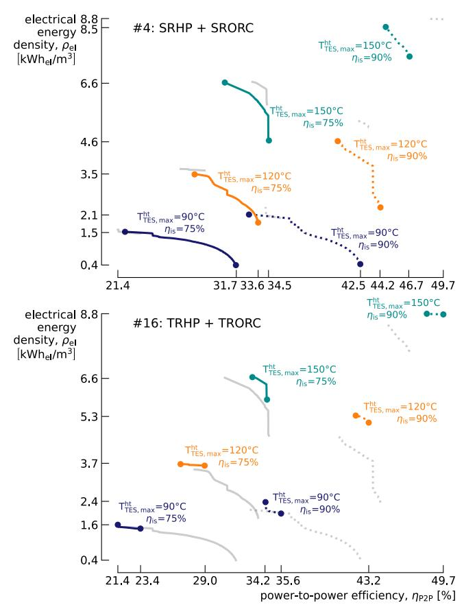

**Fig. B.3** Pareto fronts between efficiency and density and corresponding to subcritical recuperated (#4: SRHP + SRORC, top) and transcritical recuperated (#16: TRHP + TRORC, bottom) Carnot battery cycles. Different storage temperatures are considered:  $90^{\circ}$ C (navy blue) ,  $120^{\circ}$ C (orange) and  $150^{\circ}$ C (cyan). Also, volumetric machinery and turbomachinery is considered: 75% efficient (solid) and 90% efficient (dotted).

becomes (i.e., due to restrictions on the maximum storage temperature spread). The results also show that the lower the storage temperature, the more pronounced the trade-off between efficiency and energy density becomes. Finally, as expected from Chapter 3, the results confirm that transcritical cycles are significantly less affected by the trade-off between efficiency and energy density, their performance being virtually insensitive to the storage spread–unlike subcritical cycles.

Another key result from Fig. B.3 is that, at  $150^{\circ}$ C, transcritical cycles outperform subcritical ones. Specifically, with turbomachinery, the maximum power-to-power efficiency–approaching 50%–is achieved by the transcritical recuperated configuration. As an illustration, Fig. B.4 depicts the corresponding cycle, which shows an almost perfect match with storage, effectively minimising heat transfer ir-

# **Appendices**

reversibilities. The characteristics associated with the heat pump are: compression ratio of 15.1,  $p_{HP,max}=52.8~bar, \Psi_{HP}^{Lorenz}=72\%, \Psi_{HP}^{Carnot}=100\%$  (thereby illustrating that this indicator is not well-suited for cycles with a large glides). The characteristics associated with the organic Rankine cycle are: expansion ratio of 12.0, back work ratio of 16%,  $p_{ORC,max}=54.1~bar, \Psi_{ORC}^{Lorenz}=73\%, \Psi_{ORC}^{Carnot}=50\%$ .

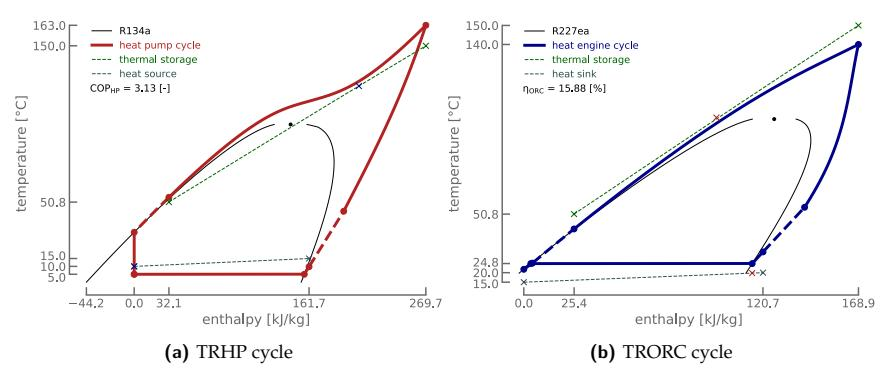

Fig. B.4 Temperature-enthalpy diagrams of the for the HP (red) and ORC (blue) cycles maximising the power-to-power efficiency  $\eta_{\rm P2P}$ 

# B.4 Grassman diagrams for exergy losses in the Carnot battery

To illustrate the distribution of exergy losses depending on whether the Carnot battery maximises efficiency or density, Figs. B.5 and B.6 depict the Grassmann diagrams (Sankey for exergy) of the configurations obtained in Chapter 4. Improving the compressor efficiency represents the primary source of performance gain, followed by the efficiency of the expander. In the transcritical heat pump cycle that maximises density, replacing the expansion valve with a two-phase expander would yield only limited benefit. The absence of a recuperator in the transcritical organic Rankine cycle optimised for density also leads to higher losses at the condenser.

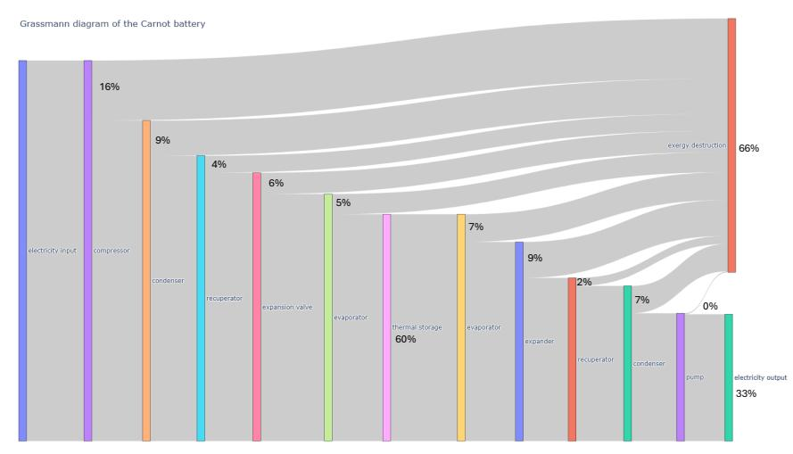

**Fig. B.5** Grassmann diagram depicting the exergy losses in the Carnot battery maximising efficiency (SRHP + SRORC) in Chapter [4](#page-93-0) (see Fig. [4.4\)](#page-105-0).

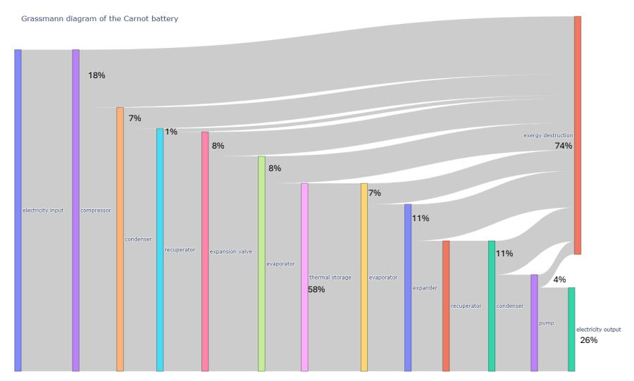

**Fig. B.6** Grassmann diagram depicting the exergy losses in the Carnot battery maximising density (TRHP + TBORC) in Chapter [4](#page-93-0) (see Fig. [4.4\)](#page-105-0).

# C.1 Convergence of thermodynamic design optimisation

The performance of the optimisation method for the thermodynamic design of Carnot batteries (introduced in Fig. [3.3,](#page-69-0) and corresponding to the first stage in Fig. [4.2\)](#page-100-0) is depicted in Fig. [C.1.](#page-236-3) It analyses the convergence of five runs for optimising the efficiency and density of a Carnot battery based on subcritical recuperated cycles (storage temperature is limited to 120◦C, as in Chapter [4\)](#page-93-0). The Paretos are captured similarly for each trial, although the extrema are not entirely identical. While the plateau sets in around the 500th generation, disruptions that identify new extrema can occur much later (after *gen. 1500* for trials #2, #4 and #5). This highlights the necessity of running large numbers of generations to ensure convergence. At the end, the hypervolumes all fall to less than 1% of the maximum.

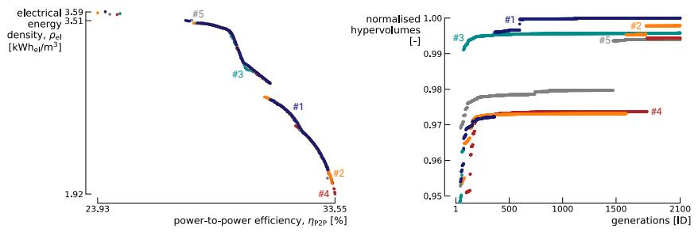

**(a)** Pareto fronts obtained at the last generation. **(b)** Hypervolumes of the fronts at each generation.

**Fig. C.1** Analysis of the convergence of the thermodynamic design optimisation method. For repeatability, it is applied to five trials for subcritical recuperated Carnot batteries.

# C.2 Convergence of near-optimal alternatives generation

Reporting the hypervolumes for the method generating the near-optimal alternatives (second stage in Fig. [4.2\)](#page-100-0) is key to discuss its convergence (see Fig. [C.2f\)](#page-237-0). However, the complexity of the hypervolume calculation algorithm increases with the dimensionality of the Pareto fronts, so the last generations of Trial #1 and #4 could not be reported in Fig. [C.2f](#page-237-0) (these are 7-dimensional and each contains 250 individuals). To help interpreting the results, Figs. [C.2a](#page-237-0) to [C.2e](#page-237-0) also depict the efficiency and density of the alternative designs. The distribution is far from uniform across the sub-optimal space. Moreover, it varies from one run to another. However, remember that the goal when generating alternatives is not to uniformly cover the sub-optimal space, but rather to maximise the design difference relative

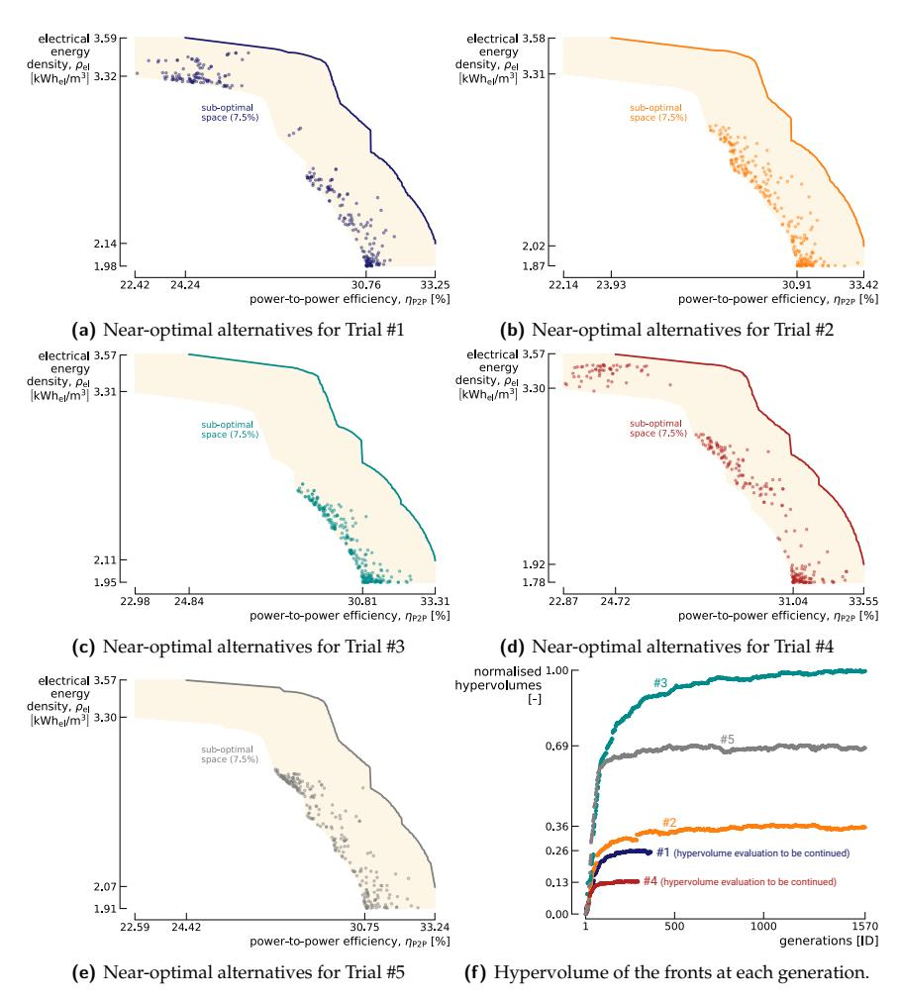

**Fig. C.2** Analysis of the convergence of the near-optimal alternatives generation method. It is applied to the five trials introduced in Fig. [C.1b.](#page-236-3)

to reference points on the Pareto front. The hypervolume varies significantly between runs. Nonetheless, we observe that the more spread out the alternatives are in the sub-optimal space, the lower the hypervolume. Conversely, higher hypervolumes correspond to more clustered alternatives. All points tend to converge towards a design that maximises the Euclidean distance from a reference point. Therefore, when aiming to minimise the storage temperature instead of maximise it, only solutions with high efficiency remain viable (density is more sensitive to this parameter, see Fig. [4.7\)](#page-109-0). This suggests that beyond differences from one trial to the other, the method does not guarantee diversity among solutions and thus deserves improvement.

# **D Complementary results for residential case (Chapter [6\)](#page-155-0)**

# D.1 Results for Brussels case study

In Brussels, specific heating requirements are 93 kWh/m2/year, domestic hot water demand is 21 kWh/m2/year, electricity demand is 20 kWh/m2/year and specific cooling requirements are 14 kWh/m2/year. Assuming that the air-cooled chillers are 45% Carnot efficient, the corresponding specific electricity consumption is 1.4 kWh/m2/year. The corresponding time series are depicted in Fig. [D.1.](#page-238-2) The optimum system designs and corresponding performance indicators are depicted in Figs. [D.2](#page-239-0) & [D.3.](#page-240-0) The operations corresponding to the case CAPEXHP = 600 e/kWth, CAPEXHE = 2400 e/kWel and CAPEXTES = 30 e/kWhth are depicted in Fig. [D.4.](#page-241-0) The seasonal indicators corresponding to the case CAPEXHP = 600 e/kWth, CAPEXHE = 2400 e/kWel and CAPEXTES = 30 e/kWhth are given in Table [D.1.](#page-241-1) The optimum design corresponding to the case CAPEXHP =

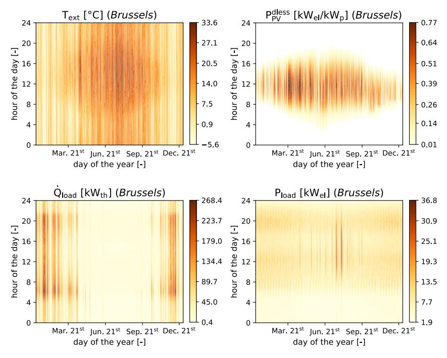

**Fig. D.1** Temporal heatmaps representing the climate and demand profiles for Brussels. The days of the year are plotted along the x-axis, and hours of the day are plotted along the y-axis. Pload and Q˙ load are the total electrical and thermal loads. Text is the external temperature and P dless PV is the dimensionless photovoltaic production per installed capacity.

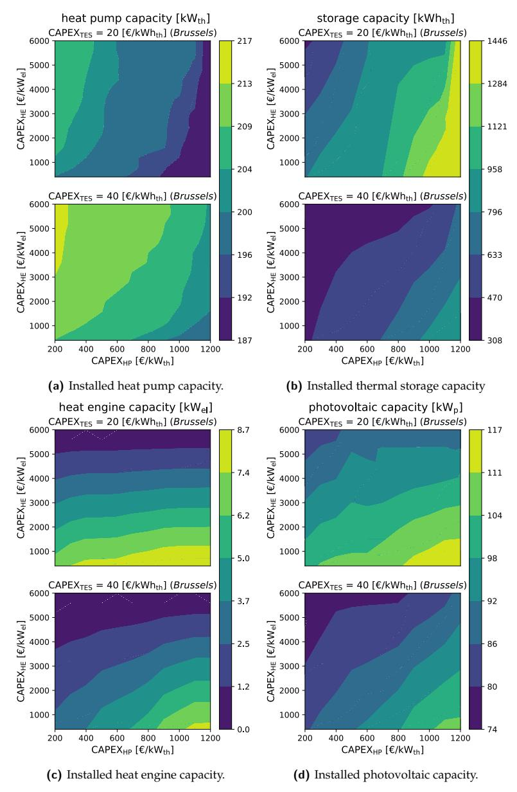

**Fig. D.2** Optimum system design for the system operations based on the investment costs considered. The colourmaps depict the installed capacities. The x-axis represents the costs considered for the heat pump, the y-axis the costs of the heat engine and the top and bottom maps illustrate two different storage costs.

| **XVII**

# | Appendices

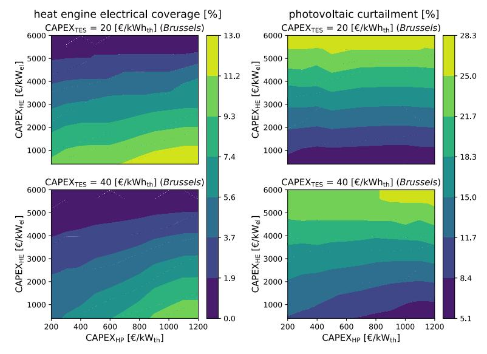

**(a)** Fraction of electricity consumption covered by the heat engine. **(b)** Fraction of curtailed photovoltaic production.

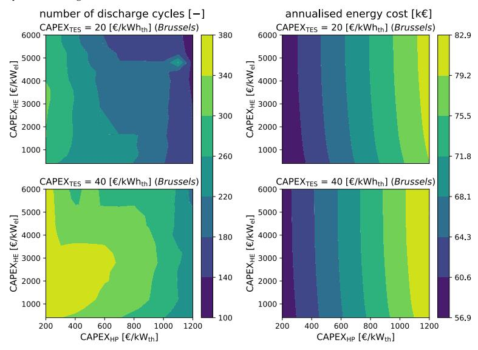

- **(c)** Number of discharge cycles for the storage. **(d)** Annualised energy cost.

**Fig. D.3** Performance indicators for the system operations based on the investment costs considered. The colourmaps depict the installed capacities. The x-axis represents the costs considered for the heat pump, the y-axis the costs of the heat engine and the top and bottom maps illustrate two different storage costs.

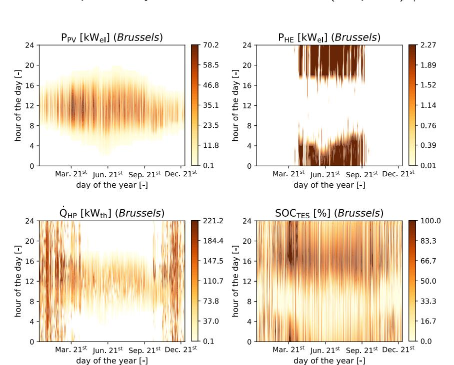

**Fig. D.4** Temporal heatmaps representing the system operations for Brussels (photovoltaic power production  $P_{\mathrm{PV}}$ , heat engine power production  $P_{\mathrm{HE}}$ , heat pump thermal production  $Q_{\mathrm{HP}}$  and storage state-of-charge  $\mathrm{SOC}_{\mathrm{TES}}$ ). The days of the year are plotted along the x-axis, and hours of the day are plotted along the y-axis.

**Table D.1** Seasonal operations and performance indicators for Brussels. The considered design is for CAPEX $_{HP} = 600$  €/kW $_{th}$ , CAPEX $_{HE} = 2400$  €/kW $_{el}$  and CAPEX $_{TES} = 30$  €/kW $_{th}$ . Astronomical seasons are here considered. During winter, the slight difference between heat production and demand is due to the thermal losses in the storage.  $N_{cycles}$  is the number of charging/discharging cycles of the thermal storage and  $E_{grid}^{abs}$  is the grid electricity consumption.

| Parameter                  | Units                        | Winter | Spring | Summer | Autumn | Annual |
|----------------------------|------------------------------|--------|--------|--------|--------|--------|
| $E_{load}^{th}$            | $\mathrm{MWh_{th}}$          | 160.2  | 55.1   | 16.8   | 109.9  | 342.0  |
| $\mathrm{E_{HP}}$          | $\mathrm{MWh_{th}}$          | 161.1  | 72.2   | 45.8   | 112.3  | 391.4  |
| $COP_{HP}$                 | _                            | 2.41   | 2.70   | 3.14   | 2.46   | 2.54   |
| $\mathrm{E_{load}^{el}}$   | $MWh_{el}$                   | 17.2   | 14.5   | 16.2   | 16.3   | 64.2   |
| $\mathrm{E}_{\mathrm{HE}}$ | $MWh_{el}$                   | 0.00   | 1.29   | 2.17   | 0.14   | 3.60   |
| $\eta_{ m HE}$             | %                            | n.a.   | 8.18   | 7.83   | 8.00   | 7.96   |
| $COP_{HP} \cdot \eta_{HE}$ | %                            | n.a.   | 22.1   | 24.6   | 19.7   | 20.2   |
| $N_{\text{cycles}}$        | -                            | 88.2   | 71.2   | 64.6   | 71.0   | 295.0  |
| $\mathrm{E}_{\mathrm{PV}}$ | $MWh_{el}$                   | 13.3   | 33.4   | 30.9   | 13.3   | 90.9   |
| $E_{grid}^{abs}$           | $\mathrm{MWh}_{\mathrm{el}}$ | 70.9   | 11.6   | 4.0    | 48.6   | 135.1  |

# **Appendices**

600 €/kWth, CAPEXHE = 2400 €/kWel and CAPEXTES = 30 €/kWhth is given in Table D.2. The relative deviations in optimum system designs and corresponding performance indicators due to non-zero feed-in tariff are depicted in Fig. D.6. Fig. D.5 depicts the relative deviation in annualised energy cost, photovoltaic, thermal energy storage and heat engine capacities for coefficients of variation from 0% to 100%. Finally, Fig. D.7 depicts the Sobol indices for each uncertain parameter.

**Table D.2** Nominal system design for Brussels for CAPEX $_{HP} = 600$  €/kW $_{th}$ , CAPEX $_{HE} = 2400$  €/kW $_{el}$  and CAPEX $_{TES} = 30$  €/kW $_{th}$ .

| Parameter              | Symbol                                              | Value | Units              |
|------------------------|-----------------------------------------------------|-------|--------------------|
| Storage capacity       | $E_{TES}^{nom}$                                     | 588   | kWh th  |
| Total storage volume   | Vnom TES                                         | 34.6  | $\mathrm{m}^3$     |
| Heat pump capacity     | $\dot{\mathrm{Q}}_{\mathrm{HP}}^{	ilde{	ext{nom}}}$ | 205.1 | $\mathrm{kW_{th}}$ |
| Heat engine capacity   | ${ m P_{HE}^{nom}}$                                 | 2.27  | $\mathrm{kW_{el}}$ |
| Photovoltaic capacity  | $P_{PV}^{\overline{nom}}$                           | 91.6  | $kW_p$             |
| Annualised energy cost | AEC                                                 | 67.8  | k€                 |

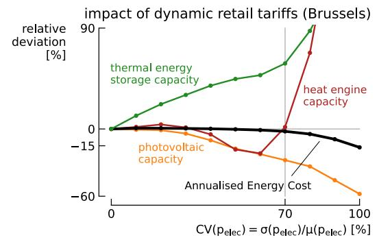

Fig. D.5 Relative deviation in annualised energy cost, photovoltaic, storage and heat engine capacities for different coefficients of variation of retail tariffs. The design corresponding to case CAPEX $_{\rm HP}=600$  €/kW $_{\rm th}$ , CAPEX $_{\rm HE}=2400$  €/kW $_{\rm th}$  and CAPEX $_{\rm TES}=30$  €/kW $_{\rm th}$  was selected for the analysis.

# D.2 Analysis of representative days

This appendix illustrates the operations of the energy system for two representative days out of the 365 simulated: Fig. D.8 shows a typical summer day and Fig. D.9 shows a typical winter day. In Fig. D.8, the Carnot battery role in shifting photovoltaic production is clearly visible: the storage is charged by the heat pump during hours of production, while it is discharged by the heat engine when the sun is not shining. During the morning hours, the heat engine is sufficient to

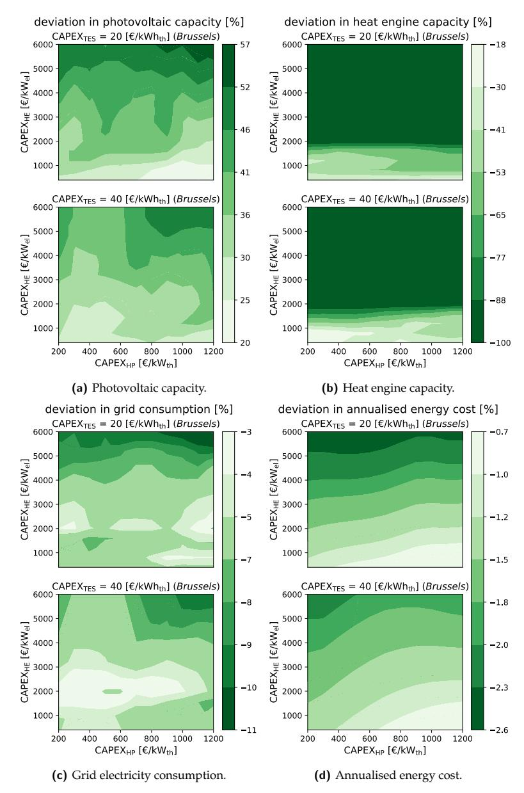

**Fig. D.6** Deviations in installed capacities and performance indicators due to non-zero feedin tariff. The colourmaps depict the relative deviations. The x-axis represents the costs considered for the heat pump, the y-axis the costs of the heat engine and the top and bottom maps illustrate two different storage costs.

| **XXI**

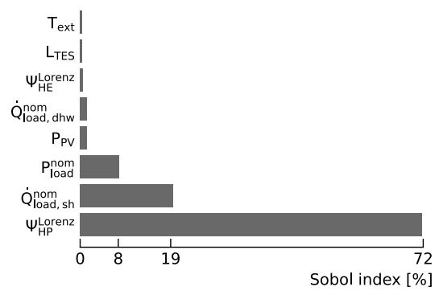

**Fig. D.7** Sobol indices corresponding to the uncertain parameters considered in the sensitivity analysis (Table [6.3\)](#page-168-2). The design corresponding to case CAPEXHP = 600 e/kWth, CAPEXHE = 2400 e/kWel and CAPEXTES = 30 e/kWhth was selected for the analysis.

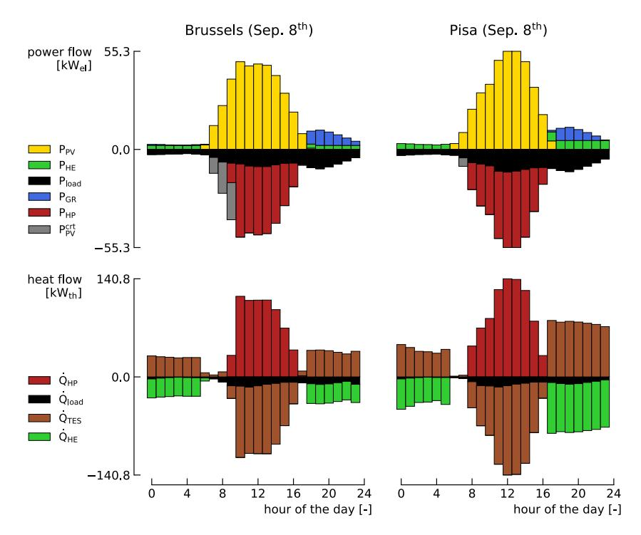

**Fig. D.8** System operations for a representative summer day.

cover the electric load, while the grid is used as a backup to face the evening peak. Curtailment also occurs due to excess electricity generation. In Fig. [D.9,](#page-245-0) the buffer role of thermal storage is perfectly illustrated. It allows the heat pump to operate

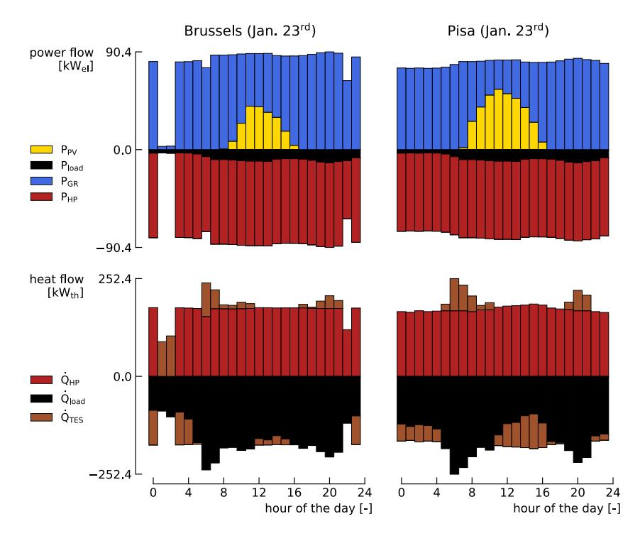

**Fig. D.9** System operations for a representative winter day.

close to full load throughout the day, while the storage charges (resp. discharges) when production exceeds (resp. does not meet) the thermal load. In addition, since photovoltaic production is not sufficient, the grid is used throughout the entire day. The heat engine is therefore not used.

# E.1 Grid and storage operations

Fig. [E.1](#page-246-2) depicts the optimal grid operations for the residential case in Pisa for minimising greenhouse gas emissions. Fig. [E.1](#page-246-2) depicts the optimal battery and thermal storage operations (sate-of-charge) for the residential case in Pisa for minimising greenhouse gas emissions.

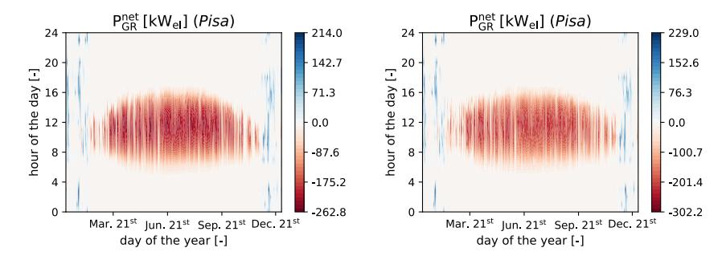

**(a)** Grid power flows for the BAT + TES + HE (80◦C) case. **(b)** Grid power flows for the BAT + TES (80◦C) case.

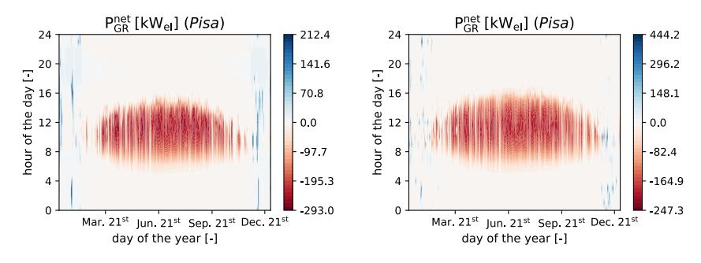

**(c)** Grid power flows for the TES + HE (95◦C) case. **(d)** Grid power flows for the BAT (70◦C) case.

**Fig. E.1** Optimal grid operations (Pisa). Red color corresponds to net injection (i.e., feed-in), while blue corresponds to net absorption (i.e., retail).

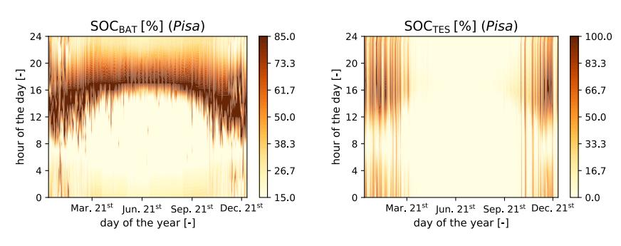

- **(a)** Battery state-of-charge for the BAT + TES + HE (80◦C) case.
- **(b)** Thermal storage state-of-charge for the BAT + TES + HE (80◦C) case.

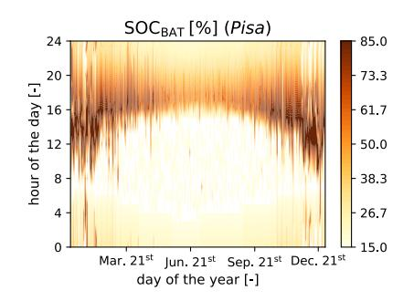

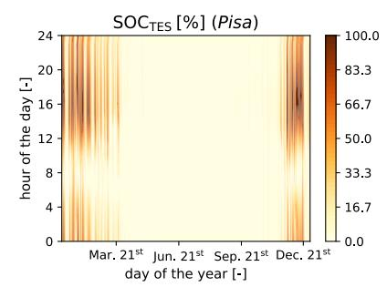

- **(c)** Battery state-of-charge for the BAT + TES (80◦C) case.
- **(d)** Thermal storage state-of-charge for the BAT + TES (80◦C case.)

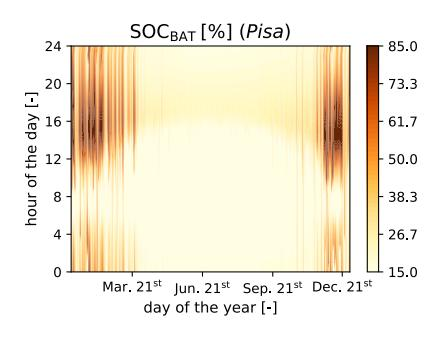

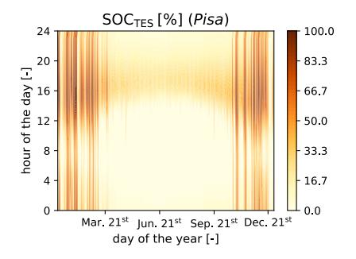

- **(e)** Battery state-of-charge for the BAT (70◦C) case. **(f)** Thermal storage state-of-charge for the TES + HE (95◦C) case.

**Fig. E.2** Optimal states-of-charge for the different storage technologies (Pisa).

# Appendices

# E.2 Results for Brussels case study

Table E.1 gives the nominal systems design for the residential case in Brussels for minimising greenhouse gas emissions. Table E.2 gives the corresponding optimal operations.

Table E.1 Nominal system designs for Brussels (100  $\mathrm{MWh_{el}}$  of grid electricity per year).

| <b>Topology</b> Units         | $ m rac{P_{PV}^{nom}}{kW_{p}}$ | $\dot{\mathbf{Q}}_{\mathbf{HP}}^{\mathbf{nom}}$ $\mathrm{kW}_{\mathrm{th}}$ | $\begin{array}{c} \mathbf{E_{BAT}^{nom}} \\ \mathrm{kWh_{el}} \end{array}$ | $egin{array}{c} \mathbf{Q_{TES}^{nom}} \\ \mathrm{kWh_{th}} \end{array}$ | $ m egin{array}{c} P_{HE}^{nom} \ kW_{el} \end{array}$ | $\begin{array}{c} \mathbf{GHG_{tot}} \\ \mathrm{tCO_2eq/y} \end{array}$ |
|----------------------------------|---------------------------------|-----------------------------------------------------------------------------|----------------------------------------------------------------------------|--------------------------------------------------------------------------|--------------------------------------------------------|-------------------------------------------------------------------------|
| $BAT + TES + HE (80^{\circ}C)$   | 171                             | 271                                                                         | 75                                                                         | 1302                                                                     | 1.4                                                    | 27.2                                                                    |
| BAT + TES + HE ( $95^{\circ}$ C) | 201                             | 297                                                                         | 69                                                                         | 2526                                                                     | 1.8                                                    | 27.6                                                                    |
| BAT + TES ( $80^{\circ}$ C)      | 174                             | 260                                                                         | 93                                                                         | 1204                                                                     | _                                                      | 27.2                                                                    |
| TES + HE ( $80^{\circ}$ C)       | 182                             | 298                                                                         | _                                                                          | 1469                                                                     | 8.4                                                    | 27.7                                                                    |
| TES + HE ( $95^{\circ}$ C)       | 212                             | 336                                                                         | _                                                                          | 2466                                                                     | 8.7                                                    | 28.1                                                                    |
| BAT (70°C)                       | 130                             | 385                                                                         | 246                                                                        | _                                                                        | _                                                      | 27.5                                                                    |

**Table E.2** Optimal system operations for Brussels.  $N^{\rm cycles}$  is the number of discharge cycles,  ${\rm CF_{HP}}$  the heat pump capacity factor and  ${\rm frac_{HE}}$  the fraction of the dwelling electricity consumption covered by the heat engine.

| <b>Topology</b> Units         | COP HP | <b>η</b> не % | ${ m N_{BAT}^{cycles}}_{-}$ | ${ m N_{TES}^{cycles}}_{-}$ | CF HP % | frac HE % |
|----------------------------------|-------------------|------------------|-----------------------------|-----------------------------|--------------------|-------------------------|
| $BAT + TES + HE (80^{\circ}C)$   | 2.5               | 7.5              | 455                         | 148                         | 15.2               | 2.1                     |
| BAT + TES + HE ( $95^{\circ}$ C) | 2.3               | 8.4              | 458                         | 87                          | 14.1               | 3.3                     |
| BAT + TES (80°C)                 | 2.5               | _                | 426                         | 284                         | 15.1               | _                       |
| TES + HE ( $80^{\circ}$ C)       | 2.6               | 7.3              | _                           | 222                         | 18.5               | 17.0                    |
| TES + HE ( $95^{\circ}$ C)       | 2.4               | 8.1              | _                           | 137                         | 16.4               | 18.8                    |
| BAT (70°C)                       | 2.9               | _                | 313                         | _                           | 10.1               | _                       |

# **Bibliography**

- [1] T. S. Reynolds, *Stronger than a Hundred Men: A History of the Vertical Water Wheel*, ser. Johns Hopkins Studies in the History of Technology. Baltimore: Johns Hopkins University Press, 1983, no. new ser., no. 7.
- [2] L. Gaudard, F. Romerio, F. Dalla Valle, R. Gorret, S. Maran, G. Ravazzani, M. Stoffel, and M. Volonterio, "Climate change impacts on hydropower in the Swiss and Italian Alps," *Science of The Total Environment*, vol. 493, pp. 1211–1221, Sep. 2014.
- [3] B. Wagner, C. Hauer, A. Schoder, and H. Habersack, "A review of hydropower in Austria: Past, present and future development," *Renewable and Sustainable Energy Reviews*, vol. 50, pp. 304–314, Oct. 2015.
- [4] P. Hänggi and R. Weingartner, "Variations in Discharge Volumes for Hydropower Generation in Switzerland," *Water Resources Management*, vol. 26, no. 5, pp. 1231–1252, Mar. 2012.
- [5] R. Dickes, E. Casati, A. Desideri, V. Lemort, and S. Quoilin, "Solar-powered organic Rankine cycles: A technical and historical review," *Renewable and Sustainable Energy Reviews*, vol. 212, p. 115319, Apr. 2025.
- [6] C. N. Markides, "Low-Concentration Solar-Power Systems Based on Organic Rankine Cycles for Distributed-Scale Applications: Overview and Further Developments," *Frontiers in Energy Research*, vol. 3, Dec. 2015.
- [7] V. A. Boicea, "Energy Storage Technologies: The Past and the Present," *Proceedings of the IEEE*, vol. 102, no. 11, pp. 1777–1794, Nov. 2014.
- [8] X. Luo, J. Wang, M. Dooner, and J. Clarke, "Overview of current development in electrical energy storage technologies and the application potential in power system operation," *Applied Energy*, vol. 137, pp. 511–536, Jan. 2015.
- [9] IEA, "Renewables 2021 - Analysis and forecasts to 2026," International Energy Agency, Paris, France, Tech. Rep., 2021.
- [10] J. Asbury and A. Kouvalis, "Electric storage heating: The experience in England and Wales and in the Federal Republic of Germany," Tech. Rep. ANL/ES-50, 7325200, May 1976.

- [11] A. A. Al-Abidi, S. Bin Mat, K. Sopian, M. Y. Sulaiman, C. H. Lim, and A. Th, "Review of thermal energy storage for air conditioning systems," *Renewable and Sustainable Energy Reviews*, vol. 16, no. 8, pp. 5802–5819, Oct. 2012.
- [12] IPCC, "Climate Change 2023: Synthesis Report. Contribution of Working Groups I, II and III to the Sixth Assessment Report of the Intergovernmental Panel on Climate Change [Core Writing Team, H. Lee and J. Romero (eds.)]." Intergovernmental Panel on Climate Change, Geneva, Switzerland, Tech. Rep., 2023.
- [13] W. Steffen, K. Richardson, J. Rockström, S. E. Cornell, I. Fetzer, E. M. Bennett, R. Biggs, S. R. Carpenter, W. de Vries, C. A. de Wit, C. Folke, D. Gerten, J. Heinke, G. M. Mace, L. M. Persson, V. Ramanathan, B. Reyers, and S. Sörlin, "Planetary boundaries: Guiding human development on a changing planet," *Science*, vol. 347, no. 6223, p. 1259855, Feb. 2015.
- [14] K. Richardson, W. Steffen, W. Lucht, J. Bendtsen, S. E. Cornell, J. F. Donges, M. Drüke, I. Fetzer, G. Bala, W. von Bloh, G. Feulner, S. Fiedler, D. Gerten, T. Gleeson, M. Hofmann, W. Huiskamp, M. Kummu, C. Mohan, D. Nogués-Bravo, S. Petri, M. Porkka, S. Rahmstorf, S. Schaphoff, K. Thonicke, A. Tobian, V. Virkki, L. Wang-Erlandsson, L. Weber, and J. Rockström, "Earth beyond six of nine planetary boundaries," *Science Advances*, vol. 9, no. 37, p. eadh2458, Sep. 2023.
- [15] T. Tröndle, J. Lilliestam, S. Marelli, and S. Pfenninger, "Trade-Offs between Geographic Scale, Cost, and Infrastructure Requirements for Fully Renewable Electricity in Europe," *Joule*, vol. 4, no. 9, pp. 1929–1948, Sep. 2020.
- [16] G. Limpens, "Generating energy transition pathways : application to Belgium," Ph.D. dissertation, UCL - Université Catholique de Louvain, 2021.
- [17] X. Rixhon, "Exploration of uncertainty-aware energy transition pathways : reinforcement learning and principal component analysis-based methods," Ph.D. dissertation, UCL - Université Catholique de Louvain, 2024.
- [18] P. Thiran, "Exploring options for a fossil-free European energy system : The role of renewable fuels," Ph.D. dissertation, UCL - Université Catholique de Louvain, 2024.
- [19] B. Pickering, F. Lombardi, and S. Pfenninger, "Diversity of options to eliminate fossil fuels and reach carbon neutrality across the entire European energy system," *Joule*, vol. 6, no. 6, pp. 1253–1276, Jun. 2022.
- [20] "Buildings," in *Climate Change 2022 - Mitigation of Climate Change*, 1st ed., Intergovernmental Panel on Climate Change (IPCC), Ed. Cambridge University Press, Aug. 2023, pp. 953–1048.
- [21] F. Wiese, N. Taillard, E. Balembois, B. Best, S. Bourgeois, J. Campos, L. Cordroch, M. Djelali, A. Gabert, A. Jacob, E. Johnson, S. Meyer, B. Munkácsy,

- L. Pagliano, S. Quoilin, A. Roscetti, J. Thema, P. Thiran, A. Toledano, B. Vogel, C. Zell-Ziegler, and Y. Marignac, "The key role of sufficiency for low demand-based carbon neutrality and energy security across Europe," *Nature Communications*, vol. 15, no. 1, p. 9043, Oct. 2024.
- [22] L. Cordroch, S. Hilpert, and F. Wiese, "Why renewables and energy efficiency are not enough - the relevance of sufficiency in the heating sector for limiting global warming to 1.5 ◦C." *Technological Forecasting and Social Change*, vol. 175, p. 121313, Feb. 2022.
- [23] C. Zell-Ziegler, J. Thema, B. Best, F. Wiese, J. Lage, A. Schmidt, E. Toulouse, and S. Stagl, "Enough? The role of sufficiency in European energy and climate plans," *Energy Policy*, vol. 157, p. 112483, Oct. 2021.
- [24] T. Brown, D. Schlachtberger, A. Kies, S. Schramm, and M. Greiner, "Synergies of sector coupling and transmission reinforcement in a cost-optimised, highly renewable European energy system," *Energy*, vol. 160, pp. 720–739, Oct. 2018.
- [25] M. Arbabzadeh, R. Sioshansi, J. X. Johnson, and G. A. Keoleian, "The role of energy storage in deep decarbonization of electricity production," *Nature Communications*, vol. 10, no. 1, p. 3413, Jul. 2019.
- [26] O. Schmidt, S. Melchior, A. Hawkes, and I. Staffell, "Projecting the Future Levelized Cost of Electricity Storage Technologies," *Joule*, vol. 3, no. 1, pp. 81–100, Jan. 2019.
- [27] J. Howes, "Concept and Development of a Pumped Heat Electricity Storage Device," *Proceedings of the IEEE*, vol. 100, no. 2, pp. 493–503, Feb. 2012.
- [28] A. Thess, "Thermodynamic Efficiency of Pumped Heat Electricity Storage," *Physical Review Letters*, vol. 111, no. 11, p. 110602, Sep. 2013.
- [29] A. J. White, "Loss analysis of thermal reservoirs for electrical energy storage schemes," *Applied Energy*, vol. 88, no. 11, pp. 4150–4159, Nov. 2011.
- [30] J. D. McTigue, A. J. White, and C. N. Markides, "Parametric studies and optimisation of pumped thermal electricity storage," *Applied Energy*, vol. 137, pp. 800–811, Jan. 2015.
- [31] M. Mercangöz, J. Hemrle, L. Kaufmann, A. Z'Graggen, and C. Ohler, "Electrothermal energy storage with transcritical CO2 cycles," *Energy*, vol. 45, no. 1, pp. 407–415, Sep. 2012.
- [32] M. Morandin, F. Maréchal, M. Mercangöz, and F. Buchter, "Conceptual design of a thermo-electrical energy storage system based on heat integration of thermodynamic cycles – Part A: Methodology and base case," *Energy*, vol. 45, no. 1, pp. 375–385, Sep. 2012.
- [33] Y. Kim, C. Kim, and D. Favrat, "Transcritical or supercritical CO2 cycles using both low- and high-temperature heat sources," *Energy*, vol. 43, no. 1, pp. 402– 415, Jul. 2012.

- [34] W. D. Steinmann, "The CHEST (Compressed Heat Energy STorage) concept for facility scale thermo mechanical energy storage," *Energy*, vol. 69, pp. 543– 552, May 2014.
- [35] W.-D. Steinmann, H. Jockenhöfer, and D. Bauer, "Thermodynamic Analysis of High-Temperature Carnot Battery Concepts," *Energy Technology*, vol. 8, no. 3, p. 1900895, 2020.
- [36] O. Dumont, G. F. Frate, A. Pillai, S. Lecompte, M. De Paepe, and V. Lemort, "Carnot battery technology: A state-of-the-art review," *Journal of Energy Storage*, vol. 32, Sep. 2020.
- [37] G. F. Frate, L. Ferrari, and U. Desideri, "Rankine Carnot Batteries with the Integration of Thermal Energy Sources: A Review," *Energies*, vol. 13, no. 18, p. 4766, Jan. 2020.
- [38] V. Novotny, V. Basta, P. Smola, and J. Spale, "Review of Carnot Battery Technology Commercial Development," *Energies*, vol. 15, no. 2, p. 647, Jan. 2022.
- [39] A. Vecchi, K. Knobloch, T. Liang, H. Kildahl, A. Sciacovelli, K. Engelbrecht, Y. Li, and Y. Ding, "Carnot Battery development: A review on system performance, applications and commercial state-of-the-art," *Journal of Energy Storage*, vol. 55, p. 105782, Nov. 2022.
- [40] T. Liang, A. Vecchi, K. Knobloch, A. Sciacovelli, K. Engelbrecht, Y. Li, and Y. Ding, "Key components for Carnot Battery: Technology review, technical barriers and selection criteria," *Renewable and Sustainable Energy Reviews*, vol. 163, p. 112478, Jul. 2022.
- [41] S. S. M. Shamsi, S. Barberis, S. Maccarini, and A. Traverso, "Large scale energy storage systems based on carbon dioxide thermal cycles: A critical review," *Renewable and Sustainable Energy Reviews*, vol. 192, p. 114245, Mar. 2024.
- [42] S. Carnot, *Réflexions sur la puissance motrice du feu et sur les machines propres à développer cette puissance*. Paris: Chez Bachelier, Libraire, 1824.
- [43] W.-D. Steinmann, "Thermo-mechanical concepts for bulk energy storage," *Renewable and Sustainable Energy Reviews*, vol. 75, pp. 205–219, Aug. 2017.
- [44] A. Olympios, J. McTigue, P. Farres-Antunez, A. Tafone, A. Romagnoli, Y. Li, Y. Ding, W.-D. Steinmann, L. Wang, H. Chen, and C. Markides, "Progress and prospects of thermo-mechanical energy storage - A critical review," *Progress in Energy*, Jan. 2021.
- [45] T. Desrues, J. Ruer, P. Marty, and J. Fourmigué, "A thermal energy storage process for large scale electric applications," *Applied Thermal Engineering*, vol. 30, no. 5, pp. 425–432, Apr. 2010.
- [46] R. B. Peterson, "A concept for storing utility-scale electrical energy in the form of latent heat," *Energy*, vol. 36, no. 10, pp. 6098–6109, Oct. 2011.

- [47] I. Sarbu and C. Sebarchievici, "A Comprehensive Review of Thermal Energy Storage," *Sustainability*, vol. 10, no. 1, p. 191, Jan. 2018.
- [48] IEA, "The Role of Critical Minerals in Clean Energy Transitions," International Energy Agency, Paris, France, Tech. Rep., 2021.
- [49] J. Blanquiceth, J. M. Cardemil, M. Henríquez, and R. Escobar, "Thermodynamic evaluation of a pumped thermal electricity storage system integrated with large-scale thermal power plants," *Renewable and Sustainable Energy Reviews*, vol. 175, p. 113134, Apr. 2023.
- [50] F. Klasing, M. Prenzel, and T. Bauer, "Repurposing of supercritical coal plants into highly flexible grid storage with adapted 620 ◦C nitrate salt technology," *Applied Energy*, vol. 377, p. 124524, Jan. 2025.
- [51] M. Jayachandran, C. R. Reddy, S. Padmanaban, and A. H. Milyani, "Operational planning steps in smart electric power delivery system," *Scientific Reports*, vol. 11, no. 1, p. 17250, Aug. 2021.
- [52] J. D. McTigue, P. Farres-Antunez, K. S. J, C. N. Markides, and A. J. White, "Techno-economic analysis of recuperated Joule-Brayton pumped thermal energy storage," *Energy Conversion and Management*, vol. 252, p. 115016, Jan. 2022.
- [53] G. F. Frate, L. Ferrari, and U. Desideri, "Multi-Criteria Economic Analysis of a Pumped Thermal Electricity Storage (PTES) With Thermal Integration," *Frontiers in Energy Research*, vol. 8, p. 53, Apr. 2020.
- [54] C. Forman, I. K. Muritala, R. Pardemann, and B. Meyer, "Estimating the global waste heat potential," *Renewable and Sustainable Energy Reviews*, vol. 57, pp. 1568–1579, May 2016.
- [55] A. Benato and A. Stoppato, "Pumped Thermal Electricity Storage: A technology overview," *Thermal Science and Engineering Progress*, vol. 6, pp. 301–315, Jun. 2018.
- [56] A. White, G. Parks, and C. N. Markides, "Thermodynamic analysis of pumped thermal electricity storage," *Applied Thermal Engineering*, vol. 53, no. 2, pp. 291–298, May 2013.
- [57] A. Benato, "Performance and cost evaluation of an innovative Pumped Thermal Electricity Storage power system," *Energy*, vol. 138, pp. 419–436, Nov. 2017.
- [58] A. White, J. McTigue, and C. Markides, "Wave propagation and thermodynamic losses in packed-bed thermal reservoirs for energy storage," *Applied Energy*, vol. 130, pp. 648–657, Oct. 2014.
- [59] A. J. White, J. D. McTigue, and C. N. Markides, "Analysis and optimisation of packed-bed thermal reservoirs for electricity storage applications," *Proceedings of the Institution of Mechanical Engineers, Part A: Journal of Power and Energy*, vol. 230, no. 7, pp. 739–754, Nov. 2016.

- [60] J. McTigue and A. White, "A Comparison of Radial-flow and Axial-flow Packed Beds for Thermal Energy Storage," *Energy Procedia*, vol. 105, pp. 4192–4197, May 2017.
- [61] T. R. Davenne and B. M. Peters, "An Analysis of Pumped Thermal Energy Storage With De-coupled Thermal Stores," *Frontiers in Energy Research*, vol. 8, p. 160, Aug. 2020.
- [62] M. Morandin and S. Henchoz, "Thermo-electrical energy storage: A new type of large scale energy storage based on thermodynamic cycles," in *Proceedings of World Engineers Convention*, Geneva, Switzerland, 2011.
- [63] R. B. Laughlin, "Pumped thermal grid storage with heat exchange," *Journal of Renewable and Sustainable Energy*, vol. 9, no. 4, p. 044103, Jul. 2017.
- [64] D. Salomone-González, J. González-Ayala, A. Medina, J. Roco, P. Curto-Risso, and A. Calvo Hernández, "Pumped heat energy storage with liquid media: Thermodynamic assessment by a Brayton-like model," *Energy Conversion and Management*, vol. 226, p. 113540, Dec. 2020.
- [65] J. Gonzalez-Ayala, D. Salomone-González, A. Medina, J. Roco, P. Curto-Risso, and A. Calvo Hernández, "Multicriteria optimization of Brayton-like pumped thermal electricity storage with liquid media," *Journal of Energy Storage*, vol. 44, p. 103242, Dec. 2021.
- [66] P. Farres-Antunez, H. Xue, and A. J. White, "Thermodynamic analysis and optimisation of a combined liquid air and pumped thermal energy storage cycle," *Journal of Energy Storage*, vol. 18, pp. 90–102, Aug. 2018.
- [67] S. Henchoz, F. Buchter, D. Favrat, M. Morandin, and M. Mercangöz, "Thermoeconomic analysis of a solar enhanced energy storage concept based on thermodynamic cycles," *Energy*, vol. 45, no. 1, pp. 358–365, Sep. 2012.
- [68] M. Morandin, F. Maréchal, M. Mercangöz, and F. Buchter, "Conceptual design of a thermo-electrical energy storage system based on heat integration of thermodynamic cycles – Part B: Alternative system configurations," *Energy*, vol. 45, no. 1, pp. 386–396, Sep. 2012.
- [69] Y.-J. Baik, J. Heo, J. Koo, and M. Kim, "The effect of storage temperature on the performance of a thermo-electric energy storage using a transcritical CO 2 cycle," *Energy*, vol. 75, pp. 204–215, Oct. 2014.
- [70] F. Ayachi, N. Tauveron, T. Tartière, S. Colasson, and D. Nguyen, "Thermo-Electric Energy Storage involving CO2 transcritical cycles and ground heat storage," *Applied Thermal Engineering*, vol. 108, pp. 1418–1428, Sep. 2016.
- [71] Y.-M. Kim, D.-G. Shin, S.-Y. Lee, and D. Favrat, "Isothermal transcritical CO2 cycles with TES (thermal energy storage) for electricity storage," *Energy*, vol. 49, pp. 484–501, Jan. 2013.

- [72] H. Jockenhöfer, W.-D. Steinmann, and D. Bauer, "Detailed numerical investigation of a pumped thermal energy storage with low temperature heat integration," *Energy*, vol. 145, pp. 665–676, Feb. 2018.
- [73] A. H. Hassan, L. O'Donoghue, V. Sánchez-Canales, J. M. Corberán, J. Payá, and H. Jockenhöfer, "Thermodynamic analysis of high-temperature pumped thermal energy storage systems: Refrigerant selection, performance and limitations," *Energy Reports*, vol. 6, pp. 147–159, Dec. 2020.
- [74] A. H. Hassan, J. M. Corberán, M. Ramirez, F. Trebilcock-Kelly, and J. Payá, "A high-temperature heat pump for compressed heat energy storage applications: Design, modeling, and performance," *Energy Reports*, vol. 8, pp. 10 833–10 848, Nov. 2022.
- [75] K. Theologou, M. Johnson, J. Tombrink, J. L. Corrales Ciganda, F. T. Trebilcock, K. Couvreur, R. Tassenoy, and S. Lecompte, "CHESTER: Experimental prototype of a compressed heat energy storage and management system for energy from renewable sources," *Energy Conversion and Management*, vol. 311, p. 118519, Jul. 2024.
- [76] A. Tafone, R. Pili, M. Pihl Andersen, and A. Romagnoli, "Dynamic modelling of a compressed heat energy storage (CHEST) system integrated with a cascaded phase change materials thermal energy storage," *Applied Thermal Engineering*, vol. 226, p. 120256, May 2023.
- [77] O. Dumont and V. Lemort, "Mapping of performance of pumped thermal energy storage (Carnot battery) using waste heat recovery," *Energy*, vol. 211, p. 118963, Nov. 2020.
- [78] G. F. Frate, L. Ferrari, and U. Desideri, "Multi-criteria investigation of a pumped thermal electricity storage (PTES) system with thermal integration and sensible heat storage," *Energy Conversion and Management*, vol. 208, p. 112530, Mar. 2020.
- [79] X. Zhang, Y. Sun, W. Zhao, C. Li, C. Xu, H. Sun, Q. Yang, X. Tian, and D. Wang, "The Carnot batteries thermally assisted by the steam extracted from thermal power plants: A thermodynamic analysis and performance evaluation," *Energy Conversion and Management*, vol. 297, p. 117724, Dec. 2023.
- [80] M. Weitzer, D. Müller, D. Steger, A. Charalampidis, S. Karellas, and J. Karl, "Organic flash cycles in Rankine-based Carnot batteries with large storage temperature spreads," *Energy Conversion and Management*, vol. 255, p. 115323, Mar. 2022.
- [81] M. Weitzer, D. Müller, and J. Karl, "Two-phase expansion processes in heat pump – ORC systems (Carnot batteries) with volumetric machines for enhanced off-design efficiency," *Renewable Energy*, vol. 199, pp. 720–732, Nov. 2022.

- [82] A. I. Kalina, "Combined-Cycle System With Novel Bottoming Cycle," *Journal of Engineering for Gas Turbines and Power*, vol. 106, no. 4, pp. 737–742, Oct. 1984.
- [83] A. Koen, P. Farres-Antunez, J. Macnaghten, and A. White, "A lowtemperature glide cycle for pumped thermal energy storage," *Journal of Energy Storage*, vol. 42, p. 103038, Oct. 2021.
- [84] A. Bernehed, "ZeoPTES: Zeotropic Pumped Thermal Energy Storage with an Ammonia–Water Mixture as Working Fluid," *Energy Technology*, vol. 9, no. 11, p. 2100470, 2021.
- [85] P. Lu, X. Luo, J. Wang, J. Chen, Y. Liang, Z. Yang, J. He, C. Wang, and Y. Chen, "Thermodynamic analysis and evaluation of a novel composition adjustable Carnot battery under variable operating scenarios," *Energy Conversion and Management*, vol. 269, p. 116117, Oct. 2022.
- [86] B. Huang, Y. Fang, Z. Miao, and J. Xu, "Thermodynamic analysis and optimization of the TI-PTES based on ORC/OFC with zeotropic mixture working fluids," *Journal of Energy Storage*, vol. 100, p. 113669, Oct. 2024.
- [87] T. Zhou, L. Shi, X. Sun, M. Zhang, Y. Zhang, Y. Yao, Z. Pan, Q. Hu, Z. Jiang, H. Tian, and G. Shu, "Performance enhancement of thermal-integrated Carnot battery through zeotropic mixtures," *Energy*, vol. 311, p. 133328, Dec. 2024.
- [88] D. Wu, B. Ma, J. Zhang, Y. Chen, F. Shen, X. Chen, C. Wen, and Y. Yang, "Working fluid pair selection of thermally integrated pumped thermal electricity storage system for waste heat recovery and energy storage," *Applied Energy*, vol. 371, p. 123693, Oct. 2024.
- [89] O. Dumont, S. Quoilin, and V. Lemort, "Experimental investigation of a reversible heat pump/organic Rankine cycle unit designed to be coupled with a passive house to get a Net Zero Energy Building," *International Journal of Refrigeration*, vol. 54, pp. 190–203, Jun. 2015.
- [90] S. Staub, P. Bazan, K. Braimakis, D. Müller, C. Regensburger, D. Scharrer, B. Schmitt, D. Steger, R. German, S. Karellas, M. Pruckner, E. Schlücker, S. Will, and J. Karl, "Reversible Heat Pump–Organic Rankine Cycle Systems for the Storage of Renewable Electricity," *Energies*, vol. 11, no. 6, p. 1352, Jun. 2018.
- [91] B. Eppinger, L. Zigan, J. Karl, and S. Will, "Pumped thermal energy storage with heat pump-ORC-systems: Comparison of latent and sensible thermal storages for various fluids," *Applied Energy*, vol. 280, p. 115940, Dec. 2020.
- [92] B. Eppinger, D. Steger, C. Regensburger, J. Karl, E. Schlücker, and S. Will, "Carnot battery: Simulation and design of a reversible heat pump-organic Rankine cycle pilot plant," *Applied Energy*, vol. 288, p. 116650, Apr. 2021.

- [93] O. Dumont, A. Charalampidis, and V. Lemort, "Experimental Investigation Of A Thermally Integrated Carnot Battery Using A Reversible Heat Pump/Organic Rankine Cycle," in *Proceedings of International Refrigeration and Air Conditioning Conference*, Purdue, 2021.
- [94] R. Tassenoy, O. Dumont, V. Lemort, M. De Paepe, and S. Lecompte, "Experimental Investigation Of A Thermally Integrated Carnot Battery Using A Reversible Heat Pump/Organic Rankine Cycle: Influence Of System Charge On Performance Of The Reversible Scroll Compressor/Expander And Global Performance," in *Proceedings of International Refrigeration and Air Conditioning Conference*, Purdue, 2022.
- [95] M. Weitzer, S. Reiß, D. Steger, S. Kolb, and J. Karl, "Experimental characterization of a reversible heat pump – Organic Rankine cycle pilot plant as a thermally integrated Carnot battery," *Applied Thermal Engineering*, vol. 260, p. 124872, Feb. 2025.
- [96] A. Smallbone, V. Jülch, R. Wardle, and A. P. Roskilly, "Levelised Cost of Storage for Pumped Heat Energy Storage in comparison with other energy storage technologies," *Energy Conversion and Management*, vol. 152, pp. 221–228, Nov. 2017.
- [97] H. Zhang, L. Wang, X. Lin, and H. Chen, "Parametric optimisation and thermo-economic analysis of Joule–Brayton cycle-based pumped thermal electricity storage system under various charging–discharging periods," *Energy*, vol. 263, p. 125908, Jan. 2023.
- [98] H. Lund, J. Z. Thellufsen, P. A. Østergaard, P. Sorknæs, I. R. Skov, and B. V. Mathiesen, "EnergyPLAN – Advanced analysis of smart energy systems," *Smart Energy*, vol. 1, p. 100007, Feb. 2021.
- [99] P. Sorknæs, J. Z. Thellufsen, K. Knobloch, K. Engelbrecht, and M. Yuan, "Economic potentials of carnot batteries in 100% renewable energy systems," *Energy*, vol. 282, p. 128837, Nov. 2023.
- [100] L. Gayina, "Techno-economic study of grid-scale Carnot batteries : What techno-economic conditions enable grid-scale Carnot battery deployment ?" Master's thesis, Université catholique de Louvain, Louvain-la-Neuve, 2023.
- [101] G. Limpens, S. Moret, H. Jeanmart, and F. Maréchal, "EnergyScope TD: A novel open-source model for regional energy systems," *Applied Energy*, vol. 255, p. 113729, Dec. 2019.
- [102] F. Nitsch, M. Wetzel, H. C. Gils, and K. Nienhaus, "The future role of Carnot batteries in Central Europe: Combining energy system and market perspective," *Journal of Energy Storage*, vol. 85, p. 110959, Apr. 2024.
- [103] G. F. Frate, M. Antonelli, and U. Desideri, "A novel Pumped Thermal Electricity Storage (PTES) system with thermal integration," *Applied Thermal Engineering*, vol. 121, pp. 1051–1058, Jul. 2017.

- [104] S. Hu, Z. Yang, J. Li, and Y. Duan, "Thermo-economic analysis of the pumped thermal energy storage with thermal integration in different application scenarios," *Energy Conversion and Management*, vol. 236, p. 114072, May 2021.
- [105] R. Fan and H. Xi, "Energy, exergy, economic (3E) analysis, optimization and comparison of different Carnot battery systems for energy storage," *Energy Conversion and Management*, vol. 252, p. 115037, Jan. 2022.
- [106] Y. Zhang, L. Xu, J. Li, L. Zhang, and Z. Yuan, "Technical and economic evaluation, comparison and optimization of a Carnot battery with two different layouts," *Journal of Energy Storage*, vol. 55, p. 105583, Nov. 2022.
- [107] X. Yu, H. Qiao, B. Yang, and H. Zhang, "Thermal-economic and sensitivity analysis of different Rankine-based Carnot battery configurations for energy storage," *Energy Conversion and Management*, vol. 283, p. 116959, May 2023.
- [108] C. Yang, X. Xia, B. Peng, Z. Wang, H. Zhang, and E. Liang, "Multi-objective optimization and influence degree analysis of the thermally integrated HP-ORC carnot battery based on the orthogonal design method and grey relational analysis," *Energy*, vol. 311, p. 133360, Dec. 2024.
- [109] R. Fan and H. Xi, "Exergoeconomic optimization and working fluid comparison of low-temperature Carnot battery systems for energy storage," *Journal of Energy Storage*, vol. 51, p. 104453, Jul. 2022.
- [110] A. A. Alnaqi, J. Alsarraf, and A. A. A. A. Al-Rashed, "Thermodynamic and economic evaluation with multi-objective optimization of a novel thermally integrated pumped thermal energy storage system," *Thermal Science and Engineering Progress*, vol. 58, p. 103211, Feb. 2025.
- [111] R. Tassenoy, K. Couvreur, W. Beyne, M. De Paepe, and S. Lecompte, "Technoeconomic assessment of Carnot batteries for load-shifting of solar PV production of an office building," *Renewable Energy*, vol. 199, pp. 1133–1144, Nov. 2022.
- [112] C. Poletto, A. D. Pascale, S. Ottaviano, O. Dumont, and L. Branchini, "Techno-economic assessment of a Carnot battery thermally integrated with a data center," *Applied Thermal Engineering*, vol. 260, p. 124952, Feb. 2025.
- [113] R. Tassenoy, A. Laterre, V. Lemort, F. Contino, M. De Paepe, and S. Lecompte, "Assessing the influence of compressor inertia on the dynamic performance of large-scale vapor compression heat pumps for Carnot batteries," *Journal of Energy Storage*, vol. 101, p. 113948, Nov. 2024.
- [114] X. J. Xue, Y. Zhao, and C. Y. Zhao, "Multi-criteria thermodynamic analysis of pumped-thermal electricity storage with thermal integration and application in electric peak shaving of coal-fired power plant," *Energy Conversion and Management*, vol. 258, p. 115502, Apr. 2022.

- [115] Z. Wang, R. Xia, Y. Jiang, M. Cao, Y. Ji, and F. Han, "Evaluation and optimization of an engine waste heat assisted Carnot battery system for ocean-going vessels during harbor stays," *Journal of Energy Storage*, vol. 73, p. 108866, Dec. 2023.
- [116] G. F. Frate, A. Baccioli, L. Bernardini, and L. Ferrari, "Assessment of the offdesign performance of a solar thermally-integrated pumped-thermal energy storage," *Renewable Energy*, vol. 201, pp. 636–650, Dec. 2022.
- [117] J. Niu, J. Wang, X. Liu, and L. Dong, "Optimal integration of solar collectors to Carnot battery system with regenerators," *Energy Conversion and Management*, vol. 277, p. 116625, Feb. 2023.
- [118] Z. Su, L. Yang, J. Song, X. Jin, X. Wu, and X. Li, "Multi-dimensional comparison and multi-objective optimization of geothermal-assisted Carnot battery for photovoltaic load shifting," *Energy Conversion and Management*, vol. 289, p. 117156, Aug. 2023.
- [119] D. Scharrer, B. Eppinger, P. Schmitt, J. Zenk, P. Bazan, J. Karl, S. Will, M. Pruckner, and R. German, "Life Cycle Assessment of a Reversible Heat Pump–Organic Rankine Cycle–Heat Storage System with Geothermal Heat Supply," *Energies*, vol. 13, no. 12, p. 3253, Jan. 2020.
- [120] W.-D. Steinmann, D. Bauer, H. Jockenhöfer, and M. Johnson, "Pumped thermal energy storage (PTES) as smart sector-coupling technology for heat and electricity," *Energy*, vol. 183, pp. 185–190, Sep. 2019.
- [121] A. S. Alsagri, "An innovative design of solar-assisted carnot battery for multigeneration of power, cooling, and process heating: Techno-economic analysis and optimization," *Renewable Energy*, vol. 210, pp. 375–385, Jul. 2023.
- [122] H. Zhang, L. Wang, X. Lin, and H. Chen, "Combined cooling, heating, and power generation performance of pumped thermal electricity storage system based on Brayton cycle," *Applied Energy*, vol. 278, p. 115607, Nov. 2020.
- [123] H. N. Wang, X. J. Xue, and C. Y. Zhao, "Performance analysis on combined energy supply system based on Carnot battery with packed-bed thermal energy storage," *Renewable Energy*, vol. 228, p. 120702, Jul. 2024.
- [124] A. Datas, A. Ramos, and C. del Cañizo, "Techno-economic analysis of solar PV power-to-heat-to-power storage and trigeneration in the residential sector," *Applied Energy*, vol. 256, p. 113935, Dec. 2019.
- [125] G. F. Frate, L. Ferrari, P. Sdringola, U. Desideri, and A. Sciacovelli, "Thermally integrated pumped thermal energy storage for multi-energy districts: Integrated modelling, assessment and comparison with batteries," *Journal of Energy Storage*, vol. 61, p. 106734, May 2023.
- [126] C. Poletto, O. Dumont, A. De Pascale, V. Lemort, S. Ottaviano, and O. Thomé, "Control strategy and performance of a small-size thermally integrated

- Carnot battery based on a Rankine cycle and combined with district heating," *Energy Conversion and Management*, vol. 302, p. 118111, Feb. 2024.
- [127] B. Guo and V. Lemort, "Designing of an off-grid reversible heat pump/organic Rankine cycle system for electricity and cooling demands of a Nigerian family farm," in *37th International Conference on Efficiency, Cost, Optimization, Simulation and Environmental Impact of Energy Systems (ECOS 2024)*. Rhodes, Greece: ECOS 2024, 2024, pp. 430–441.
- [128] B. Guo, V. Lemort, and A. Cendoya, "Hybridized Design and Control Strategies of Reversible Hp/Orc-Based Carnot Battery and Electrical Battery for a Small-Scale Family Farm: Techno-Economic Optimization and Energetic-Economic-Environmental-Adaptable Evaluation," Rochester, NY, Mar. 2025.
- [129] F. L. Curzon and B. Ahlborn, "Efficiency of a Carnot engine at maximum power output," *American Journal of Physics*, vol. 43, no. 1, pp. 22–24, Jan. 1975.
- [130] S. Quoilin, "Sustainable Energy Conversion Through the Use of Organic Rankine Cycles for Waste Heat Recovery and Solar Applications," Ph.D. dissertation, University of Liège, Liège, Oct. 2011.
- [131] R. Dickes, "Charge-sensitive methods for the off-design performance characterization of organic Rankine cycle (ORC) power systems," Ph.D. dissertation, University of Liège, Liège, Jun. 2019.
- [132] D. Maraver, J. Royo, V. Lemort, and S. Quoilin, "Systematic optimization of subcritical and transcritical organic Rankine cycles (ORCs) constrained by technical parameters in multiple applications," *Applied Energy*, vol. 117, pp. 11–29, Mar. 2014.
- [133] E. Guelpa and V. Verda, "Thermal energy storage in district heating and cooling systems: A review," *Applied Energy*, vol. 252, p. 113474, Oct. 2019.
- [134] I. H. Bell, J. Wronski, S. Quoilin, and V. Lemort, "Pure and pseudo-pure fluid thermophysical property evaluation and the open-source thermophysical property library CoolProp," *Industrial & engineering chemistry research*, vol. 53, no. 6, pp. 2498–2508, 2014.
- [135] P. Virtanen, R. Gommers, T. E. Oliphant, M. Haberland, T. Reddy, D. Cournapeau, E. Burovski, P. Peterson, W. Weckesser, J. Bright, S. J. van der Walt, M. Brett, J. Wilson, K. J. Millman, N. Mayorov, A. R. J. Nelson, E. Jones, R. Kern, E. Larson, C. J. Carey, ˙I. Polat, Y. Feng, E. W. Moore, J. Vander-Plas, D. Laxalde, J. Perktold, R. Cimrman, I. Henriksen, E. A. Quintero, C. R. Harris, A. M. Archibald, A. H. Ribeiro, F. Pedregosa, and P. van Mulbregt, "SciPy 1.0: Fundamental algorithms for scientific computing in Python," *Nature Methods*, vol. 17, no. 3, pp. 261–272, Mar. 2020.
- [136] M. Zhang, L. Shi, P. Hu, G. Pei, and G. Shu, "Carnot battery system integrated with low-grade waste heat recovery: Toward high energy storage efficiency," *Journal of Energy Storage*, vol. 57, p. 106234, Jan. 2023.

- [137] H. Qiao, X. Yu, and B. Yang, "Working fluid design and performance optimization for the heat pump-organic Rankine cycle Carnot battery system based on the group contribution method," *Energy Conversion and Management*, vol. 293, p. 117459, Oct. 2023.
- [138] A. Marina, S. Spoelstra, H. A. Zondag, and A. K. Wemmers, "An estimation of the European industrial heat pump market potential," *Renewable and Sustainable Energy Reviews*, vol. 139, p. 110545, Apr. 2021.
- [139] G. F. Frate, L. Ferrari, and U. Desideri, "Analysis of suitability ranges of high temperature heat pump working fluids," *Applied Thermal Engineering*, vol. 150, pp. 628–640, Mar. 2019.
- [140] T. Ommen, J. K. Jensen, W. B. Markussen, L. Reinholdt, and B. Elmegaard, "Technical and economic working domains of industrial heat pumps: Part 1 – Single stage vapour compression heat pumps," *International Journal of Refrigeration*, vol. 55, pp. 168–182, Jul. 2015.
- [141] C. Arpagaus, F. Bless, M. Uhlmann, J. Schiffmann, and S. S. Bertsch, "High temperature heat pumps: Market overview, state of the art, research status, refrigerants, and application potentials," *Energy*, vol. 152, pp. 985–1010, Jun. 2018.
- [142] J. Jiang, B. Hu, R. Z. Wang, N. Deng, F. Cao, and C.-C. Wang, "A review and perspective on industry high-temperature heat pumps," *Renewable and Sustainable Energy Reviews*, vol. 161, p. 112106, Jun. 2022.
- [143] C. Smith, Z. Nicholls, K. Armour, W. Collins, P. Forster, M. Meinshausen, M. Palmer, and M. Watanabe, "The Earth's Energy Budget, Climate Feedbacks, and Climate Sensitivity Supplementary Material," in *Climate Change 2021: The Physical Science Basis. Contribution of Working Group I to the Sixth Assessment Report of the Intergovernmental Panel on Climate Change*, V. Masson-Delmotte, P. Zhai, A. Pirani, S. Connors, C. Péan, S. Berger, N. Caud, Y. Chen, L. Goldfarb, M. Gomis, M. Huang, K. Leitzell, E. Lonnoy, J. Matthews, T. Maycock, T. Waterfield, O. Yelekçi, R. Yu, and B. Zhou, Eds., 2021.
- [144] K. Deb, A. Pratap, S. Agarwal, and T. Meyarivan, "A fast and elitist multiobjective genetic algorithm: NSGA-II," *IEEE Transactions on Evolutionary Computation*, vol. 6, no. 2, pp. 182–197, Apr. 2002.
- [145] D. Coppitters, P. Tsirikoglou, W. D. Paepe, K. Kyprianidis, A. Kalfas, and F. Contino, "RHEIA: Robust design optimization of renewable Hydrogen and dErIved energy cArrier systems," *Journal of Open Source Software*, vol. 7, no. 75, p. 4370, Jul. 2022.
- [146] J. Blank and K. Deb, "Pymoo: Multi-Objective Optimization in Python," *IEEE Access*, vol. 8, pp. 89 497–89 509, 2020.

- [147] D. Roskosch and B. Atakan, "Reverse engineering of fluid selection for thermodynamic cycles with cubic equations of state, using a compression heat pump as example," *Energy*, vol. 81, pp. 202–212, Mar. 2015.
- [148] M. Lampe, M. Stavrou, J. Schilling, E. Sauer, J. Gross, and A. Bardow, "Computer-aided molecular design in the continuous-molecular targeting framework using group-contribution PC-SAFT," *Computers & Chemical Engineering*, vol. 81, pp. 278–287, Oct. 2015.
- [149] J. Schilling, M. Lampe, J. Gross, and A. Bardow, "1-stage CoMT-CAMD: An approach for integrated design of ORC process and working fluid using PC-SAFT," *Chemical Engineering Science*, vol. 159, pp. 217–230, Feb. 2017.
- [150] J. Schilling, M. Entrup, M. Hopp, J. Gross, and A. Bardow, "Towards optimal mixtures of working fluids: Integrated design of processes and mixtures for Organic Rankine Cycles," *Renewable and Sustainable Energy Reviews*, vol. 135, p. 110179, Jan. 2021.
- [151] C. N. Markides, A. Bardow, M. De Paepe, C. De Servi, J. Groß, A. J. Haslam, S. Lecompte, A. I. Papadopoulos, O. A. Oyewunmi, P. Seferlis, J. Schilling, P. Linke, H. Tian, and G. Shu, "Working fluid and system optimisation of organic Rankine cycles via computer-aided molecular design: A review," *Progress in Energy and Combustion Science*, vol. 107, p. 101201, Mar. 2025.
- [152] M. Pitarch, E. Hervas-Blasco, E. Navarro-Peris, J. Gonzálvez-Maciá, and J. M. Corberán, "Evaluation of optimal subcooling in subcritical heat pump systems," *International Journal of Refrigeration*, vol. 78, pp. 18–31, Jun. 2017.
- [153] M. Pitarch, E. Navarro-Peris, J. Gonzálvez-Maciá, and J. M. Corberán, "Experimental study of a subcritical heat pump booster for sanitary hot water production using a subcooler in order to enhance the efficiency of the system with a natural refrigerant (R290)," *International Journal of Refrigeration*, vol. 73, pp. 226–234, Jan. 2017.
- [154] A. A. Murthy, A. Subiantoro, S. Norris, and M. Fukuta, "A review on expanders and their performance in vapour compression refrigeration systems," *International Journal of Refrigeration*, vol. 106, pp. 427–446, Oct. 2019.
- [155] M. Francesconi, S. Briola, and M. Antonelli, "A Review on Two-Phase Volumetric Expanders and Their Applications," *Applied Sciences*, vol. 12, no. 20, p. 10328, Jan. 2022.
- [156] D. Coppitters and F. Contino, "Optimizing upside variability and antifragility in renewable energy system design," *Scientific Reports*, vol. 13, no. 1, p. 9138, Jun. 2023.
- [157] D. Coppitters, W. De Paepe, and F. Contino, "Surrogate-assisted robust design optimization and global sensitivity analysis of a directly coupled photovoltaic-electrolyzer system under techno-economic uncertainty," *Applied Energy*, vol. 248, pp. 310–320, Aug. 2019.

- [158] ——, "Robust design optimization and stochastic performance analysis of a grid-connected photovoltaic system with battery storage and hydrogen storage," *Energy*, vol. 213, p. 118798, Dec. 2020.
- [159] S. Moret, V. Codina Gironès, M. Bierlaire, and F. Maréchal, "Characterization of input uncertainties in strategic energy planning models," *Applied Energy*, vol. 202, pp. 597–617, Sep. 2017.
- [160] E. Trutnevyte, "Does cost optimization approximate the real-world energy transition?" *Energy*, vol. 106, pp. 182–193, Jul. 2016.
- [161] P. Voll, M. Jennings, M. Hennen, N. Shah, and A. Bardow, "The optimum is not enough: A near-optimal solution paradigm for energy systems synthesis," *Energy*, vol. 82, pp. 446–456, Mar. 2015.
- [162] J. F. DeCarolis, S. Babaee, B. Li, and S. Kanungo, "Modelling to generate alternatives with an energy system optimization model," *Environmental Modelling & Software*, vol. 79, pp. 300–310, May 2016.
- [163] A. Dubois and D. Ernst, "Computing necessary conditions for nearoptimality in capacity expansion planning problems," *Electric Power Systems Research*, vol. 211, p. 108343, Oct. 2022.
- [164] Y. Jiang, W. Su, C. Wu, and S. Wang, "Enhanced thermally integrated Carnot battery using low-GWP working fluid pair: Multi-aspect analysis and multiscale optimization," *Applied Energy*, vol. 376, p. 124226, Dec. 2024.
- [165] D. Fioriti, G. Lutzemberger, D. Poli, P. Duenas-Martinez, and A. Micangeli, "Coupling economic multi-objective optimization and multiple design options: A business-oriented approach to size an off-grid hybrid microgrid," *International Journal of Electrical Power & Energy Systems*, vol. 127, p. 106686, May 2021.
- [166] J. Finke, F. Kachirayil, R. McKenna, and V. Bertsch, "Modelling to generate near-Pareto-optimal alternatives (MGPA) for the municipal energy transition," *Applied Energy*, vol. 376, p. 124126, Dec. 2024.
- [167] F. Lombardi and S. Pfenninger, "Human-in-the-loop MGA to generate energy system design options matching stakeholder needs," *PLOS Climate*, vol. 4, no. 2, p. e0000560, Feb. 2025.
- [168] A. Gaur, A. K. M. K. Talukder, K. Deb, S. Tiwari, S. Xu, and D. Jones, "Finding near-optimum and diverse solutions for a large-scale engineering design problem," in *2017 IEEE Symposium Series on Computational Intelligence (SSCI)*, Nov. 2017, pp. 1–8.
- [169] K. Deb and H. Jain, "An Evolutionary Many-Objective Optimization Algorithm Using Reference-Point-Based Nondominated Sorting Approach, Part I: Solving Problems With Box Constraints," *IEEE Transactions on Evolutionary Computation*, vol. 18, no. 4, pp. 577–601, Aug. 2014.

- [170] S. Quoilin, S. Declaye, B. F. Tchanche, and V. Lemort, "Thermo-economic optimization of waste heat recovery Organic Rankine Cycles," *Applied Thermal Engineering*, vol. 31, no. 14, pp. 2885–2893, Oct. 2011.
- [171] S. Quoilin, M. V. D. Broek, S. Declaye, P. Dewallef, and V. Lemort, "Technoeconomic survey of Organic Rankine Cycle (ORC) systems," *Renewable and Sustainable Energy Reviews*, vol. 22, pp. 168–186, Jun. 2013.
- [172] X. van Heule, M. De Paepe, and S. Lecompte, "Two-Phase Volumetric Expanders: A Review of the State-of-the-Art," *Energies*, vol. 15, no. 14, p. 4991, Jan. 2022.
- [173] A. Laterre, O. Dumont, V. Lemort, and F. Contino, "Extended mapping and systematic optimisation of the Carnot battery trilemma for sub-critical cycles with thermal integration," *Energy*, vol. 304, p. 132006, Sep. 2024.
- [174] L. Pan, H. Wang, and W. Shi, "Performance analysis in near-critical conditions of organic Rankine cycle," *Energy*, vol. 37, no. 1, pp. 281–286, Jan. 2012.
- [175] Y. Wang, X. Ding, L. Tang, and Y. Weng, "Effect of Evaporation Temperature on the Performance of Organic Rankine Cycle in Near-Critical Condition," *Journal of Energy Resources Technology*, vol. 138, no. 3, p. 032001, May 2016.
- [176] J. A. White and S. Velasco, "Characterizing wet and dry fluids in temperature-entropy diagrams," *Energy*, vol. 154, pp. 269–276, Jul. 2018.
- [177] E. Vieren, T. Demeester, W. Beyne, A. Arteconi, M. De Paepe, and S. Lecompte, "The thermodynamic potential of high-temperature transcritical heat pump cycles for industrial processes with large temperature glides," *Applied Thermal Engineering*, vol. 234, p. 121197, Nov. 2023.
- [178] J.-F. Oudkerk, S. Quoilin, S. Declaye, L. Guillaume, E. Winandy, and V. Lemort, "Evaluation of the Energy Performance of an Organic Rankine Cycle-Based Micro Combined Heat and Power System Involving a Hermetic Scroll Expander," *Journal of Engineering for Gas Turbines and Power*, vol. 135, no. 042306, Mar. 2013.
- [179] M. Pitarch I Mocholí, "High capacity heat pump development for sanitary hot water production," Ph.D. dissertation, Universitat Politècnica de València, Valencia (Spain), Apr. 2017.
- [180] X. Zhou, X. Lin, W. Su, R. Ding, and Y. Liang, "Thermo-Economic Potential of Carnot Batteries for the Waste Heat Recovery of Liquid-Cooled Data Centers with Different Combinations of Heat Pumps and Organic Rankine Cycles," *Energies*, vol. 18, no. 6, p. 1556, Jan. 2025.
- [181] C. Zhang, B. Hou, M. Li, C. Dang, X. Chen, X. Li, and Z. Han, "Feasibility analysis of multi-mode data center liquid cooling system integrated with Carnot battery energy storage module," *Energy*, vol. 320, p. 135385, Apr. 2025.

- [182] K. Ebrahimi, G. F. Jones, and A. S. Fleischer, "A review of data center cooling technology, operating conditions and the corresponding low-grade waste heat recovery opportunities," *Renewable and Sustainable Energy Reviews*, vol. 31, pp. 622–638, Mar. 2014.
- [183] K. Ökten and B. Kur¸sun, "Thermo-economic assessment of a thermally integrated pumped thermal energy storage (TI-PTES) system combined with an absorption refrigeration cycle driven by low-grade heat source," *Journal of Energy Storage*, vol. 51, p. 104486, Jul. 2022.
- [184] S. Pfenninger and I. Staffell, "Long-term patterns of European PV output using 30 years of validated hourly reanalysis and satellite data," *Energy*, vol. 114, pp. 1251–1265, Nov. 2016.
- [185] I. Staffell and S. Pfenninger, "Using bias-corrected reanalysis to simulate current and future wind power output," *Energy*, vol. 114, pp. 1224–1239, Nov. 2016.
- [186] K.-K. Cao, A. N. Nitto, E. Sperber, and A. Thess, "Expanding the horizons of power-to-heat: Cost assessment for new space heating concepts with Wind Powered Thermal Energy Systems," *Energy*, vol. 164, pp. 925–936, Dec. 2018.
- [187] W. F. Holmgren, C. W. Hansen, and M. A. Mikofski, "Pvlib python: A python package for modeling solar energy systems," *Journal of Open Source Software*, vol. 3, no. 29, p. 884, Sep. 2018.
- [188] W. De Soto, S. A. Klein, and W. A. Beckman, "Improvement and validation of a model for photovoltaic array performance," *Solar Energy*, vol. 80, no. 1, pp. 78–88, Jan. 2006.
- [189] SUNPOWER, "X-SERIES RESIDENTIAL SOLAR PANELS: SUPPLEMEN-TARY TECHNICAL SPECIFICATIONS."
- [190] G. A. Rampinelli, A. Krenzinger, and F. Chenlo Romero, "Mathematical models for efficiency of inverters used in grid connected photovoltaic systems," *Renewable and Sustainable Energy Reviews*, vol. 34, pp. 578–587, Jun. 2014.
- [191] T.-S. Lee, "Second-Law Analysis to Improve the Energy Efficiency of Screw Liquid Chillers," *Entropy*, vol. 12, no. 3, pp. 375–389, Mar. 2010.
- [192] M. Montero Carrero, "Decoupling heat and electricity production from micro gas turbines: Numerical, experimental and economic analysis of the micro humid air turbine cycle," Ph.D. dissertation, Vrije Universiteit Brussel, Jun. 2018.
- [193] Eurostat, "Electricity prices for non-household consumers - bi-annual data (from 2007 onwards)," Apr. 2022.
- [194] D. Coppitters, K. Verleysen, W. De Paepe, and F. Contino, "How can renewable hydrogen compete with diesel in public transport? Robust design optimization of a hydrogen refueling station under techno-economic and environmental uncertainty," *Applied Energy*, vol. 312, p. 118694, Apr. 2022.

- [195] D. E. Agency, "Technology Data for Generation of Electricity and District Heating," Danish Energy Agency, Tech. Rep., Feb. 2023.
- [196] S. Meyers, B. Schmitt, and K. Vajen, "The future of low carbon industrial process heat: A comparison between solar thermal and heat pumps," *Solar Energy*, vol. 173, pp. 893–904, Oct. 2018.
- [197] M. Shamoushaki, P. H. Niknam, L. Talluri, G. Manfrida, and D. Fiaschi, "Development of Cost Correlations for the Economic Assessment of Power Plant Equipment," *Energies*, vol. 14, no. 9, p. 2665, May 2021.
- [198] D. Scharrer, P. Bazan, M. Pruckner, and R. German, "Simulation and analysis of a Carnot Battery consisting of a reversible heat pump/organic Rankine cycle for a domestic application in a community with varying number of houses," *Energy*, vol. 261, p. 125166, Dec. 2022.
- [199] S. Lemmens, "Cost Engineering Techniques and Their Applicability for Cost Estimation of Organic Rankine Cycle Systems," *Energies*, vol. 9, no. 7, p. 485, Jun. 2016.
- [200] D. Coppitters, W. De Paepe, and F. Contino, "Robust design optimization of a photovoltaic-battery-heat pump system with thermal storage under aleatory and epistemic uncertainty," *Energy*, vol. 229, p. 120692, Aug. 2021.
- [201] M. I. Hlal, V. K. Ramachandaramurthya, S. Padmanaban, H. R. Kaboli, A. Pouryekta, and T. A. R. b. T. Abdullah, "NSGA-II and MOPSO based optimization for sizing of hybrid PV/wind/battery energy storage system," *International Journal of Power Electronics and Drive Systems (IJPEDS)*, vol. 10, no. 1, pp. 463–478, Mar. 2019.
- [202] R. Xia, Z. Wang, M. Cao, Y. Jiang, H. Tang, Y. Ji, and F. Han, "Comprehensive performance analysis of cold storage Rankine Carnot batteries: Energy, exergy, economic, and environmental perspectives," *Energy Conversion and Management*, vol. 293, p. 117485, Oct. 2023.
- [203] "Lithium-ion Battery Pack Prices Rise for First Time to an Average of \$151/kWh," Dec. 2022.
- [204] C. Arpagaus, F. Bless, J. Schiffmann, and S. S. Bertsch, "Multi-temperature heat pumps: A literature review," *International Journal of Refrigeration*, vol. 69, pp. 437–465, Sep. 2016.
- [205] S. Bertsch, M. Uhlmann, and A. Heldstab, "Heat Pump with Two Heat Sources on Different Temperature Levels," in *International Refrigeration and Air Conditioning Conference*. Purdue: Purdue University, Jan. 2014.
- [206] M. Collot, "Coupling of Carnot batteries with electrolysers: Using a dualsource heat pump to enhance profitability," Master's thesis, Université catholique de Louvain, Louvain-la-Neuve, 2024.

- [207] A. Arteconi, N. Hewitt, and F. Polonara, "Domestic demand-side management (DSM): Role of heat pumps and thermal energy storage (TES) systems," *Applied Thermal Engineering*, vol. 51, no. 1-2, pp. 155–165, Mar. 2013.
- [208] L. Langer and T. Volling, "An optimal home energy management system for modulating heat pumps and photovoltaic systems," *Applied Energy*, vol. 278, p. 115661, Nov. 2020.
- [209] A. Pena-Bello, P. Schuetz, M. Berger, J. Worlitschek, M. K. Patel, and D. Parra, "Decarbonizing heat with PV-coupled heat pumps supported by electricity and heat storage: Impacts and trade-offs for prosumers and the grid," *Energy Conversion and Management*, vol. 240, p. 114220, Jul. 2021.
- [210] M. Wirtz, "nPro: A web-based planning tool for designing district energy systems and thermal networks," *Energy*, vol. 268, p. 126575, Apr. 2023.
- [211] B. Zühlsdorf, J. L. Poulsen, S. Dusek, V. Wilk, J. Krämer, R. Rieberer, M. Verdnik, T. Demeester, E. Vieren, C. Magni, H. Abedini, C. Leroy, L. Yang, M. P. Andersen, B. Elmegaard, T. Turunen-Saaresti, A. Uusitalo, F. De Carlan, C. Gachot, F. Schlosser, S. Klöppel, O. Abu Khass, R. Schaffrath, U. Wittstadt, S. Henninger, H. Teles de Oliveira, T. Kaida, M. Ramirez, J.-A. Lycklama a Nijeholt, C. Schlemminger, O. Marius Moen, G. Lee, and C. Arpagaus, "High-Temperature Heat Pumps. Task 1 – Technologies.: Task Report," IEA Heat Pump Centre, Report, 2023.
- [212] L. Tocci, T. Pal, I. Pesmazoglou, and B. Franchetti, "Small Scale Organic Rankine Cycle (ORC): A Techno-Economic Review," *Energies*, vol. 10, no. 4, p. 413, Apr. 2017.
- [213] Eurostat, "Electricity prices by type of user," Apr. 2024.
- [214] L. Hirth, J. Mühlenpfordt, and M. Bulkeley, "The ENTSO-E Transparency Platform – A review of Europe's most ambitious electricity data platform," *Applied Energy*, vol. 225, pp. 1054–1067, Sep. 2018.
- [215] M. L. Bynum, G. A. Hackebeil, W. E. Hart, C. D. Laird, B. L. Nicholson, J. D. Siirola, J.-P. Watson, and D. L. Woodruff, *Pyomo — Optimization Modeling in Python*, ser. Springer Optimization and Its Applications. Cham: Springer International Publishing, 2021, vol. 67.
- [216] L. Gurobi Optimization, "Gurobi Optimizer Reference Manual," Gurobi Optimization, LLC, 2023.
- [217] F. Schlosser, M. Jesper, J. Vogelsang, T. G. Walmsley, C. Arpagaus, and J. Hesselbach, "Large-scale heat pumps: Applications, performance, economic feasibility and industrial integration," *Renewable and Sustainable Energy Reviews*, vol. 133, p. 110219, Nov. 2020.
- [218] H. Pieper, T. Ommen, F. Buhler, B. L. Paaske, B. Elmegaard, and W. B. Markussen, "Allocation of investment costs for large-scale heat pumps supplying district heating," *Energy Procedia*, vol. 147, pp. 358–367, Aug. 2018.

- [219] J. K. Jensen, T. Ommen, L. Reinholdt, W. B. Markussen, and B. Elmegaard, "Heat pump COP, part 2: Generalized COP estimation of heat pump processes," *Proceedings of the13th IIR-Gustav Lorentzen Conference on Natural Refrigerants*, vol. 2, pp. 1136–1145, 2018.
- [220] H. Pieper, T. Ommen, J. Kjær Jensen, B. Elmegaard, and W. Brix Markussen, "Comparison of COP estimation methods for large-scale heat pumps used in energy planning," *Energy*, vol. 205, p. 117994, Aug. 2020.
- [221] H. Öhman and P. Lundqvist, "Comparison and analysis of performance using Low Temperature Power Cycles," *Applied Thermal Engineering*, vol. 52, no. 1, pp. 160–169, Apr. 2013.
- [222] T. Kaschub, P. Jochem, and W. Fichtner, "Solar energy storage in German households: Profitability, load changes and flexibility," *Energy Policy*, vol. 98, pp. 520–532, Nov. 2016.
- [223] B. Zakeri, S. Cross, Paul. E. Dodds, and G. C. Gissey, "Policy options for enhancing economic profitability of residential solar photovoltaic with battery energy storage," *Applied Energy*, vol. 290, p. 116697, May 2021.
- [224] D. E. Agency, "Technology Data for Energy Storage," Danish Energy Agency, Tech. Rep., Jan. 2020.
- [225] IEA, "Batteries and Secure Energy Transitions," International Energy Agency, Paris, France, Tech. Rep., 2024.
- [226] O. Dumont, A. Léonard, and V. Lemort, "Life cycle analysis of a Carnot battery based on a Rankine cycle (Pumped thermal energy storage)," in *Proceedings of ECOS 2021*, Taormina, Italy, Jun. 2021, p. 6.
- [227] International Organization for Standardization, "ISO 14040:2006: Environmental management — Life cycle assessment — Principles and framework," Jul. 2006.
- [228] ——, "ISO 14044:2006: Environmental management — Life cycle assessment — Requirements and guidelines," Jul. 2006.
- [229] C. Mutel, "Brightway: An open source framework for Life Cycle Assessment," *Journal of Open Source Software*, vol. 2, no. 12, p. 236, Apr. 2017.
- [230] B. Steubing, D. de Koning, A. Haas, and C. L. Mutel, "The Activity Browser — An open source LCA software building on top of the brightway framework," *Software Impacts*, vol. 3, Feb. 2020.
- [231] G. Wernet, C. Bauer, B. Steubing, J. Reinhard, E. Moreno-Ruiz, and B. Weidema, "The ecoinvent database version 3 (part I): Overview and methodology," *The International Journal of Life Cycle Assessment*, vol. 21, no. 9, pp. 1218–1230, Sep. 2016.

- [232] M. A. J. Huijbregts, Z. J. N. Steinmann, P. M. F. Elshout, G. Stam, F. Verones, M. Vieira, M. Zijp, A. Hollander, and R. van Zelm, "ReCiPe2016: A harmonised life cycle impact assessment method at midpoint and endpoint level," *The International Journal of Life Cycle Assessment*, vol. 22, no. 2, pp. 138– 147, Feb. 2017.
- [233] R. Sacchi, T. Terlouw, K. Siala, A. Dirnaichner, C. Bauer, B. Cox, C. Mutel, V. Daioglou, and G. Luderer, "PRospective EnvironMental Impact asSEment (*premise*): A streamlined approach to producing databases for prospective life cycle assessment using integrated assessment models," *Renewable and Sustainable Energy Reviews*, vol. 160, p. 112311, May 2022.
- [234] A. Ciroth, "ICT for environment in life cycle applications openLCA — A new open source software for life cycle assessment," *The International Journal of Life Cycle Assessment*, vol. 12, no. 4, pp. 209–210, Jun. 2007.
- [235] N. Shabbir, L. Kütt, V. Astapov, M. Jawad, A. Allik, and O. Husev, "Battery Size Optimization With Customer PV Installations and Domestic Load Profile," *IEEE Access*, vol. 10, pp. 13 012–13 025, 2022.
- [236] M. U. Tahir, M. Anees, H. A. Khan, I. Khan, N. Zaffar, and T. Moaz, "Modeling and evaluation of nickel manganese cobalt based Li-ion storage for stationary applications," *Journal of Energy Storage*, vol. 36, p. 102346, Apr. 2021.
- [237] C. Jankowiak, A. Zacharopoulos, C. Brandoni, P. Keatley, P. MacArtain, and N. Hewitt, "The Role of Domestic Integrated Battery Energy Storage Systems for Electricity Network Performance Enhancement," *Energies*, vol. 12, no. 20, p. 3954, Jan. 2019.
- [238] Electricity Maps, "Central North Italy 2021 Hourly Carbon Intensity Data," https://www.electricitymaps.com, Jan. 2025.
- [239] ——, "Belgium 2022 Hourly Carbon Intensity Data," https://www.electricitymaps.com, Jan. 2025.
- [240] A. Müller, L. Friedrich, C. Reichel, S. Herceg, M. Mittag, and D. H. Neuhaus, "A comparative life cycle assessment of silicon PV modules: Impact of module design, manufacturing location and inventory," *Solar Energy Materials and Solar Cells*, vol. 230, p. 111277, Sep. 2021.
- [241] B. Greening and A. Azapagic, "Domestic heat pumps: Life cycle environmental impacts and potential implications for the UK," *Energy*, vol. 39, no. 1, pp. 205–217, Mar. 2012.
- [242] K. Autelitano, J. Famiglietti, T. Toppi, and M. Motta, "Empirical power-law relationships for the Life Cycle Assessment of heat pump units," *Cleaner Environmental Systems*, vol. 10, p. 100135, Sep. 2023.
- [243] M. Caduff, M. A. Huijbregts, A. Koehler, H.-J. Althaus, and S. Hellweg, "Scaling Relationships in Life Cycle Assessment," *Journal of Industrial Ecology*, vol. 18, no. 3, pp. 393–406, 2014.

- [244] P. Pérez-López, R. Jolivet, I. Blanc, R. Besseau, M. Douziech, B. Gschwind, S. Tannous, J. Schlesinger, R. Brière, A. Prieur-Vernat, and J. Clarveul, "INCER-ACV : Incertitudes dans les méthodes d'évaluation des impacts environnementaux des filières de production énergétique par ACV," Tech. Rep., 2020.
- [245] A. Saoud, H. Harajli, and R. Manneh, "Cradle-to-grave life cycle assessment of an air to water heat pump: Case study for the Lebanese context and comparison with solar and conventional electric water heaters for residential application," *Journal of Building Engineering*, vol. 44, p. 103253, Dec. 2021.
- [246] A. C. Violante, F. Donato, G. Guidi, and M. Proposito, "Comparative life cycle assessment of the ground source heat pump vs air source heat pump," *Renewable Energy*, vol. 188, pp. 1029–1037, Apr. 2022.
- [247] S. Marinelli, F. Lolli, R. Gamberini, and B. Rimini, "Life Cycle Thinking (LCT) applied to residential heat pump systems: A critical review," *Energy and Buildings*, vol. 185, pp. 210–223, Feb. 2019.
- [248] V. P. Shah, D. C. Debella, and R. J. Ries, "Life cycle assessment of residential heating and cooling systems in four regions in the United States," *Energy and Buildings*, vol. 40, no. 4, pp. 503–513, Jan. 2008.
- [249] J. Oyekale and E. Emagbetere, "A review of conventional and exergetic life cycle assessments of organic Rankine cycle plants exploiting various lowtemperature energy resources," *Heliyon*, vol. 8, no. 7, p. e09833, Jul. 2022.
- [250] L. Cioccolanti, S. Rajabi Hamedani, and M. Villarini, "Environmental and energy assessment of a small-scale solar Organic Rankine Cycle trigeneration system based on Compound Parabolic Collectors," *Energy Conversion and Management*, vol. 198, p. 111829, Oct. 2019.
- [251] J. Hedberg, K. Fransson, S. Prideaux, S. Roos, C. Jönsson, and I. Odnevall Wallinder, "Improving the Life Cycle Impact Assessment of Metal Ecotoxicity: Importance of Chromium Speciation, Water Chemistry, and Metal Release," *Sustainability*, vol. 11, no. 6, p. 1655, Jan. 2019.