#### Contents lists available at [ScienceDirect](https://www.elsevier.com/locate/energy)

# Energy

journal homepage: [www.elsevier.com/locate/energy](https://www.elsevier.com/locate/energy)

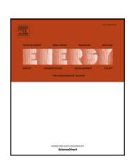

# Extended mapping and systematic optimisation of the Carnot battery trilemma for sub-critical cycles with thermal integration

Antoine Laterre [a](#page-0-0),[b](#page-0-1),[∗](#page-0-2) , Olivier Dumont [b](#page-0-1) , Vincent Lemort [b](#page-0-1) , Francesco Contino [a](#page-0-0)

- a *Institute of Mechanics, Materials and Civil Engineering (iMMC), Université catholique de Louvain (UCLouvain), Place du Levant,*
- *2, Louvain-la-Neuve, 1348, Belgium* b *Thermodynamics Laboratory, University of Liège (ULiège), Allée de la Découverte 17, Liège, 4000, Belgium*

# A R T I C L E I N F O

#### *Keywords:* Carnot battery Thermally integrated pumped thermal energy storage (TI-PTES) Multi-criteria optimisation Performance mapping High temperature heat pump Organic Rankine cycle

## A B S T R A C T

Thermally integrated pumped thermal energy storage (TI-PTES) is a flexibility option to recover low-grade heat and provide overnight storage. Common criteria when designing such systems are the power-to-power efficiency (electricity recovery), the exergy efficiency (combined heat and electricity recovery) and the energy density (storage size). However, these are generally conflicting and multi-criteria optimisation is therefore required. Design guidelines have been proposed for some specific case studies but are still lacking for the remaining wide range of possible integrations. This work therefore presents a systematic multi-criteria analysis of a TI-PTES, consisting of a vapour compression heat pump, a sensible heat storage and an organic Rankine cycle, in an extended integration domain. Results show that the storage temperature levels are key variables, as they directly influence the conflict between the performance of the heat pump and the organic Rankine cycle. Also, the intensity of the conflict between the three criteria increases with the temperature difference between the source and the sink, mainly because of the power-to-power efficiency (the density and the exergy efficiency are much less conflicting with each other). Finally, the relevance of thermal integration in TI-PTES is questioned when it leads to a sharp deterioration in exergy efficiency and density.

# **1. Introduction**

Next to sufficiency measures, improving the efficiency of energy systems and supporting the integration of renewables are key elements of the energy transition [\[1\]](#page-15-0). This includes the deployment of flexibility options, such as energy storage, as well as reducing the amount of energy lost in conversion from one form to another, such as the so-called ''waste heat'' [\[2\]](#page-15-1).

Both these points are currently hot topics in the scientific literature. On the one hand, much effort is spent on the development of cost-effective storage systems, like chemical batteries, power-to-x and thermal storage [\[3\]](#page-15-2). On the other hand, waste heat is increasingly perceived as an abundant and cheap source of energy [[2](#page-15-1)[,4\]](#page-15-3). In this regard, it has been estimated that, in 2012, 52% of the primary energy consumed worldwide was actually lost as technically recoverable waste heat [[2](#page-15-1)]. Despite its reduced exergy content (i.e. 63% of this waste energy had a temperature below 100◦C, which corresponds to only 21% of the total waste heat exergy content), the challenges of energy transition cannot waste any piece of the enormous volume of energy consumed every year. Another striking figure is that, in EU27, if only about half of the available waste heat were converted into electricity, it is estimated that the equivalent annual production would amount at 150 TWhel/year [[5](#page-15-4)].

There exist several routes to mitigate and recover this waste heat [\[2\]](#page-15-1). These include, first, prevention and avoidance, second direct reuse in the process chain (optionally through intermediate heat exchangers), then exergy upgrade with high temperature vapour compression heat pumps (HT-VCHP) [\[6\]](#page-15-5) and eventually conversion to electricity, using for instance organic Rankine cycles (ORC) [[7](#page-15-6),[8](#page-15-7)].

However, there is not always an on-site thermal demand, and the waste heat can have too low exergy potential to make it financially feasible to directly convert it into electricity. In such case, thermally integrated pumped thermal energy storage (TI-PTES, or thermally integrated Carnot batteries) could be an alternative option [[9](#page-15-8)]. The latter consists in upgrading the exergy content of a heat source (hotter than the ambient) with excess renewable electricity by using a heat pump, and to store it in a thermal energy storage (TES). Then, when electricity is needed, it can be produced on demand by discharging the TES with a

*E-mail address:* [antoine.laterre@uclouvain.com](mailto:antoine.laterre@uclouvain.com) (A. Laterre).

∗ Corresponding author at: Institute of Mechanics, Materials and Civil Engineering (iMMC), Université catholique de Louvain (UCLouvain), Place du Levant, 2, Louvain-la-Neuve, 1348, Belgium.

#### **Nomenclature**

#### **Greek and Latin letters**

| 𝛥p | pressure losses, bar      |
|----|---------------------------|
| 𝛥T | temperature difference, K |

efficiency, %

energy density, kWh/m3

Ex exergy, J/kg h enthalpy, J/kg p pressure, bar t temperature, ◦C v specific volume, m3/kg W specific work, J/kg

# **Sub- and superscripts**

| cs | cold sink         |
|----|-------------------|
| el | electrical        |
| gl | temperature glide |
|    |                   |

hp heat pump hs – cs source–sink temperature

hs hot source ht high temperature

II exergy

lt low temperature P2P power-to-power pp pinch point rel relative sc sub-cooling sh super-heating sp spread st storage

# **Abbreviations**

COP coefficient of performance GWP global warming potential

HP heat pump

HT-VCHP high temperature vapour compression heat

pump

ODP ozone depletion potential ORC organic Rankine cycle TES thermal energy storage

TI-PTES thermally integrated pumped thermal en-

ergy storage

heat engine. TI-PTES is therefore an interesting solution to recover lowgrade waste heat while providing the necessary flexibility to renewable energy systems (i.e. energy storage), which gives it more added value and can improve the economic viability of the whole system.

# *1.1. Thermally integrated pumped thermal energy storage*

Since its first mentions by Mercangöz et al. [[10\]](#page-15-9) and Steinmann [\[11](#page-15-10)], and actual first characterisation by Frate et al. [\[9\]](#page-15-8) in 2017, TI-PTES has attracted growing interest and several implementations have been proposed. The most common is the basic hot TI-PTES [[12\]](#page-15-11) (depicted in [Fig.](#page-2-0) [1](#page-2-0)), consisting in a sub-critical HT-VCHP, a two-tank sensible TES and a sub-critical ORC.

When optimising the thermodynamic cycle of TI-PTES, typical criteria are to maximise the power-to-power efficiency P2P (i.e. effectiveness of electricity recovery), the total exergy efficiency II (i.e. effectiveness of combined heat and electricity recovery) and the electrical energy density el (i.e. storage size). However, as pointed out by Frate et al. [[12\]](#page-15-11) in the case of a TI-PTES with sensible TES, these three objectives can be conflicting. This implies that it is usually not possible to design a TI-PTES that maximises these criteria simultaneously, and that trade-offs must therefore be discussed. Recently, Weitzer et al. suggested to formalise this conflicting nature by referring to it as the *Carnot battery trilemma* [[13\]](#page-15-12).

For now, many studies have optimised the thermodynamic design of TI-PTES and proposed cycle modifications to enhance some performance indicators (usually at least P2P). Frate et al. [[12,](#page-15-11)[14](#page-15-13)] for instance assessed the potential of using internal regenerators in the HT-VCHP and in the ORC. They showed that for source and sink temperatures of 80◦C and 15◦C respectively, internal regeneration increases II by 15%, and that it has the potential of being established as the reference configuration for TI-PTES.

Aiming at a better match between the TES and the cycles (thus a better efficiency), and at a higher energy density, Jockenhöfer et al. [\[4\]](#page-15-3) introduced the concept of thermal integration in the CHEST concept [[11\]](#page-15-10). The latter is constructed around an hybrid TES, using both sensible and latent heat storage. On their side, Weitzer et al. [\[13](#page-15-12),[15\]](#page-16-0) examined different organic flash cycles for the discharge part. The aim was to reduce the exergy losses during heat transfer between sensible TES with large temperature spreads and the working fluid. They demonstrated for several heat source temperatures that the basic flash cycle did not bring any efficiency enhancement, but that when combined with two-phase expansion and multiple pressure levels, significant efficiency gains were to be expected. They also emphasised that despite their increased complexity, these cycles required further consideration for TI-PTES because of their interesting potential to soften the *Carnot battery trilemma*. Lu et al. [[16\]](#page-16-1) considered the use of variable composition zeotropic mixtures in the basic TI-PTES configuration to reduce the exergy losses in each exchanger of the HT-VCHP, in addition to the losses between the sensible TES and the discharge cycle. They showed for different heat sink temperatures that interesting gains in II could be expected.

To continue recovering waste heat while discharging the system, Zhang et al. [[17\]](#page-16-2) introduced a TI-PTES design where a preheater is inserted into the ORC. This is used to start economising the fluid (i.e. preheating the fluid before evaporation) with the waste heat, before evaporation thanks to the heat from the TES. Their analysis showed that for low temperature spreads in the sensible TES, P2P could increase by more than 15% when the source is at 70◦C. Recently, Bellos et al. [\[18](#page-16-3)] also introduced a new concept based on regenerated cycles and using latent TES, where the waste heat first transfers some of its calories to the TES and then feeds the evaporator of the HT-VCHP with its remaining calories.

Finally, Dumont and Lemort [[19\]](#page-16-4) and Xia et al. [[20\]](#page-16-5) studied an alternative design named ''cold TI-PTES''. The idea is to use a cold latent TES (generally ice, possibly mixed with other substances to lower the solidification point), in order to increase the energy density without using higher temperature phase change materials, which are logically more expensive than water. A refrigeration cycle is then used to charge the storage tank, releasing the heat from the TES to the ambient. To discharge it, an ORC uses the waste heat as a hot source and the TES as a cold sink. Results showed that despite a lower efficiency than in the hot TI-PTES, the gain in density was non-negligible, which would make it possible to reduce the capital costs. However, more detailed techno-economic analyses are required and it should be noted that, to date, cold TI-PTES has only been treated in a minority of publications.

# *1.2. Limitations, aims of this study and work novelty*

The studies cited above show that sensible heat storage is the most common form of TES in TI-PTES. From a technical point of view, this can be explained by the ease of implementation, and by

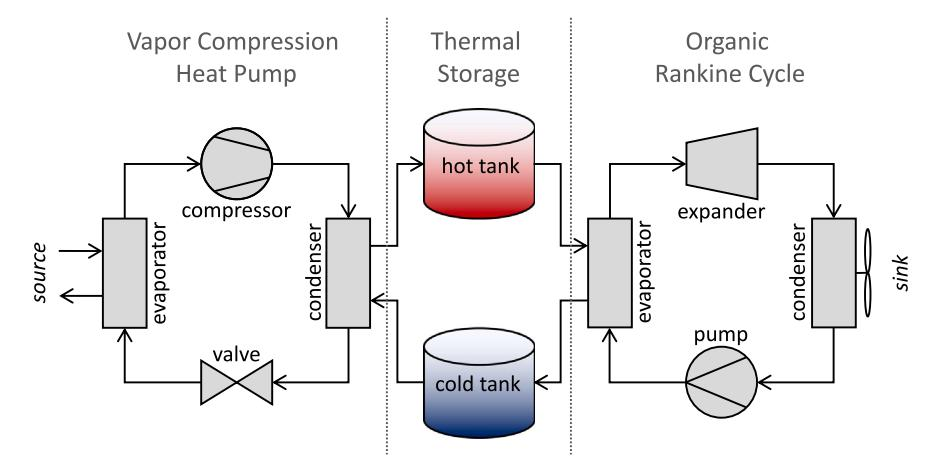

**Fig. 1.** Layout of the basic hot TI-PTES (Carnot battery). It is composed of a vapour compression heat pump (left), a two-tank sensible heat thermal storage (centre) and an organic Rankine cycle (right). Note that the circulating pumps and other auxiliaries are not shown here.

the lower observed pinches than in latent TES, which is key because Carnot batteries with low-temperature storage (< 150◦C) are very sensitive to this parameter [\[19](#page-16-4)]. However, this usually comes at the cost of lower energy densities, and less efficient matches between the cycles and the TES. Still, the majority of techno-economic studies also consider sensible TES, generally in two tanks in order to maintain a constant thermal profile and avoid the diffusion problems found in single stratified tanks [[12,](#page-15-11)[21–](#page-16-6)[24\]](#page-16-7).

Although TI-PTES is an active research topic, it should be noted that the majority of studies published to date do not cover the *Carnot battery trilemma* in its entirety. This is reflected in the fact that the technology is often studied in isolation, and not integrated into a specific energy system where all three criteria matter. In particular, the use of waste heat is often perceived as a way of ''artificially'' boosting P2P, without looking at the overall energy gain for the energy system in which it is integrated. Density is also frequently overlooked. In addition, many studies are limited to parametric analyses, without any optimisation. Also, although different fluids are sometimes considered, the analysis methods are usually not systematic and therefore do not consider all potential synergies between the fluids and the thermodynamic cycles.

Currently, no paper has focused on optimising and mapping the performance of TI-PTES with respect to the *Carnot battery trilemma* in the entire thermal integration domain (i.e. combination of possible source and sink temperatures). As an illustration, the current domain exploration for TI-PTES with sensible TES is represented in [Fig.](#page-3-0) [2](#page-3-0). The region with source temperatures below 60◦C has been particularly little explored. This can be attributed in part to the fact that, due to Carnot efficiency, P2P is lower in that region of the domain (i.e. usually below 50%), whereas as TI-PTES has often been considered primarily as an electrical storage option, this performance may have seemed rather poor. However, when looking at TI-PTES as a flexible waste heat recovery option, there is no indication that P2P should override II. Moreover, a significant share (i.e. 45%) of the low temperature waste heat to be recovered (i.e. < 200◦C) is precisely below 60◦C, as shown by Marina et al. [[6](#page-15-5)].

A direct consequence of this poor investigation of the integration domain is that it is currently not possible to provide theoretical maximum performance and design guidelines for TI-PTES across the entire domain, and with regard to the three criteria of the *Carnot battery trilemma*.

The goal of this work is therefore to investigate and characterise the *Carnot battery trilemma* over the entire integration domain. Source temperatures go up to 100◦C, a value above which it does not seem appropriate to employ TI-PTES, as waste heat can be recovered more efficiently. The sink temperatures range from –25 to 50◦C to cover the majority of climates (i.e. from polar to hot) that can be encountered if the ambience is used as a sink and to represent a certain range of poly-generation applications where the latent heat of condensation in the ORC is recovered.

First, multi-criteria optimisation of the basic hot TI-PTES is conducted to maximise simultaneously the three objectives of the *trilemma*. A specificity of the method is to simultaneously optimise the thermodynamic cycle and the choice of working fluids, to fully embrace the potential synergies between them. Then, the maximum theoretical performance that could be reached is mapped for each objective, and design guidelines are formulated according to the desired objectives. The results are used to assess whether the guidelines can be generalised to the whole domain or whether they need to be adapted in each region. Afterwards, the trilemma is characterised in more details at several relevant locations of the thermal domain. The shape of the Pareto fronts is used to discuss the intensity of the conflict between the different objectives. Based on the results, implementation constraints are discussed, and design recommendations and cycle improvements are finally proposed.

# **2. Model and methods**

# *2.1. System model*

The system investigated in this work is the basic hot TI-PTES. It consists of a sub-critical HT-VCHP, a two-tank pressurised water TES and a sub-critical air-cooled ORC (see [Fig.](#page-2-0) [1](#page-2-0)). Although enhanced cycles can give better performance, the basic configuration is adopted as the aim of this study is to provide generic design guidelines for this reference case. Based on the obtained results, cycle improvements are suggested in results section.

The two-tank architecture is preferred to a single tank as it provides a constant thermal profile, regardless of the state of charge and storage duration (i.e. no diffusion losses due to a thermocline). Also, the thermal losses are ignored, so the storage duration has no effect on the tanks temperature. Note that, assuming an ideal thermocline, the results obtained here can be extrapolated to the single tank case [[12](#page-15-11)]. Despite it has a lower energy density, sensible TES is adopted here because latent TES is not mature yet since its thermal stability and reliability remain unclear in the considered temperature range (up to 150◦C, see [Table](#page-3-1) [1\)](#page-3-1) [[29\]](#page-16-8).

The thermodynamic performance of the system is assessed using CoolProp [\[30](#page-16-9)] and with an in-house Python model[1](#page-2-1) whose parameters are summarised in [Table](#page-3-1) [1.](#page-3-1) Some are fixed (e.g. pinch-point in heat

1 The code can be provided upon request.

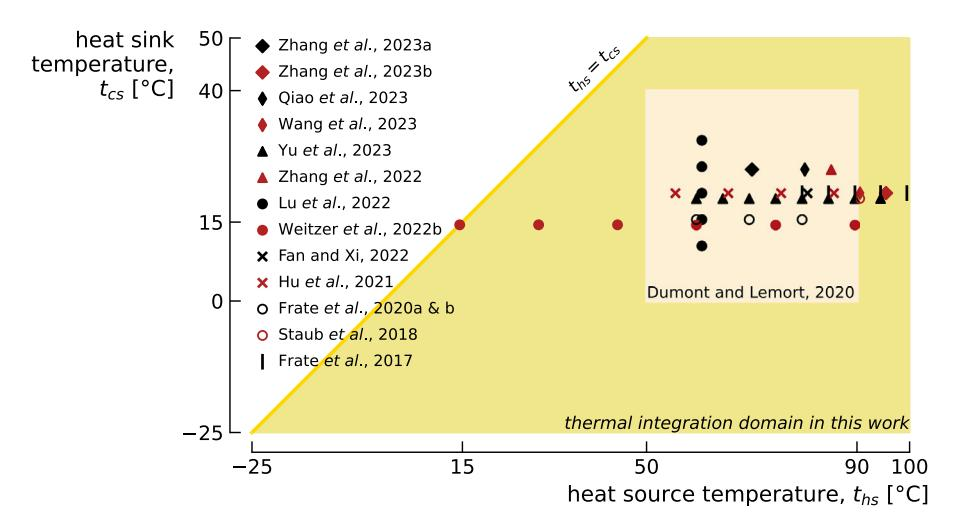

Fig. 2. Current exploration of the thermal integration domain for TI-PTES with sensible TES. Note that most authors have not studied the *Carnot battery trilemma* in its entirety. Moreover, only few of them have conducted proper cycle optimisation. List of references: Zhang et al. 2023a [25]; Zhang et al. 2023b [17]; Qiao et al. 2023 [26]; Wang et al. 2023 [27]; Yu et al. 2023 [24]; Zhang et al. 2022 [23]; Lu et al. 2022 [16]; Weitzer et al. 2022b [15]; Fan and Xi, 2022 [22]; Hu et al. 2021 [21]; Dumont and Lemort, 2020 [19]; Frate et al. 2020a [12] & 2020b [14]; Staub et al. 2018 [28]; Frate et al. 2017 [9].

**Table 1**Model parameters and constraints for the TI-PTES optimisation.

|                               |                           | *                            |                             |                          |                 |
|-------------------------------|---------------------------|------------------------------|-----------------------------|--------------------------|-----------------|
| Name                          | Symbol                    | Value                        | Name                        | Symbol                   | Value           |
| Heat source temperature       | t hs           | −25 to 100°C                 | Heat sink temperature       | t cs          | −25 to 50°C     |
| Heat source temperature glide | $\Delta T_{hs,gl}$        | design variable              | Heat sink temperature glide | $\Delta T_{cs,gl}$       | 10 K [12]       |
| HP vapour super-heating       | $\Delta T_{hp,sh}$        | design variable              | ORC vapour super-heating    | $\Delta T_{\rm orc,sh}$  | design variable |
| HP liquid sub-cooling         | $\Delta T_{hp,sc}$        | design variable              | ORC liquid sub-cooling      | $\Delta T_{\rm orc,sc}$  | 3 K [13]        |
| Min. HP temperature lift      | ∆T min hp   | 5 K [19]                     | Min. ORC temperature drop   | ∆T min orc    | 5 K [19]        |
| HP working fluid              | fluid hp       | design variable              | ORC working fluid           | fluid orc     | design variable |
| Compressor efficiency         | $\eta_{\rm is,comp}$      | 0.75 [19]                    | Expander efficiency         | $\eta_{\rm is,exp}$      | 0.75 [19]       |
| Max. compressor exit temp.    | t hp 1         | 180°C [12]                   | Pump efficiency             | $\eta_{\mathrm{is,pmp}}$ | 0.50 [19]       |
| Min. HP/ORC super-heating     | ∆T min sh   | 3 K [13]                     | Min. HP sub-cooling         | $\Delta T_{sc}^{min}$    | 3 K [13]        |
| Hot tank storage temp.        | t st,ht        | design variable              | Storage temp. spread        | $\Delta T_{st,sp}$       | design variable |
| Max. storage temperature      | t max st,ht | 150°C [13]                   | Storage pressure            | $p_{st}$                 | 7.5 bar         |
| Min. storage temperature      | tmin st,lt             | $t_{hs}-\varDelta T_{hs,gl}$ | Min. HP/ORC pressure        | $p_{ m hp/orc}^{ m min}$ | 0.5 bar [12]    |
| Pinch point in exchangers     | $\Delta T_{pp}$           | 3 K [12,19]                  | Pressure losses             | ∆p                       | 0.0 bar [12,13] |
|                               |                           |                              |                             |                          |                 |

exchangers) while some others are employed as optimisation variables (e.g. storage temperature). Several constraints are also reported in Table 1. These are employed to give technical plausibility to the cycles and to facilitate their implementation in real machines. For instance, minimum pressures of 0.5 bar are set in the HT-VCHP and in the ORC to limit the necessary degree of vacuum [31]. Of course, aboveatmospheric pressures are ideally desired, but this would be quite restrictive for the choice of working fluids in some parts of the domain (the higher the critical point, the lower the saturation pressure, which penalises low saturation temperatures). Also, minimum temperature lifts and drops (i.e. temperature difference between source and sink supplies) of 5 K are set in the HT-VCHP and in the ORC to prevent the cycles from degenerating into configurations where their action on their heat sources would be zero. The hot tank temperature is restricted to 150°C to limit the need for water pressurisation (thus the cost) and the maximum compressor discharge temperature is 180°C to represent the current HT-VCHP practice [32-34]. Main reasons for that are to prevent lubricant degradation and fluid decomposition [31].

In this model, the evaporation and condensation pressures are obtained with the pinch method. Unlike Frate et al. [12], who imposed a minimum pinch temperature difference while allowing their model to use higher ones, this approach is selected to reduce the number of design variables (the saturation pressures in the HT-VCHP and in the ORC are here fixed by the temperature profile of the secondary fluids), which relaxes the optimisation problem. This is also justified by the fact that most studies have shown that the pinch point must be as low as possible to maximise the efficiency [15,19].

Another assumption is that all pressure drops, which are technology dependent, are neglected to get more generic conclusions. Nevertheless, the sensitivity of TI-PTES performance to these losses deserves further analyses. Also note that the heat source and sink are treated as pure dry atmospheric air (i.e. only sensible heat is considered, no humidity).

#### 2.2. Optimisation problem

The *Carnot battery trilemma* consists of the conflict between the power-to-power efficiency  $\eta_{\rm P2P}$ , the exergy efficiency  $\eta_{\rm II}$ , and the energy density  $\rho_{\rm el}$ . These performance indicators are therefore adopted for the multi-criteria optimisation. They are defined as

$$\eta_{\rm P2P} = \frac{W_{\rm orc}}{W_{\rm hp}} \ , \tag{1}$$

$$\eta_{\rm II} = \frac{W_{\rm orc}}{W_{\rm ho} + Ex_{\rm hc}} , \qquad (2)$$

$$\rho_{\rm el} = \frac{h_{\rm st,ht} - h_{\rm st,lt}}{v_{\rm st,h} + v_{\rm st,h}} \cdot \eta_{\rm orc} , \qquad (3)$$

where  $W_{orc}$  and  $W_{hp}$  are the ORC and HT-VCHP net work output and input, respectively, and  $Ex_{hs}$  is the exergy of the heat source. The reference state used for the latter's definition corresponds to the heat sink temperature. The specific case  $t_{hs} = t_{cs}$  thus yields  $\eta_{II} = \eta_{p2p}$ , since  $Ex_{hs} = 0$ . The density corresponds to the amount of electricity that can be discharged per unit volume of the tanks.

To optimise the performance of TI-PTES, a set of eight design variables are used. The hot tank storage temperature  $t_{\text{st,ht}}$ , the heat

**Table 2** Technical and physical properties of the investigated working fluids (data from CoolProp 6.4.1 [[30](#page-16-9)]).

| Fluid                  | Type     | Tcrit ◦C] [ | pcrit [bar] | psat,15 ◦C [bar] | GWP100 | ASHRAE 34b | Shape      | No. |
|------------------------|----------|-------------------|----------------|---------------------|--------|---------------|------------|-----|
| R1150 (Ethylene)       | HO       | 9.2               | 50.4           | n.a.                | 6.8    | A3            | wet        | 1   |
| R170 (Ethane)          | HC       | 32.2              | 48.7           | 33.7                | 0.437a | A3            | wet        | 2   |
| R41                    | HFC      | 44.1              | 59.0           | 30.1                | 135a   | N/A           | wet        | 3   |
| R1270 (Propylene)      | HO       | 91.1              | 45.6           | 8.9                 | 3.1    | A3            | wet        | 4   |
| R1234yf                | HFO      | 94.7              | 33.8           | 5.1                 | 0.501a | A2L           | dry        | 5   |
| R290 (Propane)         | HC       | 96.7              | 42.5           | 7.3                 | 0.02a  | A3            | wet        | 6   |
| R161                   | HFC      | 102.1             | 50.1           | 7.0                 | 4.84a  | N/A           | wet        | 7   |
| R1243zf                | HFO      | 103.8             | 35.2           | 4.4                 | 0.261a | N/A           | isentropic | 8   |
| R1234ze(E)             | HFO      | 109.4             | 36.3           | 3.6                 | 1.37a  | A2L           | isentropic | 9   |
| R152a                  | HFC      | 113.3             | 45.2           | 4.4                 | 164a   | A2            | wet        | 10  |
| R13I1                  | H        | 123.3             | 39.5           | 3.7                 | 0.4    | A1            | wet        | 11  |
| RC270 (cyclo-Propane)  | HC       | 125.2             | 55.8           | 5.5                 | N/A    | A3            | wet        | 12  |
| RE170 (dimethyl-Ether) | HC       | 127.2             | 53.4           | 4.4                 | 1.0    | A3            | wet        | 13  |
| R717 (Ammonia)         |          | 132.2             | 113.3          | 7.3                 | N/A    | B2L           | wet        | 14  |
| R600a (iso-Butane)     | HC       | 134.7             | 36.3           | 2.6                 | N/A    | A3            | dry        | 15  |
| 1-Butene               | HC       | 146.1             | 40.1           | 2.2                 | N/A    | N/A           | dry        | 16  |
| R1234ze(Z)             | HFO      | 150.1             | 35.3           | 1.2                 | 0.315a | A2L           | isentropic | 17  |
| R600 (n-Butane)        | HC       | 152.0             | 38.0           | 1.8                 | 0.006a | A3            | dry        | 18  |
| trans-2-Butene         | HC       | 155.5             | 40.3           | 1.7                 | N/A    | N/A           | dry        | 19  |
| Neopentane             | HC       | 160.6             | 32.0           | 1.2                 | N/A    | N/A           | dry        | 20  |
| R1233zd(E)             | HCFO     | 166.5             | 36.2           | 0.9                 | 3.88a  | A1            | dry        | 21  |
| Novec649               |          | 168.7             | 18.7           | 0.3                 | N/A    | N/A           | dry        | 22  |
| R601a (iso-Pentane)    | HC       | 187.2             | 33.8           | 0.6                 | N/A    | A3            | dry        | 23  |
| R601 (n-Pentane)       | HC       | 196.5             | 33.7           | 0.5                 | N/A    | A3            | dry        | 24  |
| R602 (n-Hexane)        | HC       | 234.7             | 30.4           | 0.1                 | 3.1    | N/A           | dry        | 25  |
| Acetone                |          | 235.0             | 47.0           | 0.2                 | 0.5    | N/A           | isentropic | 26  |
| cyclo-Pentane          | HC       | 238.6             | 45.7           | 0.3                 | N/A    | N/A           | dry        | 27  |
| Methanol               |          | 239.4             | 82.2           | 0.1                 | 2.8    | N/A           | wet        | 28  |
| R603 (n-Heptane)       | HC       | 267.0             | 27.4           | < 0.1               | N/A    | N/A           | dry        | 29  |
| cyclo-Hexane           | HC       | 280.5             | 40.8           | < 0.1               | N/A    | N/A           | dry        | 30  |
| Benzene                | HC       | 288.9             | 48.9           | < 0.1               | N/A    | N/A           | dry        | 31  |
| MDM                    | Siloxane | 290.9             | 14.1           | < 0.1               | N/A    | N/A           | dry        | 32  |
| Toluene                | HC       | 318.6             | 41.3           | < 0.1               | 3.3    | N/A           | dry        | 33  |
| ethyl-Benzene          | HC       | 344.0             | 36.2           | < 0.1               | N/A    | N/A           | dry        | 34  |

a Value from Table 7.SM.7 of IPCC AR6 [\[36](#page-16-19)].

source glide Ths,gl (i.e. temperature difference between supply and exit of the evaporator of the HT-VCHP) and the storage temperature spread Tst,sp (i.e. temperature difference between the hot and cold tanks) have already been identified as key parameters influencing P2P, II and el respectively [\[12](#page-15-11)[,15](#page-16-0)[,19](#page-16-4)]. Note that it is here assumed that the heat source can be treated as ''free'' waste heat (i.e. the heat source glide has no constrained value and is therefore used as a design variable). We also include the liquid sub-cooling Thp,sc in the HT-VCHP as well as the vapour super-heating Thp/orc,sh in the HT-VCHP and in the ORC. Indeed, these parameters can take different optimum values depending on the thermal profiles and working fluids [[12](#page-15-11),[35\]](#page-16-20). The constraints associated with these variables are reported in [Table](#page-3-1) [1.](#page-3-1)

Finally, an innovative aspect of the method proposed here compared with the state of the art in Carnot battery research is to simultaneously optimise the thermodynamic cycle and the selection of working fluids in the HT-VCHP and ORC, to fully embrace the existing synergies between them (instead of running optimisation for all possible pairs and keeping only the best performing sets [\[14](#page-15-13)]). In this work, a list of 34 working fluids is considered. These were selected from the list of those available in CoolProp because they have zero ozone depletion potential (compliance with Montreal protocol), low to moderate global warming potential (compliance with Kigali Amendment and EU F-gas regulation) and because their critical point is compatible with subcritical cycles in the temperature range investigated in this work (i.e. thermal domain and storage temperatures). The full list of fluids is available in [Table](#page-4-2) [2](#page-4-2).

To map the performance of TI-PTES, the integration domain is discretised with a 5 K resolution into 296 cells. In each cell, optimisation is carried out using NSGA-II [\[37](#page-16-21)], a well established genetic algorithm for multi-criteria problems, through the RHEIA framework [[38\]](#page-16-22). Note that particle swarm optimisation was also tested through pymoo [\[39](#page-16-23)]. However, it did not show a lower computational budget for equivalent optima.

In [Table](#page-3-1) [1,](#page-3-1) all design variables are continuous except the working fluids. To integrate them to the problem, these were sorted by critical temperature and got assigned tags ranging from 1 to 34. The continuous design space for each fluid then ranges from 0.51 to 34.49, and each tag is obtained by converting the value to the closest integer. Note that sorting the fluid by critical temperature is intended to facilitate the natural selection of well performing fluids from generation to generation.

The optimisation process was carried out in two main stages, in order to achieve global convergence and avoid the curse of local optima. Indeed, the optimisation domain to be covered is relatively complex – the term porous could be employed – as many combinations of variables lead to physically infeasible solutions or which do not respect the design constraints (e.g. high storage temperatures make subcritical operations impossible if the critical temperature of the fluid is too low). To cover this domain properly, the population size and mutation probability are first set to 500 and 50%, respectively. In this sense, the idea is to build a preliminary map in a way that is almost like a random search. Experience has shown that a number of 1000 generations is generally sufficient to obtain ''global'' optima for each objective. The results are then post-processed: when a cell of the thermal domain shows much worse performance than its neighbours or causes a discontinuity in the map trends, some individuals from the surrounding cells are inserted in its population. Then, optimisation is relaunched for that cell. In a second time, the mutation probability is reduced to 10% and optimisation is relaunched in the entire domain to refine the results. These two steps are reproduced until a global convergence seems to be reached (without any guarantee) and uniformity is obtained on the performance map. The optimisation process is illustrated in [Fig.](#page-5-0) [3.](#page-5-0)

b ASHRAE Standard 34-2022, ''Designation and Safety Classification of Refrigerants''.

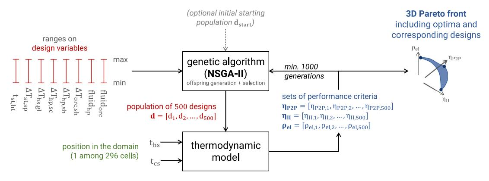

Fig. 3. Illustration of the optimisation process carried out in each cell. Initially, no starting population is provided, so the optimiser selects the 500 designs from the ranges of design variables through Latin Hypercube Sampling. A set of 1000 generations is then run with a mutation probability of 50% to capture the global optima. In a second step, the mutation probability is reduced to 10% and the optimisation is relaunched using the last generation as initial starting population. This refines the results and smoothes the Pareto front.

#### 3. Results

The first part of the results focuses on mapping the performance of TI-PTES over the entire thermal integration domain, and on analysing the optimal thermodynamic designs. The various trends are then discussed and design guidelines are step by step constructed according to the objectives sought. Conflicts between the different objectives are also qualitatively illustrated by juxtaposing the different maps in a pay-off table. In the second part, the design guidelines are summarised and graphically illustrated over the domain. Further discussions on some design parameters are also carried out. In the third part, the *Carnot battery trilemma* is studied quantitatively by analysing the Pareto fronts resulting from the multi-criteria analysis. A conflict index is also set up to map the intensity of the *trilemma*.

#### 3.1. Performance mapping

In each of 296 the cells of the domain (i.e. combination of source and sink temperatures), the three designs providing the best  $\eta_{\rm P2P}$ ,  $\eta_{\rm II}$ , and  $\rho_{\rm el}$  were selected to construct the maps. These are depicted in Fig. 4. They are represented as a pay-off table to illustrate the conflict between the different objectives of the *trilemma*: for each optimised objective, the value of the two others is also mapped. Since they are key variables in TI-PTES [12,19], the corresponding heat source temperature glide  $\Delta T_{\rm hs,gl}$ , hot storage temperature  $t_{\rm st,ht}$  and storage temperature spread  $\Delta T_{\rm st,sp}$  are depicted in Fig. 5. The other design variables, including the working fluids, vapour super-heating and liquid sub-cooling are discussed later in Section 3.2. Finally, in order to make the thermodynamic cycles more legible and complementary to the maps, typical T-s diagrams are shown in Fig. A.1 in Appendix A.

#### 3.1.1. Results for optimised $\eta_{P2P}$

As illustrated in Fig. 4, the power-to-power efficiency increases with the difference between the source and sink temperatures  $\Delta T_{hs-cs}$  from about 30% when  $\Delta T_{hs-cs}=0$  K to about 440% when  $\Delta T_{hs-cs}=125$  K. However, because of a design shift, the growth is not continuous (the tipping point is  $\Delta T_{hs-cs}=30$  K). Indeed, for  $\Delta T_{hs-cs}>30$  K, the hot storage temperature  $t_{st,ht}$  is minimised so that the heat pump lift  $\Delta T_{hp}$  (i.e. the temperature difference between the storage and the source,  $t_{st,ht}-t_{hs}$ ) is always minimised. In this sense, the coefficient of performance of the HT-VCHP is maximised to the detriment of the ORC efficiency, which is affected by the lower  $t_{st,ht}$ .

The existence of the 30 K tipping point, which had also been observed by Weitzer et al. [15], can be explained with  $\eta_{\rm P2P}^{\rm Carnot}$ , the Carnot efficiency of TI-PTES (i.e. the thermodynamic limit) [4]. Considering the irreversibilities at the heat transfers between the working fluids and the secondary fluids, which can be modelled as the temperature

difference  $\Delta T$  between the fluids (comparable to a pinch temperature), and assuming endoreversible HT-VCHP and ORC (i.e. no internal irreversibilities), the latter is defined as

$$\eta_{\rm P2P}^{\rm Carnot} = {\rm COP_{hp}^{Carnot}} \cdot \eta_{\rm orc}^{\rm Carnot} = \frac{t_{\rm st,ht} + \Delta T}{t_{\rm st,ht} - t_{\rm hs} + 2\Delta T} \cdot \frac{t_{\rm st,ht} - t_{\rm cs} - 2\Delta T}{t_{\rm st,ht} - \Delta T} \quad , (4)$$

and it is depicted in Fig. 6. When  $\Delta T_{hs-cs}$  is below the tipping point (i.e.  $\Delta T_{hs-cs} < 30$  K for  $\Delta T = 8$  K), the exergy losses at the ORC cannot be sufficiently compensated by the high COP, thus  $t_{st,ht}$  must be increased to reduce these losses and to increase  $\eta_{orc}$ , so that the resulting  $\eta_{P2P}$  is improved (see Fig. 6(a)).

It can also be shown that the tipping point increases with the heat transfer irreversibilities (see difference between  $\Delta T=0$  and 8 K in Fig. 6). Note that the particular case  $\Delta T=0$  (i.e. no irreversibilities) does not allow detection of the tipping point, and therefore leads to incorrect conclusions about the optimum  $t_{st,ht}$  (Fig. 6(b) illustrates that minimising  $t_{st,ht}$  is always beneficial). Also note that this "30 K" value is specific to the pinch-point selected in this work. Furthermore, as the charging and discharging cycles are not endoreversible (there are internal irreversibilities due, among others, to the compression and expansion machines), it cannot be said that it is solely a function of heat transfer irreversibilities. However, 30 K seems to be the value to bear in mind for TI-PTES since Weitzer et al. [15] obtained a similar value comprised between 25 K and 40 K.

Below the tipping point (i.e.  $\Delta T_{hs-cs} \leq 30$  K), on the other hand, the lift is almost always maximised, so  $t_{st,ht} = t_{st,ht}^{max} = 150^{\circ}C$  in that region of the domain. The only exception is for the part  $t_{hs} > 35$ °C and  $\Delta T_{hs-cs} \leq 30$  K, where  $t_{st,ht}$  gradually increases with decreasing  $\Delta T_{hs-cs}$ . The reason for this discontinuity in  $t_{st,ht}$  is due to the constraint  $t_{st,ht}^{max}$ 150°C. In fact, as  $t_{cs}$  is also higher in that region,  $\eta_{orc}$  is penalised since the difference tst.ht-tcs decreases. To compensate, COPhp is increased by reducing  $t_{st,ht}$  (which, by the way, affects  $\eta_{orc}$  even more). An optimum trade-off must therefore be found between  $\eta_{\rm orc}$  and  ${\rm COP_{hp}}$ . Note that the existence of this zone is purely due to the technological constraint on  $t_{st,ht}^{max}$ . In fact, by increasing the latter,  $\eta_{orc}$  would increase again and it would no longer be necessary to decrease  $t_{st,ht}$  to maximise  $\eta_{P2P}$ . This is illustrated for one cell of the domain in Appendix B by raising  $t_{st\;ht}^{max}$ to 200°C, although this is probably beyond the current technological limits for HT-VCHP. The message that emerges from this analysis is thus that the optimum thermodynamic configuration is a function of the design constraints.

Note that the analysis with  $\eta_{\rm p2P}^{\rm Carnot}$  tends to validate the assumption that  $t_{\rm st,ht}$  should always be maximised below the tipping point (even for  $t_{\rm hs} > 35\,^{\circ}{\rm C}$ ), and that the results observed in Fig. 5 are effectively due to the constraint on  $t_{\rm st,ht}^{\rm max}$ .

Finally, it should be noted that the loss in  $\eta_{\rm P2P}$  due to this  $t_{\rm st,ht}^{\rm max} = 150^{\circ}{\rm C}$  constraint is very small. In fact, the iso- $\eta_{\rm P2P}$  lines shown in

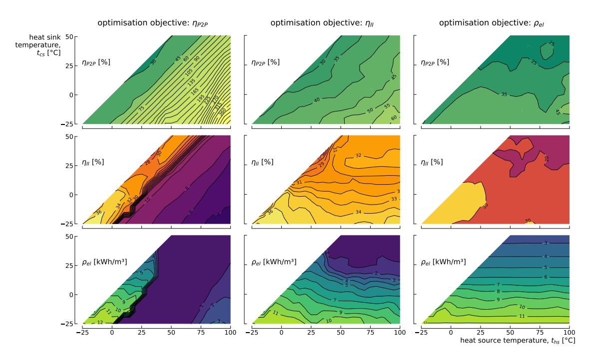

**Fig. 4.** Performance maps with P2P (1st row), II (2nd row) and el (3rd row) for the configurations maximising P2P (1st column), II (2nd column) and el (3rd column), respectively. Some maps have been smoothed using Gaussian filtering to eliminate local convergence issues (model artefacts). Please note that the spacing between the contour lines is refined on some maps to increase legibility.

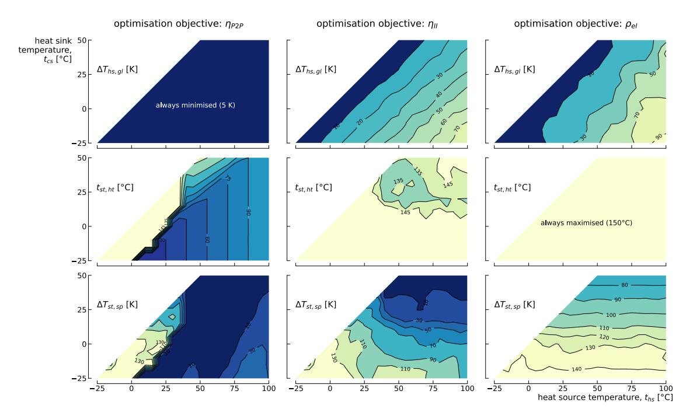

**Fig. 5.** Set of design variables with the most significant influence on the Carnot battery trilemma: Ths,gl (1st row), tst,ht (2nd row) and Tst,sp (3rd row). Some contour lines have been smoothed to eliminate local convergence issues (model artefacts).

[Fig.](#page-6-0) [4](#page-6-0) are homogeneous in this region of the domain and show no discontinuity. On the other hand, it can be seen that the spread is minimised there, resulting in a significant reduction in el.

Overall, this analysis perfectly illustrates that approaches such as near-optimum analyses [\[40](#page-16-24)] can lead to different designs for similar performance, and that such methods should be considered, for instance, to identify whether tolerating a small loss in P2P makes it possible to maintain el at a high level. This issue is further discussed in the multi-criteria analysis in Section [3.3.](#page-11-0)

Another key message from these results is that, when Ths–cs is above the tipping point, the search for the maximum P2P leads to a TI-PTES degenerated into a TES + ORC (i.e. the heat pump lift is minimised), which makes it a waste heat recovery option, but no longer a true electrical storage system. This observation has very practical consequences. When the TI-PTES is used with free waste heat (heat source glide not constrained by the application) in this part of the domain, the sole search for the best P2P is an absurdity because it leads to the use of an HT-VCHP whose action is zero: the exergy

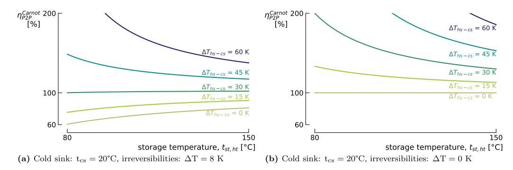

Fig. 6. Carnot efficiency of TI-PTES with and without consideration of heat transfer irreversibilities. The latter are represented through ΔT, the temperature difference between the working fluids and the secondary fluids. It illustrates well that a TI-PTES model which ignores the heat transfer irreversibilities does not allow to detect the tipping point and always recommends to minimise tst.ht.

content of the waste heat is not increased (i.e. the thermal storage is at the same temperature as the source) and the electrical consumption of the HT-VCHP then turns out to be pure exergy destruction. This degeneration is well illustrated in the T-s diagrams in Figs. A.1(g) & A.1(j) in Appendix A: the HT-VCHP only raises  $t_{st,ht}$  by 5 K compared with  $t_{hs}$  (minimum constraint), and the extent of exergy loss through the heat transfers is clearly visible.

Regarding the other two design variables, since maximising  $\eta_{\rm P2P}$  involves getting as close as possible to ideal Carnot cycles, the heat source glide  $\Delta T_{\rm hs,gl}$  and storage temperature spread  $\Delta T_{\rm st,sp}$  are minimised on the largest part of the domain to limit the exergy losses at the heat transfers, and to get close to square shapes on the T-s diagrams (see Figs. A.1(d) & A.1(g)). Consequently,  $\eta_{\rm II}$  and  $\rho_{\rm el}$  are rather poor (see Fig. 4), since a lot of exergy is lost at the source ( $\Delta T_{\rm hs,gl}$  is minimised) and because the low  $\Delta T_{\rm st,sp}$  limits the thermal density. It should be noted, however, that  $\eta_{\rm II}$  gradually deteriorates as  $\Delta T_{\rm hs-cs}$  increases, because the exergy content of the source also increases, while most of it is lost to the environment (because the heat source glide is low). The minimisation of  $\Delta T_{\rm st,sp}$  is in line with the results reported by Weitzer at al. [15]: they showed that for storage temperatures below 120°C, increasing  $\Delta T_{\rm st,sp}$  deteriorates  $\eta_{\rm P2P}$ .

Let us also mention that in the south-eastern part of the domain,  $\Delta T_{st,sp}$  increases slightly (this is also visible in Fig. 7 where  $\Delta T_{hs-cs} > 60^{\circ} \text{C}$ ) in order to reduce the condensation temperature in the HT-VCHP (see Fig. A.1(j)) and to increase its COP, which results in a partial improvement in the density.

The above analysis does however not apply to the region of the domain where the storage temperature is maximised (i.e. below the 30 K tipping point). There, the storage spread takes much higher values: the relative storage spread, which is defined as

$$\Delta T_{\text{st,sp}}^{\text{rel}} = \frac{\Delta T_{\text{st,sp}}}{t_{\text{st,ht}} - t_{\text{cs}}} \quad , \tag{5}$$

lies between 50% and 90% as illustrated in Fig. 7. Weitzer et al. [15] also showed that when the storage temperature was maximised, increasing the storage temperature spread to an optimum value was necessary to maximise  $\eta_{\rm P2P}$ . The main reason for this is that large spreads make it possible to lower the condensation temperature in the HT-VCHP, which reduces the compression work, while at the same time allowing significant sub-cooling, which increases the refrigeration effect, thus improving the COP (this is well illustrated by the T-s diagram in Fig. A.1(a)). However, as this penalises the ORC efficiency, there is an optimal spread to be found. Interestingly, this leads to increased  $\rho_{\rm el}$  and relaxes the *Carnot battery trilemma*, as this will be further discussed in the multi-criteria analysis.

To ease the formulation of guidelines, Fig. 7 also introduces the relative heat pump lift,

$$\Delta T_{hp}^{rel} = \frac{t_{st,ht} - t_{hs}}{t_{st,ht}^{max} - t_{hs}} \qquad . \tag{6}$$

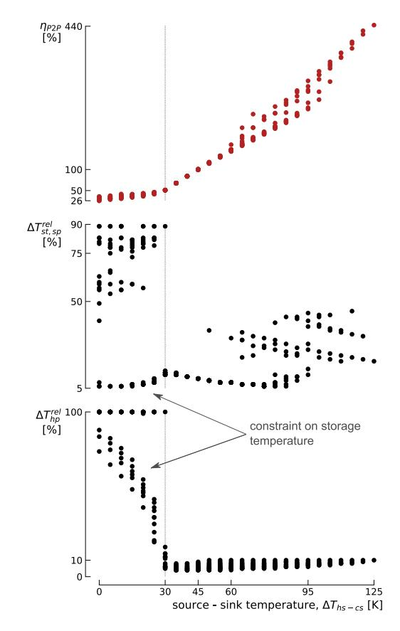

Fig. 7. Optimised power-to-power efficiency (red dots), corresponding relative storage spread  $\Delta T_{\rm st,p}^{\rm rel}$  (black dots) and corresponding relative heat pump lift  $\Delta T_{\rm hp}^{\rm rel}$  (black dots) depicted according to their source–sink temperatures. The deviation from theory due to  $t_{\rm st,h}^{\rm max} = 150\,^{\circ}{\rm C}$  is clearly visible for  $\Delta T_{\rm st,p}^{\rm rel}$  and  $\Delta T_{\rm pp}^{\rm rel}$ .

The latter clearly shows where the lift is minimised and maximised, and prescribes it a value in the region where  $\Delta T_{hs-cs} \leq 30$  K and  $t_{hs} > 35^{\circ}$ C (region which exists because of the constraint on the maximum storage temperature).

#### 3.1.2. Results for optimised $\eta_{II}$

The exergy efficiency globally drops as the sink temperature  $t_{cs}$  increases from about 36% when  $t_{cs}=-25^{\circ}\text{C}$  to about 30% when  $t_{cs}=15^{\circ}\text{C}$  (see Figs. 4 & 8). The main driver is the decrease of the ORC efficiency  $\eta_{orc}$  (see Fig. 8). This is because, in that region of the domain, the storage temperature  $t_{st,ht}$  is always maximised (i.e. maximisation of  $\eta_{orc}$  to the cost of reduced COPhp), so that, by Carnot efficiency, an

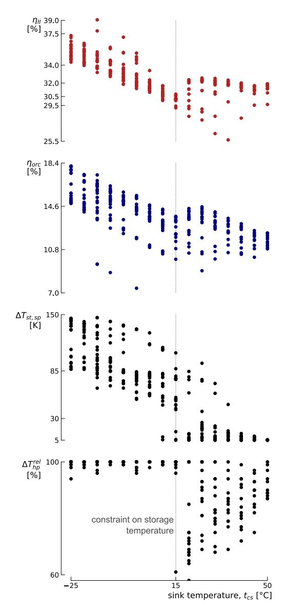

Fig. 8. Optimised exergy efficiency (red dots), ORC efficiency (blue dots), storage temperature spread (black dots) and corresponding relative heat pump lift (black dots) depicted according to the sink temperatures. (For interpretation of the references to colour in this figure legend, the reader is referred to the web version of this article.)

increase in  $t_{cs}$  leads to a reduction in  $\eta_{orc}$ . Also note that the storage temperature spread  $\Delta T_{st,sp}$  decreases as  $t_{cs}$  increases, so as not to affect  $\eta_{orc}$  too much. Indeed, for some  $t_{st,ht}$  and  $t_{cs}$ , the greater the spread, the lower the evaporation point, and therefore the lower  $\eta_{orc}$ .

This result is partly in contrast with that of Frate et al. [12] who, for equivalent design variables, also recommended maximising  $t_{st,ht}$  but minimising  $\Delta T_{st,sp}$  to maximise  $\eta_{II}$ . The explanation we find is that, when  $t_{st,ht}$  is maximised, increasing the spread is necessary because the gain in COP due to sub-cooling in the HT-VCHP compensates for the loss in  $\eta_{orc}$  (i.e. there is an optimum trade-off between COPhp and  $\eta_{orc}$ ).

When  $t_{cs} > 15^{\circ}$ C,  $\eta_{II}$  slightly re-increases and stabilises around 32% because of a design shift (see Fig. 8):  $t_{st,ht}$  is reduced to values between 130°C and 150°C (especially for lower  $\Delta T_{hs-cs}$ ) and  $\Delta T_{st,sp}$  to values below 30 K. The reason for this shift is the same as the one introduced for  $\eta_{P2P}$ : while  $\eta_{orc}$  deteriorates and cannot be increased by a higher  $t_{st,ht}$  because of the  $t_{st,ht}^{max}$  constraint, it can no longer compensate for the lower COPhp. Reducing  $t_{st,ht}$  slightly therefore helps to find the right balance between  $\eta_{orc}$  and COPhp. Finally, the drop in  $\Delta T_{hs-cs}$  increases  $\eta_{orc}$  for the same reasons as given above (this is clearly visible in Fig. 8).

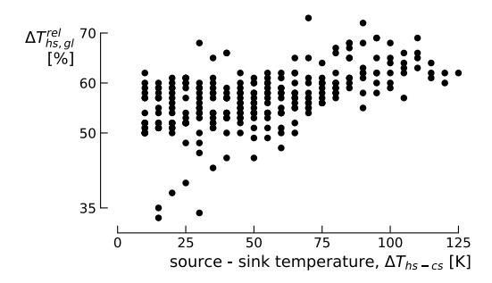

Fig. 9. Relative heat source glide for the design maximising the exergy efficiency.

The other key parameter influencing  $\eta_{II}$  is the heat source glide  $\Delta T_{hs,gl}$ . A high  $\Delta T_{hs,gl}$  leads to an effective waste heat utilisation (it reduces the exergy losses at the source) but reduces  $COP_{hp}$  as the evaporation temperature is decreased (the heat source temperature at the evaporator outlet is lower, see Figs. A.1(h) & A.1(k)). A trade-off must therefore be found. The relative heat source glide, defined as

$$\Delta T_{hs,gl}^{rel} = \frac{\Delta T_{hs,gl}}{\Delta T_{hs-cs}} \qquad , \tag{7} \label{eq:7}$$

remains between 50 and 60% when  $\eta_{\rm II}$  is maximised (see Fig. 9).

Finally, it should be noted that because  $\Delta T_{st,sp}$  is relatively high there, the density  $\rho_{el}$  obtained throughout the zone where  $t_{st,ht}=150^{\circ} C$  when  $\eta_{II}$  is maximised is close to that obtained when  $\rho_{el}$  is maximised (see third column in Fig. 4). This will be further discussed in the multi-criteria analysis, in Section 3.3.

# 3.1.3. Results for optimised $\rho_{el}$

The optimum electrical energy density is a trade-off between the thermal density (i.e. the higher  $\Delta T_{st,sp}$ , the higher the thermal density) and  $\eta_{orc}$  (i.e. the higher  $\Delta T_{st,sp}$ , the lower  $\eta_{orc}$ ). As it can be observed in Figs. 4 & 10, because  $\eta_{orc}$  is a function of  $t_{cs}$ ,  $\rho_{el}$  linearly decreases with increasing  $t_{cs}$ . It ranges from 12.3 kWh/m³ when  $t_{cs}=-25^{\circ}\text{C}$  to 2.5 kWh/m³ when  $t_{cs}=50^{\circ}\text{C}$ . Note that a TES in a single tank with an ideal thermocline could double these values, as one of the two tanks would be removed.

The optimum storage spread linearly varies from about 150 K when  $t_{cs}=-25^{\circ}\text{C}$  to about 70 K when  $t_{cs}=50^{\circ}\text{C}$ . To reach such spreads and to maximise  $\eta_{orc},\ t_{st,ht}$  is always maximised. Moreover, as a rule of thumb, it is shown in Fig. 10 that for the designs maximising the density,  $t_{st,ht}-t_{cs}-\Delta T_{st,sp}=\Delta T_{orc}-\Delta T_{st,sp}\simeq 27.5$  K (i.e. the ORC temperature drop  $\Delta T_{orc}$  minus the storage spread is more or less constant). This value is likely to be a function of the isentropic efficiencies and pinches used in this model, and would deserve to be characterised for other parameters values.

Note that although the heat source glide  $\Delta T_{hs,gl}$  has a clear increasing trend with increasing  $\Delta T_{hs-cs}$  (see Fig. 5), there is still a lack of convergence. This is due to the fact that this parameter does not have a direct influence on  $\rho_{el}$ , but it must have a sufficient value to ensure that the evaporation temperature in the HT-VCHP is lower than the condenser exit temperature, so as to allow significant storage temperature spreads and large sub-cooling (see Figs. A.1(i) & A.1(l)). A beneficial consequence of this is that the exergy losses at the source are reduced. However, this heat source glide is even greater than in the case where  $\eta_{II}$  was maximised (i.e. it goes beyond the optimum value prescribed in Section 3.1.2), which further reduces the evaporation temperature in the HT-VCHP and significantly affects COPhp. As a result,  $\eta_{II}$  is penalised rather than favoured by this large glide.

#### 3.2. Further design analyses

In Section 3.1, only the variables mainly affecting the *Carnot battery trilemma* have been discussed. However, parameters such as the choice

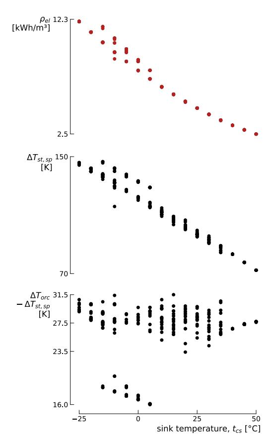

**Fig. 10.** Optimised energy efficiency (red dots), storage spread (black dots) and ORC temperature drop minus storage spread (black dots) depicted according to their sink temperatures.

of optimal fluids and the levels of super-heating and sub-cooling also play an important role. This section therefore focuses on these. In addition, it provides a graphical summary of the design guidelines obtained for TI-PTES.

# *3.2.1. Optimum fluids*

To represent the diversity of fluids encountered over the entire domain, [Fig.](#page-10-0) [11](#page-10-0) shows a mosaic in which the colour of each tile represents one of the 34 fluids. It can be seen that 27 of the 34 fluids available in [Table](#page-4-2) [2](#page-4-2) are used to provide optimum performance. This illustrates well the relevance of using a method that simultaneously optimises the cycle and the choice of fluids.

Depending on the objective, the optimum fluids vary, in particular because the shape of the cycles and temperature levels change. Although there are local fluctuations, certain areas seem to be emerging. For example, in regions where the storage temperature spread Tst,sp is large, *R1234ze(E)* is very often used in the ORC. It should also be noted that when P2P and II are maximised, *acetone* predominates in the HT-VCHP and in the ORC, throughout the zone where tcs > 15◦C. It is also interesting to note that, at some locations, the same fluid is used in the ORC and in the HT-VCHP (e.g. *acetone*). This is an encouraging sign for the development of reversible HP/ORC systems [[28,](#page-16-15)[41\]](#page-16-25). Also, when P2P is maximised, the choice of fluid in the HT-VCHP is contingent on ths, whereas it is contingent on tcs in the ORC. Finally, as a large number of constraints apply to the choice of fluid when designing thermal machines (e.g. maximum permitted charge, price, density, etc.), applying near optimum analyses for this phase of the design seems relevant to broaden the range of possibilities.

Although [Fig.](#page-10-0) [11](#page-10-0) is interesting for assessing the diversity of fluids encountered, it says very few about the way they are used. However, when looking at the T-s diagrams in [Fig.](#page-14-0) [A.1,](#page-14-0) it appears that when large Tst,sp are used, the mode of operation in the HT-VCHP and in the ORC is usually near trans-critical. In order to map this, [Fig.](#page-10-1) [12](#page-10-1) shows the temperature difference between the critical point of the fluid and the high saturation temperature in the HT-VCHP and in the ORC. We can clearly see that in regions with large Tst,sp (please refer to the third row of [Fig.](#page-6-1) [5](#page-6-1) to identify these zones), this temperature difference is very small. For the ORC, this can be explained by the fact that increasing the evaporation pressure (and a fortiori the evaporation temperature) reduces the calorific action required to evaporate the working fluid, and therefore maximises its efficiency. For the HT-VCHP, it can be observed that by minimising the amount of latent heat in the heat transfer with the TES, the heat exchange profile makes it possible to reduce both the heat transfer irreversibilities and the condensation pressure, which is favourable to the COP.

Based on these observations, it can be said that, in the regions concerned, trans-critical cycles could be good candidates for TI-PTES. Maraver et al. [[35\]](#page-16-20) have also shown that, in the case of ORC using large heat source glides, the trans-critical mode can in some cases provide efficiency gains over the sub-critical mode. However, these observations were contingent on the fluids selected and on the temperature of the heat source. Dedicated analyses would therefore be required to extend these results to TI-PTES.

#### *3.2.2. Super-heating, sub-cooling and guidelines summary*

In the HT-VCHP, the liquid sub-cooling Thp,sc is always maximised, so the condenser outlet temperature is equal to the cold reservoir temperature (i.e. tst,ht –Tst,sp) plus the pinch Tpp. There are therefore two pinch points, located at the condenser outlet and at the saturated vapour point. This is well illustrated in the various T-s diagrams in [Fig.](#page-14-0) [A.1](#page-14-0) (although these are not strictly heat transfer diagrams). Because of its importance, this sub-cooling must be implemented and regulated using dedicated techniques. Two possible options are an active charge control in the cycle to regulate the liquid level in the condenser, or the use of a separate heat exchanger (i.e. a sub-cooler).

At the evaporator outlet, the vapour super-heating Thp,sh is usually maximised in order to minimise exergy losses, so the compressor supply temperature is equal to the source temperature ths minus the pinch Tpp. Consequently, for large heat source glides and large storage spreads, this makes it possible to bring the temperature at the compressor outlet high enough to allow heat transfer with the TES through de-super-heating of the vapour, while having lower condensing pressures, which increases the COP. This is clearly visible in [Figs.](#page-14-1) [A.1\(h\)](#page-14-1), [A.1\(i\)](#page-14-1), [A.1\(l\)](#page-14-1) in [Appendix](#page-13-0) [A](#page-13-0) for wet and isentropic fluids. For very dry fluids, Thp,sh is still maximised, although this does not allow to reduce the condensation pressure much (see [Fig.](#page-14-1) [A.1\(k\)\)](#page-14-1).

It is interesting to note that, because of the large super-heating and de-super-heating required, these heat pump cycles are closer to the ideal Lorenz cycle (sensible heat exchange) than to the Carnot cycle (latent heat exchange). From a technological point of view, the design of the evaporator and condenser will have to be adapted to enable these cycles to be implemented, where a significant proportion of the heat exchange will be sensible, compared with the more common case where the exchange is mainly latent. This also opens up prospects for the development of new cycles, particularly those using zeotropic mixtures.

There is no strict rule for the vapour super-heating Torc,sh in the ORC. Based on [Fig.](#page-14-0) [A.1,](#page-14-0) the drier the fluid, the more Torc,sh will be minimised in order to limit condenser losses. In the case of isentropic fluids, Torc,sh will take an optimal value but not a minimum one. Finally, in the case of wet fluids (see [Fig.](#page-14-1) [A.1\(h\)\)](#page-14-1), Torc,sh will have a much higher value in order to (1) ensure that the fluid is not saturated at the expander outlet and (2) minimise exergy losses at the source. This is in line with the observations reported by Maraver et al. [\[35](#page-16-20)].

At this point, it is worth making a comment on the use of recuperators in TI-PTES. In the case of the ORC, we can see that, depending

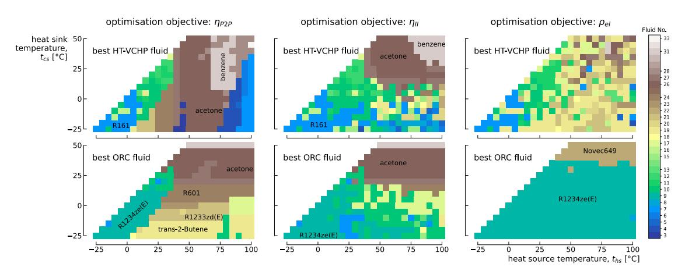

**Fig. 11.** Optimum fluids in the HT-VCHP (1st row) and in the ORC (2nd row) for the configurations maximising P2P (1st column), II (2nd column) and el (3rd column) respectively. The reason for the poor convergence for fluids maximising el in HT-VCHP has already been introduced in Section [3.1.3.](#page-8-3)

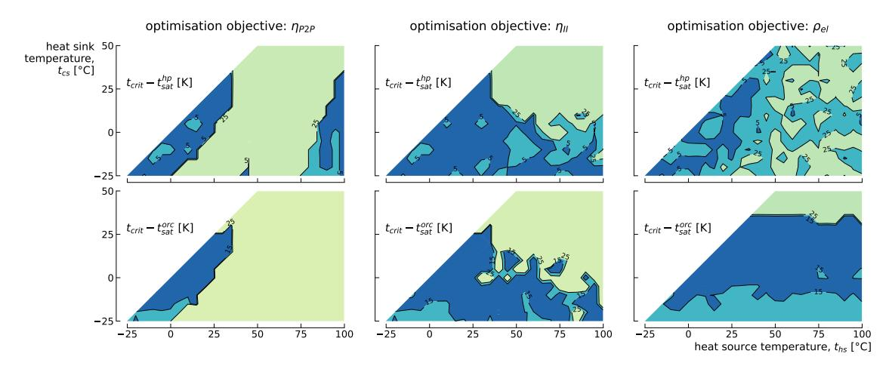

**Fig. 12.** Difference between critical temperature of the fluid and the high saturation temperature in the HT-VCHP (1st row) and in the ORC (2nd row). The blue zones indicates the regions where the difference is below 5 K for the HT-VCHP and below 15 K for the ORC (i.e. near trans-critical operations). In the cyan zones, this difference is below 25 K for both. It is above 25 K in the rest of the domain. The reason for the poor convergence for fluids maximising el in HT-VCHP has already been introduced in Section [3.1.3.](#page-8-3) (For interpretation of the references to colour in this figure legend, the reader is referred to the web version of this article.)

on the vapour super-heating and the type of fluid used, there may be some sensible heat left at the end of expansion. This energy could be recovered through a recuperator to start economising the fluid after the pump, instead of being lost at the condenser (see [Fig.](#page-14-0) [A.1\)](#page-14-0). However, if a very large spread is applied to the storage (= high thermal density), the temperature at the pump outlet may be very close to that of the cold tank (tst,lt). Since this cannot be higher than tst,lt – Tpp, the use of a recuperator may be problematic. It can consequently be deduced that the maximum value of the spread is constrained by the amount of heat available at the expander outlet: the higher this is, the higher the temperature of the pressurised fluid at the recuperator outlet, and therefore the more the spread is constrained. Two antagonistic mechanisms are then at work in the case of a recuperated ORC. On the one hand, the maximum thermal density is reduced, which necessarily reduces the electrical density el. But on the other hand, orc is increased, which increases el. So there is a trade-off to be found.

In the case of the HT-VCHP, it can also be seen that, depending on the liquid sub-cooling, a lot of exergy can remain at the expansion valve inlet. A simple way of recovering this exergy – without using twophase expanders, which have low maturity levels [\[42](#page-16-26),[43\]](#page-16-27) – is to use a recuperator to super-heat the vapour at the compressor inlet. Here too, there are antagonist effects. On the one hand, as the vapour is hotter, the compression work is increased, which reduces COPhp. But on the other hand, and in the same way as the super-heating due to the heat source glide (when any), this ensures that the vapour at the compressor outlet is sufficiently hot, which reduces the condensing pressure, which in turn reduces the work of compression and increases COPhp. This logic is well illustrated by the T-s diagrams in the third column of [Fig.](#page-15-14) [B.1](#page-15-14).

It is therefore clear that the use of recuperators could bring efficiency gains, but that this could affect el. Studies have already been carried out on this subject and have confirmed this, showing moreover that the obtained gains vary according to the objectives and to the source temperatures (the cycles maximising P2P and II do for instance not give rise to the same quantities of sensible heat and exergy to be recovered) [\[12](#page-15-11)]. For example, the T-s diagram in [Fig.](#page-14-1) [A.1\(d\)](#page-14-1) illustrates a HT-VCHP cycle where the effect of the recuperator would probably be to increase the compression work without reducing the condensing pressure, which would reduce the COP. This diagram also illustrates an ORC cycle in which there is no sensible heat to be recovered. We can therefore conclude that the recuperator is an interesting candidate for

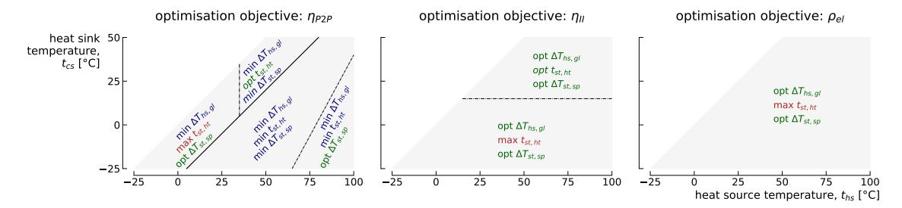

**Fig. 13.** Summary of the design guidelines in the different regions of the domain depending on the objectives sought. Note that only the variables have the most significant impact are reported here. ''max'' is for maximise and ''min'' for minimise. ''opt'' is for optimum and the corresponding optimum value is given in Section [3.1.](#page-5-1)

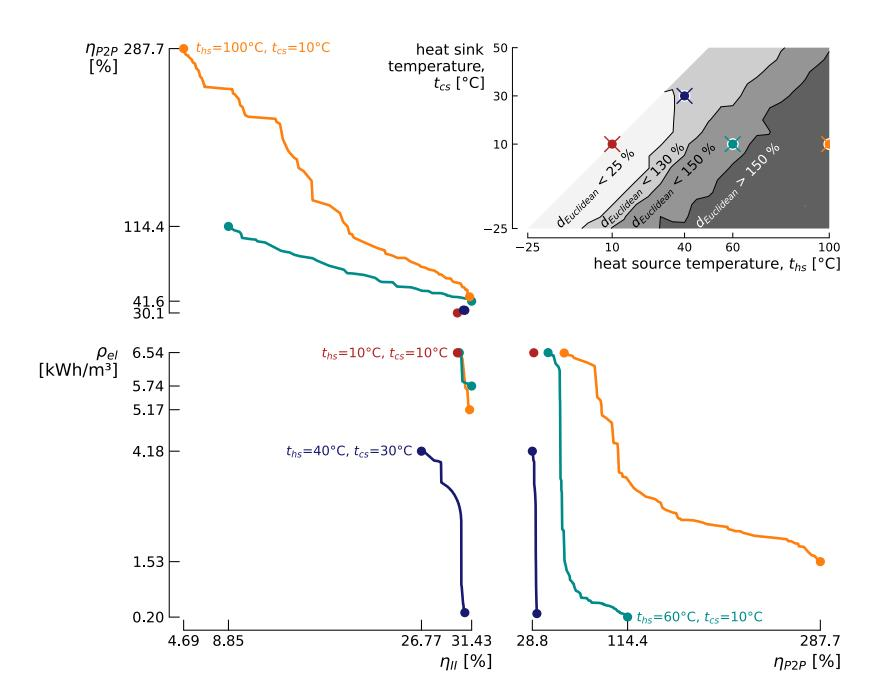

**Fig. 14.** Pareto fronts of the *Carnot battery trilemma* for four locations in the domain. The map of the domain shows the adimensionalised Euclidean distance between the best and worst performance of the three criteria.

the TI-PTES, but that a case-by-case study is preferable to systematic use. This should be the subject of future work.

Finally, to graphically summarise the guidelines deduced from the maps in Section [3.1](#page-5-1), [Fig.](#page-11-1) [13](#page-11-1) represents how to treat the main design variables according to the desired objectives in the different regions of the domain.

#### *3.3. Multi-criteria analyses*

Four locations in the domain were selected for the multi-criteria analyses. These cover the main four regions described in the maps analysis in Section [3.1](#page-5-1) and which are depicted in the left map of [Fig.](#page-11-1) [13](#page-11-1). The corresponding Pareto fronts are shown in [Fig.](#page-11-2) [14](#page-11-2). To make them easier to read, these 3D fronts are 2-dimensionalised: three fronts resulting from the conflict between each pair of objectives are represented for each location. The discontinuities observed in the various fronts are, for the most part, due to design shifts, most often caused by changes in fluid.

To quantify and map the conflict between the three objectives, the adimensionalised Euclidean distance between the best and worst performance was used:

dEuclidean

$$= \sqrt{\left(\frac{\eta_{\rm P2P}^{\rm max} - \eta_{\rm P2P}^{\rm min}}{\eta_{\rm P2P}^{\rm max}}\right)^2 + \left(\frac{\eta_{\rm II}^{\rm max} - \eta_{\rm II}^{\rm min}}{\eta_{\rm II}^{\rm max}}\right)^2 + \left(\frac{\rho_{\rm el}^{\rm max} - \rho_{\rm el}^{\rm min}}{\rho_{\rm el}^{\rm max}}\right)^2} \cdot 100 \ [\%] \ . \tag{8}$$

Located in the region where dEuclidean < 25%, the point (ths = 10◦C, tcs = 10◦C) is not subject to the *trilemma*: none of the objectives is conflicting with another. Generally speaking, in that part of the domain, the best performing cycles are very similar to each other (i.e. the difference would be barely perceptible in [Fig.](#page-11-2) [14\)](#page-11-2) and finding an acceptable trade-off is quite straightforward.

The point (ths = 40◦C, tcs = 30◦C) is located in the region where tst,ht is not maximised when optimising P2P and II, and where Ths,gl and Tst,sp are minimised (the difference due to their slightly different tst,ht is not be perceptible in [Fig.](#page-11-2) [14](#page-11-2)). Consequently, P2P and II do almost not conflict, but there is a slight one with el. This conflict is, however, of moderate intensity since maximising el at the expense of P2P and II only causes them to drop by 12.8% and 13.2% relatively. We can therefore conclude that maximising el is not too damaging to

P2P and II, and that the *trilemma* is weak at this point. This illustrates once again that different designs can give very similar performance and that conducting near optimum analysis would be relevant for the study of TI-PTES.

In contrast, [Fig.](#page-11-2) [14](#page-11-2) shows that the *trilemma* is much more intense for the point (ths = 60◦C, tcs = 10◦C). The front between P2P and II is linear, and it results mainly of a simultaneous trade-off between Ths,gl, tst,ht and Tst,sp, which in line with the observations drawn Section [3.1](#page-5-1). The steep front between el and P2P illustrates well the very binary nature of the problem: it is not really possible to obtain a satisfactory trade-off between the two criteria, as one tends to clearly degrade the other. Indeed, the maximisation of P2P requires minimising Ths,gl, tst,ht and Tst,sp whereas opposite trends are observed for el. However, we note that for the point (ths = 100◦C, tcs = 10◦C), which lies in the area where Tst,sp is slightly increased to maximise P2P, the minimum density is thereby increased, which has the effect of slightly reducing the *trilemma*.

When designing a Carnot battery in this part of the domain, one approach to arbitrating the *trilemma* and identifying optimal storage temperatures is to introduce the economic dimension. For known cost functions of each of the Carnot battery's components, the aim of optimising the thermodynamic design will be to optimise an economic criterion, such as the Levelised Cost Of Storage (which is actually a function of P2P, II and el). It should be stressed, however, that identifying such cost functions is not trivial, as they are non-constant and generally non-linear (e.g. the higher the storage temperature, the more expensive it will be).

Finally, it can be noted that, in the region where dEuclidean > 150%, el and II are much less conflicting with each other than with P2P. This is largely due to the fact that they both maximise the storage temperature and that they need a large storage spread. They also both require large heat source glides, in one case to ensure an effective waste heat recovery (i.e. maximisation of II) and in a second case to allow large spreads (i.e. maximisation of el and II). All in all, this result tends to prove that the trilemma is essentially caused by the maximisation of P2P — which moreover leads to a TI-PTES degenerated into a TES + ORC, which no longer makes it a genuine electricity storage system but rather a pure waste heat recovery system (see Section [3.1.1\)](#page-5-2).

#### **4. Conclusion and perspectives**

This work looked at the *Carnot battery trilemma* for sub-critical cycles over an extended thermal integration domain. Using an in-house thermodynamic model and thanks to a genetic algorithm, multi-criteria optimisation was used to map the maximum theoretical performance that could be provided by TI-PTES in terms of power-to-power efficiency P2P (i.e. quality of electricity recovery), exergy efficiency II (i.e. quality of combined heat and electricity recovery) and electrical energy density el (i.e. storage size). Eight optimisation variables were used, including both the parameters of the thermodynamic cycles and the choice of working fluids. The multi-criteria analysis also made it possible to characterise the nature of the conflict between these objectives, in particular by analysing the shape of the Pareto fronts obtained. The main conclusions of this work are:

• When optimised, P2P grows with the temperature difference between the source and sink Ths–cs. This growth is however not continuous because of a design shift. For Ths–cs ≤ 30 K, the storage temperature tst,ht is maximised, whereas it is minimised for Ths–cs > 30 K. For its part, II decreases as the sink temperature tcs increases, because the ORC efficiency orc falls. However, for tcs > 15◦C, orc (and therefore II) stabilises thanks to a design shift (tst,ht and the storage spread Tst,sp are reduced). Finally, el decreases as tcs increases, both because the thermal density and orc decrease.

- Guidelines for maximising each of the *trilemma* objectives have been formulated over the entire thermal domain. However, these are not uniform across the domain and are adapted in the different sub-regions. Some of these sub-regions are linked to the thermodynamics of TI-PTES (e.g. choice of the optimal tst,ht as a function of heat transfer irreversibilities) while others are linked to the technological constraints imposed (e.g. choice of the optimal tst,ht as a function of the maximum tst,ht allowed). This result highlights the importance of considering these constraints when formulating design guidelines, since optimal cycles obtained can deviate from theory.
- There is a strong synergy between tst,ht and Tst,sp, which are two main design variables in TI-PTES with sensible heat storage. When tst,ht is high, which is in favour of orc but penalises COPhp, Tst,sp is also large so as to maintain a sufficiently high COPhp, which in fact also reduces orc. The conflict between COPhp and orc is therefore resolved by simultaneously adjusting tst,ht and Tst,sp. Maximising COPhp using larger spreads is achieved by lowering the condensation pressure in the HT-VCHP and by maximising the sub-cooling. Conversely, when tst,ht is minimised (i.e. the heat pump lift is minimised), Tst,sp is also generally minimised, so as to approach ideal Carnot cycles.
- The intensity of the *trilemma*, which is measured by the Euclidean distance between the maximum and minimum values of the objectives, increases as Ths–cs increases. This suggests that the *trilemma* is driven by P2P, while the conflict between II and el is much weaker. The hinge variable is tst,ht, which is minimised for P2P when Ths–cs > 30 K, and is maximised in the other cases. Below this tipping point (i.e. Ths–cs ≤ 30 K), the intensity of the *trilemma* is therefore lower.
- Overall, the concept of thermal integration for PTES should be reconsidered. While it was introduced to artificially increase P2P, we can see that, for Ths–cs > 30 K, maximising this parameter leads to very low II and el. Moreover, the TI-PTES degenerates into a TES + ORC (i.e. zero contribution from the heat pump), which makes it a heat recovery option but no longer an electrical storage system as such. However, the majority of studies to date have focused on Ths–cs > 45 K, because P2P is much better there. Yet, a nuance needs to be introduced: in cases where the heat source glide is constrained (e.g. frequently at 10 K in cooling applications), the exergy losses from the source to the environment disappear, which relatively increases II. Still, maximising P2P will always lead to minimising tst,ht, which will penalise el and still lead to a degenerated TI-PTES. So, to recover waste heat when Ths–cs > 30 K, there are probably solutions that are more exergy- and financially-effective than TI-PTES.

On the basis of the results obtained, prospects for future work can also be given:

- In view of the large spreads involved and the fact that the critical points of the selected fluids are generally well below tst,ht, the study of trans-critical cycles in TI-PTES applications seems to be of interest. A second avenue worth investigating is zeotropic mixtures. Future work could characterise and optimise these systems to see if they can reduce the *Carnot battery trilemma* and increase the performance.
- Systematic consideration of the use of a recuperator in the HT-VCHP and in the ORC also seems essential. However, as discussed, this will not systematically result in better performance and must therefore be assessed on a case-by-case basis.
- This thermodynamic study showed that taking into account technological constraints (e.g. maximum tst,ht, maximum cycles temperature, minimum pressure) caused deviations between the theory and the actually optimal cycles. Taking greater account of these technological constraints (e.g. maximum compression ratio, etc.) would therefore be appropriate in future work.

• Finally, the application of near-optimum analyses to the study of TI-PTES could potentially make new designs emerge. In particular, tolerating (very) slight performance degradation could make it possible to find configurations that are, for instance, less prone to the *trilemma*, or cheaper to implement (e.g. lower storage temperature). This would also make it possible to identify designs that are less sensitive to slight deviations of parameters from nominal conditions, which is very useful in operational analyses (e.g. degree of super-heating, of sub-cooling, pinches, etc.). Eventually, this would enable to characterise which parameters should not deviate from nominal conditions, which would enable effective control strategies.

#### CRediT authorship contribution statement

Antoine Laterre: Writing – original draft, Visualization, Software, Methodology, Investigation, Funding acquisition, Formal analysis, Conceptualization. Olivier Dumont: Writing – review & editing, Supervision, Methodology, Investigation. Vincent Lemort: Writing – review & editing, Supervision, Methodology, Investigation, Formal analysis, Conceptualization. Francesco Contino: Writing – review & editing, Visualization, Supervision, Methodology, Investigation, Formal analysis, Conceptualization.

#### Declaration of competing interest

The authors declare that they have no known competing financial interests or personal relationships that could have appeared to influence the work reported in this paper.

#### Data availability

Data will be made available on request.

#### Acknowledgements

The first author acknowledges the support of Fonds de la Recherche Scientifique - FNRS, Belgium [40014566 FRIA-B1].

Computational resources have been provided by the Consortium des Équipements de Calcul Intensif (CÉCI), funded by the Fonds de la Recherche Scientifique de Belgique (F.R.S.-FNRS) under Grant No. 2.5020.11 and by the Walloon Region.

# Appendix A. Representative T-s diagrams

Diagrams are depicted in Fig. A.1.

# Appendix B. Synergies between technological constraints and optimum cycles

The analysis carried out in Section 3.1.1 showed that, for endoreversible cycles (i.e. no internal irreversibilities) but considering irreversibilities at the heat transfers, there is a threshold in terms of temperature difference between the source and the sink below (resp. above) which the storage temperature must be maximised (resp. minimised) in order to maximise the power-to-power efficiency  $\eta_{\rm P2P}$  of TI-PTES. It was also demonstrated that this threshold is a function of the irreversibilities at the heat transfers. This result is reflected in the fact that below the threshold, the ORC efficiency is favoured, whereas above the threshold, the COP of the HT-VCHP is favoured.

The optimisation results are consistent with this simplified theoretical analysis. However, it can be observed that, below the threshold (i.e.  $\Delta T_{hs-cs} \leq 30$  K) and for superior sink temperatures (i.e.  $t_{cs} > 15^{\circ}\text{C}$ ), the storage temperature is no longer maximised but takes on an optimum value, meaning that, in that part of the domain, there is

an optimum trade-off to find between the COP of the HT-VCHP and the ORC efficiency. This observation can also be extrapolated to the case of maximising the exergy efficiency where, for any source temperature and for sink temperatures above 15°C, the storage temperature takes on an optimum value rather than being maximised.

At least two hypotheses can be put forward to explain this observation. The first is linked to the constraint on the maximum cycle and storage temperatures. The second is linked to the constraint on the available fluids and the minimum pressure in the heat exchangers. As shown below, the second can easily be ruled out, which leads to the conclusion that it is indeed the constraint on the maximum temperatures that causes this deviation of the optimum storage temperature from theory.

#### B.1. Maximum temperature constraint

When  $\eta_{\rm P2P}$  is maximised, because of the constraint  $\rm t_{st,\rm ht}^{\rm max}=150^{\circ}\rm C$ , the ORC efficiency decreases as the sink temperature increases (the temperature difference between its source and its sink decreases). Above a certain threshold (around 15°C in the present case), this efficiency becomes so low that  $\rm COP_{hp}$  must be increased in order to maintain  $\eta_{\rm P2P}$  at maximum values. As a result, the storage temperature has to be lowered, which further affects the ORC efficiency. There is therefore an optimum trade-off to find between  $\eta_{\rm orc}$  and  $\rm COP_{hp}$ .

In order to verify this hypothesis, the  $t_{st,ht}^{max}=150^{\circ}\text{C}$  constraint was increased to  $t_{st,ht}^{max}=200^{\circ}\text{C}$  in a cell of domain located in the region concerned ( $t_{hs}=50^{\circ}\text{C}$ ,  $t_{cs}=30^{\circ}\text{C}$ ). The maximum temperature in the HT-VCHP was also raised to  $t_{hp}^{max}=300^{\circ}\text{C}$  instead of  $t_{hp}^{max}=180^{\circ}\text{C}$  to enable  $t_{st,ht}^{max}$  to be reached during the optimisation (although this is probably beyond the current technological limits for HT-VCHP). The storage pressure was set to 20 bar. The optimisation was then restarted. Fig. B.1 depicts the T-s diagrams of the TI-PTES cycles maximising  $\eta_{P2P}$  with the original (Fig. B.1(a)) and relaxed (Fig. B.1(b)) constraints. It can be seen from Fig. B.1 that, as expected, the  $t_{st,ht}^{max}=200^{\circ}\text{C}$  constraint gives rise to a design that maximises the storage temperature (i.e.  $t_{st,ht}=200^{\circ}\text{C}$ ) in order to maximise  $\eta_{P2P}$ . As a result, the latter gains more than three points by going from 39.7% to 43.0%.

To the best of the authors' knowledge, this observation on the optimum storage temperature has not yet been made in the literature. It would therefore be appropriate for this observation to be confirmed by further studies. In addition, it would be interesting to carry out sensitivity analyses and apply near-optimum analyses in order to assess the extent to which  $\eta_{\rm P2P}$  (and  $\eta_{\rm II}$ ) would be affected by maximising the storage temperature when the constraint  $t_{\rm st,\, ht}^{\rm max} = 150\,^{\circ}{\rm C}$  is maintained.

#### B.2. Minimum pressure constraint

Another explanation for why the storage temperature is not maximised when the sink is above  $15^{\circ}\text{C}$  could be the unavailability of fluids in that temperature range, due to the constraint  $p_{min}=0.5$  bar. Indeed, the higher the critical temperature, the lower the saturation pressure at a given temperature (see Fig. B.2). It could therefore be envisaged that no fluid respects constraint  $p_{min}=0.5$  bar when the storage temperature is  $150^{\circ}\text{C}$ , because higher critical temperatures are needed to operate the cycle in sub-critical regime. However, this hypothesis can be dismissed out of hand. First, because there are fluids that allow  $t_{st,ht}=150^{\circ}\text{C}$  in the  $t_{cs}\leq15^{\circ}\text{C}$  zone, which is actually even more constrained than the zone where  $t_{cs}>15^{\circ}\text{C}$  (see Fig. 5). Second, because Fig. B.2 shows that there are fluids with a critical point above  $150^{\circ}\text{C}$  which meet the constraint.

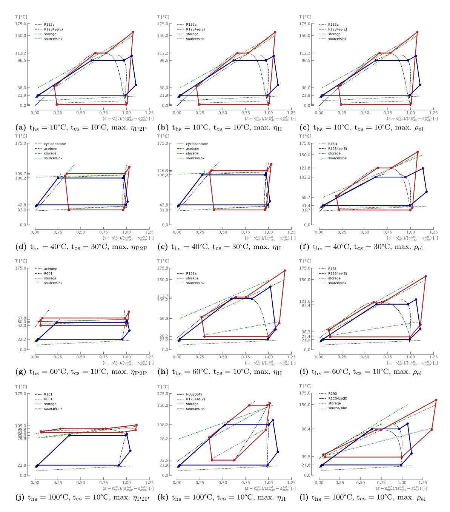

**Fig. A.1.** T-s diagrams of the configurations maximising P2P, II and el for four different locations in the domain. Red solid lines are for the HT-VCHP and the blue ones are for the ORC. Green dashed lines correspond to the TES and are placed to illustrate the heat transfer with the cycles, though these are not proper representations for pinch analyses. Grey dashed lines represent the source and the sink. (For interpretation of the references to colour in this figure legend, the reader is referred to the web version of this article.)

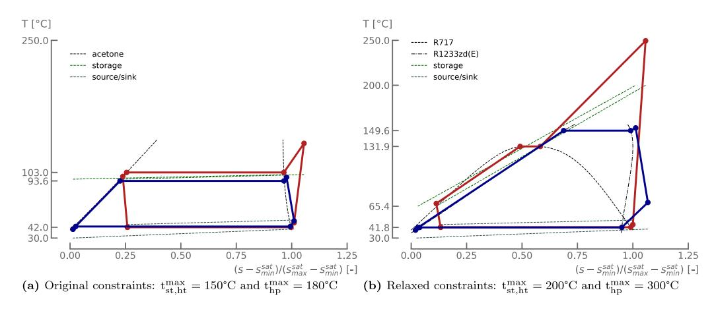

**Fig. B.1.** T-s diagrams of the configurations maximising P2P for ths = 50◦C and tcs = 30◦C with the original (left) and relaxed (right) constraints. Red solid lines are for the HT-VCHP and the blue ones are for the ORC. Green dashed lines correspond to the TES and are placed to illustrate the heat transfer with the cycles, though these are not proper representations for pinch analyses. Grey dashed lines represent the source and the sink. The corresponding efficiencies are original P2P = 39.7% and relaxed P2P = 43.0%. (For interpretation of the references to colour in this figure legend, the reader is referred to the web version of this article.)

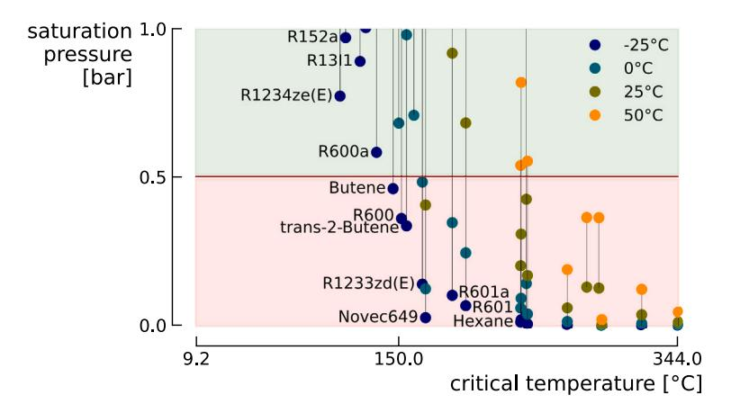

**Fig. B.2.** Saturation pressure at four different temperatures for the 34 fluids considered in this study. It can be seen that those with a higher critical temperature tend to have lower saturation pressures, which can be detrimental to compliance with the constraint pmin hp/orc ≥ 0.5 bar.

# **References**

- [1] Intergovernmental Panel on Climate Change (IPCC), editor. Buildings. In: Climate change 2022 - mitigation of climate change. first ed.. Cambridge University Press; 2023, p. 953–1048. [http://dx.doi.org/10.1017/](http://dx.doi.org/10.1017/9781009157926.011) [9781009157926.011,](http://dx.doi.org/10.1017/9781009157926.011) URL [https://www.cambridge.org/core/product/identifier/](https://www.cambridge.org/core/product/identifier/9781009157926%23c9/type/book_part) [9781009157926%23c9/type/book\\_part](https://www.cambridge.org/core/product/identifier/9781009157926%23c9/type/book_part).
- [2] Forman C, Muritala IK, Pardemann R, Meyer B. Estimating the global waste heat potential. Renew Sustain Energy Rev 2016;57:1568–79. [http:](http://dx.doi.org/10.1016/j.rser.2015.12.192) [//dx.doi.org/10.1016/j.rser.2015.12.192](http://dx.doi.org/10.1016/j.rser.2015.12.192), URL [https://www.sciencedirect.com/](https://www.sciencedirect.com/science/article/pii/S1364032115015750) [science/article/pii/S1364032115015750](https://www.sciencedirect.com/science/article/pii/S1364032115015750).
- [3] Koohi-Fayegh S, Rosen MA. A review of energy storage types, applications and recent developments. J Energy Storage 2020;27:101047. [http://dx.doi.org/](http://dx.doi.org/10.1016/j.est.2019.101047) [10.1016/j.est.2019.101047,](http://dx.doi.org/10.1016/j.est.2019.101047) URL [https://www.sciencedirect.com/science/article/](https://www.sciencedirect.com/science/article/pii/S2352152X19306012) [pii/S2352152X19306012](https://www.sciencedirect.com/science/article/pii/S2352152X19306012).
- [4] Jockenhöfer H, Steinmann W-D, Bauer D. Detailed numerical investigation of a pumped thermal energy storage with low temperature heat integration. Energy 2018;145:665–76. [http://dx.doi.org/10.1016/j.energy.2017.12.087,](http://dx.doi.org/10.1016/j.energy.2017.12.087) URL [https:](https://linkinghub.elsevier.com/retrieve/pii/S0360544217321308) [//linkinghub.elsevier.com/retrieve/pii/S0360544217321308.](https://linkinghub.elsevier.com/retrieve/pii/S0360544217321308)
- [5] Astolfi M, Aumann R, Baresi M, Batscha D, van Buijten J, Casella F, et al. Thermal energy harvesting - the path to tapping into a large CO2-free European power source. Tech. Rep., (Version 1.0):Knowledge Center on Organic Rankine Cycle technology; 2022, p. 57, URL [https://kcorc.org/en/committees/thermal](https://kcorc.org/en/committees/thermal-energy-harvesting-advocacy-group/)[energy-harvesting-advocacy-group/.](https://kcorc.org/en/committees/thermal-energy-harvesting-advocacy-group/)
- [6] Marina A, Spoelstra S, Zondag HA, Wemmers AK. An estimation of the European industrial heat pump market potential. Renew Sustain Energy Rev 2021;139:110545. <http://dx.doi.org/10.1016/j.rser.2020.110545>, URL [https://](https://www.sciencedirect.com/science/article/pii/S1364032120308297) [www.sciencedirect.com/science/article/pii/S1364032120308297](https://www.sciencedirect.com/science/article/pii/S1364032120308297).
- [7] Lecompte S, Huisseune H, van den Broek M, Vanslambrouck B, De Paepe M. Review of organic Rankine cycle (ORC) architectures for waste heat recovery. Renew Sustain Energy Rev 2015;47:448–61. [http://dx.doi.org/10.](http://dx.doi.org/10.1016/j.rser.2015.03.089)

- [1016/j.rser.2015.03.089](http://dx.doi.org/10.1016/j.rser.2015.03.089), URL [https://www.sciencedirect.com/science/article/](https://www.sciencedirect.com/science/article/pii/S1364032115002427) [pii/S1364032115002427.](https://www.sciencedirect.com/science/article/pii/S1364032115002427)
- [8] Quoilin S, Declaye S, Tchanche BF, Lemort V. Thermo-economic optimization of waste heat recovery Organic Rankine Cycles. Appl Therm Eng 2011;31(14):2885– 93. <http://dx.doi.org/10.1016/j.applthermaleng.2011.05.014>, URL [https://www.](https://www.sciencedirect.com/science/article/pii/S1359431111002663) [sciencedirect.com/science/article/pii/S1359431111002663.](https://www.sciencedirect.com/science/article/pii/S1359431111002663)
- [9] Frate GF, Antonelli M, Desideri U. A novel Pumped Thermal Electricity Storage (PTES) system with thermal integration. Appl Therm Eng 2017;121:1051–8. [http:](http://dx.doi.org/10.1016/j.applthermaleng.2017.04.127) [//dx.doi.org/10.1016/j.applthermaleng.2017.04.127,](http://dx.doi.org/10.1016/j.applthermaleng.2017.04.127) URL [https://linkinghub.](https://linkinghub.elsevier.com/retrieve/pii/S135943111634114X) [elsevier.com/retrieve/pii/S135943111634114X.](https://linkinghub.elsevier.com/retrieve/pii/S135943111634114X)
- [10] Mercangöz M, Hemrle J, Kaufmann L, Z'Graggen A, Ohler C. Electrothermal energy storage with transcritical CO2 cycles. Energy 2012;45(1):407–15. [http://](http://dx.doi.org/10.1016/j.energy.2012.03.013) [dx.doi.org/10.1016/j.energy.2012.03.013](http://dx.doi.org/10.1016/j.energy.2012.03.013), URL [https://linkinghub.elsevier.com/](https://linkinghub.elsevier.com/retrieve/pii/S0360544212002046) [retrieve/pii/S0360544212002046.](https://linkinghub.elsevier.com/retrieve/pii/S0360544212002046)
- [11] Steinmann WD. The CHEST (Compressed Heat Energy STorage) concept for facility scale thermo mechanical energy storage. Energy 2014;69:543–52. [http://](http://dx.doi.org/10.1016/j.energy.2014.03.049) [dx.doi.org/10.1016/j.energy.2014.03.049](http://dx.doi.org/10.1016/j.energy.2014.03.049), URL [http://www.sciencedirect.com/](http://www.sciencedirect.com/science/article/pii/S0360544214003132) [science/article/pii/S0360544214003132](http://www.sciencedirect.com/science/article/pii/S0360544214003132).
- [12] Frate GF, Ferrari L, Desideri U. Multi-criteria investigation of a pumped thermal electricity storage (PTES) system with thermal integration and sensible heat storage. Energy Convers Manage 2020;208:112530. [http://dx.doi.org/10.](http://dx.doi.org/10.1016/j.enconman.2020.112530) [1016/j.enconman.2020.112530](http://dx.doi.org/10.1016/j.enconman.2020.112530), URL [https://linkinghub.elsevier.com/retrieve/](https://linkinghub.elsevier.com/retrieve/pii/S0196890420300662) [pii/S0196890420300662.](https://linkinghub.elsevier.com/retrieve/pii/S0196890420300662)
- [13] Weitzer M, Müller D, Karl J. Two-phase expansion processes in heat pump – ORC systems (Carnot batteries) with volumetric machines for enhanced off-design efficiency. Renew Energy 2022;199:720–32. [http://dx.doi.org/10.](http://dx.doi.org/10.1016/j.renene.2022.08.143) [1016/j.renene.2022.08.143](http://dx.doi.org/10.1016/j.renene.2022.08.143), URL [https://www.sciencedirect.com/science/article/](https://www.sciencedirect.com/science/article/pii/S0960148122013222) [pii/S0960148122013222.](https://www.sciencedirect.com/science/article/pii/S0960148122013222)
- [14] Frate GF, Ferrari L, Desideri U. Multi-criteria economic analysis of a Pumped Thermal Electricity Storage (PTES) with thermal integration. Front Energy Res 2020;8:53. [http://dx.doi.org/10.3389/fenrg.2020.00053,](http://dx.doi.org/10.3389/fenrg.2020.00053) URL [https://www.](https://www.frontiersin.org/article/10.3389/fenrg.2020.00053/full) [frontiersin.org/article/10.3389/fenrg.2020.00053/full.](https://www.frontiersin.org/article/10.3389/fenrg.2020.00053/full)

- [15] Weitzer M, Müller D, Steger D, Charalampidis A, Karellas S, Karl J. Organic flash cycles in Rankine-based Carnot batteries with large storage temperature spreads. Energy Convers Manage 2022;255:115323. [http://dx.doi.org/10.1016/](http://dx.doi.org/10.1016/j.enconman.2022.115323) [j.enconman.2022.115323,](http://dx.doi.org/10.1016/j.enconman.2022.115323) URL [https://www.sciencedirect.com/science/article/](https://www.sciencedirect.com/science/article/pii/S0196890422001194) [pii/S0196890422001194.](https://www.sciencedirect.com/science/article/pii/S0196890422001194)
- [16] Lu P, Luo X, Wang J, Chen J, Liang Y, Yang Z, et al. Thermodynamic analysis and evaluation of a novel composition adjustable Carnot battery under variable operating scenarios. Energy Convers Manage 2022;269:116117. [http:](http://dx.doi.org/10.1016/j.enconman.2022.116117) [//dx.doi.org/10.1016/j.enconman.2022.116117](http://dx.doi.org/10.1016/j.enconman.2022.116117), URL [https://www.sciencedirect.](https://www.sciencedirect.com/science/article/pii/S0196890422009013) [com/science/article/pii/S0196890422009013](https://www.sciencedirect.com/science/article/pii/S0196890422009013).
- [17] Zhang M, Shi L, Hu P, Pei G, Shu G. Carnot battery system integrated with low-grade waste heat recovery: Toward high energy storage efficiency. J Energy Storage 2023;57:106234. [http://dx.doi.org/10.1016/j.est.2022.106234,](http://dx.doi.org/10.1016/j.est.2022.106234) URL [https://www.sciencedirect.com/science/article/pii/S2352152X2202223X.](https://www.sciencedirect.com/science/article/pii/S2352152X2202223X)
- [18] Bellos E. Thermodynamic analysis of a Carnot battery unit with double exploitation of a waste heat source. Energy Convers Manage 2024;299:117844. [http:](http://dx.doi.org/10.1016/j.enconman.2023.117844) [//dx.doi.org/10.1016/j.enconman.2023.117844](http://dx.doi.org/10.1016/j.enconman.2023.117844), URL [https://www.sciencedirect.](https://www.sciencedirect.com/science/article/pii/S0196890423011901) [com/science/article/pii/S0196890423011901](https://www.sciencedirect.com/science/article/pii/S0196890423011901).
- [19] Dumont O, Lemort V. Mapping of performance of pumped thermal energy storage (Carnot battery) using waste heat recovery. Energy 2020;211:118963. [http://](http://dx.doi.org/10.1016/j.energy.2020.118963) [dx.doi.org/10.1016/j.energy.2020.118963,](http://dx.doi.org/10.1016/j.energy.2020.118963) URL [https://linkinghub.elsevier.com/](https://linkinghub.elsevier.com/retrieve/pii/S0360544220320703) [retrieve/pii/S0360544220320703.](https://linkinghub.elsevier.com/retrieve/pii/S0360544220320703)
- [20] Xia R, Wang Z, Cao M, Jiang Y, Tang H, Ji Y, et al. Comprehensive performance analysis of cold storage Rankine Carnot batteries: Energy, exergy, economic, and environmental perspectives. Energy Convers Manage 2023;293:117485. [http:](http://dx.doi.org/10.1016/j.enconman.2023.117485) [//dx.doi.org/10.1016/j.enconman.2023.117485](http://dx.doi.org/10.1016/j.enconman.2023.117485), URL [https://www.sciencedirect.](https://www.sciencedirect.com/science/article/pii/S0196890423008312) [com/science/article/pii/S0196890423008312](https://www.sciencedirect.com/science/article/pii/S0196890423008312).
- [21] Hu S, Yang Z, Li J, Duan Y. Thermo-economic analysis of the pumped thermal energy storage with thermal integration in different application scenarios. Energy Convers Manage 2021;236:114072. [http://dx.doi.org/10.1016/j.enconman.2021.](http://dx.doi.org/10.1016/j.enconman.2021.114072) [114072](http://dx.doi.org/10.1016/j.enconman.2021.114072), URL [https://linkinghub.elsevier.com/retrieve/pii/S019689042100248X.](https://linkinghub.elsevier.com/retrieve/pii/S019689042100248X)
- [22] Fan R, Xi H. Energy, exergy, economic (3E) analysis, optimization and comparison of different Carnot battery systems for energy storage. Energy Convers Manage 2022;252:115037. [http://dx.doi.org/10.1016/j.enconman.2021.115037,](http://dx.doi.org/10.1016/j.enconman.2021.115037) URL [https://www.sciencedirect.com/science/article/pii/S0196890421012139.](https://www.sciencedirect.com/science/article/pii/S0196890421012139)
- [23] Zhang Y, Xu L, Li J, Zhang L, Yuan Z. Technical and economic evaluation, comparison and optimization of a Carnot battery with two different layouts. J Energy Storage 2022;55:105583. [http://dx.doi.org/10.1016/j.est.2022.105583,](http://dx.doi.org/10.1016/j.est.2022.105583) URL [https://www.sciencedirect.com/science/article/pii/S2352152X22015717.](https://www.sciencedirect.com/science/article/pii/S2352152X22015717)
- [24] Yu X, Qiao H, Yang B, Zhang H. Thermal-economic and sensitivity analysis of different Rankine-based Carnot battery configurations for energy storage. Energy Convers Manage 2023;283:116959. [http://dx.doi.org/10.1016/](http://dx.doi.org/10.1016/j.enconman.2023.116959) [j.enconman.2023.116959,](http://dx.doi.org/10.1016/j.enconman.2023.116959) URL [https://www.sciencedirect.com/science/article/](https://www.sciencedirect.com/science/article/pii/S0196890423003059) [pii/S0196890423003059.](https://www.sciencedirect.com/science/article/pii/S0196890423003059)
- [25] Zhang X, Sun Y, Zhao W, Li C, Xu C, Sun H, et al. The Carnot batteries thermally assisted by the steam extracted from thermal power plants: A thermodynamic analysis and performance evaluation. Energy Convers Manage 2023;297:117724. [http://dx.doi.org/10.1016/j.enconman.2023.117724,](http://dx.doi.org/10.1016/j.enconman.2023.117724) URL <https://www.sciencedirect.com/science/article/pii/S0196890423010701>.
- [26] Qiao H, Yu X, Yang B. Working fluid design and performance optimization for the heat pump-organic Rankine cycle Carnot battery system based on the group contribution method. Energy Convers Manage 2023;293:117459. [http:](http://dx.doi.org/10.1016/j.enconman.2023.117459) [//dx.doi.org/10.1016/j.enconman.2023.117459](http://dx.doi.org/10.1016/j.enconman.2023.117459), URL [https://www.sciencedirect.](https://www.sciencedirect.com/science/article/pii/S0196890423008051) [com/science/article/pii/S0196890423008051](https://www.sciencedirect.com/science/article/pii/S0196890423008051).
- [27] Wang Z, Xia R, Jiang Y, Cao M, Ji Y, Han F. Evaluation and optimization of an engine waste heat assisted Carnot battery system for ocean-going vessels during harbor stays. J Energy Storage 2023;73:108866. [http://dx.doi.org/](http://dx.doi.org/10.1016/j.est.2023.108866) [10.1016/j.est.2023.108866,](http://dx.doi.org/10.1016/j.est.2023.108866) URL [https://www.sciencedirect.com/science/article/](https://www.sciencedirect.com/science/article/pii/S2352152X23022636) [pii/S2352152X23022636](https://www.sciencedirect.com/science/article/pii/S2352152X23022636).
- [28] Staub S, Bazan P, Braimakis K, Müller D, Regensburger C, Scharrer D, et al. Reversible heat pump–organic rankine cycle systems for the storage of renewable electricity. Energies 2018;11(6):1352. [http://dx.doi.org/10.3390/en11061352,](http://dx.doi.org/10.3390/en11061352) URL <https://www.mdpi.com/1996-1073/11/6/1352>.

- [29] Reddy KS, Mudgal V, Mallick TK. Review of latent heat thermal energy storage for improved material stability and effective load management. J Energy Storage 2018;15:205–27. [http://dx.doi.org/10.1016/j.est.2017.11.005,](http://dx.doi.org/10.1016/j.est.2017.11.005) URL [https://](https://www.sciencedirect.com/science/article/pii/S2352152X1730227X) [www.sciencedirect.com/science/article/pii/S2352152X1730227X](https://www.sciencedirect.com/science/article/pii/S2352152X1730227X).
- [30] [Bell IH, Wronski J, Quoilin S, Lemort V. Pure and pseudo-pure fluid thermophys](http://refhub.elsevier.com/S0360-5442(24)01780-8/sb30)[ical property evaluation and the open-source thermophysical property library](http://refhub.elsevier.com/S0360-5442(24)01780-8/sb30) [CoolProp. Ind Eng Chem Res 2014;53\(6\):2498–508.](http://refhub.elsevier.com/S0360-5442(24)01780-8/sb30)
- [31] Frate GF, Ferrari L, Desideri U. Analysis of suitability ranges of high temperature heat pump working fluids. Appl Therm Eng 2019;150:628–40. [http://dx.](http://dx.doi.org/10.1016/j.applthermaleng.2019.01.034) [doi.org/10.1016/j.applthermaleng.2019.01.034,](http://dx.doi.org/10.1016/j.applthermaleng.2019.01.034) URL [https://www.sciencedirect.](https://www.sciencedirect.com/science/article/pii/S1359431118353602) [com/science/article/pii/S1359431118353602](https://www.sciencedirect.com/science/article/pii/S1359431118353602).
- [32] Arpagaus C, Bless F, Uhlmann M, Schiffmann J, Bertsch SS. High temperature heat pumps: Market overview, state of the art, research status, refrigerants, and application potentials. Energy 2018;152:985–1010. [http://dx.doi.org/10.](http://dx.doi.org/10.1016/j.energy.2018.03.166) [1016/j.energy.2018.03.166](http://dx.doi.org/10.1016/j.energy.2018.03.166), URL [https://www.sciencedirect.com/science/article/](https://www.sciencedirect.com/science/article/pii/S0360544218305759) [pii/S0360544218305759.](https://www.sciencedirect.com/science/article/pii/S0360544218305759)
- [33] Ommen T, Jensen JK, Markussen WB, Reinholdt L, Elmegaard B. Technical and economic working domains of industrial heat pumps: Part 1 – Single stage vapour compression heat pumps. Int J Refrig 2015;55:168–82. [http://](http://dx.doi.org/10.1016/j.ijrefrig.2015.02.012) [dx.doi.org/10.1016/j.ijrefrig.2015.02.012](http://dx.doi.org/10.1016/j.ijrefrig.2015.02.012), URL [https://www.sciencedirect.com/](https://www.sciencedirect.com/science/article/pii/S0140700715000444) [science/article/pii/S0140700715000444](https://www.sciencedirect.com/science/article/pii/S0140700715000444).
- [34] Jiang J, Hu B, Wang RZ, Deng N, Cao F, Wang C-C. A review and perspective on industry high-temperature heat pumps. Renew Sustain Energy Rev 2022;161:112106. <http://dx.doi.org/10.1016/j.rser.2022.112106>, URL [https://](https://www.sciencedirect.com/science/article/pii/S1364032122000351) [www.sciencedirect.com/science/article/pii/S1364032122000351](https://www.sciencedirect.com/science/article/pii/S1364032122000351).
- [35] Maraver D, Royo J, Lemort V, Quoilin S. Systematic optimization of subcritical and transcritical organic Rankine cycles (ORCs) constrained by technical parameters in multiple applications. Appl Energy 2014;117:11–29. [http://dx.doi.org/](http://dx.doi.org/10.1016/j.apenergy.2013.11.076) [10.1016/j.apenergy.2013.11.076](http://dx.doi.org/10.1016/j.apenergy.2013.11.076), URL [https://www.sciencedirect.com/science/](https://www.sciencedirect.com/science/article/pii/S0306261913009859) [article/pii/S0306261913009859.](https://www.sciencedirect.com/science/article/pii/S0306261913009859)
- [36] Smith C, Nicholls Z, Armour K, Collins W, Forster P, Meinshausen M, et al. The earth's energy budget, climate feedbacks, and climate sensitivity supplementary material. In: Masson-Delmotte V, Zhai P, Pirani A, Connors S, Péan C, Berger S, Caud N, Chen Y, Goldfarb L, Gomis M, Huang M, Leitzell K, Lonnoy E, Matthews J, Maycock T, Waterfield T, Yelekçi O, Yu R, Zhou B, editors. Climate change 2021: the physical science basis. contribution of working group i to the sixth assessment report of the intergovernmental panel on climate change. 2021, Available from [https://www.ipcc.ch/,](https://www.ipcc.ch/) Type: Book Section.
- [37] [Deb K, Pratap A, Agarwal S, Meyarivan T. A fast and elitist multiobjective genetic](http://refhub.elsevier.com/S0360-5442(24)01780-8/sb37) [algorithm: NSGA-II. IEEE Trans Evol Comput 2002;6\(2\):182–97.](http://refhub.elsevier.com/S0360-5442(24)01780-8/sb37)
- [38] Coppitters D, Tsirikoglou P, Paepe WD, Kyprianidis K, Kalfas A, Contino F. RHEIA: Robust design optimization of renewable Hydrogen and dErIved energy cArrier systems. J Open Source Softw 2022;7(75):4370. [http://dx.doi.org/10.](http://dx.doi.org/10.21105/joss.04370) [21105/joss.04370,](http://dx.doi.org/10.21105/joss.04370) URL [https://joss.theoj.org/papers/10.21105/joss.04370.](https://joss.theoj.org/papers/10.21105/joss.04370)
- [39] Blank J, Deb K. Pymoo: Multi-objective optimization in python. IEEE Access 2020;8:89497–509. [http://dx.doi.org/10.1109/ACCESS.2020.2990567,](http://dx.doi.org/10.1109/ACCESS.2020.2990567) URL <https://ieeexplore.ieee.org/document/9078759>.
- [40] Voll P, Jennings M, Hennen M, Shah N, Bardow A. The optimum is not enough: A near-optimal solution paradigm for energy systems synthesis. Energy 2015;82:446–56. <http://dx.doi.org/10.1016/j.energy.2015.01.055>, URL [https://](https://www.sciencedirect.com/science/article/pii/S0360544215000791) [www.sciencedirect.com/science/article/pii/S0360544215000791](https://www.sciencedirect.com/science/article/pii/S0360544215000791).
- [41] Dumont O, Quoilin S, Lemort V. Experimental investigation of a reversible heat pump/organic Rankine cycle unit designed to be coupled with a passive house to get a Net Zero Energy Building. Int J Refrig 2015;54:190–203. [http://](http://dx.doi.org/10.1016/j.ijrefrig.2015.03.008) [dx.doi.org/10.1016/j.ijrefrig.2015.03.008](http://dx.doi.org/10.1016/j.ijrefrig.2015.03.008), URL [https://linkinghub.elsevier.com/](https://linkinghub.elsevier.com/retrieve/pii/S0140700715000638) [retrieve/pii/S0140700715000638.](https://linkinghub.elsevier.com/retrieve/pii/S0140700715000638)
- [42] Murthy AA, Subiantoro A, Norris S, Fukuta M. A review on expanders and their performance in vapour compression refrigeration systems. Int J Refrig 2019;106:427–46. [http://dx.doi.org/10.1016/j.ijrefrig.2019.06.019,](http://dx.doi.org/10.1016/j.ijrefrig.2019.06.019) URL [https:](https://www.sciencedirect.com/science/article/pii/S0140700719302701) [//www.sciencedirect.com/science/article/pii/S0140700719302701.](https://www.sciencedirect.com/science/article/pii/S0140700719302701)
- [43] Francesconi M, Briola S, Antonelli M. A review on two-phase volumetric expanders and their applications. Appl Sci 2022;12(20):10328. [http://dx.doi.org/](http://dx.doi.org/10.3390/app122010328) [10.3390/app122010328,](http://dx.doi.org/10.3390/app122010328) URL [https://www.mdpi.com/2076-3417/12/20/10328.](https://www.mdpi.com/2076-3417/12/20/10328)