Contents lists available at [ScienceDirect](https://www.elsevier.com/locate/est)

# Journal of Energy Storage

journal homepage: [www.elsevier.com/locate/est](https://www.elsevier.com/locate/est)

# Research papers

- a *Institute of Mechanics, Materials and Civil Engineering (iMMC), Université catholique de Louvain (UCLouvain), Place du Levant, 2, Louvain-la-Neuve, 1348, Belgium*
- b *Thermodynamics Laboratory (LaboThAp), University of Liège (ULiège), Allée de la Découverte 17, Liège, 4000, Belgium*

# A R T I C L E I N F O

*Keywords:* Carnot battery Pumped thermal energy storage Near-optimal analysis Modelling to generate alternatives Thermodynamic design Design preference Genetic algorithm

# A B S T R A C T

Carnot batteries are interesting flexibility options to address the integration challenges posed by intermittent renewable energies, and to combine heat and power. Using thermodynamic cycles, these systems convert surplus electricity into heat, store it in thermal reservoirs, and later reconvert it into electricity. To enhance their adoption, Carnot batteries must balance the competing objectives of maximising efficiency and minimising investment costs, which means identifying the optimal system complexity. Additionally, designs must accommodate specific design preferences, such as limiting storage pressurisation and using generic components. However, current design methods often struggle to identify designs that achieve high efficiency and costeffectiveness, while offering flexibility for varying design preferences and constraints. Moreover, methods based on economic indicators (e.g., minimisation of levelised cost of storage) are generally not robust to uncertainties. This study therefore introduces modelling to generate alternatives (or near-optimal design) to the thermodynamic design of Carnot batteries, leveraging genetic algorithms to explore a wide range of alternative configurations. The focus is on Rankine cycle based Carnot batteries with sensible heat storage. The analysis reveals that subcritical recuperated cycles are essential for maximising efficiency (reaching up to 33.3% for the selected technological parameters), whereas broader configuration options, including transcritical cycles, can maximise energy density (reaching up to 3.74 kWhel/m3 ). Trade-offs are inevitable: designs that meet certain preferences, such as low pressurisation or specific temperature ranges, often require compromises in efficiency or density. The near-optimal method elucidates these trade-offs by identifying key drivers, 'must-have', and 'must-avoid', enabling designers to make informed decisions that balance priorities. It provides a robust framework for adaptable Carnot battery designs, achieving tailored solutions while maintaining performance near theoretical maxima. Future work could extend this methodology and include advanced working fluids or multi-stage configurations to further enhance system performance and adaptability.

# **1. Introduction**

# *1.1. Background*

The transition to intermittent and non-pilotable renewable energies will be supplemented by the development of flexibility options to bridge the gap between production and demand [[1](#page-22-0)]. Among these options, Carnot batteries are gaining increasing attention [[2](#page-22-1)[–4\]](#page-22-2). This concept involves converting surplus electricity into heat, which can be accumulated efficiently and cost-effectively in thermal energy storage (TES) systems for durations ranging from hours to seasons [\[5\]](#page-22-3). Subsequently, heat can be discharged from the TES and converted back into electricity using power cycles. A schematic representation of a Carnot battery is provided in [Fig.](#page-2-0) [1.](#page-2-0) The name 'Carnot battery' is a direct reference to the ideal Carnot cycle: if a reversed Carnot cycle (a heat pump) is used for charging, and a Carnot cycle is used for discharging, a theoretical efficiency of 100% can be achieved [\[5](#page-22-3)[,6\]](#page-22-4). Of course, actual machines are subject to irreversibilities, so their efficiency is less than 100%: it generally ranges from 20% to 70%, depending on the selected thermodynamic cycles, technologies and temperature levels [\[7\]](#page-22-5).

Although the efficiency of Carnot batteries is lower than that of other technologies, such as electro-chemical batteries (≃ 90%), pumped hydro energy storage (≃ 75%) or compressed air energy

*E-mail address:* [antoine.laterre@uclouvain.be](mailto:antoine.laterre@uclouvain.be) (A. Laterre).

∗ Corresponding author at: Institute of Mechanics, Materials and Civil Engineering (iMMC), Université catholique de Louvain (UCLouvain), Place du Levant, 2, Louvain-la-Neuve, 1348, Belgium.

#### **Nomenclature**

## **Greek and Latin symbols**

Δp pressure difference, bar ΔT temperature difference, K

efficiency, %

COP coefficient of performance, energy density, kWh∕m3

effectiveness, -

 ∗ inverse slope of saturated vapour curve, −

M h specific enthalpy, J∕kg

p pressure, bar rv volume ratio, - T temperature, ◦C v specific volume, m3∕kg VC volume coefficient, m3∕MJ VHC volumetric heating capacity, kJ∕m3

# **Sub- and superscripts**

cd condenser crit critical el electrical ev evaporator ht high temperature is isentropic P2P power-to-power pp pinch point rec recuperator sat saturation sc subcooling sh superheating sp spread th thermal

#### **Acronyms**

CB Carnot battery HP heat pump

LCOS levelised cost of storage

MGA modelling to generate alternatives NSGA non-dominated sorting genetic algorithm

ORC organic Rankine cycle SBHP subcritical basic heat pump

SBORC subcritical basic organic Rankine cycle SRHP subcritical recuperated heat pump

SRORC subcritical recup. organic Rankine cycle TBHP transcritical basic heat pump TBORC transcritical basic organic Rankine cycle

TES thermal energy storage

TRHP transcritical recuperated heat pump TRORC transcritical recup. organic Rankine cycle

storage (≃ 50%), they have a series of advantages that make them relevant and complementary to these other technologies. Firstly, coupling with the thermal vector opens up a range of co- and polygeneration applications, creating additional profit opportunities beyond pure electricity storage [[8](#page-22-6)]. For example, the integrated management of heat and electricity in buildings [[8](#page-22-6)[–10](#page-22-7)], or the recovery of waste heat in industrial and commercial applications [[11](#page-22-8)[–13](#page-22-9)], or even the combined production of cooling, heating and power (CCHP) [\[14](#page-22-10)[–17](#page-22-11)]. Moreover, Carnot batteries offer key advantages such as independence from strategic materials (e.g., lithium, cobalt) and freedom from geographical constraints (e.g., elevation differences between basins or pressuretight geological cavities). Furthermore, they rely on simple, readily available components and boast a long service life with limited ageing (i.e., performance degradation due to cycling), which should keep their cost down.

The adoption of Carnot batteries in energy systems will depend on their financial competitiveness with other technologies, meaning they must achieve a lower Levelised Cost of Storage (LCOS) in the targeted applications [\[3](#page-22-12)[,18](#page-22-13)]. Achieving this goal requires designers to leverage two key factors: increasing efficiency while reducing investment costs. Improving efficiency involves minimising irreversibilities (or exergy destruction) by employing high-performance compression and expansion machines, as well as reducing the mean temperature difference during heat transfers [\[5,](#page-22-3)[6,](#page-22-4)[19\]](#page-22-14). Improving efficiency thereby implies efficient, tailored components and more complex cycles. On the other hand, cost reduction relies on using standardised, off-the-shelf components, minimising the number of components, and adopting simple designs. Therefore, these objectives are typically conflicting, requiring designers to find the right balance between maximising efficiency and minimising costs [[20\]](#page-22-15).

A common strategy for resolving the trade-off between maximum efficiency and minimum investment costs is to optimise the design so as to minimise its LCOS. For Carnot batteries based on vapour compression heat pumps and organic Rankine cycles (so-called Rankine Carnot batteries [[21\]](#page-22-16)), several studies have optimised the thermodynamic design of the system to minimise the LCOS and maximise the efficiency [\[12](#page-22-17)[,22](#page-22-18),[23\]](#page-22-19). They all demonstrated that these objectives were strictly conflicting, meaning that the design that minimised the LCOS did not provide the best efficiency. This confirms that there is a tradeoff between efficiency and investment costs. Other studies [\[16](#page-22-20),[24\]](#page-22-21) have looked at Carnot batteries based on closed Brayton cycles (so-called Brayton Carnot batteries [[21\]](#page-22-16)). For the same reasons, they also found that the LCOS and the efficiency conflicted.

The main limitation with this LCOS minimisation approach is its high susceptibility to techno-economic uncertainties: any small deviation in an uncertain parameter can make the system financially non-competitive [[25\]](#page-22-22). For example, if the cost of certain components were to rise and the efficiency was lower than expected, the system would lose profitability. To address this, McTigue et al. [\[24](#page-22-21)] and Zhang et al. [\[26](#page-22-23)] for instance performed Monte-Carlo simulations to propagate these uncertainties in their models. This enabled to characterise the uncertainty in the LCOS, but did not allow for adapting the designs accordingly, nor making them robust to uncertainties (i.e., less sensitive). An alternative method would be robust design optimisation [[27](#page-22-24)]. This consists in including the stochastic dimension during the design phase, so that the optimisation objectives are to minimise the mean and the variance of the LCOS. However, this approach suffers from two limitations: (i) mean and variance are generally conflicting, leaving designers with a choice to arbitrate between various designs [\[28](#page-22-25)], and (ii) the exact and universal characterisation of uncertainties is challenging, if not impossible, due to limited data and dynamic conditions [\[29](#page-22-26)].

Another way to frame the inherent uncertainties in the LCOS minimisation approach is that it overlooks several real-world factors that cannot be captured by mathematical models [\[30](#page-22-27)]. These factors include practical considerations such as manufacturers expertise in assembling and operating systems (e.g., manufacturing challenges, maintenance complexity, regional climatic variations), strategic decisions and business models (e.g., regional regulations, expected returns on investment), market perception (e.g., user needs, system standardisation for specific applications), and supply chain dynamics (e.g., component availability, discounts, lead times). Providing designers with a single, supposedly optimal, solution is therefore inadequate. They are more

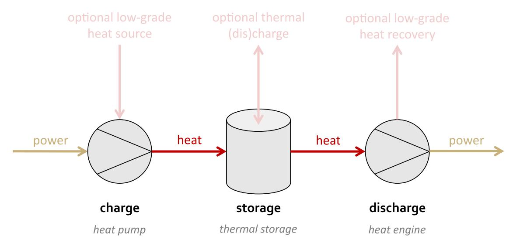

**Fig. 1.** Schematic diagram of a Carnot battery. Optional heat streams can be integrated at the different stages of the process.

interested in a range of alternatives with equivalent performance, allowing them to choose the option that best aligns with their experience and preferences, and enabling them to understand the compromises that need to be made to satisfy particular preferences [[30–](#page-22-27)[32\]](#page-23-0). This approach also provides a deeper understanding of the true physical nature of the design problem, rather than reducing it to a single techno-economic indicator.

# *1.2. Aim and contributions of this work*

While most thermodynamic studies on Carnot batteries focus on identifying the best performing design, the aim of this work is precisely to generate a list of alternative thermodynamic designs for Carnot batteries, with performance in a narrow range (within 7.5%rel, 15%rel or 30%rel of the maximum, see later). These alternatives will help designers (i) better grasp the physics of Carnot batteries (i.e., flexibility in design variables while maintaining near-optimum performance) and (ii) select the one that best aligns with their specific preferences. Focus is on small-scale Rankine Carnot batteries with sensible heat storage in pressurised water tanks, as these have been little studied. Nevertheless, the method introduced in this paper also applies to other technologies, such as Brayton Carnot batteries, organic Rankine cycles, high-temperature heat pumps, etc.

For Carnot batteries, key technical indicators during thermodynamic design are the power-to-power efficiency (P2P, affecting operational profitability) and the electrical energy density (el, affecting storage-related investment costs) [[20,](#page-22-15)[33\]](#page-23-1). While the economic optimum (e.g., minimum LCOS) results from a trade-off between these two indicators, it remains contingent on the chosen cost correlations making it uncertain and case-specific. Jiang et al. [[34\]](#page-23-2) for instance suggested that this trade-off lies approximately halfway between maximum efficiency and maximum density, whereas Hu et al. [\[12](#page-22-17)] reported that the minimum LCOS is achieved at maximum density. Hence, both efficiency and density are retained to allow designers the flexibility to navigate this trade-off according to their own preferences (e.g., custom economic models, etc.). For small-scale Rankine Carnot batteries with sensible heat storage in pressurised water tanks, Weitzer et al. [\[35](#page-23-3)] reported that an efficiency of around 30% could be expected when using subcritical cycles with internal recuperators. It is worth noting, however, that the literature on such configuration is scarce, as most studies focus on using low-grade heat sources (i.e., 60-90 ◦C) to enhance heat pump performance and thereby increase the power-topower efficiency up to values exceeding 100% [\[21](#page-22-16)[,36](#page-23-4)[–38](#page-23-5)]. In any case, the energy density of small-scale Rankine Carnot batteries typically remains below 10 kWhel∕m3 , depending on the storage temperature and configuration (single or dual tank systems).

Drawing on work carried out in the construction of energy transition scenarios [\[1,](#page-22-0)[31](#page-23-6)[,32](#page-23-0),[39](#page-23-7)[–41](#page-23-8)], near-optimal exploration methods are suitable for our problem (also referred as Modelling to Generate Alternatives, MGA). The idea of near-optimal methods is to identify alternative designs that are 'near' the previously identified global optimum (or Pareto front in case of multi-criteria optimisation). The objective is generally to maximise the diversity of solutions, and then to identify the parameters these solutions have in common (i.e., 'musthaves') and the degrees of freedom (i.e., 'real choices') [[31\]](#page-23-6). Designers can then make a choice based on their own preferences. Unlike constraints, which are rigid, preferences can be compromised if the tradeoff yields compensatory benefits. Beyond clarifying the nature of the problem (i.e., distinguishing must-haves from real choices), the nearoptimal method explicitly highlights the trade-offs required to align with specific preferences.

While near-optimal analyses are typically performed for single objective and linear programming models, the thermodynamic design of Carnot batteries is highly non-linear and discontinuous (i.e., nonphysical solutions). Meta-heuristic algorithms, such as evolutionary [[12](#page-22-17)[,22](#page-22-18)[,42](#page-23-9)[–44](#page-23-10)] or swarm intelligence [[45\]](#page-23-11) algorithms, are therefore usually employed for design optimisation. This is also a multi-criteria problem, since the aim is to maximise efficiency and density. Unfortunately, the literature on near-optimal methods (or more broadly on MGA) for meta-heuristic and multi-criteria problems is rather scarce. Two attempts have been identified, both based on evolutionary algorithms. The MOTRAN (Multi-objective Trade-off Analyzer) method [\[46](#page-23-12)] is based on the Non-dominated Sorting Genetic Algorithm NSGA-III [[47\]](#page-23-13), while the MDO-MOPSO (Multiple Design Options Multiple-Objective Particle Swarm Optimisation) method [[39\]](#page-23-7) is based on particle swarm optimisation.

In this work, we apply, for the first time, near-optimal analysis to the thermodynamic design of small-scale Rankine Carnot batteries, considering a comprehensive set of configurations, fluids, temperature and pressure settings. To that aim, we introduce a new near-optimal method for multi-objective problems based on a popular meta-heuristic optimisation algorithm. We then demonstrate the added value of exploring a set of near-optimal alternatives, as this offers greater design flexibility.

The paper is structured as follows. First, the thermodynamic model used to simulate the performance of Carnot batteries is described. Next, the method for generating the near-optimal alternatives is introduced. The method is then applied to the design of Carnot batteries.

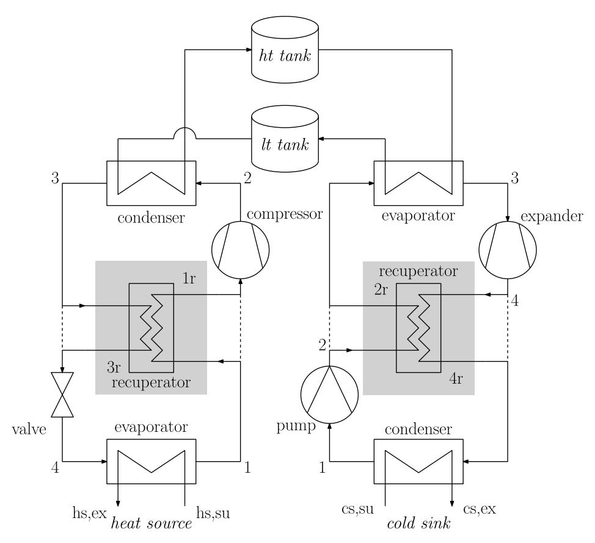

**Fig. 2.** Different architectures for the Carnot battery. Left: basic and recuperated vapour compression heat pump. Top: sensible heat thermal energy storage with high and low temperature tanks (pressurised water). Right: basic and recuperated organic Rankine cycle. *'ht'* is for high temperature, *'lt'* for low temperature, *'hs'* for heat source, *'cs'* for cold sink, *'su'* for supply and *'ex'* for exit. The shaded areas show the position of the recuperator when it is considered, while the dotted lines show the case without the recuperator.

First, the objective is to better understand the physics of the problem by identifying the main performance drivers. Thereafter, an example of a design process to satisfy different technological preferences is illustrated. Finally, the conclusion offers perspectives for future work.

# **2. Model and methods**

## *2.1. Thermodynamic model*

This section presents the general model for different charging and discharging thermodynamic cycles of Carnot batteries. This model will then be used to optimise the design variables and maximise efficiency and density.

# *2.1.1. Cycles architectures and regimes*

The Carnot batteries considered in this work are based on vapour compression heat pumps (HP), sensible heat thermal energy storage (TES) in two pressurised water tanks, and organic Rankine cycles (ORC) [\[21](#page-22-16)]. For the HP and the ORC, configurations with and without internal exchangers ('recuperators') are also considered. As discussed in the literature [[35,](#page-23-3)[37\]](#page-23-14), although they increase efficiency, these recuperators require additional investment costs, sometimes making them irrelevant from a techno-economic perspective [\[48](#page-23-15)[–50](#page-23-16)]. Moreover, when the storage temperature spread is large (i.e., a large temperature difference between the two tanks, necessary for greater thermal densities), recuperators generate more heat transfer irreversibilities in the ORC evaporator, thereby reducing its efficiency [\[51](#page-23-17)]. Cycles without recuperator therefore remain a relevant option to consider. The corresponding HP and ORC architectures are shown in [Fig.](#page-3-0) [2.](#page-3-0) To distinguish them clearly, they will be referred to as 'basic' or 'recuperated' HP and as 'basic' or 'recuperated' ORC.

For the HP and the ORC, subcritical and transcritical operating regimes are also compared, based on the relevance indicated in the literature [\[52](#page-23-18)]. Conceptually, transcritical cycles can offer a better match between the temperature profiles of the working fluid and the sensible heat storage, reducing heat transfer irreversibilities. Although they were popular at the genesis of Carnot batteries in the early 2010s [[19,](#page-22-14)[53](#page-23-19)[,54](#page-23-20)], particularly with CO2 as working fluid, transcritical cycles have been less studied than subcritical cycles for this application, perhaps due to inherent technological challenges and unconfirmed techno-economic benefits. Transcritical cycles indeed operate at higher pressures than subcritical cycles, which can increase costs as this requires stronger components and reduces compatibility with standard equipment [\[48](#page-23-15),[55,](#page-23-21)[56\]](#page-23-22). Furthermore, they involve complex control requirements due to the strong sensitivity of efficiency to pressure variations in the gas cooler (HP) or heater (ORC) [\[35](#page-23-3)].

Considering all architectures and regimes, a total of 16 Carnot battery configurations are investigated. These are listed with the corresponding acronyms in [Table](#page-4-0) [1](#page-4-0). While zeotropic mixtures are also interesting candidates for reducing heat transfer irreversibilities [\[44](#page-23-10)[,57](#page-23-23), [58\]](#page-23-24), this work limits to pure working fluids, focusing on the relevance of near-optimal analyses in this field (see below).

#### *2.1.2. System model and design variables*

The performance of the Carnot batteries is assessed using [CBSim](https://github.com/laterrea/CBSim)[1](#page-3-1) , an updated version of the Python thermodynamic model introduced

1 The model is available at: <https://github.com/laterrea/CBSim>

Table 1
Description of the 16 Carnot battery configurations investigated in this work, and the corresponding acronyms

| Description of the 10 Carnot battery configurations investigated in this work, and the corresponding actoriyms. |                   |                 |                   |                   |                   |                   |  |
|-----------------------------------------------------------------------------------------------------------------|-------------------|-----------------|-------------------|-------------------|-------------------|-------------------|--|
| High Temperature Heat Pump (HP)                                                                                 |                   |                 |                   |                   |                   |                   |  |
|                                                                                                                 |                   |                 | Subcritical (S)   |                   | Transcritical (T) |                   |  |
|                                                                                                                 |                   |                 | Basic (B)         | Recuperated (R)   | Basic (B)         | Recuperated (R)   |  |
|                                                                                                                 | Subcritical (S)   | Basic (B)       | #1: SBHP + SBORC  | #3: SRHP + SBORC  | #6: TBHP + SBORC  | #11: TRHP + SBORC |  |
| Organic Rankine Cycle (ORC)                                                                                  |                   | Recuperated (R) | #2: SBHP + SRORC  | #4: SRHP + SRORC  | #8: TBHP + SRORC  | #13: TRHP + SRORC |  |
|                                                                                                                 | Transcritical (T) | Basic (B)       | #5: SBHP + TBORC  | #7: SRHP + TBORC  | #9: TBHP + TBORC  | #15: TRHP + TBORC |  |
|                                                                                                                 |                   | Recuperated (R) | #10: SBHP + TRORC | #12: SRHP + TRORC | #14: TBHP + TRORC | #16: TRHP + TRORC |  |

by the authors in [59] for subcritical cycles. The main improvement concerns the model for high-pressure heat exchangers, which has been finely discretised to better represent the strong non-linearity of the temperature on the isobaric curves near and above the critical point. A recuperator model based on constant effectiveness has also been integrated. The model has also been extended to transcritical cycles, which in addition to the fine discretisation of the heat exchangers, require optimisation of the high pressure in order to maximise cycle efficiency. Further information on these improvements can be found in Appendix A.

The model uses CoolProp [60] to access the fluid properties. The assigned model parameters are shown in Table 2. Some are fixed (e.g., pinch-point in heat exchangers) while some others are employed as optimisation variables (e.g., storage temperature). The design constraints are also reported in Table 2. These parameters are perfectly in line with other works on the thermodynamics of Rankine Carnot batteries [35–37,52].

The heat source of the HP and the cold sink of the ORC are assumed to be dry ambient air at 15 °C. The temperature glide (difference between supply and exit air temperatures) is set to 5 K. Liquid subcooling in the ORC is set to 3 K to prevent from pump cavitation. The isentropic efficiencies of HP compressor and ORC expander are set to 0.75, so as to represent volumetric machines (scroll or screw) [36]. The pump isentropic efficiency is set to 0.60 so as to represent centrifugal machines, in accordance with recommendations found in the literature [61,62]. The pinch point temperature difference for the low pressure heat exchangers is assumed to be 5 K. Instead, the pinch point for the high pressure heat exchangers is assumed to be 3 K (secondary fluid is water instead of air). The last constant parameter is the recuperator effectiveness, which is set to 0.80. Also note that pressure losses in the heat exchangers and piping is neglected for both the HP and the ORC. Heat losses are also neglected for both cycles.

In terms of optimisation variables (see Fig. 3), the temperature levels of the TES can be chosen via the hot tank temperature and

the storage temperature spread (i.e., difference between the hot and cold tanks). Considering irreversibilities at the heat exchangers, the storage temperature must be maximised to maximise the efficiency of the Carnot battery (i.e., relative reduction of external irreversibilities [5,19,59]). Yet, the storage temperature is here limited to 120 °C so as to bound the heat pump lift to plausible values (< 105 K) and limit the tanks pressurisation needs to 2.5 bar (limited capital costs). Vapour superheating in the HP and in the ORC are also design variables, with minimum values set to 2 K. Liquid subcooling in the HP is another variable, with a minimum value set to 3 K. Note that for transcritical HP, liquid subcooling is inexistent and is removed from the variables. Same for vapour superheating in transcritical ORC. The last two design variables are the HP and ORC working fluids. These can be selected among a list of 43 fluids provided in Table B.1 in Appendix B. These have been selected from CoolProp when they had a low global warming potential (GWP) and zero ozone depletion potential (ODP). It is worth noting that only pure fluids are considered, as zeotropic mixtures have not proven effective for the configurations studied (i.e., ambient is used as the cold reservoir rather than additional sensible heat cold storage tanks) [63].

Regarding the constraints, the minimum pressure allowed in low pressure heat exchangers is 0.5 bar. There is a trade-off between the need for vacuum and an increased feasibility range for the fluid selection. Another constraint is on the compressor discharge temperature, which is limited to 200 °C to prevent lubricant degradation and potential fluid decomposition [64]. Also note that, as a conservative choice, two-phase compressions and expansions are not permitted (including two-phase conditions restricted to specific stages of the compression/expansion process). Although preliminary results have shown interesting performance, this choice guarantees the components lifetime (limitation of mechanical stress due to potential pressure peaks) and preserves the plausibility of the model (the isentropic efficiency tends to fall for two-phase fluids) [65].

 Table 2

 Set of model parameters and constraints for the Carnot battery optimisation. Volumetric compressors and expanders are considered here to represent low power (small-scale) applications.

| Name                          | Symbol                           | Value                       | Name                               | Symbol                   | Value       |
|-------------------------------|----------------------------------|-----------------------------|------------------------------------|--------------------------|-------------|
| Hot tank storage temperature  | T TES                 | design var.                 | Storage temperature spread         | $\Delta T_{TES}^{sp}$    | design var. |
| HP working fluid              | $fluid_{HP}$                     | design var.                 | ORC working fluid                  | $fluid_{ORC}$            | design var. |
| HP vapour superheating        | $\Delta T_{HP}^{sh}$             | design var.                 | ORC vapour superheating            | $\Delta T_{ORC}^{sh}$    | design var. |
| HP liquid subcooling          | $\Delta T_{HP}^{sc}$             | design var.                 | ORC liquid subcooling              | $\Delta T_{ORC}^{sc}$    | 3 K         |
| Heat source temperature       | $T_{hs,su}$                      | 15 °C                       | Cold sink temperature              | $T_{cs,su}$              | 15 °C       |
| Heat source temperature glide | $\Delta T_{hs}^{gl}$             | 5 K                         | Cold sink temperature glide        | $\Delta T_{cs}^{gl}$     | 5 K         |
| Compressor efficiency         | $\eta_{\rm is,comp}$             | 0.75                        | Expander efficiency                | $\eta_{\mathrm{is,exp}}$ | 0.75        |
| Cold tank storage temperature | $T_{TES}^{lt} \\$                | $T_{hs}-\Delta T_{hs}^{gl}$ | Pump efficiency                    | $\eta_{\mathrm{is,pmp}}$ | 0.60        |
| Pinch temp. diff. in HP cond. | $\Delta T_{HP}^{cd,pp}$          | 3 K                         | Pinch temp. diff. in ORC evap.     | $\Delta T_{ORC}^{ev,pp}$ | 3 K         |
| Pinch temp. diff. in HP evap. | $\Delta T_{HP}^{ev,pp}$          | 5 K                         | Pinch temp. diff. in ORC cond.     | $\Delta T_{ORC}^{cd,pp}$ | 5 K         |
| Recuperator effectiveness     | $arepsilon_{ m HP/ORC}^{ m rec}$ | 0.80                        | Pressure losses in heat exchangers | $\Delta p_{HP/ORC}$      | 0.0 bar     |
| Max. storage temperature      | $T_{TES,max}^{ht}$               | 120 °C                      | Storage pressure                   | $p_{TES}$                | 2.5 bar     |
| Max. compress. disch. temp.   | $T_{HP,max}^{comp,ex}$           | 200 °C                      | Min. HP/ORC pressure               | $p_{HP/ORC}^{min}$       | 0.5 bar     |
| Min. HP/ORC superheating      | $\Delta T_{min}^{sh}$            | 2 K                         | Min. HP subcooling                 | $\Delta T_{min}^{sc}$    | 3 K         |

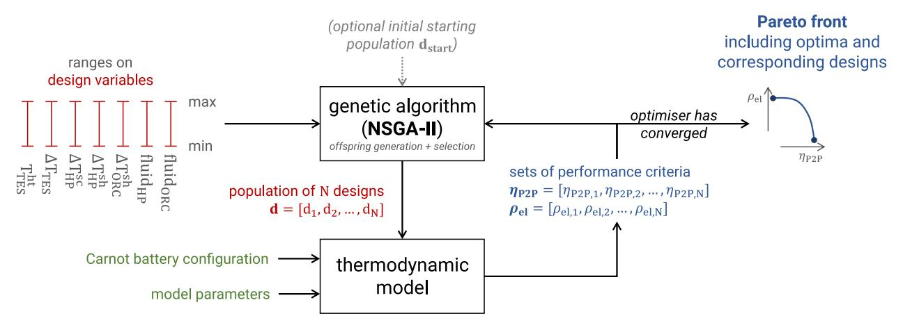

Fig. 3. Illustration of the optimisation process to generate the Pareto fronts for each Carnot battery configuration (Step #1 in Fig. 4). Initially, no starting population is provided, so the optimiser selects the 250 designs from the ranges of design variables through Latin Hypercube Sampling (LHS). New generations are then produced until hypervolume convergence (2000 generations are typically necessary). The mutation probability is 50% to capture the global optima. Further details can be found in Appendix C.

## 2.2. Near-optimal design with evolutionary algorithms

The objective during the thermodynamic design of a Carnot battery based on sensible heat storage is to maximise the power-to-power efficiency  $\eta_{\text{P2P}}$  and the electrical energy density  $\rho_{\text{el}}$  [35–37]. The former is linked to the operational profitability of the system, while the latter affects the capital cost associated to storage (i.e., the lower the density, the larger the tanks, hence the more expensive). When the storage thermal losses are neglected, efficiency and density are defined as

$$\eta_{\text{P2P}} = \text{COP}_{\text{HP}} \cdot \eta_{\text{ORC}} \quad , \tag{1}$$

$$\rho_{\rm el} = \rho_{\rm th} \cdot \eta_{\rm ORC} = \frac{h_{\rm TES}^{\rm ht} - h_{\rm TES}^{\rm lt}}{v_{\rm TES}^{\rm ht} + v_{\rm TES}^{\rm lt}} \cdot \eta_{\rm ORC} \quad , \tag{2}$$

with h and v the specific enthalpies and volumes of the hot and cold tanks.  $COP_{HP}$  is the coefficient of performance of the heat pump, and  $\eta_{ORC}$  the efficiency of the organic Rankine cycle. These are defined as

$$COP_{HP} = \frac{Q_{HP}^{out}}{W_{HP}^{in}} = \frac{h_2 - h_3}{h_2 - h_1} , \qquad (3)$$

$$\eta_{\rm ORC} = \frac{W_{\rm ORC}^{\rm out} - W_{\rm ORC}^{\rm in}}{Q_{\rm ORC}^{\rm in}} = \frac{(h_3 - h_4) - (h_2 - h_1)}{h_3 - h_2} \quad , \tag{4}$$

following the nomenclature of Fig. 2 for basic cycles. Note that in case of recuperated cycles,  $W_{HP}^{in}=h_2-h_{1r}$  and  $Q_{ORC}^{in}=h_3-h_{2r}$ .

In the first stage (Section 2.2.1), we will optimise each of the 16 Carnot battery configurations (see Table 1) for these two criteria using multi-objective optimisation. The 16 resulting Pareto fronts will then be assembled to form one 'global' Pareto front. In the second stage (Section 2.2.2), we will generate the sub-optimal space to explore diverse design alternatives with a reasonable performance trade-off, addressing uncertainties related to the key drivers and the designers preference.

## 2.2.1. Multi-criteria optimisation of the Carnot battery designs

The first stage is to optimise  $\eta_{P2P}$  and  $\rho_{el}$  for the 16 Carnot battery configurations. As these objectives are typically conflicting, a single optimum design cannot be achieved [35]. Instead, the optimal designs will be distributed along Pareto fronts.

In view of our problem, a meta-heuristic and multi-criteria algorithm is necessary to generate these Pareto fronts by optimising the seven design variables introduced in Section 2.1.2. As it has performed well in similar problems [12,59], the Non-dominated Sorting Genetic Algorithm NSGA-II [66] is here adopted through RHEIA, a Python

package [67]. This methodology is further illustrated in Fig. 3, and corresponds to Step #1 in Fig. 4.

Note that, as the fluids are discrete and non-continuous variables, an approximation to the nearest integer is applied to select the corresponding fluid (see Table B.1). The NSGA-II optimisation algorithm is configured with a mutation probability of 50% to ensure thorough exploration of the design space [12,59]. Since the computational budget allows (one model evaluation takes approximately 5 ms), the number of generations is set to 2000 to ensure good convergence. Further details regarding convergence can be found in Appendix C. Once the Pareto fronts corresponding to each of the 16 configurations are generated, all the non-dominated solutions among these are then assembled to form the global Pareto front (Step #2 in Fig. 4).

## 2.2.2. Generating alternative Carnot battery designs

After the optimised solutions are retrieved, the second stage is to find the near-optimal alternatives. To do so, we must define what is near-optimal, and thus the slack we allow on the performance indicators (i.e., the tolerated performance degradation, also referred as 'sub-optimality coefficient'). For instance, in Section 3.2, we will allow for a 7.5% slack on  $\eta_{P2P}$  and  $\rho_{el}$ , resulting in a sub-optimal space (Step #3 in Fig. 4). It is within this sub-optimal space that near-optimal alternatives will be sought. To assess the impact of the slack value on design flexibility, Section 3.3 will instead consider 15% and 30% slacks.

Once the sub-optimal space is defined (Step #3 in Fig. 4), the proper search for alternative designs can begin (Step #4 in Fig. 4). To achieve this, the optimisation problem is reconfigured. The initial populations for each Carnot battery configuration are derived from the Pareto fronts obtained at the end of the first stage, eliminating the need for Latin Hypercube Sampling. The optimisation criteria are no longer  $\eta_{\rm P2P}$  and  $\rho_{\rm el}$ . Instead, the objective is to maximise the Euclidean distance between the solutions and reference designs belonging to the global Pareto front from Step #2. This approach aims to maximise solutions diversity and enhance the exploration of the sub-optimal space. The process unfolds as follows:

- 1. The initial populations (i.e., *gen. 0*) for generating the alternatives correspond to the optimised Pareto fronts for the 16 Carnot battery configurations.
- The offspring populations (i.e., gen. 1) are generated through mutations and crossovers using NSGA-II. Individuals that fall outside the sub-optimal space are discarded (Step #4a in Fig. 4).
   This is achieved assigning them random negative fitness values between 0 and -1.

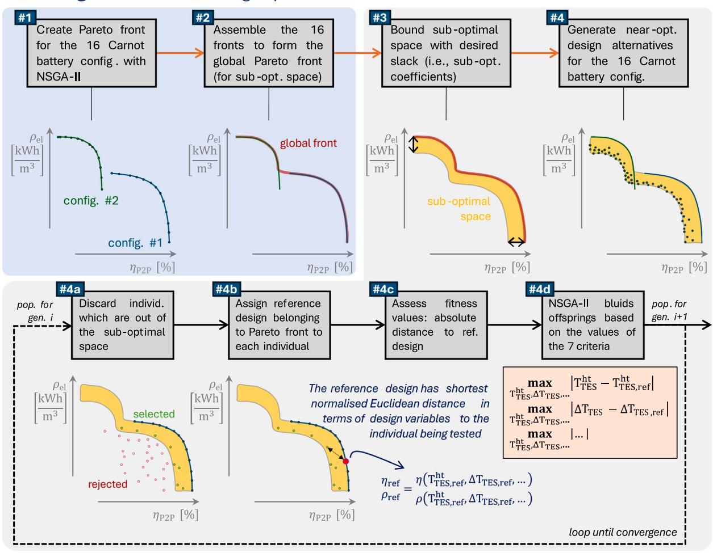

**Fig. 4.** Schematic representation of the procedure employed to generate the sets of near-optimal alternatives. Step #1 is further detailed in [Fig.](#page-5-0) [3](#page-5-0). Only 2 fronts are represented for sake of clarity, but 16 are effectively considered. During the creation of the near-optimal designs (Step #4), 1500 generations are typically performed and the mutation probability is 50% to capture the global optima.

- 3. Each individual within the sub-optimal space is assigned a 'reference' individual from the Pareto front of the same Carnot battery configuration (Step #4b in [Fig.](#page-6-0) [4](#page-6-0)). The reference individual is selected based on design similarity rather than proximity in P2P and el. Specifically, similarity is determined by comparing the storage temperature levels, superheating and subcooling degrees, and working fluids. This is quantified using the normalised Euclidean distance in this 7-dimensional design space, ensuring consistency across variables with different units. The reference individual is the one with the shortest normalised Euclidean distance to the considered individual.
- 4. Compared to the first stage in Section [2.2.1](#page-5-1), new optimisation criteria are introduced. To enhance the exploration of the suboptimal space, the objective is to maximise the deviation from the reference designs (i.e., the Euclidean distance). The optimisation criteria to be maximised are the absolute differences between the 7 design variables of the individual under consideration and of its corresponding reference design (Step #4c in [Fig.](#page-6-0) [4](#page-6-0)). The initial population (*gen. 0*) is a special case, as it consists of the reference points themselves, resulting in zero difference between individuals and their references.
- 5. Using the fitness values of the 7 criteria for the *N* individuals of *gen. 0* and *gen. 1* (a total of *2N* individuals), the NSGA-II algorithm retains *N* individuals based on dominance. After

applying the necessary mutations and crossovers, NSGA-II generates a new offspring population (Step #4d in [Fig.](#page-6-0) [4\)](#page-6-0), and the process loops back to Step #4a. This iterative cycle continues until convergence is achieved (further details in [Appendix](#page-16-1) [C\)](#page-16-1).

Once the generation of alternatives for each of the 16 configurations is complete, they are assembled to form a comprehensive set of near-optimal alternatives for Carnot battery designs.

#### *2.3. Key performance indicators and technological parameters*

Near-optimal analyses provide designs with similar performance criteria (P2P and el in this case), but with different design parameters and technological indicators, opening a close-to-reality design with trade-offs. Four types of indicators are used in this study: distance to the critical point, slope of the saturated vapour curve, volume ratio, and volumetric capacity.

In subcritical cycles, when the high pressure saturation point is close to the critical point, the cycle is 'near-critical'. This type of regime poses a series of challenges, particularly in terms of control (sudden variation in fluid properties including heat capacity and density, high sensitivity to pressure and temperature) [[68,](#page-23-34)[69\]](#page-23-35). This regime also requires particular attention for the design of heat exchangers. The proximity to the critical point can be defined as the difference between the critical temperature Tcrit and the saturation temperature Tsat,ht. Thus, for subcritical HP and ORC, we have

$$\Delta T_{HP}^{crit} = T_{HP}^{crit} - T_{HP}^{sat,ht} , \qquad (5)$$
  
$$\Delta T_{ORC}^{crit} = T_{ORC}^{crit} - T_{ORC}^{sat,ht} . \qquad (6)$$

$$\Delta T_{OPC}^{crit} = T_{OPC}^{crit} - T_{OPC}^{sat,ht} . \tag{6}$$

For drawing up guidelines on the working fluids, it is convenient to classify them into different categories. A common parameter is the inverse of the slope of the saturated vapour curve  $\xi_M^*$  on the  $T_r - s^*$ diagram [70], with  $T_r = T/T^{crit}$  the reduced temperature and  $s^* = s/R$ the dimensionless entropy. This is defined as

$$\left. \xi_{\mathrm{M}}^{*} = \left. \frac{\mathrm{d}s^{*\mathrm{g}}}{\mathrm{d}T_{\mathrm{r}}} \right|_{\mathrm{T_{\mathrm{r}}\mathrm{M}}} \quad , \tag{7} \right.$$

with s\*g the reduced entropy on the saturated vapour curve and M the inflexion point where

$$\frac{d^2 s^* g}{dT_r^2} \bigg|_{T_{r,M}} = 0 \quad . \tag{8}$$

When it is negative, the fluid is said to be 'wet' (an isentropic expansion from a saturated vapour state will give rise to a two-phase saturated state). When it is positive, the fluid is said to be 'dry' (an isentropic expansion starting from a saturated vapour state will give rise to a superheated vapour state). Finally, when it is close to zero, the fluid is sometimes said to be 'isentropic'.

In addition to the above thermodynamic quantities, technological parameters can also guide the designers in their choice. The volume ratio rv is particularly interesting for adapting to compression and expansion machines (scroll, screw). Their efficiency varies with the volume ratio, and optimum efficiency is obtained when the volume ratio of the cycle coincides with their built-in volume ratio. For example, a manufacturer working with some specific machines might prefer a thermodynamic design depending on its volume ratio. Using the nomenclature of Fig. 2, this ratio is defined as

$$r_{v,HP} = \frac{v_{1(r)}}{v_2}$$
 , (9)

$$r_{v,ORC} = \frac{v_4}{v_3}$$
 (10)

Another useful indicator for HP based on volumetric machines is the volumetric heating capacity VHCHP [55]. This characterises the ratio between the specific quantity of heat produced and the specific volume of the fluid entering the compressor. The lower this capacity, the larger and/or faster the compressor will have to run, driving up investment costs [55]. Using the nomenclature of Fig. 2, this is defined as

$$VHC_{HP} = \frac{h_2 - h_3}{v_{1(r)}} . {(11)}$$

A similar indicator for assessing the compactness of an ORC is the volume coefficient VCORC [71,72]. This is defined as the ratio between the specific volume of the fluid entering the expander and the specific work produced. Using the nomenclature of Fig. 2, this is written as

$$VC_{ORC} = \frac{v_3}{h_3 - h_4} \quad . \tag{12}$$

The larger VCORC, the larger the specific volume of the expander.

## 3. Results

This section first looks at the construction of the Pareto fronts (Step #1 in Fig. 4) and illustrates the designs of Carnot batteries maximising  $\eta_{\rm P2P}$  and  $\rho_{\rm el}$  (Section 3.1). A first set of near-optimal alternatives is then generated to discuss the main performance drivers. It identifies the required parameters (i.e., the must-haves) and the room for maneuver (i.e., the real choices) to optimise Carnot battery design (Section 3.2). Subsequently, a second set of alternatives with larger slack illustrates how the near-optimal approach can be used to identify designs that satisfy some specific designers preferences (Section 3.3).

#### 3.1. Identifying the pareto fronts

Even if the Pareto fronts were obtained with an exhaustive search of the 16 Carnot battery configurations, only subcritical recuperated cycles (both for HP and ORC) dominate the other designs in terms of efficiency (see Fig. 5). The maximum value obtained for the parameters introduced in Table 2 is 33.3%, which is close to the 30% reported by Weitzer et al. [35] under the same conditions. Our value is slightly higher, as we performed a design optimisation, whereas Weitzer et al. only conducted a sensitivity analysis on a reference design. Conversely, for energy density, several configurations provide same performance. The four configurations with transcritical basic ORC actually emerge as the best performers (reaching up to 3.74 kWhel/m3), while the HP configuration has no impact on density ( $\rho_{el}$  is not a function of  $COP_{HP}$ ). This is because large  $\rho_{el}$  is obtained with large thermal densities (i.e., large storage temperature spreads) and good ORC efficiencies, such as defined by Eq. (2). While transcritical ORC typically offer better efficiency than subcritical cycles for (very) large heat source glides [73], transcritical recuperated cycles do not maximise  $\rho_{\rm el}$  here. The recuperator actually raises the evaporator inlet temperature, preventing the cold tank from reaching sufficiently low temperatures. As a result, the storage temperature spread is limited, lowering the thermal density. Finally, in the intermediate zone of the global Pareto front, TRHP + TRORC and SRHP + TRORC offer the best trade-off between  $\eta_{\rm P2P}$  and  $\rho_{\rm el}$ .

To illustrate the corresponding Carnot battery designs, Fig. 6 shows the temperature-enthalpy diagrams of the HP and ORC cycles maximising  $\eta_{\rm P2P}$  and  $\rho_{\rm el}$  (i.e., the extrema of the global Pareto front). In both cases, the storage temperature is maximised (120 °C), as expected from literature [5,59]. On the other hand, the storage temperature spread is about 30 K when maximising  $\eta_{P2P}$ , compared with about 85 K when maximising  $\rho_{el}$ . This illustrates the pivotal role of this variable, as expected from literature [35,37]. It should also be mentioned that for subcritical cycles (i.e., those maximising  $\eta_{P2P}$ ), subcooling in the HP and superheating in the ORC are maximised. The HP cycle in Fig. 6(a) is peculiar: almost 40% of the heat transferred to the storage comes from vapour de-superheating at the compressor outlet.

The transcritical cycles in Figs. 6(b) and 6(d) use fluids with very high global warming potential and/or non-zero ozone depletion potential. Although banned (or being phased out) by the Montreal Protocol, the Kigali Amendment and/or the F-gas regulation (EU), these fluids have actually been considered in this work (see Table B.1) for illustrative purposes. In fact, the list of fluids compatible with these regulations and available in CoolProp suffers from a severe gap in the range of critical temperatures between 44.1 °C and 91.1 °C. Yet, it is specifically this range of critical temperatures that is needed to enable transcritical cycles in the Carnot battery application under consideration. This result therefore highlights the potential interest in identifying new molecules in this range of critical temperatures. However, one of the interests of the near-optimal method can also be to find alternative designs and fluids providing similar performance.

## 3.2. From the Pareto to understanding the main drivers

Unlike the only two extreme cycles described in the previous section, this section aims to determine the flexibility available among the seven optimisation variables and the different Carnot battery configurations to achieve designs with high efficiency and high density. To do this, the slack was set to  $\varepsilon = 7.5\%_{\rm rel}$  for both criteria. This value allows a sufficiently wide range of design alternatives to be explored. Values ranging from 3% to 10% are common for modelling to generate alternatives in energy systems [1,32,39]. However, Section 3.3 will instead consider  $\varepsilon = 15\%_{\rm rel}$  and  $30\%_{\rm rel}$  to illustrate the impact on design flexibility. Fig. 7 shows the corresponding sub-optimal space and the associated near-optimal designs. The greater concentration of points at higher densities and lower efficiencies directly reflects the

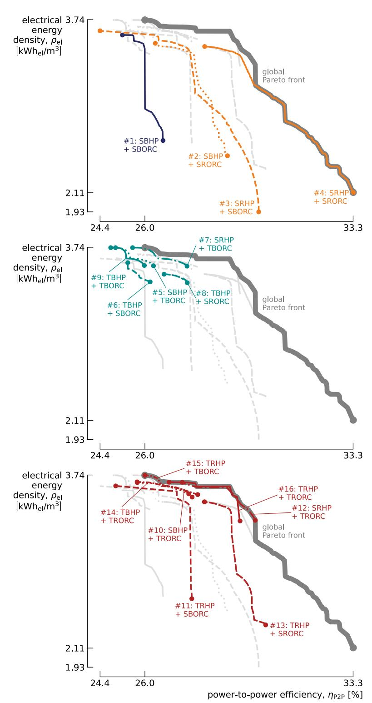

**Fig. 5.** Pareto fronts obtained after optimisation of the 16 Carnot battery configurations. While subcritical recuperated cycles (both for HP and ORC) dominate the other designs in terms of efficiency, the four systems with transcritical basic ORC provide the best energy density.

findings from [Fig.](#page-8-0) [5](#page-8-0) in the previous section. The Pareto fronts for most configurations are positioned in that region of the sub-optimal space, thereby constraining several configurations to this area. Furthermore, the objective function when generating the alternatives aims at maximising the difference with optimal designs, which positions them away from the Pareto fronts (see Section [2.2](#page-5-4)). Yet, maximising this objective does neither translate into being on this border, hence the added-value of such analysis. The rest of this section should now be read as 'By tolerating a maximum performance degradation of 7.5%rel with respect to the global Pareto front, then (...)'.

[Figs.](#page-10-0) [8](#page-10-0) and [9](#page-11-0) show the performance indicators associated with these near-optimal designs. [Fig.](#page-10-0) [8](#page-10-0) focuses on the designs being maximum 7.5%rel away from the best efficiency (i.e., 33.3%), while [Fig.](#page-11-0) [9](#page-11-0) highlights designs being maximum 7.5%rel away from the best density (i.e., 3.74 kWhel∕m3 ).

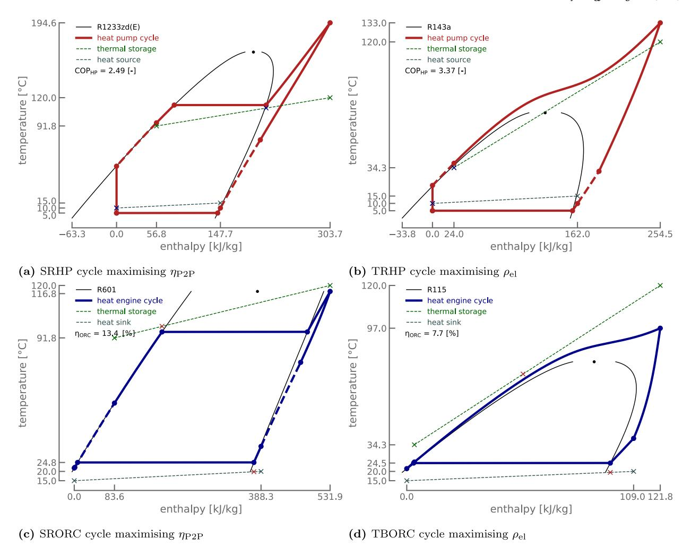

**Fig. 6.** Temperature-enthalpy diagrams of the for the HP (red) and ORC (blue) cycles maximising the power-to-power efficiency P2P and the electrical energy density el. In both cases, the storage temperature is maximised (120 ◦C) while the storage temperature spread is about 30 K when maximising P2P, compared with about 85 K when maximising el. (For interpretation of the references to colour in this figure legend, the reader is referred to the web version of this article.)

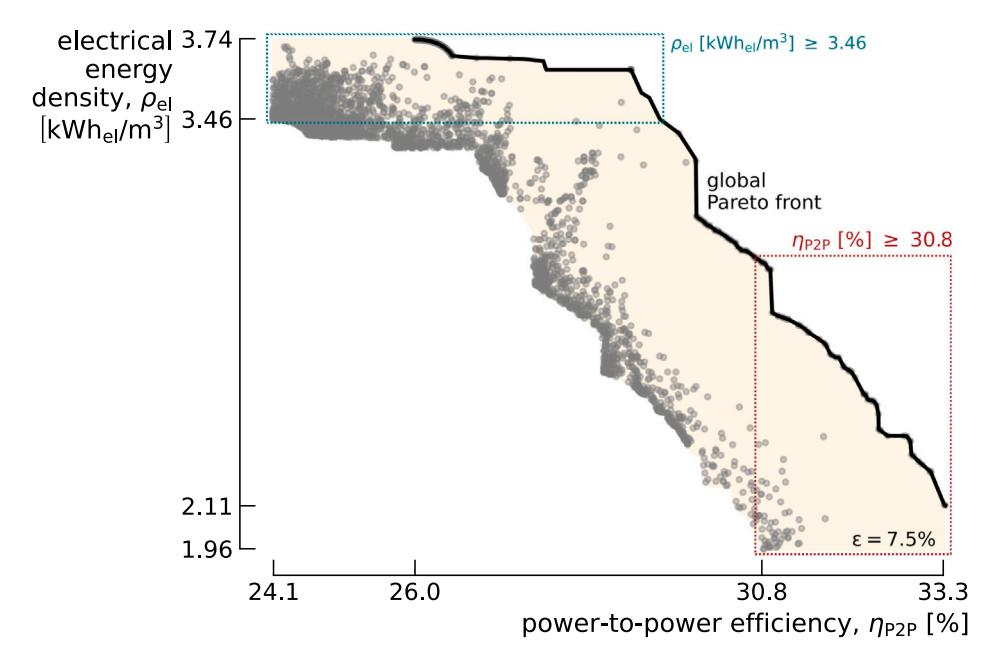

**Fig. 7.** Sub-optimal space (pale surface) and associated near-optimal alternatives (grey points) for slack of = 7.5%rel for both P2P and el. The coloured frames indicate the regions near the maximum efficiency (red, see [Fig.](#page-10-0) [8\)](#page-10-0) and maximum density (blue, see [Fig.](#page-11-0) [9\)](#page-11-0). (For interpretation of the references to colour in this figure legend, the reader is referred to the web version of this article.)

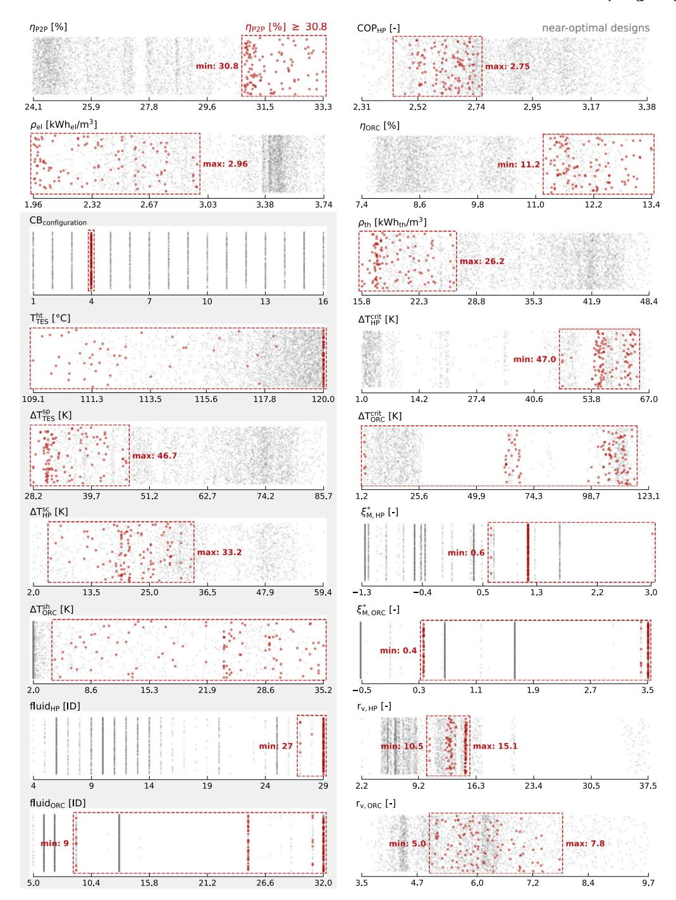

Fig. 8. Performance indicators corresponding to the near-optimal designs reported in Fig. 7. The Carnot battery configurations and optimisation variables are at the bottom left (shaded area). Red dots mark the designs being maximum  $7.5\%_{rel}$  away from the best efficiency (i.e., minimum 30.8%), while grey dots correspond to remaining near-optimal designs from Fig. 7. The frames delimit the upper and lower bounds. (For interpretation of the references to colour in this figure legend, the reader is referred to the web version of this article.)

The first observation is that, as far as the efficiency-density conflict is concerned, it is possible to expect densities of 2.96 kWhel/m³ with efficiencies of over 30.8% (see red dots in Fig. 8). Conversely, efficiencies of up to 29.0% can be reached with densities greater than 3.46 kWhel/m³ (see blue dots in Fig. 9). Nearly all configurations succeed in reaching the sub-optimal space 7.5%rel away from the optimum  $\rho_{\rm el}$  (except SRHP + SRORC and TRHP + SRORC). However, even when tolerating a 7.5%rel deviation from the optimum  $\eta_{\rm P2P}$ , only one configuration reaches it (subcritical and recuperated HP and ORC, see Fig. 8). It therefore represents a must-have whenever prioritising the efficiency.

Regarding the storage temperature, this must theoretically be maximised to maximise  $\eta_{\rm P2P}$  (relative reduction in heat transfer irreversibilities [5,19,59]) and maximise  $\rho_{\rm el}$  (increase in ORC efficiency  $\eta_{\rm ORC}$  and storage thermal density  $\rho_{\rm th}$  [5,59]). It can however be observed that  $\rho_{\rm el}$  is slightly more sensitive to this parameter than  $\eta_{\rm P2P}$ . The minimum storage temperature required to maintain near-optimal  $\rho_{\rm el}$  is 116.5 °C (see blue dots in Fig. 9), while it can fall to 109.1 °C for  $\eta_{\rm P2P}$  (see red dots in Fig. 8).

The storage temperature spread is large for high density (63.7 K to 85.7 K, blue dots in Fig. 9), while moderate for high efficiency (28.2 K to 46.7 K, red dots in Fig. 8). A large spread increases the thermal

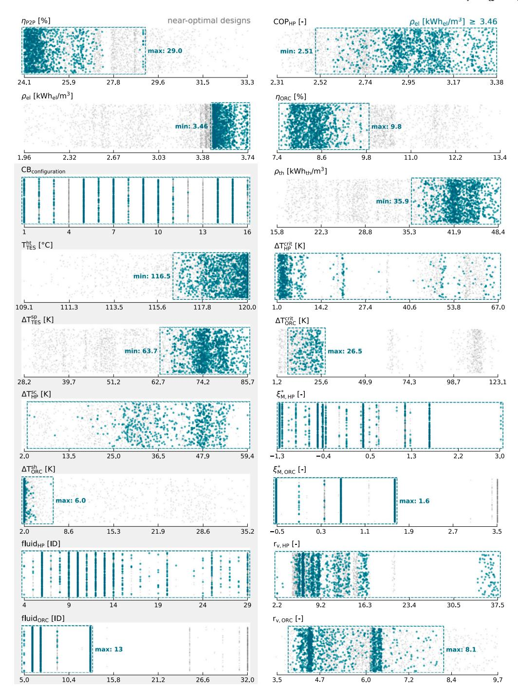

Fig. 9. Performance indicators corresponding to the near-optimal designs reported in Fig. 7. The Carnot battery configurations and optimisation variables are at the bottom left (shaded area). Blue dots mark the designs being maximum  $7.5\%_{rel}$  away from the best density (i.e., minimum  $3.46 \text{ kWh}_{el}/\text{m}^3$ ), while grey dots correspond to remaining near-optimal designs from Fig. 7. The frames delimit the upper and lower bounds. (For interpretation of the references to colour in this figure legend, the reader is referred to the web version of this article.)

energy density ( $\rho_{th}=35.3~\text{kWh}_{th}/\text{m}^3$  to 48.4 kWhth/m³ compared with  $\rho_{th}=15.8~\text{kWh}_{th}/\text{m}^3$  to 26.2 kWhth/m³ for high efficiency). But in the meantime, it reduces the ORC efficiency, due to the reduction in evaporation temperature and the increased heat transfer irreversibilities ( $\eta_{ORC}=7.4\%$  to 9.8% for density compared with  $\eta_{ORC}=11.2\%$  to 13.4% for efficiency). Larger spreads are also beneficial to the HP coefficient of performance (COPHP = 2.51 to 3.38 for density compared with COPHP = 2.44 to 2.75 for efficiency) as they reduce the condensing temperature (hence, the discharge pressure) and increase the permitted subcooling degree. The optimum spread for efficiency is therefore a trade-off between COPHP and  $\eta_{ORC}$ , while for electrical energy density,

it is a trade-off between  $\rho_{\rm th}$  and  $\eta_{\rm ORC}$ . This optimum spread is hence not the same for efficiency and density. Moreover, its values are not unique, but can be span over a range of around 20 K for both criteria (i.e., real choice). Note that when the storage can reach higher temperatures, the optimum spread can be the same for both (e.g., for 150 °C storage, as illustrated in a previous publication [59]).

Subcooling in the HP must theoretically be maximised to maximise COPHP [74]. However, near-optimal results reveal that it can reach low values down to 5.5 K for systems maximising efficiency. This low subcooling is made possible by the presence of the recuperator, which recovers part of the exergy available at the valve inlet and which would

otherwise be lost. This shows that there is some flexibility in the choice of this parameter (i.e., real choice), provided that a recuperator is installed in the HP.

Vapour superheating in the ORC can take on a wide range of values in systems maximising efficiency (from 4.5 K to 35.2 K). On the other hand, in systems maximising density, it is generally minimal and in all cases less than 6.0 K. This can be explained by the fact that subcritical cycles with large storage spreads use dry fluids ( $\xi_{\text{M,ORC}}^* > 0.0$ ). Therefore, any superheating would raise the temperature of the vapour leaving the expander, which would increase the condenser losses. The use of recuperators to overcome this is limited by the large storage spreads, since the temperature at the evaporator inlet must remain lower than that of the cold tank. Hence, for subcritical ORC maximising density, vapour superheating must be kept as low as possible (i.e., must-have).

In terms of fluids, the choice is much more limited for cycles maximising efficiency (3 for HP and 4 for ORC) than density (25 for HP and 5 for ORC). This can be explained by the fact that only one Carnot battery configuration works for efficiency, while nearly all configurations work for density, and also by the fact that  ${\rm COP}_{\rm HP}$  does not affect density. So, a HP fluid giving poor  ${\rm COP}_{\rm HP}$  will still be acceptable. This is illustrated by the fact that the range of  ${\rm COP}_{\rm HP}$  maximising density is much wider than that maximising efficiency (2.51 to 3.38 for density against 2.44 to 2.75 for efficiency). As the ORC efficiency is important for both density and efficiency, only the fluids providing the best  $\eta_{\rm ORC}$  are selected, which explains why the range of possibilities is smaller for the ORC than for the HP.

For cycles maximising efficiency, only dry fluids (i.e.,  $\xi_{\rm M}^*>0.0$ ) are used in the HP and the ORC. For the HP, this can be explained by the fact that a dry fluid limits the superheating at the compressor discharge compared with a wet fluid, and therefore reduces irreversibility at the condenser. For the ORC, the exergy remaining in the superheated vapour leaving the expander is reused by the recuperator to preheat the liquid before the evaporator (although this produces some heat transfer irreversibility). Additionally, the fluids used in the HP have high critical temperatures, resulting in large temperature differences between the critical point and saturation (between 47.0 K and 64.1 K). For systems maximising density, wet fluids (i.e.,  $\xi_{\rm M}^*<0.0$ ) are also an option for the ORC and the HP. However, ORC with wet fluids only operate in transcritical regime.

A final technological parameter worth considering is the volume ratio of the different cycles. Since the built-in volume ratios of scroll and screw machines are typically limited to a maximum of approximately 5.0, it is preferable to identify cycles with a volume ratio equal to or below this threshold. This is achievable for both subcritical HP and ORC in configurations that maximise energy density, as the upper pressure is limited thanks to the large storage temperature spread, which reduces the saturation temperature. However, this is not feasible for the HP in configurations that maximise efficiency, where the smaller temperature spread leads to a higher saturation temperature and, consequently, a higher compressor discharge pressure.

To improve the performance of the compression process under large pressure ratios, multiple compressors can be arranged in series. In such configuration, the overall compression is divided between different machines, allowing the volume ratio at each stage to better match the built-in volume ratios of the compressors. The use of two-stage scroll or reciprocating compressors is already common in high-pressure ratio HPs [48,75] and is expected to become more widespread as high-temperature heat pumps continue to develop. Similarly, multi-stage expanders can be employed in ORCs when large expansion ratios are required [76–78]. However, such multi-stage configurations increase system costs and add complexity to both design and control. It is therefore preferable to limit the cycle volume ratio as much as possible, thereby minimising the number of compression and expansion stages required.

#### 3.3. Choosing the carnot battery that suits your own preferences

Various thermodynamic designs for Carnot batteries can achieve comparable performance while presenting distinct trade-offs. The nearoptimal method enables designers to access a range of alternatives that align, either partially or fully, with their technological preferences. These preferences are shaped by both techno-economic factors and non-technical considerations, which cannot be entirely captured by mathematical models. They often arise from practical experience in constructing and operating machines (e.g., fabrication challenges, maintenance complexity, climatic conditions), strategic and business model choices (e.g., regional regulations, expected returns on investment), market perceptions (e.g., user needs), supply chain dynamics (e.g., component availability, discounts, or lead times), etc. Unlike constraints, which are rigid and non-negotiable, preferences represent desirable criteria that may be compromised if outweighed by other benefits. This inherently requires subjective evaluation and prioritisation by the designers (e.g., human-in-the-loop MGA [41]). The objective, therefore, is to present a curated list of viable alternatives, empowering designers to select solutions that best align with their own set of

To illustrate this methodology, we selected four preferences relevant for Carnot batteries:

- $T_{TES}^{ht}$  < 100 °C: To reduce investment costs, pressurisation should be avoided so as to reduce material strength requirements. The storage temperature must thus remain below the atmospheric boiling point of water. This enables the use of cost-effective materials such as plastic or concrete tanks.
- $T_{HP}^{comp,ex}$  < 160 °C: To facilitate the use of standard lubricants in the HP compressor and prevent damage, the discharge temperature is limited to 160 °C [79]. This also minimises risks of thermal instability in the refrigerant-lubricant mixture and simplifies component selection by reducing demands for high-temperature resistance and heat management.
- rv,HP < 8: To reduce design and manufacturing costs of the HP compressor, and to limit the system regulation complexity if several compressors were used in series, the volume ratio of the HP cycle is capped at 8 [48]. This allows the use of a maximum of two compressors in series while maintaining design flexibility. (For reference, the built-in volume ratio of scroll and screw compressors typically does not exceed 5.)</li>
- THPsc < 5 K: Large subcooling degrees in the HP can be achieved with an additional heat exchanger (subcooler), but this increases investment costs and limits operational flexibility (no possible regulation of subcooling degree) [80]. Alternatively, subcooling can be performed in the condenser by controlling the liquid refrigerant level, which may require a second expansion valve for charge control during part-load operation [81]. To avoid these complexities, subcooling should be kept minimal (e.g., below 5 K). Additionally, limiting the subcooling reduces the refrigerant charge, which could further decrease costs and ease compliance with regulations.

In order to explore a wider range of designs so as to meet each preference, new near-optimal designs were generated. Slacks were here set to 15% for  $\eta_{\rm P2P}$  and 30% for  $\rho_{\rm el}$ . The latter is particularly important to reach storage temperatures below 100 °C. Design alternatives were then considered within a part of the sub-optimal space, limited to 20% below the maximum efficiency (i.e.,  $\eta_{\rm P2P}$  above 26.6%, corresponding to the south-eastern part of the sub-optimal space). Efficiencies below this threshold are considered too low to remain competitive.

Based on the preferences they satisfied, eight distinct subsets could be identified among the generated near-optimal alternatives. These are shown in Fig. 10. Fig. 11 illustrates the range of values for various indicators covered by these subsets (coloured bars), along with the

|           | T TES [°C] < 100 | T HP comp, ex [°C] < 160 | r v, HP [-] < 8 | $\Delta T_{HP}^{sc}[K] < 5$ |
|-----------|-----------------------------|------------------------------------------------|----------------------------|-----------------------------|
| Subset #1 | ✓                           | ✓                                              | ✓                          | Х                           |
| Subset #2 | <b>✓</b>                    | 1                                              | Х                          | Х                           |
| Subset #3 | 1                           | Х                                              | Х                          | Х                           |
| Subset #4 | Х                           | 1                                              | ✓                          | Х                           |
| Subset #5 | Х                           | 1                                              | Х                          | ✓                           |
| Subset #6 | Х                           | 1                                              | Х                          | Х                           |
| Subset #7 | Х                           | Х                                              | 1                          | Х                           |
| Subset #8 | Х                           | Х                                              | Х                          | ✓                           |

Fig. 10. Subset classification table representing the eight subsets identified among the near-optimal designs, according to the preferences they satisfy. One subset satisfies three preferences (#1), three satisfy two (#2, #4, #5) and four satisfy just one (#3, #6, #7, #8).

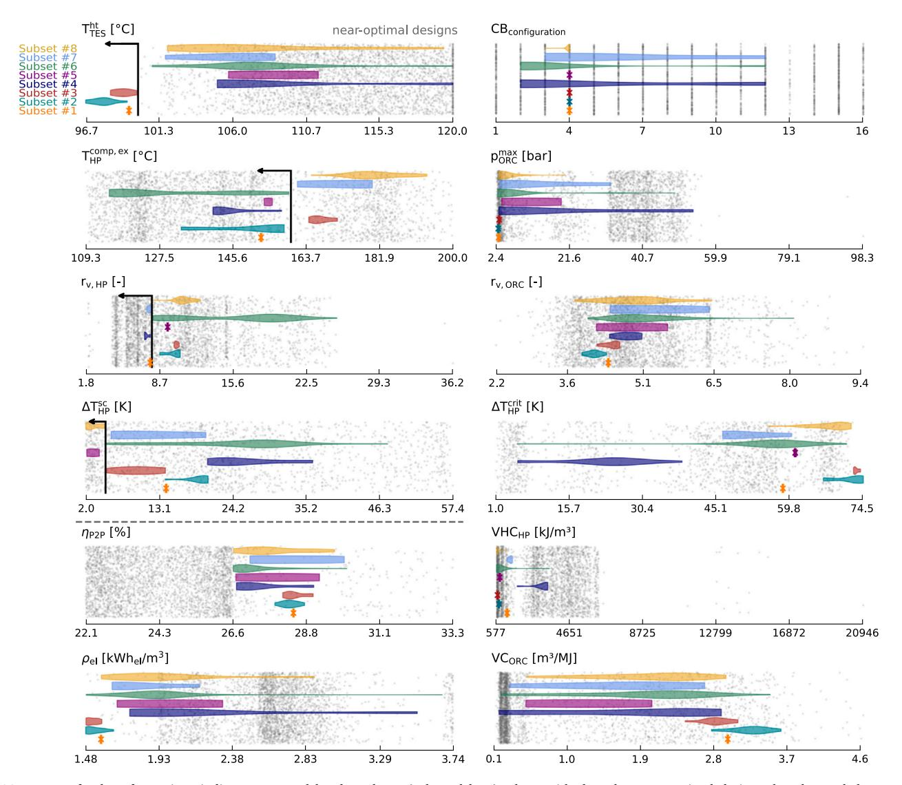

Fig. 11. Range of values for various indicators covered by the subsets (coloured bars), along with the other near-optimal designs that do not belong to any subset (represented by grey dots). The violins indicate the distributions. Subset #1 has just one design, while the others have several. (For interpretation of the references to colour in this figure legend, the reader is referred to the web version of this article.)

other near-optimal designs that do not belong to any subset (represented by grey dots). These indicators are firstly those for the four preferences, i.e., storage temperature  $T_{TES}^{\rm ht}$ , compressor discharge temperature  $T_{HP}^{\rm comp,ex}$ , HP volume ratio  $r_{v,HP}$  and HP sub-cooling  $\Delta T_{HP}^{\rm sc}$ . Next to these are the two performance criteria, the efficiency  $\eta_{P2P}$  and the density  $\rho_{el}$ . The other indicators are the Carnot battery configuration  $CB_{configuration}$ , the ORC volume ratio  $r_{v,ORC}$ , the ORC upper pressure  $p_{ORC}^{\rm max}$ , the proximity to the near-critical regime  $\Delta T_{HP}^{\rm crit}$  in the HP, the

HP volumetric heating capacity VHC $_{HP}$  and the ORC volume coefficient VC $_{ORC}$ .

None of the subsets satisfies all four preferences, so choices need to be made. One subset satisfies three preferences (#1), three satisfy two (#2, #4, #5) and four satisfy only one (#3, #6, #7, #8). Although Subset #1 satisfies the greatest number of preferences, this contains only one feasible design, leaving no room for choices across the various indicators. For that subcritical recuperated configuration, the required

**Table 3**Payoff table comparing some performance indicators for three design alternatives from Subset #4. Bold font highlights **desired values** while italic font highlights *values to be avoided*. In view of the considered criteria, Alternative A appears to be a feasible compromise.

| Indicator                                    | Alternative A | Alternative B | Alternative C |
|----------------------------------------------|---------------|---------------|---------------|
| T TES [°C]                        | 105.2         | 105.0         | 120.0         |
| $CB_{configuration}$                         | SRHP + TRORC  | SBHP + SRORC  | SRHP + TRORC  |
| $\eta_{\rm P2P}$ [%]                         | 27.1          | 27.5          | 28.8          |
| $\rho_{\rm el} \ [{\rm kWh}_{{\rm el/m}^3}]$ | 2.21          | 1.75          | 3.52          |
| $VHC_{HP}$ [kJ/m 3 ]              | 1749          | 3346          | 3338          |
| $VC_{ORC}$ [m 3 /MJ]              | 0.29          | 1.91          | 0.16          |
| p ORC [bar]                       | 31.9          | 4.4           | 53.8          |
| ΔT HP crit [K]         | 38.2          | 24.9          | 5.4           |

HP subcooling  $\Delta T_{HP}^{sc}$  is approximately 14 K, necessitating careful condenser design and precise system regulation. Efficiency is moderate (28.4%), while density reaches its minimum (1.58 kWhel/m3). This outcome aligns with the decision to minimise storage costs by opting for non-pressurised tanks. The ORC volume ratio rv.ORC is sufficiently low (< 4.5) to require a single expander, and the maximum ORC pressure remains relatively low (3.04 bar), making it compatible with most plate heat exchangers (typically limited to 30 bar), hence limiting investment costs. The HP avoids the near-critical regime, simplifying control and reducing pressure and temperature sensitivity. Its volumetric heating capacity (VHC $_{HP}$  = 1195 kJ/m3) is comparable to the lower range of values typically observed in high-temperature heat pumps with similar temperature lifts (from 1000 to 3500 kJ/m3 [79]). However, it remains lower than alternative design options. Instead, the ORC volume coefficient VCORC is relatively high (close to 3 m3/MJ), likely necessitating a customised expander design and large heat exchangers (as the norm typically ranges between 0.3 and 0.65  $m^3/MJ$  [71,72]), which increases costs.

Conversely, Subset #4 offers real choices with respect to other performance indicators, despite not allowing for non-pressurised storage. At least three alternatives can be identified, as outlined in Table 3. However, these alternatives involve distinct trade-offs, as no single option can satisfy all preferences simultaneously.

For instance, aiming for a lower storage temperature ( $T_{TES}^{ht}$  = 105 °C) to reduce the pressurisation needs, Alternatives A and B can be considered. This initial decision impacts the achievable efficiency and density, presenting the first compromise. From there, it is possible to choose between the SRHP + TRORC configuration (Alternative A) or the SBHP + SRORC configuration (Alternative B). In Alternative A, opting for a transcritical ORC (despite its operational complexity and higher cost due to elevated pressures) allows for an acceptable VHCHP and a VCORC compatible with off-the-shelf expanders. In contrast, Alternative B avoids a transcritical ORC and its associated challenges, but the VCORC then falls outside standard ranges, thereby increasing investment costs. Also, while VHCHP improves, the density is reduced.

By accepting a higher storage temperature ( $T_{TES}^{ht}=120~^{\circ}C$ ) and a transcritical ORC, Alternative C achieves the best efficiency and density, along with a high VHCHP and an acceptable VCORC (0.16 m³/MJ), thereby enhancing the HP and the ORC compactness. The trade-off involves a very high 'evaporation' pressure (53.8 bar) in the ORC, and a HP operating in the near-critical regime, which poses control challenges.

Overall, Alternative A seems to offer a good compromise between the various performance indicators. It should also be noted that its configuration (SRHP + TRORC) already appeared on the Pareto fronts in Fig. 5 as a good compromise between efficiency and density.

#### 4. Conclusions and perspectives

Drawing on the current trend in analysing alternative transition scenarios for energy systems, this work looked at the use of the near-optimal method for the thermodynamic design of Carnot batteries based on vapour compression heat pumps, sensible heat storage in water tanks, and organic Rankine cycles. Since brute-force approaches are computationally intractable, a method based on the NSGA-II evolutionary algorithm was introduced to generate the near-optimal alternatives. Out of these alternatives, the first objective was to understand, as opposed to the single optimum, what values the design variables could take if a slight performance slack is tolerated. This highlights the variables for which only one value – or a very narrow range of values – is possible (i.e., must have), and those that can take on different values (i.e., real choices), within a defined range, offering designers greater flexibility. The results showed that:

- When the storage temperature is limited to 120 °C and for the considered list of working fluids, only Carnot batteries based on subcritical recuperated cycles can maximise the power-to-power efficiency (must have). Conversely, most configurations based on sub- and transcritical cycles, with or without recuperators, can be considered to reach high electrical energy density (real choice).
- While maximising efficiency and density requires high storage temperatures, density is more sensitive to this parameter than efficiency. Maximising density also requires larger storage temperature spreads than when maximising efficiency. However, for both criteria, the spread does not take on a single optimum value but can lie within a 20 K-wide range (real choice).
- In the heat pump, subcooling, which must theoretically be at a maximum to maximise the coefficient of performance, can in fact be as low as 5.5 K. In the organic Rankine cycle, to maximise storage efficiency, the vapour superheating degree has to lie between 5 and 35 K (real choice). Conversely, to maximise storage density, this superheating must be minimised (must have).
- As far as the choice of working fluids is concerned, only 'dry' fluids can be used to maximise the storage efficiency (must have).
   Instead, 'wet' fluids can also be used to maximise density (real choice). Yet, in the ORC, this involves operating only in transcritical regime (must have).

The second objective of this work was to apply the near-optimal method to explore trade-offs between different technological parameters, which are necessary for identifying Carnot battery designs that best align with specific designer preferences. These preferences result from various factors but, unlike constraints, they are not rigid. The results showed that:

 For the desired preferences, it was not possible to identify a design that satisfied all of them simultaneously. Choices therefore had to be made, and only one design satisfied three: it did not require storage pressurisation (*<* 100 ◦C), had a compressor discharge temperature below 160 ◦C and the number of compressors to be used in series was limited to two (volume ratio *<* 8). The corresponding efficiency and density were 28.4% and 1.58 kWhel∕m3 , respectively. On the other hand, there is a compromise to be made on the subcooling in the HP (14 K) and on the volume coefficient of the ORC (equal to 3.00 m3∕MJ).

• If a compromise can be made on storage pressurisation, it is then possible to identify alternatives. A design with 105 ◦C storage for instance gives an efficiency of 27.2% and a density of 2.21 kWhel∕m3 . Its other advantages are an increased HP volumetric heating capacity, from 1195 to 1749 kJ∕m3 , and an ORC volume coefficient that drops to 0.29 m3∕MJ. The downside, however, is the use of a transcritical ORC instead of subcritical, and a resulting upper pressure that is rather high (31.9 bar).

The developed method and the results also offer prospects for future work:

- The problem of optimising the thermodynamic design of Carnot batteries is highly non-linear and discontinuous (e.g., nonphysical solutions). It also includes continuous and discrete variables. The method used here with NSGA-II works, but it would be interesting to benchmark it with other algorithms (Particle Swarm Optimisation, etc.) to compare the quality of solutions and convergence speeds.
- The same applies to the method for generating near-optimal designs. Future work could seek to improve and validate it by ensuring that it does effectively maximise the diversity of the solutions and the differences from the reference designs. Other algorithms, such as NSGA-III, could also be tested. It would also be interesting to benchmark its performance and compare it with other methods in terms of speed of convergence, diversity of solutions, and differences from reference designs. As the literature on meta-heuristic and multi-criteria near-optimal methods is rather scarce, there is considerable scope for innovation in this area.
- With regard to the cycles considered, it would be interesting to extend the analysis to zeotropic mixtures. Although they increase performance by reducing heat transfer irreversibility, they bring additional complexity. The use of two-phase expanders could also be considered, specifically in transcritical heat pumps with high pressure ratio. Also, examining higher storage temperatures (e.g., 150 ◦C) is crucial to evaluate the validity range of our conclusions (e.g., do subcritical recuperated cycles remain the only option for maximising efficiency?).
- In view of the high volume ratios in the heat pump, it seems necessary to look at cascade cycles and two-stage compression. However, in the same way as the recuperator in the ORC, these configurations could impose a lower limit on the temperature of the cold reservoir. For high-efficiency designs, this should not be a problem. On the other hand, it could restrict the storage spread in higher density designs.
- Finally, only a few technological indicators have been used here for illustrative purposes. Nevertheless, designers are free to adapt these to the specific nature of their problem, and to their own preferences. The UA value of heat exchangers could for instance be considered.

## **CRediT authorship contribution statement**

**Antoine Laterre:** Writing – original draft, Software, Project administration, Methodology, Investigation, Funding acquisition, Formal analysis, Data curation, Conceptualization. **Diederik Coppitters:** Writing – review & editing, Visualization, Methodology, Conceptualization. **Vincent Lemort:** Writing – review & editing, Supervision, Project administration, Funding acquisition, Formal analysis. **Francesco Contino:** Writing – review & editing, Visualization, Supervision, Project administration, Methodology, Investigation, Formal analysis, Conceptualization.

## **Declaration of competing interest**

The authors declare that they have no known competing financial interests or personal relationships that could have appeared to influence the work reported in this paper.

# **Acknowledgements**

A. Laterre acknowledges the support of Fonds de la Recherche Scientifique - FNRS, Belgium [40021673 FRIA-B2]. D. Coppitters acknowledges the support of Fonds de la Recherche Scientifique - FNRS, Belgium [CR 40016260]. Computational resources have been provided by the Consortium des Équipements de Calcul Intensif (CÉCI),funded by the Fonds de la Recherche Scientifique de Belgique (F.R.S.-FNRS), Belgium under Grant No. 2.5020.11 and by the Walloon Region, Belgium.

# **Appendix A. Thermodynamic model**

The model used in this work is an improved and extended version of the model introduced by the authors in [[59\]](#page-23-25). The main difference concerns the modelling of high-pressure subcritical heat exchangers, when the refrigerant is near the critical state, and the model of supercritical heat exchangers.

#### *A.1. Heat exchangers*

The thermodynamic model for HP and ORC works as follows. For a given temperature profile of the heat source and sink, and for the selected refrigerant, a solver iterates to find the lower and upper pressures of the cycle providing the desired pinch temperature difference in the evaporator and condenser.

For sub-critical cycles, [Figs.](#page-16-2) [A.1\(a\)](#page-16-2) and [A.1\(b\)](#page-16-3) show the isobars of a dry (R600a) and wet (R717) fluid on a temperature-enthalpy diagram, respectively.

For low and intermediate pressures (i.e., not 'too close' to the critical point), the temperature curves are practically linear. As a result, the pinch will generally be located at the bubble point for evaporators and at the dew point for condensers. Note that depending on the profile of the heat source or sink and the desired degrees of superheating and subcooling, it could also be at the extremes of the diagram. The linear three-zone heat exchanger model will therefore be preferred, since it requires a minimum number of calls to the thermodynamic tables. This is illustrated for a condenser in [Fig.](#page-17-0) [A.2\(a\).](#page-17-0) Conversely, as the pressure increases and approaches the critical point, the temperature curves become less and less linear (see [Fig.](#page-16-4) [A.1\)](#page-16-4). As a result, the linear threezone model of the heat exchanger may no longer represent the real heat exchange profile and leads to an incorrect assessment of the pinch, or even a violation of the Clausius statement (see [Fig.](#page-17-1) [A.2\(b\)](#page-17-1)). To fix this, the model must finely discretise the part of the exchanger where the pinch will be located (liquid zone for the evaporator and vapour zone for the condenser). This is illustrated in [Fig.](#page-17-1) [A.2\(c\).](#page-17-1) To ensure consistency from one simulation to another, the discretisation step is fixed at 0.25 K. This discretisation requires a large number of calls to the thermodynamic tables, which slows down the model considerably. So, depending on the distance to the critical point, the solver chooses either the linear three-zone model or the model including discretisation of part of the heat exchange.

For supercritical heat exchangers, used for heat exchange at high pressure in transcritical cycles, the temperature profile is systematically non-linear. The heat exchanger model is therefore systematically fully discretised.

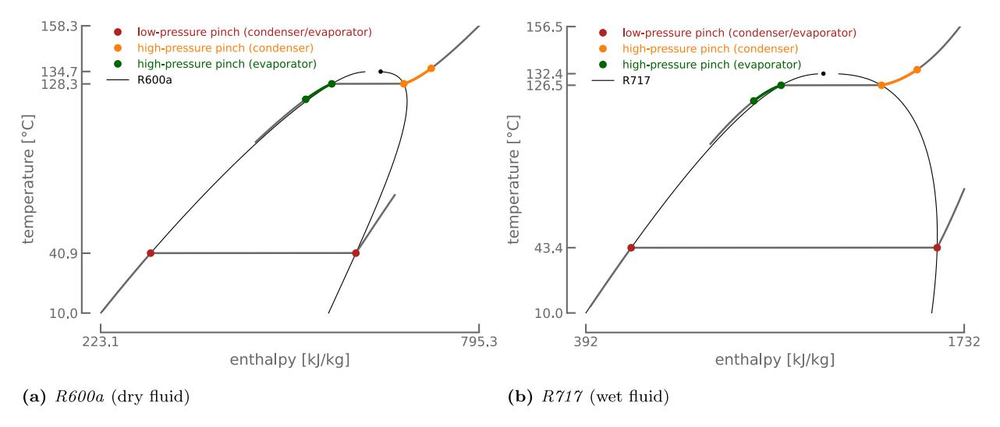

**Fig. A.1.** Temperature-enthalpy diagrams for dry and wet fluids. The closer to the critical point, the less linear the isobars. The red dots indicate the pinch point for low and intermediate pressure heat exchangers. The orange line highlights the zone where the pinch is located in near-critical condensers. The green line highlights the zone where the pinch is located in near-critical evaporators. (For interpretation of the references to colour in this figure legend, the reader is referred to the web version of this article.)

# *A.2. Pressure optimisation in transcritical cycles*

In subcritical heat exchangers, for each heat source or heat sink profile, only one pressure can provide the desired pinch. There is therefore only one solution. In supercritical heat exchangers, things are different. For each heat source or heat sink profile, different pressures can be used to obtain the desired pinch temperature differences, as shown in the temperature-heat diagrams in [Fig.](#page-18-0) [A.3.](#page-18-0) However, these pressures do not produce the same cycle efficiency. We therefore need to find the pressure levels that maximise this efficiency.

In this model, we thus look for the pressures such that both the pinch obtained is the desired one and the efficiency is maximised. There is so an internal optimisation loop, which slows down the code. In addition, the high-pressure exchanger model is the discretised one, which slows it down even more. It should also be noted that this optimisation problem is highly non-linear and discontinuous (e.g., nonphysical solutions). The method developed here works, and is relatively robust, but is fairly slow. It would therefore be interesting to work on the numerical aspects of the model in order to speed it up.

## *A.3. Internal heat exchanger (recuperator)*

The recuperator is modelled here with a constant effectiveness. This is defined as

$$\varepsilon_{HP}^{rec} = \frac{T_{1r} - T_1}{T_3 - T_1} \quad , \tag{A.1}$$

$$\varepsilon_{\text{ORC}}^{\text{rec}} = \frac{T_4 - T_{4r}}{T_4 - T_2} \quad ,$$
(A.2)

following the nomenclature in [Fig.](#page-3-0) [2.](#page-3-0) Note that a check is performed to ensure the pinch temperature difference obtained at the recuperator is equal to or greater than those at the evaporators and condensers.

#### **Appendix B. List of working fluids**

The list of fluids used in this work is given in [Table](#page-19-0) [B.1.](#page-19-0)

Note that some fluids (*in italic*) have a non-zero ODP and/or a very high GWP. Although banned (or being phased out) by the Montreal Protocol, the Kigali Amendment and/or the F-gas regulation (EU), these fluids have been considered for illustrative purposes. In fact, the list of fluids compatible with these regulations and available in CoolProp suffers from a severe gap in the range of critical temperatures between 44.1 ◦C and 91.1 ◦C. Yet, it is specifically this range of critical temperatures that is needed to enable transcritical cycles in our Carnot battery application.

# **Appendix C. Convergence of the method for generating the alternatives**

# *C.1. Convergence of thermodynamic design optimisation*

The performance of the optimisation method for the thermodynamic design of Carnot batteries (introduced in [Fig.](#page-5-0) [3](#page-5-0), and corresponding to the first stage in [Fig.](#page-6-0) [4](#page-6-0)) is depicted in [Fig.](#page-20-0) [C.1](#page-20-0). It analyses the convergence of five runs for optimising a Carnot battery based on subcritical recuperated cycles. The Paretos are captured similarly for each trial, although the extrema are not entirely identical. While the plateau sets in around the 500th generation, disruptions that identify new extrema can occur much later (after *gen. 1500* for trials #2, #4 and #5). This highlights the necessity of running large numbers of generations to ensure convergence. After 1500 generations, all hypervolumes fall to within less than 1% of the maximum value, illustrating the relatively good repeatability of the method. Please note that in addition to the Non-dominated Sorting Genetic Algorithm (NSGA-II), the Multi-Objective Particle Swarm Optimisation (MOPSO) was also tested. However, it did not yield better results (equivalent hypervolume for the same number of generations). Due to the specific nature of the optimisation problem related to the thermodynamic design of Carnot batteries (i.e., highly non-linear and discontinuous), future work could focus on benchmarking different algorithms.

## *C.2. Convergence of near-optimal alternatives generation*

Reporting the hypervolumes for the method generating the nearoptimal alternatives (second stage in [Fig.](#page-6-0) [4](#page-6-0)) is key to discuss its convergence (see [Fig.](#page-21-0) [C.2\(f\)\)](#page-21-0). However, the complexity of the hypervolume calculation algorithm increases with the dimensionality of the Pareto fronts, so the last generations of Trial #1 and #4 could not be reported in [Fig.](#page-21-0) [C.2\(f\)](#page-21-0) (these are 7-dimensional and each contains 250 individuals). To help interpreting the results, [Figs.](#page-21-1) [C.2\(a\)](#page-21-1) to [C.2\(e\)](#page-21-0) also depict the efficiency and density of the alternative designs.

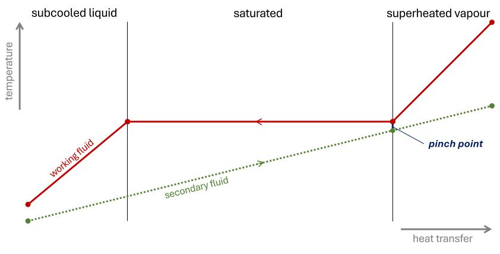

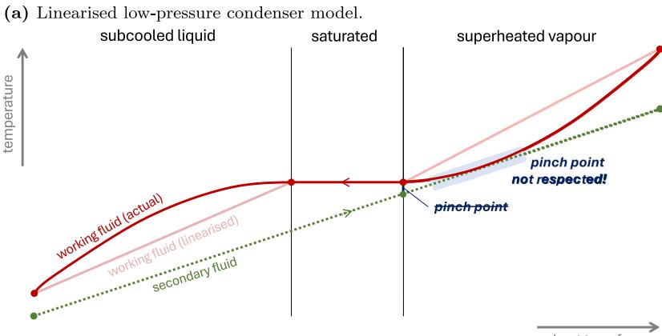

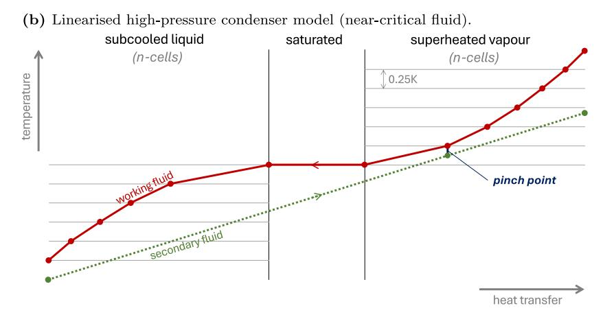

**Fig. A.2.** Schematic representation of the subcritical heat exchanger model on the temperature-heat diagram for a condenser. In the near-critical regime, the isobar becomes highly non-linear, making the model unsuitable for correctly applying the pinch model and potentially violating the Clausius statement. To accurately capture the pinch, the non-linear zones must be discretised with high precision.

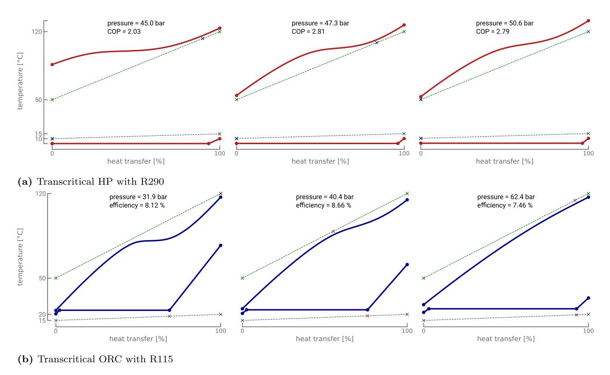

**Fig. A.3.** Temperature-enthalpy diagrams for the low and high pressure heat exchangers of transcritical HP (red) and ORC (blue). The pinch positions are marked by the blue and red crosses. These diagrams illustrate the necessity of optimising the high pressure in transcritical cycles. (For interpretation of the references to colour in this figure legend, the reader is referred to the web version of this article.)

**Table B.1** Technical and physical properties of the investigated working fluids (data from CoolProp 6.4.1 [\[60](#page-23-26)]).

| Fluid                  | Type     | Tcrit ◦C] [ | pcrit [bar] | psat,15 ◦C [bar] | GWP100 | ASHRAE 34b | Shape      | ID |
|------------------------|----------|-------------------|----------------|---------------------|--------|---------------|------------|----|
| R1150 (Ethylene)       | HO       | 9.2               | 50.4           | n.a.                | 6.8    | A3            | wet        | 1  |
| R13c                   |          |                   |                |                     |        |               |            |    |
|                        | CFC      | 28.7              | 38.8           | 28.4                | 14400  | A1            | wet        | 2  |
| R744 (Carbon dioxide)  |          | 31.0              | 73.8           | 50.9                | 1.0    | A1            | wet        | 3  |
| R170 (Ethane)          | HC       | 32.2              | 48.7           | 33.7                | 0.437a | A3            | wet        | 4  |
| R41                    | HFC      | 44.1              | 59.0           | 30.1                | 135a   | N/A           | wet        | 5  |
| R125d                  | HFC      | 66.0              | 36.2           | 10.5                | 3500   | A1            | isentropic | 6  |
| R143ad                 | HFC      | 72.7              | 37.6           | 9.6                 | 4470   | A2L           | wet        | 7  |
| R115c                  | CFC      | 80.0              | 31.3           | 6.9                 | 7370   | A1            | dry        | 8  |
| R1270 (Propylene)      | HO       | 91.1              | 45.6           | 8.9                 | 3.1    | A3            | wet        | 9  |
| R1234yf                | HFO      | 94.7              | 33.8           | 5.1                 | 0.501a | A2L           | dry        | 10 |
| R22c                   | HCFC     | 96.1              | 49.9           | 7.9                 | 1810   | A1            | wet        | 11 |
| R290 (Propane)         | HC       | 96.7              | 42.5           | 7.3                 | 0.02a  | A3            | wet        | 12 |
| R134ad                 | HFC      | 101.1             | 40.6           | 4.9                 | 1430   | A1            | wet        | 13 |
| R227ead                | HFC      | 101.8             | 29.3           | 3.3                 | 3220   | A1            | dry        | 14 |
| R161                   | HFC      | 102.1             | 50.1           | 7.0                 | 4.84a  | N/A           | wet        | 15 |
| R1243zf                | HFO      | 103.8             | 35.2           | 4.4                 | 0.261a | N/A           | isentropic | 16 |
| R1234ze(E)             | HFO      | 109.4             | 36.3           | 3.6                 | 1.37a  | A2L           | isentropic | 17 |
| R12c                   | CFC      | 112.0             | 41.4           | 4.9                 | 10900  | A1            | wet        | 18 |
| R152a                  | HFC      | 113.3             | 45.2           | 4.4                 | 164a   | A2            | wet        | 19 |
| R13I1                  | H        | 123.3             | 39.5           | 3.7                 | 0.4    | A1            | wet        | 20 |
| RC270 (cyclo-Propane)  | HC       | 125.2             | 55.8           | 5.5                 | N/A    | A3            | wet        | 21 |
| RE170 (dimethyl-Ether) | HC       | 127.2             | 53.4           | 4.4                 | 1.0    | A3            | wet        | 22 |
| R717 (Ammonia)         |          | 132.2             | 113.3          | 7.3                 | N/A    | B2L           | wet        | 23 |
| R600a (iso-Butane)     | HC       | 134.7             | 36.3           | 2.6                 | N/A    | A3            | dry        | 24 |
|                        |          |                   |                |                     |        |               |            |    |
| 1-Butene               | HC       | 146.1             | 40.1           | 2.2                 | N/A    | N/A           | dry        | 25 |
| R1234ze(Z)             | HFO      | 150.1             | 35.3           | 1.2                 | 0.315a | A2L           | isentropic | 26 |
| R600 (n-Butane)        | HC       | 152.0             | 38.0           | 1.8                 | 0.006a | A3            | dry        | 27 |
| trans-2-Butene         | HC       | 155.5             | 40.3           | 1.7                 | N/A    | N/A           | dry        | 28 |
| Neopentane             | HC       | 160.6             | 32.0           | 1.2                 | N/A    | N/A           | dry        | 29 |
| R1233zd(E)             | HCFO     | 166.5             | 36.2           | 0.9                 | 3.88a  | A1            | dry        | 30 |
| Novec649               |          | 168.7             | 18.7           | 0.3                 | N/A    | N/A           | dry        | 31 |
| R601a (iso-Pentane)    | HC       | 187.2             | 33.8           | 0.6                 | N/A    | A3            | dry        | 32 |
| R601 (n-Pentane)       | HC       | 196.5             | 33.7           | 0.5                 | N/A    | A3            | dry        | 33 |
| R602 (n-Hexane)        | HC       | 234.7             | 30.4           | 0.1                 | 3.1    | N/A           | dry        | 34 |
| Acetone                |          | 235.0             | 47.0           | 0.2                 | 0.5    | N/A           | isentropic | 35 |
| cyclo-Pentane          | HC       | 238.6             | 45.7           | 0.3                 | N/A    | N/A           | dry        | 36 |
| Methanol               |          | 239.4             | 82.2           | 0.1                 | 2.8    | N/A           | wet        | 37 |
| R603 (n-Heptane)       | HC       | 267.0             | 27.4           | < 0.1               | N/A    | N/A           | dry        | 38 |
| cyclo-Hexane           | HC       | 280.5             | 40.8           | < 0.1               | N/A    | N/A           | dry        | 39 |
| Benzene                | HC       | 288.9             | 48.9           | < 0.1               | N/A    | N/A           | dry        | 40 |
| MDM                    | Siloxane | 290.9             | 14.1           | < 0.1               | N/A    | N/A           | dry        | 41 |
| Toluene                | HC       | 318.6             | 41.3           | < 0.1               | 3.3    | N/A           | dry        | 42 |
|                        |          |                   |                |                     |        |               |            |    |

a Value from Table 7.SM.7 of IPCC AR6 [[82](#page-24-9)]

b ASHRAE Standard 34-2022, 'Designation and Safety Classification of Refrigerants'

c Fluid with non-zero ozone depletion potential and large global warming potential.

d Fluid with large global warming potential.

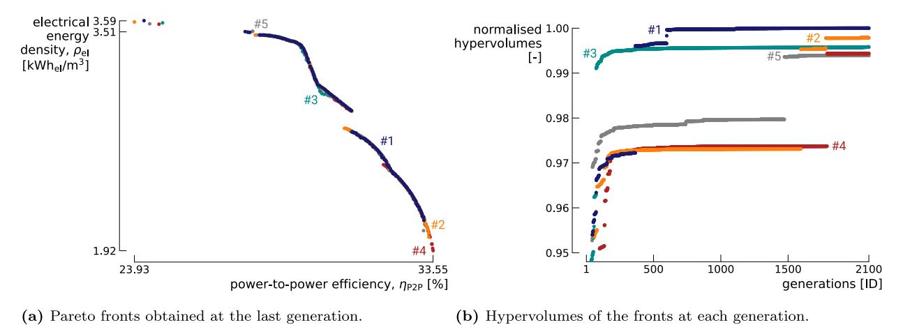

**Fig. C.1.** Analysis of the convergence of the thermodynamic design optimisation method. For repeatability, it is applied to five trials for subcritical recuperated Carnot batteries.

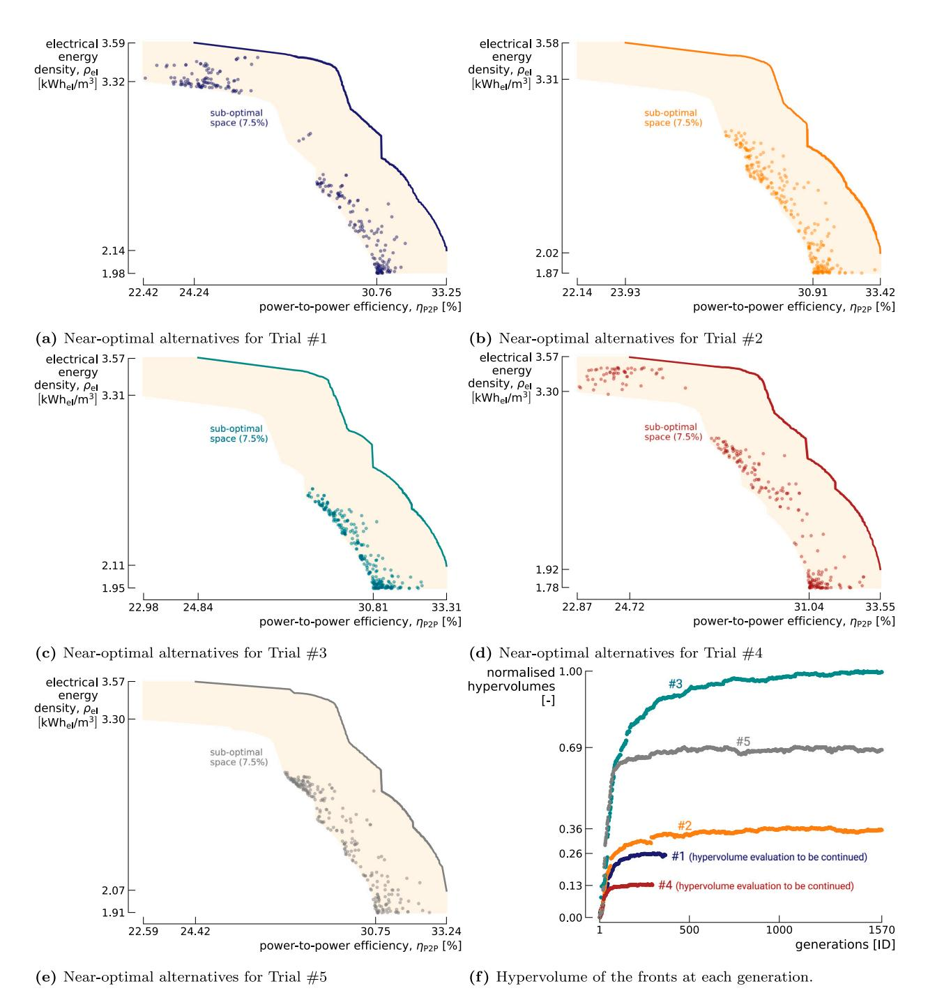

**Fig. C.2.** Analysis of the convergence of the near-optimal alternatives generation method. It is applied to the five trials introduced in [Fig.](#page-20-1) [C.1\(b\).](#page-20-1)

The distribution is far from uniform across the sub-optimal space. Moreover, it varies from one run to another. However, remember that the goal when generating alternatives is not to uniformly cover the sub-optimal space, but rather to maximise the design difference relative to reference points on the Pareto front. The hypervolume varies significantly between runs. Nonetheless, we observe that the more spread out the alternatives are in the sub-optimal space, the lower the hypervolume. Conversely, higher hypervolumes correspond to more clustered alternatives. All points tend to converge towards a design that maximises the Euclidean distance from a reference point. Therefore, when aiming to minimise the storage temperature instead of maximise it, only solutions with high efficiency remain viable (density is more sensitive to this parameter, see [Fig.](#page-11-0) [9\)](#page-11-0). This suggests that beyond differences from one trial to the other, the method does not guarantee diversity among solutions and thus deserves improvement. It must be noted, however, that the hypervolumes corresponding to the different trials reported in [Fig.](#page-21-2) [C.2](#page-21-2) should be interpreted with caution. Indeed, in light of the optimisation objectives introduced in Section [2.2.2](#page-5-2) (see [Fig.](#page-6-0) [4](#page-6-0)), the goal is not to maximise an absolute quantity, but rather a relative one—specifically, the difference between the design variables of the individual being evaluated and those of the most similar reference individual. As these reference individuals may vary from one trial to another, the resulting hypervolumes can also differ accordingly. Therefore, to enable a more robust and meaningful benchmark, future work could focus on identifying more suitable indicators for convergence analysis.

#### **Data availability**

Data will be made available on request.

## **References**

- [1] B. Pickering, F. Lombardi, S. Pfenninger, Diversity of options to eliminate fossil fuels and reach carbon neutrality across the entire European energy system, Joule 6 (6) (2022) 1253–1276, <http://dx.doi.org/10.1016/j.joule.2022.05.009>.
- [2] O. Dumont, G.F. Frate, A. Pillai, S. Lecompte, M. De Paepe, V. Lemort, Carnot battery technology: A state-of-the-art review, J. Energy Storage 32 (2020) [http:](http://dx.doi.org/10.1016/j.est.2020.101756) [//dx.doi.org/10.1016/j.est.2020.101756](http://dx.doi.org/10.1016/j.est.2020.101756).
- [3] F. Nitsch, M. Wetzel, H.C. Gils, K. Nienhaus, The future role of carnot batteries in central europe: combining energy system and market perspective, J. Energy Storage 85 (2024) 110959, [http://dx.doi.org/10.1016/j.est.2024.110959.](http://dx.doi.org/10.1016/j.est.2024.110959)
- [4] V. Novotny, V. Basta, P. Smola, J. Spale, Review of carnot battery technology commercial development, Energies 15 (2) (2022) 647, [http://dx.doi.org/10.](http://dx.doi.org/10.3390/en15020647) [3390/en15020647](http://dx.doi.org/10.3390/en15020647).
- [5] H. Jockenhöfer, W.-D. Steinmann, D. Bauer, Detailed numerical investigation of a pumped thermal energy storage with low temperature heat integration, Energy 145 (2018) 665–676, <http://dx.doi.org/10.1016/j.energy.2017.12.087>.
- [6] D. Roskosch, V. Venzik, B. Atakan, Potential analysis of pumped heat electricity storages regarding thermodynamic efficiency, ORC in Renewable Energy Systems, ORC 2017 Special Issue, Renew. Energy 147 (2020) 2865–2873, [http://dx.doi.](http://dx.doi.org/10.1016/j.renene.2018.09.023) [org/10.1016/j.renene.2018.09.023.](http://dx.doi.org/10.1016/j.renene.2018.09.023)
- [7] A. Vecchi, K. Knobloch, T. Liang, H. Kildahl, A. Sciacovelli, K. Engelbrecht, Y. Li, Y. Ding, Carnot battery development: A review on system performance, applications and commercial state-of-the-art, J. Energy Storage 55 (2022) 105782, <http://dx.doi.org/10.1016/j.est.2022.105782>.
- [8] G.F. Frate, L. Ferrari, P. Sdringola, U. Desideri, A. Sciacovelli, Thermally integrated pumped thermal energy storage for multi-energy districts: integrated modelling, assessment and comparison with batteries, J. Energy Storage 61 (2023) 106734, <http://dx.doi.org/10.1016/j.est.2023.106734>.
- [9] C. Poletto, O. Dumont, A. De Pascale, V. Lemort, S. Ottaviano, O. Thomé, Control strategy and performance of a small-size thermally integrated carnot battery based on a rankine cycle and combined with district heating, Energy Convers. Manage. 302 (2024) 118111, [http://dx.doi.org/10.1016/j.enconman.](http://dx.doi.org/10.1016/j.enconman.2024.118111) [2024.118111](http://dx.doi.org/10.1016/j.enconman.2024.118111).
- [10] A. Laterre, G.F. Frate, V. Lemort, F. Contino, Carnot batteries for integrated heat and power management in residential applications: A techno-economic analysis, Energy Convers. Manage. 325 (2025) 119207, [http://dx.doi.org/10.](http://dx.doi.org/10.1016/j.enconman.2024.119207) [1016/j.enconman.2024.119207](http://dx.doi.org/10.1016/j.enconman.2024.119207).

- [11] C. Poletto, A.D. Pascale, S. Ottaviano, O. Dumont, L. Branchini, Techno-economic assessment of a carnot battery thermally integrated with a data center, Appl. Therm. Eng. 260 (2025) 124952, [http://dx.doi.org/10.1016/j.applthermaleng.](http://dx.doi.org/10.1016/j.applthermaleng.2024.124952) [2024.124952](http://dx.doi.org/10.1016/j.applthermaleng.2024.124952).
- [12] S. Hu, Z. Yang, J. Li, Y. Duan, Thermo-economic analysis of the pumped thermal energy storage with thermal integration in different application scenarios, Energy Convers. Manage. 236 (2021) 114072, [http://dx.doi.org/10.1016/j.enconman.](http://dx.doi.org/10.1016/j.enconman.2021.114072) [2021.114072](http://dx.doi.org/10.1016/j.enconman.2021.114072).
- [13] R. Tassenoy, K. Couvreur, W. Beyne, M. De Paepe, S. Lecompte, Techno-economic assessment of carnot batteries for load-shifting of solar PV production of an office building, Renew. Energy 199 (2022) 1133–1144, [http://dx.doi.org/10.1016/j.](http://dx.doi.org/10.1016/j.renene.2022.09.039) [renene.2022.09.039](http://dx.doi.org/10.1016/j.renene.2022.09.039).
- [14] H.N. Wang, X.J. Xue, C.Y. Zhao, Performance analysis on combined energy supply system based on carnot battery with packed-bed thermal energy storage, Renew. Energy 228 (2024) 120702, [http://dx.doi.org/10.1016/j.renene.2024.](http://dx.doi.org/10.1016/j.renene.2024.120702) [120702](http://dx.doi.org/10.1016/j.renene.2024.120702).
- [15] H. Zhang, L. Wang, X. Lin, H. Chen, Combined cooling, heating, and power generation performance of pumped thermal electricity storage system based on brayton cycle, Appl. Energy 278 (2020) 115607, [http://dx.doi.org/10.1016/j.](http://dx.doi.org/10.1016/j.apenergy.2020.115607) [apenergy.2020.115607.](http://dx.doi.org/10.1016/j.apenergy.2020.115607)
- [16] A.S. Alsagri, An innovative design of solar-assisted carnot battery for multigeneration of power, cooling, and process heating: techno-economic analysis and optimization, Renew. Energy 210 (2023) 375–385, [http://dx.doi.org/10.1016/j.](http://dx.doi.org/10.1016/j.renene.2023.04.017) [renene.2023.04.017](http://dx.doi.org/10.1016/j.renene.2023.04.017).
- [17] B. Guo, V. Lemort, A. Cendoya, Hybridized Design and Control Strategies of Reversible Hp/Orc-Based Carnot Battery and Electrical Battery for a Small-Scale Family Farm: Techno-Economic Optimization and Energetic-Economic-Environmental-Adaptable Evaluation, Social Science Research Network, Rochester, NY, 2025, [http://dx.doi.org/10.2139/ssrn.5174548,](http://dx.doi.org/10.2139/ssrn.5174548) [arXiv:](http://arxiv.org/abs/5174548) [5174548.](http://arxiv.org/abs/5174548)
- [18] P. Sorknæ s, J.Z. Thellufsen, K. Knobloch, K. Engelbrecht, M. Yuan, Economic potentials of carnot batteries in 100% renewable energy systems, Energy 282 (2023) 128837, <http://dx.doi.org/10.1016/j.energy.2023.128837>.
- [19] M. Mercangöz, J. Hemrle, L. Kaufmann, A. Z'Graggen, C. Ohler, Electrothermal energy storage with transcritical CO2 cycles, Energy 45 (1) (2012) 407–415, [http://dx.doi.org/10.1016/j.energy.2012.03.013.](http://dx.doi.org/10.1016/j.energy.2012.03.013)
- [20] G.F. Frate, L. Ferrari, U. Desideri, Multi-criteria economic analysis of a pumped thermal electricity storage (PTES) with thermal integration, Front. Energy Res. 8 (2020) 53, [http://dx.doi.org/10.3389/fenrg.2020.00053.](http://dx.doi.org/10.3389/fenrg.2020.00053)
- [21] G.F. Frate, L. Ferrari, U. Desideri, Rankine carnot batteries with the integration of thermal energy sources: a review, Energies 13 (18) (2020) 4766, [http://dx.](http://dx.doi.org/10.3390/en13184766) [doi.org/10.3390/en13184766.](http://dx.doi.org/10.3390/en13184766)
- [22] R. Fan, H. Xi, Energy, exergy, economic (3E) analysis, optimization and comparison of different carnot battery systems for energy storage, Energy Convers. Manage. 252 (2022) 115037, [http://dx.doi.org/10.1016/j.enconman.](http://dx.doi.org/10.1016/j.enconman.2021.115037) [2021.115037](http://dx.doi.org/10.1016/j.enconman.2021.115037).
- [23] I. Silva, M. Santos, J.B. Ribeiro, Multi-objective optimization and design of a carnot battery for energy storage applications, Energy Convers. Manag.: X 27 (2025) 101065, <http://dx.doi.org/10.1016/j.ecmx.2025.101065>.
- [24] J.D. McTigue, P. Farres-Antunez, K.S. J, C.N. Markides, A.J. White, Technoeconomic analysis of recuperated joule-brayton pumped thermal energy storage, Energy Convers. Manage. 252 (2022) 115016, [http://dx.doi.org/10.1016/j.](http://dx.doi.org/10.1016/j.enconman.2021.115016) [enconman.2021.115016](http://dx.doi.org/10.1016/j.enconman.2021.115016).
- [25] D. Coppitters, F. Contino, Optimizing upside variability and antifragility in renewable energy system design, Sci. Rep. 13 (1) (2023) 9138, [http://dx.doi.](http://dx.doi.org/10.1038/s41598-023-36379-8) [org/10.1038/s41598-023-36379-8.](http://dx.doi.org/10.1038/s41598-023-36379-8)
- [26] H. Zhang, L. Wang, X. Lin, H. Chen, Parametric optimisation and thermoeconomic analysis of joule–brayton cycle-based pumped thermal electricity storage system under various charging–discharging periods, Energy 263 (2023) 125908, [http://dx.doi.org/10.1016/j.energy.2022.125908.](http://dx.doi.org/10.1016/j.energy.2022.125908)
- [27] D. Coppitters, W. De Paepe, F. Contino, Surrogate-assisted robust design optimization and global sensitivity analysis of a directly coupled photovoltaicelectrolyzer system under techno-economic uncertainty, Appl. Energy 248 (2019) 310–320, [http://dx.doi.org/10.1016/j.apenergy.2019.04.101.](http://dx.doi.org/10.1016/j.apenergy.2019.04.101)
- [28] D. Coppitters, W. De Paepe, F. Contino, Robust design optimization and stochastic performance analysis of a grid-connected photovoltaic system with battery storage and hydrogen storage, Energy 213 (2020) 118798, [http://dx.doi.org/10.](http://dx.doi.org/10.1016/j.energy.2020.118798) [1016/j.energy.2020.118798](http://dx.doi.org/10.1016/j.energy.2020.118798).
- [29] S. Moret, V. Codina Gironès, M. Bierlaire, F. Maréchal, Characterization of input uncertainties in strategic energy planning models, Appl. Energy 202 (2017) 597–617, [http://dx.doi.org/10.1016/j.apenergy.2017.05.106.](http://dx.doi.org/10.1016/j.apenergy.2017.05.106)
- [30] E. Trutnevyte, Does cost optimization approximate the real-world energy transition? Energy 106 (2016) 182–193, [http://dx.doi.org/10.1016/j.energy.2016.03.](http://dx.doi.org/10.1016/j.energy.2016.03.038) [038](http://dx.doi.org/10.1016/j.energy.2016.03.038).

- [31] P. Voll, M. Jennings, M. Hennen, N. Shah, A. Bardow, The optimum is not enough: A near-optimal solution paradigm for energy systems synthesis, Energy 82 (2015) 446–456, [http://dx.doi.org/10.1016/j.energy.2015.01.055.](http://dx.doi.org/10.1016/j.energy.2015.01.055)
- [32] J.F. DeCarolis, S. Babaee, B. Li, S. Kanungo, Modelling to generate alternatives with an energy system optimization model, Environ. Model. Softw. 79 (2016) 300–310, <http://dx.doi.org/10.1016/j.envsoft.2015.11.019>.
- [33] K. Ökten, B. Kurşun, Thermo-economic assessment of a thermally integrated pumped thermal energy storage (TI-PTES) system combined with an absorption refrigeration cycle driven by low-grade heat source, J. Energy Storage 51 (2022) 104486, <http://dx.doi.org/10.1016/j.est.2022.104486>.
- [34] Y. Jiang, W. Su, C. Wu, S. Wang, Enhanced thermally integrated carnot battery using low-GWP working fluid pair: multi-aspect analysis and multiscale optimization, Appl. Energy 376 (2024) 124226, [http://dx.doi.org/10.1016/](http://dx.doi.org/10.1016/j.apenergy.2024.124226) [j.apenergy.2024.124226.](http://dx.doi.org/10.1016/j.apenergy.2024.124226)
- [35] M. Weitzer, D. Müller, D. Steger, A. Charalampidis, S. Karellas, J. Karl, Organic flash cycles in rankine-based carnot batteries with large storage temperature spreads, Energy Convers. Manage. 255 (2022) 115323, [http://dx.doi.org/10.](http://dx.doi.org/10.1016/j.enconman.2022.115323) [1016/j.enconman.2022.115323](http://dx.doi.org/10.1016/j.enconman.2022.115323).
- [36] O. Dumont, V. Lemort, Mapping of performance of pumped thermal energy storage (carnot battery) using waste heat recovery, Energy 211 (2020) 118963, [http://dx.doi.org/10.1016/j.energy.2020.118963.](http://dx.doi.org/10.1016/j.energy.2020.118963)
- [37] G.F. Frate, L. Ferrari, U. Desideri, Multi-criteria investigation of a pumped thermal electricity storage (PTES) system with thermal integration and sensible heat storage, Energy Convers. Manage. 208 (2020) 112530, [http://dx.doi.org/](http://dx.doi.org/10.1016/j.enconman.2020.112530) [10.1016/j.enconman.2020.112530](http://dx.doi.org/10.1016/j.enconman.2020.112530).
- [38] B. Eppinger, D. Steger, C. Regensburger, J. Karl, E. Schlücker, S. Will, Carnot battery: simulation and design of a reversible heat pump-organic rankine cycle pilot plant, Appl. Energy 288 (2021) 116650, [http://dx.doi.org/10.1016/](http://dx.doi.org/10.1016/j.apenergy.2021.116650) [j.apenergy.2021.116650.](http://dx.doi.org/10.1016/j.apenergy.2021.116650)
- [39] D. Fioriti, G. Lutzemberger, D. Poli, P. Duenas-Martinez, A. Micangeli, Coupling economic multi-objective optimization and multiple design options: A business-oriented approach to size an off-grid hybrid microgrid, Int. J. Electr. Power Energy Syst. 127 (2021) 106686, [http://dx.doi.org/10.1016/j.ijepes.2020.](http://dx.doi.org/10.1016/j.ijepes.2020.106686) [106686](http://dx.doi.org/10.1016/j.ijepes.2020.106686).
- [40] J. Finke, F. Kachirayil, R. McKenna, V. Bertsch, Modelling to generate near-Pareto-optimal alternatives (MGPA) for the municipal energy transition, Appl. Energy 376 (2024) 124126, [http://dx.doi.org/10.1016/j.apenergy.2024.124126.](http://dx.doi.org/10.1016/j.apenergy.2024.124126)
- [41] F. Lombardi, S. Pfenninger, Human-in-the-loop MGA to generate energy system design options matching stakeholder needs, PLOS Clim. 4 (2) (2025) e0000560, <http://dx.doi.org/10.1371/journal.pclm.0000560>.
- [42] Z. Su, L. Yang, J. Song, X. Jin, X. Wu, X. Li, Multi-dimensional comparison and multi-objective optimization of geothermal-assisted carnot battery for photovoltaic load shifting, Energy Convers. Manage. 289 (2023) 117156, [http:](http://dx.doi.org/10.1016/j.enconman.2023.117156) [//dx.doi.org/10.1016/j.enconman.2023.117156](http://dx.doi.org/10.1016/j.enconman.2023.117156).
- [43] X.J. Xue, Y. Zhao, C.Y. Zhao, Multi-criteria thermodynamic analysis of pumpedthermal electricity storage with thermal integration and application in electric peak shaving of coal-fired power plant, Energy Convers. Manage. 258 (2022) 115502, [http://dx.doi.org/10.1016/j.enconman.2022.115502.](http://dx.doi.org/10.1016/j.enconman.2022.115502)
- [44] P. Lu, X. Luo, J. Wang, J. Chen, Y. Liang, Z. Yang, J. He, C. Wang, Y. Chen, Thermodynamic analysis and evaluation of a novel composition adjustable carnot battery under variable operating scenarios, Energy Convers. Manage. 269 (2022) 116117, [http://dx.doi.org/10.1016/j.enconman.2022.116117.](http://dx.doi.org/10.1016/j.enconman.2022.116117)
- [45] Y. Zhang, L. Xu, J. Li, L. Zhang, Z. Yuan, Technical and economic evaluation, comparison and optimization of a carnot battery with two different layouts, J. Energy Storage 55 (2022) 105583, [http://dx.doi.org/10.1016/j.est.2022.105583.](http://dx.doi.org/10.1016/j.est.2022.105583)
- [46] A. Gaur, A.K.M.K. Talukder, K. Deb, S. Tiwari, S. Xu, D. Jones, Finding nearoptimum and diverse solutions for a large-scale engineering design problem, in: 2017 IEEE Symposium Series on Computational Intelligence (SSCI), 2017, pp. 1–8, <http://dx.doi.org/10.1109/SSCI.2017.8285271>.
- [47] K. Deb, H. Jain, An evolutionary many-objective optimization algorithm using reference-point-based nondominated sorting approach, part i: solving problems with box constraints, IEEE Trans. Evol. Comput. 18 (4) (2014) 577–601, [http:](http://dx.doi.org/10.1109/TEVC.2013.2281535) [//dx.doi.org/10.1109/TEVC.2013.2281535.](http://dx.doi.org/10.1109/TEVC.2013.2281535)
- [48] E. Vieren, T. Demeester, W. Beyne, M. Pihl Andersen, B. Elmegaard, A. Arteconi, M. de Paepe, S. Lecompte, Selection of pure and binary working fluids for hightemperature heat pumps: A financial approach, Appl. Therm. Eng. 252 (2024) 123615, [http://dx.doi.org/10.1016/j.applthermaleng.2024.123615.](http://dx.doi.org/10.1016/j.applthermaleng.2024.123615)
- [49] H. Abedini, E. Vieren, T. Demeester, W. Beyne, S. Lecompte, S. Quoilin, A. Arteconi, A comprehensive analysis of binary mixtures as working fluid in high temperature heat pumps, Energy Convers. Manage. 277 (2023) 116652, [http://dx.doi.org/10.1016/j.enconman.2022.116652.](http://dx.doi.org/10.1016/j.enconman.2022.116652)
- [50] J. Song, P. Loo, J. Teo, C.N. Markides, Thermo-economic optimization of organic rankine cycle (ORC) systems for geothermal power generation: a comparative study of system configurations, Front. Energy Res. 8 (2020) [http://dx.doi.org/](http://dx.doi.org/10.3389/fenrg.2020.00006) [10.3389/fenrg.2020.00006.](http://dx.doi.org/10.3389/fenrg.2020.00006)

- [51] S. Staub, P. Bazan, K. Braimakis, D. Müller, C. Regensburger, D. Scharrer, B. Schmitt, D. Steger, R. German, S. Karellas, M. Pruckner, E. Schlücker, S. Will, J. Karl, Reversible heat pump–organic rankine cycle systems for the storage of renewable electricity, Energies 11 (6) (2018) 1352, [http://dx.doi.org/10.3390/](http://dx.doi.org/10.3390/en11061352) [en11061352](http://dx.doi.org/10.3390/en11061352).
- [52] B. Eppinger, L. Zigan, J. Karl, S. Will, Pumped thermal energy storage with heat pump-ORC-systems: comparison of latent and sensible thermal storages for various fluids, Appl. Energy 280 (2020) 115940, [http://dx.doi.org/10.1016/j.](http://dx.doi.org/10.1016/j.apenergy.2020.115940) [apenergy.2020.115940.](http://dx.doi.org/10.1016/j.apenergy.2020.115940)
- [53] Y. Kim, C. Kim, D. Favrat, Transcritical or supercritical CO2 cycles using both low- and high-temperature heat sources, Energy 43 (1) (2012) 402–415, [http:](http://dx.doi.org/10.1016/j.energy.2012.03.076) [//dx.doi.org/10.1016/j.energy.2012.03.076](http://dx.doi.org/10.1016/j.energy.2012.03.076).
- [54] M. Morandin, F. Maréchal, M. Mercangöz, F. Buchter, Conceptual design of a thermo-electrical energy storage system based on heat integration of thermodynamic cycles – part a: methodology and base case, Energy 45 (1) (2012) 375–385, <http://dx.doi.org/10.1016/j.energy.2012.03.031>.
- [55] E. Vieren, T. Demeester, W. Beyne, A. Arteconi, M. De Paepe, S. Lecompte, The thermodynamic potential of high-temperature transcritical heat pump cycles for industrial processes with large temperature glides, Appl. Therm. Eng. 234 (2023) 121197, [http://dx.doi.org/10.1016/j.applthermaleng.2023.121197.](http://dx.doi.org/10.1016/j.applthermaleng.2023.121197)
- [56] A. Habibollahzade, K.J. Petersen, M. Aliahmadi, I. Fakhari, J.R. Brinkerhoff, Comparative thermoeconomic analysis of geothermal energy recovery via super/transcritical CO2*<*math*><*mrow is="true"*><*msub is="true"*><*mrow is="true"*><*mi mathvariant="normal" is="true"*>*CO*<*/Mi*><*/Mrow*><*mrow is="true"*><*mn is="true"*>*2*<*/mn*><*/mrow*><*/msub*><*/mrow*><*/math*>* and subcritical organic rankine cycles, Energy Convers. Manage. 251 (2022) 115008, [http://dx.doi.org/10.1016/j.enconman.2021.115008.](http://dx.doi.org/10.1016/j.enconman.2021.115008)
- [57] A. Koen, P. Farres-Antunez, J. Macnaghten, A. White, A low-temperature glide cycle for pumped thermal energy storage, J. Energy Storage 42 (2021) 103038, <http://dx.doi.org/10.1016/j.est.2021.103038>.
- [58] T. Zhou, L. Shi, X. Sun, M. Zhang, Y. Zhang, Y. Yao, Z. Pan, Q. Hu, Z. Jiang, H. Tian, G. Shu, Performance enhancement of thermal-integrated carnot battery through zeotropic mixtures, Energy 311 (2024) 133328, [http://dx.doi.org/10.](http://dx.doi.org/10.1016/j.energy.2024.133328) [1016/j.energy.2024.133328](http://dx.doi.org/10.1016/j.energy.2024.133328).
- [59] A. Laterre, O. Dumont, V. Lemort, F. Contino, Extended mapping and systematic optimisation of the carnot battery trilemma for sub-critical cycles with thermal integration, Energy 304 (2024) 132006, [http://dx.doi.org/10.1016/j.energy.](http://dx.doi.org/10.1016/j.energy.2024.132006) [2024.132006](http://dx.doi.org/10.1016/j.energy.2024.132006).
- [60] I.H. Bell, J. Wronski, S. Quoilin, V. Lemort, Pure and [pseudo-pure](http://refhub.elsevier.com/S2352-152X(25)03363-8/sb60) fluid thermophysical property evaluation and the open-source [thermophysical](http://refhub.elsevier.com/S2352-152X(25)03363-8/sb60) property library CoolProp, Ind. Eng. Chem. Res. 53 (6) (2014) [2498–2508.](http://refhub.elsevier.com/S2352-152X(25)03363-8/sb60)
- [61] S. Quoilin, S. Declaye, B.F. Tchanche, V. Lemort, Thermo-economic optimization of waste heat recovery organic rankine cycles, Appl. Therm. Eng. 31 (14) (2011) 2885–2893, <http://dx.doi.org/10.1016/j.applthermaleng.2011.05.014>.
- [62] S. Quoilin, M.V.D. Broek, S. Declaye, P. Dewallef, V. Lemort, Techno-economic survey of organic rankine cycle (ORC) systems, Renew. Sustain. Energy Rev. 22 (2013) 168–186, <http://dx.doi.org/10.1016/j.rser.2013.01.028>.
- [63] M. Rampanelli, [Optimisation](http://refhub.elsevier.com/S2352-152X(25)03363-8/sb63) of Fluid Mixtures for Zeotropic Cycles in Carnot Batteries with Sensible Heat Storage, Université [catholique](http://refhub.elsevier.com/S2352-152X(25)03363-8/sb63) de Louvain, [Louvain-la-Neuve,](http://refhub.elsevier.com/S2352-152X(25)03363-8/sb63) 2025.
- [64] G.F. Frate, L. Ferrari, U. Desideri, Analysis of suitability ranges of high temperature heat pump working fluids, Appl. Therm. Eng. 150 (2019) 628–640, <http://dx.doi.org/10.1016/j.applthermaleng.2019.01.034>.
- [65] X. van Heule, M. De Paepe, S. Lecompte, Two-phase volumetric expanders: a review of the state-of-the-art, Energies 15 (14) (2022) 4991, [http://dx.doi.org/](http://dx.doi.org/10.3390/en15144991) [10.3390/en15144991](http://dx.doi.org/10.3390/en15144991).
- [66] K. Deb, A. Pratap, S. Agarwal, T. Meyarivan, A fast and elitist multiobjective genetic algorithm: NSGA-II, IEEE Trans. Evol. Comput. 6 (2) (2002) 182–197, <http://dx.doi.org/10.1109/4235.996017>.
- [67] D. Coppitters, P. Tsirikoglou, W.D. Paepe, K. Kyprianidis, A. Kalfas, F. Contino, RHEIA: robust design optimization of renewable hydrogen and derived energy carrier systems, J. Open Source Softw. 7 (75) (2022) 4370, [http://dx.doi.org/](http://dx.doi.org/10.21105/joss.04370) [10.21105/joss.04370.](http://dx.doi.org/10.21105/joss.04370)
- [68] L. Pan, H. Wang, W. Shi, Performance analysis in near-critical conditions of organic rankine cycle, 7th Biennial International Workshop ''Advances in Energy Studies'', Energy 37 (1) (2012) 281–286, [http://dx.doi.org/10.1016/j.energy.](http://dx.doi.org/10.1016/j.energy.2011.11.033) [2011.11.033](http://dx.doi.org/10.1016/j.energy.2011.11.033).
- [69] Y. Wang, X. Ding, L. Tang, Y. Weng, Effect of evaporation temperature on the performance of organic rankine cycle in near-critical condition, J. Energy Resour. Technol. 138 (3) (2016) 032001, <http://dx.doi.org/10.1115/1.4032238>.
- [70] J.A. White, S. Velasco, Characterizing wet and dry fluids in temperature-entropy diagrams, Energy 154 (2018) 269–276, [http://dx.doi.org/10.1016/j.energy.2018.](http://dx.doi.org/10.1016/j.energy.2018.04.105) [04.105](http://dx.doi.org/10.1016/j.energy.2018.04.105).
- [71] S. Quoilin, [Sustainable](http://refhub.elsevier.com/S2352-152X(25)03363-8/sb71) Energy Conversion Through the Use of Organic Rankine Cycles for Waste Heat Recovery and Solar [Applications](http://refhub.elsevier.com/S2352-152X(25)03363-8/sb71) (Ph.D. thesis), University of [Liège,](http://refhub.elsevier.com/S2352-152X(25)03363-8/sb71) Liège, 2011.

- [72] J.-F. Oudkerk, S. Quoilin, S. Declaye, L. Guillaume, E. Winandy, V. Lemort, Evaluation of the energy performance of an organic rankine cycle-based micro combined heat and power system involving a hermetic scroll expander, J. Eng. Gas Turbines Power 135 (042306) (2013) [http://dx.doi.org/10.1115/1.4023116.](http://dx.doi.org/10.1115/1.4023116)
- [73] D. Maraver, J. Royo, V. Lemort, S. Quoilin, Systematic optimization of subcritical and transcritical organic rankine cycles (ORCs) constrained by technical parameters in multiple applications, Appl. Energy 117 (2014) 11–29, [http:](http://dx.doi.org/10.1016/j.apenergy.2013.11.076) [//dx.doi.org/10.1016/j.apenergy.2013.11.076](http://dx.doi.org/10.1016/j.apenergy.2013.11.076).
- [74] M. Pitarch, E. Hervas-Blasco, E. Navarro-Peris, J. Gonzálvez-Maciá, J.M. Corberán, Evaluation of optimal subcooling in subcritical heat pump systems, Int. J. Refrig. 78 (2017) 18–31, [http://dx.doi.org/10.1016/j.ijrefrig.2017.03.015.](http://dx.doi.org/10.1016/j.ijrefrig.2017.03.015)
- [75] F.M. Tello-Oquendo, E. Navarro-Peris, J. Gonzálvez-Maciá, Comparison of the performance of a vapor-injection scroll compressor and a two-stage scroll compressor working with high pressure ratios, Appl. Therm. Eng. 160 (2019) 114023, [http://dx.doi.org/10.1016/j.applthermaleng.2019.114023.](http://dx.doi.org/10.1016/j.applthermaleng.2019.114023)
- [76] M. Kane, D. Cretegny, J. Maquet, D. Favrat, The htscroll project - [innovative](http://refhub.elsevier.com/S2352-152X(25)03363-8/sb76) cogeneration system with a [high-temperature](http://refhub.elsevier.com/S2352-152X(25)03363-8/sb76) turbine; projet htscroll. Nouveau systeme de [cogeneration](http://refhub.elsevier.com/S2352-152X(25)03363-8/sb76) a turbine spirale haute temperature - rapport final, [2009.](http://refhub.elsevier.com/S2352-152X(25)03363-8/sb76)
- [77] R. Dickes, Design and [Fabrication](http://refhub.elsevier.com/S2352-152X(25)03363-8/sb77) of a Variable Wall Thickness Two-Stage Scroll Expander to Be Integrated in a [Micro-Solar](http://refhub.elsevier.com/S2352-152X(25)03363-8/sb77) Power Plant, ULiège - Université de [Liège,](http://refhub.elsevier.com/S2352-152X(25)03363-8/sb77) 2013.

- [78] D. Manolakos, G. Kosmadakis, E. Ntavou, B. Tchanche, Test results for characterizing two in-series scroll expanders within a low-temperature ORC unit under partial heat load, Appl. Therm. Eng. 163 (2019) 114389, [http://dx.doi.org/10.](http://dx.doi.org/10.1016/j.applthermaleng.2019.114389) [1016/j.applthermaleng.2019.114389.](http://dx.doi.org/10.1016/j.applthermaleng.2019.114389)
- [79] C. Arpagaus, F. Bless, M. Uhlmann, J. Schiffmann, S.S. Bertsch, High temperature heat pumps: market overview, state of the art, research status, refrigerants, and application potentials, Energy 152 (2018) 985–1010, [http://dx.doi.org/10.1016/](http://dx.doi.org/10.1016/j.energy.2018.03.166) [j.energy.2018.03.166.](http://dx.doi.org/10.1016/j.energy.2018.03.166)
- [80] M. Pitarch, E. Navarro-Peris, J. Gonzálvez-Maciá, J.M. Corberán, Experimental study of a subcritical heat pump booster for sanitary hot water production using a subcooler in order to enhance the efficiency of the system with a natural refrigerant (r290), Int. J. Refrig. 73 (2017) 226–234, [http://dx.doi.org/10.1016/](http://dx.doi.org/10.1016/j.ijrefrig.2016.08.017) [j.ijrefrig.2016.08.017](http://dx.doi.org/10.1016/j.ijrefrig.2016.08.017).
- [81] M. Pitarch I. Mocholí, High Capacity Heat Pump Development for Sanitary Hot Water Production (Ph.D. thesis), Universitat Politècnica de València, Valencia (Spain), 2017, [http://dx.doi.org/10.4995/Thesis/10251/81858.](http://dx.doi.org/10.4995/Thesis/10251/81858)
- [82] C. Smith, Z. Nicholls, K. Armour, W. Collins, P. Forster, M. [Meinshausen,](http://refhub.elsevier.com/S2352-152X(25)03363-8/sb82) M. Palmer, M. [Watanabe,](http://refhub.elsevier.com/S2352-152X(25)03363-8/sb82) The earth's energy budget, climate feedbacks, and climate sensitivity supplementary material, in: V. [Masson-Delmotte,](http://refhub.elsevier.com/S2352-152X(25)03363-8/sb82) P. Zhai, A. Pirani, S. Connors, C. Péan, S. Berger, N. Caud, Y. Chen, L. [Goldfarb,](http://refhub.elsevier.com/S2352-152X(25)03363-8/sb82) M. Gomis, M. Huang, K. Leitzell, E. Lonnoy, J. Matthews, T. Maycock, T. [Waterfield,](http://refhub.elsevier.com/S2352-152X(25)03363-8/sb82) O. Yelek¸ci, R. Yu, B. Zhou (Eds.), Climate Change 2021: the Physical Science Basis. [Contribution](http://refhub.elsevier.com/S2352-152X(25)03363-8/sb82) of Working Group I To the Sixth Assessment Report of the [Intergovernmental](http://refhub.elsevier.com/S2352-152X(25)03363-8/sb82) Panel on Climate [Change,](http://refhub.elsevier.com/S2352-152X(25)03363-8/sb82) 2021.