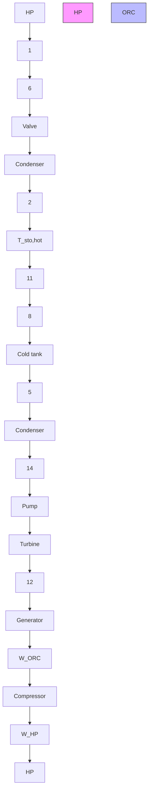
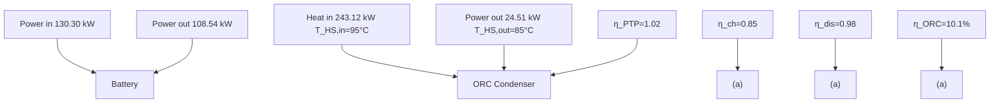

Research Paper

# Optimal heat storage temperature and performance of ORC-based Carnot battery at various application scenarios


Jian Li a,b,\* , Xu Chen a , Jun Shen a,1, Yunfei Zhang a , Danyang Liu a

a School of Mechanical Engineering, Beijing Institute of Technology, Beijing 100081, PR China

b State Key Laboratory of Power System Operation and Control, Tsinghua University, Beijing 100084, PR China

# A R T I C L E I N F O

Keywords:

Carnot battery

Organic Rankine cycle

Heat storage temperature

Thermodynamic performance

Exergy loss distribution

# A B S T R A C T

Long-term electricity storage technology is essential to achieve a high proportion utilization of fluctuating renewable energy. Carnot battery is an emerging long-term electricity storage technology with lower cost, larger capacity, and no geography restrictions. Using organic Rankine cycle (ORC) as the power unit is beneficial to integrate the low-grade waste heat, achieving a higher energy efficiency for Carnot battery. Heat storage temperature is a key parameter influencing the optimization and performance of ORC-based Carnot battery, but its optimal selection is affected by working fluid type and heat source temperature. For various application scenarios, the optimal heat storage temperatures and the highest power-to-power efficiencies of ORC-based Carnot battery are still unclear. This paper focuses on the ORC-based Carnot battery with various heat source temperatures and working fluid types. Influences of heat storage temperature on the optimization and performance of system are analyzed. Optimal heat storage temperature and the highest power-to-power efficiency at various application scenarios are given. Exergy performance characteristics of ORC-based Carnot battery are revealed, and its energy efficiency superiority is evaluated. Results indicate that the effects of heat storage temperature on system performance differ remarkably for using various working fluid types. The heat source temperature greatly affects the optimal heat storage temperature when it exceeds 60 ◦C. Exergy loss of system is mainly distributed in heat exchange processes, accounting for 69.4 % of the total exergy loss. The highest power-to-power efficiency of ORC-based Carnot battery can reach 1.09, exceeding the energy efficiency of combining battery and single ORC system.

# 1. Introduction

To address the issue of climate change, low-carbon development has been widely accepted as a global consensus. The utilization of renewable energy is important for achieving low-carbon development. The installed capacity of renewable energy is steadily increasing. According to the International Energy Agency’s forecast, the global renewable energy capacity will increase by approximately 2,400 GW between 2022 and 2027. However, photovoltaic and wind power have obvious intermittency and volatility, which leads to a mismatch between supply and demand. It also hinders the large-scale grid connection of photovoltaic and wind power, leading to serious power abandonment [1]. Long-term electricity storage technology (over 4 h) is an important means to promote the large-scale grid connection of fluctuating renewable energy, and help the peak load shifting [2,3].

Common long-term electricity storage technologies contain compressed air energy storage (CAES), pumped hydro energy storage (PHES), and chemical battery. The advantages of PHES and CAES are maturity and large-scale storage capacity [4,5], while they have several disadvantages, such as high requirements on geographical conditions, high construction cost, and long construction time [6,7]. Chemical battery is a widely used electricity storage technology with the advantages of simplicity, convenience, and high efficiency. However, the levelized cost of the chemical battery is still high and its lifetime is short, which makes it difficult to achieve a large-scale electricity storage at the grid level [8].

Carnot battery is an emerging long-term electricity storage technology with lower levelized cost and higher storage efficiency [9,10], which is generally made up of power unit, heat storage unit, and heat pump (HP) unit [11,12]. The heat pump uses electricity to generate several times more heat during the charging process, and the heat will be stored in the heat storage unit. The stored heat drives the power generation cycle to output electricity during the discharging process, meeting the demands of users or the power grid. It is important that the Carnot battery has lower requirements on geographical conditions compared to PHES and CAES, and thus its applicability is stronger [11]. It takes advantages of the lower cost and longer lifetime of heat storage compared to electricity storage [13]. Hence, the Carnot battery has a longer lifetime, a lower levelized cost, and a larger storage capacity than chemical battery, which can realize peak shaving and valley filling at a MW level [11].

<table><tr><td colspan="2">Nomenclature</td><td colspan="2">Subscripts</td></tr><tr><td></td><td></td><td>am</td><td>ambient</td></tr><tr><td colspan="2">Abbreviations</td><td>c</td><td>critical</td></tr><tr><td>CAES</td><td>Compressed Air Energy Storage</td><td>ch</td><td>charge</td></tr><tr><td>COP</td><td>Coefficient of Performance</td><td>cold</td><td>cold tank</td></tr><tr><td>HP</td><td>Heat Pump</td><td>comp</td><td>compressor</td></tr><tr><td>ORC</td><td>Organic Rankine Cycle</td><td>cond</td><td>condenser</td></tr><tr><td>PHES</td><td>Pumped Hydro Energy Storage</td><td>cool</td><td>cooling water</td></tr><tr><td>PPTD</td><td>Pinch Point Temperature Difference</td><td>dis</td><td>discharge</td></tr><tr><td>PSO</td><td>Particle Swarm Optimization</td><td>eva</td><td>evaporator</td></tr><tr><td></td><td></td><td>gen</td><td>generator</td></tr><tr><td colspan="2">Symbols</td><td>hot</td><td>hot tank</td></tr><tr><td> $\Delta T$ </td><td>temperature difference</td><td>HS</td><td>heat source</td></tr><tr><td>Ex</td><td>exergy</td><td>in</td><td>inlet</td></tr><tr><td>h</td><td>entropy</td><td>motor</td><td>motor</td></tr><tr><td>H</td><td>pressure head</td><td>out</td><td>outlet</td></tr><tr><td>I</td><td>exergy loss</td><td>P</td><td>pump</td></tr><tr><td> $\dot{m}$ </td><td>mass flow rate</td><td>pp</td><td>pinch point</td></tr><tr><td>p</td><td>pressure</td><td>PTP</td><td>power to power</td></tr><tr><td>P</td><td>power</td><td>sto</td><td>storage</td></tr><tr><td>Q</td><td>heat</td><td>sup</td><td>superheat</td></tr><tr><td>s</td><td>specific entropy</td><td>T</td><td>turbine</td></tr><tr><td>T</td><td>temperature</td><td>V</td><td>throttle valve</td></tr><tr><td>W</td><td>power</td><td></td><td></td></tr><tr><td colspan="2">Greek symbols</td><td></td><td></td></tr><tr><td> $\eta$ </td><td>efficiency</td><td></td><td></td></tr></table>

Carnot battery has three types according to its power generation cycle, including Brayton-cycle type, steam-Rankine-cycle type, and Organic Rankine Cycle (ORC) type [11]. ORC is a power generation cycle widely used in scenarios of low-grade thermal energy below $2 0 0 ^ { \circ } \mathbf { C } ( \mathbf { e } . g .$ , industrial waste heat, geothermal energy, and solar thermal energy) since its working fluid is the low-boiling organic fluid [14,15]. Compared to other power generation cycles, ORC has the advantages of simple construction, stable operation, flexible regulation, and a wide range of installed capacity [16].

The ORC-based Carnot battery has lower requirements for the heat storage temperature, which can better integrate the widely distributed and huge amount of low-grade thermal energy as the heat source of HP unit, significantly increasing the Coefficient of Performance (COP) of HP unit. Although the low-temperature heat storage will lead to a lower generation efficiency of power unit, the increment in COP of HP unit is much higher. Moreover, the additional input of low-grade thermal energy can help ORC-based Carnot battery achieve a power-to-power efficiency of more than 1. For example, Su et al. [13] studied the performance of ORC-based Carnot battery using the geothermal energy and solar energy as the integrated heat sources, and found that the highest power-to-power efficiency of system could reach 133.49 %. Bellos et al. [15] integrated the geothermal energy and solar energy as the heat source of HP unit, and the highest power-to-power efficiency could be 110 %.

Heat storage temperature is a crucial factor affecting the thermodynamic performance of ORC-based Carnot battery. The performance of ORC-based Carnot battery will be obviously different for using different heat storage temperatures. Frate et al. [17] integrated waste heat into the ORC-based Carnot battery, and found that the power-topower efficiency decreased by 76 % when the heat storage temperature increased from $1 1 0 ~ ^ { \circ } \mathrm { C }$ to $2 0 0 ~ ^ { \circ } \mathrm { C } .$ Hu et al. [18] found that the power-to-power efficiency of ORC-based Carnot battery was 72 % for the heat storage temperature of ${ 1 0 0 } ^ { \circ } \mathrm { C } ,$ whereas it reached 120 % for the heat storage temperature of $8 5 ^ { \circ } \mathrm { C } .$ Results of Yu et al. [19] showed that the power-to-power efficiency of ORC-based Carnot battery first increased and then decreased with increasing heat storage temperature. The lowest efficiency decreased by 46.9 % compared with the highest value. These studies also indicate that the influence rules of heat storage temperature on the ORC-based Carnot battery are different in various application scenarios, while the detailed influence rules are still unclear.

On the other hand, the optimal selections of heat storage temperature will be influenced by many factors, and they may be different at various application scenarios. Weitzer et al. [20] studied the Carnot battery with six different cycle forms, and the working fluids of HP and ORC units were R245fa. They confirmed that the optimal heat storage temperatures were different with various heat source temperatures, and optimal heat storage temperatures were $9 5 ^ { \circ } \mathrm { C } , 8 0 ^ { \circ } \mathrm { C } ,$ and $6 5 ~ ^ { \circ } \mathrm { C }$ at the heat source temperatures o $9 0 ^ { \circ } \mathbf { C } , 7 5 ^ { \circ } \mathbf { C } ,$ and $6 0 ^ { \circ } \mathrm { C } ,$ respectively. Zhang et al. [21] proved that the optimal heat storage temperatures were different for using different working fluids in the Carnot battery integrating a heat source of $7 0 \ ^ { \circ } \mathrm { C } ,$ and the optimal heat storage temperatures were $8 0 ~ ^ { \circ } \mathrm { C }$ and $9 5 ~ ^ { \circ } \mathrm { C }$ as R1336mzz(Z) and R245fa were used as working fluids, respectively. Thus, selecting the optimal heat storage temperature of ORC-based Carnot battery at various application scenarios is an issue worth studying.

Several works have studied the impacts of heat storage temperature on the thermodynamic performance of ORC-based Carnot battery [18,20]. They also proved that the work fluid type and heat source temperature would affect the optimal selection of heat storage temperature. However, most of the related studies are based on specific condition scenarios, such as a certain working fluid or a certain heat source temperature [22,23]. The influence rules found in specific condition scenarios may be partial. To obtain more universal rules, the impacts of heat storage temperature on the thermodynamic performance of ORC-based Carnot battery need to be studied in more comprehensive scenarios, including for different working fluid combinations and heat source temperatures. In addition, the energy flow characteristics of ORC-based Carnot battery are complicated, as it contains two energy conversion processes, which are the electricity-to-heat process and heat-to-electricity process in the HP unit and the ORC unit, respectively. Carrying out the exergy analysis can help find suitable measures to increase the exergy efficiency of ORC-based Carnot battery [24]. Thus, the exergy loss characteristics of ORC-based Carnot battery should be studied, which can provide guidance to efficiency enhancement.

This work focuses on an ORC-based Carnot battery integrating the low-grade waste heat. Ten organic fluids are selected as the candidates for HP and ORC units (namely, 100 kinds of working fluid combinations), and the selectable temperature range is $5 0 { - } 9 5 \ ^ { \circ } \mathrm { C }$ for the heat source. The highest power-to-power efficiencies are obtained for various application scenarios. Results of this work can provide important guidance for the performance improvement and applications of ORC-based Carnot battery. The main innovations and contributions of this paper are as follows:

• Influences of heat storage temperature on the system optimization and thermodynamic performance were studied for various heat source temperatures and working fluid combinations.   
• Effects of heat source temperature and working fluid type on the optimal heat storage temperature and the highest power-to-power efficiency were analyzed.   
• Exergy performance characteristics of ORC-based Carnot battery were revealed.   
• Energy efficiency superiorities of ORC-based Carnot battery were evaluated, and the common scheme combining battery and single ORC system (waste heat power generation) was used as the comparison benchmark.

# 2. Methods

This section introduces the system modeling of ORC-based Carnot battery, the modeling of energy analysis, optimization methods, and model validation.

# 2.1. System modeling

The ORC-based Carnot battery has three main parts, including HP unit, heat storage unit, and ORC unit, and its system structure is shown in Fig. 1. A low-grade waste heat is integrated as the supplementary heat source of system. The simple HP cycle and subcritical ORC are selected, and their diagrams are presented in Fig. 2(a) and (b).

For the charging cycle, the external input power (e.g., valley power, abandoned photovoltaic power, abandoned wind power, etc.) drives the compressor of HP unit to compress the working fluid to a high-pressure state (1 → 2). Then, the high-pressure working fluid releases heat to the heat storage fluid in a condenser $( 2  5 )$ , and the heat storage fluid after absorbing heat will be stored in the hot tank. The pressure of working fluid will decrease through a throttle valve $( 5  6 )$ . Lastly, the lowtemperature working fluid enters an evaporator to absorb heat from the low-grade waste heat (6 → 1), entering the compressor to complete a charging cycle.

For the discharging cycle, the heat storage fluid flows into the evaporator and heats the working fluid of ORC unit into a high-pressure vapor (8 → 11). The vapor expands in a turbine (11 → 12) and outputs electricity by a generator. The expanded vapor will be cooled into the liquid by a condenser (12 → 14), and then is pressurized to the highpressure fluid by a working fluid pump (14 → 8), entering the evaporator to complete a discharging cycle.

The pressurized water is selected as the heat storage fluid in this work, which is a safe, stable, and cheap heat storage technology [25]. The efficiencies of the main components in the ORC-based Carnot battery are listed in Table 1. The optional working fluid should have excellent environmental performance. Namely, the ODP should be 0 and the GWP should be low [26,27]. The optional working fluid should also have good thermodynamic performance in the HP and ORC units under the given heat source temperatures and heat storage temperatures in this work [28]. Based on the above criteria, ten eco-friendly organic fluids are used as the options for HP and ORC units, including six


<details>
<summary>flowchart</summary>


</details>

Fig. 1. Diagram for the system structure of ORC-based Carnot battery.


<details>
<summary>line</summary>

| Entropy (s(J·kg⁻¹·K⁻¹)) | Temperature (T(°C)) | Phase              |
| ------------------------ | --------------------- | ------------------ |
| 8                        | 14                    | ORC                |
| 9                        | 10                    | ORC                |
| 10                       | 10                    | ORC                |
| 11                       | 11                    | Heat storage fluid |
| 12                       | 12                    | ORC                |
| 13                       | 13                    | ORC                |
</details>

Fig. 2. T-s diagrams of HP and ORC in the ORC-based Carnot battery: (a). HP; (b). ORC.

Table 1 Efficiencies of main components in the ORC-based Carnot battery. 

<table><tr><td>Component</td><td>Symbol</td><td>Value</td></tr><tr><td>Compressor</td><td> $\eta_{\text{comp}}$ </td><td>0.80 [32]</td></tr><tr><td>Turbine</td><td> $\eta_{\text{T}}$ </td><td>0.85 [33]</td></tr><tr><td>Working fluid pump</td><td> $\eta_{\text{P}}$ </td><td>0.75 [32]</td></tr><tr><td>Heat storage unit</td><td> $\eta_{\text{sto}}$ </td><td>0.95 [13]</td></tr><tr><td>Generator</td><td> $\eta_{\text{gen}}$ </td><td>0.98 [32]</td></tr><tr><td>Motor</td><td> $\eta_{\text{motor}}$ </td><td>0.98 [13]</td></tr></table>

Hydrofluoroolefin (HFO) fluids and four Hydrocarbon (HC) fluids, as shown in Table 2. These working fluids are also widely used in similar studies [29–31]. There are 100 kinds of selectable working fluid combinations for the ORC-based Carnot battery.

# 2.2. Energy analysis

The system is assumed as in the steady state. The pressure and heat

Table 2 Optional organic fluids and their properties [26]. 

<table><tr><td>Working fluid</td><td>ODP</td><td>GWP</td><td>Critical temperature,  $T_c$ /°C</td><td>Critical pressure,  $p_c$ /MPa</td></tr><tr><td>R1234yf</td><td>0</td><td>4</td><td>94.70</td><td>3.65</td></tr><tr><td>R1234ze(E)</td><td>0</td><td>&lt;1</td><td>109.36</td><td>3.63</td></tr><tr><td>R600a</td><td>0</td><td>~20</td><td>134.66</td><td>3.62</td></tr><tr><td>R1234ze(Z)</td><td>0</td><td>6</td><td>150.12</td><td>3.53</td></tr><tr><td>R600</td><td>0</td><td>4</td><td>151.97</td><td>3.79</td></tr><tr><td>R1224yd(Z)</td><td>0</td><td>&lt;1</td><td>155.54</td><td>3.34</td></tr><tr><td>R1233zd(E)</td><td>0</td><td>1</td><td>166.45</td><td>3.62</td></tr><tr><td>R1336mzz(Z)</td><td>0</td><td>2</td><td>171.35</td><td>2.90</td></tr><tr><td>R601a</td><td>0</td><td>~20</td><td>187.20</td><td>3.37</td></tr><tr><td>R601</td><td>0</td><td>~20</td><td>196.55</td><td>3.37</td></tr></table>

losses in pipelines and heat exchangers are neglected [13,33]. The boundary conditions of ORC-based Carnot battery are shown in Table 3. The $6 0 { - } 1 5 0 ^ { \circ } \mathrm { C }$ is a common temperature range for the heat storage using pressurized water [20,21]. The pressure of heat storage fluid is set to 0.5 MPa to keep a liquid state. The storage duration is set as 6 h [18]. The heat source of ORC-based Carnot battery is the waste heat of 50–95 ◦C, which is widely distributed and abundant in industrial processes [34]. Considering that the HP unit is to increase the grade of thermal energy, the heat storage temperature is ${ 1 0 ~ ^ { \circ } \mathrm { C } }$ surpassing the heat source temperature at least.

The power-to-power efficiency $\left( \eta _ { \mathrm { P T P } } \right)$ is used as an evaluation index for the thermodynamic performance of ORC-based Carnot battery, and its calculation is as follow [18]:

$$
\eta_ {\mathrm{PTP}} = \frac {\dot {W} _ {\mathrm{ORC}}}{\dot {W} _ {\mathrm{HP}}} = \frac {\dot {Q} _ {\mathrm{ORC,in}} \times \eta_ {\mathrm{ORC}}}{\dot {Q} _ {\mathrm{HP,out}} / \mathrm{COP}} = \mathrm{COP} \times \eta_ {\mathrm{ORC}} \times \frac {\dot {Q} _ {\mathrm{ORC,in}}}{\dot {Q} _ {\mathrm{HP,out}}}
$$

$$
= \mathrm{COP} \times \eta_ {\mathrm{ORC}} \times \eta_ {\mathrm{sto}} \tag {1}
$$

where $W _ { \mathrm { O R C } }$ and $W _ { \mathrm { H P } }$ are the net power of ORC unit and the power consumption of HP unit, respectively; $Q _ { \mathrm { O R C , i n } }$ is the heat absorption of ORC unit and $Q _ { \mathrm { H P , o u t } }$ is the heat release of HP unit; COP is the coefficient of performance of HP unit, and η is the power generation efficiency of ORC unit.

In the following equations, the symbols of h and s represent enthalpy and entropy, respectively. The subscripts 1–14 represent the corresponding thermodynamic state points in Fig. 2.

The power consumption of compressor in the HP unit is calculated as:

$$
\dot {W} _ {\mathrm{HP}} = \dot {m} _ {\mathrm{HP}} \times \frac {(h _ {2} - h _ {1})}{\eta_ {\text {motor}}} = \dot {m} _ {\mathrm{HP}} \times \frac {(h _ {2 s} - h _ {1})}{\eta_ {\text {motor}} \times \eta_ {\text {comp}}} \tag {2}
$$

where m˙ HP is the flow rate of HP unit.

The heat release of HP unit is calculated as:

$$
\dot {Q} _ {\mathrm{HP,out}} = \dot {m} _ {\mathrm{HP}} \times (h _ {2} - h _ {5}) \tag {3}
$$

The COP of HP unit is calculated as:

Table 3 Boundary conditions of ORC-based Carnot battery. 

<table><tr><td>Parameter</td><td>Symbol</td><td>Unit</td><td>Value</td></tr><tr><td>Heat storage temperature</td><td> $T_{\text{sto,hot}}$ </td><td>°C</td><td>60–150</td></tr><tr><td>Heat source temperature</td><td> $T_{\text{HS,in}}$ </td><td>°C</td><td>50–95</td></tr><tr><td>Flow rate of heat source</td><td> $m_{\text{HS}}$ </td><td>kg·s $^{-1}$ </td><td>30</td></tr><tr><td>Heat source pressure</td><td> $p_{\text{HS}}$ </td><td>kPa</td><td>101.325</td></tr><tr><td>Cooling water inlet temperature</td><td> $T_{\text{cool,in}}$ </td><td>°C</td><td>20</td></tr><tr><td>Cooling water temperature rise</td><td> $T_{\text{cool,pp}} \cdot T_{\text{cool,in}}$ </td><td>°C</td><td>5</td></tr><tr><td>Cooling water pressure</td><td> $p_{\text{cool}}$ </td><td>kPa</td><td>101.325</td></tr><tr><td>Circulation pump head</td><td> $H$ </td><td>m</td><td>10</td></tr><tr><td>Ambient temperature</td><td> $T_{\text{am}}$ </td><td>°C</td><td>20</td></tr><tr><td>PPTD</td><td> $\Delta T_{\text{pp}}$ </td><td>°C</td><td>5</td></tr></table>

$$
\mathrm{COP} = \frac {\dot {Q} _ {\mathrm{HP,out}}}{\dot {W} _ {\mathrm{HP}}} \tag {4}
$$

The efficiency of heat storage unit is defined as:

$$
\eta_ {\mathrm{sto}} = \frac {\dot {Q} _ {\mathrm{ORC,in}}}{\dot {Q} _ {\mathrm{HP,out}}} \tag {5}
$$

The heat absorption of ORC unit is evaluated as:

$$
\dot {Q} _ {\mathrm{ORC,in}} = \dot {m} _ {\mathrm{ORC}} \times \left(h _ {1 1} - h _ {8}\right) \tag {6}
$$

where m˙ ORC is the flow rate of ORC unit.

The output power of turbine is calculated as:

$$
\dot {W} _ {\mathrm{T}} = \dot {m} _ {\mathrm{ORC}} \times (h _ {1 1} - h _ {1 2}) \times \eta_ {\text { gen }} = \dot {m} _ {\mathrm{ORC}} \times (h _ {1 1} - h _ {1 2 s}) \times \eta_ {\mathrm{T}} \times \eta_ {\text { gen }} \tag {7}
$$

The power consumption of working fluid pump is calculated as:

$$
\dot {W} _ {\mathrm{P}} = \dot {m} _ {\mathrm{ORC}} \times \frac {(h _ {8} - h _ {1 4})}{\eta_ {\text {motor}}} = \dot {m} _ {\mathrm{ORC}} \times \frac {(h _ {8 \mathrm{s}} - h _ {1 4})}{\eta_ {\text {motor}} \times \eta_ {\mathrm{P}}} \tag {8}
$$

The power consumption of cooling system in the ORC unit is evaluated as:

$$
\dot {W} _ {\text { cool }} = \frac {\dot {m} _ {\text { cool }} \times g \times H}{\eta_ {\text { motor }}} \tag {9}
$$

where $\dot { m } _ { \mathrm { c o o l } }$ is the flow rate of cooling water.

The flow rate of cooling water is calculated as:

$$
\dot {m} _ {\text {cool}} = \frac {\dot {m} _ {\mathrm{ORC}} \times (h _ {\mathrm{cool,pp}} - h _ {\mathrm{cool,in}})}{(h _ {1 3} - h _ {1 4})} \tag {10}
$$

where $h _ { \mathrm { c o o l , p p } }$ and $h _ { \mathrm { { c o o l } , i n } }$ are the enthalpies at the pinch point and inlet, respectively.

The net power of ORC unit is evaluated as:

$$
\dot {W} _ {\mathrm{ORC}} = \dot {W} _ {\mathrm{T}} - \dot {W} _ {\mathrm{P}} - \dot {W} _ {\text { cool }} \tag {11}
$$

The power generation efficiency of ORC unit is calculated as:

$$
\eta_ {\mathrm{ORC}} = \frac {\dot {W} _ {\mathrm{ORC}}}{\dot {Q} _ {\mathrm{ORC,in}}} \tag {12}
$$

In the HP unit, the exergy loss of compressor is evaluated as:

$$
\dot {I} _ {\text { comp }} = \dot {m} _ {\mathrm{HP}} T _ {\mathrm{am}} (s _ {2} - s _ {1}) \tag {13}
$$

The exergy loss of motor in the HP unit is calculated as:

$$
\dot {I} _ {\text { motor,HP }} = W _ {\mathrm{HP}} \left(1 - \eta_ {\text { motor }}\right) \tag {14}
$$

The exergy loss of condenser in the HP unit is evaluated as:

$$
\begin{array}{c} \dot {I} _ {\text {cond,HP}} = \dot {m} _ {\mathrm{HP}} \left[ \left(h _ {2} - h _ {5}\right) - T _ {\mathrm{am}} \left(s _ {2} - s _ {5}\right) \right] \\ - \dot {m} _ {\mathrm{sto}} \left[ \left(h _ {\mathrm{sto,hot}} - h _ {\mathrm{sto,cold}}\right) - T _ {\mathrm{am}} \left(s _ {\mathrm{sto,hot}} - s _ {\mathrm{sto,cold}}\right) \right] \end{array} \tag {15}
$$

The exergy loss of throttle valve is evaluated as:

$$
\dot {I} _ {\mathrm{V}} = \dot {m} _ {\mathrm{HP}} T _ {\mathrm{am}} \left(s _ {6} - s _ {5}\right) \tag {16}
$$

The exergy loss of evaporator in the HP unit is evaluated as:

$$
\begin{array}{r l} \dot {I} _ {\mathrm{eva,HP}} = & \dot {m} _ {\mathrm{HS}} \left[ (h _ {\mathrm{HS,in}} - h _ {\mathrm{HS,out}}) - T _ {\mathrm{am}} (s _ {\mathrm{HS,in}} - s _ {\mathrm{HS,out}}) \right] \\ & - \dot {m} _ {\mathrm{HP}} \left[ (h _ {1} - h _ {6}) - T _ {\mathrm{am}} (s _ {1} - s _ {6}) \right] \end{array} \tag {17}
$$

The exergy loss of heat storage unit is calculated as:

$$
\dot {I} _ {\mathrm{sto}} = \dot {m} _ {\mathrm{sto}} (1 - \eta_ {\mathrm{sto}}) \left[ \left(h _ {\mathrm{sto}, \text {hot}} - h _ {\mathrm{sto}, \text {cold}}\right) - T _ {\mathrm{am}} \left(s _ {\mathrm{sto}, \text {hot}} - s _ {\mathrm{sto}, \text {cold}}\right) \right] \tag {18}
$$

For the ORC unit, the exergy loss of evaporator is evaluated as:

$$
\begin{array}{r l} \dot {I} _ {\text {eva,ORC}} & = \dot {m} _ {\text {sto}} \left[ \left(h _ {\text {sto,hot}} - h _ {\text {sto,cold}}\right) - T _ {\text {am}} (s _ {\text {sto,hot}} - s _ {\text {sto,cold}}) \right] \\ & \quad - \dot {m} _ {\text {ORC}} \left[ \left(h _ {1 1} - h _ {8}\right) - T _ {\text {am}} (s _ {1 1} - s _ {8}) \right] \end{array} \tag {19}
$$

The exergy loss of turbine is calculated as:

$$
\dot {I} _ {\mathrm{T}} = \dot {m} _ {\mathrm{ORC}} T _ {\mathrm{am}} \left(s _ {1 2} - s _ {1 1}\right) \tag {20}
$$

The exergy loss of generator is evaluated as:

$$
\dot {I} _ {\text { gen }} = \dot {W} _ {\mathrm{T}} \left(\frac {1}{\eta_ {\text { gen }}} - 1\right) \tag {21}
$$

The exergy loss of condenser in the ORC unit is evaluated as:

$$
\dot {I} _ {\text { cond,ORC }} = \dot {m} _ {\text { ORC }} [ (h _ {1 2} - h _ {1 4}) - T _ {\text { am }} (s _ {1 2} - s _ {1 4}) ] \tag {22}
$$

The exergy loss of working fluid pump is calculated as:

$$
\dot {I} _ {\mathrm{P}} = \dot {m} _ {\mathrm{ORC}} T _ {\mathrm{am}} (s _ {8} - s _ {1 4}) \tag {23}
$$

The exergy loss of motor in the ORC unit is evaluated as:

$$
\dot {I} _ {\text {motor,ORC}} = \dot {W} _ {\mathrm{P}} (1 - \eta_ {\text {motor}}) \tag {24}
$$

# 2.3. Optimization methods

In this paper, the Particle Swarm Optimization (PSO) algorithm is used to carry out a multi-parameter optimization to obtain the highest power-to-power efficiencies of ORC-based Carnot battery. The PSO algorithm, originally developed by Kennedy and Eberhart [35], is a method for optimization on the metaphor of the social behavior of flocks of birds. The particles adjust their speeds and positions by their positions and the global optimal solutions shared by the entire particle swarm, iteratively updating the next generation of particles. Particles can imitate nature to achieve performance improvement. The PSO algorithm is also an optimizer based on population, so it can solve many nonlinear, no-differentiable, discontinuous, and multimodal problems. It has been widely used to solve science and engineering problems in this field [36]. The numbers of population and generation are set as 100 and 500, respectively. The optimization parameters include the evaporation temperature, condensation pressure, and superheat degree of evaporator in the HP unit, and the evaporation pressure and superheat degree of evaporator in the ORC unit.

The objective function of optimization model is:

$$
\left\{ \begin{array}{c} f (x) = \max (\eta_ {P T P}) \\ x = \left\{T _ {e v a, H P}, p _ {\text {cond,HP}}, \Delta T _ {\sup, H P}, p _ {e v a, O R C}, \Delta T _ {\sup, O R C} \right\} \\ x \subseteq R \end{array} \right. \tag {25}
$$

where R are the selection ranges of optimization parameters, as shown in Table 4.

The properties of fluids are calculated using REFPROP 10.0 software [37]. The flowchart of the optimization process is presented in Fig. 3, and the restrictive conditions in the optimization process are listed in Table 5.

# 2.4. Model validation

To validate the accuracy of the thermodynamic model, the results of Weitzer et al. [20] were selected for validation. Both HP and ORC units are subcritical cycles, and their working fluid is R245fa. The same model assumptions, boundary conditions, and optimization parameters are selected. The comparisons between the present work and Weitzer et al.

Table 4 Selection ranges of optimization parameters [38]. 

<table><tr><td>Optimization parameter</td><td>Symbol</td><td>Lower bound</td><td>Upper bound</td></tr><tr><td>Evaporation temperature of HP unit</td><td> $T_{eva,HP}$ </td><td>30 °C</td><td>90 °C</td></tr><tr><td>Condensation pressure of HP unit</td><td> $p_{cond,HP}$ </td><td> $p_{eva,HP}+100$ kPa</td><td> $0.9p_c$ </td></tr><tr><td>Superheat degree in the evaporator of HP unit</td><td> $\Delta T_{sup,HP}$ </td><td>0</td><td>15 °C</td></tr><tr><td>Evaporation pressure of ORC unit</td><td> $p_{eva,ORC}$ </td><td> $p_{cond,ORC}+100$ kPa</td><td> $0.9p_c$ </td></tr><tr><td>Superheat degree in the evaporator of ORC unit</td><td> $\Delta T_{sup,ORC}$ </td><td>0</td><td>15 °C</td></tr></table>


<details>
<summary>flowchart</summary>

```mermaid
graph TD
    A["Input: T_sto,hot, T_HS,in, T_eva,HP, p_cond,HP, p_eva,ORC, ΔT_sup,HP, ΔT_sup,ORC"] --> B["Initialize PSO parameters"]
    B --> C["Call function to calculate η_PTP"]
    C --> D["Save individual value"]
    D --> E["Update rate and position"]
    E --> F{Target reached?}
    F -->|No| G["η_opt = -η_PTP"]
    F -->|Yes| H["η_opt = -η_PTP"]
    H --> I["Output: maximum η_PTP"]
    
    subgraph Optimization process
        J["Calculate: T1, T2, T11, Tcond,ORC"] --> K{Constraint: T1, T2, T11, ΔT_sup,HP, ΔT_sup,ORC}
        K -->|No| L["Assume: (T_sto,pp2-T9)=ΔT_pp"]
        K -->|Yes| M["Calculate: T_sto,cold"]
        L --> N{ (T_sto,cold-T8)≥ΔT_pp ? }
        N -->|No| O["Assume: (T_sto,cold-T8)=ΔT_pp"]
        N -->|Yes| P["Calculate: T_sto,pp2"]
        O --> Q{ (T_sto,pp2-T9)≥ΔT_pp ? }
        Q -->|No| R["η_PTP = 0"]
        Q -->|Yes| S["η_PTP = 0"]
        S --> T["Output: η_PTP"]
    
    subgraph Calculation process of function
        U["Assume: (T3-T_sto,pp1)=ΔT_pp"] --> V["Calculate: T5"]
        V --> W{ (T5-T_sto,cold)≥ΔT_pp ? }
        W -->|No| X["Assume: (T5-T_sto,cold)=ΔT_pp"]
        W -->|Yes| Y["Calculate: T_sto,pp1"]
        X --> Z{ (T3-T_sto,pp1)≥ΔT_pp ? }
        Z -->|No| AA["Output: η_PTP"]
        Z -->|Yes| AB["Calculate: η_ORC, COP, η_PTP"]
        AB --> AC["η_PTP = -η_PTP"]
    end
```
</details>

Fig. 3. Flowchart diagram of the optimization process.

Table 5 Restrictive conditions in the optimization process. 

<table><tr><td>Parameter</td><td>Symbol</td><td>Restrictive condition</td></tr><tr><td>Storage temperature lift</td><td> $T_{\text{sto,hot}}$  $.T_{\text{sto,cold}}$ </td><td> $\geq 10$  °C</td></tr><tr><td>Heat source temperature drop</td><td> $T_{\text{HS,in}}$  $-T_{\text{HS,out}}$ </td><td> $\geq 10$  °C</td></tr><tr><td>Difference between heat storage and heat source temperatures</td><td> $T_{\text{sto,hot}}$  $-T_{\text{HS,in}}$ </td><td> $\geq 10$  °C</td></tr><tr><td>Superheat degree in the evaporator of HP unit</td><td> $\Delta T_{\text{sup,HP}}$ </td><td>[Compression process in the vapor region [38],  $T_{\text{HS,in}} - \Delta T_{\text{pp}}.T_{\text{eva,HP}}$ ]</td></tr><tr><td>Superheat degree in the evaporator of ORC unit</td><td> $\Delta T_{\text{sup,ORC}}$ </td><td>[Expansion process in the vapor region [38],  $T_{\text{sto,hot}} - \Delta T_{\text{pp}} - T_{\text{eva, ORC}}$ ]</td></tr></table>

[20] are listed in Table 6. Relative deviations are no more than 0.98 $^ { \% , }$ which indicates that the accuracy of the thermodynamic model is acceptable.

# 3. Results and discussion

This section summaries the influences of heat storage temperature on the thermodynamic performance, and the influences of heat source temperature and working fluid type on the optimal heat storage

temperatures. The highest power-to-power efficiencies at various application scenarios, the exergy performance characteristics, and the energy efficiency superiority of ORC-based Carnot battery are also summarized in this section.

# 3.1. Influences of heat storage temperature on the thermodynamic performance

The influences of heat storage temperature $( T _ { \mathrm { s t o , h o t } } )$ on the thermodynamic performance of ORC-based Carnot battery are impacted by the critical temperature (T ), the superheat degree limitation, and the boundary settings. The effects of $T _ { \mathrm { c } }$ are more noticeable, compared to the superheat degree limitations and boundary settings. The detailed influence rules can be divided into three types according to $T _ { \mathrm { c } }$ of working fluid in the HP unit, as presented in $\mathrm { F i g . } 4 .$ The type I is for the $T _ { \mathrm { c } }$ below 130 $^ \circ \mathbf { C } .$ . When the temperature of the heat source $( T _ { \mathrm { H S , i n } } )$ is below $6 0 \ { } ^ { \circ } \mathrm { C } ,$ the efficiency of the ORC-based Carnot battery initially increases and then decreases as $T _ { \mathrm { s t o , h o t } }$ increases. However, the efficiency decreases linearly with increasing $T _ { \mathrm { s t o , h o t } }$ when $T _ { \mathrm { H S , i n } }$ is above $6 0 ^ { \circ } \mathrm { C } .$ The type II is for the $T _ { \mathrm { c } }$ between ${ 1 3 0 ^ { \circ } \mathrm { C } }$ and $1 7 0 ^ { \circ } \mathrm { C } .$ When the $T _ { \mathrm { H S , } }$ , $\mathrm { i n }$ is lower than $6 0 \ { } ^ { \circ } \mathrm { C } ,$ , the efficiency first rises and then decreases, and even slightly rises at last with increasing $T _ { \mathrm { s t o , h o t } }$ . While, as the $T _ { \mathrm { s t o , h o t } }$ rises, the efficiency gradually decreases when the $T _ { \mathrm { H S , i n } }$ exceeds 60 ${ } ^ { \circ } \mathrm { C } ,$ and the decrease rate gradually slows down. The type III is for the $T _ { \mathrm { c } }$ above ${ 1 7 0 } ^ { \circ } \mathrm { C } ,$ , characterized by the fragmented distribution of power-topower efficiency.

Table 6 Validation results of thermodynamic model. 

<table><tr><td rowspan="2">Working fluid: R245fa</td><td colspan="3"> $T_{\text{sto,hot}} = 100 \, ^{\circ}\text{C}$  $\Delta T_{\text{sto,hot}} = 10 \, ^{\circ}\text{C}$ </td><td colspan="3"> $T_{\text{sto,hot}} = 105 \, ^{\circ}\text{C}$  $\Delta T_{\text{sto,hot}} = 15 \, ^{\circ}\text{C}$ </td></tr><tr><td>Present work</td><td>Weitzer et al. [20]</td><td>Deviation</td><td>Present work</td><td>Weitzer et al. [20]</td><td>Deviation</td></tr><tr><td>COP</td><td>11.50</td><td>11.40</td><td>0.88 %</td><td>10.02</td><td>10.10</td><td>0.20 %</td></tr><tr><td> $\eta_{\text{ORC}}$ </td><td>9.91 %</td><td>9.90 %</td><td>0.10 %</td><td>10.08</td><td>10.10 %</td><td>0.20 %</td></tr><tr><td> $\eta_{\text{PTP}}$ </td><td>1.14</td><td>1.13</td><td>0.88 %</td><td>1.01</td><td>1.02</td><td>0.98 %</td></tr></table>

  
Fig. 4. Influences of heat storage temperature on the thermodynamic performance of ORC-based Carnot battery: (a). Type I; (b). Type II; (c). Type III.

For the influence rules of $T _ { \mathrm { s t o , h o t } }$ on the thermodynamic performance of ORC-based Carnot battery, the scene of Type II is more common for various working fluids. For the type II, the power generation efficiency of ORC unit increases by 3 times (from 4 % to 12 %), whereas the COP of HP unit decreases by nearly 27 % (from 10.5 to 2.8), when the $T _ { \mathrm { H S , i n } }$ is $5 0 ~ ^ { \circ } \mathrm { C } .$ The impacts of both increasing power generation efficiency and decreasing COP have a similar competitive effect on power-to-power efficiency. When the hot source temperature $( T _ { \mathrm { H S , i n } } )$ is ${ 9 5 } ^ { \circ } \mathrm { C } ,$ the power generation efficiency of the ORC unit increases by 20 % (from 0.1 to $0 . 1 2 ) $ , while the COP of the HP unit decreases by 38 % (from 13 to 8) as the $T _ { \mathrm { s t o , h o t } }$ increases from $1 0 5 ~ ^ { \circ } \mathrm { C }$ to $1 1 5 ~ ^ { \circ } \mathrm { C } .$ . The variation of COP is much larger than that of power generation efficiency. It indicates that the HP unit is key in the efficiency variation when the $T _ { \mathrm { H S , i n } }$ is high.

For the type I in which the $T _ { \mathrm { c } }$ is below ${ 1 3 0 } ^ { \circ } \mathrm { C } ,$ such as R1234ze(E), the power-to-power efficiency will significantly decrease after the $T _ { \mathrm { s t o , } }$ exceeds a certain value. The power generation efficiency of the ORC unit suddenly decreases and then increases when the $T _ { \mathrm { s t o , h o t } }$ exceeds ${ 1 0 5 } ^ { \circ } \mathrm { C } ,$ while the COP also suddenly decreases when the $T _ { \mathrm { s t o , h o t } }$ exceeds $1 1 0 ^ { \circ } \mathrm { C } .$

The reasons for the variation rules of COP with increasing $T _ { \mathrm { s t o , h o t } }$ are shown in Fig. 5. With increasing $T _ { \mathrm { s t o , h o t } } ,$ the optimal condensation temperature of HP unit first increases steadily, but it will remain nearly unchanged for the $T _ { \mathrm { s t o , h o t } }$ above 105 ◦C because the optimal condensation temperature of HP unit reaches its upper bound and cannot further increase. For another, the optimal evaporation temperature of HP unit will decrease at the $T _ { \mathrm { s t o , h o t } }$ of $1 0 5 ~ ^ { \circ } \mathrm { C } .$ . The reason is that when the condenser temperature of HP unit reaches the upper bound, a higher outlet temperature of compressor is needed to achieve the heat match if the $T _ { \mathrm { s t o , h o t } }$ increases, resulting in a higher superheat degree. However, the superheat degree is limited by the PPTD and the constraint that the compression process does not pass through the two-phase region. Therefore, the evaporation temperature of HP unit needs to appropriately decrease to meet these limitations, which increases the temperature difference between the evaporation and condensation of HP unit, resulting in a sudden decrease of COP.

Fig. 6 presents the influences of $T _ { \mathrm { s t o , h o t } }$ on the optimal evaporation temperature of ORC unit and storage temperature lift. For the $T _ { \mathrm { s t o , h o t } }$ below ${ } ^ { 8 0 ^ { \circ } \mathrm { C } , }$ the optimal storage temperature lift is 10 ◦C (lower bound), and the increase of $T _ { \mathrm { s t o , h o t } }$ benefits to increase the optimal evaporation temperature of ORC unit since the average temperature of heat storage fluid will increase. When the $T _ { \mathrm { s t o , h o t } }$ exceeds ${ } ^ { 8 0 } \ { } ^ { \circ } { \bf C } ,$ the optimal storage temperature lift increases, the increment in the average temperature of heat storage fluid will decrease with increasing the storage temperature lift in ORC unit, which reduces the increment of optimal evaporation temperature. When the $T _ { \mathrm { s t o , h o t } }$ exceeds 105 ◦C, the optimal condensation temperature of HP unit reaches its upper bound, and the inlet temperature of cold tank will suddenly decrease with increasing $T _ { \mathrm { s t o , h o t } }$ to satisfy the limitation of PPTD at the dew point of HP condenser. Thus, the optimal storage temperature lift rapidly increases.

To further explain the trend of $T _ { \mathrm { e v a , O R C } }$ in type I, the T-s diagrams of HP unit are shown in Fig. 7. When $T _ { \mathrm { s t o , h o t } }$ exceeds 105 ◦C, the optimum condensation temperature of HP reaches the upper bound and cannot further increase. Therefore, to further improve $T _ { \mathrm { s t o , h o t } }$ the $T _ { \mathrm { s t o , c o l d } }$ will be reduced to meet the limitations of condensation temperature and PPTD, decreasing of $T _ { \mathrm { e v a , O R C } } .$ The influences of $T _ { \mathrm { s t o , c o l d } }$ on COP and efficiency of ORC unit are competitive. When Tsto,hot exceeds ${ 1 1 0 } ^ { \circ } \mathrm { C } ,$ the T is increased to balance the relationship between COP and efficiency of ORC unit to achieve the highest efficiency, resulting in an increase of $T _ { \mathrm { e v a , O R C } }$ .


<details>
<summary>line</summary>

| Heat storage temperature, T_sto,hot(°C) | T_HS,in = 50°C | T_HS,in = 55°C | T_HS,in = 60°C | T_HS,in = 65°C | T_HS,in = 70°C | T_HS,in = 75°C | T_HS,in = 80°C | T_HS,in = 85°C | T_HS,in = 90°C | T_HS,in = 95°C |
| --------------------------------------- | -------------- | -------------- | -------------- | -------------- | -------------- | -------------- | -------------- | -------------- | -------------- | -------------- |
| 60                                      | 35             | 40             | 45             | 50             | 55             | 60             | 65             | 70             | 75             | 80             |
| 70                                      | 35             | 40             | 45             | 50             | 55             | 60             | 65             | 70             | 75             | 80             |
| 80                                      | 35             | 40             | 45             | 50             | 55             | 60             | 65             | 70             | 75             | 80             |
| 90                                      | 35             | 40             | 45             | 50             | 55             | 60             | 65             | 70             | 75             | 80             |
| 100                                     | 35             | 40             | 45             | 50             | 55             | 60             | 65             | 70             | 75             | 80             |
| 110                                     | 30             | 35             | 40             | 45             | 50             | 55             | 60             | 65             | 70             | 75             |
| 120                                     | 30             | 35             | 40             | 45             | 50             | 55             | 60             | 65             | 70             | 75             |
</details>


<details>
<summary>line</summary>

| Heat storage temperature, T_sto,hot (°C) | T_HS,in = 50°C | T_HS,in = 55°C | T_HS,in = 60°C | T_HS,in = 65°C | T_HS,in = 70°C | T_HS,in = 75°C | T_HS,in = 80°C | T_HS,in = 85°C | T_HS,in = 90°C | T_HS,in = 95°C |
| ---------------------------------------- | -------------- | -------------- | -------------- | -------------- | -------------- | -------------- | -------------- | -------------- | -------------- | -------------- |
| 60                                       | 46             | -              | -              | -              | -              | -              | -              | -              | -              | -              |
| 70                                       | -              | 51             | 57             | -              | -              | -              | -              | -              | -              | -              |
| 80                                       | -              | -              | -              | 62             | 68             | -              | -              | -              | -              | -              |
| 90                                       | -              | -              | -              | -              | -              | 72             | 73             | -              | -              | -              |
| 100                                      | -              | -              | -              | -              | -              | 76             | 77             | 75             | 76             | 77             |
| 110                                      | -              | -              | -              | -              | -              | 70             | 70             | 69             | 70             | 72             |
| 120                                      | -              | -              | -              | -              | -              | -              | -              | -              | -              | -              |
</details>


<details>
<summary>line</summary>

| Heat storage temperature, T_sto,hot (°C) | Condensation temperature of HP, T_cond,HP (°C) |
| ---------------------------------------- | --------------------------------------------- |
| 60                                       | 64                                            |
| 70                                       | 74                                            |
| 80                                       | 84                                            |
| 90                                       | 92                                            |
| 100                                      | 100                                           |
| 110                                      | 104                                           |
| 120                                      | 104                                           |
</details>


<details>
<summary>line</summary>

| Heat storage temperature, T_sto,hot (°C) | Storage temperature lift, ΔT_sto (°C) at T_HS,in = 50°C | Storage temperature lift, ΔT_sto (°C) at T_HS,in = 55°C | Storage temperature lift, ΔT_sto (°C) at T_HS,in = 60°C | Storage temperature lift, ΔT_sto (°C) at T_HS,in = 65°C | Storage temperature lift, ΔT_sto (°C) at T_HS,in = 70°C | Storage temperature lift, ΔT_sto (°C) at T_HS,in = 75°C | Storage temperature lift, ΔT_sto (°C) at T_HS,in = 80°C | Storage temperature lift, ΔT_sto (°C) at T_HS,in = 85°C | Storage temperature lift, ΔT_sto (°C) at T_HS,in = 90°C | Storage temperature lift, ΔT_sto (°C) at T_HS,in = 95°C |
| ---------------------------------------- | ------------------------------------------------------ | ------------------------------------------------------ | ------------------------------------------------------ | ------------------------------------------------------ | ------------------------------------------------------ | ------------------------------------------------------ | ------------------------------------------------------ | ------------------------------------------------------ | ------------------------------------------------------ | ------------------------------------------------------ |
| 60                                       | 10                                                     | 10                                                     | 10                                                     | 10                                                     | 10                                                     | 10                                                     | 10                                                     | 10                                                     | 10                                                     | 10                                                     |
| 70                                       | 10                                                     | 10                                                     | 10                                                     | 10                                                     | 10                                                     | 10                                                     | 10                                                     | 10                                                     | 10                                                     | 10                                                     |
| 80                                       | 10                                                     | 10                                                     | 10                                                     | 10                                                     | 10                                                     | 10                                                     | 10                                                     | 10                                                     | 10                                                     | 10                                                     |
| 90                                       | 15                                                     | 15                                                     | 15                                                     | 15                                                     | 15                                                     | 15                                                     | 15                                                     | 15                                                     | 15                                                     | 15                                                     |
| 100                                      | 25                                                     | 25                                                     | 25                                                     | 25                                                     | 25                                                     | 25                                                     | 25                                                     | 25                                                     | 25                                                     | 25                                                     |
| 110                                      | 35                                                     | 35                                                     | 35                                                     | 35                                                     | 35                                                     | 35                                                     | 35                                                     | 35                                                     | 35                                                     | 35                                                     |
| 120                                      | 50                                                     | 50                                                     | 50                                                     | 50                                                     | 50                                                     | 50                                                     | 50                                                     | 50                                                     | 50                                                     | 50                                                     |
</details>

Fig. 5. Influences of heat storage temperature on optimization parameters of HP unit for the type I: (a). Optimal evaporation temperatures; (b). Optimal condensation temperatures.   
Fig. 6. Influences of heat storage temperature on the optimal evaporation temperature of ORC unit and storage temperature lift for the type I: (a). Optimal evaporation temperatures; (b). Storage temperature lifts.

For the type III, the $T _ { \mathrm { c } }$ above ${ 1 7 0 ^ { \circ } \mathrm { C } } ,$ the limitation on the superheat degree of HP unit affects the performance of ORC-based Carnot battery, taking Fig. 8 as an example. Generally, the lowest superheat degree is higher as the $T _ { \mathrm { c } }$ is high. The upper bound of the superheat degree is set as ${ 1 5 ^ { \circ } \mathrm { C } }$ in this work, which causes the working fluid to pass through the two-phase region even if the HP unit adopts the maximum superheat degree. Therefore, after rounding off these working conditions that do not meet the constraint conditions, it presents the fragmented distribution of power-to-power efficiency.

For the Type ${ \mathrm { I I } } ,$ the $T _ { \mathrm { c } }$ between 130 $^ \circ \mathrm { C }$ and ${ 1 7 0 } ^ { \circ } \mathrm { C } ,$ is an ideal situation. If the $T _ { \mathrm { c } }$ is lower than ${ 1 3 0 ~ ^ { \circ } C } ,$ it will restrict the increase of thermal storage temperature, since the condensation pressure reaches its upper bound and cannot further increase. If the $T _ { \mathrm { c } }$ exceeds $1 7 0 ^ { \circ } \mathrm { C } ,$ , both the $T _ { \mathrm { c } }$ and the superheat degree limitation will result in the fragmented distribution of power-to-power efficiency. Furthermore, further analysis is needed to assess the impact of $T _ { \mathrm { s t o , h o t } }$ on the performance of type III,

while selecting a higher upper bound of superheat degree.

# 3.2. Influences of heat source temperature and working fluid type on the optimal heat storage temperatures

The ORC-based Carnot battery has observably different thermodynamic characteristics for the conditions with various $T _ { \mathrm { H S , i n } }$ and working fluid types. $T _ { \mathrm { H S , i n } }$ affects the evaporation temperature and evaporator superheat degree of HP unit, as well as the boundary range of $T _ { \mathrm { s t o , h o t } }$ The working fluid affects the thermodynamic characteristics of HP and ORC units, and the selectable ranges of optimization parameters. Therefore, the $T _ { \mathrm { H S , i n } }$ and working fluid types may also affect the optimal selections of $T _ { \mathrm { s t o , h o t } } .$ This section is intended to analyze the influences of $T _ { \mathrm { H S , i n } }$ and working fluid type on the optimal $T _ { \mathrm { s t o , h o t } }$ in the ORC-based Carnot battery.

Fig. 9 shows the influences of $T _ { \mathrm { H S , i n } }$ and working fluid type on the optimal $T _ { \mathrm { s t o , h o t } }$ in the ORC-based Carnot battery. The ORC-based Carnot battery has 100 kinds of selectable working fluid combinations for each $T _ { \mathrm { H S , i n } } .$ The heat source temperature above $6 0 ^ { \circ } \mathrm { C }$ plays a dominant role in influencing the optimal heat storage temperature, and the optimal heat storage temperature is generally its selectable minimum value. The reason is that the HP unit plays a much more important role in affecting the system performance for the $T _ { \mathrm { H S , i n } }$ above $6 0 ~ ^ { \circ } \mathrm { C } ,$ , as introduced in section 3.1. This means that the increase in COP will significantly enhance power-to-power efficiency. Lower $T _ { \mathrm { s t o , h o t } }$ is beneficial to decrease the temperature difference between the evaporation and condensation of HP unit, which can enhance COP. However, Tsto,hot should be ${ 1 0 ~ ^ { \circ } \mathrm { C } }$ higher than $T _ { \mathrm { H S , i n } }$ to achieve the restrictive conditions. The influence effects of using different working fluid types are much weaker than those of different $T _ { \mathrm { H S , i n } }$ at this situation, and the $T _ { \mathrm { H S , i n } }$ plays a decisive role in the optimal $T _ { \mathrm { s t o , h o t } }$ . However, the optimal $T _ { \mathrm { s t o , h o t } }$ will differ for various $T _ { \mathrm { H S , i n } }$ and working fluid types for the $T _ { \mathrm { H S , i n } }$ below $6 0 ~ ^ { \circ } \mathrm { C } .$ . The reason is that the influence degrees of HP and ORC units for the performance of system are close. Influences of using different working fluid types on the optimal $T _ { \mathrm { s t o , h o t } }$ become stronger and nonnegligible, since the HP and ORC units present greatly different thermodynamic performance when using various working fluids. In this situation, both $T _ { \mathrm { H S , i n } }$ and working fluid type decide the optimal $T _ { \mathrm { s t o } }$ ,hot.


<details>
<summary>line</summary>

| Point | Entropy, s(J·kg⁻¹·K⁻¹) | Temperature, T(°C) |
|-------|--------------------------|---------------------|
| 1     | 1700                     | 70                  |
| 2     | 1750                     | 80                  |
| 3     | 1750                     | 115                 |
| 4     | 1650                     | 105                 |
| 5     | 1500                     | 105                 |
| 6     | 1350                     | 78                  |
| 7     | 1350                     | 70                  |
</details>


<details>
<summary>line</summary>

| Entropy, s(J·kg⁻¹·K⁻¹) | Temperature, T(°C) | Phase        |
| ---------------------- | ------------------ | ------------ |
| 1300                   | 67                 | 7            |
| 1500                   | 105                | 5            |
| 1700                   | 67                 | 1            |
| 1750                   | 80                 | 2            |
| 1750                   | 120                | 3            |
</details>


<details>
<summary>line</summary>

| Entropy, s(J·kg⁻¹·K⁻¹) | Temperature, T(°C) | Label |
| ---------------------- | ------------------- | ----- |
| 1400                   | 65                  | T_sto,cold |
| 1450                   | 95                  | 6     |
| 1500                   | 105                 | 5     |
| 1650                   | 105                 | 4     |
| 1750                   | 80                  | 2     |
| 1750                   | 120                 | 3     |
T_sto,cold (T_HS,in=85°C, T_sto,hot=115°C) |
</details>

Fig. 7. T-s diagrams of HP unit in the ORC-based Carnot battery for the type I with various working conditions: (a). $T _ { \mathrm { H S , i n } } = 8 5 ^ { \circ } \mathrm { C } ,$ Tsto,hot = 105 ◦C; (b). $T _ { \mathrm { H } S , }$ = 85 ◦C, T = 110 ◦C; (c) $T _ { \mathrm { H S , i n } } = 8 5 ^ { \circ } \mathrm { C } ,$ T = 115 ◦C.


<details>
<summary>line</summary>

| Entropy, s(J·kg⁻¹·K⁻¹) | Temperature, T(°C) |
| ---------------------- | ------------------ |
| Low                    | High               |
| Medium                 | Medium             |
| High                   | Low                |
</details>

Fig. 8. Schematic for the limitation on the superheat degree of condenser in the HP unit.

To further study how the $T _ { \mathrm { H S , i n } }$ affects the optimal $T _ { \mathrm { s t o , h o t } } ,$ the variation amplitudes in the COP of HP unit and the power generation efficiency of ORC unit are presented in Fig. 10, using R600 as the working fluid of HP unit. The ratio is defined as the highest value over the lowest value, presenting the amplitude of variation. As the $T _ { \mathrm { H S , i n } }$ increases from $5 0 ~ ^ { \circ } \mathrm { C }$ to $9 5 ^ { \circ } \mathrm { C } ,$ , the variation in the ratio of COP is lower compared with the power generation efficiency. When the $T _ { \mathrm { H S , i n } }$ is lower than $6 0 ^ { \circ } \mathrm { C } ,$ , the variation amplitude of power generation efficiency is close to or even more than that of COP. The variation amplitudes of COP and power generation efficiency compete for the efficiency. Thus, the optimal selection of $T _ { \mathrm { s t o , h o t } }$ will be affected by the values of COP and power generation efficiency. When the $T _ { \mathrm { H S , i n } }$ exceeds 60 ${ } ^ { \circ } \mathrm { C } ,$ the variation amplitude of COP is much greater than that of power generation efficiency, and the HP unit shows a dominant situation. The lower $T _ { \mathrm { s t o , h o t } }$ t is beneficial to reduce the difference between condensation and evaporation temperatures in the HP unit, improving the COP of HP unit. Hence, the optimal $T _ { \mathrm { s t o , h o t } }$ tends to pick its lowest value.

For the $T _ { \mathrm { H S , i n } }$ below $6 0 ^ { \circ } \mathrm { C } ,$ the optimal $T _ { \mathrm { s t o , h o t } }$ is affected by both $T _ { \mathrm { H S , } }$ $\mathrm { i n }$ and working fluid types. However, the efficiency of ORC-based Carnot battery is generally lower than 0.5 as $T _ { \mathrm { s t o , h o t } }$ is lower than $6 0 \ { } ^ { \circ } { \bf C } ,$ , indicating a poor thermodynamic performance with a lower actual application value. For the $T _ { \mathrm { H S , i n } }$ above $6 0 ~ ^ { \circ } \mathrm { C } ,$ , the ORC-based Carnot battery has a high power-to-power efficiency, presenting a good application value. Meanwhile, the HP unit is crucial for enhancing the thermodynamic performance. Thus, enhancing the performance of HP unit is important for the ORC-based Carnot battery.


<details>
<summary>line</summary>

| Model | T_HS,in (°C) | Optimal heat storage temperature, T_sto,hot (°C) |
|-------|--------------|-----------------------------------------------|
| R1234yf | 50 | 60 |
| R1234yf | 60 | 90 |
| R1234yf | 70 | 120 |
| R1234yf | 80 | 140 |
| R1234yf | 90 | 150 |
| R1234ye(E) | 50 | 60 |
| R1234ye(E) | 60 | 90 |
| R1234ye(E) | 70 | 120 |
| R1234ye(E) | 80 | 140 |
| R1234ye(E) | 90 | 150 |
| R600a | 50 | 60 |
| R600a | 60 | 90 |
| R600a | 70 | 120 |
| R600a | 80 | 140 |
| R600a | 90 | 150 |
| R1234ze(Z) | 50 | 60 |
| R1234ze(Z) | 60 | 90 |
| R1234ze(Z) | 70 | 120 |
| R1234ze(Z) | 80 | 140 |
| R1234ze(Z) | 90 | 150 |
| R1234zd(E) | 50 | 60 |
| R1234zd(E) | 60 | 90 |
| R1234zd(E) | 70 | 120 |
| R1234zd(E) | 80 | 140 |
| R1234zd(E) | 90 | 150 |
| R1336mzz(Z) | 50 | 60 |
| R1336mzz(Z) | 60 | 90 |
| R1336mzz(Z) | 70 | 120 |
| R1336mzz(Z) | 80 | 140 |
| R1336mzz(Z) | 90 | 150 |
| R601a | 50 | 60 |
| R601a | 60 | 90 |
| R601a | 70 | 120 |
| R601a | 80 | 140 |
| R601a | 90 | 150 |
| R601 | 50 | 70 |
| R601a (HP working fluid) | 50 | 75 |
| R601a (HP working fluid) | 60 | 105 |
| R601a (HP working fluid) | 70 | 135 |
| R601a (HP working fluid) | 80 | 155 |
| R601a (HP working fluid) | 90 | 165 |
| R602a | 50 | 75 |
| R602a | 60 | 105 |
| R602a | 70 | 135 |
| R602a | 80 | 155 |
| R602a | 90 | 165 |
| R602a (HP working fluid) | 50 | 85 |
| R602a (HP working fluid) | 60 | 115 |
| R602a (HP working fluid) | 70 | 145 |
| R602a (HP working fluid) | 80 | 165 |
| R602a (HP working fluid) | 90 | 175 |
| R603e(E) | 50 | 85 |
| R603e(E) | 60 | 115 |
| R603e(E) | 70 | 145 |
| R603e(E) | 80 | 165 |
| R603e(E) | 90 | 175 |
| R603e(E) (HP working fluid) | 50 | 85 |
| R603e(E) (HP working fluid) | 60 | 115 |
| R603e(E) (HP working fluid) | 70 | 145 |
| R603e(E) (HP working fluid) | 80 | 165 |
| R603e(E) (HP working fluid) | 90 | 175 |
| R604e(E) | 50 | 85 |
| R604e(E) | 60 | 115 |
| R604e(E) | 70 | 145 |
| R604e(E) | 80 | 165 |
| R604e(E) | 90 | 175 |
| R604e(E) (HP working fluid) | 50 | 85 |
| R604e(E) (HP working fluid) | 60 | 115 |
| R604e(E) (HP working fluid) | 70 | 145 |
| R604e(E) (HP working fluid) | 80 | 165 |
| R604e(E) (HP working fluid) | 90 | 175 |
| R605e(E) | 50 | 85 |
| R605e(E) | 60 | 115 |
| R605e(E) | 70 | 145 |
| R605e(E) | 80 | 165 |
| R605e(E) (HP working fluid) | 50 | 85 |
| R605e(E) (HP working fluid) | 60 | 115 |
| R605e(E) (HP working fluid) | 70 | 145 |
| R605e(E) (HP working fluid) | 80 | 165 |
| R605e(E) (HP working fluid) | 90 | 175 |
| R606a (HP working fluid) - HP working fluid (various types of flow parameters: HHS_in, °C; HGS_in, °C; HP working fluid). The chart displays two rows of data points for each model. The values are estimated based on the Y-axis label 'Temperature' and the X-axis label 'Temperature' and Y-axis label 'Temperature'. The legend indicates each model's color coding. The data points are labeled as 'R', but they are not explicitly defined in the image. The chart is saved as a PNG file named 'orcc' and displayed.
</details>

Fig. 9. Influences of heat source temperature and working fluid type on the optimal heat storage temperatures.


<details>
<summary>scatter</summary>

| Heat source temperature, T_HS,in (°C) | COP Ratio | η_ORC Ratio |
| ------------------------------------- | --------- | ----------- |
| 50                                    | 2.9       | 3.6         |
| 55                                    | 2.8       | 2.7         |
| 60                                    | 2.7       | 2.2         |
| 65                                    | 2.4       | 1.8         |
| 70                                    | 2.3       | 1.6         |
| 75                                    | 2.1       | 1.4         |
| 80                                    | 1.9       | 1.3         |
| 85                                    | 1.8       | 1.2         |
| 90                                    | 1.7       | 1.2         |
| 95                                    | 1.7       | 1.2         |
</details>

Fig. 10. Influences of heat source temperature on the variation amplitudes in the COP of HP unit and the power generation efficiency of ORC unit.

# 3.3. Highest power-to-power efficiencies at various application scenarios

The highest power-to-power efficiencies of ORC-based Carnot battery at various $T _ { \mathrm { H S , i n } }$ are shown in Fig. 11, where the blue hollow dots represent the values of different working fluid combinations, and the red and black curves represent the highest efficiencies with the optimal working fluid combinations and the lowest efficiencies with the worst working fluid combinations, respectively. As the $T _ { \mathrm { H S , i n } }$ increases, the highest efficiency increases steadily, and the difference between the highest and lowest efficiencies first nearly remains constant, and then increases and lastly decreases. For the same $T _ { \mathrm { H S , i n } } ,$ , the differences between the highest and lowest efficiencies reach 0.11–0.34, which indicates that the non-negligible effect of working fluid combination on the thermodynamic performance of ORC-based Carnot battery.

Under the worst working fluid combination, its power-to-power efficiency will abruptly decrease at the $T _ { \mathrm { H S , i n } }$ of 85 $^ \circ \mathrm { C }$ due to the poor


<details>
<summary>line</summary>

| Heat source temperature, T_HS,in (°C) | Optimal working fluid combination | Worst working fluid combination |
| ------------------------------------- | ---------------------------------- | ------------------------------- |
| 50                                    | 0.4                                | 0.25                            |
| 55                                    | 0.45                               | 0.35                            |
| 60                                    | 0.55                               | 0.4                             |
| 65                                    | 0.65                               | 0.5                             |
| 70                                    | 0.7                                | 0.55                            |
| 75                                    | 0.75                               | 0.6                             |
| 80                                    | 0.85                               | 0.65                            |
| 85                                    | 0.9                                | 0.7                             |
| 90                                    | 1.0                                | 0.65                            |
| 95                                    | 1.1                                | 1.0                             |
</details>

Fig. 11. Highest power-to-power efficiencies of ORC-based Carnot battery with different working fluid combinations at different heat source temperatures.

performance of R1234yf in the HP unit with a low $T _ { \mathrm { c } } .$ . The $T _ { \mathrm { s t o , h o t } }$ will increase as $T _ { \mathrm { H S , i n } }$ increases due to the limitation between $T _ { \mathrm { s t o , h o t } }$ and $T _ { \mathrm { H S , } }$ in. Under the working fluid with a low $T _ { \mathrm { c } } ,$ the condensation pressure of HP unit easily reaches its upper bound with increasing $T _ { \mathrm { H S , i n } } .$ To meet the restrain of PPTD, increasing $T _ { \mathrm { s t o , h o t } }$ will result in a lower outlet temperature of the HP condenser, which leads to an appropriate reduction in the evaporation temperature of HP unit. Thus, it increases the difference between condensation and evaporation temperatures instead of decreasing it, which decreases the COP of HP unit and even the power-to-power efficiency of ORC-based Carnot battery.

Table 7 shows the highest efficiencies of ORC-based Carnot battery at various $T _ { \mathrm { H S , i n } } ,$ with the corresponding optimal working fluid combinations and heat storage temperatures. The highest efficiency can reach 1.09 as the $T _ { \mathrm { H S , i n } }$ is $9 5 ~ ^ { \circ } \mathrm { C }$ .

The $T _ { \mathrm { c } }$ of optimal working fluid in the HP unit is higher than that in the ORC unit. Because the condensation temperature of HP unit and

Table 7 Highest efficiencies of ORC-based Carnot battery at various heat source temperatures and the corresponding optimization results. 

<table><tr><td rowspan="2">Heat source temperature/°C</td><td rowspan="2">Highest power-to-power efficiency</td><td colspan="2">Optimal working fluid combinations</td><td rowspan="2">Critical temperature difference/°C</td><td rowspan="2">Optimal heat storage temperature/°C</td></tr><tr><td>HP</td><td>ORC</td></tr><tr><td>50</td><td>0.40</td><td>R1233zd(E)</td><td>R1234ze(E)</td><td>57.09</td><td>150</td></tr><tr><td>55</td><td>0.47</td><td>R601a</td><td>R1234ze(Z)</td><td>37.08</td><td>65</td></tr><tr><td>60</td><td>0.54</td><td>R601a</td><td>R600</td><td>35.23</td><td>70</td></tr><tr><td>65</td><td>0.62</td><td>R601a</td><td>R1233zd(E)</td><td>20.75</td><td>75</td></tr><tr><td>70</td><td>0.72</td><td>R601</td><td>R1234ze(Z)</td><td>46.43</td><td>80</td></tr><tr><td>75</td><td>0.77</td><td>R601</td><td>R1224yd (Z)</td><td>41.01</td><td>85</td></tr><tr><td>80</td><td>0.85</td><td>R601</td><td>R1234ze(Z)</td><td>46.43</td><td>90</td></tr><tr><td>85</td><td>0.91</td><td>R1336mzz (Z)</td><td>R1234ze(Z)</td><td>21.23</td><td>95</td></tr><tr><td>90</td><td>0.99</td><td>R1336mzz (Z)</td><td>R1234ze(Z)</td><td>21.23</td><td>100</td></tr><tr><td>95</td><td>1.09</td><td>R1336mzz (Z)</td><td>R1234ze(Z)</td><td>21.23</td><td>105</td></tr></table>

PPTD in the condenser limit the upper bound of $T _ { \mathrm { s t o , h o t } } ,$ while the $T _ { \mathrm { s t o , h o t } }$ and PPTD in the evaporator limit the upper bound of evaporation temperature of ORC unit. The $T _ { \mathrm { c } }$ differences of optimal working fluids between HP and ORC units are more than ${ 2 0 \ ^ { \circ } \mathbf C } ,$ and the largest difference reaches $5 7 . 1 \ ^ { \circ } \mathrm { C } .$ . It indicates that the HP and ORC units should select different working fluids to achieve the highest efficiency in the ORCbased Carnot battery. However, the working fluids of HP and ORC units are the same in the most of existing published papers on the ORCbased Carnot battery [18,36], which limits the enhancement of efficiency.

Fig. 12 shows the highest efficiencies of ORC-based Carnot battery using different working fluid combinations at conditions with optimal heat source temperatures. The highest efficiencies change significantly with increasing the $T _ { \mathrm { c } } .$ .

For the working fluids with low $T _ { \mathrm { c } } \left( < 1 0 0 ^ { \circ } \mathbf { C } \right) ,$ , the highest power-topower efficiencies are lower than 0.8, with small differences in efficiencies among various working fluid combinations. The reason is that when $T _ { \mathrm { H S , i n } }$ is higher, the $T _ { \mathrm { s t o , h o t } }$ also higher due to the restrictive conditions. However, for the working fluids with low $T _ { \mathrm { c } } , \ T _ { \mathrm { s t o , h o t } }$ will be limited to increase for its lower upper bound temperature. So these working fluids cannot use the higher-grade heat source. The highest power-to-power efficiencies usually exceed 1.0 for the working fluid with the $T _ { \mathrm { c } }$ of $1 0 0 \ { } ^ { \circ } { \bf C } { \cdot } 1 7 0 \ { } ^ { \circ } { \bf C } ,$ with medium differences among various working fluid combinations. For the working fluids with high $T _ { \mathrm { c } }$ $( > 1 7 0 \ ^ { \circ } \mathbf { C } )$ , the power-to-power efficiencies become more dispersed, with large differences among various working fluid combinations. Due

  
Fig. 12. Highest power-to-power efficiencies of ORC-based Carnot battery using different working fluid combinations.

to the limitations of superheat degree, the optimal $T _ { \mathrm { H S , i n } }$ of several working fluid combinations are not the highest value. As a result, efficiencies of various working fluid combinations differ remarkably, presenting a dispersed distribution.

# 3.4. Exergy performance characteristics of Carnot battery

In this section, an exergy analysis is carried out for the case with the highest efficiency. The corresponding $T _ { \mathrm { H S , i n } }$ and $T _ { \mathrm { s t o , h o t } }$ are $9 5 ~ ^ { \circ } \mathrm { C }$ and ${ 1 0 5 } ^ { \circ } \mathrm { C } ,$ respectively; and the corresponding working fluids of ORC and HP units are R1234ze(Z) and R1336mzz $( \mathrm { Z } ) ,$ respectively.

The exergy loss distributions of ORC-based Carnot battery are presented in Fig. 13. In the HP unit, the largest exergy loss occurs in the condenser due to the poor temperature matching, accounting for 14.6 % of the total exergy loss. In the ORC unit, the evaporator has the largest exergy loss, with a ratio of $2 6 . 7$ % to the total exergy loss, due to poor temperature matching, as presented in Fig. 14. Additionally, the condenser of the ORC unit experiences a significant exergy loss, accounting for 17 % of the total exergy loss. This is due to the substantial superheat degree of the evaporator at the optimal condition, resulting in a larger superheat degree for the condenser. As a result, there is poor temperature matching between the cooling water and the working fluid. In summary, all the heat exchange processes account for 69.4 % of the total exergy loss in the ORC-based Carnot battery, so improving the temperature matchings during heat exchange processes is crucial to enhance the efficiency further.

The exergy loss ratios of HP and ORC units are 36.6 % and 55.4 ${ \% } ,$ respectively. The overall temperature matching effect during heat exchange processes of ORC unit is worse. Using zeotropic mixtures is an effective way to enhance the temperature matching effects during heat exchange processes of HP and ORC units [39,40]. The use of heat transfer enhancement technologies can also reduce PPTD at the same heat exchange area, enhancing the temperature matching effects during heat exchange processes. In addition, adopting the novel dual-pressure evaporation cycle can improve the temperature matching effect effectively in the evaporation of ORC unit [41]. These improvement means should be attempted in the ORC-based Carnot battery.


<details>
<summary>pie</summary>

| Component | Percentage (%) |
| :--- | :--- |
| Compressor | 8.0 |
| Condenser (HP) | 14.6 |
| Throttle valve | 1.9 |
| Evaporator (HP) | 11.1 |
| Storage unit | 8.0 |
| Evaporator (ORC) | 26.7 |
| Turbine | 10.0 |
| Condenser (ORC) | 17.0 |
| Pump | 0.4 |
| Motors | 1.1 |
| Generator | 1.2 |
Total exergy loss 248.87 kW
</details>

Fig. 13. Exergy loss distributions of ORC-based Carnot battery.


<details>
<summary>line</summary>

| Entropy, s(J·kg⁻¹·K⁻¹) | Temperature, T(°C) |
| ---------------------- | ------------------ |
| 1180                   | 32                 |
| 1350                   | 90                 |
| 1800                   | 87                 |
| 1820                   | 100                |
</details>

Fig. 14. Diagram of the temperature matching in the evaporator of ORC unit.

Furthermore, the exergy flow characteristics of ORC-based Carnot battery are presented in Fig. 15. The yellow part represents the input or output of electricity, and the red and grey parts represent the thermal energy and exergy loss, respectively. The highest efficiency of ORCbased Carnot battery reaches at 1.09, and it converses the additional low-grade thermal energy into the needed electricity. The input waste heat is 1.85 times of the input electricity energy. The ORC-based Carnot battery enables simultaneous long-term electricity storage and power generation of low-grade thermal energy, benefiting its utilization.

# 3.5. Energy efficiency superiority of ORC-based Carnot battery

In this section, the common scheme combining the battery for electricity storage and a single ORC system for waste heat power generation was used as the comparison benchmark, to evaluate the energy efficiency superiority of ORC-based Carnot battery quantification ally.

The working condition with the highest efficiency is selected. The efficiency of ORC-based Carnot battery is 1.09, and the input waste heat is 1.85 times of the input electricity energy, with the temperature of 95 ◦C. The corresponding thermodynamic values at each point of ORCbased Carnot battery can refer to Appendix A. For the benchmark scheme, the input electricity is stored in the battery and the input waste heat is converted into electricity by a simple ORC system. The common charging and discharging efficiencies of battery are selected [42], as shown in Table 8.

The boundary conditions for the simple ORC system are listed in Table 9. The optimization parameters and their selectable ranges, constraint conditions, and component efficiencies are the same as those of the ORC unit in the ORC-based Carnot battery. The optimization objective of the ORC system is to maximize the net power output.

The optimization results show that the largest net power output is 24.51 kW, with a power generation efficiency of 10.1 %. The optimal working fluid is R1234ze(Z). The comparisons of energy efficiencies between benchmark scheme and ORC-based Carnot battery are shown in Fig. 16. For the same input electricity and waste heat, the overall efficiency of benchmark scheme is 1.02; while, the efficiency of ORC-based Carnot battery is 1.09. For another, for the Carnot battery using Brayton cycle or steam Rankine cycle as the power unit, the efficiencies are generally lower than 1 [43–45], which are also much lower than the ORC-based Carnot battery. Thus, the ORC-based Carnot battery presents a great promotion value due to its energy efficiency superiority. In addition, for the scenes of different heat source temperatures, the comparisons of energy efficiencies between benchmark scheme and ORC-based Carnot battery are shown in Table 10. When the heat source temperature is lower than ${ 8 5 ~ ^ { \circ } \mathrm { C } } ,$ the power-to-power efficiency of the benchmark scheme is higher. However, the lifetime of battery is usually lower than 10 years and its cost is high [46,47]. For the heat source of temperature above ${ 9 0 ~ ^ { \circ } \mathbf C } ,$ , the ORC-based Carnot battery is a preferred scheme as it can achieve a higher power-to-power efficiency.

Table 8 Charging and discharging efficiencies of battery [42]. 

<table><tr><td>Parameter</td><td>Symbol</td><td>Value</td></tr><tr><td>Charging efficiency</td><td> $\eta_{\text{ch}}$ </td><td>0.85</td></tr><tr><td>Discharging efficiency</td><td> $\eta_{\text{dis}}$ </td><td>0.98</td></tr></table>


<details>
<summary>sankey</summary>

| Component         | Value  |
| ----------------- | ------ |
| I_motor,HP        | 0.02   |
| W_HP              | 1.09   |
| I_gen             | 0.02   |
| I_T               | 0.23   |
| I_να,ORC          | 0.51   |
| I_cond,ORC        | 0.33   |
| I_sto             | 0.15   |
| I_cond,HP         | 0.28   |
| I_να,HP           | 0.21   |
| I_ν               | 0.04   |
| W_P               | 0.03   |
</details>

Fig. 15. Diagram for the exergy flow characteristics of ORC-based Carnot battery.

Table 9 Boundary conditions of simple ORC system for waste heat power generation. 

<table><tr><td>Parameter</td><td>Symbol</td><td>Unit</td><td>Value</td></tr><tr><td>Heat source temperature</td><td> $T_{\text{HS,in}}$ </td><td>°C</td><td>95</td></tr><tr><td>Heat source capacity</td><td> $Q_{\text{HS,in}}$ </td><td>kW</td><td>243.12</td></tr><tr><td>Cooling water inlet temperature</td><td> $T_{\text{cool,in}}$ </td><td>°C</td><td>20</td></tr><tr><td>Cooling water temperature rise</td><td> $T_{\text{cool,pp}} - T_{\text{cool,in}}$ </td><td>°C</td><td>5</td></tr><tr><td>Cooling water pressure</td><td> $p_{\text{cool}}$ </td><td>kPa</td><td>101.325</td></tr><tr><td>Circulation pump head</td><td> $H$ </td><td>m</td><td>10</td></tr><tr><td>PPTD</td><td> $\Delta T_{\text{pp}}$ </td><td>°C</td><td>5</td></tr></table>

# 4. Conclusions and prospects

This paper focused on the emerging long-term electricity storage technology, ORC-based Carnot battery. The influences of heat storage temperature on the system optimization and thermodynamic performance were revealed. The optimal selections of heat storage temperature and the highest power-to-power efficiencies are given for different application scenarios. Exergy performance characteristics of ORC-based Carnot battery were revealed, and its energy efficiency superiority was confirmed. Main conclusions are summarized as follows:

• For the heat source of temperature above $9 0 ~ ^ { \circ } \mathrm { C } ,$ the ORC-based Carnot battery is a preferred scheme as it can achieve a higher power-to-power efficiency than combining battery and single ORC system. The highest power-to-power efficiency of ORC-based Carnot

Table 10 Comparisons of energy efficiencies between benchmark scheme and ORC-based Carnot battery for the scenes of different heat source temperatures. 

<table><tr><td rowspan="2">Heat source temperature/°C</td><td>Benchmark scheme</td><td colspan="3">ORC-based Carnot battery</td></tr><tr><td>Highest power-to-power efficiency</td><td>Highest power-to-power efficiency</td><td>Power generation/kW</td><td>Heat storage/kWh</td></tr><tr><td>50</td><td>0.84</td><td>0.40</td><td>15.85</td><td>2219.96</td></tr><tr><td>55</td><td>0.85</td><td>0.47</td><td>65.52</td><td>7437.81</td></tr><tr><td>60</td><td>0.86</td><td>0.54</td><td>79.68</td><td>7682.65</td></tr><tr><td>65</td><td>0.88</td><td>0.62</td><td>90.11</td><td>7613.81</td></tr><tr><td>70</td><td>0.90</td><td>0.72</td><td>106.49</td><td>7873.34</td></tr><tr><td>75</td><td>0.91</td><td>0.77</td><td>110.56</td><td>7627.68</td></tr><tr><td>80</td><td>0.92</td><td>0.85</td><td>118.78</td><td>7594.00</td></tr><tr><td>85</td><td>0.96</td><td>0.91</td><td>128.23</td><td>7869.14</td></tr><tr><td>90</td><td>0.98</td><td>0.99</td><td>139.50</td><td>8346.07</td></tr><tr><td>95</td><td>1.01</td><td>1.09</td><td>142.04</td><td>8212.01</td></tr></table>

battery steadily enhances with increasing heat source temperature, and the maximum value can reach at 1.09.

• Influences of heat storage temperature on the power-to-power efficiency vary significantly for various working fluids, and the detailed influence rules can be divided into three types according to the critical temperature of working fluid in the HP unit. The power-topower efficiency gradually decreases with increasing heat storage temperature for heat sources exceeding $6 0 ~ ^ { \circ } \mathrm { C }$ .   
• When the heat source has a temperature above $6 0 ~ ^ { \circ } \mathrm { C } ,$ , it plays a dominant role in influencing the optimal heat storage temperature, and the optimal heat storage temperature is generally its selectable minimum value. When the heat source temperature is lower, the optimal heat storage temperature is jointly determined by the heat source temperature and working fluid combination.   
• The HP and ORC units should select different working fluids with a suitable difference in their critical temperatures to obtain the highest power-to-power efficiency. The critical temperature of optimal working fluid in the HP unit is over $2 0 ^ { \circ } \mathrm { C }$ higher than that in the ORC unit.   
• All the heat exchange processes account for 69.4 % of the total exergy loss in the ORC-based Carnot battery, so improving the temperature matchings during heat exchange processes is crucial to further enhance efficiency.

Improving the cycle structure and using zeotropic mixtures are effective ways to enhance the efficiencies of heat pump and ORC systems. Evaluating the enhancement effects of improving the cycle structure and using zeotropic mixtures in the ORC-based Carnot battery is a valuable research topic. For another, analyzing the economic performance and superiorities of ORC-based Carnot battery, including analyzing its equipment cost proportions and dynamic payback period, is a valuable future work.


<details>
<summary>flowchart</summary>


</details>


<details>
<summary>flowchart</summary>


</details>

```mermaid
graph TD
    A["Power in 130.30 kW"] --> B["HP"]
    C["Heat in 243.12 kW T_HS,in=95°C"] --> D["Cold tank"]
    E["ORC"] --> F["Hot tank"]
    F --> G["HP"]
    G --> H["Cold tank"]
    H --> I["ORC"]
    I --> J["HP"]
    J --> K["Cold tank"]
    K --> L["HP"]
    L --> M["Cold tank"]
    M --> N["HP"]
    N --> O["Cold tank"]
    O --> P["HP"]
    P --> Q["Cold tank"]
    Q --> R["HP"]
    R --> S["Cold tank"]
    S --> T["HP"]
    T --> U["Cold tank"]
    U --> V["HP"]
    V --> W["Cold tank"]
    W --> X["HP"]
    X --> Y["Cold tank"]
    Y --> Z["HP"]
    Z --> AA["Cold tank"]
    AA --> AB["HP"]
    AB --> AC["Cold tank"]
    AC --> AD["HP"]
    AD --> AE["Cold tank"]
    AE --> AF["HP"]
    AF --> AG["Cold tank"]
    AG --> AH["HP"]
    AH --> AI["Cold tank"]
    AI --> AJ["HP"]
    AJ --> AK["Cold tank"]
    AK --> AL["HP"]
    AL --> AM["Cold tank"]
    AM --> AN["HP"]
    AN --> AO["Cold tank"]
    AO --> AP["HP"]
    AP --> AQ["Cold tank"]
    AQ --> AR["HP"]
    AR --> AS["Cold tank"]
    AS --> AT["HP"]
    AT --> AU["Cold tank"]
    AU --> AV["HP"]
    AV --> AW["Cold tank"]
    AW --> AX["HP"]
    AX --> AY["Cold tank"]
    AY --> AZ["HP"]
    AZ --> BA["Cold tank"]
    BA --> BB["HP"]
    BB --> BC["Cold tank"]
    BC --> BD["HP"]
    BD --> BE["Cold tank"]
    BE --> BF["HP"]
    BF --> BG["Cold tank"]
    BG --> BH["HP"]
    BH --> BI["Cold tank"]
    BI --> BJ["HP"]
    BJ --> BK["Cold tank"]
    BK --> BL["HP"]
    BL --> BM["Cold tank"]
    BM --> BN["HP"]
    BN --> BO["Cold tank"]
    BO --> BP["HP"]
    BP --> BQ["Cold tank"]
    BQ --> BR["HP"]
    BR --> BS["Cold tank"]
    BS --> BT["HP"]
    BT --> BU["Cold tank"]
    BU --> BV["HP"]
    BV --> BW["Cold tank"]
    BW --> BX["HP"]
    BX --> BY["Cold tank"]
    BY --> BZ["HP"]
    BZ --> CA["Cold tank"]
    CA --> CB["HP"]
    CB --> CC["Cold tank"]
    CC --> CD["HP"]
    CD --> CE["Cold tank"]
    CE --> CF["HP"]
    CF --> CG["Cold tank"]
    CG --> CH["HP"]
    CH --> CI["Cold tank"]
    CI --> CJ["HP"]
    CJ --> CK["Cold tank"]
```

Fig. 16. Comparisons of energy efficiencies between benchmark scheme and ORC-based Carnot battery: (a). Benchmark scheme combining battery and single ORC system; (b). ORC-based Carnot battery.

# CRediT authorship contribution statement

Jian Li: Writing – review & editing, Supervision, Resources, Project administration, Formal analysis, Conceptualization. Xu Chen: Writing – original draft, Methodology. Jun Shen: Writing – review & editing, Resources, Project administration. Yunfei Zhang: Data curation. Danyang Liu: Investigation.

# Declaration of competing interest

The authors declare that they have no known competing financial interests or personal relationships that could have appeared to influence the work reported in this paper.

# Data availability

Data will be made available on request.

# Acknowledgments

This work was supported by National Natural Science Foundation of China (Nos. 52106017 and U22B20112), Beijing Natural Science Foundation (No. 3222031), State Key Lab of Power System (No. SKLD23KZ09), and Beijing Institute of Technology Research Fund Program for Young Scholars.

# Appendix A

Table A1 lists the thermodynamic values at each point of ORC-based Carnot battery in the scheme of the highest power-to-power efficiency.   
Table A1 Thermodynamic values at each point of ORC-based Carnot battery in the scheme of the highest power-to-power efficiency. 

<table><tr><td>State point</td><td>p (kPa)</td><td>T (°C)</td><td>h ( $10^{5}$  J·kg $^{-1}$ )</td><td>s ( $10^{3}$  J·kg $^{-1}$ ·K $^{-1}$ )</td></tr><tr><td>1</td><td>429.88</td><td>90.00</td><td>4.51</td><td>1.75</td></tr><tr><td>2</td><td>878.45</td><td>112.40</td><td>4.65</td><td>1.75</td></tr><tr><td>3</td><td>878.45</td><td>109.57</td><td>4.42</td><td>1.74</td></tr><tr><td>4</td><td>878.45</td><td>109.57</td><td>3.41</td><td>1.43</td></tr><tr><td>5</td><td>878.45</td><td>90.92</td><td>3.15</td><td>1.36</td></tr><tr><td>6</td><td>429.88</td><td>80.00</td><td>3.15</td><td>1.36</td></tr><tr><td>7</td><td>429.88</td><td>80.00</td><td>4.40</td><td>1.72</td></tr><tr><td>8</td><td>1008.50</td><td>30.52</td><td>2.38</td><td>1.13</td></tr><tr><td>9</td><td>1008.50</td><td>86.52</td><td>3.17</td><td>1.37</td></tr><tr><td>10</td><td>1008.50</td><td>86.52</td><td>4.75</td><td>1.81</td></tr><tr><td>11</td><td>1008.50</td><td>100.00</td><td>4.91</td><td>1.84</td></tr><tr><td>12</td><td>210.30</td><td>52.27</td><td>4.61</td><td>1.86</td></tr><tr><td>13</td><td>210.30</td><td>30.00</td><td>4.41</td><td>1.80</td></tr><tr><td>14</td><td>210.30</td><td>30.00</td><td>2.37</td><td>1.13</td></tr></table>

# References

[1] Li J, Liu F, Li ZY, Shao CC, Liu XY. Grid-side flexibility of power systems in integrating large-scale renewable generations: a critical review on concepts, formulations, and solution approaches. Renew Sust Energ Rev 2018;93:272–84. https://doi.org/10.1016/j. rser.2018. 04.109.   
[2] Arbabzadeh M, Sioshansi R, Johnson JX, Keoleian GA. The role of energy storage in deep decarbonization of electricity production. Nat Commun 2019;10(1):3413. https://doi.org/10.1038/s41467-019-11778-6.   
[3] Liu TM, Zhang W, Jia YB, Dong Z. Optimal operation of integrated energy system including power thermal and gas subsystems. Front Energy 2022;16:105–20. https://doi.org/10.1007/s11708-022-0814-z.   
[4] Hameer S, Van Niekerk JL. A review of large-scale electrical energy storage. Int J Energy Res 2015;39(9):1179–95. https://doi.org/10.1049/ip-a-1.1980.0054.   
[5] Aghahosseini A, Breyer C. Assessment of geological resource potential for compressed air energy storage in global electricity supply. Energy Convers Manage 2018;169:161–73. https://doi.org/10.1016/j.enconman.2018.05.058.   
[6] Tola V, Meloni V, Spadaccini F, Cau G. Performance assessment of Adiabatic Compressed Air Energy Storage (A-CAES) power plants integrated with packedbed thermocline storage systems. Energy Convers Manage 2017;151:343–56. https://doi.org/10.1016/j.enconman.2017.08.051.   
[7] Sałyga S, Szabłowski Ł, Badyda K. Comparison of constant volume energy storage systems based on compressed air. Int. J. Energy Res., 2021, 45(5): 8030–8040. 8030-8040.10.1002/er.6320.   
[8] Guo Y, Wu SC, He YB, Kang FY, Chen LQ, Li H, et al. Solid-state lithium batteries: Safety and prospects. eScience 2022;2:138–63. https://doi.org/10.1016/j. esci.2022.02.008.   
[9] Dumont O, Frate GF, Pillai A, Lecompte S, De Paepe M, Lemort V. Carnot battery technology: a state-of-the-art review. J Energy Storage 2020;32:101756. https:// doi.org/10.1016/j.est.2020.101756.

[10] Liu SH, Bai HP, Jiang P, Xu Q, Taghavi M. Economic, energy and exergy assessments of a Carnot battery storage system: Comparison between with and without the use of the regenerators. J Energy storage 2022;55:105583. https://doi. org/10.1016/j.est.2022.105583.   
[11] Benato A, Stoppato A. Pumped thermal electricity storage: a technology overview. Therm Sci Eng Prog 2018;6:301–15. https://doi.org/10.1016/j.tsep.2018.01.017.   
[12] Frate GF, Ferrari L, Desideri U. Rankine Carnot batteries with the integration of thermal energy sources: a review. Energies 2020;13(18):4766. https://doi.org/ 10.3390/en13184766.   
[13] Su Z, Yang L, Song J, Jin X, Wu XH, Li XK. Multi-dimensional comparison and multi-objective optimization of geothermal-assisted Carnot battery for photovoltaic load shifting. Energy Convers Manage 2023;289:117156. https://doi. org/10.1016/j.enconman.2023.117156.   
[14] Li J, Liu Q, Duan YY, Yang Z. Performance analysis of organic Rankine cycles using R600/R601a mixtures with liquid-separated condensation. Appl Energy 2017;190: 376–89. https://doi.org/10.1016/j.apenergy.2016.12.131.   
[15] Bellos E, Tzivanidis C, Said Z. Investigation and optimisation of a solar-assisted pumped thermal energy storage system with flat plate collectors. Energy Convers Manage 2021;237:114137. https://doi.org/10.3390/app13064066.   
[16] Mahmoudi A, Fazli M, Morad MR. A recent review of waste heat recovery by Organic Rankine Cycle. Appl Therm Eng 2018;143:660–75. https://doi.org/ 10.1016/j.applthermaleng.2018.07.136.   
[17] Frate GF, Antonelli M, Desideri U. A novel Pumped Thermal Electricity Storage (PTES) system with thermal integration. Appl Therm Eng 2017;121:1051–8. https://doi.org/10.1016/j.applthermaleng.2023.122317.   
[18] Hu S, Yang Z, Li J, Duan YY. Thermo-economic analysis of the pumped thermal energy storage with thermal integration in different application scenarios. Energy Convers Manage 2021;236:114072. https://doi.org/10.1016/j. enconman.2021.114072.   
[19] Yu XH, Qiao HN, Yang B, Zhang HT. Thermal-economic and sensitivity analysis of different Rankine-based Carnot battery configurations for energy storage. Energy

Convers Manage 2023;283:116959. https://doi.org/10.1016/j. enconman.2023.116959.   
[20] Weitzer M, Mueller D, Steger D, Charalampidis A, Karellas S, Karl J. Organic flash cycles in Rankine-based Carnot batteries with large storage temperature spreads. Energy Convers Manage 2022;255:115323. https://doi.org/10.1016/j. enconman.2022.115323.   
[21] Zhang MY, Shi LF, Hu P, Pei G, Shu GQ. Carnot battery system integrated with lowgrade waste heat recovery: Toward high energy storage efficiency. J Energy Storage 2023;57:106234. https://doi.org/10.1016/j.est.2022.106234.   
[22] Steger D, Feist M, Schlücker E. Using a screw-type machine as reversible compressor-expander in a Carnot Battery: An analytical study towards efficiency. Appl Energy 2022;316:118950. https://doi.org/10.1016/j.apenergy.2022.118950.   
[23] Tafone A, Pili R, Andersen MP, Romagnoli A. Dynamic modelling of a compressed heat energy storage (CHEST) system integrated with a cascaded phase change materials thermal energy storage. Appl Therm Eng 2023;226:120256. https://doi. org/10.1016/j.applthermaleng.2023.120256.   
[24] Zhang YY, Xu L, Li J, Zhang L, Yuan Z. Technical and economic evaluation, comparison and optimization of a Carnot battery with two different layouts. J Energy Storage 2022;55:105583. https://doi.org/10.1016/j.est.2022.105583.   
[25] Sarbu I, Sebarchievici C. A Comprehensive Review of Thermal Energy Storage. Sustainability 2018;10:191. https://doi.org/10.3390/su10010191.   
[26] McLinden MO, Marcia LH. (R) Evolution of refrigerants. J Chem Eng Data 2020;65: 4176–93. https://doi.org/10.1021/acs.jced.0c00338.   
[27] Calm J M, Glenn C H. Physical, safety, and environmental data for current and alternative refrigerants. Proceedings of 23rd international congress of refrigeration (ICR2011), Prague, Czech Republic, 2011. https://www.hourahan.com/wp/wpcontent/uploads/2010/08/2011-Physical-Safety-and-Environmental-Data2.pdf.   
[28] Dumont O, Lemort V. Mapping of performance of pumped thermal energy storage (Carnot battery) using waste heat recovery. Energy 2020;211:118963. https://doi. org/10.1016/j.energy.2020.118963.   
[29] Fan RX, Xi H. Exergoeconomic optimization and working fluid comparison of lowtemperature Carnot battery systems for energy storage. J Energy Storage 2022;51: 104453. https://doi.org/10.1016/j.est.2022.104453.   
[30] Nadalon E, De SR, Casisi M, Reini M. Part-Load Energy Performance Assessment of a Pumped Thermal Energy Storage System for an Energy Community. Energies 2023;16:5720. https://doi.org/10.3390/en16155720.   
[31] Xue XJ, Zhao Y, Zhao CY. Multi-criteria thermodynamic analysis of pumpedthermal electricity storage with thermal integration and application in electric peak shaving of coal-fired power plant. Energy Convers Manage 2022;258:115502. https://doi.org/10.1016/j.enconman.2022.115502.   
[32] Frate GF, Ferrari L, Desideri U. Multi-criteria investigation of a pumped thermal electricity storage (PTES) system with thermal integration and sensible heat storage. Energy Convers Manage 2020;208:112530. https://doi.org/10.1016/j. enconman.2020.112530.   
[33] Niu JT, Wang JS, Liu XL, Dong LW. Optimal integration of solar collectors to Carnot battery system with regenerators. Energy Convers Manage 2023;277. https://doi.org/10.1016/j.enconman.2022.116625.   
[34] Ja’fari M, Khan MI, Al-Ghamdi SG, Jaworski AJ, Asfand F. Waste heat recovery in iron and steel industry using organic Rankine cycles. Chem Eng J 2023;477: 146925. https://doi.org/10.1016/j.cej.2023.146925.

[35] Kennedy J, Eberhart R C. Particle swarm optimization. Proceedings of the IEEE International Conference on Neural Networks, Perth, Australia, 1995. 10.1109/ ICNN.1995.488968.   
[36] Dong Z, Sun SY, Alavi H. Simulation and optimization of a Carnot battery process including a heat pump/organic Rankine cycle with considering the role of the regenerator. Int J Low Carbon Technol 2022;17:870–8. https://doi.org/10.1093/ ijlct/ctac057.   
[37] Lemmon EW, Bell HI, Huber ML, McLinden MO. NIST Standard Reference Database 23: Reference Fluid Thermodynamic and Transport Properties-REFPROP, Version 10.0, NIST, Boulder, Colorado, 2018. https://www.nist.gov/srd/refprop.   
[38] Li J, Liu Q, Ge Z, Duan YY, Yang Z. Thermodynamic performance analyses and optimisation of subcritical and transcritical organic Rankine cycles using R1234ze (E) for 100–200◦C heat sources. Energy Convers Manage 2017;149:140–54. https://doi.org/10.1016/j.enconman.2017.06.060.   
[39] Lu P, Chen KH, Luo XL, Wu W, Liang YZ, Chen JY, et al. Experimental and simulation study on a zeotropic ORC system using R1234ze(E)/R245fa as working fluid. Energy 2024;292:130453. https://doi.org/10.1016/j.energy.2024.130453.   
[40] Lu P, Luo XL, Wang J, Chen JY, Liang YZ, Yang Z, et al. Thermodynamic analysis and evaluation of a novel composition adjustable Carnot battery under variable operating scenarios. Energy Convers Manage 2022;269:116117. https://doi.org/ 10.1016/j.enconman.2022.116117.   
[41] Li J, Peng XY, Yang Z, Hu SZ, Duan YY. Design, improvements and applications of dual-pressure evaporation organic Rankine cycles: A review. Appl Energy 2022; 311:118609. https://doi.org/10.1016/j.apenergy.2022.118609.   
[42] Wang YL, Dong PX, Xu MM, Li YW, Zhou D, Liu XM. Research on multi-energy collaborative operation optimization of integrated energy system considering carbon trading and demand response. Energy 2023;283:129117. https://doi.org/ 10.1016/j.energy.2023.129117.   
[43] Cascetta M, Licheri F, Merchan RP, Petrollese M. Operating performance of a Joule-Brayton pumped thermal energy storage system integrated with a concentrated solar power plant. J Energy Storage 2023;73:108865. https://doi.org/10.1016/j. est.2023.108865.   
[44] Zhang H, Wang L, Lin XP, Chen HS. Parametric optimisation and thermo-economic analysis of Joule-Brayton cycle-based pumped thermal electricity storage system under various charging–discharging periods. Energy 2023;263:125908. https:// doi.org/10.1016/j.energy.2022.125908.   
[45] Blanquiceth J, Cardemil JM, Henríquez M, Escobar R. Thermodynamic evaluation of a pumped thermal electricity storage system integrated with large-scale thermal power plants. Renew Sust Energ Rev 2023;175:113134. https://doi.org/10.1016/j. rser.2022.113134.   
[46] Orangi S, Manjong N, Clos DP, Usai L, Burheim OS, Strømman AH. Historical and prospective lithium-ion battery cost trajectories from a bottom-up production modeling perspective. J Energy Storage 2024;76:109800. https://doi.org/ 10.1016/j.est.2023.109800.   
[47] Darling RM. Techno-economic analyses of several redox flow batteries using levelized cost of energy storage. Curr Opin Chem Eng 2022;37:100855. https://doi. org/10.1016/j.coche.2022.100855.