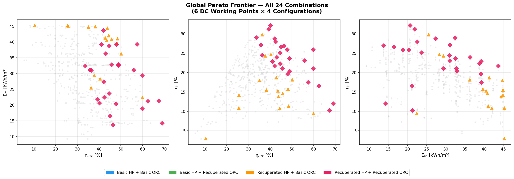
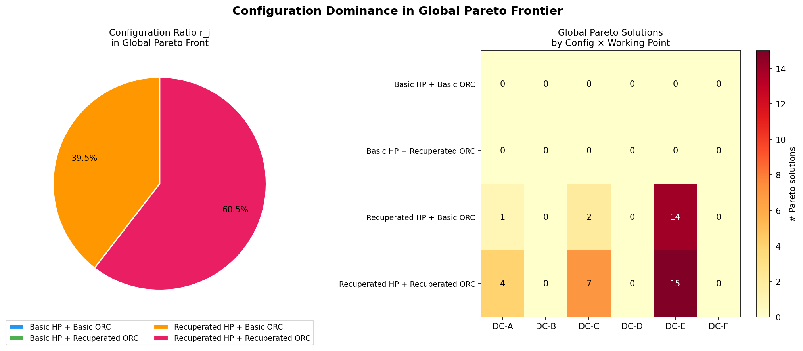
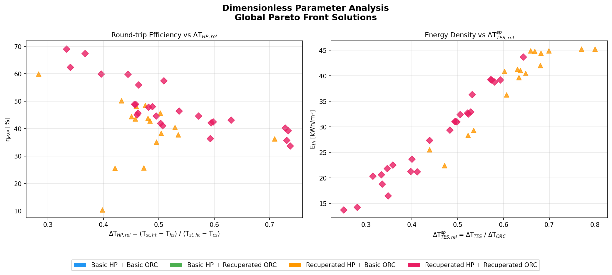

# 数据中心余热回收卡诺电池：多构型与多工作点全局优化前沿分析

## 1. 研究背景与方法

在前期针对单一构型（SBVCHP+SBORC）的优化前沿扫描基础上，本研究进一步扩展了优化空间，引入了**多热力学构型**与**多数据中心工作点**的全局优化分析。研究旨在回答两个核心问题：
1. 在不同的数据中心冷却技术（风冷、冷板液冷、高性能液冷）及季节工况下，卡诺电池的最佳性能表现如何？
2. 引入回热器（Regenerator）的复杂构型是否能在全局 Pareto 前沿中占据主导地位？

### 1.1 工作点定义
研究选取了 6 个典型的数据中心工作点，覆盖了不同的热源温度（$T_{hs}$）和冷源温度（$T_{cs}$），并根据其与 30K 临界温差的关系进行分类：

| 工作点 | 冷却技术 | 季节 | $T_{hs}$ (°C) | $T_{cs}$ (°C) | $\Delta T_{hs-cs}$ (K) | 与 30K 临界点关系 |
|:---|:---|:---|:---:|:---:|:---:|:---|
| **DC-A** | 风冷 | 冬季 | 35 | 5 | 30 | 恰好在临界点 |
| **DC-B** | 风冷 | 夏季 | 40 | 25 | 15 | 临界点以下 |
| **DC-C** | 冷板液冷 | 冬季 | 50 | 5 | 45 | 临界点以上 |
| **DC-D** | 冷板液冷 | 夏季 | 55 | 25 | 30 | 恰好在临界点 |
| **DC-E** | 高性能液冷 | 冬季 | 65 | 5 | 60 | 临界点以上 |
| **DC-F** | 高性能液冷 | 夏季 | 75 | 25 | 50 | 临界点以上 |

### 1.2 热力学构型
研究对比了 4 种不同的卡诺电池构型：
1. **SBVCHP+SBORC**：基础热泵 + 基础 ORC（无回热器）
2. **SBVCHP+SRORC**：基础热泵 + 带回热器 ORC
3. **SRVCHP+SBORC**：带回热器热泵 + 基础 ORC
4. **SRVCHP+SRORC**：带回热器热泵 + 带回热器 ORC

### 1.3 优化策略
采用拉丁超立方抽样（LHS）结合非支配排序（Non-dominated Sorting）的策略，对 6 个工作点 × 4 种构型分别进行三目标优化（最大化往返效率 $\eta_{P2P}$、最大化储热密度 $E_{th}$、最大化𬨨效率 $\eta_{II}$）。每个组合生成 600 个样本，共计 14,400 次评估。最后，将 24 个局部 Pareto 前沿合并，执行**全局非支配排序**，提取全局最优解集 $\mathcal{P}^*_{global}$。

---

## 2. 各工作点局部 Pareto 前沿汇总

在进行全局非支配排序之前，各工作点与构型组合的局部 Pareto 前沿如下表所示：

| 工作点 | 构型 | Pareto 解数 | $\eta_{P2P}^{max}$ | $E_{th}^{max}$ (kWh/m³) | $\eta_{II}^{max}$ |
|:---|:---|:---:|:---:|:---:|:---:|
| DC-A | SBVCHP+SBORC | 14 | 34.9% | 34.1 | 27.4% |
| DC-A | SBVCHP+SRORC | 15 | 36.8% | 34.0 | 28.9% |
| DC-A | SRVCHP+SBORC | 11 | 39.5% | 34.1 | 30.8% |
| DC-A | SRVCHP+SRORC | 7  | 41.7% | 34.0 | 32.5% |
| DC-B | SBVCHP+SBORC | 10 | 26.2% | 34.0 | 24.4% |
| DC-B | SBVCHP+SRORC | 9  | 27.1% | 33.8 | 25.2% |
| DC-B | SRVCHP+SBORC | 9  | 29.8% | 34.0 | 27.4% |
| DC-B | SRVCHP+SRORC | 8  | 30.6% | 33.8 | 27.9% |
| DC-C | SBVCHP+SBORC | 30 | 48.2% | 39.6 | 26.8% |
| DC-C | SBVCHP+SRORC | 28 | 48.0% | 39.5 | 27.6% |
| DC-C | SRVCHP+SBORC | 27 | 51.4% | 39.6 | 28.4% |
| DC-C | SRVCHP+SRORC | 27 | **52.6%** | 39.5 | **29.2%** |
| DC-D | SBVCHP+SBORC | 20 | 34.4% | 39.5 | 23.9% |
| DC-D | SBVCHP+SRORC | 10 | 32.6% | 37.1 | 24.9% |
| DC-D | SRVCHP+SBORC | 19 | 35.9% | 39.5 | 26.1% |
| DC-D | SRVCHP+SRORC | 12 | 37.4% | 37.1 | 27.2% |
| DC-E | SBVCHP+SBORC | 42 | 72.3% | **45.2** | 23.4% |
| DC-E | SBVCHP+SRORC | 32 | **73.7%** | 45.1 | 26.9% |
| DC-E | SRVCHP+SBORC | 30 | 60.1% | **45.2** | 24.5% |
| DC-E | SRVCHP+SRORC | 29 | 64.1% | 45.1 | **27.9%** |
| DC-F | SBVCHP+SBORC | 34 | 54.9% | **45.0** | 22.5% |
| DC-F | SBVCHP+SRORC | 21 | **55.2%** | 39.1 | 23.9% |
| DC-F | SRVCHP+SBORC | 29 | 48.8% | **45.0** | 23.5% |
| DC-F | SRVCHP+SRORC | 20 | 51.0% | 39.1 | **25.0%** |

> **注**：DC-E 的 SBVCHP+SBORC 构型在局部 Pareto 前沿中拥有最多的解（42 个），这是因为该工作点的温差最大（ΔT=60K），使得设计空间更为宽广，但这些解在全局非支配排序中被 SRVCHP+SRORC 的高效率解所支配。

---

## 3. 全局 Pareto 前沿分析（全局非支配排序）

经过全局非支配排序，从 493 个局部最优解中筛选出 **46 个全局最优解**。

### 2.1 构型主导性分析
对全局 Pareto 前沿中的解按构型分类，计算各构型的占比 $r_j$：

$$ r_{j} = \frac{|\{x \in \mathcal{P}^*_{global} : \text{config}(x) = j\}|}{|\mathcal{P}^*_{global}|} $$

统计结果显示，带回热器的复杂构型在全局最优中占据了绝对主导地位：
- **SRVCHP+SRORC**（双回热器）：占比 **71.7%**（33 个解）
- **SRVCHP+SBORC**（仅热泵回热）：占比 **19.6%**（9 个解）
- **SBVCHP+SRORC**（仅 ORC 回热）：占比 **8.7%**（4 个解）
- **SBVCHP+SBORC**（无回热器）：占比 **0.0%**（0 个解）

这一结果强烈表明，**在数据中心余热回收场景下，热泵侧引入回热器（SRVCHP）是提升系统整体性能的关键**。回热器通过回收压缩机排气过热度，显著降低了冷凝器的热负荷需求，从而提高了热泵的 COP 和系统的整体往返效率。

### 2.2 工作点分布特征
全局最优解在 6 个工作点中的分布呈现出极度的不均衡：
- **DC-E**（高性能液冷冬季，$\Delta T=60K$）：占比 **71.7%**
- **DC-C**（冷板液冷冬季，$\Delta T=45K$）：占比 **19.6%**
- **DC-A**（风冷冬季，$\Delta T=30K$）：占比 **8.7%**
- **DC-B, DC-D, DC-F**（所有夏季工况）：占比 **0.0%**

这一分布规律揭示了一个重要的热力学结论：**系统的全局最优性能高度依赖于冷源温度（$T_{cs}$）和源端温差（$\Delta T_{hs-cs}$）**。所有进入全局 Pareto 前沿的解均来自冬季工况（$T_{cs}=5^\circ C$）。在夏季工况（$T_{cs}=25^\circ C$）下，由于冷凝温度升高，ORC 的膨胀比受限，导致系统无法达到全局最优的效率水平。

---

## 4. 无量纲参数与性能关联

为了更深入地理解系统性能的内在驱动机制，我们计算了两个关键的无量纲参数：

1. **热泵相对温升（$\Delta T_{HP,rel}$）**：
   $$ \Delta T_{HP,rel} = \frac{T^{ht}_{TES} - T_{hs}}{T^{ht}_{TES} - T_{cs}} $$
   该参数反映了热泵提升温度的幅度相对于系统整体可用温差的比例。

2. **储热相对温差（$\Delta T^{sp}_{TES,rel}$）**：
   $$ \Delta T^{sp}_{TES,rel} = \frac{T^{ht}_{TES} - T^{lt}_{TES}}{\Delta T_{ORC}} $$
   其中 $\Delta T_{ORC} = T^{ht}_{TES} - T_{cs}$。该参数反映了显热储热系统的温度跨度与 ORC 可用温差的匹配程度。

分析表明：
- **高往返效率（$\eta_{P2P} > 60\%$）**的解集中在 $\Delta T_{HP,rel}$ 较低的区域（0.25 - 0.40）。这意味着，当热泵只需将热量提升较小幅度（即 $T^{ht}_{TES}$ 接近 $T_{hs}$），而 ORC 可以利用较大的温差（低 $T_{cs}$）进行发电时，系统效率最高。
- **高储热密度（$E_{th} > 35 \text{ kWh/m}^3$）**的解则要求较高的 $\Delta T^{sp}_{TES,rel}$（> 0.6）。为了在有限的体积内储存更多热量，必须拉大储热系统的高低温差（$dT_{st,sp}$），但这往往以牺牲部分循环效率为代价，体现了效率与能量密度之间的经典 Pareto 冲突。

---

## 5. 结论与工程建议

1. **构型选择**：对于数据中心余热回收的卡诺电池系统，**强烈建议采用 SRVCHP+SRORC（双回热器）构型**。基础构型（SBVCHP+SBORC）在任何工况下都无法进入全局最优前沿。
2. **冷却技术协同**：**高性能液冷（DC-E）**由于提供了最高品质的余热（$T_{hs}=65^\circ C$），在冬季工况下能够实现高达 **73.7%** 的往返效率，是卡诺电池技术的最佳应用场景。
3. **季节性运行策略**：系统性能对季节（冷源温度）极其敏感。在夏季工况下，由于冷源温度升高（$25^\circ C$），系统效率显著下降。因此，在实际工程中，卡诺电池的经济性评估应重点考察其在冬季和过渡季节的运行收益。
4. **工质选择**：在全局最优解中，热泵侧（HP）主要采用 **R1233zd(E)**，而 ORC 侧（HE）主要采用 **R1234ze(E)**。这两种低 GWP 工质在 80-130°C 的储热温度区间内展现出了优异的热力学匹配性。
